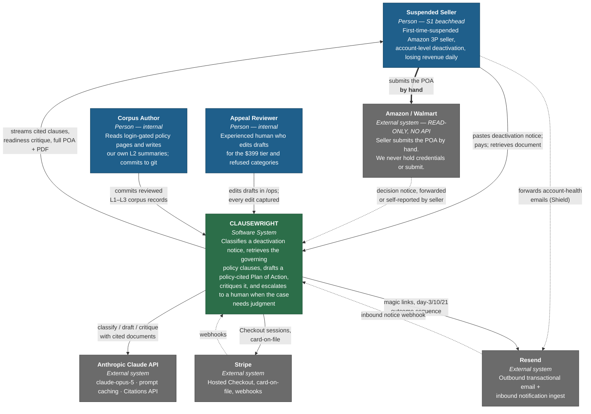
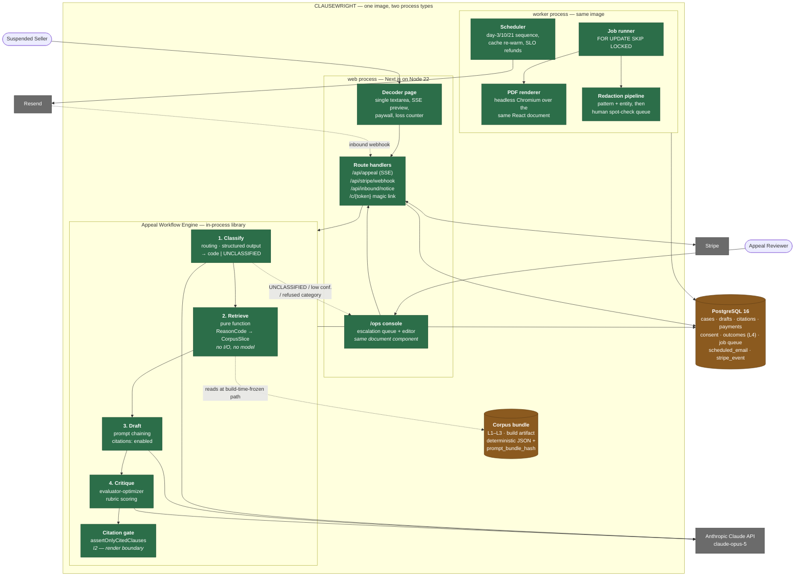
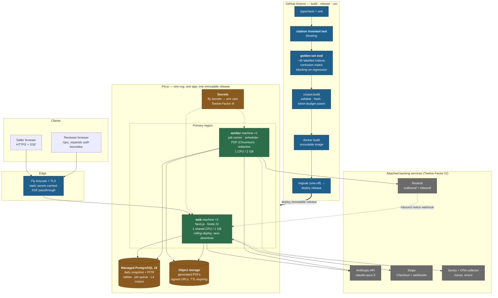

# CLAUSEWRIGHT — SYSTEM ARCHITECTURE (v1)

**Product:** Clausewright — *Suspension Defense Copilot for Amazon and Walmart sellers*
**Tagline:** *"Every day dark costs you a day's sales. Get back to selling — with the exact policy clause on your side."*
**Document owner:** System architect
**Date:** 2026-08-12
**Status:** Binding for the Phase-2 build. Amendments require a named source and a note of what they supersede.

**Upstream sources (treated as inputs, not re-derived):**
- `/home/user/Octopus/phase-1-ideation/IDEA_DOSSIER.md` — the single source of truth, especially §0 decisions **D1–D10**, the BUILD list **B1–B11**, the DO-NOT-BUILD list **N1–N14**, and the risk register **R1–R16**.
- `/home/user/Octopus/phase-2-build/identity/NAMING.md` — name, tagline, category frame, and the seven binding naming invariants.
- Deep dives `01`–`04` in `/home/user/Octopus/phase-1-ideation/research/`.

---

## 0. The five architectural invariants

Everything in this document is elaboration. These five are the calls, and each traces to a binding Phase-1 decision.

| # | Invariant | Enforced by | Traces to |
|---|---|---|---|
| **I1** | **This is a workflow, not an agent.** Four fixed stages — classify → retrieve → draft → critique — with control flow in code, never in the model. No autonomous loop, no dynamic tool selection, no self-directed planning. | The pipeline is a typed function composition (`§3.2`). Adding an agent loop requires an ADR superseding **ADR-002**. | D9; Anthropic, [*Building Effective Agents*](https://www.anthropic.com/engineering/building-effective-agents) — workflows "orchestrate LLMs and tools through predefined code paths"; "find the simplest solution possible" |
| **I2** | **No policy reference reaches the UI unless it arrived inside a Citations API citation object.** Not a prompt instruction — a render gate plus a CI test. | `assertOnlyCitedClauses()` at the render boundary + `citations.invariant.test.ts` in CI (`§3.4`, **ADR-004**). | B4, R4; Anthropic [Citations](https://platform.claude.com/docs/en/build-with-claude/citations); NAMING.md §3.3 — "the invariant fails the build before it fails a customer" |
| **I3** | **No vector database, no chunking, no fine-tuning in v1.** The whole curated corpus rides in a prompt-cached prefix; retrieval is a code-keyed lookup on the reason code. | The corpus build step emits one deterministic, content-hashed prefix (`§3.3`, **ADR-003**). | D9, N5, N6; Anthropic [prompt caching](https://platform.claude.com/docs/en/build-with-claude/prompt-caching) — cache reads at **0.1×** base input |
| **I4** | **No credential handling, no automated submission, no SP-API in v1.** The system never holds a Seller Central session, cookie, or password, and never posts on the seller's behalf. | There is no code path that accepts a marketplace credential. Monitoring is an inbound-email adapter (**ADR-006**). | N1, N2, N3, N11; §8.4(b) — the hiQ contract lesson |
| **I5** | **A misclassification escalates to a human; it never guesses.** `UNCLASSIFIED` and low-confidence outcomes are first-class terminal states that route to the $399 tier, not fallbacks that produce a document anyway. | Discriminated union return type from the classifier; the draft stage is unreachable without a `Classified` value (**ADR-002**). | R3, B2, B8 — "this turns the worst failure mode into the differentiated revenue line" |

Everything else in this architecture is negotiable under schedule pressure. Per **D10**, the one component that is *not* cuttable is **B9, the consent-gated outcome corpus** (`§3.7`, **ADR-008**) — it is the only part whose value compounds.

---

## 1. Architecture at a glance

Clausewright v1 is **one deployable artifact** running **two process types** against **one Postgres database**, calling **one external model API** and **two external SaaS backing services** (Stripe, Resend). There is no message broker, no cache server, no vector store, no microservice mesh, and no second language runtime.

```
paste notice → classify → retrieve → draft → critique → PREVIEW (free) → pay → full POA
                    │                                        │
                    └── UNCLASSIFIED / low confidence ───────┴──→ human escalation ($399)
```

The free preview is not a growth hack — per **§7.1** of the dossier, **A4 is a comparative assumption**, so the differentiator (classified reason code, cited clauses, readiness critique) must be visible *before* the paywall or the experiment is confounded. The paywall therefore sits between the critique and the full document. That is an architectural constraint, and it is why the pipeline is designed so that the first three stages produce a complete, renderable, sellable artifact on their own.

**Sizing reality check.** The dossier's base case exits day 90 at ~65 paying customers/month and ~650 free Decoder sessions/month (§6.7). That is roughly **one classified session every forty minutes**. Any architecture that requires horizontal scaling, sharding, a queue broker, or a caching tier at this volume is over-built by two orders of magnitude, and the cost of that over-building is measured in the thing we actually lack — days. Per Dan McKinley's *Choose Boring Technology*, we have a small budget of "innovation tokens," and every one of them is already spent on the retrieval-and-citation design, which is the part customers pay for.

---

## 2. Chosen stack, with justification

### 2.1 The stack

| Layer | Choice | Why this and not the alternative |
|---|---|---|
| **Language / runtime** | TypeScript (strict) on Node 22 LTS | One language across web, workflow, corpus tooling and evals. A second runtime (e.g. Python for the pipeline) buys nothing here — the Anthropic TypeScript SDK is first-party and complete — and costs a second dependency graph, a second CI lane and a second deploy. Twelve-Factor **II (Dependencies)**: one explicit manifest. |
| **Web framework** | Next.js (App Router) — server components, route handlers, streaming responses | The product is one page with a streaming preview and a paywall. Server-side streaming (SSE over a route handler) is native, so the preview renders token-by-token without a bespoke websocket layer. Boring: the most heavily trodden path in the ecosystem. |
| **Database** | PostgreSQL 16 (managed) | Single backing service for relational data, the outcome corpus, the job queue (`FOR UPDATE SKIP LOCKED`), the scheduler ledger and full-text search if we ever need it. **ADR-005.** Postgres is the canonical "one innovation token saved" choice. |
| **DB access** | Drizzle ORM + `drizzle-kit` migrations | Typed schema in the same language as the app; migrations are plain SQL files in version control, applied as a Twelve-Factor **XII (Admin processes)** one-off run in the same release image. |
| **LLM** | Anthropic **`claude-opus-5`** via `@anthropic-ai/sdk` — **for the drafting stage. ⚠️ SUPERSEDED in part by `LLM_ENGINE.md` ADR-101:** stages 1 (classify) and 4 (critique) run on `claude-sonnet-5`; stage 3 (draft) remains `claude-opus-5`. | The single-model rule below is retained for the record: splitting stages across model tiers to save cents would (a) fragment the prompt cache — caches are model-scoped — and (b) trade the thing we sell for a negligible cost (`§6`). **ADR-101 accepts (b) and dissolves (a)**: with per-stage corpus slices there is no single shared prefix to fragment, and the decision moves to latency (stage 1 is on the critical path) and risk allocation (stage 3 is the call that can burn a customer's appeal). $5 / $25 per MTok on Opus 5, $2 / $10 on Sonnet 5; cache reads at 0.1×. |
| **Payments** | Stripe Checkout (hosted) + webhooks + Customer/SetupIntent for card-on-file | **ADR-007.** No PAN, CVV or PCI scope ever touches our infrastructure. Hosted Checkout is the minimum-surface way to satisfy **D6** (30 days of Shield included, card on file). |
| **Transactional email** | Resend (send) + inbound webhook (receive) | Magic-link retrieval, the day-3/10/21 outcome sequence (**B9**), and — critically — the *inbound* address that makes monitoring possible without SP-API (**ADR-006**). One vendor for both directions. |
| **PDF** | Server-side rendering of the same React document component via a headless-Chromium renderer in the worker process | The branded PDF and the on-screen document must never diverge — divergence is a citation-invariant leak vector. One component, two renderers. |
| **Hosting** | Fly.io — one image, two process groups (`web`, `worker`), one managed Postgres | **ADR-001.** Long-running model calls, a cron-driven email sequence, and inbound webhooks all in one place, with no per-invocation timeout ceiling to design around. |
| **Observability** | Structured JSON logs to stdout + OpenTelemetry traces + Sentry | Twelve-Factor **XI (Logs)**: "treat logs as event streams" — the app never writes or routes a log file; it writes to stdout and the platform aggregates. |
| **CI** | GitHub Actions: typecheck → unit → **citation invariant** → **golden-set eval** → build → deploy | **B10**. Without evals in CI "every prompt change is a coin flip." |

### 2.2 Justification against the Twelve-Factor App

The [Twelve-Factor App](https://12factor.net/) is the governing methodology for the deployment shape. Factor by factor:

| Factor | How Clausewright satisfies it | Why it matters *here* specifically |
|---|---|---|
| **I. Codebase** | One repo, many deploys (preview / production) from the same commit. | The corpus (`corpus/`), the prompts (`prompts/`), the app and the evals are one versioned unit — so a corpus change is a reviewable, revertable, CI-gated commit, not a database edit. This is what makes **ADR-008**'s corpus-release attribution possible. |
| **II. Dependencies** | Explicit `package.json` + lockfile; no reliance on system-wide packages. Chromium for PDF is pinned in the image, not assumed on the host. | |
| **III. Config** | *Everything* that varies between deploys is an env var: `ANTHROPIC_API_KEY`, `DATABASE_URL`, `STRIPE_SECRET_KEY`, `STRIPE_WEBHOOK_SECRET`, `RESEND_API_KEY`, `APP_BASE_URL`, `CORPUS_CACHE_TTL`. Zero secrets in the repo. A boot-time schema validation (Zod) fails fast on a missing or malformed var. | This is what makes the staging/production split safe when a live Stripe transaction is part of the Day-5 acceptance test (§7.6). |
| **IV. Backing services** | Postgres, Stripe, Resend and the Anthropic API are all attached resources addressed by URL/credential in config. Swapping managed Postgres providers is a config change. | The **monitoring ingest source is deliberately modelled as an attached service behind an interface** (`NoticeSource`), so the eventual SP-API implementation (**N1**, post-v1) is a new adapter, not a re-architecture. |
| **V. Build, release, run** | `build` produces an immutable image *including the compiled corpus bundle and its content hash*; `release` binds it to config; `run` executes it. Releases are immutable and numbered; rollback is redeploying a previous release. | The corpus hash being baked at **build** time — not read at run time — is what guarantees an outcome can be attributed to an exact corpus version (**ADR-008**) and what keeps the prompt prefix byte-stable for caching (**ADR-003**). |
| **VI. Processes** | Stateless, share-nothing. No session affinity, no in-memory job state, no local file writes that outlive a request. Draft state lives in Postgres; generated PDFs are streamed or stored in object storage, never on the local disk. | A restart mid-appeal must not lose a paid customer's document. Every stage output is persisted before the next stage starts. |
| **VII. Port binding** | The web process is self-contained and exports HTTP by binding a port; no external web server is injected. | |
| **VIII. Concurrency** | Two process types — `web` (request/response + SSE) and `worker` (email sequence, PDF generation, corpus re-warm, inbound-notice processing) — scaled independently via the process formation. | Twelve-Factor's process model is precisely the right decomposition here: it gives us background work **without** introducing a broker (**ADR-005**). |
| **IX. Disposability** | Fast boot (the corpus bundle is a build artifact, not a startup fetch); SIGTERM drains in-flight SSE streams and returns unfinished jobs to the queue. | An interrupted draft must be resumable, because the seller is mid-panic and will not paste twice. |
| **X. Dev/prod parity** | Same image, same Postgres major version, same Stripe API version pinned, same model ID pinned. Dev uses Stripe test mode and a Resend sandbox domain. | The one deliberate disparity: dev/CI runs the pipeline against **recorded model responses** for the golden set, so evals are deterministic and free. Live-model evals run nightly, not per-commit. |
| **XI. Logs** | Event streams to stdout. Every log line carries `case_id`, `stage`, `corpus_release`, `model_id`, `prompt_bundle_hash`, and cache-hit token counts. | Cache-hit accounting (`usage.cache_read_input_tokens`) is an *operational* metric here, not a curiosity: a silent cache invalidation is a 10× cost regression with no functional symptom (**ADR-003**). |
| **XII. Admin processes** | Migrations, corpus re-index, redaction backfill and eval runs are one-off processes executed in an identical release image. | |

### 2.3 Justification against boring-technology principles

Dan McKinley's *Choose Boring Technology* frames the decision as a budget: an organisation gets roughly three "innovation tokens," and spending one means accepting the long tail of unknown failure modes that a well-understood technology has already retired.

Our tokens are spent, deliberately, on exactly two things:

1. **The prompt-cached corpus retrieval design** (**ADR-003**) — genuinely novel, genuinely load-bearing, and the reason the product can exist at a $149 price with a five-day build.
2. **The citation invariant as a code-level gate** (**ADR-004**) — novel in this category, and the entire brand promise (NAMING.md §3.3).

Everything else is chosen to be aggressively unremarkable: Postgres, a hosted Postgres provider, Stripe Checkout, a single container, cron, SSE. The judgement to apply is McKinley's own — *"the problem with 'best tool for the job' thinking is that it takes a myopic view."* A best-in-class queue broker is a better queue than Postgres in the abstract; it is a worse choice for a system that will process thirty jobs a day and whose binding constraint is the number of days until first revenue.

**Explicitly rejected, and why:**

| Rejected | Reason |
|---|---|
| Vector database (Pinecone / pgvector / Chroma) | **N5, ADR-003.** The v1 corpus is a few hundred records that fit in a cached prompt. A vector DB adds an embedding pipeline, a chunking strategy, a similarity-tuning problem and a second failure mode, to solve a retrieval problem that a `Map<ReasonCode, CorpusSlice>` solves exactly. |
| Redis / SQS / Kafka | **ADR-005.** At ~30 jobs/day, `SELECT … FOR UPDATE SKIP LOCKED` is a correct, durable, transactional queue that shares the database's backup and failover story. |
| Microservices | One team of agents plus one founder, one deployable. Service boundaries would be invented before the domain boundaries are known. |
| A second Python runtime for the pipeline | The pipeline is four HTTP calls and a schema validator. |
| Kubernetes | See sizing, §1. |
| Fine-tuning | **N6.** Per Karpathy's [*Software 2.0*](https://karpathy.medium.com/software-2-0-a64152b37c35), the dataset is the artifact — but it does not follow that the dataset must be compiled into weights. At this corpus size, retrieval plus prompting dominates on iteration speed, cost, auditability, **and the ability to cite** (which fine-tuning destroys — a fine-tuned model has no source document to point at, so **I2** would become unenforceable). |
| Custom auth / user accounts | **N4.** A magic-link retrieval URL covers 100% of the real need for a single-session panic purchase. |

---

## 3. Component breakdown

### 3.1 Web app (`B1`, `B7`)

A single route (`/`) with one `<textarea>` and one button, plus a magic-link retrieval route (`/c/{token}`) and an ops console behind a separate auth boundary (`/ops`, `§3.6`).

- **No signup, no dashboard, no navigation** before payment. Email is captured only at Stripe Checkout. Every field before the paywall is a conversion tax on a buyer who is mid-panic (Nielsen heuristic #8, *aesthetic and minimalist design*; heuristic #2, *match between system and the real world* — the UI says "policy clause" and "your account went dark," never "POA" or "Plan of Action," per NAMING.md §5 invariant 2 and the D3 category exit).
- **Streaming preview.** `POST /api/appeal` opens a Server-Sent Events stream. The client renders each stage as it completes: reason code → cited clauses → readiness critique → first section of the draft. This is Nielsen heuristic #1, *visibility of system status*, applied to a 40–90 second pipeline: an unnarrated wait of that length reads as a hang. The stage boundaries are the natural progress checkpoints, so no fake progress bar is required (and per Hormozi, we never manufacture urgency — the loss counter shows real elapsed downtime × the seller's own stated daily revenue, and nothing else).
- **The loss counter.** `days_dark × self_reported_daily_revenue`, displayed as a factual statement with the seller's own inputs visible and editable. Per **§1.3**, this arithmetic is the offer; the seller performs it unprompted, and our only job is to not get in the way.
- **Liquid Glass alignment.** Per Apple's [Human Interface Guidelines](https://developer.apple.com/design/human-interface-guidelines/), the visual system uses a single translucent material layer for the result surfaces with content-first contrast, and the wordmark renders as one unbroken lowercase token (`clausewright`) so it survives at icon and label sizes (NAMING.md §3.5). Concrete tokens are the identity workstream's output, not this document's.
- **Accessibility as an invariant, not a polish item:** the cited-clause component must be readable by a screen reader as *quotation plus attribution*, because the citation is the product.

### 3.2 Appeal workflow engine (`B2`, `B3`, `B5`, `B6`)

The heart of the system, and the component where the "workflow, not agent" discipline is enforced.

```ts
// Shape, not final code. The point is that control flow lives here, in code.
type PipelineResult =
  | { kind: 'drafted'; classification: Classified; clauses: CitedClause[]; draft: Poa; critique: Critique }
  | { kind: 'escalate'; reason: 'unclassified' | 'low_confidence' | 'refused_category'; detail: string };

async function runAppeal(notice: NoticeDocument, ctx: Ctx): Promise<PipelineResult> {
  const c = await classify(notice, ctx);              // ROUTING
  if (c.kind !== 'classified') return escalate(c);    // I5 — the union makes drafting unreachable
  if (REFUSED_CATEGORIES.has(c.code)) return escalate({ ... }); // honest triage, before payment
  const slice = selectCorpusSlice(c.code);            // RETRIEVAL — pure, in-process, no I/O
  const draft = await generateDraft(notice, slice, ctx);        // PROMPT CHAINING
  const critique = await critiqueDraft(draft, slice, ctx);      // EVALUATOR-OPTIMIZER
  return { kind: 'drafted', classification: c, clauses: draft.clauses, draft, critique };
}
```

Three of Anthropic's named workflow patterns, composed in code:

| Stage | Pattern | Model configuration | Notes |
|---|---|---|---|
| **1. Classify** (`B2`) | **Routing** — "classifies an input and directs it to a specialized followup task" | `output_config.format` (JSON Schema, strict), `output_config.effort: "medium"` | ~20–30 reason codes across Amazon (Section 3, inauthentic, IP complaint, safety, restricted product, ODR, late shipment, linked account, dropship, review manipulation, verification) and Walmart performance-standard equivalents. Emits `{ code, confidence, evidence_spans[] }` and a **first-class `UNCLASSIFIED`**. Structured outputs are used here precisely *because* citations are not needed at this stage — the two features are mutually exclusive on one call (see below). |
| **2. Retrieve** (`B3`) | *(not a model call)* | — | Pure function: `ReasonCode → { policyDocs[], patternDocs[], taxonomyRecord }`. Deterministic, unit-testable, zero latency, zero cost. The retrieval-augmented framing is Lewis et al. 2020 ([arXiv:2005.11401](https://arxiv.org/abs/2005.11401)) — retrieval-augmented generation produces *"more specific, diverse and factual language than a state-of-the-art parametric-only seq2seq baseline."* Factuality is the axis we sell; **the retriever being dumb and deterministic is a feature**, because a mis-retrieval here would be invisible to the citation gate. |
| **3. Draft** (`B5`) | **Prompt chaining** — "decomposes a task into a sequence of steps, where each LLM call processes the output of the previous one" | `citations: { enabled: true }` on every document block; **no** `output_config.format`; `effort: "high"`; adaptive thinking (on by default on Opus 5); `max_tokens` sized for thinking **plus** a 3-part document | Produces the three-part POA — root cause / immediate corrective actions / preventive measures — specialised per reason code. Walmart's own guidance requires "a written business plan of action describing the violation and the steps you plan to take," so the same three-part skeleton serves both marketplaces. |
| **4. Critique** (`B6`) | **Evaluator-optimizer** — "one LLM call generates a response while another provides evaluation and feedback in a loop" | `output_config.format` (rubric JSON), `effort: "high"` | Scores the draft against the per-code rubric and names concrete deficiencies: *"no supplier invoices referenced," "no measurable preventive control," "apologetic tone / blames Amazon."* **Shown free, pre-paywall.** This is the visible proof of quality that makes A4 testable and the part a generic chat prompt does not produce. |

**Two API constraints that shaped this design, both worth stating explicitly:**

1. **Citations and structured outputs are mutually exclusive on a single call** — enabling `citations` alongside `output_config.format` returns a 400. This is *why* the pipeline is **three model calls** (stage 2 is a pure function, not a model call) rather than one: stages 1 and 4 need machine-parseable structure, stage 3 needs citations, and they cannot be merged. A single-call design would force us to choose between the invariant (**I2**) and parseability, and the invariant wins every time.
2. **On `claude-opus-5`, thinking is on by default** and `max_tokens` caps thinking *plus* response text. Every stage therefore sets `max_tokens` with explicit headroom, and the pipeline treats `stop_reason === 'max_tokens'` as a hard failure that retries at a higher ceiling rather than shipping a truncated document. A truncated POA is worse than no POA — it burns the seller's one attempt.

**No agent loop (N7).** Agentic systems "trade latency and cost for better task performance," and are worth it "only when simpler approaches fail." Ours is a fixed four-stage pipeline over a known taxonomy. There is no open-ended search, no unbounded tool surface, and no task the model must decompose for itself. Adding a loop would add latency to a product whose Time-Delay term already scores 9/10 (§6.1) — optimising a term that is already at 9 while **Perceived Likelihood sits at 3** is exactly the misallocation **D7** forbids.

**Revisions.** "Unlimited revisions" (the $149 tier) re-runs stages 3–4 only, with the prior draft and the seller's revision note appended. The classification and the retrieved slice are frozen for the life of a case, so a revision can never silently change which policy the document argues under.

### 3.3 Corpus store (`§8`, `ADR-003`, `ADR-008`)

Four layers, two very different storage strategies.

| Layer | Content | Storage | Volume at launch |
|---|---|---|---|
| **L1 — Reason-code taxonomy** | Canonical name, notice trigger phrases, required evidence, typical failure modes | **Version-controlled files in the repo** (`corpus/l1/*.yaml`), typed and schema-validated at build | 20–30 records |
| **L2 — Policy summaries** | **Our own** structured summary of each governing policy, keyed to a canonical clause id + source URL | Repo (`corpus/l2/*.yaml`) | 30–60 records |
| **L3 — Structural appeal patterns** | Per code: what a strong root-cause / corrective / preventive section contains; anti-patterns | Repo (`corpus/l3/*.yaml`) | 20–30 records |
| **L4 — Outcome corpus** | Consented, redacted `(notice → draft → reported outcome)` triples | **Postgres** — mutable, consent-gated, per-record deletable | **0 at launch** |

**Why L1–L3 live in git and not in the database.** They are *code* in the Software 2.0 sense: they define model behaviour, they must be reviewed before they change behaviour, they must be revertable, and — decisively — they must be **byte-stable** to keep the prompt cache warm (**ADR-003**). A corpus edited through an admin UI is a corpus that silently invalidates the cache and silently changes the product, with no diff and no reviewer.

**Why L4 lives in Postgres.** It is per-subject data with consent, retention and deletion obligations (§8.4(d)). It must be deletable on request, per record, without a code deploy. It is also, per **D10** and Helmer's *7 Powers*, the only component whose value compounds — so it is designed for a query pattern nothing else in v1 needs: *"for reason code X, which drafted features co-occur with reported reinstatement, and at what n?"*

**The build step.** `npm run corpus:build`:
1. Loads and schema-validates every L1–L3 record (hard-fails on an L2 record missing `clause_id` or `source_url` — the citation invariant depends on those fields existing).
2. Serialises deterministically (sorted keys, stable ordering, normalised line endings) — a non-deterministic serialisation is a silent cache invalidator.
3. Emits `corpus/dist/bundle.json` plus a **SHA-256 `prompt_bundle_hash`** and a monotonic `corpus_release` id.
4. Asserts the bundle's token count against a budget ceiling (`count_tokens`, not a character heuristic) and fails the build if it exceeds it.

The hash and release id are baked into the image and stamped onto **every case row** (**ADR-008**). That is what turns "we use RAG" into a measurable Process Power loop rather than an assumption (§5.5).

**L2 is human-authored — and that is a legal control, not a shortcut.** The authoritative Seller Central policy text is login-gated (§8.2), and automating access behind that login is a **bright line** (**N11**, **I4**): the account holder has affirmatively accepted the Business Solutions Agreement, which converts a scraping question into a breach-of-contract question with a counterparty who can also terminate the account. *hiQ v. LinkedIn* is the cautionary case — hiQ won the CFAA question and still lost on contract. So a human with a legitimate Professional seller account reads the pages and writes **our own summaries**, keyed to a clause id and a source URL.

The convenient consequence, per §8.4(c): because the Citations API cites from *the documents we supply*, and our documents are our own prose, the user-facing `cited_text` is **our summary plus a pointer to the authoritative source** — lower copyright exposure than reproducing platform boilerplate (the *Thomson Reuters v. Ross* fact pattern — *recalled, not verified; verify with counsel*) **and** better UX. The architecture and the legal posture point the same way here, which is rare and worth banking.

### 3.4 Citation enforcement layer (`B4`, `I2`, `ADR-004`)

The single most important 60 lines in the system.

```ts
// Every policy reference in the rendered document must be traceable to a citation object.
type CitedClause = {
  citedText: string;          // from citation.cited_text — never model-authored prose
  documentTitle: string;      // from citation.document_title
  clauseId: string;           // resolved from documentIndex → corpus record
  sourceUrl: string;          // resolved from documentIndex → corpus record
  location: { startChar: number; endChar: number };  // citation.char_location
};

// Render gate: strips any policy-shaped span not backed by a citation object.
function assertOnlyCitedClauses(blocks: ContentBlock[]): CitedClause[] { /* … */ }
```

Mechanics: documents are passed with `citations: { enabled: true }` (all documents in a request or none). The response splits into multiple `text` blocks; cited blocks carry a `citations` array whose entries hold `cited_text`, `document_index`, `document_title` and a `char_location` (`start_char_index` / `end_char_index`) for plain-text sources. We map `document_index` back to the corpus record that produced it, and *that* record supplies `clause_id` and `source_url`.

**Three enforcement points, because one is a promise and three are a system:**
1. **Extraction** — clause objects are constructed *only* from citation objects. There is no code path that constructs a `CitedClause` from model prose.
2. **Render gate** — the document renderer accepts `CitedClause[]`, never raw strings, for the policy-reference slot. A policy-shaped span in the free-text body that lacks a backing citation is stripped before render, and the strip is logged as a `citation_leak` metric (a rising rate is a prompt regression signal).
3. **CI test** — `citations.invariant.test.ts` runs the golden set through the pipeline with recorded responses, injects an adversarial "uncited clause" fixture, and asserts it never reaches rendered output. This test failing blocks the deploy.

Per NAMING.md §3.3: this makes Clausewright *"the rare brand promise that cannot silently rot — the invariant fails the build before it fails a customer."* It is also the Twelve-Factor discipline of making guarantees structural rather than procedural: the promise lives in the codebase and its test suite, not in a runbook.

### 3.5 Billing (`B7`, `ADR-007`)

- **Stripe Checkout (hosted)** for both `Rescue` ($149) and `Rescue + Human` ($399). Hosted, so no card data touches us and PCI scope is SAQ-A.
- **Card on file for Shield.** Checkout creates a `Customer` and saves the payment method (`setup_future_usage`). Per **D6**, 30 days of Shield are *included* with every Rescue — zero incremental decision under panic — and the retention decision lands 30 days later at the moment of relief (the peak-end rule: Fredrickson & Kahneman 1993, *JPSP*). The Poyar/OpenView benchmark for card-on-file trial conversion (~30% vs ~6% without) is the reason the attach assumption A5 is defensible; it is also an assumption we are instrumenting, not asserting.
- **Webhooks are the source of truth**, not the redirect. `checkout.session.completed` unlocks the case, sends the magic link, and — if the consent checkbox was ticked — creates the consent record. The webhook handler is **idempotent on `event.id`** (a `stripe_event` table with a unique constraint); Stripe retries, and a double-unlock that double-sends the outcome sequence would poison L4 and annoy a paying customer.
- **The 10-minute time guarantee** ("your draft is in your inbox in 10 minutes or it's free") is measured in code: `paid_at → document_ready_at`, persisted per case, with an automatic refund job if the SLO is breached. Per Hormozi's guarantee taxonomy this is the *unconditional* guarantee and the lead differentiator — nobody else in the category offers a time guarantee — so it must be machine-verifiable rather than a claim we audit by hand.
- **No stored PANs, no subscription logic in v1 beyond the Stripe-managed Shield price.** Refunds are issued through Stripe, not modelled in our schema.

### 3.6 Human escalation queue (`B8`, `I5`)

The differentiator against AppealDesk, which triages hard cases *away*.

- **Entry points:** (a) the classifier returns `UNCLASSIFIED` or confidence below threshold; (b) the reason code is in the refused-category set (IP, counterfeit, linked accounts, fraud, Section 3 abuse, GPSR-adjacent); (c) the seller chooses the $399 tier outright.
- **Fulfilment is a human editing the same draft in the same tool.** No automation (Ries's concierge / Wizard-of-Oz MVP). `/ops` is a protected route rendering the identical document component with an editor, backed by the same `CitedClause[]` type — so **the invariant holds for human-edited documents too.** A reviewer cannot paste in an uncited policy reference; the field will not accept one.
- **Every human edit is captured as a structured diff** against the machine draft. Per §7.6 Day 5, *"the human's corrections are the product roadmap"* — this is the highest-signal training data the company will generate in month one, and it costs nothing to record. It is stored in `human_edit` and is a first-class input to the L3 pattern layer.
- **The refusal path earns revenue.** A refused category is not a dead end: it routes to a partner-attorney referral with a tracked referral code (§6.1 lever 2), converting a lost sale into revenue plus a BD relationship. Architecturally this is a routing rule and an outbound link with a tracked id — a day's work, not a feature.
- **Disclaimers (`B11`).** "Not legal advice" renders on every surface that shows a draft, and the copy layer enforces NAMING.md's invariants: never a professional-advisor title, always "policy clause" and never "legal clause," never a claim of autonomy, never a success rate until **B9** produces one with its denominator (**N10**, **R11**).

### 3.7 Outcome capture and email (`B9`, `D10`, `ADR-008`)

**The un-cuttable component.** Ships day 1 or the data is lost forever.

- **Consent** is a checkbox at payment, worded as an exchange ("let us follow up on how this turned out, in exchange for a credit"), **separable from the purchase** — declining consent must not block or degrade the purchase in any way. Consent is stored as a versioned record with the exact text shown, so a later change to the wording does not retroactively reinterpret an earlier agreement.
- **The sequence** — day 3, day 10, day 21 — sends a one-click outcome form (`submitted? / decision? / how many rounds? / anything the draft got wrong?`). Scheduled by the worker process off a Postgres `scheduled_email` table (**ADR-005**), not an external scheduler.
- **Redaction runs before anything enters L4**, not after: a pasted notice routinely contains merchant tokens, case ids, legal names, addresses and ASINs. Automated redaction (pattern + entity), then **human spot-check on the first ~100** (§8.4(d)), then promotion. Retention limits and deletion-on-request are implemented from day one — GDPR/CCPA baseline, and, per §8.4(d), having these answers *already implemented* converts the future SP-API Data Protection Policy review from a blocker into a form.
- **Instrumentation (§7.5).** The primary metric — `preview → paid`, measured **only on sessions that reached a successful classification** — is a first-class database view, not an analytics-tool afterthought, because the pre-committed decision rules (persevere ≥8%, iterate 3–8%, pivot <3%) are the whole point of building it. The designated vanity metrics — drafts generated, page views, waitlist size — are deliberately **not** surfaced on any dashboard.

### 3.8 Monitoring without SP-API (`N1`, `N14`, `ADR-006`)

Shield, sold and delivered without ever touching a marketplace API or credential.

- **Primary mechanism — inbound email forwarding.** Each Shield account gets a unique ingest address (`shield+{opaque_token}@in.clausewright.com`). The seller sets a forwarding rule for Amazon/Walmart account-health notifications. Inbound mail hits a Resend webhook → HMAC verified → matched by token → **passed through the same classifier** (`§3.2` stage 1). A classified performance-notification triggers an alert naming the specific policy at risk and, for the top-3 risk vectors, a pre-drafted POA.
- The elegance is that this reuses the entire existing pipeline. **Shield adds one adapter and zero new engines.**
- **Secondary — manual review for the first 20 buyers (N14).** Sell the plan by hand before automating it. If nobody buys monitoring when a human is doing the work, the automated version was never worth the compliance cost of **N1**.
- **Tertiary — "suspension radar" (storefront liveness).** A suspended storefront is publicly observable. Explicitly **flagged as a hypothesis**: scraping feasibility, platform ToS position, contact-data availability and CAN-SPAM/GDPR posture are all unverified (§6.5). It is behind a feature flag, defaulted off, and does not ship until counsel has looked at it.
- **The seam for later.** All three are implementations of one interface:
  ```ts
  interface NoticeSource { subscribe(account: ShieldAccount): AsyncIterable<RawNotice>; }
  ```
  The eventual `SpApiNotificationSource` (consuming `ACCOUNT_STATUS_CHANGED`: NORMAL / AT_RISK / DEACTIVATED) is a fourth implementation. **That is the entire point of N1**: SP-API is the right primitive, but reaching it requires a *public* app — Appstore listing, Solution Provider Agreement, Acceptable Use and Data Protection Policy review, security questionnaire, per-role approval — which is weeks of compliance for **zero learning about A4**. We build the seam now and walk through it when the learning justifies the compliance.

---

## 4. Diagrams

### 4.1 System context (C4 level 1)



**Read the double arrow.** The seller — not Clausewright — submits to the marketplace. That single edge is **I4** drawn: no credentials, no automated submission, no API. It removes an entire risk class for free, and a competitor already markets its absence ("we never log into your account"), so it is a positioning asset as well as a legal one.

### 4.2 Container diagram (C4 level 2)



**Three things this diagram is asserting.** (1) The workflow engine is an **in-process library**, not a service — there is no network hop between stages, so there is no partial-failure mode between them beyond the Anthropic call itself. (2) **Retrieve touches no database and no network**; it reads a build artifact, which is what makes it deterministic and free. (3) The escalation edge from `classify` goes to `/ops`, not to `draft` — **I5** drawn.

### 4.3 Sequence: paste-notice to submitted POA, including human escalation

```mermaid
sequenceDiagram
    autonumber
    actor S as Seller
    participant W as web (Next.js)
    participant E as Workflow Engine
    participant C as Claude API<br/>(claude-opus-5)
    participant DB as Postgres
    participant ST as Stripe
    participant R as Resend
    participant OPS as Reviewer (/ops)
    participant AMZ as Amazon / Walmart

    S->>W: paste deactivation notice + daily revenue
    W->>DB: INSERT case (status=classifying, corpus_release, bundle_hash)
    W-->>S: open SSE stream · show real loss counter (days × $/day)

    rect rgb(232, 242, 236)
    note over E,C: STAGE 1 — CLASSIFY (routing).<br/>Notice passed as a document content block, never<br/>concatenated into instructions (R10, prompt injection).
    W->>E: runAppeal(notice)
    E->>C: classify · structured output · cached corpus prefix
    C-->>E: { code, confidence, evidence_spans }
    E->>DB: persist classification + cache-hit token counts
    end

    alt UNCLASSIFIED, confidence below threshold, or refused category
        rect rgb(250, 238, 233)
        note over E,OPS: I5 / R3 — ESCALATE. We never guess a<br/>reason code. This is the differentiated revenue<br/>line, not a failure path.
        E-->>W: { kind: 'escalate', reason }
        W-->>S: honest triage — "this case needs a human"<br/>offer Rescue + Human ($399) · or attorney referral<br/>if the category is one we refuse outright
        S->>ST: pay $399 (hosted Checkout)
        ST-->>W: webhook checkout.session.completed (idempotent on event.id)
        W->>DB: enqueue escalation job (priority)
        OPS->>DB: claim case (FOR UPDATE SKIP LOCKED)
        OPS->>OPS: edit draft in the SAME document component<br/>citation gate applies to human edits too
        OPS->>DB: persist human_edit diffs → L3 backlog
        OPS->>R: send completed POA + PDF
        end
    else classified with confidence
        rect rgb(232, 242, 236)
        note over E: STAGE 2 — RETRIEVE. Pure function.<br/>ReasonCode → CorpusSlice. No I/O. No model.
        E->>E: selectCorpusSlice(code)

        note over E,C: STAGE 3 — DRAFT (prompt chaining).<br/>Documents passed with citations: { enabled: true }.
        E->>C: draft POA · root cause / corrective / preventive
        C-->>E: text blocks + citations[] (cited_text, char_location)
        E->>E: assertOnlyCitedClauses() — I2 render gate;<br/>uncited policy spans stripped + logged
        E-->>W: stream cited clauses as they resolve
        W-->>S: exact policy clause, verbatim, with source

        note over E,C: STAGE 4 — CRITIQUE (evaluator-optimizer).
        E->>C: score draft against per-code rubric
        C-->>E: { score, named_deficiencies[] }
        E->>DB: persist draft + citations + critique
        end

        W-->>S: PREVIEW (free): reason code · cited clauses ·<br/>readiness critique · first section of the real draft
        note right of S: The paywall sits HERE by experiment design (§7.1):<br/>A4 is comparative, so the differentiator must be<br/>visible BEFORE payment or the test is confounded.

        S->>ST: pay $149 (hosted Checkout) + consent checkbox<br/>(separable from purchase) + card on file for Shield
        ST-->>W: webhook checkout.session.completed
        W->>DB: unlock case · create consent record · start 10-min SLO clock
        W->>R: magic-link retrieval email
        R-->>S: link to /c/{token}
        S->>W: open /c/{token}
        W-->>S: full POA · inline editing · branded PDF · Evidence Kit
        opt unlimited revisions
            S->>E: revise with note
            E->>C: re-run stages 3–4 only<br/>(classification + slice frozen for the case)
        end
    end

    S->>AMZ: submits the POA BY HAND<br/>(I4 — no API, no credentials, no automation)
    AMZ-->>S: decision (3–30 days, no committed timeline)

    rect rgb(235, 237, 245)
    note over R,DB: B9 — THE UN-CUTTABLE LOOP (D10).<br/>Consent-gated. Redacted before promotion to L4.
    R->>S: day 3 / day 10 / day 21 one-click outcome form
    S-->>W: submitted? decision? rounds? what did we get wrong?
    W->>DB: outcome_report → redaction → human spot-check (first 100) → L4
    note over DB: Every row carries corpus_release + prompt_bundle_hash,<br/>so an outcome is attributable to an exact corpus version.<br/>This is the Process Power clock (Helmer).
    end
```

### 4.4 Deployment view



**What this deployment deliberately does not contain:** a load balancer we configure, a Redis instance, a container orchestrator, a separate staging cluster (staging is a second Fly app from the same image with test-mode config), a bastion host, or a service mesh. Two machines and a database. Twelve-Factor **X (dev/prod parity)** is achieved by making production small enough that a laptop can run the same shape.

---

## 5. Data model

### 5.1 Operational schema (abridged)

```
case
  id · created_at · status · marketplace ('amazon'|'walmart')
  corpus_release · prompt_bundle_hash · model_id      ← attribution, stamped at creation
  self_reported_daily_revenue · days_dark_at_intake
  paid_at · document_ready_at                          ← the 10-minute SLO, measured not claimed
  escalated_at · escalation_reason

notice_document      id · case_id · raw_text_encrypted · retention_expires_at · sha256
classification       id · case_id · reason_code · confidence · evidence_spans jsonb · unclassified bool
corpus_slice_ref     id · case_id · reason_code · record_ids[]      ← frozen for the case's life
draft                id · case_id · revision_n · body_md · created_by ('model'|'human')
citation             id · draft_id · cited_text · clause_id · source_url · doc_index
                     · start_char · end_char                        ← I2's storage form
critique             id · draft_id · score · deficiencies jsonb
human_edit           id · draft_id · reviewer_id · diff · rationale  ← "the corrections are the roadmap"
payment              id · case_id · stripe_session_id · tier · amount_cents · refunded_at
stripe_event         id (PK = Stripe event.id) · processed_at        ← webhook idempotency
job                  id · kind · payload jsonb · run_after · attempts · locked_at · locked_by
scheduled_email      id · case_id · kind ('d3'|'d10'|'d21') · send_after · sent_at
shield_account       id · ingest_token · marketplace · created_at · cancelled_at
```

### 5.2 The outcome corpus (L4) — the asset

```
consent
  id · case_id · granted bool · text_version · granted_at · revoked_at
  ← separable from purchase; revocation cascades to a deletion job

outcome_report
  id · case_id · reported_at · source ('email_form'|'call'|'inbound_forward')
  submitted bool · decision ('reinstated'|'rejected'|'no_response'|'unknown')
  rounds_to_decision int · days_to_decision int
  what_we_got_wrong text

l4_record                                       ← the compounding asset
  id · consent_id · promoted_at
  reason_code · marketplace
  redacted_notice text · redacted_draft text
  outcome ref → outcome_report
  corpus_release · prompt_bundle_hash · model_id   ← attribution again
  redaction_method · human_spot_checked bool · spot_checked_by
  deletion_requested_at · deleted_at
```

**Four design decisions worth defending:**

1. **Attribution on every record.** `corpus_release` + `prompt_bundle_hash` + `model_id` on both `case` and `l4_record` is what lets us ask *"did corpus release 7 outperform release 6 on inauthentic-complaint cases, and at what n?"* Without it, the outcome loop is a pile of anecdotes and the Process Power claim (§5.5) stays a hypothesis forever. With it, the loop is measurable within weeks — which is precisely the gap between us and Riverbend (a services firm, not a data pipeline) and AppealDesk (whose data skews to easy wins because it refuses hard cases).
2. **Promotion, not insertion.** Nothing enters `l4_record` directly. Raw notices live in `notice_document` under encryption with a retention clock; promotion requires (consent ∧ redaction ∧ — for the first 100 — human spot-check). **Redaction is a gate, not a cleanup job.**
3. **Deletion is a modelled state, not a support ticket.** `deletion_requested_at` / `deleted_at` on the record, cascading from `consent.revoked_at`. GDPR/CCPA baseline from day one, and — per §8.4(d) — pre-answering the SP-API Data Protection Policy review.
4. **`what_we_got_wrong` is a free-text field we actually read.** It, plus `human_edit.diff`, are the two highest-signal inputs to the next corpus release. This is the Software 2.0 loop made concrete: the dataset is the artifact, and these two columns are how the artifact improves.

**Honest statement of the moat position.** L4 is **0 records at launch** and starts smaller than at least two competitors' datasets. Per Helmer's *7 Powers*, "Cornered Resource" is claimed-but-not-held (§5.5) and is downgraded to a roadmap item. What this schema buys is the *rate*, not the *stock* — a tight loop that gets every Amazon/Walmart decision back into the corpus within days rather than quarters. That rate is the realistic 12–24-month path to Process Power, and it is why **D10** makes this the last thing to cut.

---

## 6. Cross-cutting concerns

### 6.1 Prompt injection (R10)

The pasted notice is untrusted stranger input, and it is the **entire input surface**. Controls:

1. **The notice is passed as a `document` content block — data, never concatenated into instructions.** This is the single most important control and it is structural.
2. **Output-side schema validation** on every stage: the classifier's output must satisfy the reason-code enum; the draft's citations must resolve to real corpus records; anything that fails is a hard error, not a coerced value.
3. **The corpus is non-secret by design.** It is our own summaries of public policy. Successful extraction is embarrassing, not fatal — which is a deliberate blast-radius decision.
4. **No tools, no side effects, no network reachable from a model call.** The model cannot email, pay, delete or fetch. **A prompt injection in v1 can, at worst, produce a bad document** — which the citation gate strips and the critique stage flags.
5. **Adversarial suite in CI (Day 4):** injection via the notice field, garbage and non-English input, a 50k-character paste, an unsupported platform, and a notice that impersonates a system instruction.

### 6.2 Latency and cost budget

Target: **p50 paste → preview under 60s; p95 under 120s**; the paid document in the inbox well inside the 10-minute guarantee.

> ⚠️ **The token and cost figures in this section are SUPERSEDED by `LLM_ENGINE.md` §2.4 and §3.2**, which replace the flat 45k-per-stage prefix with per-stage corpus slices (~14k classify / ~3k+5k draft / ~4k critique) and the mixed-tier model assignment of **ADR-101**. The latency targets and the cache-hygiene rules below stand unchanged.

| Stage | Cached prefix read | Fresh input | Output | Notes |
|---|---|---|---|---|
| Classify | ~45k @ 0.1× | ~2k notice | ~0.3k | `effort: medium` |
| Retrieve | — | — | — | in-process, ~0ms |
| Draft | ~45k @ 0.1× | ~2k | ~3k | `effort: high`, citations on |
| Critique | ~45k @ 0.1× | ~3k draft | ~1k | `effort: high` |

At `claude-opus-5` list pricing ($5 / $25 per MTok; cache reads $0.50/MTok), that is roughly **$0.20–$0.45 of inference per appeal including a revision round** — against a $149 price. The dossier's conservative COGS assumption A9 was $1–3/draft; our modelled figure sits below it, and the gap is the safety margin. *(Flagged: this is a modelled estimate from the pricing sheet, not a measured figure. Measure on the first 20 real cases before quoting a margin externally.)*

**Cache economics and hygiene.** Prompt-cache reads cost 0.1× base input; writes cost 1.25× at the 5-minute TTL and 2× at the 1-hour TTL. Break-even is two requests on the 5-minute TTL and three on the 1-hour. Operationally that means:
- **Default to the 5-minute TTL**, and switch the scheduler to a 1-hour TTL re-warm during a traffic burst from a forum post — bursty traffic with idle gaps is exactly the case the 1-hour TTL exists for.
- **The minimum cacheable prefix on `claude-opus-5` is 512 tokens**, well below our ~45k bundle — but the minimum is *not* monotonic across model generations, so the model ID is pinned and a model change is an ADR, not a config tweak.
- **`usage.cache_read_input_tokens` is logged on every call and alarmed on.** Zero cache reads across repeated requests means a silent invalidator has crept into the prefix — a timestamp, a per-request id, an unsorted serialisation, or a changed tool list. This is a 10× cost regression with no functional symptom, which is exactly the class of bug that hides.
- **Render order is `tools` → `system` → `messages`.** The corpus bundle sits in the frozen system prefix; the notice and anything per-request sits after the last breakpoint. Nothing volatile is ever interpolated above the bundle.

### 6.3 Failure modes and their handling

| Failure | Handling |
|---|---|
| Anthropic 429 / 529 | SDK retry with backoff; on exhaustion, the case is queued and the seller is told honestly with an ETA. Never a silent partial document. |
| `stop_reason: max_tokens` | Hard failure → retry at a higher ceiling. A truncated POA burns the seller's one attempt and is strictly worse than a delay. |
| `stop_reason: refusal` | Checked **before** reading `content` on every call. Routes to human escalation with the category logged — a refusal on a suspension appeal is a signal about the case, not a bug. |
| Citation extraction yields zero clauses | The preview does not render. Escalate. Shipping an uncited "policy-cited" draft is the one failure that destroys the thing we sell. |
| Stripe webhook replay | Idempotent on `event.id` via a unique constraint. |
| Worker crash mid-job | Job lock expires; another worker reclaims. Every stage output is persisted before the next begins. |
| SLO breach (>10 min) | Automatic refund job. The guarantee is enforced by the system, not by our goodwill. |

### 6.4 Evals (B10)

`~40 hand-labelled notices` in CI, run against recorded model responses for determinism, with a nightly live-model run:
- **Classifier:** confusion matrix vs. ground truth; a regression on any previously-correct code blocks the deploy.
- **Draft quality:** LLM-as-judge against the per-code rubric, plus human review of 10 per release.
- **Citation invariant:** the blocking adversarial test (`§3.4`).
- **Cache health:** assert `cache_read_input_tokens > 0` on the second identical request.
- **Latency:** p50/p95 paste→preview.

Per Anthropic's [*Writing Tools for Agents*](https://www.anthropic.com/engineering/writing-tools-for-agents) — run evaluations programmatically and iterate. Without this harness every prompt change is a coin flip, and a prompt change is the most common change this codebase will ever see.

---

## 7. Architecture Decision Records

*Format: Michael Nygard, "Documenting Architecture Decisions" (2011) — Title, Status, Context, Decision, Consequences.*

---

### ADR-001 — One boring TypeScript deployable on Fly.io, not a serverless mesh

**Status:** Accepted

**Context.** The build budget is five working days after the Day-0 gates clear (§7.6). Expected day-90 volume is ~65 paying customers/month and ~650 free sessions/month — roughly one classified session every forty minutes. The workload has three shapes that a pure request/response platform handles awkwardly: model calls that run 40–120 seconds and stream; a scheduled email sequence at day 3/10/21; and inbound webhooks from Stripe and Resend. Meanwhile, the Twelve-Factor App prescribes stateless processes, config in the environment, and a process formation for concurrency; and Dan McKinley's *Choose Boring Technology* argues that novelty has a carrying cost paid in unknown failure modes, of which a five-day build can absorb approximately none.

**Decision.** One repository, one language (TypeScript on Node 22), one immutable image, deployed to Fly.io as **two process types** — `web` (Next.js: pages, route handlers, SSE) and `worker` (jobs, scheduler, PDF, redaction) — against one managed PostgreSQL 16 instance. Config exclusively via environment variables, validated at boot. Build → release → run strictly separated, with the corpus bundle and its hash baked at build time. Logs to stdout as event streams. Migrations and corpus rebuilds run as one-off processes in an identical image.

**Consequences.**
- *Positive:* Twelve-Factor factors I–XII are satisfied by the shape of the thing rather than by discipline. No per-invocation timeout to design a 90-second pipeline around. Background work exists without a broker. Dev/prod parity is trivial because production is two machines. Rollback is redeploying a previous release. One dependency graph, one CI lane, one on-call surface.
- *Negative:* We own machine sizing and rolling deploys that a serverless platform would hide. Scaling past a single region needs a real decision (it does not need one at 30 sessions/day). Fly.io is a smaller vendor than the hyperscalers — mitigated by the fact that the app is a plain container plus Postgres and is therefore portable to any container host in an afternoon.
- *Rejected:* Vercel functions (timeout ceilings and a split mental model for background work); AWS Lambda + SQS + EventBridge (four services, four IAM policies, four failure modes, for thirty jobs a day); Kubernetes (see §1 sizing).

---

### ADR-002 — A four-stage code-orchestrated workflow, not an agent; `UNCLASSIFIED` escalates rather than guesses

**Status:** Accepted · **Implements:** D9, N7, B2, B5, B6, B8, R3, I1, I5

**Context.** Anthropic's *Building Effective Agents* draws the line: **workflows** "orchestrate LLMs and tools through predefined code paths," while **agents** "dynamically direct their own processes and tool usage." Its guidance is to "find the simplest solution possible" and to reach for agentic systems only when simpler approaches demonstrably fail, because agents "trade latency and cost for better task performance." Our task is a fixed pipeline over a closed taxonomy of ~20–30 reason codes: classify the notice, look up the governing policy, write a three-part document, critique it. There is no open-ended search and no plan the model must invent.

Separately, **R3 names the highest-damage technical failure mode**: a confident misclassification produces a confidently wrong document and burns the seller's one appeal attempt. That is worse than no product at all.

**Decision.** Implement three named workflow patterns composed in application code:
- **Routing** for classification, emitting a discriminated union with a first-class `UNCLASSIFIED` variant and an explicit confidence threshold.
- **Prompt chaining** for drafting, consuming the classifier's output and the retrieved slice.
- **Evaluator-optimizer** for the readiness critique, scored against a per-code rubric and **shown free, pre-paywall**.

No autonomous loop, no dynamic tool selection, no model-driven control flow. The classifier's return type makes the draft stage **statically unreachable** for `UNCLASSIFIED`, low-confidence, and refused-category outcomes; all three route to the $399 human tier (or, for the refused categories, to a tracked attorney referral). Classification and the retrieved slice are **frozen for the life of a case**, so a revision can never change which policy the document argues under.

**Consequences.**
- *Positive:* Every stage is independently testable, independently priceable, and independently cacheable. The p95 is bounded by four calls, not by an unbounded loop. The worst failure mode becomes the differentiated revenue line — AppealDesk triages these cases *away*; we sell them. The type system, not a prompt instruction, enforces the escalation.
- *Negative:* The taxonomy is a hard boundary — a notice type we have not encoded escalates rather than being reasoned about. That is the intended trade (a human handles it, and the case becomes an L1 record), but it caps automated coverage at whatever the corpus covers. Adding a marketplace means adding taxonomy records, not flipping a flag.
- *Revisit when:* escalation volume from `UNCLASSIFIED` exceeds ~25% of classified sessions **and** the human edits show a repeating pattern that a fixed stage cannot express. Even then, prefer adding a fifth deterministic stage over introducing a loop.

---

### ADR-003 — No vector database: the whole corpus rides in a prompt-cached prefix, retrieved by reason code

**Status:** Accepted · **Implements:** D9, N5, I3

**Context.** The reflex architecture for "retrieval-grounded drafting" is embeddings + a vector store + chunking + similarity tuning + a reranker. That reflex is calibrated for corpora that do not fit in context. Ours does not have that problem: L1–L3 are 70–120 curated records, on the order of 45k tokens. Meanwhile Anthropic's prompt caching prices **cache reads at 0.1× base input** — $0.50/MTok against $5/MTok on `claude-opus-5` — with a 5-minute default TTL and a 1-hour option at 2× write, and a minimum cacheable prefix of 512 tokens on this model. And the retrieval key is not fuzzy: the classifier has already produced an exact reason code, which is the only key retrieval needs.

**Decision.** No vector database, no embeddings, no chunking in v1. The corpus is compiled at **build** time into a single deterministically-serialised bundle with a content hash, placed in the frozen system prefix behind a `cache_control` breakpoint. Retrieval is a pure in-process function `ReasonCode → CorpusSlice`. Cache hygiene is treated as an operational invariant: nothing volatile is interpolated above the bundle, serialisation is key-sorted, the model ID is pinned, and `usage.cache_read_input_tokens` is logged and alarmed on every call.

**Consequences.**
- *Positive:* Chunking is sidestepped entirely — no chunk-boundary artifacts, and every citation resolves to a whole, human-authored record with a real `clause_id` and `source_url` (which is what makes **ADR-004** implementable at all). Marginal cost per draft is cents. Retrieval is deterministic, unit-testable, and adds zero latency. One fewer backing service, one fewer failure mode, one fewer thing to operate. Three years ago this product needed a vector DB and an ML team; today it needs a prompt chain.
- *Negative:* The corpus is capped by the context/cost budget — a hard ceiling enforced by a token-budget assertion in the build. Cache invalidation is a real operational hazard whose only symptom is a 10× cost increase, hence the alarm. A corpus change requires a deploy (this is deliberate: it is also a reviewed, revertable diff).
- *Revisit when:* the token-budget assertion fails, i.e. L4 growth or marketplace expansion pushes the bundle past the ceiling. The documented migration is **not** naive vector search but Anthropic's [Contextual Retrieval](https://www.anthropic.com/news/contextual-retrieval) stack — contextual embeddings cut retrieval failure 35% (5.7%→3.7%), plus contextual BM25 49% (→2.9%), plus reranking 67% (→1.9%) — and the finding that passing the **top-20** chunks beats top-10 or top-5. Until then, adopting any of it would be paying the cost of a solution to a problem we do not have.

---

### ADR-004 — Citations are a code-level invariant enforced at the render boundary and in CI

**Status:** Accepted · **Implements:** B4, R4, I2, and the brand promise in NAMING.md §3.3

**Context.** Every competitor in the category already claims "AI-powered," so that claim is worth nothing (§2.3). The differentiator we sell — and now the differentiator we are *named after* — is that the draft names the exact policy clause the seller was charged under, verifiably, before payment. Hallucinated citations would destroy precisely the trust we are monetising (**R4**). Anthropic's Citations API makes verification mechanical: documents passed with `citations: { enabled: true }` produce response text blocks carrying a `citations` array with `cited_text`, `document_index`, `document_title`, and a `char_location`. And per Dunford's Step 8, layering the *cited, verifiable AI* trend onto positioning only works if the claim is enforceable rather than adjectival.

**Decision.** **The UI renders a policy reference if and only if it originated in a citation object.** Implemented at three points: (1) `CitedClause` values are constructible only from citation objects — there is no code path from model prose to a rendered clause; (2) a **render gate** accepts `CitedClause[]` and strips any policy-shaped span lacking a backing citation, logging a `citation_leak` metric; (3) a **blocking CI test** runs the golden set with an injected uncited-clause fixture and asserts it never reaches output. The `/ops` human editor uses the same component and the same type, so the invariant survives human editing. A draft that yields zero citations does not render — it escalates.

Because the Citations API is **incompatible with `output_config.format`** (a 400), the pipeline keeps drafting (citations) and classification/critique (structured outputs) in separate calls. That constraint is accepted rather than worked around; merging them would force a choice between the invariant and parseability.

**Consequences.**
- *Positive:* A marketing claim becomes a build-time property. Per NAMING.md §3.3, the invariant "fails the build before it fails a customer" — the rare brand promise that cannot silently rot. It also composes with **ADR-003**: because we cite from *our own* summaries keyed to a clause id and source URL, the user-facing `cited_text` is simultaneously lower copyright risk (§8.4(c)) and better UX than dumping platform boilerplate.
- *Negative:* Three model calls where one might have sufficed. Some drafting flexibility is lost — the model cannot paraphrase a policy in the clause slot even when a paraphrase would read better. Extraction and mapping code (`document_index` → corpus record) must be maintained alongside the corpus schema.
- *Non-negotiable:* Per **R4**, this is "not a prompt instruction." Any proposal to relax it to a system-prompt request requires an ADR superseding this one and, realistically, a rename.

---

### ADR-005 — PostgreSQL is the database, the queue, and the scheduler

**Status:** Accepted · **Implements:** ADR-001's boring-technology posture

**Context.** The system needs durable background work: the day-3/10/21 outcome sequence, PDF rendering, redaction, cache re-warming, SLO-breach refunds, and inbound-notice processing. The reflex answer is Redis + a job library, or a managed queue. Expected volume is roughly 30 jobs/day. Every added backing service is another Twelve-Factor IV attachment to configure, monitor, back up, secure and pay for — and another thing that can be down while a panicking seller waits.

**Decision.** Use Postgres for all of it. Jobs are rows claimed with `SELECT … FOR UPDATE SKIP LOCKED`, which gives correct concurrent consumption without a broker. The scheduler is a `scheduled_email` table polled by the worker on a fixed tick. Webhook idempotency is a unique constraint on `stripe_event.id`. No Redis, no SQS, no Kafka, no external cron service.

**Consequences.**
- *Positive:* One backing service to operate, back up, restore and secure. Job enqueue is **transactional with the business write** — a case cannot be marked paid without its follow-up sequence being scheduled in the same transaction, which is a correctness property a separate broker would cost real effort to reproduce. Snapshot/PITR covers jobs as well as data. Local development needs one container.
- *Negative:* Polling adds up-to-one-tick latency (irrelevant for a day-3 email, and interactive work is not queued). Postgres-as-queue degrades at throughputs we are three orders of magnitude away from. Long-running jobs hold connections, so the worker uses a small dedicated pool.
- *Revisit when:* sustained job throughput exceeds ~10/second or queue latency becomes user-visible. Neither is plausible inside 12 months at the modelled volumes.

---

### ADR-006 — Monitoring is an inbound-email adapter behind a `NoticeSource` interface, not an SP-API integration

**Status:** Accepted · **Implements:** N1, N14, I4; unblocks the Shield tier (D6)

**Context.** Amazon's SP-API `ACCOUNT_STATUS_CHANGED` notification (NORMAL / AT_RISK / DEACTIVATED) is exactly the right primitive for Shield. Reaching it requires a **public** application: an Appstore listing, a Solution Provider Agreement, Acceptable Use and Data Protection Policy review, a security-controls questionnaire, and per-role approval. That is weeks of compliance work that produces **zero learning about A4**, the primary assumption v1 exists to test (**N1**). Meanwhile Shield at $49/mo is only defensible against a ~$20 monitoring commodity (SellerSonar at $19.98–23.98/mo) *because* it bundles an included annual appeal — which means the monitoring mechanism can be humble as long as the alert is timely and names the specific policy at risk. And **N14** is explicit: do not build a monitoring UI before monitoring is sold.

**Decision.** Define one interface:

```ts
interface NoticeSource { subscribe(account: ShieldAccount): AsyncIterable<RawNotice>; }
```

Ship three implementations in priority order: (1) **`EmailForwardSource`** — each Shield account gets a unique ingest address; the seller forwards Amazon/Walmart account-health notifications; inbound mail arrives via an HMAC-verified Resend webhook, is matched by token, and is **passed through the same classifier** to produce an alert plus a pre-drafted POA. (2) **`ManualReviewSource`** — a human checks in with the first 20 buyers (N14); if nobody buys monitoring when a human does the work, the automated version was never worth N1's compliance cost. (3) **`StorefrontLivenessSource`** — the "suspension radar," **feature-flagged off**, shipped only after counsel review, and **flagged as a hypothesis**: scraping feasibility, platform ToS, contact-data availability and CAN-SPAM/GDPR posture are all unverified.

`SpApiNotificationSource` is a fourth implementation, built when the learning justifies the compliance.

**Consequences.**
- *Positive:* Shield is sellable in v1 with essentially no new engine — the alert path reuses the classifier, the corpus and the draft stage end to end. Zero credential exposure preserves **I4** and the "we never log into your account" positioning. The interface makes the SP-API decision reversible and cheap later, which is the actual architectural value of **N1** rather than mere avoidance. Because the redaction, consent and retention machinery of **ADR-008** already exists, the eventual Data Protection Policy review is a form, not a project.
- *Negative:* Coverage depends on the seller configuring a forwarding rule — a real onboarding drop-off, and a mechanism that silently degrades if the seller's filters change. Detection latency is email-delivery latency. Notification format changes on the marketplace side can break parsing (mitigated: the classifier is language-based, not format-based, which is exactly why the same classifier is reused rather than a regex parser being written).
- *Revisit when:* Shield has ≥20 paying subscribers *and* forwarding-configuration drop-off is measurably the constraint on retention. Then, and only then, spend the SP-API compliance weeks.

---

### ADR-007 — Stripe Checkout with card-on-file; no card data, no subscription engine, webhooks as source of truth

**Status:** Accepted · **Implements:** B7, D4, D6

**Context.** Pricing is **$149 / $399 transactional-first**, with 30 days of Shield **included** and a card on file, converting to $49/mo at the moment of relief (**D5**, **D6**; the peak-end rule — Fredrickson & Kahneman 1993). The buyer is mid-panic and single-session, so every field before payment is a conversion tax, and per Ramanujam price must attach to the value moment — which sits immediately after the free preview. We also promise "your draft in your inbox in 10 minutes or it's free," an unconditional guarantee that must be machine-verifiable.

**Decision.** Stripe **hosted Checkout** for both tiers. Checkout creates a `Customer` and stores the payment method for future off-session use (`setup_future_usage`), which is what makes the included-30-days mechanic possible without a second payment decision under panic. **Webhooks, not the redirect, are the source of truth**, and the handler is idempotent on `event.id` via a unique constraint. Shield is a Stripe-managed recurring price — we implement no subscription state machine. The consent checkbox (**B9**) is captured at Checkout and stored as a versioned record, separable from the purchase. The 10-minute SLO is measured as `paid_at → document_ready_at` and breaches trigger an automatic refund job.

**Consequences.**
- *Positive:* No PAN, CVV or PCI scope on our infrastructure (SAQ-A). Card-on-file is what makes the Poyar/OpenView ~30% trial-conversion benchmark applicable to A5 at all. Idempotent webhooks prevent double-unlocks that would double-send the outcome sequence and poison L4. The time guarantee is enforced by code rather than by goodwill, which is the only way an unconditional guarantee stays credible at volume.
- *Negative:* A redirect leaves our domain at the highest-anxiety moment of the funnel (mitigated by Checkout's own trust signals and by keeping the return path instant). Dunning, proration and plan changes are Stripe's model, not ours — fine at v1, a constraint if S4/agency multi-account billing arrives (that is a Shield Pro problem, and Shield Pro is explicitly not the beachhead).
- *Note:* The aggressive guarantee variant — matching AppealDraft's full cash refund on the $149 tier — is an **offer** decision, not an architecture one. Architecturally it is a Stripe refund. The adverse-selection risk (Akerlof 1970) is controlled by honest triage running **before payment**, which the escalation path in **ADR-002** already implements.

---

### ADR-008 — The outcome corpus is consent-gated, redacted-before-promotion, and version-attributed

**Status:** Accepted · **Implements:** B9, D10, R15, R16; §8.1 L4, §8.4(d)

**Context.** Per Karpathy's *Software 2.0*, "the dataset that defines the desirable behavior" is the primary artifact — here the corpus, not the prompt and not the model, is the product. Per Helmer's *7 Powers* audit (§5.5), we hold **zero** powers on day one: the corpus does not exist and starts smaller than two competitors'. The honest path is **Process Power** — an outcome-feedback loop tight enough that every marketplace decision returns to the corpus within days rather than quarters. That beats Riverbend (a services firm, not a data pipeline) and AppealDesk (whose data skews to easy wins because it refuses hard cases). And per **D10**, if the build slips, cut anything before cutting this.

The obstacles are real: a pasted notice routinely contains merchant tokens, case ids, legal names, addresses and ASINs (**R15**); consent must be genuine and revocable; and an outcome that cannot be attributed to a specific corpus version teaches nothing.

**Decision.** Four properties, all schema-level rather than procedural:

1. **Consent is a first-class, versioned, revocable record**, captured at payment, worded as an exchange, and **separable from the purchase** — declining must not block or degrade it. The exact text shown is stored, so re-wording never retroactively reinterprets an earlier agreement.
2. **Promotion, not insertion.** Raw notices live encrypted in `notice_document` under a retention clock. A record enters `l4_record` only when (consent ∧ automated redaction ∧ — for the first ~100 — human spot-check) all hold. Redaction is a gate, not a cleanup job.
3. **Version attribution on every row.** `corpus_release` + `prompt_bundle_hash` + `model_id` are stamped on `case` at creation and carried into `l4_record`. This makes the Process Power claim measurable — *"did release 7 beat release 6 on inauthentic complaints, at what n?"* — instead of assumed.
4. **Deletion is a modelled state.** `deletion_requested_at` / `deleted_at`, cascading from `consent.revoked_at`. GDPR/CCPA baseline from day one.

Two free-text columns are treated as primary inputs to the next corpus release, not as ornamentation: `outcome_report.what_we_got_wrong` and `human_edit.diff`.

**Consequences.**
- *Positive:* The only compounding asset in v1 starts compounding on day one, with attribution, so its value is provable rather than asserted. The redaction/consent/retention machinery pre-answers the SP-API Data Protection Policy review, converting a future blocker into a form (§8.4(d)). Capturing human reviewer edits as structured diffs turns the concierge fulfilment of **B8** into the product roadmap at zero marginal cost.
- *Negative:* Real engineering on day 3 of a five-day build, for an asset with **zero** records at launch and no near-term revenue. Redaction has a false-negative risk that only human spot-checking bounds, which does not scale past the first hundred (accepted deliberately — by then we will know whether the loop is worth automating). Consent rates are unknown and gate the whole asset.
- *Non-negotiable:* **D10** and **R16.** If the schedule slips, cut the branded PDF, cut the Evidence Kit, cut inline editing — but ship **B9**. Everything else in v1 can be rebuilt in a week; the data from week one cannot be recovered in any week thereafter.

---

## 8. Explicitly not built in v1

Restated from the dossier's **N1–N14** with the architectural consequence, because the do-not-build list is the more valuable half.

| # | Not built | Architectural consequence |
|---|---|---|
| N1 | SP-API integration / automated monitoring | `NoticeSource` interface exists; SP-API is a future adapter (**ADR-006**) |
| N2 | Any handling of seller credentials, cookies, sessions | No code path accepts one. Removes a whole risk class for free (**I4**) |
| N3 | Automated appeal submission | The seller submits by hand; this is the double arrow in §4.1 |
| N4 | User accounts, auth, dashboards | Magic-link retrieval only. `/ops` has its own auth boundary and is internal |
| N5 | Vector database | **ADR-003** |
| N6 | Fine-tuning | Would make **I2** unenforceable — no source document to cite |
| N7 | Autonomous agent loop | **ADR-002** |
| N8 | eBay, Etsy, TikTok Shop, KDP, Brand Registry | Taxonomy scoped to Amazon account-level + Walmart in v1.1 |
| N9 | ASIN/listing-level appeals | Different document, different taxonomy, lower WTP |
| N10 | Any success-rate marketing claim | No code surface publishes a rate until B9 yields one with its n |
| N11 | Automated access behind the Seller Central login | Bright line. L2 is human-authored (**§3.3**) |
| N12 | Ingesting competitors' generated drafts as corpus | Corpus build rejects any record without a first-party provenance field |
| N13 | Mobile app, i18n, SOC 2, multi-tenant admin | None test A4 |
| N14 | Monitoring UI before monitoring is sold | `ManualReviewSource` first (**ADR-006**) |

---

## 9. Open questions and flagged hypotheses

Recorded so Phase 2 does not mistake absence of evidence for evidence.

| # | Item | Status |
|---|---|---|
| Q1 | Inference COGS of $0.20–0.45/appeal | **Modelled from list pricing, not measured.** Verify on the first 20 real cases before quoting a margin |
| Q2 | Corpus bundle at ~45k tokens | Estimate. The build's token-budget assertion is the real control; set the ceiling once L1–L3 exist |
| Q3 | Email-forward monitoring configuration drop-off | **Unmeasured hypothesis.** The single biggest risk to Shield delivery (**ADR-006**) |
| Q4 | Storefront-liveness "suspension radar" | **Hypothesis, feature-flagged off.** Scraping feasibility, ToS, contact-data availability, CAN-SPAM/GDPR all unverified |
| Q5 | Classifier confidence threshold for escalation | Must be calibrated against the 40-notice golden set, not guessed. Escalating too eagerly wastes reviewer time; too rarely triggers **R3** |
| Q6 | Automated redaction recall on real notices | Unknown. Human spot-check on the first ~100 is the control (**ADR-008**) |
| Q7 | *Thomson Reuters v. Ross*, *Meta v. Bright Data* | **Recalled, not verified.** Counsel must confirm before we rely on the §8.4(c) reasoning |
| Q8 | "Amazon March 2026 Agent Policy" (**R6**, gate G3) | Sourced only from a competitor's marketing. May govern this product category. **Locate the primary source before launch** |
| Q9 | 10-minute SLO achievability at p95 | Modelled at 40–120s for the pipeline; the guarantee has 8+ minutes of headroom, but the automatic-refund job must exist before the guarantee is advertised |

---

## 10. References

**Architecture and engineering method**
- **The Twelve-Factor App** — [12factor.net](https://12factor.net/) — codebase, dependencies, config, backing services, build/release/run, processes, port binding, concurrency, disposability, dev/prod parity, logs, admin processes. Applied factor-by-factor in §2.2 and in **ADR-001**.
- **Dan McKinley**, "Choose Boring Technology" (2015) — [boringtechnology.club](https://boringtechnology.club/) — the innovation-token budget; why "best tool for the job" is a myopic frame. Applied in §2.3, **ADR-001**, **ADR-005**.
- **Michael Nygard**, "Documenting Architecture Decisions" (2011) — the ADR format used in §7.
- **Simon Brown**, the C4 model — the context/container/deployment decomposition used in §4.

**AI engineering**
- **Anthropic**, [*Building Effective Agents*](https://www.anthropic.com/engineering/building-effective-agents) — the workflow/agent distinction ("predefined code paths" vs. "dynamically direct their own processes"); "find the simplest solution possible"; the **routing**, **prompt chaining** and **evaluator-optimizer** patterns. **I1**, **ADR-002**.
- **Anthropic**, [Citations](https://platform.claude.com/docs/en/build-with-claude/citations) — `citations: { enabled: true }`; `cited_text`, `document_index`, `document_title`, `char_location`; incompatibility with `output_config.format`. **I2**, **ADR-004**.
- **Anthropic**, [Prompt caching](https://platform.claude.com/docs/en/build-with-claude/prompt-caching) — cache reads at 0.1× base input, writes at 1.25× (5-minute TTL) / 2× (1-hour TTL), prefix-match semantics, render order `tools → system → messages`, silent invalidators. **I3**, **ADR-003**, §6.2.
- **Anthropic**, [Introducing Contextual Retrieval](https://www.anthropic.com/news/contextual-retrieval) — the documented migration path *if and when* the corpus outgrows the context budget: contextual embeddings −35%, +contextual BM25 −49%, +reranking −67% retrieval failure; top-20 chunks beat top-10/top-5. **ADR-003** "revisit when."
- **Anthropic**, [*Writing Tools for Agents*](https://www.anthropic.com/engineering/writing-tools-for-agents) — run evaluations programmatically and iterate. **B10**, §6.4.
- **Patrick Lewis et al.**, "Retrieval-Augmented Generation for Knowledge-Intensive NLP Tasks," NeurIPS 2020 — [arXiv:2005.11401](https://arxiv.org/abs/2005.11401) — retrieval-augmented generation produces "more specific, diverse and factual language than a state-of-the-art parametric-only seq2seq baseline." §3.2, **ADR-003**.
- **Andrej Karpathy**, [*Software 2.0*](https://karpathy.medium.com/software-2-0-a64152b37c35) (2017) — the dataset that defines desirable behaviour is the primary artifact; and the corollary that it need not be compiled into weights (**N6**). §3.3, **ADR-008**.

**Product, design and positioning**
- **Jakob Nielsen**, [10 Usability Heuristics](https://www.nngroup.com/articles/ten-usability-heuristics/) — #1 visibility of system status (staged streaming over a 40–120s pipeline); #2 match between system and the real world ("policy clause," "went dark," never "POA"); #8 aesthetic and minimalist design (one textarea, one button). §3.1.
- **Apple**, [Human Interface Guidelines](https://developer.apple.com/design/human-interface-guidelines/) (Liquid Glass) — single translucent material layer, content-first contrast, wordmark legibility at icon and label sizes. §3.1; NAMING.md §3.5.
- **April Dunford**, *Obviously Awesome* (2019) — Step 6 (define "Suspension Defense Copilot" rather than compete inside "AI POA generator"); Step 8 (layer the cited/verifiable-AI trend). **D3**, **ADR-004**.
- **Alex Hormozi**, *$100M Offers* (2021) — the value equation, with **Perceived Likelihood at 3/10 as the binding constraint** (**D7**); the guarantee taxonomy (the unconditional time guarantee is the lead differentiator); genuine vs. manufactured urgency. §3.1, §3.5, **ADR-007**.
- **Madhavan Ramanujam & Georg Tacke**, *Monetizing Innovation* (2016) — price attached to the value moment; minivation (why not $97). **ADR-007**.
- **Kyle Poyar / OpenView** — card-required trials convert at ~30% vs ~6%; median free-to-paid 8%. **D6**, A1/A5, **ADR-007**.
- **Fredrickson & Kahneman**, "Duration Neglect in Retrospective Evaluations of Affective Episodes," *JPSP* 65(1), 1993 — the peak-end rule; why the subscription decision is sequenced to the moment of relief. **D6**, **ADR-007**.
- **George Akerlof**, "The Market for 'Lemons'," *QJE* 84(3), 1970 — adverse selection in the refund guarantee; why honest triage must run *before* payment. **ADR-002**, **ADR-007**.
- **Hamilton Helmer**, *7 Powers* (2016) — the honest audit: Cornered Resource claimed-but-not-held, **Process Power** as the realistic 12–24-month path via a fast outcome loop. **ADR-008**, §5.2.
- **Eric Ries**, *The Lean Startup* (2011) — concierge/Wizard-of-Oz MVP (the human review tier); innovation accounting and pre-committed decision rules; vanity metrics deliberately not surfaced. §3.6, §3.7.
- **Paul Graham**, "Do Things That Don't Scale" (2013) — manual fulfilment of the rush tier; manual monitoring before automated monitoring. §3.6, **ADR-006**.

**Legal and platform sources**
- *Van Buren v. United States*, 593 U.S. ___ (2021) — CFAA "exceeds authorized access," the gates-up-or-down rule. §3.3.
- *hiQ Labs v. LinkedIn* (9th Cir. 2019/2022; N.D. Cal. Nov 2022) — public data outside the CFAA, **but** hiQ breached the User Agreement. "Not a federal crime" ≠ "not actionable." **I4**, §3.3.
- *Thomson Reuters v. Ross Intelligence* (D. Del., Feb 2025) and *Meta v. Bright Data* (N.D. Cal., 2024) — **recalled, NOT verified; verify with counsel before relying** (Q7).
- Amazon Seller Forums `robots.txt` — `/seller-forums` allowed, `/forums/search*` disallowed; re-fetch before every crawl run and abort on change. §3.3.
- Amazon SP-API — Notification Type Values (`ACCOUNT_STATUS_CHANGED`), developer registration, roles. **ADR-006**.
- Walmart Marketplace Learn — "Appeal an account suspension" (public, no login; the highest-quality/lowest-risk source in the corpus plan). §3.3.

---

**Document status:** binding for Phase 2. Where this document conflicts with an implementation choice made later, this document wins unless a superseding ADR is written and merged.
