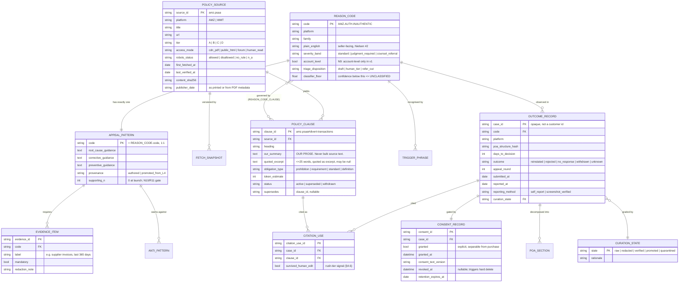
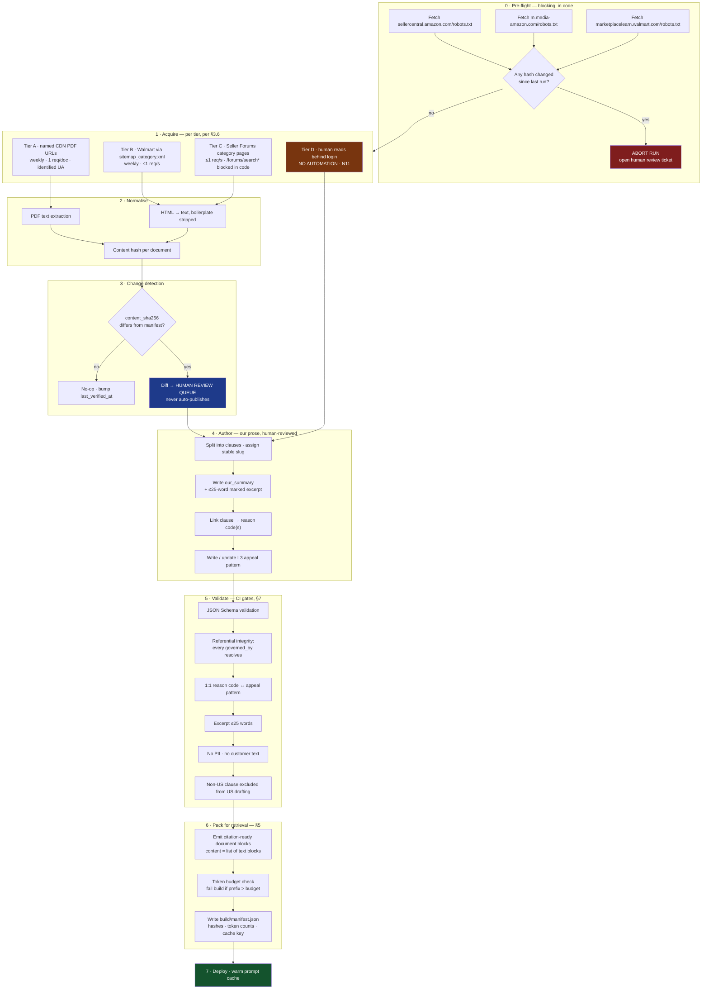
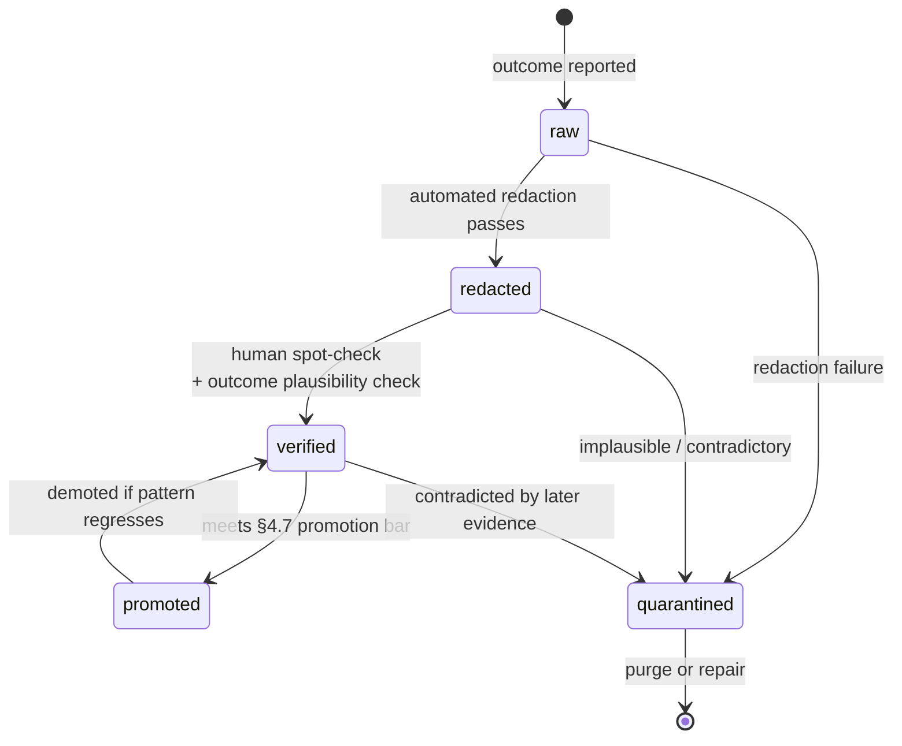

# CORPUS DESIGN — Clausewright

**The two-corpus knowledge base: policy corpus (A) + consented outcome corpus (B)**

**Product:** Clausewright — *Suspension Defense Copilot for Amazon and Walmart sellers*
**Tagline:** *"Every day dark costs you a day's sales. Get back to selling — with the exact policy clause on your side."*
**Owner:** Knowledge / corpus engineering
**Date:** 2026-08-12
**Status:** Design, binding for Phase 2 build. Supersedes IDEA_DOSSIER §8 where noted in §0.3.
**Upstream authority:** `/home/user/Octopus/phase-1-ideation/IDEA_DOSSIER.md` (§0 D1–D10, §7 B1–B11 / N1–N14, §8, §10). `/home/user/Octopus/phase-2-build/identity/NAMING.md` (§5 naming invariants).

---

## 0. How to read this document

### 0.1 Why the corpus is the product

Per Karpathy's *Software 2.0*, "the dataset that defines the desirable behavior" is the primary artifact, and the open engineering problem is the tooling for "accumulating, visualizing, cleaning, labeling, and sourcing datasets" ([Software 2.0](https://karpathy.medium.com/software-2-0-a64152b37c35), 2017). Clausewright takes that literally. We do not fine-tune (D9 / N6), so the corpus is not compiled into weights — it stays a legible, versioned, auditable artifact that a human can read, diff, and correct. Everything the model says that is *specific* comes from the corpus; everything else is prose style.

The architectural warrant for that split is Lewis et al. 2020, which established that retrieval-augmented generation "generate[s] more specific, diverse and factual language than a state-of-the-art parametric-only seq2seq baseline" ([RAG, NeurIPS 2020, arXiv:2005.11401](https://arxiv.org/abs/2005.11401)). Factuality is the axis Clausewright sells — the brand name *is* that axis (NAMING.md §3.2) — so the corpus is not a supporting asset. It is the thing.

### 0.2 The two corpora, and why they are separated

| | **Corpus A — Policy** | **Corpus B — Outcomes** |
|---|---|---|
| Content | Reason-code taxonomy, our summaries of governing policy clauses, structural appeal patterns | Consented, redacted `(notice → draft → reported outcome)` triples |
| Volume at launch | ~30 codes / ~60 clauses / ~30 patterns | **0** |
| Source | Public policy documents + human authorship | Our own customers, with explicit opt-in |
| Legal character | Third-party copyrighted text → we store *our own prose* keyed to a clause id | First-party data → PII controls, consent, deletion-on-request |
| Refresh | Scheduled crawl + change detection | Event-driven, per case |
| Competitive character | **Replicable.** Anyone can read the same public pages. | **The moat.** Helmer Process Power (D10). |
| Cut priority | Cuttable under schedule pressure | **Un-cuttable. Cut anything before this.** (D10, R16) |

They are separated because they have nothing in common operationally: different acquisition risk, different refresh cadence, different legal regime, different retention rules, and different failure modes. Merging them into one store would force the strictest constraint of each onto both.

### 0.3 Findings that revise IDEA_DOSSIER §8

Three verifications performed for this design change the source plan. They are recorded here with evidence because §8 is otherwise binding.

| # | Dossier §8 claim | Verified finding | Consequence |
|---|---|---|---|
| **F1** | §8.2/§8.3: *"the highest-authority text is the least legally acquirable"* — Seller Central policy pages are login-gated, so L2 must be authored by a human reading them behind login. | **Partly wrong. Amazon publishes authoritative policy documents as public PDFs on its own CDN, `m.media-amazon.com`, with no login.** `https://m.media-amazon.com/images/G/31/rainer/ProhibitedSellerActivitiesandActionsPolicy.pdf` was fetched directly (159,271 bytes, 4 pages, PDF metadata creation date 2023-12-18) and **84,905 characters of policy text were extracted**, opening *"Prohibited Seller Activities and Actions Policy — These prohibited seller activities and actions are established to maintain a selling service that is safe for buyers and fair for sellers…"* Parallel documents exist for the Seller Code of Conduct and Account Health across marketplaces (§3.5 Tier A). | A machine-readable Tier-A source class exists. The human-behind-login path (§3.5 Tier D) shrinks from *primary* to *gap-filler*. |
| **F2** | §8.3: robots.txt allows `/forums/` and `/seller-forums`, broad `Disallow: /` otherwise. | **Understated.** The re-fetched `sellercentral.amazon.com/robots.txt` allowlist **also includes `/help/hub/reference/external/`, `/gp/help/external/`, `/help/hub/mons-api/`, `/communities`, `/selling-partner-appstore` and `/partnernetwork`.** Disallows remain narrow: `/forums/search`, `/forums/search.jspa`, `/spec/api`. | The help-page paths are **robots-permitted**. The barrier there is a *rendering/contract* barrier, not a robots barrier — direct fetches of `/help/hub/reference/external/G1801` and `/gp/help/external/G1791` both returned a logged-out marketing shell with no policy text. Do not describe these as "robots-disallowed"; describe them accurately (§3.6). |
| **F3** | §8 does not consider AI-agent-specific robots directives. | `m.media-amazon.com/robots.txt` has **no `User-agent: *` block at all** (so no default disallow), but carries **`User-agent: GPTBot → Disallow: /`** and **`User-agent: CCBot → Disallow: /`**. | Amazon has published a machine-readable objection to *AI crawlers* on the CDN host. Clausewright is an AI product. §3.6-A sets the posture this forces: low-frequency, human-triggered, named-URL fetches for the purpose of **authoring our own summaries**, never a recurring bulk AI-ingestion crawl. |

**Nothing in F1–F3 relaxes N11 or N12.** No automated access behind the Seller Central login; no ingestion of competitors' generated drafts.

### 0.4 Naming invariants that bind this document

From NAMING.md §5, binding on every string that can reach a user, including corpus field values and rendered citations:

1. Never pair the name with a professional-advisor title. Clausewright is a **maker**, never an adviser.
2. Always **"policy clause,"** never "legal clause." Corpus field names follow: `policy_clause_id`, not `legal_clause_id`.
3. "Not legal advice" on every surface that renders a draft.
4. Never claim autonomy — no corpus field or template may imply we submit, file, or log in.
5. Never publish a success rate until Corpus B yields one with denominator and methodology (N10, R11). **This constrains the outcome corpus schema**: §4.2 stores the denominator explicitly so a rate can never be computed without it.

---

## 1. Design principles

Five principles, each traceable to a published source. Every later decision cites back to one of these.

**P1 — The dataset is the artifact; keep it legible.**
Karpathy's *Software 2.0* frames the dataset as the thing that defines behavior. We keep it as version-controlled, human-readable records rather than embeddings, so that a wrong record is *findable and fixable* by a human in minutes. This is also why no fine-tuning (N6): weights are not diffable.

**P2 — Retrieval, not recall.**
Lewis et al. 2020 (NeurIPS) is the architectural warrant: retrieval-augmented generation produces more specific and more factual language than a parametric-only model. Applied here: the model must never be the source of a policy fact. If a policy statement is not in the corpus, the correct output is that we cannot cite it — not a plausible-sounding paraphrase.

**P3 — Citations are a code-level invariant, not a prompt instruction.**
B4/R4 require that the UI render a policy reference **only** if it arrived inside a Citations object. Anthropic's Citations API returns `cited_text` with a source location per citation ([Citations docs](https://platform.claude.com/docs/en/build-with-claude/citations)). §5.2 shows how corpus records are packaged so that this invariant is *structurally* satisfiable, and §5.3 records a hard API constraint that shapes the whole pipeline.

**P4 — The simplest thing that works; add machinery only when a measured threshold trips.**
Anthropic's *Building Effective Agents* counsels finding "the simplest solution possible," reserving added complexity for when simpler approaches demonstrably fail ([Building Effective Agents](https://www.anthropic.com/engineering/building-effective-agents)). Hence: no vector DB, no chunking, no reranker in v1 (N5). §5.5 defines the exact numeric trigger that would justify each.

**P5 — Structural guarantees over procedural ones.**
Per the Twelve-Factor App's discipline of putting guarantees in the codebase rather than a runbook ([12factor.net](https://12factor.net/)), every rule in this document that *can* be a schema constraint or a CI test **is** one, not a note telling a future engineer to be careful. §7 lists them.

A sixth, non-technical principle governs presentation of corpus content to users: Nielsen's heuristic #2, *match between the system and the real world* ([NN/g, 10 Usability Heuristics](https://www.nngroup.com/articles/ten-usability-heuristics/)). Reason codes are internal identifiers; every code carries a `plain_english` field because the seller's word is "my account went dark," not `AMZ.AUTH.INAUTHENTIC`.

---

## 2. Ontology

### 2.1 Wiki structure

The corpus is a wiki in the strict sense: atomic, individually addressable, densely cross-linked pages with a fixed schema per namespace. It is stored as files in the repo (Corpus A) plus one database (Corpus B).

```
phase-2-build/corpus/
├── ontology/
│   ├── schema.reason_code.json          # JSON Schema, the contract
│   ├── schema.policy_clause.json
│   ├── schema.appeal_pattern.json
│   ├── schema.outcome_record.json
│   └── id-grammar.md                    # §2.3
├── L1-reason-codes/
│   ├── AMZ.AUTH.INAUTHENTIC.md
│   ├── AMZ.IP.TRADEMARK.md
│   └── … one file per code (§3.2)
├── L2-policy-clauses/
│   ├── amz.psaa/                        # one directory per source document
│   │   ├── _source.yaml                 # PolicySource record (§3.3.2)
│   │   ├── divert-transactions.md       # one file per clause
│   │   └── improper-business-name.md
│   ├── amz.coc/
│   └── wmt.perf/
├── L3-appeal-patterns/
│   └── AMZ.AUTH.INAUTHENTIC.md          # keyed 1:1 to reason code
├── L4-outcomes/                         # NOT files — see §4
│   └── README.md                        # points at the DB; no PII in the repo, ever
└── build/
    ├── manifest.json                    # content hashes, token counts, cache key
    └── packed/                          # citation-ready document blocks (§5.2)
```

**Rule (enforced in CI): no PII, no customer text, and no verbatim customer notice ever enters `phase-2-build/corpus/`.** Corpus B lives only in the database. `L4-outcomes/README.md` is a pointer, not data. This makes the repo safe to share with contractors and to open-source in part later.

### 2.2 Entity–relationship model



### 2.3 Identifier grammar

Stable identifiers are load-bearing: a citation rendered to a customer in month 1 must still resolve in month 12, and Corpus B rows reference clause ids for years.

| Entity | Grammar | Example | Rule |
|---|---|---|---|
| Reason code | `{PLATFORM}.{FAMILY}.{SPECIFIC}` | `AMZ.AUTH.INAUTHENTIC` | Uppercase, dot-separated, **append-only**. A code is never renamed or reused; it is marked `status: retired` and a successor named. |
| Policy source | `{platform}.{shortname}` | `amz.psaa` | Lowercase. One per *document*, not per URL — a document that moves URLs keeps its `source_id`. |
| Policy clause | `{source_id}#{slug}` | `amz.psaa#divert-transactions` | Slug is derived from the clause heading, hand-stabilised. **Never** derived from a character offset — source text shifts, ids must not. |
| Appeal pattern | Same string as its reason code | `AMZ.AUTH.INAUTHENTIC` | Exactly one pattern per code; enforced by CI (§7). |
| Case | `case_{ulid}` | `case_01J9…` | Opaque. **Not** derived from email, merchant token, or Stripe id. |

**Versioning.** Policy clauses are immutable once published to a customer. A changed source produces a *new* clause record with `supersedes` pointing at the old one; the old one flips to `status: superseded` and is retained forever. This is what makes a citation shown in March still explainable in December — a property we will want the first time a seller says "you told me X."

---

## 3. Corpus A — the policy corpus

### 3.1 Layer model

Inherited from IDEA_DOSSIER §8.1, with volumes and difficulty re-estimated against the F1 finding.

| Layer | Content | v1 volume | Effort | Change vs §8.1 |
|---|---|---|---|---|
| **L1 — Reason-code taxonomy** | Canonical code, aliases, notice trigger phrases, plain-English gloss, severity band, triage disposition | **33 codes** (§3.2) | Low — hand-authored | Volume firmed from "20–30" |
| **L2 — Policy clauses** | Our structured summary of each governing clause + clause id + source pointer | **~60 clauses across 9 source documents** | **Medium → Lower.** F1 gives machine-readable Tier-A text for the largest sources | Difficulty downgraded |
| **L3 — Appeal patterns** | Per code: what a strong root-cause / corrective / preventive section contains; anti-patterns; evidence checklist | **33 patterns** (1:1 with L1) | Medium — synthesised from public guidance, human-reviewed | Now strictly 1:1 with L1 |
| **L4 — Outcome corpus** | See §4 | **0 at launch** | Hard — and the only real moat | Unchanged |

L1–L3 are buildable by agents in a day (§3.7 Day 1). L4 is the asset.

### 3.2 Suspension reason taxonomy

33 codes. Amazon account-level deactivations plus Walmart equivalents (N8: no eBay/Etsy/TikTok/KDP; N9: account-level only — no ASIN/listing-level codes).

**Triage disposition** implements the D3/§6.1-lever-2 honest-triage stance *and* the Clausewright differentiator: where AppealDesk **refuses** six hard categories, we route them. `draft` = full self-serve draft. `human_tier` = drafted, but the paywall presents the $399 tier as the recommended path (R3: the worst failure mode becomes the differentiated revenue line). `refer_out` = we do not draft; we refer to partner counsel for a referral fee (§6.1 lever 2), and B11 applies.

#### Amazon — authenticity & intellectual property

| Code | Plain English | Severity | Triage |
|---|---|---|---|
| `AMZ.AUTH.INAUTHENTIC` | "Amazon says your items may not be genuine" | judgment_required | human_tier |
| `AMZ.AUTH.COUNTERFEIT` | "Amazon says your items are counterfeit" | counsel_referral | refer_out |
| `AMZ.AUTH.CONDITION` | "Used item sold as new / condition complaints" | standard | draft |
| `AMZ.AUTH.EXPIRY` | "Expired or short-dated product complaints" | standard | draft |
| `AMZ.IP.TRADEMARK` | "A brand says you're using their trademark" | counsel_referral | refer_out |
| `AMZ.IP.COPYRIGHT` | "A rights-holder filed a copyright complaint" | counsel_referral | refer_out |
| `AMZ.IP.PATENT` | "A patent complaint was filed against your listing" | counsel_referral | refer_out |

#### Amazon — Code of Conduct & Section 3

| Code | Plain English | Severity | Triage |
|---|---|---|---|
| `AMZ.COC.SECTION3` | "Deactivated under Section 3 of the Business Solutions Agreement" | judgment_required | human_tier |
| `AMZ.COC.LINKED` | "Amazon linked your account to another account" | judgment_required | human_tier |
| `AMZ.COC.MULTIACCOUNT` | "Operating more than one selling account" | judgment_required | human_tier |
| `AMZ.COC.REVIEW_MANIP` | "Manipulating reviews, ratings or feedback" | judgment_required | human_tier |
| `AMZ.COC.RANK_ABUSE` | "Misuse of sales rank" | standard | draft |
| `AMZ.COC.SEARCH_ABUSE` | "Misuse of search and browse" | standard | draft |
| `AMZ.COC.DIVERSION` | "Trying to take customers off Amazon" | standard | draft |
| `AMZ.COC.SELLER_ABUSE` | "Attempting to damage or abuse another seller" | judgment_required | human_tier |
| `AMZ.COC.BIZ_NAME` | "Your business name isn't allowed" | standard | draft |
| `AMZ.COC.FRAUD` | "Amazon's controls flagged deceptive or fraudulent activity" | counsel_referral | refer_out |

#### Amazon — performance & compliance

| Code | Plain English | Severity | Triage |
|---|---|---|---|
| `AMZ.PERF.ODR` | "Your Order Defect Rate went over the limit" | standard | draft |
| `AMZ.PERF.LSR` | "Too many late shipments" | standard | draft |
| `AMZ.PERF.PCR` | "Too many cancellations before fulfilment" | standard | draft |
| `AMZ.PERF.VTR` | "Not enough orders had valid tracking" | standard | draft |
| `AMZ.PERF.AHR` | "Your Account Health Rating fell below the threshold" | standard | draft |
| `AMZ.SAFETY.PRODUCT` | "A product safety complaint was filed" | judgment_required | human_tier |
| `AMZ.SAFETY.RESTRICTED` | "You listed a restricted product" | standard | draft |
| `AMZ.SAFETY.GPSR` | "EU product-safety (GPSR) compliance" | judgment_required | human_tier |
| `AMZ.OPS.DROPSHIP` | "Dropshipping policy violation" | standard | draft |
| `AMZ.OPS.VERIFICATION` | "Identity or business verification failed" | standard | draft |

#### Walmart

| Code | Plain English | Severity | Triage |
|---|---|---|---|
| `WMT.PERF.STANDARDS` | "You missed Walmart's Seller Performance Standards" | standard | draft |
| `WMT.PERF.ODR` | "Order defect metrics (cancellation, on-time delivery, refund, tracking)" | standard | draft |
| `WMT.COC.CONDUCT` | "Marketplace Seller Code of Conduct violation" | judgment_required | human_tier |
| `WMT.TRUST.SAFETY` | "Trust & Safety Policy action" | judgment_required | human_tier |
| `WMT.OPS.PROHIBITED` | "You listed a prohibited item" | standard | draft |
| `WMT.AGREEMENT.RETAILER` | "Marketplace Retailer Agreement violation" | judgment_required | human_tier |

#### The mandatory escape hatch

| Code | Meaning | Triage |
|---|---|---|
| `UNCLASSIFIED` | Classifier confidence below `classifier_floor`, or a notice that matches no code | **human_tier** |

`UNCLASSIFIED` is a **first-class outcome, not an error** (B2, R3). It must be reachable, tested, and instrumented. R3 names misclassification as the highest technical damage in the plan — a confidently wrong document burns the seller's one good attempt, which is worse than no product. The design response is that low confidence converts to the $399 human tier rather than guessing.

> **Hypothesis, not a finding:** the per-code `classifier_floor` values, the `severity_band` assignments, and the `triage_disposition` split are **our judgment calls**. No published benchmark sets a confidence threshold for this task. They must be calibrated against the B10 golden set (~40 hand-labelled notices) and revised, not assumed correct. The initial floor is a uniform 0.75 pending that calibration.

### 3.3 Record schemas

#### 3.3.1 L1 — reason code

```yaml
code: AMZ.AUTH.INAUTHENTIC
platform: AMZ
family: AUTH
status: active
plain_english: "Amazon says your items may not be genuine."
severity_band: judgment_required
account_level: true
triage_disposition: human_tier
classifier_floor: 0.75

aliases:
  - "inauthentic"
  - "product authenticity customer complaints"
  - "authenticity complaint"

notice_trigger_phrases:          # verbatim strings observed in real notices
  - phrase: "we received complaints about the authenticity"
    confidence_weight: high
  - phrase: "may be inauthentic"
    confidence_weight: high
  - phrase: "invoices from your supplier"
    confidence_weight: medium

governed_by:                     # -> L2 clause ids. MUST resolve (CI-enforced)
  - amz.psaa#customer-product-reviews
  - amz.coc#accurate-information

appeal_pattern: AMZ.AUTH.INAUTHENTIC   # -> L3, 1:1

confusable_with:                 # drives classifier eval confusion matrix
  - AMZ.AUTH.COUNTERFEIT
  - AMZ.AUTH.CONDITION

disclaimer_profile: standard     # B11: which disclaimer set renders
provenance:
  authored_by: human
  reviewed_at: 2026-08-12
  sources_consulted: [amz.psaa, amz.coc]
```

#### 3.3.2 L2 — policy source + clause

`_source.yaml` (one per document):

```yaml
source_id: amz.psaa
platform: AMZ
title: "Prohibited Seller Activities and Actions Policy"
tier: A
access_mode: cdn_pdf
url: "https://m.media-amazon.com/images/G/31/rainer/ProhibitedSellerActivitiesandActionsPolicy.pdf"
alt_urls:
  - "https://sellercentral.amazon.com/help/hub/reference/external/G200386250"   # login-gated render
robots_status: no_rule_for_our_agent      # see §3.6-A; GPTBot/CCBot disallowed on host
publisher_date: "2023-12-18"              # from PDF metadata
first_fetched_at: "2026-08-12"
last_verified_at: "2026-08-12"
content_sha256: "<hash of extracted text, not of the PDF bytes>"
extraction_method: pdf_text_extraction
license_posture: "Amazon-copyrighted. Store our own summaries only. Excerpts <=25 words."
```

A clause file (`divert-transactions.md`):

```yaml
---
clause_id: amz.psaa#divert-transactions
source_id: amz.psaa
heading: "Attempts to divert transactions or buyers from Amazon channels"
obligation_type: prohibition
status: active
supersedes: null
token_estimate: 190
---

## What this clause requires        # <- OUR PROSE. This is what gets cited.

Amazon prohibits any attempt to move a transaction or a buyer off Amazon's own
sales process. The prohibition is written broadly: it covers marketing messages,
special offers, and any "call to action" that encourages a customer to leave the
Amazon website, and it names two concrete mechanisms — email used to divert
customers, and hyperlinks or web addresses embedded in seller-generated order
confirmations or in product and listing description fields.

## Why sellers trip it

Most enforcement under this clause is unintentional: a packaging insert with a
website, a warranty-registration card, or a support email footer carrying a
company URL. The clause does not require intent to be violated.

## Quoted excerpt                   # <- short, marked, <=25 words

> "any attempt to circumvent the established Amazon sales process or to divert
> Amazon users to another website or sales process is prohibited"

## Source

Prohibited Seller Activities and Actions Policy (Amazon), document dated
2023-12-18 — see `_source.yaml` for the retrieval URL and hash.
```

**The `our_summary` field is the citation target, not the source text.** This is the design consequence of IDEA_DOSSIER §8.4c: because the Citations API cites *from the documents we supply*, and our documents are our own prose, the `cited_text` a customer sees is **our writing plus a pointer to the authoritative source**. That is simultaneously the lower-copyright-risk option and the better UX — a plain-English clause summary reads better to a panicking seller than platform boilerplate. It is one of the rare places where the legal mitigation improves the product.

#### 3.3.3 L3 — appeal pattern

```yaml
code: AMZ.AUTH.INAUTHENTIC
provenance: authored          # -> "promoted_from_L4" once §4.7 fires
supporting_n: 0               # N10/R11: no claim may be made from n=0
last_reviewed_at: 2026-08-12

structure:                    # B5: the three-part POA
  root_cause:
    must_contain:
      - "A specific, checkable account of where the inventory came from"
      - "Named supplier, with the relationship stated"
      - "An admission of what went wrong in the sourcing process"
    must_avoid:
      - "Blaming the customer or the complainant"
      - "Blaming Amazon's detection systems"
  immediate_corrective:
    must_contain:
      - "What was done to the affected inventory (disposed, returned, quarantined)"
      - "Whether affected listings were removed, and when"
  preventive:
    must_contain:
      - "A measurable control with an owner and a frequency"
      - "A supplier-verification step that did not exist before"

evidence_required:
  - evidence_id: EV.INVOICE.SUPPLIER
    label: "Supplier invoices covering the complained-of ASINs"
    mandatory: true
    redaction_note: "Prices may be redacted; supplier name and date may not."
  - evidence_id: EV.SUPPLIER.CONTACT
    label: "Supplier contact details, verifiable"
    mandatory: true
  - evidence_id: EV.PROOF.DISPOSAL
    label: "Evidence of what happened to the affected stock"
    mandatory: false

anti_patterns:                # B6 critique rubric feeds directly off this
  - id: AP.APOLOGY_ONLY
    detect: "Apology present, no corrective control named"
    critique: "This reads as an apology, not a plan. Amazon's investigator is
               looking for a control, not contrition."
  - id: AP.BLAME_PLATFORM
    detect: "Attributes the deactivation to an Amazon error"
    critique: "Blaming the platform is the single most common reason a first
               appeal fails. State what you changed."
  - id: AP.UNMEASURABLE
    detect: "Preventive section has no number, owner, or frequency"
    critique: "'We will be more careful' is not a preventive measure. Name the
               check, who runs it, and how often."
  - id: AP.NO_INVOICE
    detect: "Mandatory evidence item absent"
    critique: "No supplier invoices are referenced. For this reason code that is
               usually fatal on its own."
```

The `anti_patterns` block is not documentation — it is the **input to B6, the readiness critique**, which is Anthropic's *evaluator-optimizer* pattern (a second model call scoring the first against a rubric and naming concrete deficiencies). B6 is shown free, pre-paywall, because §7.1 requires the differentiator to be visible *before* payment or the A4 experiment is confounded. So `anti_patterns` is the highest-leverage content in Corpus A: it is literally the free proof of quality that makes the primary experiment testable.

### 3.4 Appeal requirements per reason code

The evidence matrix. Each row is generated from the `evidence_required` blocks and rendered to the customer as the **Evidence Kit** (a named component of the $149 Rescue package, §6.2).

| Reason code | Mandatory evidence | Also strengthens | Fatal omission |
|---|---|---|---|
| `AMZ.AUTH.INAUTHENTIC` | Supplier invoices; verifiable supplier contact | Disposal proof; supply-chain diagram | No invoices |
| `AMZ.AUTH.COUNTERFEIT` | *(refer_out — we do not draft)* | — | — |
| `AMZ.AUTH.CONDITION` | Receiving/inspection process description | Photos of grading process | No inspection step |
| `AMZ.IP.*` | *(refer_out)* | — | — |
| `AMZ.COC.SECTION3` | Whatever the notice's cited sub-reason demands | Account history summary | Treating it as generic |
| `AMZ.COC.LINKED` | Account-relationship explanation; corporate records | Utility/lease records for the premises | Denying without documents |
| `AMZ.COC.REVIEW_MANIP` | Description of every review-solicitation channel used | Vendor contracts, if an agency was used | Not disclosing an agency |
| `AMZ.COC.DIVERSION` | Inventory of every insert, email footer, and listing field | Corrected artwork/screenshots | Fixing one channel, not all |
| `AMZ.PERF.ODR` | Metric breakdown by defect component | Root-cause by SKU or carrier | Aggregate promise, no component |
| `AMZ.PERF.LSR` / `PCR` / `VTR` | Same, per the specific metric | Carrier change evidence | Untargeted "we'll do better" |
| `AMZ.PERF.AHR` | The specific violations dragging the rating | Remediation status per violation | Addressing the score, not the causes |
| `AMZ.SAFETY.PRODUCT` | Test reports / certificates of compliance | Recall or quarantine record | No third-party documentation |
| `AMZ.OPS.DROPSHIP` | Supplier agreements showing you are seller of record | Packing-slip samples | Not addressing seller-of-record |
| `AMZ.OPS.VERIFICATION` | The exact documents requested, unaltered | — | Substituting a different document |
| `WMT.PERF.STANDARDS` | Written business plan of action; metric evidence | Warehouse photos | No written plan |
| `WMT.*` (inventory-related) | Supplier invoices **under 2 months old** | Warehouse photos; IP documentation | Invoices older than 2 months |

The Walmart rows are the best-grounded in this table because Walmart's guidance is public. Walmart Marketplace Learn's *Appeal an account suspension* guide (fetched directly for this design) sets out a three-step process — review performance metrics on the Performance page, create a written business plan of action, then submit (via the "Start appeal" banner for suppressions, or the Help button in Seller Center for suspensions) — and states the plan must include *"a description of the violation and the steps you plan to take to correct the issue,"* with supporting material such as warehouse photos, **supplier invoices under 2 months old**, or IP documentation ([Walmart Marketplace Learn — Appeal an account suspension](https://marketplacelearn.walmart.com/guides/Seller%20Account%20Management/Appeal-an-account-suspension)).

Notably, that same guide **does not enumerate violation categories** — it refers generically to "Seller Performance Standards" and the "Marketplace Retailer Agreement." The Walmart reason codes in §3.2 are therefore assembled from the sibling public guides (Seller Performance Standards, Marketplace Seller Code of Conduct, Trust & Safety Policy) rather than from an official list. **Flagged as a construction, not a published taxonomy.**

### 3.5 Source list

Real, verified URLs. Every entry below was either fetched directly during this design or returned by search with a resolvable URL; the "Verified" column says which, and how.

#### Tier A — public, machine-readable, authoritative (the F1 finding)

Amazon-published policy documents on Amazon's own CDN. No login. Text extractable.

| `source_id` | Document | URL | Verified |
|---|---|---|---|
| `amz.psaa` | Prohibited Seller Activities and Actions Policy | `https://m.media-amazon.com/images/G/31/rainer/ProhibitedSellerActivitiesandActionsPolicy.pdf` | **Fetched & text-extracted.** 159,271 bytes, 4 pages, 84,905 chars of policy text, PDF metadata date 2023-12-18 |
| `amz.coc.na` | Overview of the Amazon Seller Code of Conduct (NA/EN) | `https://m.media-amazon.com/images/G/28/AS/AGS/SU/CN_GS_Seller_Codes_of_Conduct_1.1_Amazon_Policy_NA_EN.pdf` | Search-resolved; fetch on Day 1 |
| `amz.ahc` | Overview of Account Health and Policy Compliance | `https://m.media-amazon.com/images/G/28/AS/AGS/SU/CN_GS_Account_Health_and_Compliance_1.1_Overview_EN.pdf` | Search-resolved; fetch on Day 1 |
| `amz.spc.sg` | Selling Policies and Seller Code of Conduct (SG edition) | `https://m.media-amazon.com/images/G/65/rainier/help/Selling_Policies_and_Seller_Code_of_Conduct_SG_new_version_clean_PDF.pdf` | Search-resolved. **Non-US marketplace — use for structure only, never cite to a US seller** |

**The URL pattern generalises**: `m.media-amazon.com/images/G/{marketplace}/{rainier|rainer|AS/AGS/SU}/…`, where the numeric segment is a marketplace id (`01` US, `28` NA-multi, `31` IN, `65` SG). Day-1 task: enumerate the US-marketplace equivalents of `amz.psaa` and `amz.coc` and prefer them over the IN/SG editions. **Until a US edition is confirmed for a given document, any clause derived from a non-US edition carries `jurisdiction_caveat: true` and is excluded from drafting for US sellers** (CI-enforced, §7).

#### Tier B — public HTML, no login

| `source_id` | Document | URL | Verified |
|---|---|---|---|
| `wmt.appeal` | Appeal an account suspension | `https://marketplacelearn.walmart.com/guides/Seller%20Account%20Management/Appeal-an-account-suspension` | **Fetched.** Real guide content; three-step process + plan-of-action requirements confirmed |
| `wmt.perf` | Seller performance standards | `https://marketplacelearn.walmart.com/guides/Policies%20&%20standards/Performance/Seller-performance-standards` | Search-resolved; metrics named (Cancellation Rate, On-Time Delivery, Refund Rate, Valid Tracking Rate, Seller Response Rate, Negative Feedback Rate) |
| `wmt.coc` | Marketplace Seller Code of Conduct | `https://marketplacelearn.walmart.com/guides/Policies%20&%20standards/Performance/Marketplace-Seller-Code-of-Conduct` | Search-resolved |
| `wmt.trust` | Trust and Safety Policy | Linked from `wmt.appeal`; resolve exact URL via sitemap | Referenced by the fetched appeal guide |
| `wmt.dispute` | Dispute Standards | Linked from `wmt.appeal`; resolve via sitemap | Referenced by the fetched appeal guide |

**Walmart publishes a sitemap**: `https://marketplacelearn.walmart.com/sitemap_category.xml` (confirmed present in the site's robots.txt response). Use it to enumerate guide URLs rather than crawling links — a sitemap is a machine-readable invitation and the politest possible discovery mechanism.

#### Tier C — public forums, robots-allowed, for taxonomy discovery only

| `source_id` | Surface | URL | Verified |
|---|---|---|---|
| `amz.forums.ah` | Seller Forums → **Account Health** category ("Account Health Support, Suspended & Deactivated Accounts, Listing Violations") | `https://sellercentral.amazon.com/seller-forums/discussions?categories%5B%5D=amzn1.spce.category.8b1ad9d6` | **Fetched.** Category list and id confirmed |
| — | Individual threads | `https://sellercentral.amazon.com/seller-forums/discussions/t/{id}` | **Fetched.** Server-rendered HTML with visible post text, author handles, dates, breadcrumb category |

Two thread-id formats are in use and the crawler must accept both: dashed UUID (`6a68d599-2bef-4f58-b1fb-dda42750c154`) and 32-char undashed hex (`8dac9dd7493cfb10114aed67679902bd`).

The full category id map, captured for the crawler:

| Category | id |
|---|---|
| Account Health | `amzn1.spce.category.8b1ad9d6` |
| Account Setup | `amzn1.spce.category.8b1ad26a` |
| Product Safety and Compliance | `amzn1.spce.category.8b1ad9e4` |
| Manage Your Brand | `amzn1.spce.category.8b1ad6fc` |
| Fulfill Orders | `amzn1.spce.category.8b1ad526` |

**Forums are used to learn *what codes exist* and *how notices are phrased*. Forum post text is never republished and never enters L2.** Posts are authored by sellers, not by Amazon (IDEA_DOSSIER §8.4c).

#### Tier D — login-gated, human-read only

| `source_id` | Document | URL | Verified |
|---|---|---|---|
| `amz.help.g1801` | Selling policies and seller code of conduct | `https://sellercentral.amazon.com/help/hub/reference/external/G1801` | **Fetched → login/marketing shell, no policy text** |
| `amz.help.g200386250` | Prohibited seller activities and actions policy | `https://sellercentral.amazon.com/help/hub/reference/external/G200386250` | Same shell (Tier-A PDF is the readable equivalent) |
| `amz.help.g200370560` | Appeal an account deactivation or listing removal | `https://sellercentral.amazon.com/gp/help/external/G200370560` | **Fetched → login/marketing shell, no appeal text** |
| `amz.bsa` | Amazon Services Business Solutions Agreement (incl. **Section 3, Term and Termination**) | `https://sellercentral.amazon.com/gp/help/external/G1791` | **Fetched → login/marketing shell** |

`amz.help.g200370560` is the single most valuable Amazon page for this product — it is Amazon's own appeal guidance — and it is gated. **A human with a legitimate Professional seller account reads these and authors our summaries (N11).** This is the residual justification for the dossier's L2-human-authoring design after F1: it shrinks, but it does not disappear.

> **Corroboration source, with a warning.** A copy of the Business Solutions Agreement General Terms is hosted publicly by a US federal agency at `https://www.abilityone.gov/laws,_regulations_and_policy/documents/Amazon%20Services%20Business%20Solutions%20Agreement.pdf`. It is useful for *structural orientation* — confirming that Section 3 is "Term and Termination" and enumerating its (a)–(e) grounds. It **must not be used as authoritative current text**: it is an undated third-party mirror and the BSA is amended frequently. Marked `tier: corroboration`, `citable: false` — excluded from drafting by schema, not by convention.

#### Tier E — deliberately excluded

| Source | Why excluded |
|---|---|
| Competitor generated drafts (AppealDesk, AppealDraft, ReinstateIQ output) | **N12.** The Thomson Reuters v. Ross fact pattern — building a competing product on a competitor's copyrighted output. *(Ross recalled, not verified in-session; verify with counsel.)* |
| Anything behind the Seller Central login, automated | **N11.** Bright line, not a managed risk. See §3.6-D. |
| `/forums/search`, `/forums/search.jspa` | Explicit robots `Disallow`. An explicit machine-readable prohibition is exactly the gate that matters under Van Buren's gates-up-or-down rule. |
| Consultant / law-firm explainer blogs | Read for taxonomy discovery only; never quoted, never cited, never stored. |
| Third-party "Account Health Rating" guides | See the AHR note below. |

> **AHR / Account Health Assurance — recorded as a gap, not a finding.** IDEA_DOSSIER §10.3 lists Amazon Account Health Assurance as unverified because the official pages 404'd. Searching now returns numerous 2026 third-party guides asserting specifics (AHR scored 0–1000; ≥200 "healthy"; Assurance requiring ≥250 sustained six months, a Professional plan, and an emergency contact on file; a 72-hour pre-deactivation window). **Every one of those is a vendor or blog source, and per Fitzpatrick's *Mom Test* discipline of discounting self-serving claims, none is admissible as a policy fact.** `AMZ.PERF.AHR` therefore ships with **no numeric thresholds in its clause record** until a Tier-A or Tier-D source confirms them. A drafted POA that asserted a specific AHR threshold and was wrong would damage exactly the trust position we sell.

### 3.6 Legality, per source tier

Grounded in the same authorities as IDEA_DOSSIER §8.4, applied per tier.

**The governing distinction is logged-out vs logged-in, not public vs private.** *Van Buren v. United States*, 593 U.S. ___ (2021) held 6–3 that one "exceeds authorized access" only by obtaining information specifically off-limits on a system one may otherwise use — the gates-up-or-down rule — and that using access for an improper *purpose* is not a CFAA violation. *hiQ Labs v. LinkedIn* applied the same logic to publicly available profile data. **But hiQ is also the cautionary tale**: in November 2022 the N.D. Cal. held hiQ had breached LinkedIn's User Agreement, and the case settled. hiQ won the CFAA question and still lost. "Not a federal crime" is not "not actionable."

**A — Tier A (CDN PDFs).** Public, no login, no authentication, no contract accepted. `m.media-amazon.com/robots.txt` contains **no `User-agent: *` block**, so there is no default disallow for a general crawler. However it does contain `User-agent: GPTBot → Disallow: /` and `User-agent: CCBot → Disallow: /`.

Those directives name two specific AI crawlers, neither of which is us — so this is not a literal prohibition on Clausewright's user-agent. But the *signal* is unambiguous: Amazon objects to AI crawlers ingesting this host. Reading that and then running a recurring bulk AI-ingestion crawl would be the kind of purpose-mismatch that reads badly in a demand letter, whatever the CFAA analysis says.

**Posture (binding):**
- Fetch a **short, named list of specific document URLs** (§3.5 Tier A), never a spider.
- **Low frequency**: weekly change-detection at most, one request per document.
- **Human-triggered or human-reviewed**, for the explicit purpose of authoring our own summaries.
- Honest, identified user-agent with a contact URL.
- **Never train on it; never store it as a bulk corpus.** Extracted source text is a build-time intermediate that is *not committed* — only our summaries and ≤25-word marked excerpts are.
- Re-fetch `m.media-amazon.com/robots.txt` before each run and **abort on change**, exactly as for Seller Central.

**B — Tier B (Walmart Marketplace Learn).** Public, no login, and the site publishes a sitemap — a machine-readable invitation to crawl. Lowest-risk source in the plan. Discover URLs via `sitemap_category.xml`, ≤1 req/sec, identified UA. *The full Walmart robots.txt directive set was not captured in this session — only the Sitemap line resolved. Re-fetch and parse it in the Day-1 pre-flight before crawling; abort if a relevant `Disallow` is present.* Copyright still applies: our summaries, not their text.

**C — Tier C (Seller Forums).** Robots-allowed by explicit allowlist entry (`/forums/`, `/seller-forums`). Logged-out. Hard-coded operational rules:
- Crawl **category listing and discussion pages only**. Discover threads by paginating category listings.
- **`/forums/search*` is hard-blocked in code**, not by policy note. It is an explicit machine-readable prohibition and therefore precisely the Van Buren gate that matters.
- Honest UA with contact URL; ≤1 req/sec; exponential backoff on 429/503.
- **Re-fetch `sellercentral.amazon.com/robots.txt` before every run and abort on any change.** Pre-flight check in code (P5).
- Forum post text is authored by sellers. Use it to learn phrasings and discover codes; **never republish it, never store it in L2, never cite it to a customer.**

**D — Tier D (login-gated).** **Unacceptable for automation. N11. Bright line, not a managed risk.** A seller-account holder has *affirmatively accepted* the Business Solutions Agreement, which converts a scraping question into a straightforward breach-of-contract question with a named counterparty who can also terminate the account. That is the hiQ lesson applied. Human reading only, by a person with a legitimate Professional seller account, producing our own prose.

*(Recalled, not verified in-session: Meta v. Bright Data (N.D. Cal., 2024) is generally read as holding that logged-out scraping of public data does not breach ToS accepted by a logged-in user — which, if accurate, maps precisely onto the A/D line drawn above. **Verify with counsel before relying.**)*

**Copyright, across all tiers.** Platform policy texts are copyrighted. The relevant caution is *Thomson Reuters v. Ross Intelligence* — fair use rejected where a startup used a competitor's copyrighted legal-research material to build a competing product, with market effect weighing heavily against the defendant *(recalled, D. Del. Feb 2025; NOT verified in-session — verify with counsel)*. Our exposure is worst exactly where our incentives point. Mitigations, all cheap and all schema-enforced:

| Mitigation | Enforcement |
|---|---|
| Store **our own structured summaries** keyed to clause id + source URL, never bulk reproductions | `our_summary` required; no `source_text` field exists in the schema |
| Verbatim excerpts kept short and marked as excerpts | `quoted_excerpt` capped at **25 words**, CI-enforced |
| Never ingest competitor output | N12; source allowlist in the fetcher |
| Never republish forum post text | Tier C records carry `citable: false` |

**PII.** Not applicable to Corpus A by construction — no customer data ever enters it (§2.1). Corpus B's regime is §4.4.

### 3.7 Ingestion and refresh pipeline



**Three properties of this pipeline are non-negotiable and each is a code path, not a rule.**

1. **Robots pre-flight aborts the run on change.** Not "check robots periodically." The hash of each robots.txt is stored in the manifest and compared before any other request. A change means Amazon or Walmart altered their machine-readable position, and a human decides what that means before we fetch again.
2. **Change detection never auto-publishes.** A diff opens a review queue item. Policy text changing is exactly the moment when an automated summariser would silently ship a wrong clause to a paying customer mid-appeal. Cheap to gate; expensive to get wrong.
3. **The build fails on schema violation, not warns.** Per P5, a corpus that violates its own contract must not be deployable.

**Refresh cadence.** Tier A weekly; Tier B weekly; Tier C daily during the first 30 days (it is also the acquisition channel's listening post — a "just got suspended" post is a public, timestamped buying signal per §6.5), then weekly; Tier D on human cadence, minimum quarterly, plus on-demand whenever change detection flags a related Tier-A document.

---

## 4. Corpus B — the consented outcome corpus

### 4.1 Why this is the moat, stated honestly

IDEA_DOSSIER §5.5's Helmer audit is blunt and this document does not soften it: **Cornered Resource is claimed but not held.** The corpus does not exist on day one and starts smaller than at least two competitors' datasets. Per Helmer's *7 Powers* (2016), a Cornered Resource must be scarce *and* exclusively accessible; ours is neither on launch day.

What is available is **Process Power** — a tight outcome-feedback loop returning every Amazon and Walmart decision into the corpus within *days*, not quarters. That beats Riverbend (a services firm, not a data pipeline) and beats AppealDesk on data *quality* specifically, because AppealDesk refuses six hard categories and its dataset therefore skews to easy wins. Ours will not, because our differentiator is that we route hard cases to humans rather than turning them away (§3.2 `human_tier`).

And per Thiel's *Zero to One* proprietary-technology test, on day one we are closer to a thin wrapper than we would like. The escape route is not the initial corpus — it is this loop. Which is why **B9 must ship day one or the data is lost forever**, and why D10 says cut anything before cutting it.

**One-way door.** Every case that completes without a consent record is a permanent hole in the dataset. You cannot retroactively consent a customer from three months ago. This asymmetry — cheap now, impossible later — is the entire argument for R16's ranking.

### 4.2 Schema

```sql
-- Corpus B lives ONLY in the database. Never in the repo. Never in git.

CREATE TABLE outcome_record (
    case_id              TEXT PRIMARY KEY,      -- case_{ulid}; opaque
    reason_code          TEXT NOT NULL REFERENCES reason_code(code),
    platform             TEXT NOT NULL CHECK (platform IN ('AMZ','WMT')),

    -- Structure, not content. The POA text is stored separately and
    -- only under a verified consent + redaction state.
    poa_structure        JSONB NOT NULL,        -- see below
    poa_structure_hash   TEXT NOT NULL,         -- dedupe + pattern mining

    -- The outcome
    outcome              TEXT NOT NULL CHECK (outcome IN
                           ('reinstated','rejected','no_response',
                            'withdrawn','unknown')),
    days_to_decision     INTEGER,               -- NULL until decided
    appeal_round         INTEGER NOT NULL DEFAULT 1,
    submitted_at         DATE,
    reported_at          DATE,
    reporting_method     TEXT NOT NULL CHECK (reporting_method IN
                           ('self_report','screenshot_verified')),

    -- Provenance & tiering
    tier_purchased       TEXT CHECK (tier_purchased IN ('rescue','rescue_human')),
    human_edited         BOOLEAN NOT NULL DEFAULT FALSE,

    -- N10 / R11: the denominator can never be lost
    counts_in_denominator BOOLEAN NOT NULL DEFAULT TRUE,

    curation_state       TEXT NOT NULL REFERENCES curation_state(state),
    created_at           TIMESTAMPTZ NOT NULL DEFAULT now()
);

-- poa_structure JSONB shape — structure and signals, never free customer text:
-- {
--   "sections": ["root_cause","immediate_corrective","preventive"],
--   "section_word_counts": {"root_cause": 142, ...},
--   "evidence_items_referenced": ["EV.INVOICE.SUPPLIER"],
--   "evidence_items_missing":    ["EV.SUPPLIER.CONTACT"],
--   "anti_patterns_flagged":     ["AP.UNMEASURABLE"],
--   "anti_patterns_remaining_at_submit": [],
--   "clauses_cited":             ["amz.psaa#divert-transactions"],
--   "critique_score_pre":  0.62,
--   "critique_score_post": 0.91
-- }

CREATE TABLE consent_record (
    consent_id            TEXT PRIMARY KEY,
    case_id               TEXT NOT NULL UNIQUE REFERENCES outcome_record(case_id),
    granted               BOOLEAN NOT NULL,
    granted_at            TIMESTAMPTZ,
    consent_text_version  TEXT NOT NULL,        -- exact wording shown, versioned
    scope                 TEXT NOT NULL,        -- 'outcome_only' | 'outcome_and_redacted_text'
    revoked_at            TIMESTAMPTZ,          -- non-null => hard delete cascade
    retention_expires_at  DATE NOT NULL
);

CREATE TABLE poa_text_redacted (
    case_id              TEXT PRIMARY KEY REFERENCES outcome_record(case_id),
    notice_redacted      TEXT NOT NULL,
    draft_redacted       TEXT NOT NULL,
    final_submitted_redacted TEXT,              -- if the seller told us what they sent
    redaction_version    TEXT NOT NULL,
    human_spot_checked   BOOLEAN NOT NULL DEFAULT FALSE,
    CONSTRAINT requires_broad_consent CHECK (…)  -- enforced: scope must be
                                                 -- 'outcome_and_redacted_text'
);

CREATE TABLE citation_use (
    citation_use_id      TEXT PRIMARY KEY,
    case_id              TEXT NOT NULL REFERENCES outcome_record(case_id),
    clause_id            TEXT NOT NULL,
    position             INTEGER,
    survived_human_edit  BOOLEAN                -- rush-tier signal; NULL if no human pass
);
```

**Three schema decisions worth defending:**

**(a) Structure is separated from text, with separate consent scopes.** `outcome_record` carries no customer prose at all. A seller who consents only to `outcome_only` still contributes the single most valuable signal — *did this POA shape, for this reason code, get reinstated, and how fast* — with essentially zero privacy surface. This makes the low-friction consent genuinely low-risk rather than merely low-friction, which matters because per §6.4-M2 the ask lands at the moment of relief, not the moment of panic.

**(b) `counts_in_denominator` exists so a rate can never be quietly computed without it.** N10 forbids publishing an unmeasured success rate, and R11 names advertising substantiation as the exposure. Competitors publish unaudited 85–93% figures; the differentiator in a category saturated with unfalsifiable numbers is *restraint plus method*. Any query that produces a rate must join this column, so a "success rate" can never be produced from the winners alone.

**(c) `survived_human_edit` on citations is the sharpest quality signal we will have.** When the $399 rush tier's human editor keeps a cited clause, that clause was right for that case. When they delete it, it was not. This is a graded label produced *for free* as a by-product of fulfilment — the concierge MVP working exactly as Graham's "Do Things That Don't Scale" intends, where the human's corrections *are* the roadmap (§7.6 Day 5).

### 4.3 Consent flow

```mermaid
sequenceDiagram
    autonumber
    participant S as Seller
    participant App as Clausewright
    participant DB as Outcome corpus
    participant Ops as Human review

    Note over S,App: T0 — moment of panic. Ask for nothing but the sale.
    S->>App: Paste notice → classify → cite → critique (free)
    S->>App: Pay $149 / $399
    App->>S: Checkbox, SEPARABLE from purchase:<br/>"Let us follow up on how this turns out,<br/>in exchange for account credit."
    S-->>App: opt in / opt out (purchase completes either way)
    App->>DB: consent_record(granted, scope, text_version)
    App->>DB: outcome_record(structure only, outcome='unknown')

    Note over App,S: Day 3 / 10 / 21 — one-click outcome form
    App->>S: "Any word from Amazon yet?" (one click per option)
    S-->>App: reinstated / rejected / nothing yet
    App->>DB: UPDATE outcome, days_to_decision, reported_at

    alt scope = outcome_and_redacted_text
        App->>App: Automated redaction pass
        App->>Ops: Human spot-check (mandatory, first ~100 cases)
        Ops->>DB: poa_text_redacted(human_spot_checked=true)
    end

    Note over S,App: T+30 — peak-end rule: sell Shield at the moment of relief
    App->>S: Shield continues or cancels (card already on file)

    opt Seller revokes at any time
        S->>App: "Delete my data"
        App->>DB: hard delete cascade; consent_record.revoked_at set
        App->>S: Confirmation
    end
```

**Design notes, each load-bearing:**

- **The consent checkbox is separable from the purchase and the purchase completes either way.** Bundling consent into the transaction would be both an ethical problem and a data-quality problem — coerced consent produces sellers who ignore the follow-up email, which is worse than a clean opt-out.
- **The incentive is account credit, not cash.** Per Hormozi's preference in the guarantee stack (§6.3), giving more *service* rather than money back retains the customer *and* the case data.
- **Day 3 / 10 / 21, one click.** Amazon publishes no committed timeline and Walmart states appeals are "handled and responded to in the order in which they're received" with no committed timeline — so a single follow-up at a guessed interval would miss most decisions. Three touches at widening intervals catch the distribution without nagging.
- **The ask lands at the moment of relief.** Grounded in the peak–end rule (Fredrickson & Kahneman, "Duration Neglect in Retrospective Evaluations of Affective Episodes," *JPSP* 65(1), 1993): retrospective evaluation of an affective episode is dominated by its peak and its ending. The same mechanism that makes post-reinstatement the right moment to sell Shield (§6.4-M2) makes it the right moment to ask for the outcome.
- **Revocation is a hard delete with cascade, not a soft flag.** GDPR/CCPA baseline, and it keeps the SP-API door open — the Data Protection Policy review will ask these questions, and having answers already implemented converts a blocker into a form (§8.4d).

> **Hypothesis:** the consent opt-in rate is unmeasured and unbenchmarked. No published figure covers "post-purchase outcome-sharing consent for a distressed SMB transaction." Instrument it from customer #1 and treat every corpus-growth projection as conditional on it.

### 4.4 PII and redaction

A pasted deactivation notice routinely contains merchant tokens, case IDs, legal names, addresses, ASINs, and order IDs. Before any notice text enters Corpus B:

| Control | Implementation |
|---|---|
| Explicit opt-in, separable from purchase | §4.3; `consent_record.scope` |
| Automated redaction | Deterministic patterns first (merchant token, case id, order id, ASIN, email, phone, postal address), model-assisted pass second, never model-only |
| **Human spot-check on the first ~100** | Mandatory gate; `human_spot_checked` boolean; a record cannot be promoted past `redacted` without it |
| Retention limit | `retention_expires_at` on every consent record; scheduled purge job |
| Deletion on request | Hard delete cascade from day one |
| Separation from the repo | CI check: no customer text in `phase-2-build/corpus/` (§2.1, §7) |

Deterministic-first ordering matters: a model-only redactor fails open (it silently misses), whereas a regex for a merchant-token format fails closed. The model pass catches free-text names the patterns cannot.

### 4.5 Cold start

Corpus B is **0 at launch** and no amount of design changes that. The cold-start plan is about what fills L3 *until* real outcomes arrive, and about being honest that the seed is not the moat.

**Seed source: public forum post-mortems.** The Seller Forums Account Health category contains threads where sellers narrate what they submitted and what happened. This is genuinely useful signal — and it is *public*, *robots-allowed*, and *logged-out*.

**Citation standards for seed records — strict, because the seed is the weakest material in the system:**

| Standard | Rule |
|---|---|
| **Never quoted** | Forum text is authored by sellers, not by us and not by Amazon. Seed records carry `citable: false` and are **structurally barred from being cited to a customer**. They inform L3 pattern guidance; they never appear in a draft. |
| **Never a policy fact** | A forum post is evidence of *what a seller says happened*, never of what a policy requires. Policy facts come from Tier A/B/D only. |
| **Thread-level provenance** | Every seed observation records the thread URL and retrieval date, so a future reviewer can re-read the source. |
| **Outcome marked unverified** | `reporting_method` has no value for forum seeds — they enter a separate `seed_observation` table, never `outcome_record`, so they can never contaminate a denominator. |
| **n is never claimed** | `supporting_n` on an L3 pattern counts **consented outcome records only**. Forum seeds contribute zero to it. This is what makes N10 enforceable rather than aspirational. |

The seed's job is narrow: give L3's `must_contain` / `anti_patterns` blocks a plausible starting shape so the free critique (B6) is useful on day one. It is scaffolding. It gets replaced, code by code, as real outcomes arrive (§4.7).

**Second seed, higher quality, available from day one of revenue: the concierge trail.** Per §7.6 Day 5 and §6.8, the first rush-tier orders are fulfilled *by hand*, and every human edit is written down. Twenty hand-fulfilled cases with recorded edits are worth more to L3 than two hundred forum threads, because the edit is a graded correction by an expert on a real case. **Instrument the editing surface to capture edits structurally from the first manual order**, not as prose notes in a document.

### 4.6 Quality curation — data-is-the-artifact, operationalised

Karpathy's *Software 2.0* asks who will build the tooling for "accumulating, visualizing, cleaning, labeling, and sourcing datasets." That question is the spec for this section. A corpus that only accumulates is a liability: it is where a wrong pattern, learned from one lucky case, propagates into every future draft.

**Curation states — a record moves forward only by passing a gate:**



**The four curation rules:**

1. **Failures are worth more than successes, and must be collected as carefully.** A dataset of wins teaches a model to write confident prose; a dataset containing rejections teaches it which shapes fail. This is precisely where AppealDesk's dataset is structurally weak — it refuses hard cases, so its data cannot contain their outcomes. Ours must actively pursue `rejected` and `no_response` reports, which means the day-3/10/21 email must be equally easy to answer with bad news. **One-click "Rejected" must be as prominent as one-click "Reinstated."**

2. **Deduplicate by structure, not by text.** `poa_structure_hash` exists so that fifty near-identical drafts for the same reason code count as evidence about *one* pattern, not fifty. Without this, the highest-volume reason code silently dominates every pattern-mining query.

3. **Quarantine on contradiction, don't average.** When two verified records for the same code disagree about what worked, the correct action is a human review flagging both — not a statistical blend. At n in the tens, averaging produces confident nonsense. This is Vohra's Superhuman discipline applied to data: segment and inspect rather than average across respondents.

4. **Never let corpus size become a metric.** Ries's warning about vanity metrics applies with unusual force here: "outcome records collected" will look spectacular and mean nothing if the records are unverified self-reports on easy cases. The reportable metric is **verified records per reason code**, with the count of `rejected` outcomes shown alongside — a corpus with zero recorded failures is a broken corpus, not a good one.

### 4.7 Promotion — how Corpus B improves Corpus A

This is the actual feedback loop. Without it, Corpus B is a warehouse; with it, it is Process Power.

**Promotion bar for an L3 appeal pattern** — all four must hold:

| Gate | Threshold |
|---|---|
| Volume | ≥ **10** `verified` outcome records for that reason code |
| Signal | The candidate structural element appears in ≥ 70% of `reinstated` and ≤ 30% of `rejected` records for that code |
| Failure coverage | At least **3** `rejected` records for that code (a pattern learned only from wins is not learned) |
| Human sign-off | A named reviewer approves the L3 diff |

On promotion: the L3 record's `provenance` flips `authored → promoted_from_L4`, `supporting_n` is set to the verified count, and the diff is committed like any other corpus change (§3.7 stage 4–6). **`supporting_n` is what makes an eventual, honest, published win-rate possible** — with the denominator and methodology, per §6.1 lever 5 and N10.

> **Hypothesis, flagged:** the thresholds 10 / 70% / 30% / 3 are **our judgment**, not drawn from any published benchmark. They are deliberately conservative because promoting a wrong pattern is worse than promoting none. Revisit once any code reaches n=30.

**Demotion is symmetric.** If a promoted pattern's supporting records later shift — three consecutive `rejected` outcomes on cases that followed the promoted pattern — the record drops to `verified` and opens a review. Patterns that only ratchet upward are how a corpus rots.

---

## 5. Retrieval architecture

### 5.1 The v1 design: cached prefix + code-keyed document selection

**No vector DB, no chunking, no reranker (N5, P4).** The v1 corpus is a few hundred records; the machinery would be pure cost. But "no vector DB" is not "throw the whole corpus at the model" — the packing matters, because the prompt cache and the Citations API want opposite things.

**The split:**

| What | Where | Why |
|---|---|---|
| System prompt, drafting rubric, **full L1 taxonomy**, retrieval index | **Cached system prefix**, stable, one `cache_control` breakpoint on the last block | Byte-identical across every request → cache hit |
| **Selected L2 clauses (3–8) + the one L3 pattern** for the classified code | **Per-request `document` content blocks**, with `citations: {enabled: true}` | Citations only attach to document blocks; a small targeted set gives precise `cited_text` |
| The seller's pasted notice | Per-request `document` block, **data not instruction** | R10 prompt-injection control |

This respects both mechanisms. Anthropic's prompt caching is a **prefix match** — any byte change anywhere in the prefix invalidates everything after it, and render order is `tools → system → messages` ([prompt caching docs](https://platform.claude.com/docs/en/build-with-claude/prompt-caching)). So stable content must physically precede volatile content: the corpus index goes in `system`, the per-case documents go in `messages`, after the breakpoint.

**Cost, computed.** Cache reads are billed at ~0.1× base input; writes at 1.25× (5-minute TTL) or 2× (1-hour TTL). At Claude Opus 5's $5/MTok input, a **~45,000-token** cached prefix (30 L1 records + index + rubric) costs:

| Operation | Multiplier | Cost |
|---|---|---|
| Cache read (per draft) | 0.1× → $0.50/MTok | **$0.023** |
| Cache write, 5-min TTL | 1.25× → $6.25/MTok | $0.28 |
| Cache write, 1-hour TTL | 2× → $10.00/MTok | $0.45 |

Against a $149 price, marginal inference cost per draft is **cents** — confirming §2.2 and §5.8 of the dossier with an actual number rather than an assertion. Use the **1-hour TTL during traffic bursts from a forum post**: break-even on the 1h TTL needs ~3 reads (2× write + 0.2× ≈ 2.2× vs 3× uncached), which a burst comfortably clears.

**Cache-hostile things the corpus build must never do** (each is a CI check, §7): no timestamp, build id, or UUID in the cached prefix; deterministic serialisation (sorted keys) so identical content produces identical bytes; a frozen record order. Verify with `usage.cache_read_input_tokens` — if it is zero across repeated requests, a silent invalidator is at work.

**Prefix minimum.** Claude Opus 5's minimum cacheable prefix is **512 tokens** (down from 1024 on Opus 4.8); shorter prefixes silently fail to cache with no error. Our prefix is ~45k, far above it — but the build should assert the floor rather than assume it.

### 5.2 Citation packaging — how B4 becomes structurally satisfiable

The Citations API returns, per citation, a `cited_text`, a `document_index`, a `document_title`, and a **location whose type depends on how the document was supplied**: `char_location` (with `start_char_index` / `end_char_index`) for plain text, `page_location` for PDFs, and **`content_block_location` for custom content** — a document supplied as a *list of text blocks*.

That last variant is the one to use, and it is the single most consequential retrieval decision in this document.

If each L2 clause is packed as a **custom-content document whose blocks are the clause's `our_summary` paragraphs**, then every citation resolves to a **block index within a known clause id** — not to a character offset in a concatenated blob. Consequences:

| Property | Why it matters |
|---|---|
| Citations are **clause-addressed**, not offset-addressed | Re-authoring a clause's wording does not silently repoint old citations at the wrong text |
| Granularity is **controlled by us**, at authoring time | We decide what "one citable unit" is, rather than hoping a chunker splits sensibly |
| The invariant becomes checkable | Rendering code maps `(document_index, block_index) → clause_id`, and any policy reference lacking that mapping is **stripped before render** |
| No chunking strategy needed at all | Sidesteps the entire chunk-size/overlap problem N5 wanted to avoid |

**Set `citations: {enabled: true}` on every document block or none** — the API requires all-or-nothing per request.

The code-level invariant (B4/R4), stated precisely enough to test: *the render layer accepts a policy reference only if it arrived inside a citation object whose location resolves to a known `clause_id` in the current build manifest.* Everything else is stripped. A CI test asserts this by feeding a response containing an uncited policy-sounding sentence and asserting it does not survive render. **Not a prompt instruction** (R4).

### 5.3 A hard API constraint that shapes the pipeline

**Citations are incompatible with structured outputs.** Setting `citations: {enabled: true}` on a document block and `output_config.format` (JSON schema) on the same request returns a **400**.

This is not a footnote — it partitions the four-stage workflow:

| Stage | Needs | Therefore |
|---|---|---|
| **Classify** (B2, routing) | Reliable structured output — a code, a confidence, an `UNCLASSIFIED` flag | Use `output_config.format` with a JSON schema. **No citations on this call.** |
| **Retrieve** | — | Pure code. Code-keyed lookup; no model call. |
| **Draft** (B5, prompt chaining) | Citations, per B4 | Use `citations: {enabled: true}`. **No JSON schema on this call**; parse the prose plus the citation objects. |
| **Critique** (B6, evaluator-optimizer) | Structured per-rubric findings | `output_config.format`, no citations. Operates on the draft text. |

This is a *good* forcing function: it makes the classify/draft split architectural rather than stylistic, and it maps cleanly onto Anthropic's three named workflow patterns — **routing** for classification, **prompt chaining** for drafting, **evaluator-optimizer** for the critique ([Building Effective Agents](https://www.anthropic.com/engineering/building-effective-agents)). But it must be known before the build, because discovering it on Day 2 would force a redesign of the draft stage.

**Corollary for output validation.** Because the draft call cannot use a JSON schema, output-side validation on that stage is our own code: parse citations, verify each resolves to a known clause id, strip unmatched policy references, then validate the section structure against the L3 `structure` block. R10's "output-side schema validation" is satisfied by our validator, not by the API.

### 5.4 Token budget

| Component | Records | Est. tokens |
|---|---|---|
| System prompt + drafting rubric + disclaimers | — | ~4,000 |
| L1 reason-code taxonomy (all 33, full) | 33 | ~13,000 |
| Retrieval index (code → clause ids → pattern) | — | ~2,000 |
| **Cached prefix subtotal** | | **~19,000** |
| L2 clauses selected per request (3–8 × ~250) | 3–8 | ~750–2,000 |
| L3 pattern for the classified code | 1 | ~600 |
| Seller's pasted notice | 1 | ~500–3,000 |
| **Per-request subtotal** | | **~1,850–5,600** |

Comfortable inside a 1M context window with room for the corpus to grow several-fold. **The build asserts a hard ceiling on the cached prefix and fails if exceeded** (§3.7 stage 6) — a corpus that silently grows past the budget would degrade cache economics without any visible error.

### 5.5 When to add machinery — numeric triggers

P4 says add complexity only when a threshold trips. These are the thresholds, pre-committed so the decision is not made under deadline pressure:

| Trigger | Then adopt |
|---|---|
| Cached prefix exceeds **40% of the context budget**, or L2 exceeds ~400 clauses | Move L2 out of full-context packing; adopt **contextual embeddings** |
| Retrieval failure rate (correct clause not in the selected set) exceeds **5%** on the golden set | Add **contextual BM25** alongside embeddings |
| Failure rate still above **3%** after both | Add a **reranker** |
| Any of the above | Pass **top-20** retrieved chunks, not top-10 or top-5 |

These correspond to Anthropic's published Contextual Retrieval results: contextual embeddings cut retrieval failure by **35%** (5.7% → 3.7%), adding contextual BM25 by **49%** (→ 2.9%), and adding reranking by **67%** (→ 1.9%), with the finding that passing the top-20 chunks outperforms top-10 or top-5 ([Introducing Contextual Retrieval](https://www.anthropic.com/news/contextual-retrieval)).

**None of this is v1.** The point of writing it down now is that the v1 corpus format — clause-addressed custom-content documents (§5.2) — is *already* the right unit for later embedding, so the migration is additive rather than a rewrite.

---

## 6. Corpus B → product surfaces

Where the outcome corpus shows up, and where it deliberately does not.

| Surface | Uses Corpus B? | Constraint |
|---|---|---|
| Free Decoder (reason code + cited clause + critique) | **No** — Corpus A only | Must work at n=0. The differentiator visible pre-paywall (§7.1) is the *citation*, which is Corpus A. |
| $149 Rescue draft | Indirectly, via promoted L3 patterns | Only `promoted_from_L4` patterns, with `supporting_n` recorded |
| Rejection-Risk Scorer | Indirectly, via anti-pattern frequencies | Never presented as a probability until §4.7 thresholds are met |
| $399 human tier | Directly — the editor sees comparable prior cases | Redacted text only; consent scope enforced |
| Reason Code Index (public SEO pages, §6.5 Engineering as Marketing) | **No** | Public pages carry Corpus A content only |
| Any published win rate | **Yes, and only** | N10/R11: with denominator and methodology, or not at all |

The first row is the important one. §7.1's experiment design requires the differentiator to be visible **before** the paywall, and Corpus B is empty on day one — so the pre-paywall proof must be the cited clause and the readiness critique, both pure Corpus A. Corpus B compounds *behind* the paywall and shows up in marketing only when it can be stated with an n.

---

## 7. Quality gates — structural, not procedural

Per P5, every rule that can be a test is one. These run in CI and **fail the build**.

| # | Gate | Enforces |
|---|---|---|
| G1 | Every record validates against its JSON Schema | §3.3 |
| G2 | Every `governed_by` clause id resolves to an existing L2 record | §2.2 referential integrity |
| G3 | Exactly one L3 pattern per L1 code; no orphans either way | §2.3 |
| G4 | `quoted_excerpt` ≤ 25 words in every clause | §3.6 copyright |
| G5 | No `source_text` field exists anywhere in the corpus | §3.6 copyright |
| G6 | No PII pattern and no customer text in `phase-2-build/corpus/` | §2.1, §4.4 |
| G7 | Clauses with `jurisdiction_caveat: true` are excluded from US drafting paths | §3.5 Tier A |
| G8 | Tier C records carry `citable: false` | §3.6-C |
| G9 | Corroboration-tier records carry `citable: false` | §3.5 Tier D note |
| G10 | Cached prefix token count ≤ budget | §5.4 |
| G11 | Cached prefix contains no timestamp, UUID, or build id; serialisation is deterministic | §5.1 |
| G12 | **A response containing an uncited policy reference does not survive render** | **B4 / R4 — the invariant** |
| G13 | Every `outcome_record` has a `consent_record` | §4.3 |
| G14 | No query producing a rate can omit `counts_in_denominator` | §4.2(b), N10 |
| G15 | Robots pre-flight hashes match, or the ingestion run aborts | §3.6, §3.7 |
| G16 | `supporting_n` counts only `verified` outcome records; seed observations contribute 0 | §4.5 |

G12 is the one that matters most. It is the difference between "cites the exact policy clause" being an enforceable property of the codebase and being a marketing adjective. Per NAMING.md §3.3, this is what makes the brand promise unable to silently rot — the invariant fails the build before it fails a customer.

**Golden set (B10).** ~40 hand-labelled notices in CI, producing a confusion matrix over the 33 codes plus `UNCLASSIFIED`. The eval harness is the mechanism Anthropic's *Writing Tools for Agents* prescribes — run evaluations programmatically and iterate ([Writing Tools for Agents](https://www.anthropic.com/engineering/writing-tools-for-agents)). Without it, every corpus edit is a coin flip. Ground-truth labelling is **human-required**, not agent work.

---

## 8. Risk register — corpus-specific

Deltas and additions to IDEA_DOSSIER §10.1.

| # | Risk | Severity | Mitigation | Status |
|---|---|---|---|---|
| **C1** | Policy text changes mid-appeal; a customer receives a citation to superseded text | High | Change detection → human review queue, never auto-publish (§3.7); immutable superseded clauses retained forever (§2.3) | Designed |
| **C2** | A wrong L2 summary propagates into every draft for that code | High | Our-prose authoring is human-reviewed; G1–G3; clause-addressed citations make the error findable in one query | Designed |
| **C3** | Corpus B stays empty because consent rate is low | **High — this is the moat failing** | Separable consent, credit incentive, three touchpoints; **instrument opt-in rate from customer #1** | Hypothesis — unmeasured |
| **C4** | Corpus B fills with wins only; rejections under-reported | High | One-click "Rejected" as prominent as "Reinstated"; failure-coverage gate in §4.7; §4.6 rule 1 | Designed |
| **C5** | AI-crawler robots directives on `m.media-amazon.com` are extended to name our agent, or a `User-agent: *` disallow appears | Medium | Robots pre-flight aborts on change (G15); Tier D human path remains as fallback | Designed |
| **C6** | Redaction misses PII in a promoted record | Medium-high | Deterministic-first redaction; mandatory human spot-check on the first ~100; hard-delete cascade | Designed |
| **C7** | Prompt injection via the pasted notice extracts the corpus | Medium | Notice passed as a `document` block (data, never concatenated into instructions); **corpus is non-secret by design** — it is our summaries of public policy, so extraction is embarrassing, not fatal | Designed |
| **C8** | Citation/structured-output incompatibility discovered mid-build, forcing a redesign | **Retired** | Found and designed around pre-build (§5.3) | Closed |
| **C9** | Non-US policy edition cited to a US seller | Medium | `jurisdiction_caveat` + G7 | Designed |
| **C10** | Corpus size reported as a success metric | Low, insidious | §4.6 rule 4: the reportable metric is verified records per code, with failures shown alongside | Designed |

---

## 9. Open questions and flagged hypotheses

Recorded verbatim so Phase 2 does not mistake absence of evidence for evidence.

**Hypotheses — our judgment, no published source:**
- Per-code `classifier_floor` values (uniform 0.75 initially) and the `severity_band` / `triage_disposition` assignments (§3.2).
- L3 promotion thresholds: 10 verified records / 70% / 30% / 3 failures (§4.7).
- Consent opt-in rate — entirely unmeasured (§4.3, C3).
- Token estimates in §5.4 — estimates, not measured counts. Re-baseline with `count_tokens` against the actual model on Day 1.
- The claim that clause-addressed citation granularity outperforms character-offset granularity for this task — architecturally motivated (§5.2) but not A/B tested.

**Unresolved, requires a human or counsel:**
- **US-marketplace editions of the Tier-A CDN PDFs.** The confirmed `amz.psaa` PDF is on the `G/31` (India) path. Locate the `G/01` US equivalents before any clause from it is cited to a US seller (G7 blocks it meanwhile).
- **Walmart's full robots.txt directive set** — only the `Sitemap` line resolved in this session. Parse before crawling (§3.6-B).
- **`Thomson Reuters v. Ross`** and **`Meta v. Bright Data`** — recalled, not verified in-session. Verify with counsel before relying (§3.6).
- **The "Amazon March 2026 Agent Policy"** (G3) — sourced only from AppealDraft's marketing. If real, it may govern this product category directly, including what a third party may do with a seller's notice. **Locate the primary source before launch.**
- **Account Health Rating thresholds** — all current sources are third-party vendor content and are inadmissible (§3.5). `AMZ.PERF.AHR` ships without numeric thresholds.
- **Counsel review** of the L4 consent text, the retention period, and the disclaimer set (G2).

---

## 10. References

**Knowledge bases, retrieval and AI engineering**
- **Patrick Lewis et al.**, "Retrieval-Augmented Generation for Knowledge-Intensive NLP Tasks," NeurIPS 2020 — [arXiv:2005.11401](https://arxiv.org/abs/2005.11401) — retrieval-augmented models "generate more specific, diverse and factual language than a state-of-the-art parametric-only seq2seq baseline." The architectural basis for P2 and for §5 in full.
- **Andrej Karpathy**, "Software 2.0" (2017) — [karpathy.medium.com](https://karpathy.medium.com/software-2-0-a64152b37c35) — the dataset that defines desirable behaviour is the primary artifact; the open problem of tooling for accumulating, visualizing, cleaning, labeling and sourcing datasets. P1, §0.1, §4.6.
- **Anthropic**, "Building Effective Agents" — [anthropic.com/engineering/building-effective-agents](https://www.anthropic.com/engineering/building-effective-agents) — workflows vs. agents; "find the simplest solution possible"; the routing, prompt-chaining and evaluator-optimizer patterns. P4, §5.3.
- **Anthropic**, Citations documentation — [platform.claude.com/docs/…/citations](https://platform.claude.com/docs/en/build-with-claude/citations) — `citations: {enabled: true}`; `cited_text` with `document_index`, `document_title` and a location by type (`char_location`, `page_location`, `content_block_location`); all-or-none per request; **incompatible with `output_config.format`**. P3, §5.2, §5.3.
- **Anthropic**, Prompt caching documentation — [platform.claude.com/docs/…/prompt-caching](https://platform.claude.com/docs/en/build-with-claude/prompt-caching) — prefix-match semantics; render order `tools → system → messages`; cache reads ~0.1× base input, writes 1.25× (5-min TTL) / 2× (1-hour TTL); max 4 breakpoints; 512-token minimum cacheable prefix on Claude Opus 5. §5.1, §5.4.
- **Anthropic**, "Introducing Contextual Retrieval" — [anthropic.com/news/contextual-retrieval](https://www.anthropic.com/news/contextual-retrieval) — contextual embeddings cut retrieval failure 35%, +contextual BM25 49%, +reranking 67%; top-20 chunks beat top-10/top-5. §5.5.
- **Anthropic**, "Writing Tools for Agents" — [anthropic.com/engineering/writing-tools-for-agents](https://www.anthropic.com/engineering/writing-tools-for-agents) — run evaluations programmatically and iterate. §7.

**Strategy, product and process**
- **Hamilton Helmer**, *7 Powers* (2016) — Cornered Resource vs. Process Power; the honest audit that downgrades the corpus from moat to roadmap item and locates the real power in the outcome loop. §0.2, §4.1.
- **Peter Thiel**, *Zero to One* (2014) — the proprietary-technology test; the thin-wrapper warning. §4.1.
- **Eric Ries**, *The Lean Startup* (2011) — innovation accounting; vanity metrics. §4.6 rule 4.
- **Rob Fitzpatrick**, *The Mom Test* (2013) — discounting self-serving vendor claims; applied to the AHR third-party sources. §3.5.
- **Rahul Vohra**, "How Superhuman Built an Engine to Find Product/Market Fit," First Round Review (2018) — segment rather than average. §4.6 rule 3.
- **Paul Graham**, "Do Things That Don't Scale" (2013) — manual concierge fulfilment; the human's corrections are the roadmap. §4.2(c), §4.5.
- **Alex Hormozi**, *$100M Offers* (2021) — give more service rather than cash back, retaining the customer and the case data. §4.3.
- **Barbara Fredrickson & Daniel Kahneman**, "Duration Neglect in Retrospective Evaluations of Affective Episodes," *Journal of Personality and Social Psychology* 65(1), 1993 — the peak–end rule; why the consent ask lands at the moment of relief. §4.3.
- **April Dunford**, *Obviously Awesome* (2019) — Step 8 trend layering (cited, verifiable AI); the category frame this corpus serves. §0.1.
- **Twelve-Factor App** — [12factor.net](https://12factor.net/) — guarantees enforced structurally in the codebase rather than procedurally in a runbook. P5, §7.
- **Jakob Nielsen**, 10 Usability Heuristics — [nngroup.com](https://www.nngroup.com/articles/ten-usability-heuristics/) — heuristic #2, match between system and the real world; the `plain_english` field on every reason code. §1.

**Case law and regulatory**
- **Van Buren v. United States**, 593 U.S. ___ (2021) — CFAA "exceeds authorized access"; the gates-up-or-down rule; improper purpose is not a violation. §3.6.
- **hiQ Labs v. LinkedIn** (9th Cir. 2019/2022; N.D. Cal. Nov 2022) — public data outside the CFAA, **but** hiQ was held to have breached LinkedIn's User Agreement. "Not a federal crime" ≠ "not actionable." §3.6.
- **Thomson Reuters v. Ross Intelligence** (D. Del., Feb 2025) — fair use rejected where a startup used a competitor's copyrighted material to build a competing product — **recalled, NOT verified in-session; verify with counsel.** §3.6, N12.
- **Meta v. Bright Data** (N.D. Cal., 2024) — logged-out scraping and ToS accepted by logged-in users — **recalled, NOT verified in-session; verify with counsel.** §3.6.

**Primary platform sources fetched or resolved during this design**
- Amazon — Prohibited Seller Activities and Actions Policy (PDF, fetched and text-extracted) — `https://m.media-amazon.com/images/G/31/rainer/ProhibitedSellerActivitiesandActionsPolicy.pdf`
- Amazon — Overview of the Amazon Seller Code of Conduct (PDF) — `https://m.media-amazon.com/images/G/28/AS/AGS/SU/CN_GS_Seller_Codes_of_Conduct_1.1_Amazon_Policy_NA_EN.pdf`
- Amazon — Overview of Account Health and Policy Compliance (PDF) — `https://m.media-amazon.com/images/G/28/AS/AGS/SU/CN_GS_Account_Health_and_Compliance_1.1_Overview_EN.pdf`
- Amazon — Selling Policies and Seller Code of Conduct, SG edition (PDF) — `https://m.media-amazon.com/images/G/65/rainier/help/Selling_Policies_and_Seller_Code_of_Conduct_SG_new_version_clean_PDF.pdf`
- Amazon Seller Central robots.txt (fetched) — `https://sellercentral.amazon.com/robots.txt`
- Amazon media CDN robots.txt (fetched) — `https://m.media-amazon.com/robots.txt`
- Amazon Seller Forums, Account Health category (fetched) — `https://sellercentral.amazon.com/seller-forums/discussions?categories%5B%5D=amzn1.spce.category.8b1ad9d6`
- Amazon Seller Central help pages, login-gated (fetched, shell only) — `G1801`, `G200386250`, `G200370560`, `G1791`
- Walmart Marketplace Learn — Appeal an account suspension (fetched) — `https://marketplacelearn.walmart.com/guides/Seller%20Account%20Management/Appeal-an-account-suspension`
- Walmart Marketplace Learn — Seller performance standards — `https://marketplacelearn.walmart.com/guides/Policies%20&%20standards/Performance/Seller-performance-standards`
- Walmart Marketplace Learn — Marketplace Seller Code of Conduct — `https://marketplacelearn.walmart.com/guides/Policies%20&%20standards/Performance/Marketplace-Seller-Code-of-Conduct`
- Walmart Marketplace Learn sitemap — `https://marketplacelearn.walmart.com/sitemap_category.xml`
- Amazon Services Business Solutions Agreement, third-party public mirror (**corroboration only, not citable**) — `https://www.abilityone.gov/laws,_regulations_and_policy/documents/Amazon%20Services%20Business%20Solutions%20Agreement.pdf`

---

**Document status:** binding for Phase 2 corpus work. Amendments require a named source and a note of what they supersede. §0.3 records this document's own amendments to IDEA_DOSSIER §8.
