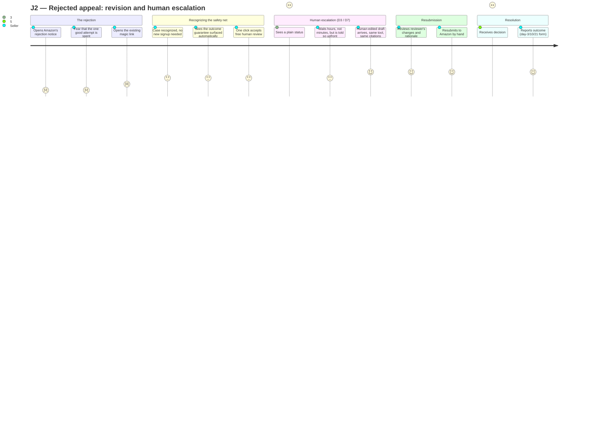
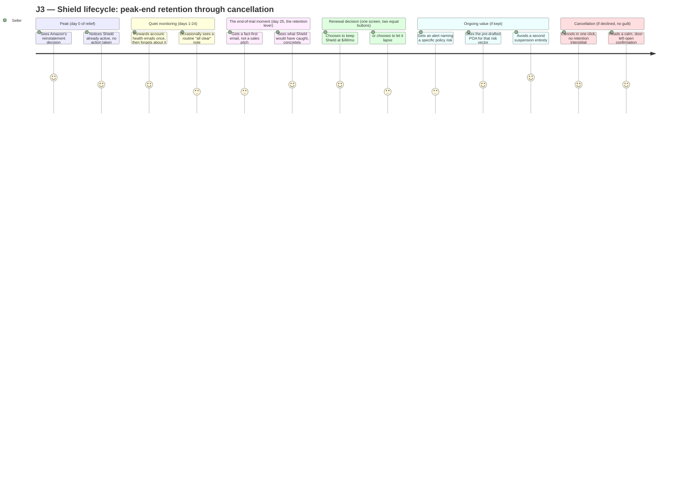
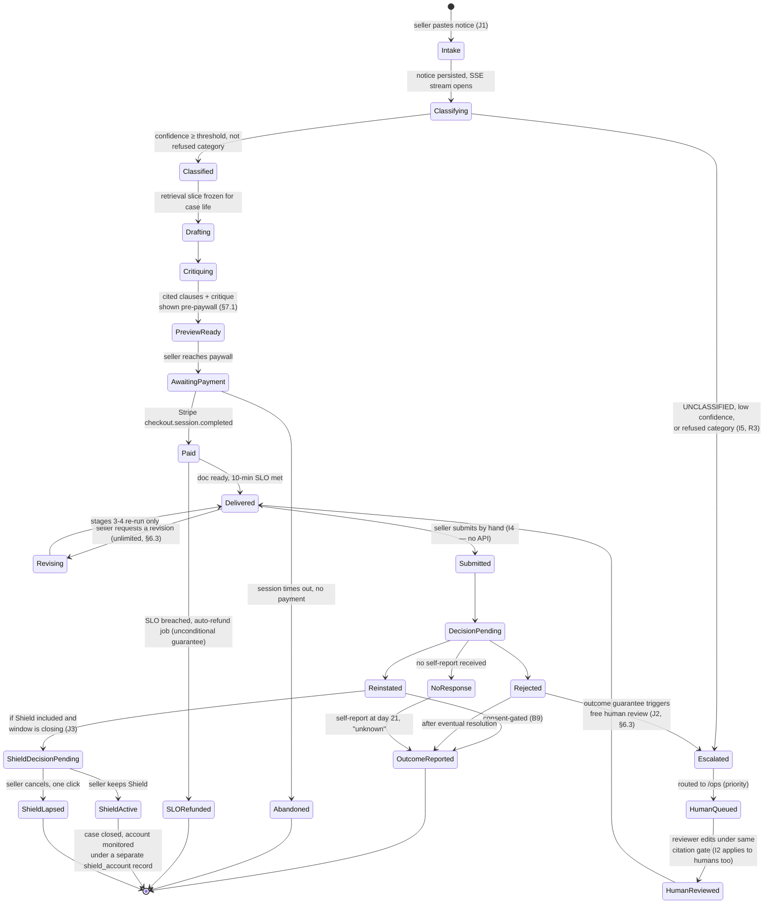

# CLAUSEWRIGHT — USER JOURNEYS (v1)

**Product:** Clausewright — *Suspension Defense Copilot for Amazon and Walmart sellers*
**Tagline:** *"Every day dark costs you a day's sales. Get back to selling — with the exact policy clause on your side."*
**Document owner:** UX researcher
**Date:** 2026-08-12
**Status:** Binding for the Phase-2 build. Amendments require a named source and a note of what they supersede.

**Upstream sources (treated as inputs, not re-derived):**
- `/home/user/Octopus/phase-1-ideation/IDEA_DOSSIER.md` — single source of truth; §1.2 JTBD, §6.1–6.4 offer/guarantee design, §7 MVP scope (B1–B11), §10 risk register.
- `/home/user/Octopus/phase-2-build/identity/NAMING.md` — name, tagline, and the seven naming invariants that bind all on-screen copy (§5).
- `/home/user/Octopus/phase-2-build/architecture/ARCHITECTURE.md` — the four-stage pipeline, screen inventory, case data model, and the five architectural invariants I1–I5.

---

## 0. The governing JTBD and what it means for design

> **"Get me back online without burning my one good attempt."**

Per Christensen's Jobs-to-be-Done framing (dossier §1.2), the buyer is not hiring a document — the *circumstance* is that their account went dark this morning, they are losing money every hour, and they have very few shots at the appeal. Two consequences follow directly for every screen in this document:

1. **The user is not in a normal cognitive state.** They are, per the dossier's own framing, "mid-panic." Every design decision below is filtered through the question: *does this reduce or add to the load on someone who is stressed, sleep-deprived, and doing arithmetic on lost revenue in their head?*
2. **There is no room for a wrong guess.** The product's worst failure mode is not "slow" — it is *"confidently wrong,"* because a bad appeal can burn the seller's one credible attempt (dossier R3). Nielsen's heuristic #5, **error prevention**, is therefore not a checklist item here; it is the single heuristic most directly tied to the JTBD, and it is treated as such throughout ([Nielsen, 10 Usability Heuristics](https://www.nngroup.com/articles/ten-usability-heuristics/)).

This document covers three end-to-end journeys, each traced to a segment defined in dossier §4.2:

| # | Journey | Primary segment | Entry moment | What it exercises |
|---|---|---|---|---|
| **J1** | Panicked first-time seller, 2am | S1 "Panicked Solo" | Deactivation notice just arrived | Decoder → Rescue → submission → monitoring activation |
| **J2** | Returning user, rejected first appeal | S1/S2 crossing into judgment territory | Amazon's rejection notice arrives | Revision loop, human escalation (D3/D7), outcome guarantee |
| **J3** | Shield subscriber lifecycle | S3 "Chronic" | 30-day included window winding down | Peak-end retention moment (D6), ongoing monitoring, cancellation |

Every screen named below already exists in `ARCHITECTURE.md §3.1–3.8`; this document does not invent new surfaces. It sequences the existing surfaces into journeys, states the emotional job each screen must do, and audits each against Nielsen's ten heuristics.

---

## 1. Journey 1 — Panicked suspended seller at 2am

### 1.1 Narrative

It is 2:14am. A seller's Amazon account went dark six hours ago. They have $340,000 in inventory in FBA warehouses and no idea why. They found a link to Clausewright in a Reddit thread on r/AmazonSeller fifteen minutes ago, posted by someone answering a stranger's "just got suspended, help" thread with a quoted reason code and a link — exactly the Bullseye community-channel mechanic the dossier prescribes (§6.5, Weinberg & Mares, *Traction*, 2015).

They land on a single page. There is no signup wall. Per **B1** and Nielsen heuristic #8 (*aesthetic and minimalist design* — "dialogues should not contain information which is irrelevant"), the only thing on the page is a text box and a button, because every field between a panicking buyer and their answer is a conversion tax the dossier explicitly names (`ARCHITECTURE.md §3.1`).

They paste the deactivation notice. Ten seconds pass. Then the page starts filling in — not all at once, but stage by stage, narrated the whole way: *reading your notice → identifying the policy → checking the exact clause → drafting → checking our own draft for weaknesses.* This staged reveal is the load-bearing move of the entire journey and is addressed in depth in §6.

They see: their reason code, in plain English, not Amazon's internal jargon. The **exact policy clause**, quoted verbatim with a citation, not a paraphrase — the one asset the architecture treats as a code-level invariant (`ARCHITECTURE.md I2`, `B4`; Anthropic [Citations](https://platform.claude.com/docs/en/build-with-claude/citations)). A readiness critique naming concrete gaps in what a draft like this typically gets wrong. This is Hormozi's Perceived-Likelihood lever #1 in action — "show the retrieved policy clause verbatim with its source, no competitor surfaces this today" (dossier §6.1) — and it is deliberately shown **before** payment, because per dossier §7.1 the differentiator must be visible pre-paywall or the primary experiment (A4) is confounded.

They also see a factual, non-manufactured urgency cue: *"You've been dark for 6 hours. Based on the $1,200/day you told us, that's roughly $300 so far."* Per Hormozi's *$100M Offers* (2021), genuine urgency is displayed, never invented — no countdown timer, no fake "3 people viewing this," because the loss is real and the seller performs the arithmetic themselves (dossier §1.3).

They pay $149. Ten minutes later — a machine-verified SLA (`ARCHITECTURE.md §3.5`), not a marketing claim — the full Plan of Action is in their inbox with a magic link, an editable document, a branded PDF, and an Evidence Kit. They copy it into Amazon's Account Health dashboard themselves — Clausewright never touches their account (**I4**) — and submit. Thirty days of Shield monitoring are already active, card already on file, with zero additional decision required at this moment. That decision is deliberately deferred to Journey 3, at the moment of relief rather than the moment of panic (dossier §6.4-M2; Fredrickson & Kahneman, 1993).

### 1.2 Journey diagram

```mermaid
journey
    title J1 — Panicked seller, 2am: notice to Shield activation
    section Discovery (2:14am, alone)
      Account goes dark, notice arrives: 1: Seller
      Panics, googles the reason code: 1: Seller
      Finds a stranger's helpful forum reply, clicks through: 2: Seller
    section Free Decoder (building trust, pre-paywall)
      Lands on a single textarea, no signup: 2: Seller
      Pastes the deactivation notice: 2: Seller
      Watches staged progress narrate the wait: 3: Seller
      Sees own reason code named in plain English: 3: Seller
      Sees the exact policy clause, quoted, sourced: 4: Seller
      Reads the readiness critique naming gaps: 4: Seller
    section Decision to pay ($149)
      Sees the $3,500 attorney / $1,250 consultant anchor: 4: Seller
      Pays via Stripe Checkout, ticks consent, revenue input: 3: Seller
    section Delivery (verified 10-minute SLA)
      Draft lands in inbox with magic link: 5: Seller
      Reviews full POA, Evidence Kit, branded PDF: 5: Seller
    section Submission (by hand, no credentials shared)
      Copies POA into Amazon Account Health dashboard: 4: Seller
      Submits, enters the wait for a decision: 3: Seller
    section Monitoring activation
      Sees 30 days of Shield already active, no new decision: 4: Seller
      Sets up email-forwarding for account-health alerts: 4: Seller
```

### 1.3 Screens, in order, with the emotional job of each

| # | Screen | Emotional job | Primary Nielsen heuristics | Notes |
|---|---|---|---|---|
| S1 | Decoder paste page (`/`) | *Relief that this is simple, not another form.* | #8 minimalist, #2 real-world match | One textarea, one button. Copy says "paste the email or screenshot text Amazon sent you," not "submit notice document." |
| S2 | Streaming preview (SSE) | *Confidence that something competent is happening, moment to moment.* | **#1 visibility of system status** (critical — §6), #6 recognition not recall | Each pipeline stage narrates itself in the seller's own words, not internal stage names. |
| S3 | Cited-clause + critique reveal (still pre-paywall) | *"This is different from a template — it actually read my notice."* | #1, #2, **#5 error prevention** | The critique names concrete deficiencies before the seller has paid for anything, which is the trust build, not a sales trick. |
| S4 | Paywall / anchor table + Stripe Checkout | *Fair price relative to the alternative, not a bait-and-switch.* | #2, #4 consistency, Ramanujam anchoring | Anchor table reproduces AppealDesk's own published comparison ($3,500 attorney / $1,250 consultant / $149 us — dossier §6.2), which the dossier explicitly licenses using a competitor's own anchor. |
| S5 | Full POA / magic-link page (`/c/{token}`) | *"I have something submission-ready, and I understand every part of it."* | #3 user control, #6, #7 flexibility, #9 error recovery | Inline editing, PDF download, Evidence Kit, and the revision entry point (feeds Journey 2). |
| S6 | Pre-submission checklist | *One last confidence check before the one shot is spent.* | **#5 error prevention** (critical — §7) | See §7.2 — this is the single highest-leverage error-prevention surface in the whole product. |
| S7 | Shield activation confirmation (email, not a new page) | *No new decision required right now.* | #7 flexibility (defer the decision), #1 | Confirms 30 days free, card on file, and states plainly that no charge happens until day 30 and cancellation is one click — set up now, litigated in Journey 3. |

### 1.4 Why the paywall sits where it sits (Nielsen #5, applied to the business model)

Per dossier §7.1, this is not a growth hack, it is **experiment design**: A4 is a *comparative* claim ("this converts a panicking seller to payment at a premium over a $97 incumbent"), so if the differentiator is hidden until after payment, the product never actually gets tested — only the promise does. The UX consequence is that S3 (cited clause + critique) must be **complete and legible on its own**, not a teaser fragment, because a half-visible proof reads as a dark pattern and directly undermines the Perceived-Likelihood term the whole offer is built to raise (dossier D7, Hormozi §6.1).

---

## 2. Journey 2 — Returning user with a rejected appeal

### 2.1 Narrative

Eleven days after submitting the Rescue draft, the seller gets Amazon's decision: rejected. This is the single worst moment in the product's emotional arc, because it directly threatens the JTBD's central fear — *burning the one good attempt.* Design here has one job: **do not let this moment feel like the end of the road**, because per dossier §6.3 the outcome guarantee exists precisely to convert this moment into a covered next step rather than a dead end: *"First submission rejected? Your human review is free."*

The seller opens the magic link they already have (no new signup, per **N4**). The page recognizes the case is theirs and immediately surfaces the guarantee rather than making them find it — Nielsen heuristic #6, *recognition rather than recall*: the system tells them what happens next, they do not have to remember the fine print from eleven days ago.

They are offered a choice, but the *safe* choice is pre-selected and one click: escalate to a human reviewer, free, per the outcome guarantee. This is where D3 and D7 do their work. D3 positions Clausewright as a *copilot*, not a generator that walks away once its confidence is spent — this is the exact case AppealDesk's model has no answer for, since AppealDesk triages hard cases away rather than escalating them (dossier §5.2, §5.4). D7 commits the entire offer budget to Perceived Likelihood, and lever #4 states plainly that *"the human tier's mere existence raises perceived likelihood of the cheaper tier"* (dossier §6.1) — so the human option must be visible and reachable at exactly this moment, not gated behind a support ticket.

The case is frozen at its classification (`ARCHITECTURE.md §3.2` — "the classification and the retrieved slice are frozen for the life of a case, so a revision can never silently change which policy the document argues under"), and routed to `/ops`. A human reviewer edits the **same document, in the same tool**, under the **same citation gate** (`I2` applies to human edits too — no reviewer can paste in an uncited policy reference). The seller sees a status update, not silence: *"A reviewer is on your case."* This single line does more Nielsen #1 work than any spinner could, because the wait here is measured in hours, not minutes, and an unnarrated multi-hour wait after a rejection reads as abandonment.

The human-reviewed draft arrives. The seller resubmits. If reinstated, the case closes into the outcome-report loop (**B9**) with a materially more valuable signal than a first-pass success, because it is a case the machine alone could not close — this is exactly the data the Process Power loop (Helmer, *7 Powers*, 2016; dossier §5.5) is built to capture and measure.

### 2.2 Journey diagram



### 2.3 Screens, with heuristic emphasis

| # | Screen | Emotional job | Primary Nielsen heuristics | Notes |
|---|---|---|---|---|
| S8 | Returning-case landing (magic link reopened) | *"They remember me and they have a plan."* | #6 recognition, #1 | No re-authentication, no re-explaining the case. The case state is fetched from `case.status`, not re-derived from the seller's memory. |
| S9 | Guarantee surfacing | *Relief — this was anticipated, not a special favor I have to argue for.* | #6, #2, **#5** (prevents the seller from paying twice for something already owed) | Copy states the guarantee's condition plainly: *"Your first submission was rejected, so your human review is free — here's what happens next."* |
| S10 | Escalation confirmation | *Confidence that a real person, not a retry of the same machine, is now involved.* | #1, #2 (never implies autonomy — NAMING.md invariant #4) | States a realistic time expectation ("same business day") rather than a false-precision countdown. |
| S11 | Reviewer-edited draft delivery | *"This got real scrutiny, not just a re-run."* | #3 user control, #9 error recovery | Surfaces a visible diff summary — what the reviewer changed and why — so the seller understands the improvement rather than trusting it blindly. |
| S12 | Outcome report (day-3/10/21 one-click form) | *"They actually want to know what happened, not just my money."* | #7 flexibility, #10 (light — one line of context on why we ask) | Consent-gated (**B9**); declining never degrades service, per the separable-consent design in `ARCHITECTURE.md §3.7`. |

### 2.4 Why this flow is a retention lever disguised as a support flow

The `churn-retention` judge lens ranked the idea last of eight specifically because "get reinstated, then cancel" is the archetypal one-off JTBD (dossier §9.2). Journey 2 is where that critique is answered in the product, not argued away: a seller who experiences a *good* rejection-recovery flow is the seller most likely to (a) accept the Shield offer in Journey 3, because they have direct evidence the safety net is real, and (b) become the next forum reply that seeds Journey 1 for someone else — the same community mechanic the dossier names as the #1-ranked acquisition channel (§6.5).

---

## 3. Journey 3 — Shield subscriber lifecycle, including cancellation

### 3.1 Narrative

This journey starts at the best possible emotional moment in the entire product: reinstatement. The seller is back online. Per Fredrickson & Kahneman's peak-end rule (1993, *Journal of Personality and Social Psychology*; see also Kahneman, *Thinking, Fast and Slow*, 2011), retrospective evaluation of an affective episode is dominated by its **peak** and its **ending** — and this moment is both the peak of relief *and*, if the flow is designed correctly, the point where the retention decision is made. This is **D6** and **§6.4-M2** made concrete: the subscription is *not* sold at 2am during panic (that is a bad moment to add any decision, per §1.3's Effort & Sacrifice term already scoring 8/10 precisely *because* there is no intake call and no extra decision), it is sold — or rather, *confirmed or declined* — thirty days later, at relief.

Day 25 of the included 30-day Shield window, the seller gets an email. It does not open with a sales pitch. It opens with the fact: *"Your 30 days of free monitoring end in 5 days. Here's what it caught (or: here's what it would have caught)."* This is Nielsen heuristic #1 applied to a subscription, not just a pipeline: the seller should never be surprised by a charge, and the system should show its work before asking for continued trust.

They land on a one-screen decision: **keep Shield at $49/mo** (with the framing that one included Rescue appeal per year is bundled in, per dossier §6.2's correction that monitoring alone is a ~$20 commodity and the bundle is what earns the $49 price) or **let it lapse**, both one click, both equally weighted visually — this matters, because Nielsen heuristic #3 (*user control and freedom*) and the anti-dark-pattern posture the whole guarantee stack is built on (Hormozi's guarantee taxonomy explicitly prefers *service* over coercion, dossier §6.3) both argue against making cancellation the hard path.

**If they keep it:** ongoing monitoring runs quietly via the inbound-email adapter (`ARCHITECTURE.md §3.8`) with zero new UI surface — an alert arrives only when there is something to say, naming the specific policy at risk, with a pre-drafted POA attached for the top-3 risk vectors. This is the moment Shield's whole value proposition is proven or disproven in the seller's own experience, not in marketing copy.

**If they cancel:** the flow is one click, no phone call, no retention interstitial arguing them out of it, no "are you sure?" guilt copy. Per the peak-end rule, this ending is disproportionately what the seller will remember and repeat to other sellers in a forum — the same forum that is the entire distribution engine (dossier §6.5). A punitive or confusing cancellation experience would poison exactly the referral loop the business depends on to acquire its next ten customers at near-zero cost. The cancellation confirmation screen says one calm thing: *"Cancelled. If your account ever needs us again, we'll be here — no charge until you say so."* This line is deliberately worded to leave the door open without applying pressure, consistent with NAMING invariant #7 (*"brand the proof, not the feature"*) — the trust asset (citations, the human backstop) is what should bring them back, not a dark pattern.

A returning "Chronic" seller (dossier segment S3) who kept Shield and later gets an alert re-enters a shortened version of Journey 1: the reason code and the relevant policy clause are already surfaced by the alert, and the pre-drafted POA for that risk vector cuts the time-to-draft further — the subscription's value compounds the more the seller experiences the appeal flow.

### 3.2 Journey diagram



### 3.3 Screens, with heuristic emphasis

| # | Screen | Emotional job | Primary Nielsen heuristics | Notes |
|---|---|---|---|---|
| S13 | Reinstatement confirmation (triggered from outcome report) | *Peak relief, acknowledged.* | #1 | The system explicitly congratulates and confirms Shield is already covering them — no new form to fill in at the peak moment. |
| S14 | Day-25 pre-decision email | *Informed, not sold to.* | #1, #2, #10 (a short "why we're telling you this now" line) | Leads with fact (what was monitored / caught), not price, per Hormozi's genuine-vs-manufactured-urgency distinction (§1.3) applied here to retention rather than acquisition. |
| S15 | Renewal decision screen | *A real choice, not a maze.* | **#3 user control**, #4 consistency, #8 minimalist | Keep / Let lapse presented with equal visual weight; no pre-checked "keep paying" box; price and the bundled-appeal value stated together (Ramanujam bundling, dossier §6.2). |
| S16 | Ongoing alert (email) | *"They caught something before I did."* | #1, #2, #5 error prevention | Names the specific policy at risk in plain language and attaches the pre-drafted POA — this *is* the shortened re-entry into the appeal pipeline. |
| S17 | Cancellation confirmation | *Respected, not punished, for leaving.* | **#3 user control**, #9 (no error framing at all — cancellation is not treated as a failure state) | One click from the decision screen; no phone call, no downgrade maze, no dark-pattern "are you sure you want to lose protection" copy. Peak-end rule applies to the *offboarding* experience as much as the onboarding one. |

### 3.4 The anti-pattern this journey explicitly rejects

Riverbend's PRO/GUARDIAN insurance-style bundling (dossier §3.1, §6.4-M1) and the broader SaaS-retention playbook both create pressure to make cancellation hard. That pressure is explicitly rejected here for three converging reasons, each traceable to a cited source: (1) Fredrickson & Kahneman's peak-end rule means a bad ending is disproportionately remembered and repeated; (2) Hormozi's guarantee philosophy (§6.3) prefers earning retention through service over coercion; (3) the dossier's own arithmetic shows the community channel — driven by exactly this kind of goodwill — is worth more than the marginal MRR a hard-to-cancel flow would retain (contribution LTV math, §6.6). A frictionless cancellation is not a concession to the churn-retention judge lens's critique (dossier §9.2); it is the correct response to it — the honest fix is a genuinely valuable Shield experience during the 25 quiet days, not a harder exit.

---

## 4. State diagram — the lifecycle of one appeal case

This extends the abridged `case.status` field in `ARCHITECTURE.md §5.1` into the full state machine that the three journeys above walk through. It is the canonical reference for what "status" means at each screen, and for which UI is shown at each state — every screen in §§1–3 renders exactly one of these states.



**Reading notes:**

- **`Escalated` is reachable from two different places** — first-pass classification failure and post-rejection guarantee — and both routes converge on the identical `/ops` surface described in §2.1. This is deliberate: the human-review experience should not visibly differ depending on *why* a human got involved, because a seller who is escalated post-rejection should feel they are getting the same quality bar as a seller escalated for a hard case from the start, not a "second-tier" recovery path.
- **`Revising` and `Escalated → HumanQueued` are structurally distinct** — a revision is the seller asking the *machine* to try again with new notes; an escalation moves the case to a *human*. Conflating them in the UI would understate what the outcome guarantee actually delivers.
- **`ShieldDecisionPending` is intentionally its own state**, separate from the appeal case's terminal states, so that the retention decision (§3) never blocks or delays the seller from closing out the appeal itself — the two decisions are decoupled in time by design (peak-end sequencing, D6).

---

## 5. Full Nielsen heuristic matrix, all screens

`✓✓` = load-bearing for this screen (a failure here breaks the JTBD). `✓` = applies, meaningfully addressed. `–` = not materially applicable.

| Screen | #1 Status | #2 Real-world match | #3 User control | #4 Consistency | #5 Error prevention | #6 Recognition | #7 Flexibility | #8 Minimalist | #9 Error recovery | #10 Help/docs |
|---|:---:|:---:|:---:|:---:|:---:|:---:|:---:|:---:|:---:|:---:|
| S1 Decoder paste | ✓ | ✓✓ | ✓ | ✓ | ✓ | – | ✓ | ✓✓ | – | ✓ |
| S2 Streaming preview | **✓✓** | ✓✓ | ✓ | ✓ | ✓ | ✓ | – | ✓ | ✓ | – |
| S3 Cited-clause + critique | ✓✓ | ✓✓ | – | ✓ | ✓✓ | – | – | ✓ | – | – |
| S4 Paywall / anchor table | ✓ | ✓✓ | ✓ | ✓ | ✓ | – | ✓ | ✓ | – | ✓ |
| S5 Full POA / magic link | ✓ | ✓ | ✓✓ | ✓ | ✓ | ✓✓ | ✓✓ | ✓ | ✓✓ | ✓ |
| S6 Pre-submission checklist | ✓ | ✓ | ✓ | ✓ | **✓✓** | ✓ | – | ✓ | ✓ | – |
| S7 Shield activation email | ✓ | ✓ | ✓ | ✓ | ✓ | ✓ | ✓ | ✓✓ | – | – |
| S8 Returning-case landing | ✓ | ✓ | ✓ | ✓✓ | ✓ | ✓✓ | – | ✓ | ✓ | – |
| S9 Guarantee surfacing | ✓✓ | ✓✓ | ✓ | ✓ | ✓✓ | ✓✓ | – | ✓ | ✓ | ✓ |
| S10 Escalation confirmation | ✓✓ | ✓ | ✓ | ✓ | ✓ | – | – | ✓ | ✓ | – |
| S11 Reviewer-edited delivery | ✓ | ✓ | ✓✓ | ✓ | ✓ | – | ✓ | ✓ | ✓✓ | – |
| S12 Outcome report | ✓ | ✓ | ✓✓ | ✓ | – | ✓ | ✓✓ | ✓✓ | – | ✓ |
| S13 Reinstatement confirmation | ✓✓ | ✓ | – | ✓ | – | ✓ | – | ✓ | – | – |
| S14 Day-25 pre-decision email | ✓✓ | ✓ | ✓ | ✓ | ✓ | ✓ | – | ✓ | – | ✓ |
| S15 Renewal decision | ✓ | ✓ | **✓✓** | ✓✓ | ✓ | ✓ | ✓ | ✓✓ | ✓ | ✓ |
| S16 Ongoing alert | ✓✓ | ✓✓ | ✓ | ✓ | ✓✓ | – | – | ✓ | ✓ | – |
| S17 Cancellation confirmation | ✓ | ✓ | **✓✓** | ✓ | – | – | ✓ | ✓✓ | – | – |

Two columns dominate the matrix — #1 (nine `✓/✓✓` of seventeen screens) and #5 (eight of seventeen) — which is the quantitative version of the mandate given for this document. §6 and §7 go deep on exactly those two.

---

## 6. Heuristic #1 under load: visibility of system status during a 10-minute wait

Nielsen's original formulation: *"The system should always keep users informed about what is going on, through appropriate feedback within reasonable time"* ([Nielsen, 10 Usability Heuristics](https://www.nngroup.com/articles/ten-usability-heuristics/)). A 10-minute wait — even a *guaranteed* 10-minute wait — is an eternity in web-interaction terms, and it is happening to someone already anxious. This is the single highest-risk UX surface in the product, because the alternative to good status visibility is not "a slightly worse experience," it is **the seller closing the tab and going back to a blank Google Doc** (dossier §5.4's first competitive alternative) — the free-DOM abandonment failure mode.

**Design response, mapped to the architecture:**

1. **The four pipeline stages are the progress bar.** `ARCHITECTURE.md §3.2` names four discrete, code-level stages — classify, retrieve, draft, critique (Anthropic's *Building Effective Agents* workflow patterns: routing, then a pure retrieval step, then prompt chaining, then evaluator-optimizer). Because control flow genuinely lives in code (**I1**), the UI can narrate *real* checkpoints rather than a synthetic percentage — there is no need to fabricate a progress bar because the stage boundaries already exist as real state transitions. This is a case where the "workflow, not agent" architectural decision (D9) and the UX decision reinforce each other directly.
2. **Narrate in the seller's language, not the system's.** Per Nielsen heuristic #2, the SSE stream renders *"Reading your notice…" → "Found it — this is a [reason code] case." → "Checking the exact policy clause…" → "Drafting your Plan of Action…" → "Double-checking our own draft…"* — never "Stage 2/4: retrieval," which is an internal engineering label with no meaning to a stressed buyer.
3. **Streamed content, not a spinner, fills the wait.** The retrieval and citation stages resolve fast (retrieval is a pure in-process function with no network call, per `§3.2`); the draft stage streams token-by-token. By the time the seller has read the cited clause and the critique, several of the ten minutes have already passed *productively* — they were reading something real, not staring at a loader.
4. **A stalled or failed stage says so honestly.** If `stop_reason === 'max_tokens'` triggers a retry (`ARCHITECTURE.md §3.2`), the UI says *"Still working — this one's taking a bit longer, your draft is not lost"* rather than silently re-spinning, which would read as a hang. Silence at this specific moment is the single highest-risk micro-interaction in the product.
5. **The 10-minute guarantee is visible as a running clock, not a hidden SLA.** Because `paid_at → document_ready_at` is measured in code (`ARCHITECTURE.md §3.5`), the UI can show a real countdown with an honest promise attached — *"in your inbox in 10 minutes or it's free"* — which is simultaneously a trust signal (Hormozi's unconditional guarantee, §6.3) and a status indicator, doing double duty.

---

## 7. Heuristic #5 under load: error prevention for a one-shot appeal

Nielsen's original formulation: *"Even better than good error messages is a careful design which prevents a problem from occurring in the first place"* ([Nielsen, 10 Usability Heuristics](https://www.nngroup.com/articles/ten-usability-heuristics/)). The dossier is explicit that this is not an abstract usability nicety here — it names misclassification as the **"highest technical damage"** risk in the entire risk register (R3), worse than downtime, because a confidently wrong document can consume the seller's one credible appeal attempt.

**Design response, mapped to the architecture:**

1. **The system refuses to guess, and says so plainly (I5).** `UNCLASSIFIED` and low-confidence outcomes are first-class terminal states, not silently-coerced best guesses (`ARCHITECTURE.md §3.2`, discriminated union return type). On screen this reads as *"We're not confident enough in the reason code to draft — this needs a person, and here's what that costs and how fast"* rather than a degraded document with a hidden caveat. Per Nielsen, refusing to produce output is itself the error-prevention mechanism, not a failure of the product.
2. **Honest triage is framed as a trust signal, not a rejection.** The refused-category set (IP, counterfeit, linked accounts, fraud, Section 3 abuse, GPSR — dossier §6.1 lever 2) routes to a human or a partner-attorney referral rather than a generic "sorry, unsupported" dead end. This is Perceived-Likelihood lever #2 made concrete on screen: *"Cases like this need judgment a document can't provide — here's someone who's handled this exact category."*
3. **S6, the pre-submission checklist, is the highest-leverage single screen in the product.** Before the seller copies the POA into Amazon's dashboard — the one action that spends the one attempt — the UI surfaces: (a) the critique's named deficiencies, re-shown, with a plain confirm-or-fix step; (b) a reminder that this submission is what starts the clock on a 3–30 day wait with no committed timeline (dossier §7.1 — Walmart states appeals are "handled and responded to in the order in which they're received," with no SLA); (c) an explicit, unhurried "review it yourself before you send it" framing, because Nielsen error prevention here means **slowing the user down at exactly the one moment it matters**, which directly trades against the Time-Delay term of the value equation — and that trade is the correct one, because Perceived Likelihood (3/10) is the binding constraint the whole offer budget targets (D7), not Time Delay (already 9/10).
4. **The citation gate is error prevention the seller never has to invoke.** Because no uncited policy reference can reach the render layer (**I2**, enforced by `assertOnlyCitedClauses()` and a CI test — `ARCHITECTURE.md §3.4`), the single most damaging category of error — a hallucinated policy clause presented as authoritative — is structurally impossible to see on screen, not merely unlikely. This is Twelve-Factor discipline (guarantees enforced in code, not procedure — [12factor.net](https://12factor.net/)) applied to trust rather than deployment.
5. **Revisions cannot silently change the legal ground of the case.** Classification and the retrieved corpus slice are frozen for the life of a case (`ARCHITECTURE.md §3.2`); the UI never offers a "start over with a different reason code" affordance mid-case, because that would let a seller accidentally argue an inconsistent case across drafts without realizing it.
6. **Adverse-selection guardrails are enforced before payment, not after.** Per Akerlof's classic result on quality uncertainty (1970, *QJE*) — cited in the dossier as the reason a strong refund guarantee needs a complementary control (§6.3, §10.1 R8) — honest triage screening happens *before* the paywall, so a seller with an unwinnable case is told so for free rather than discovering it only after paying and requesting a refund. The error prevented here is not a UI slip; it is a business-model failure mode, prevented by sequencing.

---

## 8. Emotional design constraints — the calm-under-stress system

These are binding constraints on every screen, not stylistic suggestions, because the buyer's cognitive state is a load-bearing product requirement, not a nice-to-have.

1. **One primary action per screen, always.** A stressed reader scanning under time pressure should never have to choose between two equally-weighted calls to action except at the two places a real, symmetric choice exists (S4's tier choice, S15's renewal choice) — and even there, per Nielsen #3, neither option is visually punished.
2. **Plain language over category jargon, enforced by NAMING.md's invariants.** "Policy clause," never "legal clause"; "reviewer," never "counsel" or "advocate"; never a claim of autonomy ("we file for you," "automatic submission") (`NAMING.md §5`). This is Nielsen #2 (*match between system and the real world*) elevated to a compliance control, because the register drift these invariants prevent is also a UPL exposure (dossier R9).
3. **Real urgency only, displayed, never manufactured.** The loss counter (`days_dark × self_reported_daily_revenue`) is the only urgency device in the product, and it is always the seller's own numbers, editable, never a countdown timer or a fake scarcity claim (Hormozi, *$100M Offers*, 2021, §1.3).
4. **Generous whitespace and a restrained palette over alarm-red saturation.** A screen delivering a rejection (§2) or a critique full of "deficiencies" (§1.3) is exactly the moment a busy, red-heavy interface would compound stress rather than help process it. Per Apple's [Human Interface Guidelines](https://developer.apple.com/design/human-interface-guidelines/) (Liquid Glass), the visual system uses one translucent material layer with content-first contrast — the interface recedes so the seller's attention goes to the clause, the critique, and the next action, not to chrome. Deficiencies and risk language are set in a calm neutral tone, not error-red, because they are diagnostic information the seller needs to read carefully, not an alarm to react to.
5. **Progress is never silent, but it is never noisy either.** §6 above is the acute case (a 10-minute pipeline); the same principle governs the quiet 25 days of Shield monitoring in Journey 3 — an "all clear, nothing to report" note occasionally, rather than either silence (which reads as "is this even working?") or constant pings (which reads as manufactured anxiety to justify the subscription).
6. **Every screen states, or clearly implies, what happens if the seller does nothing.** Under stress, decision paralysis is common; a design that requires action to avoid harm (e.g., "confirm within 24 hours or lose your discount") actively works against a buyer in this state. Shield's default (S15) is framed as *"keep, or let lapse — either way nothing charges you by surprise,"* never a forced choice with a penalty for inaction.
7. **The human backstop is always one visible click away, never a hidden support-ticket flow.** Per D3's category positioning ("copilot," not "generator that walks away"), every screen where a machine-only answer might be insufficient — the critique, the escalation offer, the rejected-appeal recovery — surfaces the human option inline, not behind a help menu (Nielsen #10 kept deliberately minimal everywhere *except* here).
8. **Endings are designed as carefully as beginnings.** Per Fredrickson & Kahneman's peak-end rule (1993), the reinstatement confirmation (S13) and the cancellation confirmation (S17) receive the same design attention as the first paste screen — because both are disproportionately what gets remembered, repeated in a forum post, and acted on the next time this seller (or someone they tell) gets suspended.

---

## 9. Open questions and hypotheses flagged

Per the literature-grounding standard applied throughout the dossier, anything below is a design judgment made in this document, not a claim traceable to a cited source, and is flagged accordingly:

- **The specific streamed micro-copy** ("Reading your notice…", etc.) is a proposed implementation of Nielsen #1 and #2; it has not been user-tested. **Hypothesis.**
- **Symmetric visual weighting on S15 (renewal decision)** is a design inference from Nielsen #3 and the peak-end rule, not from a published A/B result specific to this category. **Hypothesis.**
- **The claim that a punitive cancellation flow would measurably suppress forum referrals** is a reasonable extrapolation from the peak-end rule and the dossier's own Bullseye channel-scoring (§6.5), but no direct study connects cancellation UX to referral rate in this exact market. **Hypothesis, flagged, not measured** — a candidate addition to the outcome-report instrumentation in **B9** if it can be tracked (e.g., a lightweight "how did you hear about us" field already implied by the CAC-per-community-post metric in dossier §7.5).
- **Day-25 as the specific timing for the Shield pre-decision email** is inferred from D6's 30-day window and the peak-end rule's emphasis on proximity to the emotionally significant ending; the dossier does not specify an exact day. **Design judgment, not a cited finding.**

---

## References

- **Clayton Christensen**, Jobs-to-be-Done framing (dossier §1.2, itself drawn from *The Innovator's Dilemma*, 1997) — the circumstance-and-job definition governing every screen's emotional job (§0).
- **Jakob Nielsen**, 10 Usability Heuristics — [nngroup.com](https://www.nngroup.com/articles/ten-usability-heuristics/) — the governing framework for §§1–7, applied per-screen and consolidated in the matrix (§5) with special-case depth on #1 (§6) and #5 (§7).
- **Apple**, Human Interface Guidelines (Liquid Glass) — [developer.apple.com/design/human-interface-guidelines](https://developer.apple.com/design/human-interface-guidelines/) — the calm, content-first, single-material-layer visual system (§8.4), and wordmark/icon legibility carried over from `NAMING.md §3.5`.
- **Anthropic**, "Building Effective Agents" — [anthropic.com/engineering/building-effective-agents](https://www.anthropic.com/engineering/building-effective-agents) — the workflow patterns (routing, prompt chaining, evaluator-optimizer) that make the four pipeline stages real, narratable checkpoints rather than a synthetic progress bar (§6.1).
- **Patrick Lewis et al.**, "Retrieval-Augmented Generation for Knowledge-Intensive NLP Tasks," NeurIPS 2020 — [arXiv:2005.11401](https://arxiv.org/abs/2005.11401) — the architectural basis for the cited-clause screen (S3) being the pre-paywall proof point (§1.1, §1.4).
- **Andrej Karpathy**, "Software 2.0" (2017) — [karpathy.medium.com/software-2-0-a64152b37c35](https://karpathy.medium.com/software-2-0-a64152b37c35) — the outcome-report screens (S12) as the interface layer over the corpus-as-artifact loop (**B9**).
- **The Twelve-Factor App** — [12factor.net](https://12factor.net/) — guarantees enforced structurally in code rather than procedurally in a runbook, applied here to the citation gate (§7.4) and the 10-minute SLA (§6.5) as UX-visible consequences of architectural invariants **I1–I2**.
- **April Dunford**, *Obviously Awesome* (2019) — category-consistent, jargon-free screen language (§8.2) and the anchor-table framing on S4 (§1.3), both downstream of the D3 category exit from "AI POA generator."
- **Alex Hormozi**, *$100M Offers* (2021) — the value equation and the Perceived-Likelihood binding constraint governing the pre-paywall reveal (§1.4) and the pre-submission checklist trade-off (§7.3); the guarantee taxonomy underlying the rejected-appeal recovery flow (§2) and the anti-coercion cancellation design (§3.4); the genuine-vs-manufactured urgency rule (§8.3).
- **Madhavan Ramanujam & Georg Tacke**, *Monetizing Innovation* (2016) — bundling (Shield's included annual appeal, §3.1) and anchoring (S4) as on-screen value framing, not just pricing-page arithmetic.
- **George Akerlof**, "The Market for 'Lemons,'" *Quarterly Journal of Economics* 84(3), 1970 — the adverse-selection rationale for sequencing honest triage before payment rather than relying on the refund guarantee alone (§7.6).
- **Barbara Fredrickson & Daniel Kahneman**, "Duration Neglect in Retrospective Evaluations of Affective Episodes," *Journal of Personality and Social Psychology* 65(1), 1993; **Daniel Kahneman**, *Thinking, Fast and Slow* (2011) — the peak-end rule governing the entire Journey 3 sequencing (§3.1, §3.4) and the design parity between onboarding and offboarding screens (§8.8).
- **Hamilton Helmer**, *7 Powers* (2016) — Process Power as the reason the human-escalation and outcome-report screens (S10–S12) are treated as data-capture surfaces, not just support UX (§2.4).

---

**Document status:** binding for Phase 2. Where this document conflicts with an implementation choice made later, this document wins unless a superseding decision is written and merged, consistent with the standard set in `IDEA_DOSSIER.md` and `ARCHITECTURE.md`.
