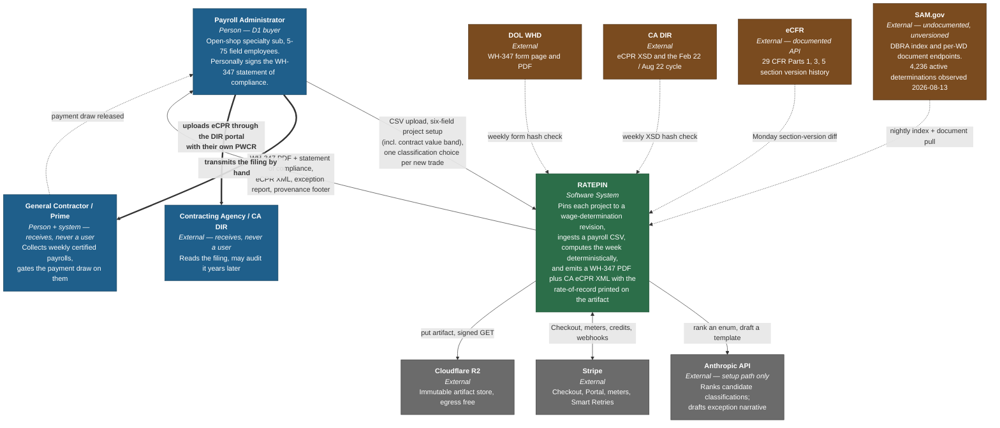
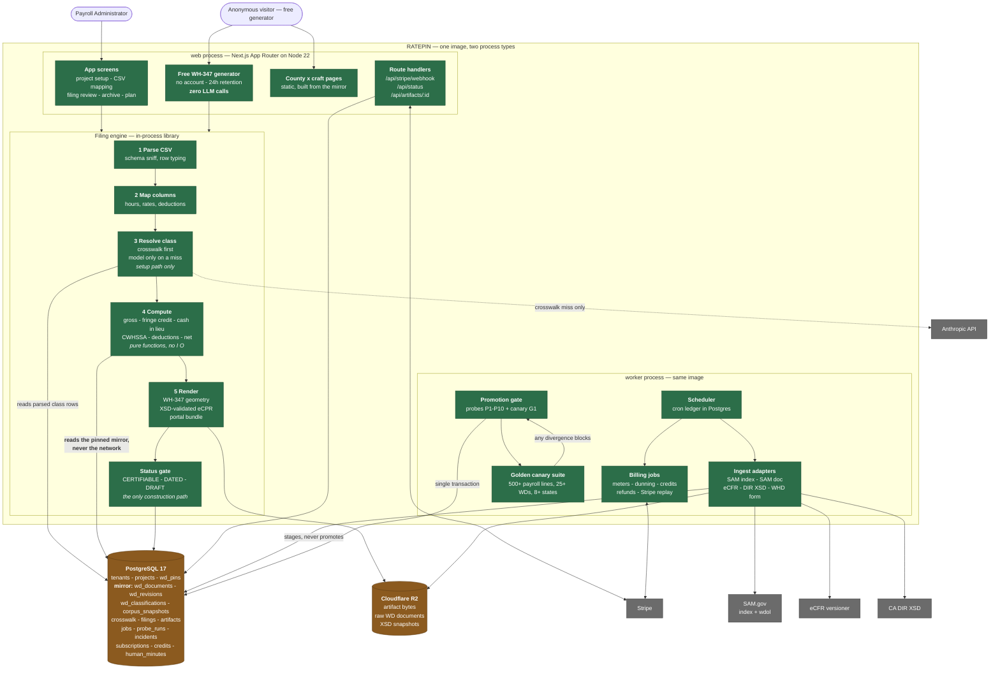
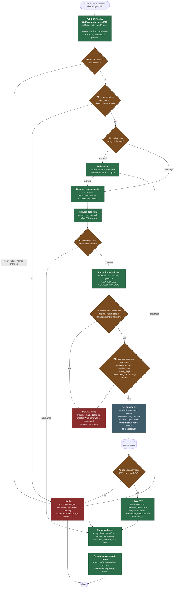
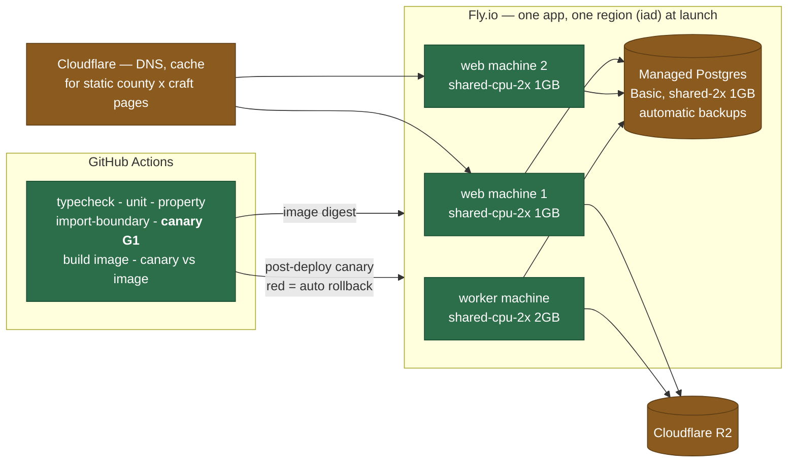

# RATEPIN — SYSTEM ARCHITECTURE (v1)

**Product:** Ratepin — *certified-payroll rate-of-record engine for open-shop specialty subcontractors on Davis-Bacon work.*
**Job (D2):** "Get Friday's certified payroll out the door with rates I can defend."
**Document owner:** System architect
**Date:** 2026-08-13
**Status:** Binding for the Phase-2 build. Amendments require a named source and a note of what they supersede.

**Upstream inputs, treated as given and not re-derived:**

- `/home/user/Octopus/run-2/PLAN.md` — the autonomy gate **A1–A6**.
- `/home/user/Octopus/run-2/phase-1-ideation/IDEA_DOSSIER.md` — binding decisions **D1–D10**, risks **R1–R3**, gates **G1–G6**.
- `/home/user/Octopus/run-2/phase-1-ideation/research/01-demand-pmf.md` … `04-mvp-scope.md` — the four validation deep dives. Their findings are binding on this document.
- `/home/user/Octopus/phase-2-build/architecture/ARCHITECTURE.md` — run 1 (Clausewright). Its stack is the default; §2.4 records where we depart and why.

Every endpoint, price, schema fact and regulatory quotation below was **fetched live on 2026-08-13** through this document's own References section. Where a fact came from a deep dive and I re-verified it today, I say so. Where I could not reproduce a deep dive's observation, I say that too (§8.2, P0).

**Document authority — read this before implementing anything in §7, §8 or §4.4.**

Four documents in this set each declare themselves binding, and the adversarial review showed exactly how that goes wrong: `CORPUS_DESIGN.md` had already field-scoped the dual-ingest blocking rule while this document still gave blocking power to a flag that disagrees on 100% of the corpus, and a builder reading this document first would have shipped a product that promotes nothing. The boundary is therefore stated once, at the top, in both documents:

> **`CORPUS_DESIGN.md` is the single authority on ingest.** Where this document and `CORPUS_DESIGN.md` disagree about how the corpus is fetched, reconciled, promoted or blocked, **`CORPUS_DESIGN.md` governs and this document defers to it.** The scope rule: `ARCHITECTURE.md` owns what the product *does with* the corpus (the read path, the pin, the ladder's customer-visible behaviour, the artifact status type, the tenant boundary); `CORPUS_DESIGN.md` owns *what is in the corpus and how it got there* (request shapes, probe thresholds, promotion gates, reconciliation field lists).
>
> **`ENGINE.md` is the single authority on the money arithmetic and on what the deterministic core computes.** Where this document summarises a formula, a coverage gate or a permissible-deduction set, `ENGINE.md` governs.

Corrections applied to this revision, each with the section it supersedes, so the override is auditable rather than implicit:

| # | This revision changes | Superseded by / aligned with | Finding |
|---|---|---|---|
| **AS-1** | §8.2 **P4**'s blocking set is now exactly `{revision_number, publish_date, active_flag}`; `standard` and structured county codes are advisory (new **P4a**). ADR-004's decision sentence and its "earned its place" claim are withdrawn. | `CORPUS_DESIGN.md` §9.5, §10.6 | **CRIT-1** |
| **AS-2** | §5.1 `projects` gains a **required** `contract_value_band`; `unknown` withholds certification (**P-B**). §3.2's CWHSSA description is gated on it. | `ENGINE.md` §7.0 | **CRIT-3** |
| **AS-3** | §7.1 and the §4.4 diagram: the active crawl is **one request at `size=5000`**, not 43 pages at `size=100`. | `CORPUS_DESIGN.md` §2.1, §9.2 | **HIGH-5** |
| **AS-4** | §3.2's deduction list no longer enumerates eight categories; 29 CFR 3.5 has **ten**, (a)–(j). | `ENGINE.md` §9.2 | **HIGH-6** |
| **AS-5** | §11.6 / §3.7: the cross-tenant crosswalk aggregate may **only order** a candidate list. It may never pre-select, default or auto-apply. | `CORPUS_DESIGN.md` §7.2, §7.4; `ENGINE.md` §18.2 | **HIGH-2** |
| **AS-6** | §3.1 / §11.3: the artifact download is a **server-brokered authenticated stream**, never a presigned redirect. §5.5 states exactly what account deletion erases and does not erase. | — | **HIGH-4**, **HIGH-3** |
| **AS-7** | §9.4's credit ceiling is `max(CREDIT_FLOOR_CENTS, pct × MRR)`, evaluated per incident, and is **never silent**. §11.3/Q2 states the `pgcrypto` threat model honestly and time-boxes it. | — | **MED-3**, **MED-7** |
| **AS-8** | §3.5 separates the WH-347's **six reverse-side boxes** (WHD form instructions) from 29 CFR 5.5(a)(3)(ii)(C)'s **three** certifications; §11.7 bans the false "a superseded revision cannot be reconstructed" moat claim from all copy. | eCFR API, verified 2026-08-13 | **MED-1**, **R-HIGH7** |

---

## 0. The seven architectural invariants

Everything else in this document is elaboration. These seven are the calls. Each traces to a binding Phase-1 decision, and each is enforced by a mechanism that fails a build rather than by a convention that fails a review.

| # | Invariant | Enforced by | Traces to |
|---|---|---|---|
| **I1** | **The money arithmetic is code, never a model.** Hours, gross, fringe credit, cash-in-lieu, CWHSSA premium, deductions and net are pure functions under property tests. | `src/engine/arithmetic/**` is a leaf module with zero imports outside `src/domain`. A CI import-boundary check (`§3.10`) fails the build if it ever imports the Anthropic adapter. | **D6**; 29 CFR 5.5(b)(1), 5.31(b), 5.32 |
| **I2** | **The model may never emit a number that reaches an artifact.** Its two jobs are ranking an enum and filling a fixed narrative template. Every response is JSON-schema-validated and rejected on failure; the classification field is constrained to the primary-key set of that WD revision's parsed classification rows. | `classification-rank.ts` returns `ClassificationId[]`, a branded type constructible only from a mirror row. Numeric fields are absent from the response schema, not merely ignored. | **D6**; Anthropic, *Building Effective Agents* — workflows over agents |
| **I3** | **Two things are off the filing critical path: live SAM, and the model.** Rates resolve from a pinned local mirror row; classifications resolve from persisted per-account memory. Both are decided at *setup* time and read at *generation* time. | `src/engine/**` may import `src/mirror/read` and nothing else with an I/O surface. No HTTP client, no `fetch`, no ingest module. CI-enforced (`ADR-003`). | **D7**, and the single autonomy objection the dossier had to close |
| **I4** | **Fail closed on the claim, never on the filing.** Source outage degrades the *freshness sentence*. Only two things ever block output: an unresolved payroll line (signature withheld, `DRAFT — NOT CERTIFIABLE`) and an XSD hash mismatch on the CA path. | The artifact status enum has exactly three members and one construction path (`§6.3`). The five-level degradation ladder is a state machine with a transition table under test (`§8.1`). | **D7**, **A3**, **A5**, **R1** |
| **I5** | **The mirror is append-only and content-addressed; nothing is ever overwritten.** A superseded WD revision is retained forever with its response hash, fetch timestamp and source URL. | `wd_documents` and `wd_revisions` have no `UPDATE` grant for the application role. Corrections are new rows with a later `observed_at`. | **D5**, **R1**, **R3** |
| **I6** | **Every artifact is immutable, content-addressed and self-describing.** WD number, revision, WD publication date, corpus snapshot hash, schema hash and generation timestamp are baked into the artifact bytes, not looked up later. | `artifacts.sha256` is the primary identity; the provenance block is rendered from the same struct that produced the numbers. An amendment is a new filing linked to the old one, never an edit. | **D5**, **D8**, **R3** |
| **I7** | **Nothing pages a human, because there is no human.** Every signal terminates in one of exactly four automatic actions: degrade the claim, freeze promotion, credit the customer, roll back the release. A signal that cannot be routed to one of the four is not an alert; it is a counter. | `src/ops/response.ts` is a total function from `Signal` to `Response`, with an exhaustiveness check. Adding a signal without a response is a type error. | **A3**, **A5**, **A6**, **G5** |

---

## 1. Architecture at a glance

Ratepin is **a deterministic document factory sitting on a self-refreshing public-data mirror**, with a language model bolted to the side of the setup path and nowhere else.

Sized honestly: at the 50-paying-account threshold G5 requires, with a mix of 20 Solo / 25 Crew / 5 Multi, the weekly load is on the order of **2,000–4,000 certified filings per month** — call it 150 a day, peaking Thursday afternoon and Friday morning because that is when payroll closes. The nightly ingest fetches **4,236 active DBA determinations** (verified live today, `totalElements: 4236`) plus the per-WD documents that changed. That is not a distributed-systems problem. It is one Postgres, one image, two process types, and a great deal of care about what is allowed to depend on what.

The load shape has one property worth designing for and one worth refusing to design for:

- **Worth designing for:** demand is *deadline-shaped within the week*. Friday at 16:00 is the peak and it is also the moment at which a blocked artifact is maximally expensive. This is the whole reason for **I3**.
- **Worth refusing:** nothing about this workload justifies queues-as-a-service, a vector database, microservices, or Kubernetes. Per Dan McKinley's *Choose Boring Technology*, innovation tokens are scarce; §2.3 spends ours deliberately, on two things.

---

## 2. Chosen stack, with justification

### 2.1 The stack

| Layer | Choice | Why this and not the alternative |
|---|---|---|
| **Language / runtime** | TypeScript (strict) on Node 22 LTS | One language across web, engine, ingest, corpus tooling and tests. The alternative worth considering was Python for the fixed-width WD parser — rejected, because the parser is 300 lines of column arithmetic and a second runtime costs a second dependency graph, a second CI lane and a second image. Twelve-Factor **II**. |
| **Web framework** | Next.js App Router — server components, route handlers, server actions | The product is a small number of dense screens (project setup, CSV mapping, filing review, archive) plus a public free generator and a large programmatically generated static surface (D8 channel 2). App Router does SSG for the county × craft pages and SSR for the app in one build. Same choice as run 1; no reason found to move. |
| **Database** | PostgreSQL 17 (Fly Managed Postgres) | One backing service for relational data, the WD mirror, the job queue (`FOR UPDATE … SKIP LOCKED`), the scheduler ledger, row-level tenant isolation, and `pgcrypto` for column encryption. **ADR-005.** |
| **DB access** | Drizzle ORM + `drizzle-kit` migrations, all queries through repositories that take a `TenantContext` | Typed schema in the app's language; migrations are plain SQL in version control, applied as a Twelve-Factor **XII** admin process from the same image. |
| **Object storage** | Cloudflare R2 — artifacts, raw WD documents, XSD snapshots | $0.015/GB-month, Class A $4.50/M, Class B $0.36/M, **egress free**, 10 GB free tier (verified today). Egress-free matters: every artifact we generate is downloaded, forwarded to a GC, and often re-downloaded during a dispute eighteen months later. On an egress-priced store, D8's "the artifact is the channel" would be a line item. |
| **LLM** | Anthropic `claude-sonnet-5` for classification ranking; `claude-opus-5` for exception narrative | Verified pricing today: Sonnet 5 **$2 / $10** per MTok, Opus 5 **$5 / $25** per MTok, cache reads at 0.1×. Ranking is a constrained retrieval-and-rank over ≤ 200 candidate strings — a Sonnet-class task on the *setup* path where p95 latency is felt by a user waiting. Narrative is prose the customer may forward to a GC, and it is 15% of filings, so Opus 5's cost is $0.004/filing amortised. **`LLM_ENGINE.md` owns this split and may supersede it.** |
| **Payments** | Stripe — hosted Checkout, Customer Portal, Billing meters, webhooks as truth | **ADR-007.** No PAN touches our infrastructure. Smart Retries gives us dunning with zero human minutes (verified: recommended default *8 tries within 2 weeks*). The Portal gives cancel/update-payment self-serve. §9.6 documents the one Portal limitation that forces us to own the upgrade route. |
| **PDF** | Direct page composition with a vector PDF library (PDFKit-class), our own WH-347 geometry | **ADR-008.** Deep dive 04 found the DOL AcroForm's field names were not extractable by direct parse. We will not depend on undocumented field names DOL can rename at the next revision, and we will not run headless Chromium to lay out a fixed-geometry government form. |
| **XML** | `xmllint`-class XSD validator compiled to WASM, schema pinned by **content hash** | The CA XSD advertises `version="1.0"` while DIR publishes it as V1.3 (verified today: 49,325 bytes, `sha256 2ea52e977ab4ac74f7bb99aa9fb7634de8b48db7e090864150428b63c800d01a`). Version attributes lie; hashes do not. **ADR-009.** |
| **Transactional email** | Resend — magic links, WD-change alerts (D8 channel 3), dunning notices, export-on-cancel links | One vendor, one adapter. No inbound requirement in v1: nothing in the compliance flow accepts an inbound message, by design (**A3**). |
| **Hosting** | Fly.io — one image, two process groups (`web` ×2, `worker` ×1), one Managed Postgres | **ADR-001.** Verified list prices today: shared-cpu-2x/1GB **$6.64/mo**, shared-cpu-2x/2GB **$11.83/mo**, MPG Basic **$38.00/mo** + **$0.28/provisioned-GB**, volumes $0.15/GB-mo. |
| **Observability** | Structured JSON to stdout, OpenTelemetry traces, an in-database `probe_runs` / `incidents` ledger, and a **public status endpoint derived from that ledger** | Twelve-Factor **XI**. The ledger, not a dashboard, is the primary artifact: the *product* reads it to decide what banner to show (§10.3), so observability is a load-bearing feature rather than a side channel. |
| **CI** | GitHub Actions: typecheck → unit → property tests → **import-boundary check** → **golden canary suite (G1)** → build → **canary re-run against the built image** → deploy → post-deploy canary → auto-rollback on red | **G1** is not a report. It is a gate on both the build and the corpus snapshot. |

**Launch-month infrastructure cost, itemised from the list prices above:** MPG Basic $38.00 + 10 GB storage $2.80 + web 2 × $6.64 + worker 1 × $11.83 = **$65.91/month**, with R2 inside its free tier and Resend inside its free tier at launch. Deep dive 03's planning figure of **$175/month** is retained as the ceiling because it carries the programmatic-page build, monitoring, a second region and R2 growth; the honest floor is ~$66. Either way, **two Solo accounts cover the entire fixed cost of the corpus** — the A6 fact that matters.

### 2.2 Justification against the Twelve-Factor App

| Factor | How Ratepin satisfies it | Why it matters *here* |
|---|---|---|
| **I. Codebase** | One repo, one deployable, preview and production from the same commit. The parser, the WH-347 geometry, the golden canary payrolls and the app are one versioned unit. | A corpus *parser* change and a corpus *content* change must be attributable to the same release, because a dispute asks "what did your software think this WD said, on the day you filed?" |
| **II. Dependencies** | Explicit `package.json` + lockfile. The WASM XSD validator and the PDF library are pinned in the image; no system `xmllint` is assumed. | Dev/prod parity on schema validation is the difference between "we validated" and "we validated with whatever was on the box." |
| **III. Config** | Every deploy-varying value is an env var, Zod-validated at boot: `DATABASE_URL`, `ANTHROPIC_API_KEY`, `STRIPE_SECRET_KEY`, `STRIPE_WEBHOOK_SECRET`, `R2_*`, `RESEND_API_KEY`, `SAM_INDEX_BASE`, `SAM_WDOL_BASE`, `ECFR_BASE`, `DIR_XSD_URL`, `DIR_XSD_SHA256`, `FRESHNESS_SLA_HOURS`, `CREDIT_CEILING_PCT`, `CREDIT_FLOOR_CENTS` (§9.4), `KMS_KEY_URI` (§11.3). Boot fails loudly on a missing or malformed var. | `DIR_XSD_SHA256` in config rather than in code is deliberate: rotating a pinned hash is a config change with a release record, not a code change that can be slipped in. |
| **IV. Backing services** | Postgres, R2, Stripe, Resend, Anthropic and **each upstream data source** are attached resources addressed by URL in config. SAM's index and document endpoints are two separate configured resources precisely because they are two independent failure domains (**ADR-004**). | Adding NY MPWR or WA L&I in v2 is a new adapter behind the same `SourceAdapter` port, not a re-architecture. |
| **V. Build, release, run** | `build` produces an immutable image carrying the compiled WH-347 geometry, the golden canary set and the pinned XSD, plus a `BUILD_SHA`. `release` binds it to config. Rollback is redeploying a previous image digest. | The XSD ships *in the image* and is *also* re-fetched and hash-compared nightly. A schema change is then a diff between two artifacts we control, not a surprise at generation time. |
| **VI. Processes** | Stateless, share-nothing. Every engine stage output is persisted before the next begins. Artifacts stream to R2, never to local disk. | A worker restart mid-generation must not produce half a WH-347. It produces nothing, and the job is re-claimed. |
| **VII. Port binding** | The `web` process binds a port; no external web server is injected. | |
| **VIII. Concurrency** | Two process types: `web` (requests, server actions, Stripe webhooks, free generator) and `worker` (ingest, promotion, canaries, artifact rendering, scheduler, dunning, credits). Scaled independently. | Friday's generation peak and the 02:00 ingest never contend for the same process. |
| **IX. Disposability** | Fast boot — the WD mirror is in Postgres, not loaded at startup. `SIGTERM` drains in-flight jobs; leases expire so an ungraceful kill returns work to the queue within `lease_seconds`. | |
| **X. Dev/prod parity** | Same image, same Postgres major, pinned Stripe API version, pinned model IDs, pinned XSD hash. Tests run against **recorded** upstream responses and **recorded** model responses, so the whole suite is offline, deterministic and free. | The canary suite must be runnable in CI on every commit. A suite that needs SAM to be up is a suite that goes red for reasons unrelated to the code — and G1 blocks deploys, so a flaky G1 would block the company. |
| **XI. Logs** | Event streams to stdout. Every line carries `tenant_id`, `filing_id`, `wd_number`, `wd_revision`, `corpus_snapshot_id`, `artifact_status`, and — on model calls — `model_id`, token counts and cache hits. | `artifact_status` on every log line is what makes G4's median measurable and what makes "how often do we emit `DRAFT — NOT CERTIFIABLE`?" a query rather than an investigation. |
| **XII. Admin processes** | Migrations, historical WD backfill, canary re-scoring, credit reconciliation and Stripe event replay are one-off processes in an identical release image. | |

### 2.3 Justification against boring technology

Two innovation tokens are spent, deliberately:

1. **The pinned-mirror read path with a CI-enforced import boundary (ADR-003).** Novel in this category — every incumbent resolves rates against a live service — and it is the entire answer to the autonomy objection.
2. **Dual-ingest disagreement as a promotion blocker (ADR-004), on a measured field set.** Also novel. The original justification for this token was a single observation — deep dive 04 saw the index report `isStandard: true` for `VA20260195` r2 while the document reported `standard: false` — and that justification is **withdrawn**: `isStandard` is constant `true` across 4,236 of 4,236 active index records and `standard` is constant `false` on the document path, so the "disagreement" is a fixed offset between two vocabularies and carries zero information. The token is still spent, on the narrower and measured version: a **three-field** blocking set (`revision_number`, `publish_date`, `active_flag`), each measured at a 0/200 red rate on the live corpus before being allowed to block. `CORPUS_DESIGN.md` §9.5 and §10.6 own that set; §8.2 below restates it and defers.

Everything else is aggressively unremarkable: Postgres, a job table, Stripe Checkout, a container, structured logs.

**Explicitly rejected:**

| Rejected | Reason |
|---|---|
| Vector database / embeddings over WD text | The retrieval problem is *"give me the parsed classification rows of exactly this WD revision"* — a primary-key lookup. Semantic similarity over classification names is precisely the wrong tool: `LABORER: COMMON OR GENERAL` and `LABORER: GRADE CHECKER` are semantically adjacent and pay differently. **I2** requires an exact enum, and an enum comes from a join. |
| Redis / SQS / a broker | At ~150 filings and one ingest run a day, `SELECT … FOR UPDATE SKIP LOCKED` is a correct, durable, transactional queue sharing the database's backup story. Postgres documents this exact use: *"can be used to avoid lock contention with multiple consumers accessing a queue-like table."* **ADR-005.** |
| A separate ingest service | It would be a second deployable with the same dependency graph and a network hop, to isolate a failure we already isolate *by data* (the mirror) rather than by process. |
| Headless Chromium for the PDF | A government form is fixed geometry. Chromium costs ~400 MB of image, a class of font-rendering nondeterminism, and a per-render process. **ADR-008.** |
| Filling DOL's AcroForm fields | Undocumented field names on a form DOL revised in January 2025 and may revise again. **ADR-008.** |
| Reselling a third-party WD API (e.g. govconapi) | Deep dive 02 established the archive is not a cornered resource and can be resold at $19/mo. That is an argument about *positioning*, not about *dependency*: taking a rate from a reseller puts an unaccountable party inside a federal certification. We fetch from SAM, store the bytes, and hash them. |
| Fine-tuning | The corpus is public text with exact-match semantics. Fine-tuning destroys the ability to point at the source row, which is the product. |
| Multi-region / HA Postgres at launch | 50 accounts, a weekly deadline, and a documented degradation path. Revisit at the point where a two-hour outage costs more than $962/month (MPG Scale). |

### 2.4 Deltas from run 1's stack, and why

Run 1 (Clausewright) is the default. Four departures:

| Change | Reason |
|---|---|
| **+ Cloudflare R2** (run 1 had no object store) | Artifacts are the product and must be retained for the life of the account with a 3-year regulatory floor behind them (29 CFR 5.5(a)(3)(i)(A): records preserved *"for a period of at least 3 years after all the work on the prime contract is completed"*). Postgres is the wrong home for tens of thousands of PDFs, and R2's free egress is what keeps D8's forwarding loop costless. |
| **− Headless Chromium, + vector PDF composition** | §2.3. |
| **− Inbound email adapter** | Run 1 needed inbound mail to observe marketplace notices. Ratepin has no inbound requirement, and **A3** makes an inbound address in the compliance flow an anti-feature. |
| **+ Row-Level Security as the tenant boundary** | Run 1 was single-session and effectively single-tenant per case. Ratepin holds multi-user accounts, worker SSNs and money-bearing artifacts. Application-layer scoping alone is OWASP API1:2023 (Broken Object Level Authorization) waiting to happen. **ADR-011.** |

---

## 3. Services and their boundaries

There is **one deployable and two process types**. "Service" below means *module with an enforced boundary*, not *network endpoint*. The boundaries are enforced by an import-graph check in CI (§3.10), because a boundary that is only in a document is a boundary that lasts until the first deadline.

### 3.1 `web` — the request tier

Routes, and what each is allowed to touch:

| Surface | Purpose | May touch |
|---|---|---|
| `/` , `/rates/[state]/[county]/[craft]` | Marketing + the programmatic county × craft pages (D8 ch. 2). Statically generated from the mirror at build time; revalidated nightly after promotion. | mirror read model only |
| `/wh347` | **The free generator (D3).** No account, no persistence beyond 24 h, **zero LLM calls**, provenance footer, no pinned revision-of-record. | free-generator engine; no tenant tables |
| `/app/**` | Projects, CSV mapping, filing review, archive, plan | repositories under a `TenantContext` |
| `/api/stripe/webhook` | The source of truth for money (**ADR-007**) | `billing` module only |
| `/api/status` | The machine-readable degradation state (§10.3) | `probe_runs` / `incidents` read model |
| `/api/artifacts/[id]` | **Server-brokered download.** Authenticated route. Per-object authorization is evaluated on **every** request by walking `artifact → filing → project → tenant` under RLS; the bytes are then streamed through the application from R2 with `Cache-Control: no-store` and `Content-Disposition: attachment`. **No presigned URL is ever handed to a browser, a mail client or a log** (§11.3, and the HIGH-4 correction) | `artifacts/download` — the only module holding an R2 read client |

**Why this route is a stream and not a redirect.** A presigned R2/S3 URL is a **bearer capability**: Cloudflare's own documentation states that presigned URLs grant "temporary access to objects without exposing your API credentials" and that "the signature is embedded in the URL, so no additional authentication headers are required," with a validity window of up to 7 days. There is nothing in such a URL to scope to a tenant, so the phrase "single-tenant-scoped download link" describes a control that does not exist. Once the `Location` header has been emitted it can be read from a proxy log, a browser history entry, a corporate TLS-inspection appliance or a forwarded email, and anyone holding it can fetch the object for the rest of its validity window with no further authorization check — OWASP API1:2023 (Broken Object Level Authorization) in its purest form. The object at the other end of this particular route contains **full nine-digit Social Security numbers for every worker on the crew** (the CA eCPR XSD's `ssn [0-9]{9}`). Streaming costs one hop of egress on a store whose egress is free; it buys an authorization decision per request instead of per URL.

The web tier **never** calls a vendor SDK directly and **never** calls the ingest module. Its path is *component → server action → repository → Postgres*, plus one call into the engine for preview.

### 3.2 The filing engine — an in-process library

Five stages, control flow in code:

```
parse CSV → map columns → resolve classifications → compute → render
```

Only stage 3 can consult a model, and only when the crosswalk misses, and only during *mapping*, never during *generation* (**I3**). Stage 4 is `src/engine/arithmetic`, a leaf module of pure functions:

- `grossThisProject(line)` — hours × rate by classification, ST and OT separated (WH-347 cols 4, 5, 6A, 7A).
- `cwhssaPremium(worker, wd, project)` — **conditional on the project's `contract_value_band`, and computed by nobody until that field is answered.** 29 CFR 5.5(b)'s preamble, fetched verbatim from the eCFR API on 2026-08-13, inserts the CWHSSA clauses *"in any contract in an amount in excess of $100,000."* The Davis-Bacon Act itself attaches at $2,000, so a DBA-covered project with no CWHSSA obligation is an ordinary week for D1's buyer, not an edge case. `over_100k` → `0.5 × max(BHR_WD, cashRateExcludingFringe)` on hours worked over 40, per 5.5(b)(1) (*"not less than one and one-half times the basic rate of pay"* above forty hours in a workweek) read together with 5.32's exclusion rule; **employee** contributions are not excluded from the regular rate, employer contributions and true cash-in-lieu are, so long as the exclusion does not drop the rate below the WD's basic hourly rate. `at_or_under_100k` → the premium is zero, the `max(BHR_WD, cash)` overtime floor is not applied, and no CWHSSA flag can fire. `unknown` → **P-B**: the filing is `DRAFT — NOT CERTIFIABLE` with block reason `CWHSSA_COVERAGE_UNDETERMINED`. **`ENGINE.md` §7.0 is the authority on this gate and on the arithmetic behind it**; the data-model half — the required field, its enumeration and its migration — is §5.1 below.
- `fringeCredit(line, plans)` — col 6B. **Customer-asserted per plan.** We print it and disclaim it; we neither compute nor verify annualization under 29 CFR 5.25(c), and unfunded-plan credits are refused rather than approximated (deep dive 04; D9 Challenge, §16).
- `cashInLieu(line)` — col 6C, per 5.31(b)'s three discharge methods.
- `deductions(line, map)` — col 8, mapped into the categories permissible without WHD approval under 29 CFR 3.5. **`ENGINE.md` §9.2 is the authority on that category set and this document does not restate it**, because an earlier revision of this section enumerated *eight* categories and that number is wrong. **VERIFIED** from the eCFR API on 2026-08-13: 29 CFR 3.5 has **ten** lettered paragraphs, (a) through (j), [88 FR 57730, Aug. 23, 2023] — including **(i)** reasonable costs of board, lodging or other facilities and **(j)** the cost of nominal-value safety equipment purchased as the worker's own property. Boots, gloves and hard hats bought by a field crew land in (j), and an eight-member enum sends every one of them to `UNMAPPED` — which blocks the line and tells the customer a lawful deduction is unlawful. A correct behaviour becomes a false accusation, at a rate proportional to how often crews buy their own gear. The enum is generated against the paragraph letters recorded in the `obligation_changelog` row for 29 CFR 3.5 and a CI test asserts they match, so a future paragraph (k) fails the build instead of silently blocking lines. **An unmapped deduction blocks the line.** It is never swept into "Other," because "Other" on a signed form is an implicit assertion of permissibility.
- `net(line)` — col 9.

Every one of these is a total function over a value type with no clock, no randomness and no I/O, which is what makes them property-testable (`fast-check`): *gross is monotone in hours*; *net + deductions = gross*; *premium is zero at or below 40 hours*; *fringe credit never reduces the cash rate below `BHR_WD` without producing a violation flag*.

### 3.3 The mirror read model — the only rate path

`src/mirror/read` exposes exactly four functions and no others:

```ts
resolvePin(projectId): WdPin                     // (wd_number, revision, published_date, snapshot_id)
classificationsFor(pin): ClassificationRow[]     // parsed rows of that exact revision
rateFor(pin, classificationId): RateRow          // base + fringe, with line_span provenance
freshnessOf(pin): FreshnessState                 // FRESH | DATED | STALE, with a timestamp
```

`freshnessOf` is deliberately *separate* from `rateFor`. That separation is D7 in one line of type signature: a filing needs a rate and does not need freshness, so freshness can be unknown without the filing being blocked.

### 3.4 Ingest workers — five independent sources

| Source | Endpoint | Cadence | Independence |
|---|---|---|---|
| **SAM DBRA index** | `sam.gov/api/prod/sgs/v1/search/?index=dbra…` | nightly 02:00 ET | Gives revision numbers, publish/modified dates, county coverage, construction types — **and no rates at all** |
| **SAM WD document** | `sam.gov/api/prod/wdol/v1/wd/{ref}/{rev}` | on index delta + rolling re-verify | Gives the determination text, which is where the rates are, and which **embeds its own Modification Number / Publication Date table** — a third, independent revision check |
| **SAM archive download** | `…/wd/{ref}/{rev}/download` → 303 → signed S3 | backfill only | Verified today: `WA20200002/0` → `iae-wdol-sam-gov.s3.amazonaws.com/WDOL_FILES_PROD/DBA/ARCHIVE/FY2020/wa2.r0.txt`, 26,809 bytes |
| **eCFR** | `ecfr.gov/api/versioner/v1/versions/title-29.json?part=…` | Mondays | Returns `content_versions[]` with per-section `amendment_date` — a machine-readable obligation changelog for Parts 1, 3 and 5 |
| **CA DIR + WHD forms** | XSD URL; WH-347 page and PDF | weekly, daily ±14 days of Feb 22 / Aug 22 | Hash-diff only |

Each source is a `SourceAdapter` with the same shape: `fetch → verify → stage → probe → promote`. **Staging is always separate from promotion.** Nothing an adapter fetches is visible to `src/mirror/read` until a snapshot is promoted (§7.2).

### 3.5 Artifact renderers

Three renderers, one provenance struct:

- **WH-347 PDF** — two layouts behind a per-project flag: `rev-2025-01` (default; cols 1A–1E, 2 `(J)/(RA)`, 3, 4, 5, 6A, 6B, 6C, 7A, 7B, 8, 9, and a **Wage Determination No.** field in the header) and `legacy` (pre-revision). Verified today on the DOL page: OMB 1235-0008, expires 01/31/2028, 55-minute burden *per response*. The widely repeated 1 Oct 2026 mandatory cutover is **vendor-asserted with no DOL source**, so we ship both (**ADR-012**).
- **Statement of compliance** — **two citations, deliberately kept apart, because they are two different things.** The **six numbered boxes are a feature of the WH-347's own reverse**, per WHD's form instructions: 1, 2, 3 and 6 always checked, 4 when apprentices are employed, 5 when a fringe-benefit credit is claimed. **What those boxes must certify comes from 29 CFR 5.5(a)(3)(ii)(C), which contains three certifications, not six** — verified verbatim from the eCFR API on 2026-08-13: payroll accuracy and completeness; full weekly wages paid without rebate and no impermissible deductions; and not less than the applicable wage rates and fringe benefits for the classifications actually performed — read with (a)(3)(ii)(D): *"The weekly submission of a properly executed certification set forth on the reverse side of Optional Form WH-347 will satisfy the requirement for submission of the 'Statement of Compliance.'"* An earlier revision of this line attached the six-box layout to the (C) citation. Both facts were true; the citation joined the wrong one to the wrong one, on the legally operative half of the filing, in a document that stakes its authority on quoting rather than paraphrasing. Rendered **only** when `artifact_status = CERTIFIABLE`; otherwise the block is withheld and the page is watermarked.
- **CA eCPR XML** — validated against the pinned XSD before the download link exists. Verified constraints: `day` `minOccurs="7" maxOccurs="7"`; `employee` `maxOccurs="500"`; `ssn` `[0-9]{9}`; `payrollNum` / `amendmentNum` `fixed=""` and emitted empty because DIR auto-increments. Labelled *generated, not acceptance-tested* until **G2** clears, and that label is code-enforced (§14).
- **Portal export bundle** — a normalised CSV/ZIP for GC-mandated portals (R2's mitigation). Coverage is a measured, published count, never a promise.

### 3.6 Billing — the money boundary

`billing/**` owns every Stripe call, every entitlement transition and every money row. It is callable from `web/**` (Checkout, plan change, refund button) and from `worker/**` (meters, dunning, credits, replay), and it is **never** callable from `engine/**` — the engine must not be able to decide whether a filing is billable, only whether it is certifiable. The meter event is posted by the worker *after* the filing transaction commits, keyed on `filing_id`, so a retry cannot double-bill. Full design in §9.

### 3.7 The crosswalk — the compounding asset

`crosswalk_entries` maps `(tenant, wd_group_or_number, normalized_payroll_title) → classification_id`, with `source ∈ {deterministic, llm_ranked, user_confirmed}`. Reads are tenant-scoped.

**The account's own memory may auto-apply. The cross-tenant aggregate may only order.** Those are two different powers and the architecture keeps them apart:

| Evidence | May it decide? | Why |
|---|---|---|
| This account's own `user_confirmed` entry for `(wd_number, normalized_title)` | **Yes — applies silently.** | The account is asserting a fact about its own crew to itself. This is the "asked once, never again" property that D6 requires and A6's economics assume. |
| A **global** aggregate keyed on `(wd_group, normalized_title)`, counts only, no tenant identity | **No.** It may **reorder** the candidate list and nothing else. It may not pre-select, may not populate a default, may not auto-apply, and may not shorten the list. | The aggregate is an **unauthenticated write path from freely-creatable accounts** into every other tenant's picker. §11.6 states the sybil reasoning; **AS-5** is the correction. |

The aggregate is still the only place tenant data crosses a tenant boundary, it still crosses as a count and never as a row, and §11.6 now states both the confidentiality rule and the *integrity* rule that the original design was missing.

### 3.8 The free generator — the degraded mode, sold as a product

It resolves titles from the deterministic crosswalk and the WD's own parsed classification list, makes **zero LLM calls** (deep dive 03's non-negotiable), persists nothing beyond 24 hours, and emits the same provenance footer. It exists three times over: as D3's wedge, as D8's funnel, and — the architectural point — as **the tested code path we fall back to when the model budget is exhausted or the Anthropic API is down** (§10.4). Our emergency path is a path thousands of people use daily.

### 3.9 Boundary table — who may write what

| Module | May read | May write | May never |
|---|---|---|---|
| `web/**` | repositories, mirror read model | via repositories only | call SAM, Stripe, Anthropic or R2 directly |
| `engine/**` | `mirror/read`, `crosswalk/read` | nothing (returns values) | perform any network I/O; import `ingest/**` |
| `engine/arithmetic/**` | `domain/**` only | nothing | import anything with an I/O surface, including `mirror` |
| `ingest/**` | its own staging tables | staging tables, `probe_runs` | write `wd_revisions` outside a promotion transaction |
| `promotion/**` | staging, probes, canary results | `wd_revisions`, `corpus_snapshots` | promote with a **blocking-set** variance open; grant blocking power to any field with no measured red rate in `CORPUS_DESIGN.md` §10.6 |
| `billing/**` | `subscriptions`, `stripe_events` | money tables | be called from `engine/**` |
| `artifacts/download/**` | `artifacts`, `filings`, `projects`, always under a `TenantContext` | nothing | **issue a presigned URL**; emit bytes before the per-object authorization check has passed; set any `Cache-Control` other than `no-store` on a PII-class object |
| `crosswalk/aggregate/**` | `crosswalk_entries` as counts | the `crosswalk_prior` materialized view | return a **pre-selected** or defaulted classification; read, return or persist a tenant identity; include an unconfirmed observation in a count |
| `ops/**` | everything read-only | `incidents`, `probe_runs` | mutate customer data |

### 3.10 How the boundaries are enforced

A CI step walks the TypeScript import graph and fails on any edge in the "may never" column. It is 40 lines and it is the difference between **I1/I3** being architecture and being a preference. The single most valuable rule: **`engine/**` may not transitively reach `fetch`.** When someone, under Friday pressure, adds "just check SAM for the newest revision before we render," the build goes red and states which invariant it violated.

---

## 4. Diagrams

### 4.1 System context (C4 level 1)



**Read the double arrows.** The customer transmits, and the customer uploads. Ratepin never files, never submits, never e-signs and never holds a portal credential (**D9**). That removes an entire risk class for free and is also the honest description of what the DIR portal permits: eCPR upload requires the contractor's own PWCR and a DIR Project ID created when the awarding body files a PWC-100 — neither of which we can self-serve. **G2 exists precisely because acceptance is unobservable from inside our system.**

### 4.2 Container diagram (C4 level 2)



**Three assertions this diagram makes.** (1) There is **no edge from `calc` to anything external** — the arithmetic reads Postgres and returns values. (2) The only edge to Anthropic leaves `resolve`, is dotted, and is labelled *crosswalk miss only*: 12 or so calls per project-year against 52 filings. (3) `ing` writes staging and `promo` writes the mirror, and they are different boxes on purpose — **ADR-004**.

### 4.3 Request path for a filing

```mermaid
sequenceDiagram
    autonumber
    actor U as Payroll admin
    participant W as web
    participant E as filing engine
    participant M as mirror read model
    participant X as crosswalk
    participant A as Anthropic
    participant D as Postgres
    participant R as R2

    Note over U,R: SETUP — happens once per project, and once per new trade
    U->>W: create project (county, construction type, funding source,<br/>contract value band, WD number or find-it)
    W->>M: candidate WDs for county + construction type
    M-->>W: matches from the last promoted snapshot
    U->>W: confirm WD
    W->>D: INSERT wd_pins (wd_number, revision, published_date, snapshot_id, pinned_at)
    Note right of D: The pin is now immutable.<br/>Nothing after this point consults SAM<br/>to produce a filing. (I3 / ADR-003)

    Note over U,R: WEEKLY — the hot path
    U->>W: upload payroll CSV for week ending YYYY-MM-DD
    W->>E: run(pin, csv)
    E->>E: 1 parse, 2 map columns
    E->>X: lookup(tenant, wd_group, normalized title) for each distinct title
    X-->>E: hit -> classification_id

    alt crosswalk miss (setup path, ~12x per project-year)
        E->>M: classificationsFor(pin)
        M-->>E: parsed rows of exactly this revision
        E->>A: rank candidates, response constrained to those ids
        A-->>E: ordered ids + verbatim scope text, JSON-schema validated
        E-->>U: top 3 with scope text and rate; <b>this line is blocked</b>
        U->>W: choose
        W->>X: write (tenant, wd_group, title) -> id, source=user_confirmed
        Note right of X: never asked again for this account
    end

    E->>M: rateFor(pin, classification_id) for each line
    M-->>E: base + fringe + line_span provenance
    E->>E: 4 compute — gross, 6B credit, 6C cash in lieu,<br/>CWHSSA premium = 0.5 x max(BHR_WD, cash rate excl fringe)<br/><b>only if contract_value_band = over_100k</b> (ENGINE 7.0),<br/>col 8 deduction buckets, net
    E->>M: freshnessOf(pin)
    M-->>E: FRESH | DATED | STALE + timestamp

    E->>E: status gate
    alt any line unresolved (unmapped trade, unmapped deduction, unparsed class)
        E->>E: status = DRAFT_NOT_CERTIFIABLE
        Note right of E: signature block withheld,<br/>watermark applied, exception report attached
    else all lines resolved
        E->>E: status = CERTIFIABLE<br/>(freshness only changes the footer sentence)
    end

    E->>R: PUT wh347.pdf, ecpr.xml, exceptions.pdf (content-addressed)
    E->>D: INSERT filings + artifacts + filing_events (one transaction)
    E->>D: INSERT meter_event (billable filing) — only if CERTIFIABLE
    W-->>U: review screen, then download
    U->>U: signs, transmits to the GC, uploads to DIR with their own PWCR
```

**The two alt blocks are the whole autonomy argument.** The first is A3: an unmapped trade produces three candidates with verbatim scope text and a blocked line, never a guess and never a ticket. The second is I4: freshness moves a *sentence*, an unresolved line moves the *status*, and SAM being unreachable moves neither, because SAM is not in this diagram.

### 4.4 Nightly ingest and promotion



**The load-bearing property: every terminal path stamps freshness or deliberately does not, and no path deletes anything.** A hold leaves the mirror exactly as it was; filings keep generating off it; the only thing that decays is the age of the freshness claim, and §8.1 turns that age into a ladder.

**Two corrections are drawn into this diagram, and `CORPUS_DESIGN.md` owns both.** (1) The index pull is **one request at `size=5000`** (HTTP 200, 4,236 records, `totalPages: 1`), not the 43-page walk an earlier revision specified — a paginated crawl reintroduces the partial-crawl failure mode that P1's ≤0.5% delta rule cannot distinguish from real corpus shrinkage, and `CORPUS_DESIGN.md` §2.1 governs the request shape. Pagination survives only as a documented fallback if `totalElements` ever exceeds `maxAllowedRecords`, and `page.totalPages == 1` is asserted on every nightly read so corpus growth is a signal rather than a silent truncation. (2) **P4 is a three-field probe and P4a is advisory.** The `standard` flag and the structured county-code arrays sit in P4a because they were measured, not because they were argued about: `isStandard` is `true` on 4,236 of 4,236 active index records and `standard` is `false` on the document path for every record sampled, so a probe that blocks on it quarantines the entire corpus on the first night — and does so *silently and correct-lookingly*, because every gate is behaving exactly as specified.

### 4.5 Failure modes — the degradation ladder as a state machine

```mermaid
stateDiagram-v2
    direction TB

    [*] --> L0

    L0 : <b>L0 NORMAL</b><br/>All probes green. Footer asserts "no newer<br/>revision as of {ts}". New pins allowed.
    L1 : <b>L1 DATED</b><br/>No successful newer-revision check for over 24h.<br/>Footer narrows to a dated claim. In-product banner.<br/><b>Filing unaffected.</b> New pins still allowed.
    L2 : <b>L2 STALE</b><br/>No successful check for over 72h, the D7 SLA.<br/><b>New pins blocked</b> — we will not pin a WD we have<br/>not verified. Existing filings unaffected.<br/><b>Stripe credit accrues per day, section 9.4.</b>
    L3 : <b>L3 QUARANTINE</b><br/>Dual-ingest disagreement on the <b>three-field blocking set</b><br/>revision_number, publish_date, active_flag —<br/>or parse-rate drop, or count delta over 0.5%.<br/>Promotion blocked; affected WDs narrowed to the<br/>last agreed snapshot. Unaffected WDs continue normally.<br/><b>An advisory variance, P4a, never reaches this state.</b>
    L4 : <b>L4 XML BLOCKED</b><br/>DIR XSD content hash differs from the pinned hash.<br/><b>CA eCPR generation blocked entirely</b> and the diff<br/>is shown. WH-347 PDF path untouched.
    L5 : <b>L5 RELEASE FROZEN</b><br/>Golden canary red, G1, or post-deploy canary red.<br/>Build promotion AND index promotion blocked.<br/>Auto-rollback to the previous image digest.

    L0 --> L1 : freshness age over 24h
    L1 --> L0 : any successful check
    L1 --> L2 : freshness age over 72h
    L2 --> L0 : any successful check; accrued credit is not clawed back
    L0 --> L3 : P3, P4 blocking set, or P5 red
    L3 --> L0 : two consecutive agreeing runs
    L0 --> L4 : P6 red
    L4 --> L0 : hash matches again, or a new pinned hash ships
    L0 --> L5 : P8 red
    L5 --> L0 : canary green on a new build

    note right of L2
        L1 and L2 are the ONLY states caused by
        upstream unavailability, and NEITHER
        blocks a filing on a pinned project.
        That is D7, drawn.
    end note

    note right of L4
        The one place we block output.
        Emitting a file the portal will reject
        is worse than emitting nothing,
        because rejection is discovered late
        and looks like our customer's failure.
    end note
```



States compose: L1 and L3 can hold simultaneously and the banner is the union. The transition table is a `Map<[State, Signal], State>` under exhaustive test — a ladder in prose is a ladder that drifts.

### 4.6 Deployment view



Two web machines is not for throughput; it is so that a machine replacement during a Friday deploy does not drop the only one. The worker is deliberately singular: the scheduler's leases assume at-most-once claim per job, and `SKIP LOCKED` makes a second worker safe if we ever need one.

---

## 5. Data model

### 5.1 Operational schema (abridged; types indicative)

```
tenants(id, name, created_at, plan_id, stripe_customer_id, status)
users(id, email, created_at)                      -- magic link, no passwords
memberships(tenant_id, user_id, role)

projects(id, tenant_id, name, state, county_fips, construction_type,
         funding_source, award_date, prime_name, contract_number,
         contract_value_band, band_asserted_at, band_asserted_by,   -- REQUIRED; see below
         dir_project_id, contractor_pwcr, wh347_layout, created_at)

wd_pins(id, project_id, wd_number, revision, wd_published_date,
        snapshot_id, pinned_at, pinned_by, freshness_checked_at,
        freshness_state, superseded_by_pin_id)      -- append-only; a re-pin is a new row

workers(id, tenant_id, external_ref, last_name, first_name, middle_initial,
        ssn_ciphertext BYTEA, ssn_last4 CHAR(4), key_version INT)

payroll_imports(id, tenant_id, project_id, week_ending, uploaded_at,
                source_sha256, column_map JSONB, row_count)
payroll_lines(id, import_id, worker_id, classification_id, j_or_ra,
              apprentice_level, hours_by_day NUMERIC[7], st_hours, ot_hours, dt_hours,
              rate_st, rate_ot, fringe_credit_hourly, cash_in_lieu_hourly,
              deductions JSONB, resolution_state, block_reason)

filings(id, tenant_id, project_id, week_ending, sequence, status,
        pin_id, corpus_snapshot_id, engine_version, xsd_sha256,
        generated_at, released_at, amends_filing_id)
artifacts(id, filing_id, kind, sha256, r2_key, byte_size, provenance JSONB)
filing_events(id, filing_id, at, kind, payload JSONB)     -- append-only

crosswalk_entries(id, tenant_id NOT NULL, account_id NOT NULL, confirmed_by_user_id,
                  wd_group, wd_number NULL, normalized_title, classification_id,
                  source, confirmed_at NULL, confidence,
                  eligible_for_aggregate BOOLEAN GENERATED ALWAYS AS
                    (source = 'user_confirmed' AND confirmed_at IS NOT NULL) STORED)
                  -- tenant_id is no longer nullable: every row is attributable (§11.6)

subscriptions(tenant_id, stripe_subscription_id, plan_id, status,
              current_period_start, current_period_end, entitlement_state)
plans(id, name, price_cents, included_filings, overage_price_cents,
      auto_upgrade_to, project_cap NULL, worker_cap NULL, features JSONB)
meter_events(id, tenant_id, filing_id, stripe_event_id, at, quantity)
credits(id, tenant_id, incident_id, period_start, cents, stripe_balance_txn_id, idempotency_key)
refunds(id, tenant_id, stripe_refund_id, cents, reason_code, requested_at, executed_at)
stripe_events(id, type, payload JSONB, received_at, processed_at)   -- webhook ledger

jobs(id, kind, payload JSONB, run_after, claimed_at, lease_until,
     attempts, last_error, idempotency_key UNIQUE)
probe_runs(id, probe, at, value NUMERIC, threshold NUMERIC, verdict, detail JSONB)
incidents(id, opened_at, closed_at, level, scope, cause, auto_response, detail JSONB)
canary_runs(id, at, build_sha, corpus_snapshot_id, total, passed, first_divergence JSONB)
human_minutes(id, tenant_id, at, minutes, channel, reason)   -- G5's counter
```

**`projects.contract_value_band` — the required field that cannot have a default.**

```sql
CREATE TYPE contract_value_band AS ENUM ('over_100k', 'at_or_under_100k', 'unknown');

-- target shape; the three-step migration that reaches it is below
projects.contract_value_band  contract_value_band NOT NULL   -- no DEFAULT, deliberately
projects.band_asserted_at     timestamptz         NOT NULL
projects.band_asserted_by     uuid                NOT NULL REFERENCES users (id)
```

29 CFR 5.5(b)'s preamble inserts the CWHSSA clauses *"in any contract in an amount in excess of $100,000"* (verbatim, eCFR API, 2026-08-13). Nothing we can observe tells us which side of that line a project sits on: we never see the contract. So the value is **the customer's assertion**, collected once at setup, stored with who asserted it and when, and printed as an assertion — exactly the treatment `cashInLieu` and the col-6B fringe credit already get.

Four data-model consequences, each deliberate:

1. **No `DEFAULT` clause, at any layer.** Not in the DDL, not in the Zod schema, not as a pre-checked radio in the setup form. A default here is a guess about a federal overtime obligation, and both guesses are harmful: *covered* computes a premium that is not owed and can raise a flag naming a statute the contract is not subject to, telling a compliant contractor they underpaid; *not covered* deletes a real obligation from a document signed under 18 U.S.C. 1001. `ENGINE.md` §7.0 owns that argument and the arithmetic; this row is where the absence of a default is enforced.
2. **`unknown` is a first-class stored value, not a null.** It means *the customer was asked and chose not to answer* — a different fact from *we never asked*, which the `NOT NULL` constraint makes unrepresentable. `unknown` raises `BlockReason` `CWHSSA_COVERAGE_UNDETERMINED` once per filing and `deriveStatus` returns `DRAFT — NOT CERTIFIABLE` with the signature block withheld: **primitive P-B**, unchanged, no new refusal shape invented. It is not billable (§9.5), so a customer is never charged for a filing our own missing input blocked.
3. **The band is per project, and a change is an event, never a silent overwrite.** A change order can move a project across $100,000 mid-life. Editing the band writes a `filing_events`-style audit row and **regenerates nothing already filed** — a filed WH-347 states what the customer asserted on the day they signed it. Filings generated before and after a band change legitimately differ, and the provenance struct carries `contract_value_band` so the artifact explains its own arithmetic eighteen months later.
4. **The provenance struct gains the field** (§5.3), because a reader asking "why is there no overtime premium on this week?" must be able to answer it from the PDF alone.

**Migration and backfill.** The column is added `NOT NULL` with no `DEFAULT`, so the migration is three ordered steps in one `drizzle-kit` migration file, applied as a Twelve-Factor XII admin process:

| Step | Action | Why not the obvious shortcut |
|---|---|---|
| 1 | `ADD COLUMN … NULL`, then `UPDATE projects SET contract_value_band = 'unknown', band_asserted_at = now(), band_asserted_by = <project creator>` for every pre-existing row | Backfilling `over_100k` would retroactively assert coverage on behalf of customers who were never asked — the product asserting a fact about someone else's contract, which is precisely the DO-NOT-ASSERT rule in §11.7 |
| 2 | `SET NOT NULL` | The constraint is what stops a future insert path from forgetting the field |
| 3 | A one-time in-product prompt on the next visit to each affected project, and an `unknown`-band banner in the project header until it is answered | Every existing project therefore lands in a **legible blocked state with a one-click fix**, never in a silently-wrong computed state. **A3**: the fix is in the product, there is no email, no migration notice and nobody to contact |

At the time of writing there are zero production projects, so the backfill is a formality — but it is written down because the *shape* of it is the rule: **an added required field backfills to the refusing value, never to the convenient one.**

### 5.2 The mirror — global, append-only, bitemporal

```
corpus_snapshots(id, started_at, promoted_at, promotion_state, alias_string,
                 index_total_elements, index_active_count, canary_run_id, notes)

wd_index_records(snapshot_id, wd_number, revision, publish_date, modified_date,
                 is_active, is_standard, construction_types TEXT[], counties JSONB)

wd_documents(id, wd_number, revision, fetched_at, source_url, http_status,
             body TEXT, body_sha256, r2_key, embedded_mod_table JSONB)

wd_revisions(id, wd_number, revision, wd_published_date, document_id,
             active, standard, observed_at, snapshot_id,
             UNIQUE(wd_number, revision, document_id))

wd_classifications(id, wd_revision_id, group_id, group_effective_date,
                   raw_label, normalized_label, base_rate, fringe_rate,
                   line_span INT4RANGE, is_union_group BOOLEAN)

wd_county_coverage(wd_revision_id, state, county_code, county_name)
obligation_changelog(id, cfr_title, part, section, amendment_date, observed_at, summary)
```

**Two time axes, deliberately.** `wd_published_date` is *valid time* — when the determination took effect in the world. `observed_at` / `fetched_at` is *transaction time* — when we learned it. A dispute eighteen months later asks two different questions: *what did the WD say on the day we filed*, and *what did Ratepin know on the day it filed*. Only both axes answer both. This is the same reason event sourcing keeps the log: the current state is a projection, and the projection is not the evidence.

**`wd_revisions.standard` and `wd_index_records.is_standard` are stored and never read.** They are captured on both paths because the mirror records what each source said, and they are compared by **P4a** as an advisory variance — but nothing in the read path, the engine or any renderer consults either column, and no customer ever sees either value. That is what "advisory" means in this schema: a column with a write path, a comparison, and no consumer. `CORPUS_DESIGN.md` §9.5 owns the rule; §8.2 explains why the flag can never be an oracle.

**`is_union_group` is the D9 refusal, in a column.** Groups prefixed with a union identifier (e.g. `ELEC0080-011`) carry CBA-derived rates whose fringe schedules are not in the public WD. Survey groups (`SUVA2016-080`) and averages (`UAVG`) are not. The flag drives a refusal at project setup rather than an approximation at generation.

### 5.3 The filing record is the evidence

`filings` rows are written once and never updated except to set `released_at`. A correction is a **new** filing with `amends_filing_id` set and `sequence` incremented. This matters twice over: DIR auto-increments `payrollNum`/`amendmentNum` (they are `fixed=""` in the XSD and must be emitted empty), so our sequence is *our* record, not theirs; and an amended certified payroll is a distinct legal document, not an edit to a signed one.

`artifacts.provenance` is the same JSON that was rendered into the artifact bytes: `{wd_number, revision, wd_published_date, corpus_snapshot_id, corpus_snapshot_sha, xsd_sha256, engine_version, build_sha, generated_at, freshness_checked_at, freshness_state, contract_value_band}`. Stored **and** printed, so a dispute is answered by reading the customer's own PDF, and our database merely confirms it.

### 5.4 Retention

An earlier revision of this table retained "filings + artifacts" for a minimum of three years while promising that worker SSNs were purged after thirty days. **The CA eCPR XML *is* an artifact and it contains full nine-digit SSNs**, so the two rows contradicted each other on the same page. The rule that resolves it: **one retention number governs every store that can contain a full SSN**, and artifacts are split by PII class rather than by file type.

| Data | Store | Retention | Basis |
|---|---|---|---|
| Mirror (WD documents, revisions, classifications) | Postgres + R2 | **Forever** | R1's mitigation (a) — total loss of upstream access must degrade us to "cannot detect new revisions since {date}", not to a dead product. Contains no customer data at all |
| Filings + **non-PII artifacts**: WH-347 PDF, statement of compliance, exception report, portal-export bundle | Postgres + R2 `artifacts/` | Life of account, exported on cancel; **minimum 3 years** after closure | 29 CFR 5.5(a)(3)(i)(A) is the *contractor's* obligation (*"for a period of at least 3 years after all the work on the prime contract is completed"*), so we hold at least as long as the obligation we help them meet. These carry `ssn_last4` only |
| **CA eCPR XML — PII class, full nine-digit SSNs** | R2 `pii/ecpr/` prefix, its own SSE-C key per tenant | **The same clock as `workers.ssn_ciphertext`:** life of account, **purged 30 days after export-on-cancel**. What survives the purge is a **redacted rendering** (SSN → last four) plus the `sha256` of the original object | HIGH-4. The redaction-plus-hash pair preserves §8's reproduction property — the customer can still prove which bytes they uploaded to DIR — without our holding a crew's SSNs for three years to do it |
| Worker `ssn_ciphertext` | Postgres `workers` | Life of account; purged 30 days after export-on-cancel | §11.3 |
| Worker `ssn_last4` | Postgres `workers` | Same as filings (3-year floor) | It is the *individually identifying number* the federal rule requires on the weekly transmittal in place of the full SSN, so it is compliance data rather than surplus PII |
| Raw payroll CSV | R2 | 90 days, then only the derived `payroll_lines` | It contains more PII than we need past reconciliation |
| Free-generator inputs | Postgres + R2 | 24 hours | §3.8 |
| Logs | log sink | 30 days | Never contain an SSN, a full name or a rate — §10.2's field list is an allowlist |
| Postgres backups and point-in-time recovery window | Fly Managed Postgres | Whatever the provider's window actually is, **measured daily rather than asserted** — see §5.5 | A retention promise that depends on an undocumented vendor number is not a promise |
| The Stripe record (customer, subscriptions, invoices, balance transactions) | Stripe | **Stripe's clock, not ours** — see §5.5 | Stripe is a processor with its own statutory retention obligations, and we cannot shorten them |

### 5.5 What account deletion does and does not erase

This section exists because the previous document set said nothing precise about deletion while §5.4 simultaneously promised a 30-day SSN purge and a 3-year artifact retention over the same Social Security numbers — and because every sentence a company writes about deletion is the kind a privacy regulator reads literally. **Deletion in this product is real, bounded and asymmetric, and the boundaries are stated in-product on the deletion screen in the same words used here** — a deletion promise the customer only discovers to be partial is worse than a narrower promise made up front. There is no support address on this path and no request to file: deletion is a button, executed by code, and its report is rendered from the same enumeration below.

**Erased, immediately and irreversibly (same transaction as the deletion request):**

| Erased | Mechanism |
|---|---|
| `workers.ssn_ciphertext` and the tenant's wrapped data key | Row delete **and** destruction of the per-tenant key in the platform secret store. Destroying the key is what makes any residual ciphertext — in a backup, in a WAL segment — permanently undecryptable. This is the only erasure guarantee that survives a store we do not control |
| `workers` name rows, `payroll_imports`, `payroll_lines`, raw payroll CSV objects | Hard delete of rows and R2 objects |
| The `pii/ecpr/` XML objects | Hard delete; the redacted rendering and `sha256` survive only if the account chose retention-with-redaction at export |
| `crosswalk_entries` and `crosswalk_observation` rows for that account | Hard delete, followed by a **rebuild of the aggregate**, whose consequences are stated honestly in §11.6 rather than claimed away |
| Magic-link tokens, sessions, memberships | Hard delete |

**Not erased, and why — each with a number attached:**

| Not erased | For how long | Why it cannot be erased on request |
|---|---|---|
| **Filings and non-PII artifact bytes** already generated | 3 years minimum from account closure, then deleted on the retention sweep | These are the evidence layer of a signed federal certification (**I6**, ADR-013). A certified payroll that can be deleted on request is not evidence, and 29 CFR 5.5(a)(3)(i)(A) puts a three-year floor under the *contractor's* copy of exactly these documents. The customer receives the full export before closure; what they cannot do is make our copy vanish inside the window in which a WHD investigator may ask about it |
| `ssn_last4`, worker `external_ref`, and the names printed **into** those artifact bytes | Same 3 years | The bytes are content-addressed and immutable; editing them would break every `sha256` in `artifacts` and destroy the one property that makes the artifact worth anything. We cannot redact a document we have already told the customer is byte-reproducible |
| **Postgres backups and the point-in-time recovery window** | Until the window rolls past the deletion timestamp | A backup is a consistent copy of the past; selectively editing one is not a supported operation on any managed database and attempting it would corrupt the restore path that P11 verifies daily. **We do not assert a vendor number here.** Fly's Managed Postgres documentation advertises "automatic backups and recovery" without publishing a retention figure; the only public figure is a community forum post asserting a 10-day window, which is not a source we will make a privacy promise on. Instead, `backup.verify` (P11) records the **oldest restorable timestamp** on every run, `/api/status` exposes it, and the deletion screen quotes *that measured number*. The key-destruction row above is what makes the residue harmless: SSN ciphertext in a backup whose key no longer exists is not personal data in any operable sense |
| **The Stripe record** — customer, subscription, invoice and balance-transaction history | Stripe's clock | Stripe is the money system of record (**ADR-007**) and a regulated processor. Its own documentation is explicit that redaction is *"the ability … to permanently remove personal data from view, making the redacted object's data inaccessible to you in the Dashboard and API"* — from view, and from *us* — while Stripe *"complies with legal and operational requirements imposed by the local authorities where your business operates and might retain data as legally required, after redaction."* Some objects are not immediately eligible at all: transactions *"don't support deletion and can only be redacted after 90 days."* So our deletion flow **submits a Stripe redaction job** and reports its state; it does not claim an erasure Stripe has told us it will not perform |
| `human_minutes`, `probe_runs`, `incidents`, `canary_runs`, `meter_events` | Indefinitely, **de-identified**: `tenant_id` is replaced by a one-way salted digest at deletion time | These are the gate counters G3–G6 are measured on. A product that can silently shrink its own denominator has no gates. De-identifying rather than deleting keeps the counter honest and removes the identity |
| The mirror | Forever | It never contained customer data |

**The one thing we will not do:** claim that deletion is total. It is not, it cannot be for a product whose deliverable is a signed federal record, and saying otherwise on a privacy page is a claim a regulator can falsify in one query. What we do claim is testable: **after deletion, no key exists that can decrypt any Social Security number belonging to that account, in any store, including backups.** That is a stronger practical guarantee than a row delete, and it is asserted because it is enforced by key destruction rather than by policy. A CI test performs a full account deletion against a seeded database, restores yesterday's backup into a scratch instance, and asserts that every `ssn_ciphertext` reachable there fails to decrypt — the executable form of this paragraph, run on every commit alongside P11's own restore check.

---

## 6. The pinned-mirror read path (D7)

This section is the answer to the one autonomy objection the dossier had to close. It is stated as rules, because rules can be tested.

### 6.1 The rule

> **A filing on a pinned project resolves every rate from a local mirror row and never from a network call. There is no code path from the filing engine to SAM. There is no timeout to tune, no retry to configure and no circuit breaker to trip, because there is no call.**

Enforced three ways: by the import-boundary check (§3.10); by `MirrorReader` being an interface whose only two implementations are a Postgres reader and a test fixture; and by a test that runs the entire golden canary suite with **outbound network disabled at the process level** and asserts 100% pass. That test is the executable form of D7, and it runs on every commit.

### 6.2 Pin lifecycle

1. **Establish.** At project setup the customer supplies a WD number, or we resolve candidates from `(state, county, construction_type)` against the last promoted snapshot. Confirming writes a `wd_pins` row: `(wd_number, revision, wd_published_date, snapshot_id)`.
2. **Freeze.** The pin is immutable. Every filing on that project carries `pin_id`.
3. **Observe.** The nightly run stamps `freshness_checked_at` on every pin whose WD it successfully re-verified — whether or not anything changed. *Verification, not change, is the event.*
4. **Notice.** If the nightly run finds a **newer revision**, we do not move the pin. We raise an in-product **WD-change** notice showing the per-classification diff since the pinned revision, with a one-click re-pin that creates a *new* pin row and offers regeneration of unfiled weeks. Whether the new revision is *effective* for this contract turns on a contracting-officer finding under FAR 22.404-6 that we cannot observe — so we state the rule, show the observable dates, and decline the conclusion (**D7**, and the DO-NOT-ASSERT list in §11.7).
5. **Never auto-move.** Silently re-pinning would change the rate on a document the customer already reviewed. The re-pin is always the customer's click.

### 6.3 The three artifact statuses, and their single construction path

```ts
type ArtifactStatus =
  | { kind: 'CERTIFIABLE';           freshness: Freshness }   // signature block rendered
  | { kind: 'CERTIFIABLE_DATED';     freshness: Freshness }   // signature rendered; footer narrowed
  | { kind: 'DRAFT_NOT_CERTIFIABLE'; blocks: BlockReason[] }; // signature withheld, watermarked
```

`deriveStatus(lines, freshness)` is the **only** function that constructs this type, it is total, and it is exhaustively tested. The rules:

- **Any** line with `resolution_state != resolved` → `DRAFT_NOT_CERTIFIABLE`. Block reasons: `UNMAPPED_TRADE`, `UNMAPPED_DEDUCTION`, `UNPARSED_CLASSIFICATION`, `UNION_GROUP_REFUSED`, `SUPERSEDED_PIN_UNCONFIRMED`, `MISSING_REQUIRED_FIELD`, and — added with §5.1's required field — **`CWHSSA_COVERAGE_UNDETERMINED`**, which is filing-scoped rather than line-scoped: `contract_value_band = 'unknown'` withholds the signature on the whole filing, because the question is about the contract and not about a row. `ENGINE.md` §7.0 owns the reason's semantics; this is where it enters the status type.
- Otherwise, freshness `FRESH` → `CERTIFIABLE`; `DATED` or `STALE` → `CERTIFIABLE_DATED`.
- **Freshness never produces `DRAFT_NOT_CERTIFIABLE`.** That single line is D7.

### 6.4 Freshness claim algebra — what the footer says

| State | Footer sentence |
|---|---|
| `FRESH` (≤ 24 h) | "Rates from wage determination {WD} revision {N}, published {date}. No newer revision existed as of {check_ts}." |
| `DATED` (24–72 h) | "Rates from {WD} revision {N}, published {date}. Newer-revision check last completed {check_ts}; not re-checked since." |
| `STALE` (> 72 h) | Same as DATED, plus an in-product banner and an accruing credit. The *rate* claim is unchanged, because the rate has not changed — only our knowledge of successors has aged. |

Every footer, at every tier including free, additionally carries `corpus snapshot {sha}`, `generated {timestamp}`, and — on CA XML — `schema {xsd_sha256}; generated, not acceptance-tested`.

---

## 7. Scheduled jobs

The scheduler is a table plus a claim loop. `jobs` rows carry `run_after`, `lease_until` and a **unique `idempotency_key`**, so a double-claim after a worker crash cannot double-bill, double-credit or double-promote.

### 7.1 The schedule

| Job | Cadence | Does | Fails closed by | Probe |
|---|---|---|---|---|
| `ingest.sam.index` | nightly 02:00 ET | **One request at `size=5000`** over the 4,236 active records — HTTP 200, 3,638,250 bytes, `page.totalPages: 1`, re-verified 2026-08-13 — and asserts `totalPages == 1`, treating >1 as a corpus-growth signal rather than an error. **`CORPUS_DESIGN.md` §2.1 owns this request shape and supersedes the 43-page walk this row used to specify** (**AS-3**); paginated reads survive only as a documented fallback if `totalElements` ever exceeds `maxAllowedRecords` | HOLD: mirror unchanged; freshness clock runs | P1, P2, P9 |
| `ingest.sam.document` | after index delta, plus a rolling 5% re-verify | Pull `wdol/v1/wd/{ref}/{rev}`, store body + `body_sha256` to R2 and Postgres | Parse failure never overwrites; snapshot fails promotion | P3, P5 |
| `ingest.sam.backfill` | continuous, throttled | Historical revisions via the `/download` → S3 archive path, **sliced by state × fiscal year** to stay under the 10,000-record window | Slice failure retries; no promotion coupling | P1 |
| `promote.snapshot` | after ingest | One transaction: insert revisions + classifications, close the snapshot | Any probe or canary red → QUARANTINE or HOLD | P1–P5, P8 |
| `canary.golden` | after ingest, before promotion; **and** in CI; **and** post-deploy | Re-score ≥ 500 payroll lines across ≥ 25 WDs and ≥ 8 states | 100% exact match required; anything else blocks both index promotion and the build | P8 |
| `ingest.ecfr` | Mondays 03:00 ET | `versions/title-29.json?part=1,3,5`, diff `amendment_date` per section into `obligation_changelog`. **Three watched values, not just section dates:** 5.5(b)'s preamble **$100,000** CWHSSA threshold (§5.1, `ENGINE.md` §7.0), 5.5(b)(2)'s **$33**/worker/day liquidated damages, and **3.5's set of lettered paragraphs** — currently ten, (a)–(j) — which the `DeductionCategory` enum is generated against | Diff-only; never changes arithmetic automatically. A new paragraph (k) fails the build rather than silently blocking lines | P7 |
| `ingest.dir.xsd` | weekly; **daily within ±14 days of Feb 22 and Aug 22** | Fetch the XSD, compare to the pinned `sha256` | Mismatch → L4: CA XML generation blocked, diff shown | P6 |
| `ingest.whd.form` | weekly | Hash the WH-347 page and PDF | Change → incident + layout-flag review; never regenerates a filed artifact | P7 |
| `freshness.sweep` | hourly | Advance every pin's ladder level from `freshness_checked_at` | Pure function of timestamps | P10 |
| `billing.meter` | on filing release | Post a Stripe meter event per **CERTIFIABLE** filing | Idempotent on `filing_id` | — |
| `billing.dunning` | driven by Stripe webhooks + hourly reconcile | Entitlement transitions on `past_due` / `unpaid` | §9.2 | — |
| `billing.credit` | hourly | Accrue and post staleness credits; write a ledger row for every accrual, posted or withheld | **Per-incident** ceiling `max(CREDIT_FLOOR_CENTS, CREDIT_CEILING_PCT × MRR)`; §9.4 | — |
| `billing.replay` | daily | Re-read Stripe `/v1/events` and replay anything unprocessed | Idempotent on `stripe_events.id` | — |
| `backup.verify` | daily | Restore the newest Postgres backup into a scratch database, run a row-count + canary-subset check, **and record the oldest restorable timestamp** that §5.5's deletion promise is quoted from | A backup that has never been restored is a hypothesis, and a retention number that has never been measured is a marketing claim | P11 |
| `secrets.rotate` | quarterly, plus on demand | Mint a new KEK version, re-wrap every tenant data key, advance `workers.key_version` in batches, and **fail the job (never the filing) if any row is left on a retired version** | Rotation is a background job because `key_version` is on the row (§11.3, Q2); a partially rotated table is a normal state, not an incident | P13 |
| `retention.sweep` | daily | Enforce every row of §5.4: purge `pii/ecpr/` objects and `ssn_ciphertext` past their 30-day post-export clock, raw CSVs past 90 days, free-generator inputs past 24 h, and closed accounts' non-PII artifacts past the 3-year floor | Deletes are idempotent and logged as counts, never as identities. A sweep that cannot complete opens an incident and retries; it never skips a class silently | P14 |
| `pages.rebuild` | after promotion | Regenerate county × craft static pages; send WD-change alerts | Skipped entirely if the snapshot did not promote | — |
| `ops.digest` | weekly | Email the founder a state-of-the-system digest | **Nothing waits on it** (§10.5) | — |

### 7.2 Why staging and promotion are two jobs

Because the failure we are defending against is not "SAM is down" — that one is easy, and D7 already answers it. The failure is **SAM is up and wrong**, or **SAM is up and our parser is wrong**. Those produce a plausible-looking snapshot. The only defence is to compute the snapshot in full, score it against a golden set whose answers we already know, and *then* decide whether it becomes visible. Promotion is a single transaction so there is no window in which half a snapshot is readable.

---

## 8. Fail-closed rules and liveness probes (R1)

### 8.1 The ladder

Restated as a table because §4.5 draws it and this defines it:

| Level | Trigger | Blocks | Does **not** block | Customer-visible |
|---|---|---|---|---|
| **L0** | — | — | — | normal footer |
| **L1 DATED** | freshness age > 24 h | nothing | filing, new pins | dated footer + banner |
| **L2 STALE** | freshness age > 72 h (D7's SLA) | **new pins only** | filing on existing pins | banner + **accruing credit** |
| **L3 QUARANTINE** | P3, **P4's three-field blocking set**, or P5 red. **P4a can never raise L3** | promotion of the affected WDs | filings on unaffected WDs; filings on the last agreed snapshot for affected ones | per-WD notice |
| **L4 XML BLOCKED** | P6 red (XSD hash) | **CA eCPR generation** | WH-347 PDF, everything federal | explicit banner + the hash diff |
| **L5 FROZEN** | P8 red | build promotion **and** index promotion; triggers auto-rollback | in-flight filings on the running release | status page only |

**What is deliberately not fail-closed:** the filing itself. The shortlist's original A5 said *"if SAM is unreachable at generation time the report is blocked."* D7 reversed that, and this architecture implements the reversal literally — there is no generation-time SAM call to be unreachable.

### 8.2 Probes

| # | Probe | Green condition | Response when red |
|---|---|---|---|
| **P0** | *Content negotiation.* Deep dive 04 observed **HTTP 406** without `Accept: application/hal+json`; **re-probed today the same request returned 200.** The header requirement is therefore **not contractual**. | We always send the header; we assert `content-type` on the response and parse defensively | Behaviour change is logged as an upstream-drift incident, not a failure |
| **P1** | Active-record count vs last good run | delta ≤ 0.5% (**G3**) | HOLD promotion |
| **P2** | `_index` alias string (today: `db-prod-samdotgovsearch-wdol-dba_idxref_08112026`) | unchanged | **Re-baseline**: sample 50 WDs and compare content hashes to the last good snapshot. Agreement resumes automatically; disagreement HOLDs. The alias is date-stamped (`08112026`) and *will* roll — treating that as a hard stop would be a self-inflicted outage |
| **P3** | Per-WD document `body_sha256` | matches stored, or the revision moved | changed hash without a revision bump → QUARANTINE that WD |
| **P4** | Index vs document agreement on **exactly three fields**: `revision_number`, `publish_date` (normalised to an `America/New_York` date), `active_flag`. **`CORPUS_DESIGN.md` §9.5 owns this set and this row defers to it** | agree | QUARANTINE **both** paths for that WD; publish neither. Measured red rates: **0/200, 0/200, 0/200** on a random sample of the live corpus, 2026-08-13 |
| **P4a** | *Advisory reconciliation.* Every other cross-path comparison: `standard` / `isStandard`, structured county-code arrays, `construction_types`, `state_code`, `location.description` | n/a — this probe has **no green condition and no blocking power** | **DEGRADE only.** Write `agreement = 'advisory_variance'` with the field and both values into `variance_detail`, list it in the nightly ingest report, and **promote anyway**. The value is never surfaced to a customer, because we have no basis for asserting either side |
| **P5** | Parsed classification count and rate checksum for an unchanged revision | stable | QUARANTINE. A silently dropped class is how a wrong rate reaches a signed form |
| **P6** | DIR XSD `sha256` vs pinned `2ea52e97…c800d01a` (49,325 bytes) | equal | **L4** — block CA XML, show the diff |
| **P7** | WH-347 page + PDF hash; eCFR section `amendment_date` set | unchanged | incident + changelog entry; never an automatic arithmetic change |
| **P8** | Golden canary exact match | 100% | **L5** — freeze build and index; auto-rollback |
| **P9** | HTTP 200 with `totalElements: 0` or an empty `results` array | never | HOLD. *A 200 with nothing in it is a failure, not "no changes"* |
| **P10** | Freshness heartbeat age per pin | < 24 h | advance the ladder |
| **P11** | Backup restore + canary subset | passes | incident; block the next schema migration |
| **P12** | Model-path budget: LLM spend per tenant-day and globally | under budget | degrade `resolve` to deterministic-crosswalk-only — i.e. **the free-tier path** (§10.4) |
| **P13** | Key rotation: rows still on a retired `key_version` after `secrets.rotate` completes | zero | incident; re-run the batch. **Never blocks a filing** — the eCPR renderer can decrypt under any live version |
| **P14** | Retention sweep: rows or objects past their §5.4 clock after `retention.sweep` completes | zero | incident; retry. A class that cannot be swept is reported by name, never skipped silently |

**The standing rule that generates P4a, and that every future probe is bound by.**

> **No probe may be given blocking power until its red rate has been measured against the live corpus and recorded in the document.** A probe whose measured red rate exceeds 1% is a **specification bug, not an incident**: it is fixed by changing the specification, never by working through a quarantine queue — which would be a human minute per determination and is forbidden by **A6** whatever the arithmetic says. A red rate of exactly zero does not license blocking either; zero-red and 100%-red are the same epistemic state, *no demonstrated discrimination*. Blocking power is granted only to a field that has (a) been measured on ≥200 live records, (b) fired above zero and below 1%, and (c) had at least one red case inspected and shown to be a genuine upstream disagreement rather than an artifact of our own parser.

The register of measured red rates lives in **`CORPUS_DESIGN.md` §10.6**, which is the authority; this document does not duplicate it, because a duplicated register drifts and a drifting register is how the original P4 survived to review. Two mechanical consequences ship in CI: a test asserting the literal set equality `BLOCKING_FIELDS == {revision_number, publish_date, active_flag}`, and a second test asserting `'standard' ∉ BLOCKING_FIELDS` **by name**, because that is the specific regression this correction exists to prevent.

**What P4 originally said, and why it was wrong** — recorded rather than quietly deleted, since the failure mode is more instructive than the fix. P4's green condition included `standard`, and ADR-004 cited a single observation (`VA20260195` r2: `isStandard: true` against `standard: false`) as proof the probe had "earned its place." It had not. Measured fleet-wide, `isStandard` is `true` on **4,236 of 4,236** active index records — a constant, carrying zero information — while the document endpoint returns `standard: false` on every record sampled. The two endpoints simply mean different things by the word. Implemented as written, night one quarantines 4,236 WDs, every one of them "narrowed to the last agreed snapshot" of which there is none because it is the first run; L3 blocks promotion of all of them; G3's ≤0.5% reconciliation breaches by 100% and HOLDs; `wd_pins` can never be established, so `resolvePin` returns nothing, so `deriveStatus` blocks every line, so **every artifact the company can produce renders `DRAFT — NOT CERTIFIABLE`** — silently, and with every probe behaving exactly as specified. Saltzer and Schroeder's fail-safe default is the right principle; this is what it looks like when the safe state is also the useless one, and the guard against it is measurement, not more caution.

### 8.3 Retries, timeouts, breakers

Every upstream call has a timeout, capped exponential backoff **with jitter**, and a per-source circuit breaker. Because of **I3**, none of these are on a customer's critical path: they govern ingest, and ingest failing means the mirror stays where it is. This is the whole benefit of moving the network out of the request path — retry policy stops being a latency/correctness trade-off and becomes a scheduling detail.

---

## 9. Billing, dunning, refunds and credits — with no human

### 9.1 The money state machine

`entitlement_state ∈ {trialing, active, past_due_grace, restricted, archived}`. Stripe webhooks are the **only** input that moves it (**ADR-007**); our database records, never decides.

```
active --(invoice.payment_failed)--> past_due_grace  (72h, full function)
past_due_grace --(retry succeeds)--> active
past_due_grace --(72h elapsed)-----> restricted      (generation blocked;
                                                      archive + export OPEN)
restricted --(payment succeeds)----> active
restricted --(Smart Retries exhausted, subscription -> unpaid)
                                   -> archived after 30 days,
                                      export link emailed first
```

**Non-payment never destroys data and never closes the archive.** R2's churn analysis names the GC-mandated portal as the top churn vector; a product that holds a contractor's certified-payroll archive hostage during a payment failure is a product that earns a chargeback and a bad story. The export-on-cancel promise (deep dive 03's risk reversal (d)) is implemented as a *capability of the restricted state*, not a favour.

### 9.2 Dunning

Stripe Smart Retries, at the documented recommended default of **8 tries within 2 weeks**, with the post-recovery-failure setting **"Mark the subscription as unpaid"** — chosen over "cancel" precisely so that invoices keep generating in draft and the customer can return without re-subscribing. Our side is three emails (fail, grace-ending, restricted) and a `restricted` banner with a Portal deep link. Hard-decline codes (`lost_card`, `stolen_card`, …) are not retryable by Stripe; we detect them from `invoice.payment_failed` and switch the copy from "we'll try again" to "we need a new card," which is the only honest thing to say and costs zero human minutes.

### 9.3 Self-serve refunds

An in-app button, not an email address. Encoded policy, executed by `stripe.refunds.create` with an idempotency key:

| Situation | Rule |
|---|---|
| $49 bid rate card | Full refund within 14 days, no reason required, no questions |
| Subscription, ≤ 2 CERTIFIABLE filings this period | Full refund of the current period |
| Subscription, > 2 filings this period | Prorated refund of the unused days |
| Any period in which an L2+ incident was open | Credit already accrued (§9.4); refund is additive, not offset |

Deep dive 03 reserves **4% of MRR** for this leak, taking margin from ~95% to ~91%. That is the price of A3, and it is cheaper than a support inbox.

### 9.4 Staleness auto-credit (D7, gated by G6)

Accrues while an L2-or-worse incident is open and attributable to a tenant's pinned WDs:

```
credit_cents = ceil(price_cents × open_days_in_period / days_in_period)
```

Posted as a **Stripe customer balance credit**, not a refund: it needs no card round-trip, cannot be disputed as a chargeback, and applies automatically to the next invoice. Idempotent on `(tenant_id, incident_id, period_start)`.

**Two safety valves, because an automatic credit is an automatic liability:**

1. Per-tenant cap: 100% of the period price.
2. **A global ceiling** that a probe bug cannot use to refund the company. **This is fail-closed applied to our own money, and it is a refinement of D7 flagged in §16.**

**The ceiling, corrected — it used to disable D7 at exactly the scale where D7 first fires.** The original form was a *daily* ceiling at a *pure percentage* of MRR (`CREDIT_DAILY_CEILING_PCT`, 25%). Work the launch arithmetic: six Solo accounts is $594 of MRR, so the daily ceiling is **$148.50** — less than one Crew customer's full-period credit of $249. And the only incident class that reaches L2 is by construction **fleet-wide**: staleness is a property of the corpus, not of a tenant, so every affected account accrues on the same day. The first one or two credits would exhaust the ceiling and every remaining customer would get nothing — *after* §10.3's banner had already told them "a credit of $X has been applied to your next invoice." The guarantee would fail silently, on its first real firing, at the exact moment it was being advertised. G6 tested that the credit *fires*; it never tested that the ceiling did not eat it.

Three changes, all of which must hold together:

```
ceiling_cents(incident) = max( CREDIT_FLOOR_CENTS,                 -- default $2,000
                               CREDIT_CEILING_PCT × mrr_cents )    -- default 25%
```

- **An absolute floor under the percentage.** `max($2,000, 25% × MRR)` means the ceiling never falls below the cost of a genuine fleet-wide incident at small scale. The percentage takes over once MRR passes $8,000 and the two are equal — beyond that the ceiling scales with the business, which is the property the percentage was there for.
- **Evaluated per incident, not per day.** A credit belongs to the incident that caused it. A per-day budget arbitrarily splits one fleet-wide staleness event across the calendar and lets an incident that spans a Friday and a Saturday consume two budgets while a single-day one consumes one. Idempotency is already keyed on `(tenant_id, incident_id, period_start)`; the ceiling now uses the same key.
- **The ceiling is never silent. This is the part that is a product requirement, not an accounting one.** Three mechanisms, in the order a customer meets them:

| Where | Behaviour when the ceiling would bind |
|---|---|
| §10.3's in-product banner | The credit sentence is **generated from the posted credit, not from the intended one.** If the ceiling binds, the banner says what is true — *"Rates on your filings are unchanged. Automatic service credits for this incident have reached their limit; no credit has been applied to your next invoice."* — and renders the self-serve refund button beside it. **The banner may never name a dollar figure that has not posted**, enforced by the banner taking `posted_cents` as its only money input; there is no code path from "accrued" to the customer's screen |
| `/api/status` and the account's billing page | `credit_ceiling: { state: 'clear' \| 'binding', incident_id, posted_cents, withheld_cents, ceiling_cents }`. `binding` is a **public** state, on the same status surface as every other degradation. A company that hides its own liability cap is running the same play as a competitor's silent rate lookup |
| The `credits` ledger | Every accrual writes a row whether or not it posts, with `outcome ∈ {posted, withheld_ceiling}` and the ceiling arithmetic in `detail`. `withheld_ceiling` rows are what make "did the guarantee actually pay?" a query rather than an argument |

The ceiling remains a **FREEZE**, not an escalation: it stops further posting and opens a `credit_machinery` incident, and nothing waits for a person. What changes is that its effect is now legible to the customer it lands on, which is the whole of **A3** — say so, show the source, narrow the claim, and offer the self-serve refund that is not subject to this ceiling.

Per **G6**, none of this is advertised anywhere until it has fired correctly in a chaos test with the upstream source killed in staging — and G6 now asserts the ceiling's behaviour explicitly at **both** ends of the scale: a fleet-wide L2 credits **100% of affected tenants at ≥50 accounts and at 6 accounts**, and a forced-binding run asserts that the banner drops its dollar figure, `/api/status` reports `binding`, and every withheld accrual leaves a `withheld_ceiling` row. A guarantee that has only been tested at the scale where it is cheap has not been tested.

### 9.5 Metering, overage and auto-upgrade

The value metric is **the certified filing** — one, single-variable, and already the market's own meter ($1–$12 per report across incumbents). A `meter_event` is posted when a filing reaches `CERTIFIABLE` or `CERTIFIABLE_DATED`. `DRAFT — NOT CERTIFIABLE` is **never billed**: we do not charge for the artifact we told you not to sign.

Overage is $2.50/filing beyond the included allowance, capped at the next tier's price with **automatic upgrade at the cap**. Projects and workers are metered and reported in-product (D4's instrumentation, intact) but are not priced.

### 9.6 The Stripe Portal limitation that shapes this design

Verified today in Stripe's own documentation: for subscriptions using **usage-based billing**, *"the customer can cancel it in the portal, but can't update it."* Our subscriptions carry a metered price, so **plan switching cannot live in the Portal**. Consequences, accepted:

- **Cancel, update payment method, view/download invoices** → Stripe Customer Portal (hosted, no code, no PCI surface).
- **Upgrade / downgrade / auto-upgrade at the overage cap** → our own screen calling `subscriptions.update` with proration. Roughly 200 lines, fully self-serve, and it is the screen the auto-upgrade path shares.

Discovering this at build time rather than at launch is the reason this section exists.

---

## 10. Observability when nobody is on call

### 10.1 The premise

An alert is a request that a human do something. There is no human. So **the alert is not the deliverable; the automatic response is** (**I7**). Every signal is declared with its response at the type level:

```ts
type Response =
  | { kind: 'DEGRADE'; ladderTo: Level }        // narrow the claim in-product
  | { kind: 'FREEZE';  scope: 'index' | 'build' | 'credits' }
  | { kind: 'CREDIT';  policy: CreditPolicy }
  | { kind: 'ROLLBACK'; to: 'previous-release' };

const respond: (s: Signal) => Response   // total, exhaustively checked
```

Adding a signal without a response is a compile error. This is the mechanical version of the SRE discipline that alerts should be *actionable* — we simply took "actionable" literally and made the action mandatory and automatic.

### 10.2 Signals and their cardinality

Logs carry `tenant_id`, `project_id`, `filing_id`, `wd_number`, `wd_revision`, `corpus_snapshot_id`, `artifact_status`, `block_reasons[]`, `ladder_level`, `engine_version`, `build_sha`; on model calls, `model_id`, input/output/cache tokens and `schema_reject_count`. Traces span the five engine stages plus each ingest adapter. Counters that matter more than latency percentiles:

- `filings_total{status}` — the ratio of `DRAFT_NOT_CERTIFIABLE` to `CERTIFIABLE` is the product's honesty metric and its most important leading indicator of churn.
- `block_reason_total{reason}` — a rising `UNPARSED_CLASSIFICATION` means the parser is drifting; a rising `UNMAPPED_TRADE` means the crosswalk is doing its job with a new customer.
- `csv_to_artifact_seconds` — **G4's only legitimate source.**
- `schema_reject_total{stage}` — a model that starts failing validation is a silent regression with no functional symptom.
- `llm_cost_cents{tenant}` — feeds P12.
- `credit_cents_total{outcome}` — `posted` against `withheld_ceiling`. Without the second label, "did D7's guarantee actually pay?" is an argument rather than a query (§9.4).
- `advisory_variance_total{field}` — P4a's output. A field that has always been advisory and starts moving is the earliest available signal of an upstream vocabulary change, and it is a counter rather than an alert precisely because it has no automatic response (**I7**).
- `ecpr_downloads_total{tenant}` — the PII-class artifact's access rate. A crew of forty produces roughly one a week; a hundred in an hour is an exfiltration shape and FREEZEs the route for that account (§11.3).
- `human_minutes_total` — **G5's counter**, incremented by any inbound message requiring a human answer (§10.5).

### 10.3 The in-product status surface

`/api/status` renders the open `incidents`, the current ladder level and the credit-ceiling state as JSON; the app renders the same state as a **dated banner** and the engine renders it as the footer sentence. One source, three surfaces, no drift. The banner is specific, not decorative: *"Newer-revision checks have not completed since 2026-08-11 04:12 ET. Rates on your filings are unchanged. A credit of $X has been applied to your next invoice."* That sentence is A3 in a box — it says so, shows the source, narrows the claim, and refunds, without offering a person.

**The money half of that sentence is generated from `posted_cents`, never from an intended amount.** If §9.4's ceiling binds, the same banner renders *"Automatic service credits for this incident have reached their limit; no credit has been applied to your next invoice"* with the self-serve refund button beside it. There is no code path from an accrual to a customer's screen — the banner component's money input is the posted ledger row, so a promise the ledger cannot support is unrepresentable rather than merely discouraged.

### 10.4 The self-healing catalogue

| Failure | Automatic response | Path is tested by |
|---|---|---|
| Ingest HTTP failure | Backoff with jitter, 5 attempts, then the next scheduled run. Mirror unchanged | recorded-response tests + a chaos job |
| Upstream shape change (parse failure) | Snapshot fails promotion; last-good mirror keeps serving; ladder escalates on age | P5 |
| Index alias rolled | Auto re-baseline against 50 sampled content hashes; resumes without intervention | P2 |
| Worker crash mid-job | Lease expires, job re-claimed, idempotency key prevents double effects | property test on the queue |
| Postgres unavailable | Web serves cached static pages; filing generation returns 503 with `Retry-After` and **never a partial artifact** | integration test |
| **Anthropic API down or over budget** | `resolve` degrades to deterministic-crosswalk-only — **the exact code path the free generator runs on every day** | the free generator's own traffic |
| Stripe webhook missed | Daily `/v1/events` replay, idempotent on event id | replay test |
| Bad release | Post-deploy canary red → auto-rollback to the previous image digest | CI |
| Runaway credits | The **per-incident** ceiling `max($2,000, 25% × MRR)` freezes further posting, opens an incident, **and switches the banner to the withheld-credit sentence** — a customer is never told about a credit that did not post (§9.4) | chaos test (G6), run at **6 accounts and at ≥50** |
| R2 unavailable | Artifact bytes are re-derivable from `filings` + mirror + engine version; the generation job retries and the filing stays in `generated` until the put succeeds | determinism test: same inputs → same `sha256` |

The last row is worth stating plainly: **artifact generation is deterministic, so the artifact store is a cache of a pure function.** Losing it is an availability problem, never a correctness one.

### 10.5 The one human-facing channel, named honestly

There is **no support contact anywhere in the compliance flow** (D7, A3). There is exactly one contact address in the entire product, on the billing page, for payment disputes — required in practice by card-network expectations and by the fact that a customer who cannot pay cannot use the in-app refund button. Every message it receives increments `human_minutes`. **G5** therefore measures the real thing rather than a claim, and if this channel ever becomes load-bearing the counter will say so before the founder does.

The weekly `ops.digest` email is a business instrument, not an operational one. Nothing blocks on it, no state waits for a reply, and the system behaves identically if it is never opened.

---

## 11. Security and tenant isolation

### 11.1 What we actually hold

Worker names and Social Security numbers, hours, pay rates, deductions, project and contract identifiers, and signed federal certifications. That is a materially more sensitive holding than run 1's, and the arithmetic sits inside a document whose signer is exposed to 18 U.S.C. 1001 and 31 U.S.C. 3729 (both cited on the WH-347's own reverse).

### 11.2 Tenant isolation — two independent mechanisms

1. **PostgreSQL Row-Level Security** on every tenant-scoped table, keyed on a session GUC set per transaction: `SET LOCAL app.tenant_id = $1`, with `USING (tenant_id = current_setting('app.tenant_id')::uuid)`. The application role has no `BYPASSRLS`.
2. **Repositories that cannot express a cross-tenant query.** Every repository function takes a `TenantContext` as its first argument, and the raw client is not exported.

RLS is the enforcement; the repository is the ergonomics. Either alone is a single point of failure, and OWASP ranks Broken Object Level Authorization first among API risks for exactly this reason. The mirror tables (`wd_*`, `corpus_snapshots`) are deliberately **not** tenant-scoped: they are public data, they carry no PII, and pretending otherwise would mean 4,236 copies of the same determination.

### 11.3 The SSN conflict, resolved in the data model

Two artifacts for the same worker-week have **opposite** PII rules:

- **Federal** (29 CFR 5.5(a)(3)(ii)(B), verified verbatim today): *"full Social Security numbers and last known addresses, telephone numbers, and email addresses must not be included on weekly transmittals. Instead, the certified payrolls need only include an individually identifying number for each worker (e.g., the last four digits …)."*
- **California**: the eCPR XSD declares `ssn` as `[0-9]{9}`, required, with the `name` element carrying `id="SSN::NAME"`.

Resolution:

- Store `ssn_ciphertext` under **envelope encryption**: a per-tenant data key (DEK) wrapped by a KEK held in the platform KMS, with `key_version` on the row so rotation is the `secrets.rotate` background job (§7.1, P13) rather than a rewrite. **The KMS path is the requirement, not one of two equivalent options** — see the threat table below, which is the MED-7 correction.
- Derive and store `ssn_last4` as a separate column. **The WH-347 renderer can only read `ssn_last4`** — it has no access to the decrypt function, enforced by the same import-boundary check.
- The eCPR renderer may decrypt, in-process, per filing, never logged, never cached.
- The resulting **CA XML artifact is PII-class** and gets its own control set, stated below rather than gestured at. This is the honest consequence of a state schema that demands what a federal rule forbids on the neighbouring document.

**The eCPR object's controls, stated as specifications rather than adjectives (HIGH-4).**

| Control | Specification |
|---|---|
| **Location** | A distinct prefix — `pii/ecpr/{tenant_id}/{filing_id}/{sha256}.xml` — never the `artifacts/` prefix. The prefix split is what makes the retention rule, the encryption context and the lifecycle policy expressible per object class instead of per bucket |
| **Encryption at rest** | R2 encrypts every stored object by default: *"All objects stored in R2, including their metadata, are encrypted at rest… Objects are encrypted using AES-256… R2 uses GCM (Galois/Counter Mode) as its preferred mode,"* with keys Cloudflare manages (verified today). That is the floor, not the control. eCPR objects are additionally written with **SSE-C using the tenant's own data key**, so a mis-scoped bucket token, an R2-side compromise or a bucket enumerated by a future misconfiguration yields ciphertext whose key we hold. Cloudflare's own warning is the property we want here: *"In the event you misplace them, Cloudflare will be unable to recover the body of any objects encrypted using those keys."* Destroying the tenant key at deletion (§5.5) is therefore a real erasure of every eCPR object, everywhere, including in any copy we do not control |
| **Access** | Server-brokered only, through `/api/artifacts/[id]` (§3.1): authenticated route, per-request authorization walk `artifact → filing → project → tenant` under RLS, bytes streamed through the application, `Cache-Control: no-store`, `Content-Disposition: attachment`, no `ETag`, no `Range` |
| **Never** | A presigned URL. A public bucket. A CDN-cacheable response. A 3xx to an object host. An email attachment — the WD-change and export-on-cancel emails carry a link to the authenticated route, never the file |
| **Rate and anomaly limits** | Per-account and per-user token buckets on the download route, and an `ecpr_downloads_total{tenant}` counter. A crew of 40 produces one eCPR download per week; a hundred in an hour is an exfiltration shape, and it FREEZEs the route for that account with the in-product reason shown |
| **Retention** | §5.4 — the same clock as `ssn_ciphertext`, purged 30 days after export-on-cancel, leaving a redacted rendering plus the original's `sha256` so §8's reproduction property survives without the SSNs |
| **Logging** | The route logs `artifact_id`, `tenant_id`, `user_id`, `outcome`. Never the object key, never a byte of the body, never a decrypted field |

**The `pgcrypto` question, answered honestly (MED-7).** The previous text offered envelope encryption and `pgcrypto`-with-a-config-supplied-key as near-equivalent options. They are not equivalent, and presenting them as such misrepresents what the product protects. With the key in an env var beside `DATABASE_URL`, the ciphertext in the same Postgres and the decryption in the same process, the control covers **one** threat:

| Threat | Envelope encryption, KEK in KMS | `pgcrypto`, key in config |
|---|---|---|
| Stolen backup file or volume snapshot | **Covered.** The backup holds ciphertext and wrapped DEKs; the KEK is not in it | **Covered.** This is the one |
| Leaked environment dump | **Covered.** The KEK is never in our environment; unwraps are KMS calls | **Not covered.** The dump *is* the key |
| SQL injection that can read `workers` | **Covered.** Ciphertext only | **Covered** for a read-only injection; not covered if the injection can reach a statement that carries the key |
| Statement logging, `pg_stat_activity`, error text | **Covered.** No key material transits the connection | **Not covered.** PostgreSQL's own documentation is explicit: *"All `pgcrypto` functions run inside the database server. That means that all the data and passwords move between `pgcrypto` and client applications in clear text. Thus you must: 1. Connect locally or use SSL connections. 2. Trust both system and database administrator."* Key material in query text is one `log_statement = 'all'` away from the log sink |
| Application compromise / RCE | **Not covered** — the running process can decrypt by design. KMS bounds it: every unwrap is a logged, rate-limitable, revocable call, and revocation is one action | **Not covered, and there is nothing to revoke** |
| Insider with a shell on the database host | **Not covered**, but narrowed to capturing DEKs as they are unwrapped | **Not covered.** The key is readable from the process environment |
| Side-channel timing on decryption | Out of scope for both. Postgres notes `pgcrypto` *"does not resist side-channel attacks"* | Same |

**Decision.** KMS-backed envelope encryption is the requirement. `pgcrypto` survives only as a **time-boxed launch exception with a mechanical expiry**, not as a documented alternative: boot-time config validation requires `KMS_KEY_URI` unless `PGCRYPTO_EXCEPTION_UNTIL` holds a future date, and a CI check fails the build once that date is inside seven days. The exception therefore expires by itself, in a build, without anyone remembering — which is the only kind of deadline this company can keep, because there is nobody to remind. `key_version` on the row means the migration off it is `secrets.rotate` running in the background, and P13 reports when the last row has moved.

### 11.4 Untrusted input and prompt injection

A payroll CSV is attacker-controlled the moment a customer's own bookkeeping is compromised. Three defences, in order of importance:

1. **The model cannot emit a number.** Its response schema has no numeric field (**I2**). The worst a successful injection achieves is a *wrong classification suggestion*, which the customer sees alongside verbatim scope text and a rate before choosing.
2. **The candidate set is a closed enum** drawn from that WD revision's parsed rows. An id outside the set fails validation and the line is blocked.
3. Only two fields ever reach the model: a normalized payroll title (≤ 128 chars, character-class filtered) and, for narrative, a fixed template with facts injected as structured values. Free-text CSV columns are never forwarded.

CSV-specific hygiene: formula-injection prefixes (`=`, `+`, `-`, `@`) are neutralised on any value we ever write back to CSV in the portal-export bundle; upload size and row caps; declared-encoding sniffing with a hard reject rather than a guess.

### 11.5 Secrets, transport, auth

Config-only secrets (Twelve-Factor III), never in the repo. Magic-link authentication with single-use, short-expiry, hashed-at-rest tokens; no passwords to leak. Stripe webhook signatures verified before the body is parsed. **R2 is reached only by the server, with credentials that never leave the worker and web processes; the bucket is never public and no presigned URL is ever issued to a client** (§3.1, §11.3). Artifact URLs are unguessable **and** authorised on every request — the content hash is an identifier, not a capability, and the previous design's signed redirect made it one.

### 11.6 The crosswalk aggregate — the one cross-tenant flow, and the only one that is also a write path

Global candidate ordering reads `(wd_group, normalized_title) → classification_id, count`. The original rule was a *confidentiality* rule: **an aggregate row may be published only when it is supported by confirmations from ≥ 5 distinct tenants.** A payroll title is occasionally identifying ("Foreman - J. Alvarez Crew"); a title confirmed by five independent contractors is a fact about the trade, not about a company. Normalization strips digits, personal-name-shaped tokens and punctuation before aggregation. All of that stands.

**What it missed is that the same table is a write path, and the writers are anonymous strangers.** k-anonymity is a construct about *disclosure*. It has never been an integrity control, and this design was using it as one. Signup is magic-link, self-serve and unverified (§13, A1); the free tier needs no account at all. So `count(DISTINCT account_id) >= 5` is **attacker-controllable**: the threshold is a number of signups, and signups are free.

**The attack is poisoning, not leakage.** Five accounts confirm `("PIPE FITTER", TX, Highway) → LABORER: COMMON OR GENERAL`. The cell reaches k=5 and becomes a published prior. Under the design as reviewed, `ENGINE.md` §18.2's level **L-B** then showed that candidate **pre-selected** in the picker for every other tenant on that WD group. The customer's defence was supposed to be the verbatim scope text beside the candidate — and `USER_JOURNEY.md`'s own hypothesis **H-J6b** says out loud that nobody has measured whether users read it before clicking. So a $0 attack produces a wrong classification, hence a wrong rate, **pre-selected by default**, on a document signed under 18 U.S.C. 1001, across an unbounded number of tenants, and it is indistinguishable in the data from organic agreement.

**The correction, in one sentence: the cross-tenant aggregate may only ORDER a list. It may never pre-select, default, or auto-apply.** That is the whole of it, and it is enforced structurally rather than by policy — `crosswalk/aggregate/**`'s return type is `ClassificationId[]`, an ordering, with no field in which a selection could be expressed (§3.9).

| Evidence | Power granted | Reasoning |
|---|---|---|
| **This account's own `user_confirmed` history** | **May auto-apply.** Silently, permanently, per `(wd_number, normalized_title)` | The account is asserting a fact about its own crew to itself. There is no cross-tenant trust involved, so there is no sybil surface: an attacker who creates accounts can only poison their own picker |
| **Lexical / deterministic score above τ, computed from this determination's own text** | May pre-select | The input is the WD, which is public federal text we hash and store. No customer data crosses anything |
| **The global aggregate** | **May reorder the candidate list. Nothing else** | It is evidence, not authority. `CORPUS_DESIGN.md` §7.2's own comment says so; this is the architecture finally agreeing with it |
| **A model ranking** | May order the top 3, none pre-selected | Unchanged (**I2**, ADR-002) |

**Write-path protections, all four of which are structural:**

1. **Per-account attribution — nothing anonymous is ever counted.** `crosswalk_entries.tenant_id` and `.account_id` are `NOT NULL` (§5.1); the previously nullable `tenant_id` is what made an unattributed row representable. Free-generator sessions have no account, so **the free tier cannot write to the crosswalk at all** — it reads the deterministic layers and the WD's own classification list, and its picks die with the 24-hour session. The largest unauthenticated surface in the product is therefore not a writer.
2. **Only confirmed rows enter the aggregate.** `eligible_for_aggregate` is a generated column, `source = 'user_confirmed' AND confirmed_at IS NOT NULL`, and the materialized view's `WHERE` clause reads it. An offered-but-unclicked candidate, a model ranking, a deterministic guess and a row created by an import that never produced a filing all contribute **zero**. The count therefore means one specific thing: *a person at a distinct account looked at verbatim scope text from the determination and chose this.* Anything looser is a count of our own suggestions being echoed back to us.
3. **Weight, don't count.** k≥5 is necessary and not sufficient. A supporting account must additionally have **≥4 released filings across ≥2 distinct projects**, and the observation must be attached to a filing that actually generated. A prior can only be minted by accounts that have done real work over real weeks — which converts the attack's cost from "five signups" into "five accounts each running multiple projects through multiple payroll weeks," a cost that scales with the thing being protected instead of being flat.
4. **Rate limiting, and it never blocks the customer's own work.** A per-account daily cap on *distinct new* `(title, classification)` confirmations feeding the aggregate. Beyond the cap the confirmation still writes account memory in full — the customer's filing is never impeded, because impeding a paying customer to defend an internal data asset is the wrong trade — but the excess rows are marked `aggregate_excluded` and never counted. The cap is set well above a real crew's trade count and is a counter on the status surface, so a legitimate account that trips it is visible rather than silently degraded.

**Two automatic responses, no alerts** (**I7**): a prior cell whose supporting accounts cluster on signup window, signup IP or ASN is **FROZEN** — it stops influencing ordering, keeps accruing observations, and files an incident; and a cell whose `refutations / support` ratio crosses its threshold (accounts that chose otherwise after seeing the ordering) loses its ordering influence automatically. Both are `FREEZE` in the §10.1 response algebra. Neither pages anybody, because there is nobody.

**What we do not claim.** The k=5 threshold does not make the prior non-inferential, and it never did. A cell supported by exactly five accounts **disappears from the materialized view** when one deletes, and every tenant can observe the prior through the picker's ordering — so an observer who controls k−1 accounts can learn that a specific other account deleted, and when. That is the standard differencing attack on a threshold-published aggregate, and k-anonymity has never provided the property that the phrase "no single deletion can be detected" was asserting. `CORPUS_DESIGN.md` §7.4 owns the disclosure boundary and states the true property; §5.5 above states what deletion does and does not do. The residual is recorded as a hypothesis (**H6**, §17), not disclaimed away.

### 11.7 The DO-NOT-ASSERT list, enforced in code

Compiled from deep dive 04 and enforced by a lint rule over the copy bundle and the artifact templates. Ratepin never asserts: that a filing is accepted, compliant or approved; that a wage determination is *effective* for a contract (FAR 22.404-6 turns on a contracting-officer finding); that EO 13658's floor applies (it depends on award date and DBA-versus-Related-Acts coverage we do not hold); that a fringe credit is annualized, bona fide or WHD-approved; that a deduction is permissible under 29 CFR 3.5; that a classification is *correct*; that a cash payment is genuinely "in lieu of" a fringe rather than straight-time wage — 29 CFR 5.32(c) makes that a question of fact and it moves the overtime base; that an apprenticeship ratio is met; **that CWHSSA applies — or does not apply — to this contract**, because 29 CFR 5.5(b) turns on a contract amount we never see and `contract_value_band` is the customer's own assertion, printed as one (§5.1, `ENGINE.md` §7.0); or any measured-performance number before its gate clears.

**One claim about our own moat is banned by name, in product copy and acquisition copy alike:** any form of *"you cannot reconstruct a superseded wage-determination revision"* or *"SAM overwrites and the old revision is gone."* It is **false, and verified false**: `sam.gov/api/prod/wdol/v1/wd/WA20200002/0/download` returns a 303 to the S3 archive object, the archive path space (`WDOL_FILES_PROD/DBA/ARCHIVE/FY{yy}/{short}.r{N}.txt`) is deterministic and enumerable, and deep dive 02 found the series resold commercially at $19/month. The moat is **assembly, latency and crosswalk memory** — all three of which are real and two of which are unmeasured — and the lint that reads the copy bundle fails the build on the banned phrasing. Retention of every revision forever (**I5**) is still right, on D7 and reproducibility grounds; what is not right is selling it as a thing only we can do.

Two numbers are banned from all copy by name: **"over an hour per employee"** (the DOL burden is 55 minutes *per response*, verified on the form page today) and **"$28,619 DBA civil penalty"** (that is the False Claims Act per-claim maximum; DBRA's own remedies are back wages with interest, withholding, and three-year debarment under 29 CFR 5.12, and CWHSSA liquidated damages are **$33 per worker per calendar day**, itself an inflation-adjusted **corpus value with an effective date, never a constant in code**).

---

## 12. Architecture Decision Records

### ADR-001 — One TypeScript deployable, two process types, on Fly.io

**Context.** ~150 filings/day at the G5 threshold, one nightly ingest, a weekly deadline peak, and zero operators. Run 1 shipped this shape successfully.
**Decision.** One repository, one image, two process groups (`web` ×2, `worker` ×1), one Managed Postgres, one object store. No microservices, no serverless mesh, no Kubernetes.
**Consequences.** (+) One dependency graph, one CI lane, one rollback verb. (+) The engine is an in-process library, so there is no partial-failure mode between stages. (−) Vertical scaling only; the worker is a single point of throughput. (−) A runaway ingest can starve the worker of capacity for artifact rendering — mitigated by giving the worker 2 GB and by ingest running at 02:00 while generation peaks Thursday–Friday daytime. Revisit when filings exceed ~5,000/day.

### ADR-002 — Deterministic arithmetic; the model may never emit a number

**Context.** D6 confines the model to classification ranking and exception narrative. The failure mode being defended against is a plausible-looking wrong rate on a document carrying a federal false-statement exposure.
**Decision.** All money arithmetic is pure TypeScript under property tests. The model's response schemas contain **no numeric fields at all** — not ignored numbers, absent ones. Classification output is a branded id constructible only from a mirror row.
**Consequences.** (+) The arithmetic is exhaustively testable and free to test. (+) Prompt injection cannot change a rate. (+) The canary suite can be 100%-exact-match rather than tolerance-based, which is what makes G1 a gate rather than a report. (−) We cannot use the model to "fix up" a malformed CSV; ambiguity becomes a blocked line and a UI question. That is the correct trade.

### ADR-003 — The pinned mirror is the system of record; live SAM is never on the filing critical path

**Context.** The autonomy judge's single named break: *"failing closed against an undocumented SAM endpoint on a Friday statutory deadline manufactures precisely the angry customer for whom it declares no support path."* D7 makes the fix binding.
**Decision.** Rates resolve from `wd_pins → wd_revisions → wd_classifications`. The filing engine has **no network capability**, enforced by a CI import-graph check and by a test that runs the full canary suite with outbound networking disabled. Freshness is a separate value with its own ladder.
**Consequences.** (+) A total SAM outage cannot block a filing on any pinned project. (+) Retry and timeout policy stops being a correctness concern. (+) The freshness claim becomes an explicit, dated, degradable sentence rather than an implicit assumption. (−) Rates can be *out of date* in the sense that a newer revision exists and the customer has not re-pinned. Answered by the WD-change notice with a per-classification diff and a one-click re-pin, and by never auto-moving a pin. (−) First-time WD resolution for a brand-new project still needs the mirror to be current; during L2 we block **new pins**, which is a real, bounded degradation, and it is the right thing to fail closed on.

### ADR-004 — Dual ingest, and disagreement on a *measured, three-field* set blocks promotion of both paths

**Status.** Amended 2026-08-13 (**AS-1**, review finding **CRIT-1**). The decision sentence below replaces the original *"on any disagreement over revision, publication date, active or standard, publish neither."*

**Context.** SAM exposes an index and a document endpoint, both undocumented and unversioned. The document additionally embeds its own Modification Number / Publication Date table — a third check, free. The original context sentence cited a single observation, deep dive 04's `VA20260195` r2 (`isStandard: true` against `standard: false`), and inferred from it that the disagreement rule "earned its place before launch." **That inference is withdrawn.** One record is an anecdote, and this one was a systematic offset rather than a corruption signal: `isStandard` is `true` on **4,236 of 4,236** active index records — a constant carrying zero information — while the document endpoint returns `standard: false` on every record sampled. The two services do not mean the same thing by the word. Knight & Leveson's result on multiversion programming is the general form of the mistake: two independently written implementations do not fail independently, and their agreement cannot be validated by reasoning about it. It has to be measured.

**Decision.** Ingest both paths. Disagreement blocks promotion **on exactly three fields — `revision_number`, `publish_date`, `active_flag`** — in which case publish neither: quarantine that WD and narrow its rate assertions to the last agreed snapshot. **Every other cross-path disagreement is advisory**: recorded in `advisory_variance`, surfaced in the nightly ingest report, never blocking, never shown to a customer. `standard` / `isStandard` and the structured county-code arrays are advisory by name. Store every document verbatim with its hash; never overwrite. **`CORPUS_DESIGN.md` §9.5 owns the blocking set and §10.6 owns the measured red rates; this ADR defers to both** and does not restate the register.

**The standing rule this ADR now carries:** *no probe may be given blocking power until its red rate has been measured against the live corpus and recorded in the document* (§8.2). A red rate above 1% on a blocking probe is a specification bug, not an incident.

**Consequences.** (+) A wrong rate from one path still cannot reach a signed form unchallenged, on the three fields that determine *which text governed this payroll week*. (+) The embedded modification table gives an independent revision oracle at zero cost. (+) The corpus promotes on night one, which the original decision made impossible. (−) A determination can be promoted while carrying a recorded disagreement on a field we never read. That is the intended trade: the alternative quarantines 100% of the corpus over a vocabulary mismatch. (−) Advisory variances accumulate in a report nobody is required to read; they are counters, not alerts (**I7**), and the quarterly red-rate audit in `CORPUS_DESIGN.md` §10.6 is what stops one from silently becoming meaningful. (−) Roughly 2× the ingest volume; irrelevant at this scale.

### ADR-005 — Postgres is the database, the queue, the scheduler and the tenant boundary

**Context.** One nightly ingest job, a few hundred artifact renders a day, hourly sweepers, multi-tenant PII.
**Decision.** `SELECT … FOR UPDATE SKIP LOCKED` over a `jobs` table with leases and unique idempotency keys; a `jobs` row is also the cron ledger; RLS is the tenant boundary. **Column encryption is KMS-backed envelope encryption, not `pgcrypto`** — `pgcrypto` is a time-boxed launch exception with a build-enforced expiry, and §11.3 states the threat model that separates them.
**Consequences.** (+) One backup story, one failover story, transactional enqueue-with-write. (+) The documented use case: Postgres itself says SKIP LOCKED *"can be used to avoid lock contention with multiple consumers accessing a queue-like table."* (−) The documentation is equally explicit that it *"provides an inconsistent view of the data, so this is not suitable for general purpose work"* — so `SKIP LOCKED` is confined to the claim query and never used for reporting. (−) Not a broker; if throughput ever exceeds a single Postgres, this is the first thing to move.

### ADR-006 — Fail closed on the claim, not the artifact; a five-level ladder

**Context.** A3 requires safe, legible degradation with no escalation. The shortlist's original instinct — block the report — manufactures the angry customer.
**Decision.** The ladder of §8.1. Only two conditions ever block output: an unresolved payroll line (signature withheld, watermarked, exception report attached) and an XSD hash mismatch on the CA path. Everything else narrows a sentence, blocks a *new pin*, blocks a *promotion*, or issues a credit.
**Consequences.** (+) The Friday-16:00 scenario is survivable by construction. (+) Degradation is legible and dated, which is what makes an unattended product trustworthy. (−) A customer can file with a rate whose successor we have not checked for. The footer says so in words, and that is a materially more honest artifact than a competitor's silent lookup.

### ADR-007 — Stripe is the source of truth for money; webhooks decide, we record

**Context.** A1 and A6 require signup, payment, upgrade, downgrade, cancel, dunning, refund and credit with no human.
**Decision.** Hosted Checkout for acquisition; Customer Portal for cancel/payment-method/invoices; our own screen for plan changes (forced by the usage-based Portal limitation, §9.6); Billing meters for filings; Smart Retries for dunning; **customer balance credits** for service failure and `refunds.create` for purchase reversal. Every mutation carries an idempotency key; `stripe_events` is an append-only ledger with a daily replay job.
**Consequences.** (+) No PAN, no PCI scope, no subscription engine to write. (+) Dunning is a configuration, not a codebase. (−) We inherit Stripe's model, including that usage-based subscriptions cannot switch plans in the Portal. (−) Automatic credits are an automatic liability; §9.4's global daily ceiling is the fail-closed valve.

### ADR-008 — Render our own WH-347 geometry; never fill DOL's AcroForm

**Context.** The form was revised (Rev. Jan 2025; OMB 1235-0008 approved 01/06/2025, expires 01/31/2028). Deep dive 04 could not extract the AcroForm field names by direct parse.
**Decision.** Compose the page directly with a vector PDF library from a declarative field-geometry table checked into the repo, one table per layout. No headless browser, no third-party form fill.
**Consequences.** (+) Byte-deterministic output — same inputs, same `sha256` — which is what makes the artifact store a cache rather than a system of record. (+) Immune to DOL renaming fields. (+) ~400 MB smaller image and no Chromium process per render. (−) We own the geometry, so a form revision is a code change; P7's weekly hash-diff is what tells us to make it. (−) Visual regression testing is on us: golden-image diffs on every layout.

### ADR-009 — Pin the CA XSD by content hash, and fail closed on mismatch

**Context.** The XSD's own `version` attribute says `1.0` while DIR publishes it as V1.3. Verified today: 49,325 bytes, `sha256 2ea52e97…c800d01a`.
**Decision.** Ship the XSD in the image, pin its hash in config, re-fetch and compare weekly (daily within ±14 days of the Feb 22 / Aug 22 cycle). On mismatch, enter **L4**: block CA XML generation entirely and display the diff. The federal path is untouched.
**Consequences.** (+) We never emit a file the portal will silently reject — a rejection is discovered days later and looks like the customer's failure. (−) A DIR schema change blocks a paid feature until a release ships a new pinned hash. That is deliberate: the alternative is generating against a schema we have not validated against. (−) Because acceptance is unobservable without a customer's PWCR and DIR Project ID, the *generated, not acceptance-tested* label is code-enforced until **G2** clears (§14).

### ADR-010 — No alerting to a human: every signal terminates in an automatic response

**Context.** A5 requires unattended operations; A3 forbids escalation. A pager with nobody on it is theatre.
**Decision.** `respond: Signal → Response` is total over `{DEGRADE, FREEZE, CREDIT, ROLLBACK}` with an exhaustiveness check. Anything not routable to those four is a counter on the status surface, not an alert. One weekly digest exists as a business instrument and nothing waits on it.
**Consequences.** (+) Operational readiness is a compile-time property. (+) The in-product banner and the observability system are the same system, so they cannot drift. (−) Novel failure classes get a *generic* response (usually FREEZE) rather than a tailored one, which will occasionally be more conservative than a human would be. At zero operators, that is the correct bias.

### ADR-011 — RLS plus tenant-scoped repositories; the mirror stays global

**Context.** Multi-user accounts holding SSNs and money-bearing artifacts. OWASP API1:2023 (BOLA) is the top API risk and is an application-layer failure by definition.
**Decision.** RLS keyed on `app.tenant_id`, no `BYPASSRLS` for the app role, plus repositories that require a `TenantContext`. Mirror tables are global and PII-free. The crosswalk aggregate crosses tenants only as a count, only above a 5-tenant threshold **whose supporting accounts must each have ≥4 released filings across ≥2 projects**, and — amended 2026-08-13 (**AS-5**, finding **HIGH-2**) — **only with the power to order a candidate list, never to pre-select, default or auto-apply one** (§11.6). Artifact bytes are served by an authenticated route with a per-object authorization check, never by a presigned URL (§3.1, finding **HIGH-4**), because a bearer capability in a URL is BOLA with extra steps.
**Consequences.** (+) A forgotten `WHERE tenant_id = …` is a returned-zero-rows bug rather than a breach. (+) A sybil cluster's maximum achievable effect on another tenant is a reordered list the customer must still read and click, rather than a pre-filled wrong answer. (−) Every connection must set the GUC, so the pool wrapper is load-bearing and is itself tested. (−) Cross-tenant analytics require an explicit, reviewed, aggregate-only path. (−) Streaming artifacts through the application costs a hop and a little worker memory per download; on an egress-free store that is the cheapest security control in the document.

### ADR-012 — Ship both WH-347 layouts behind a per-project flag

**Context.** Multiple vendors assert a 1 October 2026 mandatory cutover to the revised form; deep dive 04 could not find that date on any DOL page and the asserting articles cite no DOL source.
**Decision.** Default to `rev-2025-01`. Keep `legacy` selectable per project. P7 hash-diffs the WHD page and PDF weekly; a change flips the default and **regenerates nothing already filed**.
**Consequences.** (+) Cost is one geometry table; the cost of guessing wrong is every filing in the transition window. (−) Two layouts to visual-regression-test forever. (−) A customer can choose the wrong one; the in-product copy states what we know, including that the cutover date is vendor-asserted.

### ADR-013 — Artifacts are immutable; an amendment is a new filing

**Context.** A certified payroll is a signed federal document. DIR auto-increments `payrollNum`/`amendmentNum` (both `fixed=""` in the XSD, emitted empty).
**Decision.** `filings` and `artifacts` are write-once. Corrections create a new filing with `amends_filing_id` and an incremented `sequence`. The provenance struct is rendered into the artifact bytes and stored alongside.
**Consequences.** (+) A dispute eighteen months later is answered from stored data rather than reconstruction (**R3**). (+) The artifact is self-describing, so evidence survives even if the customer leaves. (−) Storage grows monotonically — irrelevant at $0.015/GB-month. (−) The UI must make "amend" feel as light as "edit" without actually being an edit; that is USER_JOURNEY's problem, and it is named here so it is not discovered late.

---

## 13. A1–A6 → concrete mechanisms

| Gate | Mechanism | Where it lives | What proves it |
|---|---|---|---|
| **A1 — self-serve end to end** | Stripe hosted Checkout; $49 bid rate card purchasable **before an account exists**; six-field project setup (county, construction type, funding source, **contract value band**, WD number, project identity); magic-link auth, no password reset flow; Customer Portal for cancel and payment method; our own screen for plan change (§9.6); first WH-347 inside one session | `web/**`, `billing/**` | Playwright e2e: anonymous → paid → first artifact, with zero operator actions and Stripe in test mode |
| **A2 — automated fulfilment** | Deterministic engine emits PDF + XSD-validated XML directly. No review queue, no turnaround window, no status of "pending" that a human clears | `engine/**` | The schema has no review table. There is nowhere for a human to intervene |
| **A3 — no escalation path** | Unmapped trade → three candidates with verbatim scope text and rate, line blocked, choice memorised. Any unresolved line → `DRAFT — NOT CERTIFIABLE`, signature withheld, exception report. Freshness degraded → dated claim + banner + credit. FAR 22.404-6 → state the rule, show the dates, decline the conclusion. **No contact affordance anywhere in the compliance flow**; one billing-dispute address outside it, counted (§10.5) | `engine/status`, `web/app/**` | A lint rule fails the build if a `mailto:` or contact-support component appears under the filing route tree |
| **A4 — self-maintaining data** | Nightly SAM index (one request at `size=5000`) + document ingest, with dual-path disagreement blocking **on the measured three-field set** and everything else advisory; Monday eCFR section-version diff, **including 5.5(b)'s $100,000 preamble alongside the $33/day**; weekly (daily near cycle dates) DIR XSD and WHD form hash checks; every revision retained forever; staleness detected by P10 and surfaced by the ladder | `ingest/**`, `promotion/**` | P1–P9 in `probe_runs`; **G3**'s 0.5% reconciliation; `CORPUS_DESIGN.md` §10.6's red-rate register, which is what makes a blocking probe legitimate |
| **A5 — unattended operations** | Scheduler in Postgres with leases and idempotency keys; staging separate from promotion; canary gates both index and build; auto-rollback on post-deploy canary; daily backup **restore** verification; all failures resolve to DEGRADE / FREEZE / CREDIT / ROLLBACK | `worker/**`, `ops/**`, CI | `respond()` is total and exhaustively tested; chaos jobs exercise HOLD, QUARANTINE, L4 and the credit path |
| **A6 — honest economics without labour** | ~$0.06 variable cost per filing (≈$0.05 LLM + ≈$0.01 infra); free tier makes **zero LLM calls**; ~$66/month verified fixed floor (~$175 planning ceiling); 4% credit-and-refund reserve; support bounded by design | `plans`, P12's budget, `credits` | `llm_cost_cents` and `human_minutes_total` are counters, not assumptions. **G5** publishes nothing until 90 days below 2 min/customer/month at ≥ 50 accounts |

---

## 14. G1–G6 → where each is instrumented

| Gate | Instrumented at | Blocking behaviour | Claim released when |
|---|---|---|---|
| **G1 Rate correctness** | `canary_runs`; ≥ 500 payroll lines across ≥ 25 WDs and ≥ 8 states covering overtime, fringe credit, cash-in-lieu and deduction permutations. Runs in CI, before every promotion, and post-deploy | **100% exact match.** Anything else blocks index promotion *and* the build, and triggers rollback (**L5**) | 30 consecutive green days |
| **G2 Form acceptance** | `filing_events` of kind `acceptance_confirmed`, recorded by in-product confirmation. Counters: ≥ 50 WH-347s and ≥ 25 CA eCPR XMLs confirmed accepted, with P6 green across the whole window | A feature flag reads the counter; the *generated, not acceptance-tested* label is rendered by the eCPR renderer **while the counter is below threshold**, so removing it requires the data, not a decision | Both counters clear with P6 green throughout |
| **G3 Corpus completeness** | P1 — nightly reconciliation of our active-WD count against the index `totalElements` (4,236 today) | Delta > 0.5% halts promotion | 60 days of zero unexplained delta |
| **G4 Time saved** | `csv_to_artifact_seconds`, measured upload → download, per filing | Copy lint bans any time-saved figure not sourced from this histogram | ≥ 100 real filings; stated only as "median N minutes over N filings" |
| **G5 Autonomy** | `human_minutes` — every inbound message requiring a human answer increments it, with `channel` and `reason` | Copy lint bans "zero human minutes" until the query passes | 90 days below 2 min/customer/month at ≥ 50 paying accounts |
| **G6 Risk reversal** | A chaos job that kills the upstream source in staging and asserts: ladder reaches L2, banner renders with the correct date, credit posts with the right amount, idempotency holds on re-run, **a fleet-wide L2 credits 100% of affected tenants at ≥50 accounts *and* at 6 accounts** (§9.4's MED-3 correction — the ceiling used to bind at exactly the scale where the guarantee first fires), and on a forced-binding run the banner drops its dollar figure, `/api/status` reports `credit_ceiling.state = binding`, and every withheld accrual leaves a `withheld_ceiling` ledger row | The guarantee is not advertised anywhere until this job is green | Chaos test passes at both scales |

**All six are counters in the database, not statements in a document.** The copy lint that reads them is what makes the gates binding on marketing rather than on intentions.

---

## 15. Explicitly not built in v1

Restating **D9** with its architectural consequence, so nothing is added by accident:

| Not built | Architectural consequence |
|---|---|
| Union CBA fringe schedules | `wd_classifications.is_union_group` drives a **refusal at project setup**, not an approximation at generation |
| Annualization (29 CFR 5.25(c)) and unfunded-plan credits | Col 6B is a **customer-asserted input**, printed and disclaimed on the artifact. Unfunded credits are refused |
| State daily overtime / double-time derivation | DT hours **pass through** from the CSV; CA Labor Code §1815 is a different obligation on the same hours and needs a second corpus |
| Service Contract Act determinations | The ingest adapter is DBRA-indexed only |
| States beyond CA | `SourceAdapter` port exists; no second implementation ships |
| Running payroll, taxes, cheques | We consume a CSV; there is no ledger |
| Filing, submitting, e-signing, holding portal credentials | No outbound integration to any portal, and no credential storage — a whole risk class removed by not having a table |
| SF-1444 conformance | Described in copy, refused in product |
| Apprenticeship-ratio opinions | Col 2 `(J)/(RA)` and level are recorded and printed; no ratio is computed |
| Any legal conclusion | §11.7's DO-NOT-ASSERT list, lint-enforced |
| **Human review of any customer output, at any tier, ever** | There is no review table, no reviewer role and no queue. It is not disabled; it does not exist |

---

## 16. Challenges to binding decisions — flagged, not silently redesigned

**Challenge 1 — D4's packaging function (already on record; architecture implements the resolution).** Deep dive 03 showed D4's hard caps are dominated on price-per-project by CertifiedPayrollPro at every tier below $599, and that a cap is a churn event rather than an expansion event. Its resolution keeps D4's price points ($49 / $99 / $249 / $599) and D4's metering of both projects and workers, and changes only the *pricing function* to included-filing allowances plus a $2.50 capped overage with auto-upgrade. **This architecture implements that resolution and makes D4-as-written one row-set away:** the `plans` table carries nullable `project_cap` and `worker_cap` columns and a data-driven `features` blob, so reverting to literal D4 packaging is a data change with no code change. The entitlement engine reads the row; it does not encode a ladder.

**Challenge 2 — D7's automatic credit needs a fail-closed of its own, and the first version of that valve broke the guarantee.** D7 says staleness beyond the SLA auto-credits the month with no ticket. Implemented as specified. But an automatic credit driven by our own probes means a probe bug is a self-inflicted refund event with no human to catch it, so §9.4 adds a ceiling. The **first** form of that ceiling — daily, at a flat 25% of MRR — was a weakening dressed as a refinement, and the sentence that used to close this paragraph is where the error lived: *"the ceiling only ever trips on a fleet-wide event that is, by construction, an incident we must record anyway."* Read it the other way and it says the opposite. **Fleet-wide is the only kind of event D7's credit responds to**, so "the ceiling only trips on fleet-wide events" means *the ceiling trips on every event the guarantee exists for* — and at launch scale (six accounts, $594 MRR, a $148.50 daily ceiling, a $249 Crew credit) it would have bound on the first or second customer, after the banner had already promised each of them a figure. §9.4's corrected form — `max($2,000, 25% × MRR)`, evaluated **per incident**, with the banner rendering from `posted_cents` and the ceiling's state published on `/api/status` — keeps the fail-closed property while making the guarantee survive its own first firing, and G6 now tests it at 6 accounts as well as at 50. The lesson worth carrying: **a safety valve sized as a fraction of a business that does not exist yet is a valve that is always shut.**

**Challenge 3 — D5's "full pagination" is not achievable in one pass for history.** D5 says the index is crawled nightly with full pagination and every revision retained permanently. The *active* crawl fits, and fits far better than this document first claimed: it is **one request at `size=5000`** — HTTP 200, 4,236 records, 3.6 MB, `totalPages: 1` — not the 43-page walk at `size=100` that §7.1 and the §4.4 diagram used to specify (**AS-3**; `CORPUS_DESIGN.md` §2.1 governs). The distinction is not cosmetic: a 43-page walk that returns 40 pages produces a plausible 93% count that P1's ≤0.5% delta rule reads as corpus shrinkage and HOLDs on, while a walk that returns all 43 with one page served from a stale replica produces a plausible count and **promotes**. A single atomic read has neither failure. The *historical* crawl does not fit: `maxAllowedRecords: 10000` is real and `page=120&size=100` returns HTTP 400, re-verified today. Implemented as specified for the nightly active crawl; historical backfill is a separate throttled job **sliced by state × fiscal year** into sub-10,000 buckets, using the `/download` → signed-S3 archive path. D5's *intent* (permanent retention of every revision) is fully met; its *method* could not be.

**Challenge 4 — D3/G2: California revenue arrives a gate later than the pitch implies.** eCPR upload requires the contractor's own PWCR and a DIR Project ID created by the awarding body's PWC-100, and no part of that is self-servable by us. Implemented as specified (CA is the launch demand market, the federal WH-347 is the launch deliverable), with the consequence recorded here so acquisition copy sells the federal artifact. Flagged first in deep dive 04; the architectural expression is that the *generated, not acceptance-tested* label is rendered from a counter (§14, G2) rather than removed by a decision.

**Challenge 5 — D9 is silent on annualization, which is the commoner open-shop trap.** D9 excludes union CBA fringe but says nothing about 29 CFR 5.25(c) annualization, which bites open-shop contractors — exactly D1's buyer — far more often. Implemented as out of scope per deep dive 04, with col 6B treated as a customer-asserted input and disclaimed on the artifact. Recording it here so that the exclusion is explicit rather than inherited.

---

## 17. Open questions and flagged hypotheses

Marked as hypotheses because they are not yet evidenced, per the run's literature-grounding rule.

1. **H1 — Fixed-width parse coverage.** *Hypothesis:* a single parser handles ≥ 99% of classification lines across all 4,236 active WDs, including names wrapping across lines. Untested at fleet scale; P5 and the ≥ 25-WD canary are the instruments. If coverage lands materially below that, the honest response is to surface unparsed classes as unavailable (blocking the line) rather than to guess — already the design, but the *rate* of blocking is unknown.
2. **H2 — Crosswalk hit rate.** *Hypothesis:* after the first four filings, ≥ 90% of payroll titles resolve from memory with no model call, which is what the $0.06/filing economics assume. Instrumented by `crosswalk_hit_ratio` from day one.
3. **H3 — Freshness SLA at 72 hours.** D7 sets it; nothing yet says 72 is right rather than 48 or 96. It is a config value (`FRESHNESS_SLA_HOURS`) and should be revisited against observed ingest reliability once there are 60 days of `probe_runs`.
4. **H4 — Whether GCs accept our WH-347 layout without comment.** G2 measures it. Until then, the layout is a hypothesis with a form revision behind it.
5. **H5 — Whether the artifact-as-channel loop (D8) actually produces signups.** Nothing in this architecture proves it; the provenance footer carries a URL, and the attribution parameter is the only instrument. Phase 3's problem, named here because the footer is an architectural commitment made partly for a marketing reason.
6. **H6 — Residual crosswalk-poisoning risk after the ordering-only demotion.** *Hypothesis:* with the aggregate confined to ordering (§11.6), with the ≥4-filings / ≥2-projects support weighting, and with correlated-signup FREEZE, a sybil cluster cannot move a customer to a wrong classification at a rate distinguishable from zero. **Unproven, and partly unprovable from our own data** — we cannot see whether a customer clicked because of the ordering or in spite of it. Three instruments exist: `chosen_rank` (how often the customer picks something other than the first-ordered candidate), the `refutations / support` ratio per prior cell, and the classification benchmark's held-out top-1 accuracy. The one honest statement available today is that the *ceiling* on the damage is now "a reordered list a person must still read and click," where it used to be "a pre-filled wrong answer." That is a bound, not a measurement, and it is labelled as such. Related and equally open: `USER_JOURNEY.md`'s **H-J6b**, whether users read the verbatim scope text at all — if that lands badly, ordering-only is doing more work than it looks like it is.
7. **H7 — What the backup residue actually is.** §5.5's deletion promise rests on key destruction plus a *measured* oldest-restorable timestamp, because Fly's Managed Postgres documentation advertises "automatic backups and recovery" without publishing a retention number and the only public figure is a community forum assertion of a 10-day window. *Hypothesis:* the measured window is stable enough to quote to a customer. Instrumented by `backup.verify` (P11) from day one. If it turns out to be variable, the deletion screen quotes the worst observed value rather than the typical one.
8. **Q1 — Second region / HA Postgres.** Deferred. The trigger to revisit is the first Thursday-or-Friday outage longer than 30 minutes, which is a measurable event rather than a judgement.
9. **Q2 — KMS versus `pgcrypto`: closed, not open.** This entry used to present the two as interchangeable ("if the platform secret store proves awkward, `pgcrypto` with a config-supplied key is the fallback"). §11.3's threat table shows they are not: `pgcrypto` with the key in a neighbouring env var defends a stolen backup file and **nothing else** — not an application compromise, not a statement log, not a leaked environment dump, not an insider with a shell. The question is therefore resolved rather than open: **KMS-backed envelope encryption is the requirement**, `pgcrypto` is a launch exception whose expiry is enforced by config validation and a CI check rather than by intention, and `key_version` plus the `secrets.rotate` job (§7.1, P13) make the migration off it a background job rather than a rewrite. What remains genuinely open is only which platform KMS, which is a vendor choice with no architectural consequence.

---

## 18. References

**Regulation and forms (all fetched 2026-08-13)**

- https://www.ecfr.gov/current/title-29/subtitle-A/part-5/subpart-A/section-5.5 — 29 CFR 5.5: certified payroll, statement of compliance, CWHSSA overtime, liquidated damages, SSN rule, 3-year retention
- https://www.ecfr.gov/api/versioner/v1/full/2026-08-11/title-29.xml?part=5&section=5.5 — machine-readable source of the quotations in §3.2, §5.4 and §11.3
- https://www.ecfr.gov/api/versioner/v1/versions/title-29.json?part=5 — section version history with `amendment_date`; the Monday obligation-changelog source
- https://www.ecfr.gov/current/title-29/subtitle-A/part-3/section-3.5 — 29 CFR 3.5, the deduction categories permissible without WHD approval
- https://www.ecfr.gov/api/versioner/v1/full/2026-08-11/title-29.xml?part=3&section=3.5 — machine-readable 3.5, re-fetched 2026-08-13: **ten** lettered paragraphs (a)–(j), [88 FR 57730, Aug. 23, 2023], including **(i)** board/lodging/facilities and **(j)** nominal-value safety equipment. The eight-category enum this document used to specify is wrong; `ENGINE.md` §9.2 is the authority (§3.2, **AS-4**)
- https://www.ecfr.gov/api/versioner/v1/full/2026-08-11/title-29.xml?part=5&section=5.5 — machine-readable 5.5, re-fetched 2026-08-13. Source of the CWHSSA clause preamble *"in any contract in an amount in excess of $100,000"* behind `projects.contract_value_band` (§5.1) and of the **$33** per worker per calendar day liquidated-damages figure
- https://www.ecfr.gov/current/title-29/subtitle-A/part-5/subpart-A/section-5.12 — three-year debarment
- https://www.dol.gov/agencies/whd/forms/wh347 — WH-347; OMB 1235-0008, expires 01/31/2028; 55 minutes **per response**; columns 1A–9
- https://www.dol.gov/sites/dolgov/files/WHD/legacy/files/wh347.pdf — the form PDF, Rev. January 2025
- https://www.reginfo.gov/public/do/PRAOMBHistory?ombControlNumber=1235-0008 — ICR history; revision approved 01/06/2025
- https://www.dol.gov/agencies/whd/fact-sheets/66-dbra — DBRA coverage
- https://www.dol.gov/agencies/whd/government-contracts/construction — the $2,000 threshold
- https://www.acquisition.gov/far/22.404-6 — wage determination effectiveness; the conclusion we decline to draw
- https://www.dir.ca.gov/Public-Works/Certified-Payroll-Reporting.html — CA eCPR requirement
- http://www.dir.ca.gov/dlse/CPR-Prod-Test/CPR.xsd — the eCPR XSD; 49,325 bytes, `sha256 2ea52e977ab4ac74f7bb99aa9fb7634de8b48db7e090864150428b63c800d01a`; `day` 7/7, `employee` max 500, `ssn [0-9]{9}`, `version="1.0"`
- https://www.dir.ca.gov/Public-Works/CPR/CPRSample.xml — sample eCPR instance
- https://www.dir.ca.gov/public-works/ecpruserguide.pdf — PWCR and DIR Project ID prerequisites

**Upstream data sources (all probed live 2026-08-13)**

- https://sam.gov/api/prod/sgs/v1/search/?index=dbra&page=0&size=2&is_active=true&sort=-modifiedDate — `totalElements: 4236`, `maxAllowedRecords: 10000`, `_index: db-prod-samdotgovsearch-wdol-dba_idxref_08112026`; carries revision, publish and modified dates, county rows — **and no rates**
- https://sam.gov/api/prod/wdol/v1/wd/VA20260195/2 — the per-WD document endpoint; determination text with its embedded Modification Number / Publication Date table, `ELEC0080-011` / `SUVA2016-080` group identifiers
- https://sam.gov/api/prod/wdol/v1/wd/WA20200002/0/download — 303 to `iae-wdol-sam-gov.s3.amazonaws.com/WDOL_FILES_PROD/DBA/ARCHIVE/FY2020/wa2.r0.txt`; the historical backfill path
- https://sam.gov/wage-determinations — the human-facing source of record
- https://www.hyrumslaw.com/ — why an undocumented endpoint's observable behaviour is the real contract

**Platform, pricing and vendor behaviour (all verified 2026-08-13)**

- https://platform.claude.com/docs/en/about-claude/pricing — Opus 5 $5/$25 per MTok, Sonnet 5 $2/$10, Haiku 4.5 $1/$5; cache write 1.25×/2×, cache read 0.1×; Batch API 50%
- https://fly.io/docs/about/pricing/ — shared-cpu-2x 1GB $6.64/mo, 2GB $11.83/mo; volumes $0.15/GB-mo
- https://fly.io/docs/mpg/ — Managed Postgres Basic $38.00/mo, storage $0.28/provisioned-GB
- https://developers.cloudflare.com/r2/pricing/ — $0.015/GB-month, Class A $4.50/M, Class B $0.36/M, egress free, 10 GB free tier
- https://developers.cloudflare.com/r2/api/s3/presigned-urls/ — presigned URLs *"grant temporary access to objects without exposing your API credentials"*; *"the signature is embedded in the URL, so no additional authentication headers are required"*; validity up to 7 days. The verbatim reason §3.1 streams instead of redirecting (**HIGH-4**)
- https://developers.cloudflare.com/r2/reference/data-security/ — *"All objects stored in R2, including their metadata, are encrypted at rest… Objects are encrypted using AES-256… R2 uses GCM"*, with Cloudflare-managed keys. The floor beneath §11.3's SSE-C layer
- https://developers.cloudflare.com/r2/examples/ssec/ — SSE-C with customer-provided keys, and the property §5.5 depends on: *"In the event you misplace them, Cloudflare will be unable to recover the body of any objects encrypted using those keys"*
- https://docs.stripe.com/privacy/deletion-requests — redaction versus deletion; *"might retain data as legally required, after redaction"*; transactions *"can only be redacted after 90 days."* The source for §5.5's Stripe row
- https://fly.io/docs/mpg/ — Managed Postgres; advertises "automatic backups and recovery" and publishes **no** retention figure, which is why §5.5 quotes a measured oldest-restorable timestamp instead
- https://community.fly.io/t/managed-postgres-backup-recovery-window/25903 — the only public figure for the MPG recovery window (10 days), **community-asserted and unconfirmed by Fly**; recorded here precisely so that nothing in this document depends on it
- https://docs.stripe.com/billing/revenue-recovery/smart-retries — Smart Retries; recommended default 8 tries within 2 weeks; hard-decline codes; cancel / unpaid / past-due outcomes
- https://docs.stripe.com/customer-management — Customer Portal capabilities and the limitation that usage-based subscriptions can be cancelled but not updated in the portal
- https://docs.stripe.com/billing/subscriptions/usage-based — metered billing model behind the filing meter
- https://docs.stripe.com/billing/customer/balance — customer balance credits, used for the staleness auto-credit
- https://docs.stripe.com/refunds — the self-serve refund path
- https://docs.stripe.com/api/idempotent_requests — idempotency keys on every money mutation
- https://docs.stripe.com/webhooks — webhooks as the source of truth
- https://www.postgresql.org/docs/17/sql-select.html — `SKIP LOCKED`: *"can be used to avoid lock contention with multiple consumers accessing a queue-like table"*, and the inconsistent-view caveat
- https://www.postgresql.org/docs/17/ddl-rowsecurity.html — Row-Level Security, the tenant boundary
- https://www.postgresql.org/docs/17/pgcrypto.html — column encryption fallback
- https://nextjs.org/docs/app — App Router
- https://orm.drizzle.team/docs/overview — Drizzle
- https://pdfkit.org/ — vector PDF composition (ADR-008)
- https://www.w3.org/TR/xmlschema-1/ — XML Schema, the validation contract behind ADR-009
- https://fast-check.dev/ — property-based testing for the arithmetic
- https://vitest.dev/ · https://playwright.dev/ — unit and e2e

**Engineering literature**

- https://12factor.net/ — the deployment methodology of §2.2
- https://mcfunley.com/choose-boring-technology — McKinley: innovation tokens; §2.3 spends exactly two
- https://www.anthropic.com/engineering/building-effective-agents — workflows over agents; the justification for a five-stage coded pipeline with the model at the edges
- https://martinfowler.com/eaaDev/EventSourcing.html — why the append-only mirror and `filing_events` are the evidence and the current state is a projection
- https://martinfowler.com/bliki/CircuitBreaker.html — the ingest-side breakers of §8.3
- https://aws.amazon.com/builders-library/timeouts-retries-and-backoff-with-jitter/ — backoff with jitter
- https://sre.google/sre-book/service-level-objectives/ — SLOs; the freshness SLA of §6.4
- https://sre.google/sre-book/embracing-risk/ — degradation as a budgeted, designed property
- https://sre.google/sre-book/eliminating-toil/ — toil as the thing A5/A6 forbid
- https://sre.google/workbook/alerting-on-slos/ — alerting discipline, taken to its limit in ADR-010
- https://opentelemetry.io/docs/concepts/signals/traces/ — tracing the five engine stages
- https://web.mit.edu/Saltzer/www/publications/protection/ — Saltzer & Schroeder: fail-safe defaults, the principle behind I4
- https://owasp.org/API-Security/editions/2023/en/0x11-t10/ — API1:2023 Broken Object Level Authorization; the reason for ADR-011's two mechanisms **and** the reason §3.1 refuses a presigned redirect
- https://en.wikipedia.org/wiki/K-anonymity — k-anonymity and its known failure under composition and differencing. §11.6 and §5.5: it is a disclosure construct, never an integrity control, and the k boundary is observable
- https://www.csc.kth.se/utbildning/kth/kurser/DA2210/vettig13/Seminarier/KnightLeveson.pdf — Knight & Leveson, *An Experimental Evaluation of the Assumption of Independence in Multiversion Programming*, IEEE TSE 1986. Two independent implementations do not fail independently, which is why ADR-004's blocking set had to be measured rather than reasoned about
- https://www.hyrumslaw.com/ — observable behaviour is the real contract; the reason `isStandard` could never have been trusted as an oracle
- https://www.nngroup.com/articles/ten-usability-heuristics/ — heuristic 1 (visibility of system status) is why the ladder has an in-product banner rather than only a log line

**Competitive and market context carried from Phase 1 (verified in the deep dives, 2026-08-13)**

- https://lcptracker.com/solutions/lcpcertified/ — LCPcertified: $12/report, $145/mo for 5 projects, $1,300–$7,400/yr; already exports CA + WA + MD XML
- https://www.certifiedpayrollpro.com/pricing — $49 / $99 / $249, $0 setup; the price floor D4 must answer
- https://certiwage.com/emars-alternative — $29/mo, WH-347 only
- https://prevailcomply.com/ — self-serve competitor with a free WH-347 generator and CA DIR XML
- https://stripe.com/pricing — 2.9% + $0.30 cards; Billing pay-as-you-go 0.7%
