# CORPUS DESIGN — Ratepin

**The self-maintaining wage-determination corpus: immutable revision store, dual-ingest reconciliation, and the classification crosswalk**

**Product:** Ratepin — *certified-payroll rate-of-record engine for open-shop specialty subcontractors on Davis-Bacon work*
**The claim the corpus exists to support:** *"Every rate on this form traces to wage determination VA20260195, revision 2, published 06 August 2026, corpus snapshot 9f3c…"*
**Owner:** Corpus engineering
**Date:** 2026-08-13
**Status:** Design. Binding for the Phase 2 build. Every endpoint response quoted here was fetched live on 2026-08-13; nothing is remembered.
**Upstream authority:** `/home/user/Octopus/run-2/PLAN.md` (A1–A6), `/home/user/Octopus/run-2/phase-1-ideation/IDEA_DOSSIER.md` (D1–D10, G1–G6, R1–R3), and the four deep dives in `/home/user/Octopus/run-2/phase-1-ideation/research/`.

---

## 0. How to read this document

### 0.1 The corpus is not a supporting asset — it is the assertion

Ratepin's arithmetic is unremarkable. Gross pay, fringe credit, cash in lieu, CWHSSA premium, permissible deductions, net — that is a few hundred lines of deterministic code under property tests, and D6 forbids a model anywhere near it. What the customer actually buys, per D2 and D3, is a *defensible rate*: the claim that the number in column 6A of a signed WH-347 is the number that a named wage determination, at a named revision, published on a named date, actually contained.

That claim is a claim about a corpus. If the corpus is wrong, the contractor has signed a false statement under 18 U.S.C. 1001 with our arithmetic inside it (R3). If the corpus cannot *reproduce* what it said eighteen months ago, the claim is unfalsifiable and therefore worthless in the only moment it matters — a Wage and Hour investigation or a withheld progress payment. So this document treats the corpus the way Karpathy's *Software 2.0* treats a dataset: as the primary artifact, with the accumulation, cleaning, labelling and inspection of that dataset — not the code around it — as the actual engineering problem ([Software 2.0](https://karpathy.medium.com/software-2-0-a64152b37c35), 2017; verified live 2026-08-13).

There is one structural difference from a machine-learning corpus, and it drives every decision below. A training set can be lossy. A rate-of-record cannot. The corpus here is closer to a certificate transparency log than to a knowledge base: append-only, content-addressed, and designed so that a third party can be shown the exact bytes we read ([RFC 6962, Certificate Transparency](https://www.rfc-editor.org/rfc/rfc6962)).

### 0.2 The four ingest paths, named once

Every later section refers to these by letter.

| Path | What it is | Serving host (leaked in `_links.self.href`) | What it yields |
|---|---|---|---|
| **A** | `GET https://sam.gov/api/prod/sgs/v1/search/?index=dbra&…` | `52samdotgovsearch.prod.apps-internal.prod-iae.bsp.gsa.gov` | One record per WD *number*, carrying the high-water revision. Metadata only. **No rates.** |
| **B** | `GET https://sam.gov/api/prod/wdol/v1/wd/{ref}/{rev}` | `26wdolapplicationprod.apps.prod-iae.bsp.gsa.gov` | Structured metadata **plus the full determination text**, for any revision including superseded ones. |
| **C** | `GET https://sam.gov/api/prod/wdol/v1/wd/{ref}/{rev}/download` → HTTP 303 → signed S3 | `iae-wdol-sam-gov.s3.amazonaws.com` | The same determination as a `.txt` object with CRLF line endings. A second serialization. |
| **D** | The `General Decision Number:` header line and the `Modification Number / Publication Date` table **inside the determination text itself** | none — authored by WHD, transported by B and C | The publisher's own assertion of which revision this is and when each revision published. |

D5 specifies "the index endpoint plus per-WD document fetch as an independent second path." That is paths A and B, and it is implemented exactly as written. Paths C and D are additive, and §2.6 argues that D is the one that makes the disagreement rule mean anything.

### 0.3 Findings that revise IDEA_DOSSIER D5 and R1 — six Challenges

D1–D10 are binding and are implemented as specified. Six are implemented *and* flagged, because a downstream agent who repeats the dossier's reasoning verbatim will say something false in public copy — or, in C5 and C6, will build a probe that blocks the entire corpus.

---

**Challenge C1 — The revision archive is not a cornered resource. Every superseded revision is publicly retrievable today.**

The dossier's moat argument (§"Moat and retention") states: *"SAM publishes no documented bulk download or public API… You cannot retroactively buy what a WD said last March"*, and the runner-up analysis contrasts Ship Record's reconstructable SBOMs with Ratepin, *"SAM overwrites, and a superseded revision is gone."*

Verified live 2026-08-13, this is false:

```
GET https://sam.gov/api/prod/wdol/v1/wd/VA20260195/0   →  200, 12,878 bytes
     "document":"\"General Decision Number: VA20260195 01/02/2026 …
GET https://sam.gov/api/prod/wdol/v1/wd/VA20260195/1   →  200, 13,190 bytes
     "document":"\"General Decision Number: VA20260195 05/18/2026 …
GET https://sam.gov/api/prod/wdol/v1/wd/WA20200002/0   →  200, 27,748 bytes   (a 2020 determination)
GET https://sam.gov/api/prod/wdol/v1/wd/VA20260195/0/download
     →  303 → https://iae-wdol-sam-gov.s3.amazonaws.com/WDOL_FILES_PROD/DBA/ARCHIVE/FY2026/va195.r0.txt
GET https://sam.gov/api/prod/wdol/v1/wd/WA20200002/0/download
     →  303 → https://iae-wdol-sam-gov.s3.amazonaws.com/WDOL_FILES_PROD/DBA/ARCHIVE/FY2020/wa2.r0.txt
```

The archive is a deterministic, enumerable path space: `WDOL_FILES_PROD/DBA/ARCHIVE/FY{fiscal_year}/{shortname}.r{N}.txt`. Deep dive 02 reached the same conclusion independently and further found the whole series resold at $19/mo by a third party ([govconapi.com](https://www.govconapi.com/)).

*Implemented as specified* — D5's "every revision retained permanently" is built exactly as written, and §3 is the store. *But the reason changes.* We retain forever because **generation must never depend on an upstream fetch** (D7) and because an artifact must be reproducible from our own bytes eighteen months later (§8), not because the bytes are otherwise unobtainable. Never print "you cannot reconstruct this" in marketing copy. The defensible moat statement, per deep dive 02, is **assembly, latency, and crosswalk memory** (§7) — the crosswalk is the asset that genuinely cannot be crawled, because it is built from customer corrections.

---

**Challenge C2 — "Crawled nightly with full pagination" does not produce revision history. The index has no revisions in it.**

D5 says the DBRA index is "crawled nightly at 02:00 ET with full pagination, every revision retained permanently." The first clause and the second clause are not connected, because the index does not contain revisions.

Measured on a 10,000-record archived sample: **10,000 records, 10,000 distinct `fullReferenceNumber` values, zero duplicates, and `_id == fullReferenceNumber` on all 10,000.** The index holds exactly one document per wage-determination *number*, and its `revisionNumber` field is that WD's final revision, not an enumeration. On the full active set, 4,236 records and 4,236 distinct references.

So paginating path A to exhaustion tells you *which* WDs exist and *how many* revisions each reached. It never hands you revision 3 of anything. History exists only on path B, by walking `rev = 0, 1, 2, …` until the endpoint returns 404 (verified: `/VA20260195/9` → HTTP 404, zero bytes).

*Implemented as specified* for the index crawl, with the revision walk added as the actual history mechanism (§9.2, stage `FETCH`). Any downstream document describing the nightly job must say "index crawl **plus revision walk**," or it describes a system that silently has no archive.

---

**Challenge C3 — `totalElements` is not a safe completeness denominator. It returns 0 past the end of the window, with HTTP 200.**

G3 sets nightly reconciliation of our active-WD count against the index total, halting promotion above a 0.5% delta, with 4,236 as the 2026-08-13 baseline. The baseline is confirmed. The *mechanism* has a trap:

```
GET …?index=dbra&page=99&size=100&is_active=true
  →  HTTP 200
     {"page":{"size":0,"totalElements":0,"totalPages":0,"number":0,"maxAllowedRecords":10000}}
```

Offset 9,900 is past the end of a 4,236-record set, and the API responds `200` with `totalElements: 0` rather than an empty page with the true total. A naive crawler that reads `totalElements` from the last page it fetched will conclude the corpus is empty and, under a delta rule, will report a 100% delta or — worse, if the comparison is written as `abs(new-old)/new` — divide by zero and skip the check.

*Implemented as specified* (0.5%, halt on breach), with three added preconditions in §10.1: the denominator is read only from a `page=0` response, only when that response carries a non-empty `_embedded.results`, and `totalElements == 0` is classified as **probe failure**, never as a delta of 4,236. An HTTP 200 carrying zero results is a failure, not a finding — this is U2 from deep dive 04, now reproduced with an exact request that triggers it.

---

**Challenge C4 — Dual ingest is N-version programming, and N-version programming does not deliver independent failure.**

R1(b) presents dual ingest as the answer to upstream instability. It is a good answer to *corruption*. It is a weak answer to *outage*, and the dossier should not be read as claiming otherwise.

Knight and Leveson prepared 27 independently written versions of one program from a single specification and subjected them to a million tests; coincident failures occurred far more often than the independence assumption predicts, at a significance level around 10⁻⁹ ([An Experimental Evaluation of the Assumption of Independence in Multiversion Programming, IEEE TSE, 1986](https://www.csc.kth.se/utbildning/kth/kurser/DA2210/vettig13/Seminarier/KnightLeveson.pdf)). Our paths are far *less* independent than that experiment's versions. Paths A, B and C share `sam.gov` DNS, the same TLS termination, the same CloudFront distribution (`x-amz-cf-pop: JFK52-P7`, `server: istio-envoy`), and the same GSA authorization plane — verified: the S3 object is **403 Access Denied** when requested without the signed redirect, so path C is a second *representation*, not a second *provider*.

*Implemented as specified.* The honest statement of what dual ingest buys is: **it detects divergence, not outage.** Outage is handled by D7 — generation reads the mirror, so an outage degrades the freshness claim and nothing else. The only genuinely publisher-authored assertion in the pipeline is path D, the determination's own modification table, and §10.4 promotes it to a first-class probe for exactly this reason.

---

**Challenge C5 — A probe earns blocking power by measurement, not by anecdote. The `standard` flag would have quarantined 100% of the corpus on night one.**

`ARCHITECTURE.md` §8.2's probe **P4** and **ADR-004** give blocking power to a four-field agreement test — `revision`, publish date, `active`, and **`standard`** — with the response *"QUARANTINE both paths for that WD; publish neither."* ADR-004 cites `VA20260195` r2 (`isStandard: true` vs `standard: false`) as evidence that the probe *"earned its place before launch."*

One record cannot establish that. Measured against the live corpus, 2026-08-13:

```
path A, size=5000&is_active=true      →  isStandard: true on 4,236 of 4,236.  Zero false.
path B, 14-WD random sample           →  standard: false on 14 of 14.
path B, 200-WD random sample (here)   →  A.isStandard ≠ B.standard on 200 of 200 — red rate 100%.
```

`isStandard` is a constant on path A; `standard` is a constant on path B; the constants differ. The "disagreement" is not a fact about any determination — it is the fixed offset between two GSA services that mean different things by one word. A field with zero variance carries zero information, so this probe cannot discriminate a corrupt record from a healthy one no matter how loudly it fires.

Implemented as ADR-004 writes it, night one yields 4,236 quarantined determinations, no promoted snapshot, no establishable pin, and every artifact watermarked **DRAFT — NOT CERTIFIABLE** — a product that emits nothing while every probe reports itself green.

*Not implemented as specified.* §9.5 is the authoritative rule and the snapshot-promotion blocking set is exactly **`{revision_number, publish_date, active_flag}`**. `standard`, county codes, and every other flag we never read are **advisory**: recorded in `variance_detail` with `agreement = 'advisory_variance'`, surfaced in the ingest report, never blocking.

**New standing rule, binding on every probe in this document and every probe added later: no probe may be given blocking power until its red rate has been measured against the live corpus and recorded here.** The register is §10.6. A probe that fires on everything and a probe that has never been shown to fire are the same product.

---

**Challenge C6 — The standing rule pays for itself immediately: `mod_table_rows = revision + 1` is red on 17% of the live corpus, and this document had encoded it as a `CHECK` constraint.**

§2.4 asserted that a determination's own modification table must carry *"exactly `revisionNumber + 1` rows"*, and §3.3 hardened that into `CONSTRAINT wd_rev_modrows CHECK (mod_table_rows = revision + 1)`. C5's rule requires measuring it before trusting it. Measured, 200-WD random sample of the active set, path B at each WD's current revision:

```
mod_table_rows == revision + 1                                    RED  34/200 = 17.0%
  … of those 34, modification row 0 absent from the table              34/34
  … of those 34, rows contiguous and ending exactly at `revision`      34/34
```

WHD does not always print modification 0. `LA20260005` is revision 2 and its table lists rows 1 and 2 only; one sampled record's table began at row 3. Nothing is missing from the *determination* — the table is a **contiguous suffix** of `0…revision`, not always the whole run.

This is worse than the C5 failure in one specific way: a `CHECK` constraint is stronger than a quarantine. Seventeen percent of the active corpus would have been literally **unwritable**, aborting the ingest transaction rather than degrading. The corrected invariant, measured on the same sample:

```
rows strictly increasing, every row in 0…revision, last row == revision,
publication dates non-decreasing, last row's date == the header date
                                                                  RED   0/200 =  0.0%
```

*Corrected here.* §3.3's constraint, §4.4's quarantine rule and §9.4's `G-modtable` gate all move to the suffix form. The probe keeps its blocking power because it now has a measured red rate of zero across 200 records *and* still fires on the thing it exists to catch: a table whose last row disagrees with the revision we were served, which is C2's stale-index signal and §10.4's probe 4.

The general lesson, and the reason C5 is a standing rule rather than a one-time fix: **both of this document set's corpus-killing bugs were invisible to reading and obvious to measuring.** Neither could have been found by a careful reviewer with no network access.

### 0.4 Invariants that bind every later section

1. **Generation never performs a network fetch.** D7. A filing reads `wd_revision` and `wd_classification` rows that were promoted before the request arrived. There is no code path from the PDF renderer to `sam.gov`.
2. **Nothing is ever overwritten or deleted.** Every table in §3–§7 is append-only. Corrections are new rows with later `system_time`, never `UPDATE`.
3. **Every rate that reaches a customer carries `(wd_number, revision, publish_date, snapshot_id, canonical_sha256)`.** If any component is null, the rate does not render; the line blocks and the artifact watermarks **DRAFT — NOT CERTIFIABLE** (D7).
4. **Refusal is a data state, not a message.** `fringe_treatment = 'cba_schedule_not_published'` and `parse_status = 'quarantined'` are enum values that the renderer keys off. There is no branch where prose apologises and the number prints anyway.
5. **No support escalation exists anywhere in this pipeline.** A3. Every failure mode in §13 terminates in an in-product state — a narrowed claim, a blocked line, a watermark, or an automatic credit. None terminates in a person.
6. **No measured claim ships un-measured.** G1–G6. Numbers in this document that come from sampling are labelled with their sample size at the point of use.
7. **No probe blocks without a measured red rate.** C5. Every gate that can halt promotion, quarantine a determination or refuse a write appears in §10.6 with its red rate against the live corpus and the date it was measured. A probe with no row in that register is advisory by default, whatever its section says.

### 0.5 Authority: what this document owns, and what it supersedes

Four architecture documents each declare themselves binding, which is how the `standard` probe survived to review. The boundary is therefore stated once, here, in the document that owns the contract:

> **`CORPUS_DESIGN.md` is the single authority on ingest.** Where it and `ARCHITECTURE.md` disagree about how the corpus is fetched, reconciled, promoted or blocked, this document governs and `ARCHITECTURE.md` defers to it and says so at the point of conflict.

Three supersessions are in force, each with its target section named so the override is auditable rather than implicit:

| This document | Supersedes | Substance |
|---|---|---|
| **§9.5** and **§10.6** | `ARCHITECTURE.md` §8.2 probe **P4**; **ADR-004**'s decision sentence | The blocking set is exactly `{revision_number, publish_date, active_flag}`. `standard` and the structured county codes are advisory, never blocking. ADR-004's claim that the probe "earned its place" on `VA20260195` is withdrawn: measured at 100% red fleet-wide, `isStandard` is a constant, not an oracle (**C5**, **CRIT-1**). |
| **§2.1** and **§9.2** `INDEXED` | `ARCHITECTURE.md` §7.1 `ingest.sam.index` and the §4.4 diagram, both of which specify *"43 pages at `size=100`"* | The active crawl is **one request at `size=5000`**, re-verified 2026-08-13: HTTP 200, 4,236 records, 3,638,250 bytes, 0.68 s, `page.totalPages: 1`. The paginated walk is a fallback, not the design (**HIGH-5**). |
| **§3.3**, **§4.4**, **§9.4** | This document's own §2.4, as first written | The modification table is a contiguous **suffix** of `0…revision`, not always `revision + 1` rows. The original form is red on 17% of the live corpus (**C6**). |

Nothing else in `ARCHITECTURE.md` is overridden. Where this document is silent — the request path, the tenant boundary, the artifact status type, the ladder's customer-visible behaviour — `ARCHITECTURE.md` governs and this document defers to it.

The scope rule that generates all three: **`ARCHITECTURE.md` owns what the product does with the corpus; this document owns what is in it and how it got there.** A probe threshold, a promotion gate, a reconciliation field list and an ingest request shape are all the second kind, and belong here even when a summary of them appears there.

---

## 1. Design principles

Six principles. Every decision later cites one.

**P1 — The mirror is the system of record; upstream is a change-detection feed.**
This is D7 stated as an architecture rule rather than an unhappy-path rule. SAM's role is to tell us *that revision 3 exists*, not to tell us *what revision 2 said* at the moment a contractor presses Generate. Twelve-Factor's backing-services discipline applies: an attached resource must be swappable and its unavailability must be a degraded mode, not a fatal one ([12factor.net, IV. Backing services](https://12factor.net/backing-services)).

**P2 — Content addressing before schema.**
Bytes are stored and keyed by SHA-256 before anything is parsed out of them. Parsing is a *derivation*; if the parser is wrong we re-derive, and the original bytes are untouched. This is the Git object model applied to a regulatory corpus ([Git Internals — Git Objects](https://git-scm.com/book/en/v2/Git-Internals-Git-Objects)), and the hash tree over those objects is Merkle's construction ([Merkle, A Digital Signature Based on a Conventional Encryption Function, CRYPTO '87](https://link.springer.com/chapter/10.1007/3-540-48184-2_32)).

**P3 — Three time axes, kept separate.**
A wage determination has a *revision* number (the publisher's ordinal), a *publication date* (when it took effect in the world), and a *system time* (when we first saw it). Conflating any two of these makes the eighteen-month reproduction impossible. This is bitemporal modelling in Snodgrass's sense, with the revision ordinal as a third, domain-specific axis ([Martin Fowler, Time Narrative / bitemporal patterns](https://martinfowler.com/eaaDev/timeNarrative.html); [Bitemporal modeling](https://en.wikipedia.org/wiki/Bitemporal_modeling)). The analytics analogue is a Type-2 slowly changing dimension: never update in place, always add a row with new validity bounds ([Kimball Group, Type 2 dimension](https://www.kimballgroup.com/data-warehouse-business-intelligence-resources/kimball-techniques/dimensional-modeling-techniques/type-2/)).

**P4 — Structural guarantees, not procedural ones.**
Anything in this document that can be a `CHECK` constraint, a trigger, a unique index or a CI test **is** one. The self-certifying blob constraint in §3.3 is the archetype: it is impossible to insert a blob whose stored hash does not match its bytes, so no runbook needs to say "remember to verify the hash." Same discipline as P5 in the run-1 corpus design, and it is what A5 ("fails closed rather than requiring a person to notice") actually requires.

**P5 — Fail closed on the novel claim, never on the pinned one.**
This is the correction that closed the autonomy objection. Freshness degrades; filings do not block. The precise boundary: an *assertion about the present* ("no newer revision exists", "this is the correct WD for your county today") fails closed; an *assertion about the past* ("revision 2, published 2026-08-06, contained $36.85") is served from the mirror and cannot fail. Google SRE's framing of symptom-based alerting is the operational counterpart — page on what the user experiences, and the user experiences a blocked filing, not a failed cron ([Google SRE Book, Monitoring Distributed Systems](https://sre.google/sre-book/monitoring-distributed-systems/)).

**P6 — The model never touches the corpus's factual layer.**
D6. The LLM ranks candidate classifications *from a list this WD actually contains* and drafts narrative into a fixed template. It does not extract rates, does not resolve counties, does not decide fringe treatment, and never writes to `wd_classification`. The retrieval-and-rank constraint is the RAG discipline of grounding specific language in retrieved passages rather than parameters ([Lewis et al., Retrieval-Augmented Generation, NeurIPS 2020, arXiv:2005.11401](https://arxiv.org/abs/2005.11401)) — applied here in its strictest form, where the candidate set is a closed enumeration and free generation is structurally impossible.

---

## 2. The upstream, verified 2026-08-13

Everything in this section is a quotation from a response captured today. Where a number is derived from a sample rather than the full corpus, the sample size is stated inline.

### 2.1 Path A — the DBRA search index

**Request that works:**

```
GET https://sam.gov/api/prod/sgs/v1/search/?index=dbra&page=0&size=2&is_active=true&sort=-modifiedDate
Accept: application/hal+json
→ 200, content-type: application/hal+json, 2,405 bytes, 0.54 s
```

Deep dive 04 recorded an HTTP 406 without the `Accept` header. Today the same request without the header also returned 200 `application/hal+json`. Both observations can be true of an undocumented endpoint at different times; the header is sent unconditionally, and a 406 is classified as a probe failure rather than a transport error (§10.1). This is Hyrum's Law in its plainest form — we depend on observable behaviour, and the behaviour is not a contract ([Hyrum's Law](https://www.hyrumslaw.com/)).

**A complete record, verbatim** (the first result, trimmed only where a county list repeats):

```json
{
  "_index": "db-prod-samdotgovsearch-wdol-dba_idxref_08112026",
  "year": 2026,
  "shortReferenceNumber": "VA195",
  "revisionNumber": 2,
  "suggestion": { "input": ["va20260195"], "contexts": { "isActive": true } },
  "_rScore": 0,
  "publishDate": 1785988800000,
  "_type": "wdDBRA",
  "indexedDate": "2026-08-11T06:06:32-04:00",
  "allReferenceNumbers": [
    { "wdNumber": "VA260195" }, { "wdNumber": "VA26195" },
    { "wdNumber": "VA2026195" }, { "wdNumber": "VA0195" }
  ],
  "type": { "code": "DBA", "value": "Davis-Bacon Act" },
  "title": "VA20260195",
  "isActive": true,
  "_samdotgovType": "wdDBRA",
  "fullReferenceNumber": "VA20260195",
  "isStandard": true,
  "constructionTypes": ["Highway"],
  "modifiedDate": "2026-08-06T00:00:00-04:00",
  "rollover": false,
  "location": { "state": { "code": "VA", "name": "Virginia", "counties": [
      { "code": 16863, "value": "Chesapeake*" }, { "code": 16864, "value": "Gloucester" },
      { "code": 16865, "value": "Hampton*" },    { "code": 16867, "value": "James*" },
      { "code": 16868, "value": "Mathews" },     { "code": 16869, "value": "Newport News*" },
      { "code": 16870, "value": "Norfolk*" },    { "code": 16871, "value": "Poquoson*" },
      { "code": 16872, "value": "Portsmouth*" }, { "code": 16874, "value": "Suffolk*" },
      { "code": 16876, "value": "Virginia Beach*" }, { "code": 16877, "value": "Williamsburg*" },
      { "code": 16878, "value": "York" } ] } },
  "_id": "VA20260195"
}
```

and the envelope:

```json
"page": { "size": 2, "totalElements": 4236, "totalPages": 2118, "number": 0, "maxAllowedRecords": 10000 }
```

**Four observations that shape the store.**

*One record per WD number, not per revision.* `_id == fullReferenceNumber` on 10,000 of 10,000 archived records sampled and 4,236 of 4,236 active records. `revisionNumber` is the high-water mark. This is Challenge C2.

*`allReferenceNumbers` is a free alias table.* Four abbreviated spellings per WD (`VA260195`, `VA26195`, `VA2026195`, `VA0195`). Contractors type these — a GC's flow-down letter routinely says "VA-195." Ingesting the alias list makes "find my WD" work on whatever the customer has on paper, at zero modelling cost. It is the only part of path A that is directly customer-facing.

*Field presence is not uniform between active and archived records.* On the 4,236 active records: `publishDate`, `modifiedDate` and `location` present on **all** of them, `fullReferenceNumber` uppercase on **all** of them. On a 10,000-record archived sample: `publishDate` and `modifiedDate` present on **5,969** (59.7%), `location` present on **6,975** (69.8%), and `fullReferenceNumber` **lowercase on all 10,000**. The identity key therefore normalises to uppercase (§3.5), and a nightly job that assumes the date fields exist will `NULL`-crash the moment it touches history.

*`isStandard` does not discriminate.* All 4,236 active records report `isStandard: true`. Zero report false. Whatever the flag means on this path, it carries no information about the active set — and path B reports `standard: false` on every record we have ever fetched (§2.5, measured 200/200). A field with zero variance on both sides cannot be an oracle for anything, which is Challenge **C5** and the reason `standard` has no blocking power in §9.5.

**Pagination, measured.**

| Request | Result |
|---|---|
| `page=0&size=2&is_active=true` | 200, 2 results, `totalElements` 4236 |
| `page=0&size=1` (no `is_active`) | 200, `totalElements` **85,426**, `totalPages` 85,426 |
| `page=0&size=1000&is_active=true` | 200, 1,000 results, `totalPages` 5 |
| `page=0&size=5000&is_active=true` | 200, **4,236 results — the entire active set in one request** |
| `page=0&size=10000&is_active=true` | 200, 4,236 results |
| `page=0&size=10000` (all) | 200, 10,000 results of 85,426 |
| `page=1&size=10000` | **400** — `Invalid search request parameters: page and size creates a result window that is too large` |
| `page=120&size=100&is_active=true` | **400** — same message |
| `page=99&size=100&is_active=true` | **200**, `totalElements: 0`, zero results — Challenge C3 |

The active crawl is therefore **one request**, not 43. `maxAllowedRecords: 10000` bounds `(page+1) × size`, and `size` itself is not separately capped below 10,000. This collapses the nightly index stage from a 43-request paginated walk with 43 chances to half-fail into a single atomic read — a material reliability gain that the dossier's "full pagination" phrasing would have missed.

**This paragraph is the authority on the shape of the index request (§0.5).** `ARCHITECTURE.md` §7.1 and its §4.4 diagram describe the same job as *"43 pages at `size=100`"*; that is superseded. The single-request form was re-verified while closing this finding:

```
GET …?index=dbra&page=0&size=5000&is_active=true      Accept: application/hal+json
→ 200, 3,638,250 bytes, 0.68 s
  page: {"size":4236,"totalElements":4236,"totalPages":1,"number":0,"maxAllowedRecords":10000}
  4,236 results, 4,236 distinct _id, isActive true on all of them
```

Three consequences, all of which the paginated walk loses:

1. **The read is atomic.** A 43-page walk that retrieves 40 pages yields a plausible 93% count — outside the 0.5% delta, so it `HELD`s and the freshness clock runs for a reason that is not an upstream problem. A 43-page walk that retrieves all 43 with one page served from a stale replica yields a plausible count and **promotes**. Neither failure exists at `totalPages: 1`.
2. **`totalPages == 1` is asserted, not assumed** (§9.2 `INDEXED`). A value greater than 1 means the active set has crossed `size`, which is corpus growth — a signal to widen `size`, not an error. `totalPages > 1` with `size` already at `maxAllowedRecords` is the documented trigger for the paginated fallback.
3. **The fallback is specified but not the default.** Should the active set ever exceed `maxAllowedRecords: 10000`, the crawl partitions on `state` (the only working filter, §"Filters, measured") and asserts that the union of the slices reconciles to `totalElements` from a `page=0` unfiltered read. Until that day the fallback is dead code with a test, which is the correct place for it.

**Filters, measured — and the silent-ignore hazard.**

| Parameter | Behaviour |
|---|---|
| `is_active=true` | **Works.** 4,236 of 85,426. |
| `state=CA` | **Works.** 587 total, 28 active. |
| `year=2020` | **Silently ignored.** `totalElements` stays 85,426. |
| `constructionType=Highway` | **Silently ignored.** `totalElements` stays 85,426 (and 4,236 with `is_active=true`). |
| `wdState=CA` | **Silently ignored.** Returns the unfiltered 4,236. |
| `q=electrician` | 200, zero results — the index carries no classification text. |

Unrecognised filters do not error. They are dropped, and the response looks like a successful narrow query that happens to return everything. A typo in a crawl parameter therefore produces a *superset*, not an exception — which for a completeness check is the benign direction, but for a state-sliced archive backfill silently re-fetches the world. Every filtered request is validated by asserting `totalElements < unfiltered_total` before its results are used.

**Archive slicing.** The 85,426-record history exceeds the 10,000 window, so a full backfill must be partitioned. `state` is the only working axis. Summing `totalElements` across all 54 state and territory codes gives **68,753** — no bucket exceeds 10,000 (largest: TX 5,167, FL 3,818, MI 3,133, GA 3,056, VA 2,998), but **16,673 records (19.5%) are reachable by no state slice**, consistent with the 30.2% of archived records that carry no `location` object at all. The archive backfill is therefore *incomplete by construction* on path A. It does not matter: §9.2 backfills history through path B keyed on the active set's reference numbers, and G3's completeness gate is scoped to the **active** corpus, which is fully enumerable in one request.

### 2.2 Path B — the per-WD document endpoint

```
GET https://sam.gov/api/prod/wdol/v1/wd/VA20260195/2
→ 200, application/hal+json, 13,395 bytes, 0.30 s
```

```json
{
  "fullReferenceNumber": "VA20260195",
  "revisionNumber": 2,
  "location": { "description": "na", "mapping": [
      { "state": "VA",
        "counties": [16864,16868,16878,20095,20104,20111,20112,20114,20115,20121,20122,20124],
        "statewideFlag": false } ] },
  "constructionType": ["Highway"],
  "document": "\"General Decision Number: VA20260195 08/06/2026\n\n\nState: Virginia\n…",
  "shortName": "VA195",
  "year": 2026,
  "publishDate": "2026-08-06",
  "standard": false,
  "active": true,
  "_links": { "self": { "href":
     "https://26wdolapplicationprod.apps.prod-iae.bsp.gsa.gov/wdol/v1/wd/VA20260195/2" } }
}
```

**Properties verified.**

*Byte-stable across repeat fetches.* Three sequential requests returned identical raw SHA-256 (`4a603dfd2d02103930d2…`) and identical values for all eleven top-level keys. There is no nonce, no timestamp, no signed URL inside the body. Content addressing can therefore key on the **raw response body**, with no canonicalisation required for this path.

*Case-insensitive on the reference segment.* `…/wd/va20260195/2` returns 200 with `fullReferenceNumber` normalised to uppercase in the body. Uppercase is the canonical key.

*Superseded revisions retrievable.* Challenge C1. Revisions 0 and 1 of a currently-active determination both return 200 with the older text and older header date.

*Out-of-range revision returns a clean 404 with zero bytes.* `…/wd/VA20260195/9` → `404`, `size_download=0`. This makes the revision walk terminating and unambiguous: fetch `rev` upward from the last known until 404. It is also probe 4's mechanism (§10.4) — a WD whose `revisionNumber` is 2 on path A but whose path B walk reaches 200 at revision 3 is a *new revision that the index has not yet caught*, which is precisely the event D4's WD-change alert sells.

*Archived revisions lose their structured location entirely.* `…/VA20260195/0` and `/1` both return `"location": {"description":"na","mapping":[]}` — an **empty** mapping array. The structured county scope exists only for the current revision. County scope for any historical revision must therefore be parsed from the determination prose (§6.1). A design that keys the county index on `location.mapping` would have an empty index for every superseded revision, which is the exact case an audit examines.

*Latency.* Ten sequential document fetches completed in 5.44 s — **0.54 s per fetch**. Sizing follows in §2.7.

### 2.3 Path C — the S3 object behind the signed redirect

```
GET https://sam.gov/api/prod/wdol/v1/wd/VA20260195/2/download
→ 303, Location: https://iae-wdol-sam-gov.s3.amazonaws.com/WDOL_FILES_PROD/DBA/CURRENT/va195.txt
        ?response-content-disposition=attachment%3B%20filename%3Dva195.txt
        &X-Amz-Algorithm=AWS4-HMAC-SHA256&X-Amz-Expires=14400&X-Amz-Signature=…
```

Path layout: `WDOL_FILES_PROD/DBA/CURRENT/{shortname}.txt` for the live revision, `WDOL_FILES_PROD/DBA/ARCHIVE/FY{fiscal_year}/{shortname}.r{N}.txt` for superseded ones. The signature carries `X-Amz-Expires=14400` (four hours). **The bare S3 URL without the signature is `403 AccessDenied`** — path C is not an independent provider (Challenge C4).

**Canonicalisation, proven.** The S3 object is 12,648 bytes with CRLF line endings. The `document` field on path B is 12,680 bytes, LF, and begins with a literal `"` character (the determination text is itself double-quoted inside the JSON string). After the canonical transform —

```
canon(s) = s.strip('"').replace('\r\n', '\n').strip()
```

— both reduce to **exactly 12,645 characters** and hash identically. That transform is the definition of `canonical_text` in §3.1, and the equality is a promotion gate: a path-B/path-C canonical mismatch on any fetched WD blocks that WD (§9.5).

### 2.4 Path D — the determination's own provenance block

Every determination opens with its own assertion of identity and history:

```
"General Decision Number: VA20260195 08/06/2026


State: Virginia


Construction Types: Highway


Counties: Virginia Counties of
Gloucester, Mathews, Suffolk*, Virginia
Beach*, Williamsburg*, York, Newport
News*, James*, Portsmouth*, Poquoson*,
Norfolk*, Chesapeake* and Hampton*


* Designates Independent City


Modification Number     Publication Date
          0                01/02/2026
          1                05/18/2026
          2                08/06/2026
```

This block is written by the Wage and Hour Division and travels inside the payload. It is the only assertion in the pipeline that no serving layer authored. It yields, for free:

- the **header date** (`08/06/2026`), which must equal path B's `publishDate` and path A's `modifiedDate`;
- the **revision history with publication dates** — a contiguous *suffix* of `0…revisionNumber`, whose last row number equals `revisionNumber` and whose last date equals the header date. It is **not** always `revisionNumber + 1` rows: WHD omits modification 0 on **34 of a 200-WD random sample (17.0%)**, and one sampled table began at modification 3. Challenge **C6**, and the reason §3.3's constraint is written as a suffix test;
- the **authoritative county scope in prose**, which §6.1 shows is the only county source that is internally consistent;
- the **construction types** and **state**, cross-checkable against both structured paths.

A determination whose modification table's **last row is 3** while path A reports `revisionNumber: 2` is telling us the index is stale — from inside the document. That is a stronger signal than any comparison between two GSA services, and §10.4 makes it probe 4. Note the comparison is on the last row *number*, not on the row *count*: counting rows is what C6 measured at 17% red, and it fails on healthy determinations for a reason that has nothing to do with staleness.

### 2.5 The disagreements, enumerated

For `VA20260195` revision 2, fetched on all paths within the same minute:

| Field | Path A (index) | Path B (document) | Path D (prose) | Verdict |
|---|---|---|---|---|
| revision | `revisionNumber: 2` | `revisionNumber: 2` | mod table last row = 2 | **agree** |
| active | `isActive: true` | `active: true` | — | **agree** |
| publish date | `publishDate: 1785988800000`, `modifiedDate: "2026-08-06T00:00:00-04:00"` | `publishDate: "2026-08-06"` | header `08/06/2026` | **agree after normalisation** (epoch-ms → date in `America/New_York`) |
| construction type | `constructionTypes: ["Highway"]` | `constructionType: ["Highway"]` | `Construction Types: Highway` | **agree**; field name differs (plural vs singular) |
| standard flag | `isStandard: **true**` | `standard: **false**` | — | **DISAGREE** |
| county codes | 13 codes, all in `168xx` | 12 codes: `16864, 16868, 16878` + nine in `200xx` | 13 county names | **DISAGREE** — only **3 codes overlap** |
| county names | 13 names | *(no names on this path)* | 13 names, identical set | **agree** |

**One record is an anecdote.** The version of this section that shipped to review concluded from `VA20260195` alone that *"this single record justifies D5's dual-ingest disagreement rule on day one"* — and `ARCHITECTURE.md`'s ADR-004 drew the same inference from the same record, which is how a probe that quarantines the entire corpus reached a binding document. Per **C5**, the inference is only available from a fleet measurement, so here is one.

**The same comparison at fleet scale.** Measured 2026-08-13 on a 200-WD random sample of the 4,236 active determinations, fetching path B at each WD's current revision and comparing it against that WD's path A record and against its own path D prose:

| Comparison | Red rate | Reading |
|---|---|---|
| `revision` — A vs B | **0 / 200** | the two services agree about the ordinal |
| `publish_date` — A (epoch-ms → `America/New_York`, **and** `modifiedDate`) vs B | **0 / 200** | both index date fields normalise onto B's bare date |
| `publish_date` — B vs D header | **0 / 200** | the publisher's own header agrees with the serving layer |
| `active` — A vs B | **0 / 200** | |
| `construction_types` — A vs B, set equality | **0 / 200** | the field-name difference (plural vs singular) is not a value difference |
| `state_code` — A vs the WD number's own prefix | **0 / 200** | |
| county **names** — A vs D prose | **1 / 200 (0.5%)** | the one red is *our parser*, not the data — see below |
| county **codes** — A vs B structured | **11 / 200 (5.5%)** | a real disagreement, in a namespace we never read |
| canonical text — B vs C | **0 / 75** | separate 75-WD sample; the canonical transform holds |
| **`standard` — A vs B** | **200 / 200 (100%)** | a constant on each side, and the constants differ |

Four things follow, and they are the whole of CRIT-1's fix.

**The `standard` flag is not a disagreement, it is an offset.** Deep dive 04 found it on the first record it pulled and it reproduces on every record anyone has pulled since. Both endpoints are internally consistent; they simply do not mean the same thing by the word. It is captured on both paths, recorded as an advisory variance, never reconciled, and **never surfaced to a customer** — we have no basis for asserting either value. It has no blocking power (§9.5).

**The county-code divergence is real but uncommon.** On `VA20260195` path A's 13 codes and path B's 12 codes share only three, and path B's structured codes also disagree with path B's *own prose*, which lists 13 counties matching path A's 13 names exactly. Fleet-wide that internal inconsistency appears on 5.5% of records rather than on all of them. The resolution rule in §6.1 is unchanged and its warrant is unchanged — **the prose is authoritative**, because the prose is what a contracting officer and a WHD investigator read — but the honest framing is that the structured code array is *usually* right and *occasionally* describes a different county set than the document it ships inside. That is precisely a field to store and never trust, which is what advisory means.

**Measuring the county-name probe found a parser bug rather than a data bug.** The single red at 0.5% is `DC20260001`, whose prose county scope is the string `Washington, D.C.` — a county name that contains a comma, which a comma-delimited split cuts into `Washington` and `D.C.`. There are zero true county-name disagreements in 200 records. §4's parser and §6.1's prose reconciliation both take the fix: the county list is split on commas *except* where the following token is a bare state-style abbreviation, and `DC20260001` joins the frozen golden corpus as a regression fixture. This is C5 producing value in the benign direction — a probe that measures clean tells you about your own code.

**The rule must be field-scoped, and the field list must be short.** A determination that disagrees on `standard` and on county codes while agreeing on revision, dates, `active`, construction type and county names is not a corrupt record. Blocking it would block one of the largest Highway determinations in Virginia over a flag we never read. §9.5 therefore blocks on exactly `{revision_number, publish_date, active_flag}` and treats everything else as advisory.

### 2.6 What each path is actually good for

| Question | Answered by | Not answered by |
|---|---|---|
| Which WDs exist, and which are active? | A (one request, 4,236) | B, C, D |
| What are this WD's alternate spellings? | A (`allReferenceNumbers`) | B, C, D |
| What did revision 1 say? | B, C | A (Challenge C2) |
| What are the rates and classifications? | B, C, D (the text) | **A — no rates, verified** |
| Has a new revision appeared? | A (`revisionNumber`), B (walk to 404), **D (mod table's last row number)** | C |
| Is the record corrupt in transit? | B ⨯ C canonical equality | A |
| Is the *index* stale relative to the *publisher*? | **D only** | A, B, C |

That last row is the one that matters and the one C4 is about. Only path D can tell us the serving infrastructure is behind the publisher, because only path D is written by the publisher.

### 2.7 Corpus size, measured

| Quantity | Value | How obtained |
|---|---|---|
| Active DBRA determinations | **4,236** | path A, `totalElements`, full active read |
| All determinations, all years | **85,426** | path A, unfiltered |
| Distinct state/territory codes, active | **56** | full active read |
| County rows across active WDs | **14,195** | sum of `location.state.counties` across 4,236 records |
| Construction-type tags, active | Building 1,659 · Residential 999 · Heavy 899 · Highway 849 | full active read (a WD may carry several) |
| Max revision, active | 6 | full active read |
| Max revision, archived | 57 | 10,000-record sample |
| Mean revisions per WD, active | **2.22** | full active read |
| Mean revisions per WD, archived | 4.07 | 10,000-record sample |
| **Revision documents for the active corpus** | **9,424** | Σ(revision+1) over 4,236 records |
| Projected revision documents, all history | ~348,000 | 85,426 × 4.07, sample-derived estimate |
| Mean classifications per WD | **33.8** (range 7–161) | **30-WD random sample**, parsed |
| Union / UAVG identified share | **53.9%** | same 30-WD sample, 1,013 classifications |
| Wrapped classification names | **31.8%** of rows | same sample |
| Projected active county × class index | ~479,000 rows | 14,195 × 33.8 |

Storage: 9,424 active-history documents at ~13 KB is **~120 MB**; the entire 85,426-WD history is **~4.3 GB**. Time: at the measured 0.54 s/fetch, the active history backfill is 85 minutes serially and roughly 15 minutes at six-way concurrency; the full historical backfill is ~52 hours serially, ~7 hours at eight-way. The whole corpus fits on a laptop and backfills over a weekend. This is a small-data problem wearing a big-data costume, and every design choice below spends storage freely to buy determinism.

---

## 3. The immutable revision store

### 3.1 Content addressing and canonical form

Two hashes per revision, and they do different jobs.

**`response_sha256`** — SHA-256 of the raw bytes of a single HTTP response body, per path. This is what we can show a third party: *"this is what `sam.gov` returned to us at 06:55:56 UTC on 2026-08-13."* Path B is byte-stable (§2.2), so this is meaningful for B; for path C the S3 body is stable too. Path A's response covers many WDs at once and is hashed per crawl, not per WD.

**`canonical_sha256`** — SHA-256 of `canon(document_text)` as defined in §2.3. This is the *determination* rather than the *transport*, and it is the value that appears in the Merkle snapshot (§8) and, truncated, in the artifact footer. Because canonicalisation makes paths B and C converge to identical bytes (proven, 12,645 chars), a single `canonical_sha256` names the determination regardless of which path delivered it.

The rule: **`response_sha256` proves what an endpoint said; `canonical_sha256` proves what the determination said.** A customer dispute needs the second. A vendor dispute with GSA would need the first. Both are kept forever.

### 3.2 Three time axes

| Axis | Column | Meaning | Who sets it |
|---|---|---|---|
| Revision | `revision` | The publisher's ordinal for this text | WHD |
| Valid time | `publish_date` … `superseded_on` | When this text governed work in the world | WHD |
| System time | `first_seen_at` … | When Ratepin first held these bytes | us |

The eighteen-month reproduction (§8.4) is a query across all three: *"Show me the text that was valid for work performed in week ending 2026-08-14, at the revision pinned to project P, as our system knew it at generation time T."* Collapsing valid time into system time — the common shortcut of stamping rows with `created_at` and treating that as effectivity — makes that query unanswerable, because a revision published on 2026-08-06 that we first fetched on 2026-08-11 governed five days of work before we ever saw it.

`superseded_on` is derived, never asserted by upstream: it is the `publish_date` of revision N+1, and it is written by an append-only supersession row rather than by mutating revision N (§3.4).

### 3.3 DDL — blobs and revisions

```sql
CREATE EXTENSION IF NOT EXISTS pgcrypto;

-- ─────────────────────────────────────────────────────────────────────────
-- Immutable, content-addressed blob store. Nothing else stores raw bytes.
-- ─────────────────────────────────────────────────────────────────────────
CREATE TABLE wd_blob (
  blob_sha256    bytea       PRIMARY KEY,
  byte_length    integer     NOT NULL,
  media_type     text        NOT NULL,
  ingest_path    char(1)     NOT NULL,          -- 'A' | 'B' | 'C'
  source_url     text        NOT NULL,
  fetched_at     timestamptz NOT NULL,
  http_status    smallint    NOT NULL,
  response_headers jsonb     NOT NULL DEFAULT '{}'::jsonb,
  content        bytea       NOT NULL,

  CONSTRAINT wd_blob_hash_len   CHECK (octet_length(blob_sha256) = 32),
  CONSTRAINT wd_blob_len_match  CHECK (octet_length(content) = byte_length),
  CONSTRAINT wd_blob_path       CHECK (ingest_path IN ('A','B','C')),
  CONSTRAINT wd_blob_media      CHECK (media_type IN ('application/hal+json','text/plain')),
  -- P4: the store is self-certifying. A mislabelled blob cannot be inserted.
  CONSTRAINT wd_blob_selfcert   CHECK (digest(content, 'sha256') = blob_sha256)
);

CREATE TYPE agreement_state AS ENUM (
  'agreed',            -- every reconciled field matched across the paths fetched
  'advisory_variance', -- only §9.5 tier-3 fields differ (standard flag, county codes/names,
                       -- construction types, state code). Recorded, reported, never blocking.
  'blocking_variance', -- a pinned field differs; this revision may not be promoted
  'single_path'        -- only one path returned; permitted for archive backfill only
);

CREATE TYPE parse_state AS ENUM ('unparsed','parsed','partial','quarantined');

-- ─────────────────────────────────────────────────────────────────────────
-- One row per (wd_number, revision). Append-only. Never updated in place.
-- ─────────────────────────────────────────────────────────────────────────
CREATE TABLE wd_revision (
  wd_number          text        NOT NULL,
  revision           smallint    NOT NULL,

  -- identity, normalised (§3.5)
  state_code         char(2),                       -- NULL on ~30% of archived records
  wd_year            smallint    NOT NULL,
  short_name         text,                          -- 'VA195'
  sequence_no        smallint,                      -- 195

  -- valid time (P3)
  publish_date       date        NOT NULL,          -- reconciled A.modifiedDate / B.publishDate / D.header
  header_date        date        NOT NULL,          -- path D only: the determination's own header
  superseded_on      date,                          -- publish_date of revision+1; NULL while current
  is_active_upstream boolean     NOT NULL,

  -- system time (P3)
  first_seen_at      timestamptz NOT NULL DEFAULT now(),
  last_confirmed_at  timestamptz NOT NULL DEFAULT now(),

  -- content addressing (P2)
  canonical_sha256   bytea       NOT NULL,
  canonical_length   integer     NOT NULL,
  blob_a_sha256      bytea       REFERENCES wd_blob(blob_sha256),
  blob_b_sha256      bytea       REFERENCES wd_blob(blob_sha256),
  blob_c_sha256      bytea       REFERENCES wd_blob(blob_sha256),

  -- path D, extracted from the text itself
  mod_table          jsonb       NOT NULL,          -- [{"modification":0,"publication_date":"2026-01-02"},…]
  mod_table_rows     smallint    NOT NULL,
  mod_table_first    smallint    NOT NULL,          -- first modification number printed; NOT always 0 (C6)
  mod_table_last     smallint    NOT NULL,          -- last modification number printed; must equal `revision`

  -- reconciliation and parsing
  agreement          agreement_state NOT NULL,
  variance_detail    jsonb       NOT NULL DEFAULT '[]'::jsonb,
  parse_status       parse_state NOT NULL DEFAULT 'unparsed',
  parse_version      integer     NOT NULL DEFAULT 0, -- parser build that produced wd_classification rows
  class_count        integer,

  -- advisory, never used to gate a rate (§2.5)
  standard_index     boolean,
  standard_document  boolean,
  construction_types text[]      NOT NULL DEFAULT '{}',

  PRIMARY KEY (wd_number, revision),

  CONSTRAINT wd_rev_upper   CHECK (wd_number = upper(wd_number)),
  CONSTRAINT wd_rev_shape   CHECK (wd_number ~ '^[A-Z]{2}[0-9]{8}$'),
  CONSTRAINT wd_rev_nonneg  CHECK (revision >= 0),
  CONSTRAINT wd_rev_hashlen CHECK (octet_length(canonical_sha256) = 32),
  -- path D consistency (C6). The modification table is a CONTIGUOUS SUFFIX of 0…revision
  -- ending exactly at `revision`. It is NOT always revision+1 rows: WHD omits
  -- modification 0 on 17.0% of a 200-WD live sample, and "= revision + 1" would have
  -- made those rows unwritable.
  CONSTRAINT wd_rev_modlast   CHECK (mod_table_last = revision),
  CONSTRAINT wd_rev_modrange  CHECK (mod_table_first >= 0 AND mod_table_first <= mod_table_last),
  CONSTRAINT wd_rev_modsuffix CHECK (mod_table_rows = mod_table_last - mod_table_first + 1),
  -- header date and reconciled publish date must agree, or the row is not writable
  CONSTRAINT wd_rev_dates   CHECK (header_date = publish_date),
  CONSTRAINT wd_rev_valid   CHECK (superseded_on IS NULL OR superseded_on >= publish_date),
  -- a blocking variance may exist in the store but §9.5 refuses to promote it
  CONSTRAINT wd_rev_paths   CHECK (blob_b_sha256 IS NOT NULL)   -- B is mandatory; A and C may be absent
);

CREATE INDEX wd_revision_active_idx  ON wd_revision (wd_number) WHERE superseded_on IS NULL;
CREATE INDEX wd_revision_state_idx   ON wd_revision (state_code, publish_date DESC);
CREATE INDEX wd_revision_canon_idx   ON wd_revision (canonical_sha256);
CREATE INDEX wd_revision_pubdate_idx ON wd_revision (publish_date);

-- ─────────────────────────────────────────────────────────────────────────
-- Alias table, straight from path A's allReferenceNumbers. Customer-facing.
-- ─────────────────────────────────────────────────────────────────────────
CREATE TABLE wd_alias (
  alias        text NOT NULL,
  wd_number    text NOT NULL,
  source       text NOT NULL DEFAULT 'index.allReferenceNumbers',
  first_seen_at timestamptz NOT NULL DEFAULT now(),
  PRIMARY KEY (alias, wd_number),
  CONSTRAINT wd_alias_upper CHECK (alias = upper(alias))
);
CREATE INDEX wd_alias_lookup ON wd_alias (alias);
```

Two constraints deserve comment because they are doing real work.

`wd_blob_selfcert` uses `pgcrypto`'s `digest()` inside a `CHECK`. It makes the invariant "the key is the hash of the value" a property of the database rather than of the ingest code. No later engineer can bypass it, and no bug in the fetcher can poison the store with mislabelled bytes. This is P4 in its purest form.

`wd_rev_modlast` / `wd_rev_modrange` / `wd_rev_modsuffix` encode path D as a schema constraint. Together they say: the printed modification numbers form a contiguous run that ends exactly at the revision we were served. A determination claiming to be revision 2 whose own modification table's last row is 3 cannot be written at all — that WD's index record is stale relative to the publisher, which is §10.4's probe 4 and D4's alert, not a row to store. The ingest job catches it and routes the WD to quarantine before the row is attempted (§9.5); the constraints are the backstop.

The three-constraint form is deliberate and is the C6 correction. The single constraint this replaces — `mod_table_rows = revision + 1` — read as the same rule to a human and was **red on 17.0% of a 200-WD live sample**, because WHD frequently declines to print modification 0. Being a `CHECK` rather than a probe, it would not have quarantined those determinations; it would have aborted the ingest transaction that touched them. P4 says anything that can be a constraint *is* one, and C5 adds the other half: **a constraint that has not been measured against the live corpus is a fail-closed switch wired to an unknown input.**

### 3.4 Append-only, enforced

```sql
CREATE OR REPLACE FUNCTION forbid_mutation() RETURNS trigger
LANGUAGE plpgsql AS $$
BEGIN
  RAISE EXCEPTION 'corpus tables are append-only: % on %.% is forbidden',
                  TG_OP, TG_TABLE_SCHEMA, TG_TABLE_NAME
    USING ERRCODE = 'restrict_violation';
END $$;

CREATE TRIGGER wd_blob_immutable
  BEFORE UPDATE OR DELETE ON wd_blob
  FOR EACH STATEMENT EXECUTE FUNCTION forbid_mutation();

-- created in the migration that follows §4.3, once the table exists
CREATE TRIGGER wd_classification_immutable
  BEFORE UPDATE OR DELETE ON wd_classification
  FOR EACH STATEMENT EXECUTE FUNCTION forbid_mutation();
```

A re-derivation with a better parser is not an exception to this. `parser_version` is part of `wd_classification`'s primary key (§4.3), so a new parser writes a **new generation** of rows alongside the old one, and `wd_revision.parse_version` names which generation is authoritative. §4.4's rate-checksum rule compares the generations and blocks the parser rollout if the money moved. Deleting the superseded generation would destroy the evidence that the money did not move.

`wd_revision` is the one table with narrow, whitelisted mutability, because three fields legitimately change without the determination changing: `last_confirmed_at` (we re-saw the same bytes), `superseded_on` (revision N+1 appeared), and the parse triple `parse_status / parse_version / class_count` (we re-derived from unchanged bytes with a better parser). Everything else is frozen:

```sql
CREATE OR REPLACE FUNCTION wd_revision_guard() RETURNS trigger
LANGUAGE plpgsql AS $$
BEGIN
  IF TG_OP = 'DELETE' THEN
    RAISE EXCEPTION 'wd_revision is append-only' USING ERRCODE = 'restrict_violation';
  END IF;
  IF ROW(NEW.wd_number, NEW.revision, NEW.publish_date, NEW.header_date,
         NEW.canonical_sha256, NEW.mod_table, NEW.first_seen_at)
     IS DISTINCT FROM
     ROW(OLD.wd_number, OLD.revision, OLD.publish_date, OLD.header_date,
         OLD.canonical_sha256, OLD.mod_table, OLD.first_seen_at)
  THEN
    RAISE EXCEPTION 'immutable field changed on wd_revision %/% — a determination''s text '
                    'never changes; a new revision is a new row',
                    OLD.wd_number, OLD.revision USING ERRCODE = 'restrict_violation';
  END IF;
  RETURN NEW;
END $$;

CREATE TRIGGER wd_revision_guarded
  BEFORE UPDATE OR DELETE ON wd_revision
  FOR EACH ROW EXECUTE FUNCTION wd_revision_guard();
```

The error message is written for the engineer who will hit it at 02:40 on a Tuesday. If upstream ever serves *different bytes at the same `(wd_number, revision)`* — a silent republication, which is the single most dangerous thing SAM could do to us — this trigger fires, the ingest transaction aborts, the snapshot is held, and probe 3 (§10.3) reports a content-hash change without a revision bump. That combination is quarantine, not promotion. There is no code path in which a republished revision quietly replaces the one we already footered onto a filed WH-347.

### 3.5 Identity normalisation

Three normalisations, applied at the boundary, before anything is stored.

**Case.** Path A returns uppercase for active records and lowercase for archived ones (verified: 10,000 of 10,000 archived lowercase, 4,236 of 4,236 active uppercase). Path B accepts either and answers uppercase. Canonical form is **uppercase**, enforced by `CHECK (wd_number = upper(wd_number))`.

**Shape.** `^[A-Z]{2}[0-9]{8}$` — two-letter state, four-digit year, four-digit sequence. `VA20260195` decomposes to `('VA', 2026, 195)`. The `shortReferenceNumber` (`VA195`) and the four `allReferenceNumbers` spellings are aliases, not identities, and live in `wd_alias`.

**Dates.** Path A gives `publishDate` as epoch milliseconds (`1785988800000`) and `modifiedDate` as ISO-8601 with a `-04:00` offset. Path B gives a bare ISO date. Path D gives `MM/DD/YYYY`. All four normalise to a `date` in `America/New_York` — the offset in the index is Eastern, and a naive UTC conversion of `1785988800000` lands on 2026-08-06T00:00:00Z, which is correct only by coincidence of the midnight timestamp. The conversion is `to_timestamp(ms/1000) AT TIME ZONE 'America/New_York'` and it is unit-tested against a determination published in January (EST, `-05:00`) as well as one published in August (EDT, `-04:00`), because a one-day error in a publication date is a one-week error in which revision governed a payroll period.

---

## 4. Parsing the determination

### 4.1 The grammar, taken from the document's own legend

The determination text is fixed-width and self-documenting. Its own legend defines the rate-identifier taxonomy, quoted verbatim from `VA20260195` revision 2:

> "A four-letter identifier beginning with characters other than 'SU', 'UAVG', 'SA', or 'SC' denotes that a union rate was prevailing for that classification in the survey. Example: PLUM0198-005 07/01/2024."

> "The UAVG identifier indicates that no single rate prevailed for those classifications, but that 100% of the data reported for the classifications reflected union rates. EXAMPLE: UAVG-OH-0010 01/01/2024."

> "The 'SU' identifier indicates that either a single non-union rate prevailed (as defined in 29 CFR 1.2) for this classification in the survey or that the rate was derived by computing a weighted average rate based on all the rates reported in the survey… Example: SUFL2022-007 6/27/2024."

> "The 'SA' identifier indicates that the classifications and prevailing wage rates set by a state (or local) government were adopted under 29 C.F.R 1.3(g)-(h). Example: SAME2023-007 01/03/2024."

The body under each identifier is a dotted-leader table:

```
 ELEC0080-011 06/01/2025
                                                     Rates                  Fringes
ELECTRICIAN, INCLUDES TRAFFIC SIGNALIZATION.........$ 36.85                  14.13
----------------------------------------------------------------
```

with two production rules that break naive parsers:

```
LABORER:  ASPHALT, INCLUDES RAKER, SHOVELER,
SPREADER AND DISTRIBUTOR............................$ 18.62                  2.62

OPERATOR:  PAVER  (ASPHALT, AGGREGATE, AND
CONCRETE)...........................................$ 20.12                  3.81
```

Classification names wrap across physical lines with no continuation marker. **31.8% of the 1,013 classification rows in a 30-WD random sample were wrapped.** A parser that reads line-by-line loses roughly a third of the corpus, and it loses them *silently* — the second physical line still matches the rate pattern, so it emits `SPREADER AND DISTRIBUTOR` at $18.62 and drops `LABORER: ASPHALT…` entirely. A silently dropped classification is how a wrong rate reaches a signed form (deep dive 04, U4). The parser therefore accumulates a name buffer until a dotted-leader terminator is seen, and any buffer that exceeds 200 characters or hits a section rule (`----`, `====`, a blank line, a new identifier) is **discarded and counted** rather than guessed at.

### 4.2 Rate identifier → fringe treatment, and what D9 actually refuses

This is where the corpus meets D9, and the dossier's phrasing needs a precision that the WD text supplies.

D9 puts "union CBA fringe schedules (not present in public WDs)" out of scope. The determination *does* publish an aggregate fringe number for union-identified classes — `ELECTRICIAN … $ 36.85   14.13` — so $14.13/hr is a known, citable, WD-sourced fringe obligation. What is *not* published is the **schedule**: which plans, at what per-hour cost, with what eligibility, that the CBA requires the contributions to be paid into. That distinction matters because 29 CFR 5.31(b) permits discharge of the fringe obligation by contributions, by cash, or by a combination, and the contractor needs the schedule to know whether their own plan satisfies a union-negotiated one.

So the corpus stores both facts and refuses the right one:

| Identifier kind | Pattern | Aggregate fringe usable as the WD minimum? | CBA schedule available? | `fringe_treatment` |
|---|---|---|---|---|
| Union | four letters not in {SU, UAVG, SA, SC} + `NNNN-NNN` | Yes | **No** | `wd_aggregate_cba_schedule_unpublished` |
| Union average | `UAVG-XX-NNNN` | Yes | **No** | `wd_aggregate_cba_schedule_unpublished` |
| Survey | `SUxxNNNN-NNN` | Yes | n/a | `wd_aggregate` |
| State adopted | `SAxxNNNN-NNN` | Yes | n/a | `wd_aggregate_state_adopted` |
| Supplemental | `SC…` | Yes | n/a | `wd_aggregate` |
| Unrecognised | — | **No** | — | `unresolved` → line blocks |

In a 30-WD random sample, **546 of 1,013 classifications (53.9%) carried a union identifier and 467 (46.1%) a survey identifier**; no UAVG or SA identifiers appeared in that sample. Slightly over half the classification surface therefore lands in the "aggregate usable, schedule unpublished" bucket. D9's signup-time refusal is scoped accordingly: we refuse *"tell me what my CBA fringe schedule requires"*, not *"what is the WD's fringe obligation for this class"* — the latter is on the form, in column 6B's neighbourhood, and refusing it would refuse half the corpus.

The artifact states the boundary in one line, per D7's disclaimer discipline: *"Fringe shown is the aggregate published in the wage determination. Ratepin does not hold, compute or verify collectively-bargained benefit schedules."*

### 4.3 DDL — classifications

```sql
CREATE TYPE identifier_kind AS ENUM
  ('union','union_average','survey','state_adopted','supplemental','unrecognised');

CREATE TYPE fringe_treatment AS ENUM
  ('wd_aggregate',
   'wd_aggregate_cba_schedule_unpublished',
   'wd_aggregate_state_adopted',
   'unresolved');

CREATE TABLE wd_classification (
  wd_number        text     NOT NULL,
  revision         smallint NOT NULL,
  ordinal          integer  NOT NULL,             -- position within the determination

  rate_identifier  text     NOT NULL,             -- 'ELEC0080-011', 'SUVA2016-080'
  identifier_kind  identifier_kind  NOT NULL,
  identifier_date  date,                          -- '06/01/2025' beside the identifier

  class_name       text     NOT NULL,             -- de-wrapped, whitespace-collapsed
  class_name_raw   text     NOT NULL,             -- exact source lines, newlines preserved
  class_name_norm  text     NOT NULL,             -- upper, punctuation-folded, for matching

  base_rate        numeric(9,2) NOT NULL,
  fringe_rate      numeric(9,2) NOT NULL,
  fringe_treatment fringe_treatment NOT NULL,

  -- provenance into the exact bytes (P2)
  source_line_start integer NOT NULL,
  source_line_end   integer NOT NULL,
  source_sha256     bytea   NOT NULL,             -- = wd_revision.canonical_sha256
  parser_version    integer NOT NULL,
  wrapped           boolean NOT NULL,             -- name spanned >1 physical line

  -- parser_version is IN the key: a re-derivation adds a generation, never replaces one (§3.4)
  PRIMARY KEY (wd_number, revision, parser_version, ordinal),
  FOREIGN KEY (wd_number, revision) REFERENCES wd_revision (wd_number, revision),

  CONSTRAINT wdc_rates_nonneg   CHECK (base_rate >= 0 AND fringe_rate >= 0),
  CONSTRAINT wdc_rate_sane      CHECK (base_rate < 500 AND fringe_rate < 500),
  CONSTRAINT wdc_lines          CHECK (source_line_end >= source_line_start),
  CONSTRAINT wdc_union_fringe   CHECK (
      identifier_kind NOT IN ('union','union_average')
      OR fringe_treatment = 'wd_aggregate_cba_schedule_unpublished'),
  CONSTRAINT wdc_unresolved     CHECK (
      identifier_kind <> 'unrecognised' OR fringe_treatment = 'unresolved')
);

CREATE UNIQUE INDEX wdc_class_unique
  ON wd_classification (wd_number, revision, parser_version, class_name_norm, rate_identifier);
CREATE INDEX wdc_name_trgm
  ON wd_classification USING gin (class_name_norm gin_trgm_ops);

-- Everything downstream reads the authoritative generation only.
CREATE VIEW wd_classification_current AS
SELECT c.*
FROM wd_classification c
JOIN wd_revision r
  ON (r.wd_number, r.revision) = (c.wd_number, c.revision)
 AND r.parse_version = c.parser_version;

-- Rows the parser saw but could not resolve. Never silently dropped (U4).
CREATE TABLE wd_parse_residue (
  wd_number     text     NOT NULL,
  revision      smallint NOT NULL,
  line_start    integer  NOT NULL,
  line_end      integer  NOT NULL,
  raw_text      text     NOT NULL,
  reason        text     NOT NULL,   -- 'buffer_overflow','no_identifier','rate_pattern_ambiguous',…
  parser_version integer NOT NULL,
  PRIMARY KEY (wd_number, revision, line_start, parser_version),
  FOREIGN KEY (wd_number, revision) REFERENCES wd_revision (wd_number, revision)
);
```

`wdc_union_fringe` makes D9's refusal a database constraint. It is not possible to write a union-identified classification with a fringe treatment that implies we hold its schedule. `wd_parse_residue` makes U4's "silently dropped class" impossible: every line the parser could not turn into a classification is written down with a reason, and §4.4's quarantine rule reads that table.

### 4.4 Parser quarantine rules

A revision's parse is accepted only if all of the following hold. Any failure sets `parse_status = 'quarantined'`, the revision is stored but not promoted, and the previous revision remains the mirror's answer for that WD.

| Rule | Threshold | Rationale |
|---|---|---|
| Residue ratio | `residue_lines / (residue_lines + class_count) ≤ 2%` | A parser that suddenly cannot read a third of a determination has met a format change, not a bad WD. |
| Class-count stability | If a prior revision exists and `class_count` moved by more than **±25%** without the determination's byte length moving comparably | Deep dive 04, U4: a class-count swing without a text change means the parser changed behaviour. |
| Rate checksum | `Σ base_rate` and `Σ fringe_rate` recomputed and stored; a re-parse of unchanged bytes at a new `parser_version` that moves either sum **blocks the parser rollout**, not the corpus | Distinguishes "the determination changed" from "we changed." |
| Identifier coverage | Every classification sits under a recognised identifier; `identifier_kind = 'unrecognised'` count must be 0 | An unrecognised identifier means an unmodelled rate source; we do not guess its fringe treatment. |
| Wrapped-name sanity | No `class_name` shorter than 4 characters or longer than 200 | Catches both halves of a mis-joined wrap. |
| Modification table | Parses to a **contiguous suffix of `0…revision` whose last row number equals `revision`**, with non-decreasing publication dates and a last date equal to the header date | Path D consistency; also enforced by `wd_rev_modlast` / `wd_rev_modrange` / `wd_rev_modsuffix`. Measured red rate 0/200; the `revision + 1` row-count form this replaces was red on 34/200 (**C6**). |

The golden corpus behind G1 is the regression suite for all six: **≥25 WDs across ≥8 states**, byte-frozen in the repository, re-parsed on every build, with the full `wd_classification` output diffed. A parser change that alters one rate in one frozen determination fails CI. This is the same "structural, not procedural" posture as P4 — the rule is a test, not a note.

---

## 5. Per-classification diffs

### 5.1 What "diff since award" means

D3 sells "pinned WD revision-of-record with per-classification diff since award." The unit is not the determination; it is the classification the customer's crew actually works under. A Highway determination with 161 classifications may change one operator rate between revisions, and the subcontractor who employs three electricians and a flagger needs to see "your flagger went from $12.89 to $13.41" — not a 13 KB text diff.

Three diff scopes, all derived, all stored:

- **Revision diff**: `(wd, rev_from) → (wd, rev_to)`, computed once per new revision, for every classification.
- **Award diff**: `(wd, rev_at_award) → (wd, rev_current)`, computed per project, cached, invalidated when either endpoint moves.
- **Payroll-period diff**: whether the revision that governed the week ending date differs from the revision pinned at award — the one that determines whether the filing is defensible or the project needs a contract modification.

### 5.2 Matching classifications across revisions is the hard part

Diffing requires knowing that revision 1's `LABORER: COMMON OR GENERAL` and revision 2's `LABORER:  COMMON OR GENERAL` (two spaces) are the same classification, and that revision 2's `OPERATOR: BULLDOZER, INCLUDING UTILITY` is *not* revision 1's `OPERATOR: BULLDOZER`. Both cases occur in the observed corpus; identifier groups get re-surveyed and re-named.

The matcher runs in three tiers and records which tier fired:

1. **Exact** on `(rate_identifier, class_name_norm)`. `class_name_norm` upper-cases, collapses runs of whitespace, strips trailing dots, and normalises `:` spacing. This resolves the double-space case.
2. **Identifier-scoped fuzzy**, only within the same `rate_identifier`, using trigram similarity ≥ 0.92. Resolves punctuation drift inside one survey group.
3. **Unmatched.** The classification is reported as `added` or `removed`. Never guessed across identifier groups: a class moving from `SUVA2016-080` to `ELEC0080-011` is a change of *rate source*, which is exactly the kind of change a contractor must see rather than have smoothed away.

Tier 2's threshold is a hypothesis, not a measurement, and is flagged as such in §15. It is validated against the frozen golden corpus, where every revision pair's expected match set is hand-checked once and then frozen; a matcher change that alters any expected pair fails CI.

### 5.3 DDL — diffs

```sql
CREATE TYPE diff_kind AS ENUM ('added','removed','rate_changed','fringe_changed',
                               'both_changed','identifier_changed','renamed','unchanged');
CREATE TYPE match_tier AS ENUM ('exact','fuzzy_in_identifier','unmatched');

CREATE TABLE wd_class_diff (
  wd_number        text     NOT NULL,
  rev_from         smallint NOT NULL,
  rev_to           smallint NOT NULL,

  class_name_norm  text     NOT NULL,
  kind             diff_kind  NOT NULL,
  matched_by       match_tier NOT NULL,

  identifier_from  text,
  identifier_to    text,
  base_from        numeric(9,2),
  base_to          numeric(9,2),
  fringe_from      numeric(9,2),
  fringe_to        numeric(9,2),

  base_delta       numeric(9,2) GENERATED ALWAYS AS (base_to   - base_from)   STORED,
  fringe_delta     numeric(9,2) GENERATED ALWAYS AS (fringe_to - fringe_from) STORED,
  total_delta      numeric(9,2) GENERATED ALWAYS AS
                     ((base_to + fringe_to) - (base_from + fringe_from)) STORED,

  computed_at      timestamptz NOT NULL DEFAULT now(),
  parser_version   integer  NOT NULL,

  PRIMARY KEY (wd_number, rev_from, rev_to, class_name_norm),
  FOREIGN KEY (wd_number, rev_from) REFERENCES wd_revision (wd_number, revision),
  FOREIGN KEY (wd_number, rev_to)   REFERENCES wd_revision (wd_number, revision),

  CONSTRAINT diff_forward   CHECK (rev_to > rev_from),
  CONSTRAINT diff_added     CHECK (kind <> 'added'   OR (base_from IS NULL AND base_to IS NOT NULL)),
  CONSTRAINT diff_removed   CHECK (kind <> 'removed' OR (base_to IS NULL AND base_from IS NOT NULL)),
  CONSTRAINT diff_unmatched CHECK (matched_by <> 'unmatched' OR kind IN ('added','removed'))
);

CREATE INDEX wd_class_diff_material ON wd_class_diff (wd_number, rev_to)
  WHERE kind <> 'unchanged';
```

`unchanged` rows are stored, not elided. The product's most valuable sentence for a nervous payroll administrator is *"nothing your crew works under has moved since award"*, and that sentence requires a positive record for each classification, not the absence of one. Storage cost: the active corpus's ~9,400 revisions at 33.8 classifications is under half a million diff rows.

### 5.4 What the diff feeds

- **The rate-of-record certificate** (D3, the paid boundary): every classification on the filing, with its base and fringe at the pinned revision, and its delta since award.
- **WD-change alerts with one-click regenerate** (D4, Crew tier): a new revision writes diff rows; any row with `total_delta <> 0` on a classification the account has actually used generates an alert.
- **The free WD-change email alert list** (D8, channel 3): the same query, unauthenticated, keyed on a WD number the visitor supplies. This is the channel that "builds the list on the exact anxiety we monetise," and it costs one row lookup.
- **Exception narrative** (D6): the model receives the diff rows as injected facts and drafts prose into a fixed template. It never computes a delta; `total_delta` is a generated column.

### 5.5 When the pinned revision is superseded and the contract is not

The diff machinery above assumes the interesting case is *"a newer revision exists, look at what moved."* The **common** case on a real subcontract is the opposite, and it is the one that can push a customer into a wrong rate.

A general contractor's flow-down incorporates a specific determination *at a specific revision* into the subcontract at award. Six weeks later WHD publishes revision 3. For the life of that contract, revision 2 may remain the operative revision — and every affordance the product has built so far (the change notice, the diff, the one-click re-pin) points at revision 3. A product that nudges toward the newer number is asserting an effectiveness conclusion by user-interface affordance, which is exactly the conclusion §8.4 refuses to draw in prose.

**Why we cannot resolve it, verified rather than assumed.** FAR 22.404-6, fetched 2026-08-13:

- **(b)(1)(i)** — under sealed bidding a modification is effective if received by the agency, or published on SAM.gov, *"10 or more calendar days before the date of bid opening."*
- **(b)(2)** — modifications received *after* bid opening *"shall not be effective."*
- **(b)(5)** — *"If an effective modification is received by the contracting officer after award, the contracting officer shall modify the contract to incorporate the wage modification retroactive to the date of award."*
- **(c)(1)** — under negotiation, modifications received *"before contract award … shall be effective."*
- **(d)(1)(i)** — on option exercise, effective if received prior to exercise, or within 45 days of a determination request.

Read together these forbid *both* naive answers. "The newer revision governs" is wrong under (b)(2). "The award revision is frozen forever" is also wrong, because (b)(5) contains a retroactive-incorporation path and (d) reopens the question at every option. The determining facts — the date of bid opening, the date the contracting officer received the modification, whether the officer made the finding, whether an option was exercised — are contract-file facts that Ratepin cannot observe on any ingest path. So we do not conclude. **P-D.**

**What the corpus records: three observable facts and no conclusion.**

1. `wd_revision.publish_date` and `superseded_on` for every revision — the publication timeline, from path D's own modification table.
2. The pin's revision and the project's award date, as the customer entered them.
3. `wd_revision_locked_at_award` — a boolean on the project, collected once at setup, phrased as the customer's own assertion about their own contract rather than as our finding: *"Does your subcontract name a specific wage determination revision?"* It is stored as an assertion with its timestamp, and it appears on the exception report as one (*"revision 2 is contract-locked by your assertion of 2026-07-31"*), so no reader mistakes it for something Ratepin determined.

The corpus never stores a fourth fact, and there is no `is_effective` column anywhere in this schema (§8.4).

**The derived standing.** One value drives every surface, computed from the corpus and the pin — never from a model, never from a heuristic:

```sql
CREATE VIEW pin_standing AS
SELECT
    p.pin_id, p.project_id, p.wd_number, p.revision AS revision_pinned,
    cur.revision      AS revision_current,
    cur.publish_date  AS current_published_on,
    pin.superseded_on AS pinned_superseded_on,
    p.locked_at_award,
    CASE
      WHEN cur.revision = p.revision       THEN 'current'
      WHEN p.locked_at_award               THEN 'superseded_contract_locked'
      ELSE                                      'superseded_open'
    END AS standing
FROM wd_pins p                                        -- ARCHITECTURE §6.2 owns this table
JOIN wd_revision pin ON (pin.wd_number, pin.revision) = (p.wd_number, p.revision)
JOIN LATERAL (
      SELECT r.revision, r.publish_date FROM wd_revision r
      WHERE r.wd_number = p.wd_number AND r.superseded_on IS NULL
      ORDER BY r.revision DESC LIMIT 1
     ) cur ON true;
```

| `standing` | Rate on the filing | Freshness sentence | Change notice | Primitive |
|---|---|---|---|---|
| `current` | pinned revision | unnarrowed | none | — |
| `superseded_open` | **pinned revision, unchanged** | narrows: names both revisions and both publication dates | persistent, three actions at equal weight | **P-C** + **P-D** |
| `superseded_contract_locked` | **pinned revision, unchanged** | narrows the same way, and adds the customer's own lock assertion | **informational only** — the re-pin is present but demoted below "keep revision N" | **P-C** + **P-D** |

Three properties of that table are load-bearing.

**The rate never moves.** In all three states the filing generates and the money is the pinned revision's money. Supersession is a change in what we can *claim about currency*, not a change in what the determination said — the P5 boundary between an assertion about the present and an assertion about the past, applied to the one case where a customer would most like us to guess.

**The narrowed claim is the whole response, and it is dated.** The footer sentence for both superseded states:

```
Rates from wage determination CA20260012 revision 4, published 2026-07-31 — the
revision pinned to this project at award. Revision 5 published 2026-08-11.
Which revision applies to your contract turns on FAR 22.404-6 and on findings by
your contracting officer that Ratepin cannot observe. We do not draw that conclusion.
```

That is a P-C narrowing carrying a P-D refusal, generated from `pin_standing` and the two `publish_date` values. It contains no verb that could be read as advice.

**Equal visual weight is a corpus-side rule, not a design preference.** `superseded_open` renders *keep revision N*, *pin revision N+1*, and *pin and regenerate unfiled weeks* with no pre-selection and no default — pre-selecting any of them would be Ratepin making the effectiveness call by affordance. `superseded_contract_locked` is the one asymmetry, and it runs the *safe* way: the re-pin drops below "keep", because the customer has already told us their contract names a revision. The asymmetry is sourced entirely from the customer's own assertion, which is the only authority in this product allowed to break the tie.

None of this routes to a person (A3). The question *"which revision does my contract name?"* is answered once, at setup, by the only party who can read the subcontract — and then never asked again, which is the same shape as §7.3's classification memory and the same shape as F18.

---

## 6. The county × construction-type × classification index

### 6.1 Three county sources that disagree, and the resolution rule

§2.5 established the problem on a real record: path A gives 13 county codes in the `168xx` range, path B's structured mapping gives 12 codes of which only 3 overlap, and path B's own prose lists 13 county *names* that match path A's names exactly. Path B's structured codes also vanish entirely for superseded revisions (`"mapping": []`).

**Resolution rule, binding:**

1. **The prose county list (path D) is authoritative for scope.** It is what a contracting officer reads, what appears on the determination the GC attaches to the subcontract, and the only source that is present for every revision.
2. **Path A's `(code, value)` pairs supply the code↔name mapping** used to reconcile prose names to a stable key. Measured across 200 active determinations (§2.5), path A's name set equals the prose name set on **199 of 200**; the single difference is `DC20260001`, and it is our own bug — a comma-delimited split cutting the county name `Washington, D.C.` in two. The splitter therefore treats a comma followed by a bare abbreviation-shaped token as part of the preceding name, and `DC20260001` is frozen into the golden corpus as the regression fixture for it. A residual name mismatch is recorded as an **advisory** variance and surfaced in the ingest report; per **R-CRIT1** it never blocks promotion (§9.5). What it does instead is fall to the last rule below — an unclean prose parse leaves that WD's scope `unresolved` and out of the lookup index, which is a per-WD scope refusal rather than a corpus-wide block.
3. **Path B's structured `counties` array is stored as advisory and never gates a rate.** Its code namespace is not reconcilable with path A's on the observed record.
4. **Independent cities are first-class.** The prose emits `Chesapeake*` with a footnote `* Designates Independent City`. Virginia's independent cities are not inside the counties they adjoin, and a subcontractor working in Chesapeake who is served a Chesapeake-County rate has been given a wrong rate. The asterisk is parsed into a boolean, not stripped.
5. **`statewideFlag`** on path B, when true, expands to every county in the state at render time rather than being materialised — statewide determinations would otherwise dominate the index.

Where the prose cannot be parsed into a clean county list, the WD's county scope is `unresolved`, it is excluded from the lookup index, and any project attempting to pin it renders **DRAFT — NOT CERTIFIABLE** with the reason shown. It does not fall back to a structured array we have measured to be wrong.

### 6.2 DDL — county scope and the lookup index

```sql
CREATE TYPE scope_source AS ENUM ('prose','index','doc_structured');

CREATE TABLE wd_county_scope (
  wd_number        text     NOT NULL,
  revision         smallint NOT NULL,
  source           scope_source NOT NULL,
  county_name      text,                    -- present for 'prose' and 'index'
  county_name_norm text,
  county_code      integer,                 -- present for 'index' and 'doc_structured'
  independent_city boolean NOT NULL DEFAULT false,
  statewide        boolean NOT NULL DEFAULT false,
  state_code       char(2)  NOT NULL,
  PRIMARY KEY (wd_number, revision, source,
               coalesce(county_name_norm, ''), coalesce(county_code, -1)),
  FOREIGN KEY (wd_number, revision) REFERENCES wd_revision (wd_number, revision),
  CONSTRAINT scope_has_something CHECK (county_name IS NOT NULL OR county_code IS NOT NULL
                                        OR statewide)
);

-- Reconciliation result: one authoritative row per (wd, revision, county).
CREATE TABLE wd_county_resolved (
  wd_number        text     NOT NULL,
  revision         smallint NOT NULL,
  state_code       char(2)  NOT NULL,
  county_name_norm text     NOT NULL,
  county_name      text     NOT NULL,
  independent_city boolean  NOT NULL,
  county_code      integer,                -- best-effort from path A; NULL is acceptable
  agreed_with_index boolean NOT NULL,      -- prose name found in path A's name set
  PRIMARY KEY (wd_number, revision, county_name_norm),
  FOREIGN KEY (wd_number, revision) REFERENCES wd_revision (wd_number, revision)
);

-- ─────────────────────────────────────────────────────────────────────────
-- The public lookup surface: county x construction type x classification.
-- Feeds D8 channel 2 (programmatic rate pages) and the free tier.
-- ~479,000 rows projected for the active corpus (§2.7).
-- ─────────────────────────────────────────────────────────────────────────
CREATE MATERIALIZED VIEW county_class_rate AS
SELECT
    c.state_code,
    c.county_name_norm,
    c.county_name,
    c.independent_city,
    ct.construction_type,
    cl.class_name_norm,
    cl.class_name,
    cl.rate_identifier,
    cl.identifier_kind,
    cl.base_rate,
    cl.fringe_rate,
    (cl.base_rate + cl.fringe_rate)          AS total_rate,
    cl.fringe_treatment,
    r.wd_number,
    r.revision,
    r.publish_date,
    r.canonical_sha256
FROM wd_revision       r
JOIN wd_county_resolved c  ON (c.wd_number, c.revision) = (r.wd_number, r.revision)
JOIN wd_classification_current cl
                           ON (cl.wd_number, cl.revision) = (r.wd_number, r.revision)
CROSS JOIN LATERAL unnest(r.construction_types) AS ct(construction_type)
WHERE r.superseded_on IS NULL
  AND r.is_active_upstream
  AND r.parse_status = 'parsed'
  AND r.agreement IN ('agreed','advisory_variance');

CREATE UNIQUE INDEX county_class_rate_pk ON county_class_rate
  (state_code, county_name_norm, construction_type, class_name_norm, rate_identifier);
CREATE INDEX county_class_rate_lookup ON county_class_rate
  (state_code, county_name_norm, construction_type);
```

Two things the `WHERE` clause is doing. `agreement IN ('agreed','advisory_variance')` implements the field-scoped disagreement rule from §2.5 — the VA record, whose only variances are the `standard` flag and the structured county codes, is *published*; a record whose publication date or revision disagreed across paths would be excluded. And `parse_status = 'parsed'` means a quarantined determination simply is not in the lookup index, so a free-tier visitor sees "no published rate for this county and craft — this determination is under review, last verified {date}" rather than a rate we do not trust.

Refresh is `REFRESH MATERIALIZED VIEW CONCURRENTLY` inside the promotion transaction (§9.2), so the public lookup surface and the mirror are never observably out of step.

### 6.3 What the free surface reads

D3's free tier is unlimited single WH-347 generation and county × craft rate lookup with no account. D8's second channel is programmatic county × craft pages. Both read `county_class_rate` and nothing else. Consequences:

- The free tier makes **zero LLM calls** (deep dive 03) — it is an indexed lookup, and where a title does not resolve deterministically the page shows the WD's own classification list with verbatim scope text rather than ranking anything.
- The programmatic pages are generated from a table whose every row already carries `wd_number`, `revision`, `publish_date` and `canonical_sha256`, so the provenance footer that makes the artifact a channel (D8) is free on the SEO surface too.
- ~479,000 rows is the theoretical page ceiling. The practical set is the county × construction-type × *craft-family* rollup, because "Los Angeles County electrician prevailing wage 2026" is a query and "Los Angeles County OPERATOR: BOBCAT/SKID STEER/SKID LOADER" is not. The rollup uses the crosswalk's SOC layer (§7) to group classifications into families, which is the same asset that powers classification ranking. One asset, two surfaces.

### 6.4 The free tier asserts a rate with no pin, so it is always a draft

The free generator is D8's funnel, D3's wedge and — architecturally — the tested fallback path for when the model budget is exhausted (`ARCHITECTURE.md` §3.8). It is also, unattended, the **least supervised rate assertion the company makes**: it emits a WH-347 with a provenance footer naming a wage determination and revision, from a mirror that may be many hours unverified, to an anonymous visitor who has no account and therefore never sees an in-product staleness banner. The free artifact is the acquisition channel. It must not be the least honest artifact the company produces.

Two rules close that, and both are structural.

**Rule 1 — free-tier output is always `P-B` DRAFT — NOT CERTIFIABLE, signature withheld.** Not as a conversion tactic; as an accurate statement. A certifiable artifact is one whose rates are pinned to a revision of record, and §5.5 shows that question is answerable only against a project carrying an award date and a customer assertion about which revision the subcontract names. An anonymous visitor has no project, no award date, and nothing persisted beyond 24 hours.

The mechanism is structural rather than conditional. **`artifact_provenance` is the only path to a certifiable artifact**, and its row requires `account_id`, `project_id`, `revision_pinned` *and* `revision_at_award` — four values that do not exist for an anonymous request. The free generator therefore renders from an **ephemeral provenance struct** that carries every corpus column (`wd_number`, `revision`, `publish_date`, `canonical_sha256`, `snapshot_id`, `merkle_root`, `corpus_verified_at`) and no pin, and the renderer derives `certifiable` from the *presence of a persisted `artifact_provenance` row*, never from a flag. Block reason: `NO_PINNED_REVISION`. There is no config value and no future feature flip that makes the free generator emit a signed-looking form — it would require inventing a project and an award date, and the two the visitor never supplied are `NOT NULL`.

Invariant 3 of §0.4 is satisfied and worth re-reading against this case: every rate that reaches a customer carries `(wd_number, revision, publish_date, snapshot_id, canonical_sha256)`, and the free artifact carries all five. What it lacks is not evidence — it is the *pin*, and the pin is what certification means.

The footer carries full corpus provenance regardless — the pin is what is missing, not the evidence:

```
DRAFT — NOT CERTIFIABLE. Signature block withheld.
Rates from wage determination VA20260195 revision 2, published 2026-08-06.
Determination hash 5bd58170…  Corpus snapshot cs_2026-08-13T06:00Z (root 9f3c1a2e…).
Newer-revision check last completed 2026-08-13 06:04 UTC.
This draft is not pinned to a contract. Ratepin has not been told which wage
determination revision your subcontract names, so it does not certify one.
```

The snapshot reference and the newer-revision-check timestamp are the same values, from the same columns, that the paid footer prints. One source, three surfaces (§8.2) — extended here to the surface with no account attached to it.

**Rule 2 — at L2 STALE the free generator stops sourcing rates from the corpus, exactly as the paid path stops establishing pins.** Every free-tier rate assertion is a first-time resolution by construction — there is no pin to fall back on — so it is precisely the class of claim D7 suppresses beyond 72 hours. The boundary, stated so a builder cannot get it backwards:

| Surface | < 24 h | 24–72 h (**L1**) | > 72 h (**L2 STALE**) |
|---|---|---|---|
| Free WH-347 generator — corpus rate onto a form | fills, DRAFT | fills, DRAFT + dated line | **suppressed.** Rate cells stay empty for the visitor to type; block reason `CORPUS_STALE_NO_NEW_ASSERTION` joins `NO_PINNED_REVISION`; the exception report names the last successful newer-revision check |
| County × craft lookup page, programmatic pages | renders | renders, "as of" line narrows (**P-C**) | renders from the last promoted snapshot with the dated narrowing (**P-C**) and no currency framing; never blank, never silently stale |
| "Find my WD for this county" — first-time WD resolution | normal | dated caveat | **suppressed**, identically to a new pin |
| Paid filing on an existing pin | normal | normal | **normal** — unchanged, P5 |

The asymmetry in the last two rows is the whole of P5 and it is worth stating plainly: *putting a corpus rate onto a new form* is an assertion about the present and fails closed; *showing what a determination said, under a dated line* is an assertion about the past and does not. The lookup page keeps rendering because the alternative — a blank page — teaches the visitor nothing and hides the staleness we are trying to disclose.

Free users get no Stripe credit at L2, because they paid nothing. They get the same sentence, with the same timestamp, that a Crew customer sees. That symmetry is the point: the honesty is a property of the corpus state, not of the price.

---

## 7. The crosswalk: payroll title → SOC → WD class → fringe treatment

This is the part of the corpus that cannot be crawled, and per deep dive 02 it is the moat statement that survives scrutiny. Everything in §2–§6 is reconstructable by a competent entrant with a weekend and $19/mo. The mapping from *what a subcontractor calls a person on their payroll* to *what a wage determination calls that work* exists nowhere in public data, because it is created one correction at a time by people who know their own crews.

### 7.1 Four layers, and why SOC sits in the middle

```
  "SPRINKLER FITTER JRNY"        ← what the payroll CSV says (free text, per account)
        │  L1: normalisation + per-account memory
        ▼
  norm: "SPRINKLER FITTER"
        │  L2: title → SOC, seeded from O*NET, extended by observation
        ▼
  47-2152.00  Plumbers, Pipefitters, and Steamfitters
        │  L3: SOC → WD classification family, per (state, construction type)
        ▼
  "SPRINKLER FITTER" @ SUVA2016-080  in WD VA20260195 r2
        │  L4: identifier kind → fringe treatment (§4.2)
        ▼
  base 24.03 / fringe 0.00 / wd_aggregate
```

The SOC layer is not decoration. Without it, every account's corrections are stranded: account A teaching us that "SPRINKLER FITTER JRNY" means the sprinkler-fitter classification in a Virginia Highway determination tells us nothing about account B's "FIRE SPRINKLER INSTALLER" in an Ohio Building determination. With it, both anchor to `47-2152.00` and the evidence pools. SOC is the join key that makes corrections compound rather than accumulate.

The seed is real and machine-readable: O*NET's **Alternate Titles** file contains **55,121 rows** of `O*NET-SOC Code | Alternate Title | Short Title | Source(s)`, of which **1,595 fall under SOC major group 47-2 (construction trades)** — verified 2026-08-13 from [O*NET database 29.1](https://www.onetcenter.org/database.html). Sample rows under `47-2111.00` (Electricians): `Airport Electrician`, `Antenna Installer`, `Commercial Electrician`, `Conduit Installer`, `Conduit Mechanic`. That is a cold-start crosswalk for the L2 layer on day one, at no acquisition cost — the dataset-sourcing half of P1's engineering problem, solved by a public file.

L3 — SOC to WD classification — has no public seed. It is bootstrapped by string similarity between `class_name_norm` and O*NET occupation titles, and then *corrected into shape* by customers. This is the layer that compounds.

### 7.2 DDL — crosswalk

```sql
-- L1 ────────────────────────────────────────────────────────────────────
CREATE TABLE payroll_title (
  title_norm     text PRIMARY KEY,             -- upper, punctuation folded, abbreviations expanded
  first_seen_at  timestamptz NOT NULL DEFAULT now(),
  observation_ct integer NOT NULL DEFAULT 0
);

-- L2 ────────────────────────────────────────────────────────────────────
CREATE TYPE edge_source AS ENUM ('onet_alternate_title','onet_occupation',
                                 'string_similarity','customer_correction','operator_seed');

CREATE TABLE title_soc_edge (
  title_norm  text NOT NULL REFERENCES payroll_title (title_norm),
  soc_code    text NOT NULL,                   -- '47-2152.00'
  source      edge_source NOT NULL,
  weight      real NOT NULL DEFAULT 1.0,
  added_at    timestamptz NOT NULL DEFAULT now(),
  PRIMARY KEY (title_norm, soc_code, source),
  CONSTRAINT soc_shape CHECK (soc_code ~ '^[0-9]{2}-[0-9]{4}(\.[0-9]{2})?$'),
  CONSTRAINT weight_range CHECK (weight > 0 AND weight <= 1.0)
);

-- L3 ────────────────────────────────────────────────────────────────────
CREATE TABLE soc_wdclass_edge (
  soc_code          text NOT NULL,
  state_code        char(2),                   -- NULL = applies nationally
  construction_type text,                      -- NULL = applies to all types
  class_name_norm   text NOT NULL,
  source            edge_source NOT NULL,
  support           integer NOT NULL DEFAULT 0,   -- distinct accounts that confirmed
  refutations       integer NOT NULL DEFAULT 0,   -- accounts that chose otherwise after seeing it
  added_at          timestamptz NOT NULL DEFAULT now(),
  PRIMARY KEY (soc_code, coalesce(state_code,'--'), coalesce(construction_type,'*'),
               class_name_norm, source),
  CONSTRAINT support_nonneg CHECK (support >= 0 AND refutations >= 0)
);

-- The account-scoped memory that D6 mandates. Append-only; latest row wins.
CREATE TABLE crosswalk_observation (
  observation_id  bigserial PRIMARY KEY,
  account_id      uuid     NOT NULL,
  wd_number       text     NOT NULL,
  revision        smallint NOT NULL,
  title_norm      text     NOT NULL REFERENCES payroll_title (title_norm),
  title_raw       text     NOT NULL,
  chosen_class_norm text   NOT NULL,
  chosen_identifier text   NOT NULL,

  -- what we offered, so a correction is measurable rather than anecdotal
  offered          jsonb   NOT NULL,           -- [{class,identifier,rank,score,source}]
  chosen_rank      smallint,                   -- NULL = customer picked outside our top-3
  ranker_version   integer NOT NULL,
  llm_used         boolean NOT NULL,           -- false on the free tier, always
  decided_at       timestamptz NOT NULL DEFAULT now(),

  FOREIGN KEY (wd_number, revision) REFERENCES wd_revision (wd_number, revision),
  CONSTRAINT chosen_rank_range CHECK (chosen_rank IS NULL OR chosen_rank BETWEEN 1 AND 3)
);

CREATE INDEX cw_obs_account ON crosswalk_observation (account_id, wd_number, title_norm,
                                                      decided_at DESC);
CREATE INDEX cw_obs_learning ON crosswalk_observation (title_norm, chosen_class_norm);

-- Which accounts may contribute to the CROSS-TENANT prior at all.
-- HIGH-2: signup is a free magic link, so "distinct account" is an attacker-controlled
-- input. Costly-signal eligibility is what makes k mean something. Mirrors
-- ARCHITECTURE.md §11.6 exactly; if these two ever disagree, ARCHITECTURE wins on the
-- threshold and this DDL is the bug.
CREATE VIEW crosswalk_eligible_account AS
SELECT f.account_id
FROM filing f
WHERE f.status = 'RELEASED'                    -- DRAFT — NOT CERTIFIABLE never counts
GROUP BY f.account_id
HAVING count(*) >= 4                           -- >= 4 released filings
   AND count(DISTINCT f.project_id) >= 2;      -- across >= 2 projects

-- The aggregate prior. k-anonymised (§7.4). Rebuilt on a FIXED SCHEDULE (nightly, after
-- promotion) and never on a deletion event -- the schedule is the differencing mitigation
-- described in §7.4, not an implementation detail. Consumers may use this to ORDER a
-- candidate list and for nothing else (AS-5 / HIGH-2): there is deliberately no column here
-- in which a selection could be expressed.
CREATE MATERIALIZED VIEW crosswalk_prior AS
SELECT
    o.title_norm,
    r.state_code,
    ct.construction_type,
    o.chosen_class_norm,
    -- Published shape is a coarse band, not a live count: the exact k of a cell is not
    -- readable through any API (§7.4 (iv)). supporting_accounts stays internal.
    width_bucket(
        count(DISTINCT o.account_id)::numeric
          / nullif(sum(count(DISTINCT o.account_id)) OVER (
                PARTITION BY o.title_norm, r.state_code, ct.construction_type), 0),
        0, 1, 5)                                       AS agreement_band,
    date_trunc('day', now())                           AS as_of      -- refresh date, not event time
FROM crosswalk_observation o
JOIN crosswalk_eligible_account e ON e.account_id = o.account_id
JOIN wd_revision r ON (r.wd_number, r.revision) = (o.wd_number, o.revision)
CROSS JOIN LATERAL unnest(r.construction_types) AS ct(construction_type)
WHERE o.provenance = 'user_confirmed'          -- unconfirmed rows never reach the aggregate
  AND o.account_id IS NOT NULL                 -- attribution is NOT NULL by schema; belt and braces
GROUP BY 1,2,3,4
HAVING count(DISTINCT o.account_id) >= 5;      -- k = 5. Below this the prior does not exist.

CREATE UNIQUE INDEX crosswalk_prior_pk ON crosswalk_prior
  (title_norm, state_code, construction_type, chosen_class_norm);
```

The four HIGH-2 protections are all in that DDL rather than in application code, because a
policy an ORM can forget is not a boundary: **eligibility** (`crosswalk_eligible_account` —
four released filings across two projects is weeks of real work per sybil, against a $0
signup), **confirmation** (`provenance = 'user_confirmed'`), **attribution**
(`account_id IS NOT NULL`, and `NOT NULL` at the base table), and **coarsening**
(`agreement_band`, no raw count leaves the view). The fifth — that the consumer may only
reorder — is enforced in the return type at `crosswalk/aggregate/**`
(`ARCHITECTURE.md` §3.9): an ordering has no field for a selection.

### 7.3 How a customer correction feeds the crosswalk

The flow, per D7's unmapped-trade behaviour and D6's memory requirement:

1. A payroll CSV row carries `SPRINKLER FITTER JRNY`. L1 normalises it.
2. **Account memory first.** If `crosswalk_observation` holds a row for `(account_id, wd_number, title_norm)`, that choice is applied silently. This is A6's "the one human-shaped question answers itself permanently per account." Note the key includes `wd_number` — the same title can map to different classifications in different determinations, and pretending otherwise is how a Building-determination carpenter rate lands on a Highway filing.
3. **Deterministic crosswalk second.** L2 → L3 → candidate classifications *that exist in this WD's parsed class list*. On the free tier this is the whole algorithm; there is no step 4.
4. **Model ranking third, paid tiers only.** The candidate set is the WD's own `wd_classification` rows. The model orders them and nothing else — output is JSON-schema-validated against an enum of the actual class names, and a response naming a class not in the enum is rejected and the line blocks. D6's "retrieval-and-rank, never free generation," implemented as a closed enumeration rather than a prompt instruction.
5. **The customer picks.** Top three candidates render with **verbatim scope text from the determination** and the rate. The payroll line is blocked until a pick is made — it does not default.
6. **The pick writes `crosswalk_observation`**, including `offered` and `chosen_rank`. If `chosen_rank IS NULL`, the customer rejected all three; that is the single most informative row in the table and it drives the ranker's regression set.
7. **The nightly aggregate** rebuilds `crosswalk_prior` and increments `soc_wdclass_edge.support` / `.refutations`.

The measurable output of step 6 is the ranker's top-1 and top-3 hit rate. It is instrumented from day one and **published nowhere** until it has a denominator, per the no-unmeasured-claims rule. `ranker_version` and `llm_used` are on every row so the rate can be sliced by ranker build and by whether a model was involved at all.

### 7.4 The privacy boundary: k = 5

A crosswalk built from customer corrections has an obvious hazard that the dossier does not address. Account A's classification decisions are competitively sensitive — how a mechanical sub classifies its crew is close to how it bids. If account A's single correction immediately reshapes account B's ranking, we have leaked A's decision to B, and B may be A's competitor on the same street.

`crosswalk_prior`'s `HAVING count(DISTINCT account_id) >= 5` is the boundary. A `(title, state, construction type, class)` association becomes a cross-account prior only when five distinct accounts have independently reached it. Below five, the observation is account-private and influences only that account's own memory. The `k = 5` threshold is a design choice in the k-anonymity tradition rather than a measured optimum, and it is flagged as a hypothesis in §15; it is a schema-level constant so it can be raised without a code change.

Three further rules:

- The **model never sees another account's data**. Its input is this WD's classification list plus this account's own history. `crosswalk_prior` influences the *deterministic* candidate **ordering** — aggregate and k-anonymised — never the prompt, and since the HIGH-2 remediation never a pre-selection either (`ARCHITECTURE.md` §11.6 AS-5, `USER_JOURNEY.md` §6.3.1, `ENGINE.md` §15.1 own that rule; this section is the storage half of it).
- **Deletion — stated correctly, because the earlier wording was false.** An account deletion removes its `crosswalk_observation` rows and rebuilds the prior. The sentence that stood here until 2026-08-13 — *"because the prior requires five accounts, no single deletion can be detected by observing the prior's change"* — is **wrong, and wrong in the direction that flatters us**. `k = 5` is a publication floor, not a differencing defence: an observer who snapshots the prior before and after watches a cell at exactly `k = 5` vanish, which is precisely the observation the sentence denies. Two cells' worth of arithmetic recovers a departing account's associations. What is actually true, and all that is claimed now: (i) the prior carries counts, never rows, never an account identity, and never raw title text; (ii) a cell is published only at `k ≥ 5`, so no cell ever traces to one account *at rest*; (iii) `crosswalk_prior` is a materialized view refreshed on a **fixed schedule, never on a deletion event**, and cells are published with the refresh's date rather than a live count, so a departure is not observable as an event — it is smeared into a batch alongside every other change in that window; (iv) the published value is a bucketed agreement ratio, not `count(DISTINCT account_id)`, so the exact `k` of a cell is not readable from the API at all. This is *mitigation by batching and coarsening*, not a proof, and it is recorded as such rather than as a privacy guarantee. What deletion erases account-wide — and what it deliberately does not, including immutable artifacts, backups and the Stripe record — is `ARCHITECTURE.md` §5.5, which is the authority; nothing here may be read as a broader promise than that section makes.
- **No title text crosses accounts.** `crosswalk_prior` keys on `title_norm`, which is a normalised occupational string, never on the raw payroll text, which may contain a person's name or an internal crew code.

### 7.5 Why the free tier makes zero LLM calls

Deep dive 03 makes this load-bearing for margin: the free unlimited WH-347 generator is D8's primary funnel and would otherwise be an unbounded inference bill. The corpus makes it free by construction. The free tier's resolution path is L1 → L2 → L3 → *the WD's own classification list*, and where that fails it does not fall back to a model; it renders the determination's classifications with their verbatim scope text and asks the visitor to pick. That is not a degraded experience — it is the same picker the paid tiers show at step 5, minus the ranking. The paid boundary is the *ranking and the memory*, which is where D3 says it should be.

---

## 8. Snapshots, hashing, and reproducing an artifact eighteen months later

### 8.1 The snapshot is a Merkle root

R3 requires that "a dispute eighteen months later is answered from stored data rather than reconstruction." Storing the data is necessary and not sufficient — the customer's counterparty is a general contractor or a WHD investigator who has no reason to trust our database. What makes the answer credible is that the artifact carries, in its footer, a commitment made *before* the dispute existed.

A corpus snapshot is a Merkle tree over the promoted corpus ([Merkle 1987](https://link.springer.com/chapter/10.1007/3-540-48184-2_32)), constructed exactly as Certificate Transparency constructs its log so that inclusion proofs are short and standard ([RFC 6962 §2.1](https://www.rfc-editor.org/rfc/rfc6962)):

- **Leaves**: `SHA-256(0x00 || wd_number || 0x1f || revision_be16 || 0x1f || canonical_sha256)` for every promoted `wd_revision`, sorted by `(wd_number, revision)`.
- **Interior nodes**: `SHA-256(0x01 || left || right)`; an odd node is promoted unchanged.
- **Root**: `corpus_snapshot.merkle_root`, 32 bytes.

The properties that matter: the root commits to every determination text in the corpus at that moment; an inclusion proof is `⌈log₂(9,424)⌉ = 14` hashes, about 450 bytes; and the proof can be checked by anyone with the root and the determination text, using no Ratepin code.

### 8.2 DDL — snapshots and artifact provenance

```sql
CREATE TYPE snapshot_state AS ENUM
  ('open','indexed','fetched','parsed','reconciled','canaried',
   'promoted','held','superseded','rolled_back');

CREATE TABLE corpus_snapshot (
  snapshot_id        bigserial PRIMARY KEY,
  snapshot_ref       text     NOT NULL UNIQUE,      -- 'cs_2026-08-13T06:00Z'
  state              snapshot_state NOT NULL DEFAULT 'open',

  started_at         timestamptz NOT NULL DEFAULT now(),
  promoted_at        timestamptz,
  superseded_at      timestamptz,

  -- what the snapshot commits to
  merkle_root        bytea,
  wd_revision_count  integer,
  classification_count integer,
  active_wd_count    integer,

  -- upstream state at the moment of the crawl (probe inputs, §10)
  index_alias        text,                          -- 'db-prod-samdotgovsearch-wdol-dba_idxref_08112026'
  index_total_active integer,
  index_total_all    integer,
  index_indexed_date timestamptz,

  -- reconciliation summary
  new_revisions      integer NOT NULL DEFAULT 0,
  blocking_variances integer NOT NULL DEFAULT 0,
  quarantined        integer NOT NULL DEFAULT 0,

  -- gate results
  probe_results      jsonb    NOT NULL DEFAULT '{}'::jsonb,
  golden_suite_pass  boolean,
  golden_suite_lines integer,
  hold_reason        text,

  CONSTRAINT snap_promoted_complete CHECK (
    state <> 'promoted' OR (merkle_root IS NOT NULL
                            AND promoted_at IS NOT NULL
                            AND golden_suite_pass IS TRUE
                            AND blocking_variances = 0)),
  CONSTRAINT snap_root_len CHECK (merkle_root IS NULL OR octet_length(merkle_root) = 32)
);

-- Exactly one promoted snapshot at a time.
CREATE UNIQUE INDEX corpus_snapshot_current
  ON corpus_snapshot ((state)) WHERE state = 'promoted';

CREATE TABLE snapshot_member (
  snapshot_id  bigint   NOT NULL REFERENCES corpus_snapshot (snapshot_id),
  leaf_index   integer  NOT NULL,
  wd_number    text     NOT NULL,
  revision     smallint NOT NULL,
  leaf_hash    bytea    NOT NULL,
  PRIMARY KEY (snapshot_id, leaf_index),
  UNIQUE (snapshot_id, wd_number, revision),
  FOREIGN KEY (wd_number, revision) REFERENCES wd_revision (wd_number, revision),
  CONSTRAINT leaf_len CHECK (octet_length(leaf_hash) = 32)
);

-- ─────────────────────────────────────────────────────────────────────────
-- Every emitted artifact pins its corpus. Written in the same transaction
-- that renders the PDF; the artifact cannot exist without this row.
-- ─────────────────────────────────────────────────────────────────────────
CREATE TABLE artifact_provenance (
  artifact_id        uuid PRIMARY KEY,
  account_id         uuid NOT NULL,
  project_id         uuid NOT NULL,
  week_ending        date NOT NULL,
  artifact_kind      text NOT NULL,              -- 'wh347','soc','ecpr_xml','rate_card'

  wd_number          text     NOT NULL,
  revision_pinned    smallint NOT NULL,          -- revision of record for this project
  revision_at_award  smallint NOT NULL,
  publish_date       date     NOT NULL,
  canonical_sha256   bytea    NOT NULL,

  snapshot_id        bigint   NOT NULL REFERENCES corpus_snapshot (snapshot_id),
  merkle_root        bytea    NOT NULL,
  inclusion_proof    bytea[]  NOT NULL,          -- 14 sibling hashes for the active corpus
  leaf_index         integer  NOT NULL,

  corpus_verified_at timestamptz NOT NULL,       -- last successful promotion before generation
  generated_at       timestamptz NOT NULL DEFAULT now(),
  form_layout        text     NOT NULL,          -- 'wh347_rev_2025_01' | 'wh347_legacy'
  form_pdf_sha256    bytea    NOT NULL,          -- hash of the DOL source form we mirrored
  xsd_sha256         bytea,                      -- CA eCPR only
  certifiable        boolean  NOT NULL,          -- false ⇒ DRAFT — NOT CERTIFIABLE watermark
  block_reasons      text[]   NOT NULL DEFAULT '{}',

  FOREIGN KEY (wd_number, revision_pinned) REFERENCES wd_revision (wd_number, revision),
  CONSTRAINT prov_root_len CHECK (octet_length(merkle_root) = 32),
  CONSTRAINT prov_blocked  CHECK (certifiable = (cardinality(block_reasons) = 0))
);

CREATE INDEX artifact_prov_account ON artifact_provenance (account_id, week_ending DESC);
CREATE INDEX artifact_prov_wd      ON artifact_provenance (wd_number, revision_pinned);
```

`prov_blocked` is D7 as a constraint: an artifact is certifiable if and only if it has no block reasons. There is no state where a document renders without a watermark while carrying an unresolved line, because the database will not accept the row.

The artifact footer, per D5, is generated from this row:

```
Rates from wage determination VA20260195 revision 2, published 2026-08-06.
Determination hash 5bd58170…  Corpus snapshot cs_2026-08-13T06:00Z (root 9f3c1a2e…).
Newer-revision check last completed 2026-08-13 06:04 UTC.
Ratepin computes and formats certified payroll from data you supply. You certify it.
We do not file, submit or sign on your behalf. This is not legal advice.
```

### 8.3 The eighteen-month walkthrough

February 2028. A GC withholds a progress payment, asserting that the electrician rate on a week-ending-2026-08-14 WH-347 was wrong. The sub opens the artifact's provenance page — a permanent URL printed in the footer, requiring no account.

1. **`artifact_provenance`** returns `wd_number = VA20260195`, `revision_pinned = 2`, `publish_date = 2026-08-06`, `canonical_sha256 = 5bd58170…`, `snapshot_id`, `merkle_root = 9f3c1a2e…`, `inclusion_proof` (14 hashes), `corpus_verified_at`.
2. **The determination text is served from `wd_blob`** — 12,645 canonical characters, the bytes we actually read, not a re-fetch. `sam.gov` being down, changed, or having renamed the endpoint is irrelevant.
3. **The inclusion proof is recomputed in the browser.** Leaf hash from the served text, folded up the 14 siblings, compared to the root printed on the 2026 artifact. If it matches, the corpus contained exactly this text at snapshot time — a commitment made eighteen months before the dispute existed.
4. **The classification line is shown** with `source_line_start`/`source_line_end`, so the disputed `ELECTRICIAN, INCLUDES TRAFFIC SIGNALIZATION.........$ 36.85   14.13` is highlighted in the determination itself.
5. **The revision history is shown from path D's `mod_table`** — modification 0 on 2026-01-02, 1 on 2026-05-18, 2 on 2026-08-06 — establishing that revision 2 was the operative revision for work performed in the week ending 2026-08-14, and `wd_class_diff` shows what moved between the award revision and the pinned one.
6. **Independent verification is offered, not required.** The page prints the live path-B URL so any party can fetch `…/wd/VA20260195/2` and compare canonical hashes themselves. Challenge C1 turns out to be a feature here: because the archive *is* public, a sceptical GC can check our bytes against GSA's without asking us for anything.

No human at Ratepin participates in any of this. That is A3: the unhappy path terminates in a page, not a person.

### 8.4 What the snapshot does not promise

The snapshot commits to *what we held*. It does not commit to *what SAM published*, because we cannot prove a negative about an endpoint we do not control. The precise claim on the provenance page is:

> "At {timestamp}, Ratepin held this determination text, and its hash was committed to corpus snapshot {ref}. Ratepin does not assert that this was the operative wage determination for your contract — that turns on the contracting officer's incorporation of a determination into the contract under FAR 22.404-6, which Ratepin cannot observe."

That second sentence is D7's FAR 22.404-6 discipline, stated on the artifact rather than only in the flow, and it is why the corpus never carries an `is_effective` column. Effectiveness is a legal conclusion; we store observable dates and decline the conclusion.

---

## 9. The nightly job and the promotion state machine

### 9.1 Schedule

D5 fixes 02:00 ET nightly for the DBRA crawl. Everything else hangs off it:

| Job | Cadence | Source |
|---|---|---|
| DBRA index crawl + revision walk + reconcile + promote | Nightly 02:00 ET | Paths A, B, C, D |
| Golden payroll canary re-score | Every promotion **and** every deploy (G1) | Frozen corpus |
| Historical backfill | Continuous, rate-limited, lowest priority | Path B revision walk |
| eCFR Parts 1 / 3 / 5 diff | Mondays 03:00 ET | eCFR versioner API |
| CA DIR cycle probe | Weekly; **daily within ±14 days of 22 Feb and 22 Aug** | DIR URL predicate |
| CPR.xsd hash check | Daily | DIR namespace URL |
| WH-347 form + WHD page hash | Weekly | DOL |
| FAR Part 22.4 hash | Weekly | acquisition.gov |

The CA daily window is live as this is written: 22 August 2026 is nine days away, so the probe is in its daily phase today.

### 9.2 The stages

**`OPEN`.** A `corpus_snapshot` row is created. Everything below runs against this row; a crash at any point leaves a snapshot in a non-`promoted` state and the previous snapshot remains current. Nothing is ever half-promoted.

**`INDEXED`.** One request: `GET …?index=dbra&page=0&size=5000&is_active=true` with `Accept: application/hal+json`. The full active set arrives in a single response (§2.1, which is the authority on this request shape and supersedes `ARCHITECTURE.md` §7.1's 43-page walk). Recorded on the snapshot: `index_alias` (from any record's `_index`), `index_total_active`, `index_indexed_date`, and the raw response as a blob. A second request without `is_active` at `size=1` captures `index_total_all`. Probes 1 and 2 evaluate here.

Three assertions run before the response is used, in this order, and all three are §10.1's preconditions rather than new rules: `page.number == 0`; `_embedded.results` non-empty with `length == min(size, totalElements)`; and **`page.totalPages == 1`**. A `totalPages` above 1 is *not* an error — it means the active set has outgrown `size`, which is corpus growth. The stage widens `size` up to `maxAllowedRecords` and re-reads once; only if `totalPages > 1` persists at `size = maxAllowedRecords` does it fall back to the `state`-partitioned crawl of §2.1, and that fallback reconciles its slice union against an unfiltered `page=0` `totalElements` before any result is used. The single-request path stays the design; the paginated path stays a tested fallback.

**`FETCHED`.** For each of the 4,236 active WDs, compare the index's `revisionNumber` against our high-water mark. For any WD where the index is ahead, walk path B from our high-water + 1 upward until 404, fetching each revision. For every fetched revision, also fetch path C and canonicalise. Additionally — and this is the part that catches a stale *index* — for a rotating sample of 200 WDs per night plus every WD pinned by an active customer project, walk one revision *past* the index's claimed high-water mark; a 200 there means a new revision exists that path A has not yet indexed (probe 4, §10.4).

**`PARSED`.** Every newly fetched revision goes through §4's parser. `wd_classification` and `wd_parse_residue` rows are written. §4.4's six quarantine rules run per revision.

**`RECONCILED`.** §9.5's field-scoped comparison across paths A, B, C and D. Each revision gets an `agreement_state`. `blocking_variances` is counted onto the snapshot.

**`CANARIED`.** The golden payroll suite — ≥500 lines across ≥25 WDs and ≥8 states, covering overtime, fringe credit, cash-in-lieu and deduction permutations (G1) — is re-scored against the *candidate* corpus. 100% exact match is required. This is the gate that catches "the corpus changed in a way that changes money," which is the only kind of corpus change that can hurt a customer.

**`PROMOTED`.** In one transaction: compute the Merkle root, write `snapshot_member` rows, set `state = 'promoted'`, set the previous snapshot to `superseded`, `REFRESH MATERIALIZED VIEW CONCURRENTLY county_class_rate` and `crosswalk_prior`, and reset the freshness clock. The unique partial index on `state = 'promoted'` makes two simultaneous promotions impossible at the database level.

**`HELD`.** Any gate failure. The previous snapshot stays current, generation continues unaffected (P5), and the freshness clock **keeps running** — a held snapshot does not count as verification. This is the crucial detail: a job that fails every night for four days must produce the same customer-visible outcome as a job that did not run at all, or the staleness guarantee is a lie.

### 9.3 The promotion state machine

```mermaid
stateDiagram-v2
    direction TB
    [*] --> OPEN : nightly cron, 0200 ET

    OPEN --> INDEXED : path A, one request, size=5000<br/>alias + totals captured
    OPEN --> HELD : HTTP 4xx/5xx, 406,<br/>or 200 with zero results

    INDEXED --> FETCHED : revision walk on paths B+C<br/>until 404
    INDEXED --> HELD : P1 count delta &gt; 0.5%<br/>or totalElements = 0
    INDEXED --> FROZEN : P2 alias changed<br/>AND count moved

    FETCHED --> PARSED : classification extraction
    FETCHED --> HELD : path B unavailable for a<br/>revision the index claims exists

    PARSED --> RECONCILED : per-WD, field-scoped<br/>comparison A/B/C/D
    PARSED --> QUARANTINE : §4.4 rule breached<br/>(per WD, not per snapshot)
    QUARANTINE --> RECONCILED : WD excluded;<br/>prior revision remains current

    RECONCILED --> CANARIED : blocking_variances = 0
    RECONCILED --> HELD : disagreement on one of the three<br/>blocking fields only (§9.5 tier 1)
    RECONCILED --> FROZEN : P3 content hash changed<br/>with no revision bump

    CANARIED --> PROMOTED : golden suite 100%<br/>(G1)
    CANARIED --> HELD : any divergence<br/>blocks index AND build

    PROMOTED --> SUPERSEDED : next night's promotion
    PROMOTED --> ROLLED_BACK : post-promotion canary<br/>or probe regression

    HELD --> [*] : freshness clock keeps running<br/>previous snapshot stays current
    FROZEN --> [*] : new rate assertions suppressed<br/>product-wide, dated banner
    ROLLED_BACK --> [*] : prior snapshot re-promoted<br/>artifacts already emitted are untouched
    SUPERSEDED --> [*]

    note right of HELD
      HELD is snapshot-scoped.
      Filings continue from the
      previous snapshot (D7/P5).
    end note

    note right of FROZEN
      FROZEN is product-scoped.
      Pinned rates still render;
      NEW rate assertions do not.
    end note
```



The distinction the diagram is built around: **`HELD` is about this snapshot; `FROZEN` is about the product.** A held snapshot is an ordinary event — a WD arrived malformed, a parse rule tripped — and the customer sees nothing except an older `corpus_verified_at`. A frozen product is an emergency: we have evidence the upstream is behaving in a way we do not understand, so we stop making *new* claims while continuing to serve *old* ones. Neither state routes to a human.

### 9.4 Promotion gates

| Gate | Condition to pass | On failure | Dossier ref |
|---|---|---|---|
| **G-index** | Path A returns 200 with non-empty results at `page=0` | `HELD` | R1(c) |
| **G-count** | `abs(active_now − active_last_good) / active_last_good ≤ 0.005` | `HELD` | G3 |
| **G-alias** | `index_alias` unchanged, or changed with count within tolerance | `FROZEN` if both moved | R1(c) |
| **G-fetch** | Every revision the index claims exists returned 200 on path B | `HELD` | C2 |
| **G-parse** | Per-WD; §4.4's six rules | `QUARANTINE` (per WD) | U4 |
| **G-canon** | Path B canonical text == path C canonical text, for every fetched revision | `QUARANTINE` (per WD) | §2.3 |
| **G-modtable** | Modification numbers contiguous, all in `0…revision`, **last row == `revision`**, dates non-decreasing, last date == header date | `QUARANTINE` (per WD) | Path D, **C6** |
| **G-agree** | Zero `blocking_variance` rows — and the blocking field set is exactly `{revision_number, publish_date, active_flag}` (§9.5) | `HELD` | D5, R1(b), **C5** |
| **G-content** | No `canonical_sha256` change at an unchanged `(wd, revision)` | `FROZEN` | R1(c) |
| **G-canary** | Golden payroll suite 100% exact match | `HELD` + block the build | G1 |

G-canary blocks the *build* as well as the corpus, per G1's "any divergence blocks index promotion and the build." The same suite runs in CI; a code change that alters a golden result fails the pipeline before it can reach a customer.

### 9.5 Dual-ingest disagreement: the blocking rule

**This section is the authority on what blocks a promotion. It supersedes `ARCHITECTURE.md` §8.2 probe P4 and ADR-004's decision sentence** (§0.5), both of which give blocking power to the `standard` flag and would therefore quarantine 4,236 of 4,236 determinations on the first run (**C5**, review finding CRIT-1).

D5 requires that disagreement between paths blocks promotion. It does not say *every* disagreement, and §2.5's fleet measurement shows why it must not: across a 200-WD random sample, one field disagrees on 100% of records, one on 5.5%, one on 0.5% (and that one turned out to be our own parser), and the remaining seven on none. A rule that blocks on all of them blocks everything, every night, forever. The rule is therefore field-scoped, the field list is minimal, and every field's red rate is measured before it is allowed to block.

**Tier 0 — identity preconditions. Not variances at all.**

Before any comparison, `upper(B.fullReferenceNumber)` must equal the WD number we requested and `D.header` must name the same number. A mismatch means we fetched or parsed the wrong document; it is a bug in us, not a disagreement between publishers. That WD is quarantined and the fetch is retried on the next run. Measured red rate 0/200.

**Tier 1 — the blocking set. Exactly three fields, and no more.**

| Field | Compared across | Disagreement ⇒ | Measured red rate (200-WD sample, 2026-08-13) |
|---|---|---|---|
| **`revision_number`** | A `revisionNumber` · B `revisionNumber` · D last modification row | `blocking_variance`, snapshot `HELD` | **0 / 200** |
| **`publish_date`** (normalised to an `America/New_York` date) | A `publishDate` epoch-ms **and** `modifiedDate` · B `publishDate` · D header date **and** last mod row date | `blocking_variance`, snapshot `HELD` | **0 / 200** |
| **`active_flag`** | A `isActive` · B `active` | `blocking_variance`, snapshot `HELD` | **0 / 200** |

These three are the fields the product actually reads to answer *"which text governed this payroll week."* A disagreement on any of them means the two services do not agree about which determination we are holding, and there is no safe way to pick a winner. Everything else is either an integrity gate on the bytes (tier 2) or a field we never read (tier 3).

**Tier 2 — per-WD integrity gates. They quarantine a determination; they do not block the snapshot.**

| Gate | Test | Measured red rate |
|---|---|---|
| `G-canon` | `canon(B.document) == canon(C.s3_object)` | **0 / 75** |
| `G-modtable` | modification numbers contiguous within `0…revision`, last row `== revision`, dates non-decreasing, last date `==` header date (**C6**) | **0 / 200** |
| `G-parse` | §4.4's six parser rules | per-WD, §4.4 |

These are statements about whether we hold a clean copy of *this* determination, not about whether the corpus is trustworthy. The failure is local and the response is local: that WD's previous promoted revision stays the mirror's answer and the rest of the snapshot proceeds.

**Tier 3 — advisory. Recorded, reported, never blocking.**

A disagreement here sets `agreement = 'advisory_variance'`, appends a record to `variance_detail`, and appears in the nightly ingest report. Promotion proceeds. The value is never surfaced to a customer, because we have no basis for asserting either side.

| Field | Measured red rate | Why it is advisory |
|---|---|---|
| `standard` / `isStandard` | **200 / 200 (100%)** | constant `true` on A across all 4,236 active records, constant `false` on B; a fixed offset between two vocabularies, carrying zero information (**C5**) |
| county **codes** (A `location.state.counties[].code` vs B `location.mapping[].counties`) | **11 / 200 (5.5%)** | a real but uncommon divergence in a code namespace **we never read** — §6.1 makes the prose authoritative for scope |
| county **names** (A vs D prose) | **1 / 200 (0.5%)**, and that one is our own comma-split bug on `DC20260001` | scope errors are caught by §6.1's `unresolved` rule, which excludes the WD from the lookup index — a narrower and more accurate response than halting the corpus |
| `construction_types` (set equality, A vs B) | **0 / 200** | never measured to fire; advisory until it has (see the promotion procedure below) |
| `state_code` (A vs the WD number's own prefix) | **0 / 200** | as above |
| `location.description` | n/a — `"na"` on B, absent on A | a field with no defined meaning on either path |

**Two of these deserve their reasoning stated, because both look like they should block.**

County names and `construction_types` are things the product genuinely relies on, and the instinct is to block on them. The measurement says otherwise in different ways. County names have never been observed to truly disagree, and the only red we produced was our own parser — a probe that has only ever fired on our bugs will, in production, mostly fire on our bugs, and its failure mode is a halted corpus. `construction_types` and `state_code` have a red rate of exactly zero, which sounds like the best possible result and is in fact the reason they cannot block yet: **a probe that has never been observed to fire has never been shown capable of firing.** Zero red and 100% red are the same epistemic state — no demonstrated discrimination — and C5 treats them the same way.

**How a field is promoted from advisory to blocking.** Not by argument. A field moves into tier 1 when (a) its red rate has been measured on ≥200 live records and recorded in §10.6, (b) the red rate is above zero and below 1%, and (c) at least one red case has been inspected and shown to be a genuine upstream disagreement rather than a parser artifact. Condition (c) is the one that would have stopped both C5 and the `DC20260001` case, and it is the only condition that cannot be satisfied by a script.

**The blocking set is frozen in code, not in prose.** A CI test asserts the literal set equality `BLOCKING_FIELDS == {revision_number, publish_date, active_flag}`, so adding a field to it is a visible, reviewed diff rather than a one-word edit inside a comparison function. A second CI test asserts `'standard' ∉ BLOCKING_FIELDS` by name, because that is the specific regression this document exists to prevent.

**Missing-path rules.** A path returning 404 or timing out is not a disagreement. Path B is mandatory (`CHECK (blob_b_sha256 IS NOT NULL)`); path A absence is normal for archived records (30% carry no location, 40% no dates); path C absence is tolerated with `agreement = 'single_path'` and is permitted only for backfill, never for a revision that will become current.

**What "blocks" means, precisely.** A blocking variance on WD X does *not* remove WD X from the corpus. It means: the *new* revision of X is not promoted, X's previous promoted revision remains the mirror's answer, X's rate assertions are narrowed to that revision with its date, and the snapshot as a whole goes `HELD` so the freshness clock keeps running. Never publish either side of a disagreement — deep dive 04's U3, implemented literally.

### 9.6 Rollback

A promoted snapshot can be withdrawn: the post-promotion canary (which re-runs the golden suite against the *promoted* corpus, not the candidate) or a probe regression within the following hour triggers `ROLLED_BACK`, re-promotes the prior snapshot, and raises the dated banner.

**Artifacts already emitted are never revoked.** `artifact_provenance` rows point at the rolled-back `snapshot_id`, and that is correct — the artifact says what the corpus said at generation time, which is the true and useful statement. What the product does instead is surface the affected filings in the account's rate-of-record archive with a dated note and a one-click regenerate, which is D4's WD-change alert mechanism reused. Rewriting history to make a past artifact look right would destroy the only property that makes the artifact worth anything.

---

## 10. Liveness probes

R1(c) specifies three independent probes, "any of which freezes new rate assertions and raises a dated in-product banner." All three are implemented as specified. A fourth is added, because §0.3's Challenge C4 shows the first three share a failure domain.

### 10.1 Probe 1 — record count against last good run

```
GET https://sam.gov/api/prod/sgs/v1/search/?index=dbra&page=0&size=5000&is_active=true
Accept: application/hal+json
```

Preconditions before the count is used at all (Challenge C3):

1. HTTP status is exactly 200.
2. `page.number == 0`.
3. `_embedded.results` is present and non-empty.
4. `page.totalElements > 0`.
5. `length(_embedded.results) == min(size, totalElements)`.

If any precondition fails, the probe result is **`FAILURE`**, never a delta. `totalElements: 0` with HTTP 200 — reproducible at `page=99&size=100` — is the failure this exists to catch.

Thresholds: delta ≤ 0.5% against the last good run passes (G3). Above 0.5% in either direction, `HELD`. A drop of more than 20% or to zero additionally sets `FROZEN`, because a large sudden shrink is more likely an upstream reindex mid-flight than 800 determinations expiring in one night. Baseline as of 2026-08-13: **4,236 active, 85,426 total.**

### 10.2 Probe 2 — index alias string

The `_index` field on every record carries a date-stamped Elasticsearch alias: `db-prod-samdotgovsearch-wdol-dba_idxref_08112026`. The suffix is `MMDDYYYY` — 11 August 2026, two days before this design. R1 correctly notes this is an internal alias and "nothing about it is a contract."

The probe's logic is deliberately asymmetric:

- **Alias changed, count within 0.5%** → normal. GSA reindexes; the data is the same. Recorded, no action.
- **Alias unchanged for more than 21 days** → warning. The observed cadence suggests reindexing is frequent; a frozen alias may mean the pipeline behind it has stopped, which would make the index quietly stale while returning 200s. Raises the banner, does not freeze.
- **Alias changed AND count moved more than 0.5%** → `FROZEN`. Two correlated changes at once is a reindex we may be reading mid-flight, and reading a partially populated index is exactly how a completeness check passes while the corpus is wrong.

### 10.3 Probe 3 — per-WD content hash

A canary set of **50 determinations**, chosen for coverage rather than convenience: at least one per construction type, at least eight states, the highest-revision active WD, the largest by classification count, at least one with a `UAVG` identifier, at least one with an `SA` identifier, and every WD currently pinned by a paying customer's project.

For each, fetch path B at its known-current revision and compare `canonical_sha256`.

- **Hash unchanged** → pass.
- **Hash changed AND revision incremented** → normal publication; the new revision is ingested through §9.2.
- **Hash changed AND revision unchanged** → **`FROZEN`.** This is silent republication, the most dangerous upstream behaviour, and it is also what the `wd_revision_guard()` trigger catches from the other direction. New rate assertions stop product-wide until a subsequent run reproduces a stable hash for three consecutive fetches.
- **404 on a WD that was 200 yesterday** → `HELD` and quarantine that WD.

### 10.4 Probe 4 — the publisher's own assertion (added)

Challenge C4's answer. For the same 50-WD canary set plus every customer-pinned WD, fetch `revision + 1` on path B.

- **404** → expected. The index and the publisher agree that `revision` is current.
- **200** → a revision exists that path A has not indexed. Parse its modification table; if it has `revision + 2` rows and a header date later than the current one, this is a **real new revision that the index is behind on.**

This is the only probe that can detect the index being stale relative to the publisher, because it asks the document store a question the index cannot answer, and validates the answer against text WHD wrote. It does not freeze anything — a fresher-than-expected revision is good news. It raises the WD-change alert immediately (D4, D8 channel 3) and pulls that WD's ingest forward rather than waiting for path A to catch up.

Its second use is measuring index lag: the distribution of `(path A indexed date) − (path D publication date)` across the canary set is a directly observed quality metric for our own upstream, and it is the honest denominator for any future latency claim.

### 10.5 DDL — probes

```sql
CREATE TYPE probe_id     AS ENUM ('count','alias','content_hash','publisher_revision');
CREATE TYPE probe_result AS ENUM ('pass','warn','fail','freeze');

CREATE TABLE probe_run (
  probe_run_id  bigserial PRIMARY KEY,
  snapshot_id   bigint     REFERENCES corpus_snapshot (snapshot_id),
  probe         probe_id   NOT NULL,
  result        probe_result NOT NULL,
  observed      jsonb      NOT NULL,     -- {"total_active":4236,"alias":"…_08112026"}
  expected      jsonb      NOT NULL,
  delta_pct     numeric(7,4),
  detail        text,
  ran_at        timestamptz NOT NULL DEFAULT now()
);
CREATE INDEX probe_run_recent ON probe_run (probe, ran_at DESC);

-- Product-scoped freeze. At most one open row.
CREATE TABLE corpus_freeze (
  freeze_id     bigserial PRIMARY KEY,
  opened_at     timestamptz NOT NULL DEFAULT now(),
  closed_at     timestamptz,
  probe         probe_id NOT NULL,
  probe_run_id  bigint   NOT NULL REFERENCES probe_run (probe_run_id),
  banner_text   text     NOT NULL,
  suppress_new_assertions boolean NOT NULL DEFAULT true,
  auto_closed   boolean  NOT NULL DEFAULT false
);
CREATE UNIQUE INDEX corpus_freeze_open ON corpus_freeze ((closed_at IS NULL))
  WHERE closed_at IS NULL;
```

A freeze closes itself: three consecutive clean runs of the probe that opened it sets `closed_at` and `auto_closed = true`. There is no manual clear, because a manual clear is a human minute (A6) and, worse, a human judgement call about upstream health made under pressure.

### 10.6 The blocking-probe register

Invariant 7 and Challenge C5: **no probe blocks without a measured red rate recorded here.** This is the register. Every gate in this document that can halt a promotion, quarantine a determination, freeze the product or refuse a database write appears in it with the rate it fires at on the live corpus, the sample it was measured on, and the date.

| Probe / gate / constraint | §  | Blocking power | Red rate | Sample | Measured |
|---|---|---|---|---|---|
| `revision_number` disagreement | 9.5 | snapshot `HELD` | **0.0%** | 0 / 200 active WDs, random | 2026-08-13 |
| `publish_date` disagreement | 9.5 | snapshot `HELD` | **0.0%** | 0 / 200 | 2026-08-13 |
| `active_flag` disagreement | 9.5 | snapshot `HELD` | **0.0%** | 0 / 200 | 2026-08-13 |
| Tier-0 identity precondition | 9.5 | quarantine WD | **0.0%** | 0 / 200 | 2026-08-13 |
| `G-canon` — path B ⨯ path C canonical equality | 9.4 | quarantine WD | **0.0%** | 0 / 75 | 2026-08-13 |
| `G-modtable` — suffix form (**C6**) | 9.4 | quarantine WD | **0.0%** | 0 / 200 | 2026-08-13 |
| `wd_rev_modlast` / `modrange` / `modsuffix` `CHECK` | 3.3 | **refuses the write** | **0.0%** | 0 / 200 | 2026-08-13 |
| Probe 1 — count delta > 0.5% | 10.1 | snapshot `HELD` (never blocks a filing) | rate per **night**, not per record — blank until the 60-night window fills; **H10** | — | armed |
| Probe 1 — `totalElements: 0` precondition | 10.1 | snapshot `HELD` | fires by construction at `page=99&size=100`; 0% on the design's own request shape | 0 / 1 request shape | 2026-08-13 |
| Probe 2 — alias changed **and** count moved | 10.2 | `FROZEN` (suppresses new assertions only) | rate per **alias roll** — blank until observed twice; **H10** | — | armed |
| Probe 3 — content hash changed at unchanged revision | 10.3 | `FROZEN` (suppresses new assertions only) | rate per **republication** — blank until observed; **H10** | — | armed |
| Probe 4 — `revision + 1` returns 200 | 10.4 | **none by design** — raises an alert, never blocks | n/a | — | — |
| `G-parse` — §4.4's six rules | 4.4 | quarantine WD | not yet measured — needs the first full-corpus parse; **H3**, **H10** | — | — |
| `G-canary` — golden payroll suite | 9.4 | `HELD` **+ blocks the build** | 0% by construction on a frozen corpus | frozen | — |
| **Withdrawn:** `standard` flag disagreement | ~~9.5~~ | **none — removed** | **100.0%** | 200 / 200, and `isStandard` constant on 4,236 / 4,236 | 2026-08-13 |
| **Withdrawn:** `mod_table_rows = revision + 1` | ~~3.3~~ | **none — replaced** | **17.0%** | 34 / 200 | 2026-08-13 |

Four rules govern this table.

**A red rate above 1% on a blocking probe is a specification bug, not an incident.** It is handled by changing the specification, never by working through the quarantine queue — which would be a human minute per determination and is forbidden by A6 regardless of how the arithmetic came out. Both withdrawn rows above were found this way.

**A red rate of exactly zero does not license blocking on its own.** It licenses *keeping* blocking power for a probe that already earns it structurally — a canonical-hash mismatch or a modification table that contradicts its own revision is a corrupt copy by definition, whatever its frequency. It does not license *granting* blocking power to a field we merely believe should agree. §9.5's promotion procedure is the difference.

**The rule's stringency scales with the blast radius of the response, and the rows marked "not yet measured" stay armed.** This is the distinction that makes C5 a usable rule rather than a blanket ban, and getting it backwards would open an autonomy hole where it closed one.

`standard` had to be disarmed because its response was `QUARANTINE` — publish neither path — which at a 100% red rate means the corpus publishes nothing and the product emits nothing. Probes 1, 2 and 3 respond with `HELD` and `FROZEN`, and §9.3 is built on the fact that **neither of those blocks a filing**: a held snapshot advances the freshness clock and narrows a sentence; a frozen product suppresses *new* rate assertions and serves every pinned one. A false positive from probe 1 costs a dated banner and, past 72 hours, a Stripe credit we owe anyway under D7. A false negative costs a customer a rate we never verified. The asymmetry runs the other way from `standard`'s, so the probes run armed from night one.

What is genuinely unmeasured about them is the rate, not the direction, and rates cannot be sampled from one day's corpus: probe 1 fires on a change *between* nights, probe 2 on an alias roll, probe 3 on a republication. Their red rates therefore enter the register from a 60-night rolling window — the same window G3 already requires before any "every wage determination" claim ships — and the 1% rule applies to them from the moment the window is full, not before. Until then they are honest blanks in the register rather than absent rows, which is the point of writing the register down.

**The register is re-measured on a schedule, because it is a measurement of somebody else's system.** A quarterly job re-runs every measurable row against a fresh 200-WD random sample and writes the results to `probe_run` with `probe_run.observed.kind = 'red_rate_audit'`. A blocking probe whose red rate has crossed 1% since the last audit **disarms itself automatically** and files the finding into the ingest report. That is not a compromise of the fail-closed posture; it is the fail-closed posture applied one level up, to the probes themselves. A probe that has silently started firing on everything is indistinguishable from an upstream vocabulary change, and the C5 failure mode — a green-looking system that emits nothing — is worse than the failure it was guarding against.

---

## 11. Staleness, banners, and the Stripe auto-credit

### 11.1 The freshness clock

One value governs everything in this section:

```sql
corpus_verified_at := (SELECT max(promoted_at) FROM corpus_snapshot WHERE state IN ('promoted','superseded'));
```

Note what it is *not*: it is not the last time the cron ran, and not the last time a request succeeded. It is the last time a snapshot **passed every gate and was promoted**. A job that runs every night and is held every night advances nothing, which is the correct semantics — the customer's guarantee is about verified freshness, not about our cron's feelings.

### 11.2 The four tiers

| Age of `corpus_verified_at` | Banner | Rate assertions | Filing | Billing |
|---|---|---|---|---|
| **< 24 h** | none | normal | normal | normal |
| **24–72 h** | dated, informational: *"Newer-revision check last completed {ts}. Rates shown are from your pinned revision and are unaffected."* | pinned rates normal; new WD resolution allowed with a dated caveat | normal | normal |
| **> 72 h** | prominent, dated: *"We have not verified against the source since {ts}. New rate assertions are suppressed."* | **suppressed** — no first-time WD resolution, no "no newer revision exists" claim | **normal for pinned projects**; a *new* project pinning a *new* WD renders **DRAFT — NOT CERTIFIABLE** | **auto-credit fires** |
| **> 14 d** | as above, plus in-product export offer | suppressed | as above | credit continues; self-serve cancel and full archive export remain one click |

The 72-hour trigger is D7's, verbatim: *"Corpus unverified beyond 72h → dated banner, new rate assertions suppressed, Stripe auto-credit issued."*

**The ladder governs the free tier too, and the table above understates it.** "New rate assertions are suppressed" reads, to a builder, as a rule about accounts — but the visitor with no account is the one who never sees a banner, and every free-tier rate assertion is a first-time resolution with no pin behind it. §6.4 is the full rule; the one-line version is that **L2 suppresses a corpus rate landing on a new free-tier form exactly as it blocks a new pin**, while the county × craft lookup pages keep rendering under a dated narrowing (P-C) rather than going blank. The freshness sentence and its timestamp are identical on the free artifact and the Crew artifact; only the credit differs, because only one of them paid.

What survives at every tier is the thing the customer actually needs on a Friday afternoon: **a filing on an already-pinned project always generates.** That is P5 and it is the whole reason the autonomy objection closed.

### 11.3 The Stripe mechanics

Verified against Stripe's documentation on 2026-08-13. Two primitives are candidates and only one is right.

`POST /v1/credit_notes` operates on an **already-finalized invoice**. It is the correct instrument for refunding something already billed. It is the wrong instrument here, because the SLA breach happens mid-period and we want the credit to reduce the *next* invoice without waiting for the current one to finalize and then clawing it back.

`POST /v1/customers/{CUSTOMER_ID}/balance_transactions` is the right one. Per Stripe's documentation: *"Negative values are treated as a credit (a reduction in the amount owed by the customer) that you can apply to the next invoice"*, and *"The invoice balance automatically applies to the next invoice finalized for the customer."* The balance is *"computed from a ledger — an immutable list of debit and credit transactions"*, and once created a transaction *"can only update its `description` or `metadata` — you can't edit other properties or delete a transaction."*

That immutability is not an obstacle; it is the same append-only discipline as §3.4, and it means the credit ledger is auditable by the customer in their own billing history without us maintaining a parallel record.

```
POST https://api.stripe.com/v1/customers/{customer_id}/balance_transactions
Idempotency-Key: sha256("staleness-credit" || account_id || staleness_window_id)

amount    = -{prorated_cents}
currency  = usd
description = "Corpus freshness credit — source verification lapsed 2026-08-13 06:04 UTC
               to 2026-08-16 09:12 UTC (3d 3h 8m). Issued automatically."
metadata[reason]              = corpus_staleness
metadata[staleness_window_id] = {uuid}
metadata[verified_at]         = 2026-08-13T06:04:00Z
metadata[resumed_at]          = 2026-08-16T09:12:00Z
metadata[probe]               = count
```

**Proration.** `ceil(monthly_price_cents × affected_hours / (24 × days_in_period))`, floored at one full day so a 73-hour lapse is never a $0.34 gesture, and capped at one month's price so a catastrophic multi-week outage cannot generate a negative-balance liability larger than the subscription. Deep dive 03's 4% credit reserve in the unit economics is the budget line this draws against.

### 11.4 Idempotency is load-bearing

Stripe balance transactions cannot be deleted. An unattended system that retries — and an unattended system *will* retry, on a container restart, a partial network failure, or two cron instances overlapping — must therefore be idempotent or it will over-credit permanently, with no undo except a compensating debit that looks to the customer like a surprise charge.

Three layers:

1. **A local ledger row first.** `staleness_window` is inserted with a unique constraint on `(account_id, window_start)` *before* the Stripe call. A duplicate insert fails locally and the Stripe call never happens.
2. **A derived idempotency key.** `sha256("staleness-credit" || account_id || staleness_window_id)` — deterministic, so a retry of the same window presents the same key and Stripe returns the original transaction rather than creating a second.
3. **Reconciliation.** The nightly job lists balance transactions with `metadata[reason] = corpus_staleness` and asserts a bijection with local `staleness_window` rows. A mismatch freezes further crediting and raises an internal alarm — the one place in this document where something needs looking at, and it is an internal alarm about *our billing*, not a customer support path.

```sql
CREATE TABLE staleness_window (
  staleness_window_id uuid PRIMARY KEY DEFAULT gen_random_uuid(),
  account_id        uuid        NOT NULL,
  window_start      timestamptz NOT NULL,     -- corpus_verified_at at the moment of breach
  window_end        timestamptz,              -- first successful promotion after
  tier_reached      smallint    NOT NULL,     -- 2 = 24-72h, 3 = >72h, 4 = >14d
  credit_cents      integer,
  stripe_txn_id     text UNIQUE,
  idempotency_key   text UNIQUE NOT NULL,
  issued_at         timestamptz,
  UNIQUE (account_id, window_start),
  CONSTRAINT credit_only_tier3 CHECK (credit_cents IS NULL OR tier_reached >= 3),
  CONSTRAINT credit_sane       CHECK (credit_cents IS NULL OR credit_cents > 0)
);
```

### 11.5 G6 — the chaos test that must pass before the guarantee is advertised

G6 requires the auto-credit to fire correctly in a chaos test with the upstream killed in staging, before the guarantee appears anywhere. The test, run in CI against a staging stack:

1. Seed three accounts on three tiers with a promoted snapshot.
2. Point the ingest at a fault-injecting proxy and, in sequence, produce each failure mode reproduced in §2: connection refused; HTTP 500; HTTP 406; **HTTP 200 with `totalElements: 0`**; HTTP 200 with a truncated result set; HTTP 200 with a changed alias; HTTP 200 with a changed content hash at an unchanged revision.
3. Advance the clock past 24 h, 72 h and 14 d.
4. Assert at each step: the banner text matches the tier and carries a real timestamp; new rate assertions are suppressed at tier 3; **a filing on a pinned project still generates and is still certifiable**; exactly one `staleness_window` row exists per account; exactly one Stripe balance transaction exists per window, with the correct negative sign and prorated amount.
5. Restore upstream, assert the freeze auto-closes after three clean probe runs, assert `window_end` is set, and assert **no second credit** is issued.
6. Re-run the whole sequence twice more with the process killed at a random point, asserting the invariants still hold.

Until this is green, no guarantee copy ships. That is G6 as written.

---

## 12. The regulatory corpus: eCFR, CA DIR, and the forms

The wage corpus supplies *rates*. A second, much smaller corpus supplies *obligations* — how to compute overtime, which deductions are permissible, what the certification says, and what the artifact must contain. It changes rarely and matters enormously, which makes it a perfect fit for machine-readable diffing.

### 12.1 eCFR Parts 1, 3 and 5

D5 fixes Monday diffs of 29 CFR Parts 1, 3 and 5 into a versioned obligation changelog. The eCFR versioner API makes this exact rather than approximate.

**Liveness and consistency first:**

```
GET https://www.ecfr.gov/api/versioner/v1/titles.json
→ 200. Title 29: {"latest_amended_on":"2026-08-04","latest_issue_date":"2026-08-04",
                  "up_to_date_as_of":"2026-08-11"}
   meta: {"date":"2026-08-11","import_in_progress":false}
```

`meta.import_in_progress` is a first-class gate: **never diff while an import is running.** A diff taken mid-import is the regulatory analogue of reading a partially populated Elasticsearch index, and it is the same class of error probe 2 guards against.

**Then the per-part version list:**

```
GET https://www.ecfr.gov/api/versioner/v1/versions/title-29.json?part=5
→ 200, 110 content_versions, each:
   {"date":"2023-10-23","amendment_date":"2023-10-23","issue_date":"2023-10-23",
    "identifier":"5.40","name":"§ 5.40   Severability.","part":"5","substantive":true,
    "removed":false,"subpart":"C","title":"29","type":"section"}
```

Measured 2026-08-13:

| Part | Sections | Distinct amendment dates | Most recent |
|---|---|---|---|
| **1** — Procedures for Predetermination of Wage Rates | 38 | 6 | 2023-10-23 |
| **3** — Contractors and Subcontractors on Public Building or Public Work | 30 | 5 | 2023-10-23 |
| **5** — Labor Standards Provisions Applicable to Contracts | 110 | 15 | **2025-01-15** |

Parts 1 and 3 have not moved since the October 2023 Davis-Bacon rule. Part 5 last moved in January 2025. The expected weekly result is therefore *"no change"* for months or years at a time, which makes the diff a high-signal, near-zero-noise probe — the opposite of a text-diff over rendered HTML, which would fire on every navigation tweak.

The diff is a set operation on `(identifier, amendment_date, removed)`, not a text comparison. Three outcomes: a new `identifier` (section added), a changed `amendment_date` on an existing identifier (section amended), or `removed: true` (section removed).

**What a change does depends on which section moved.** Nine sections are on the *binding list*, because our arithmetic or our artifact depends on their text:

| Section | What depends on it |
|---|---|
| **5.5(a)(3)(ii)** | Certified payroll content; the prohibition on full SSNs in weekly transmittals — the rule that collides with CA's mandatory 9-digit `ssn` |
| **5.5(a)(3)(ii)(C)–(G)** | The three certifications, electronic-signature validity, 18 U.S.C. 1001 / 31 U.S.C. 3729 attachment, 3-year retention |
| **5.5(b)(1)** | CWHSSA: time and one-half above forty hours in a workweek |
| **5.5(b)(2)** | CWHSSA liquidated damages — a **dollar amount that inflation-adjusts** |
| **5.25(c)** | Annualization — out of scope per D9, and the disclaimer's authority |
| **5.28** | Unfunded plans — refused, not approximated |
| **5.31(b)** | The three discharge methods for the fringe obligation |
| **5.32** | Overtime and the fringe exclusion; the reason the premium is `0.5 × max(BHR_WD, cash rate excl. fringe)` |
| **3.5** | The **ten** permissible deduction categories, (a)–(j). Re-verified via the eCFR API 2026-08-13: ten paragraphs, last amended 88 FR 57730 (23 Aug 2023), with **(i)** board/lodging/facilities and **(j)** nominal-value safety equipment. This document previously said eight; `ENGINE.md` §9.2 is correct and `ARCHITECTURE.md` §3.2's eight-category enum is the review's HIGH-6. An enum short of the current paragraph set blocks lawful deductions — boots and gloves under (j) are routine on a field crew — so the changelog entry for 3.5 carries the paragraph letters and a future paragraph (k) fails the build rather than silently blocking lines |

A change on the binding list sets `obligation_review_required`, which: raises a dated in-product banner naming the section; marks the affected computation `pending_review`; and, for a change to 5.5(b) or 5.32, **blocks new CWHSSA computations** until the golden suite has been re-derived. A change off the binding list is logged to the changelog and shown in a "what changed in the rules" surface, which is content for D8 and costs nothing.

### 12.2 Regulatory constants are corpus values with effective dates

Deep dive 04's sharpest observation: CWHSSA liquidated damages of **$33 per calendar day** per affected worker is inflation-adjusted, so it is *"a corpus value with an effective date, never a constant in code."* The same is true of the EO 13658 floor, which the determination text itself carries:

> "If a contract is subject to Executive Order 13658, the contractor must pay all covered workers at least **$13.65 per hour** … for all hours spent performing on the contract **from May 11, 2026, through December 31, 2026**. The applicable Executive Order minimum wage rate will be adjusted annually."

— quoted from `VA20260195` revision 2, fetched 2026-08-13. Note the WD text also states the EO "does not apply to contracts subject only to the Davis-Bacon Related Acts regardless of when they were awarded," and applies only to contracts awarded between 1 January 2015 and 29 January 2022 that have not been renewed since — coverage facts we do not hold. So the value is stored, its conditions are stored, and **no conclusion is drawn**; the artifact states the rule and the observable dates.

```sql
CREATE TABLE regulatory_constant (
  constant_key   text     NOT NULL,       -- 'cwhssa.liquidated_damages_per_day'
  effective_from date     NOT NULL,
  effective_to   date,
  value_numeric  numeric(12,4),
  value_text     text,
  unit           text     NOT NULL,       -- 'usd_per_worker_per_calendar_day'
  authority      text     NOT NULL,       -- '29 CFR 5.5(b)(2)'
  source_url     text     NOT NULL,
  source_sha256  bytea    NOT NULL,
  first_seen_at  timestamptz NOT NULL DEFAULT now(),
  PRIMARY KEY (constant_key, effective_from),
  CONSTRAINT rc_window CHECK (effective_to IS NULL OR effective_to > effective_from),
  CONSTRAINT rc_value  CHECK (value_numeric IS NOT NULL OR value_text IS NOT NULL)
);
CREATE INDEX rc_lookup ON regulatory_constant (constant_key, effective_from DESC);
```

Every read is `WHERE constant_key = $1 AND effective_from <= $work_date AND (effective_to IS NULL OR effective_to > $work_date)`. There is no path by which a 2026 penalty figure is applied to 2024 work. The **False Claims Act** per-claim range of **$14,308–$28,619** lives here too, keyed and dated — and the shortlist's mislabelling of it as a Davis-Bacon civil penalty (deep dive 04, deep dive 01) is why it lives in a table with an `authority` column rather than in a copy deck.

### 12.3 CA DIR: the cycle and a probe that cannot be fooled

California issues general prevailing wage determinations twice a year, on **22 February** and **22 August**, effective **ten days after issuance** — 8 CCR 16204: *"All determinations issued will be effective ten (10) days after issuance"* unless the determination shows a different date, and *"All determinations will remain in effect until their expiration date or until modified, corrected, rescinded or superseded."* A single asterisk means the determination remains in effect for the life of the project once active on the bid advertisement date; a double asterisk means rates for work performed after that date have been *predetermined* and the newer rates must be paid.

D5 puts the cycle on a weekly check with daily polling in the 14 days either side. The probe is a **URL existence predicate**, not a page hash:

```
GET https://www.dir.ca.gov/oprl/2026-1/PWD/index.htm  → 200  (52,034 bytes)
GET https://www.dir.ca.gov/oprl/2025-2/PWD/index.htm  → 200  (52,034 bytes, distinct content)
GET https://www.dir.ca.gov/oprl/2026-2/PWD/index.htm  → 404   ← as of 2026-08-13
```

The 2026-2 determination has not published. It is due **22 August 2026, nine days from this design's date**, effective **1 September 2026**. The probe watches for `404 → 200` on `/oprl/{YYYY}-{N}/PWD/index.htm`. That predicate is immune to the failure mode a page hash suffers: the DIR landing page currently carries the banner *"DIR's Modernized Public Works Website Services Are Going Live"*, so a content hash on that page will churn for reasons unrelated to determinations, while the dated-menu URL either exists or does not.

Both probes run; the hash probe raises a URL-stability warning (real today, given the migration), and the existence predicate drives the cycle.

### 12.4 CPR.xsd pinning

The CA eCPR schema is pinned by content hash, never by version attribute. Verified 2026-08-13 at `http://www.dir.ca.gov/dlse/CPR-Prod-Test/CPR.xsd`:

| Property | Value |
|---|---|
| Bytes | **49,325** |
| SHA-256 | **`2ea52e977ab4ac74f7bb99aa9fb7634de8b48db7e090864150428b63c800d01a`** |
| Element declarations | 83 |
| `version` attribute | `"1.0"` — while DIR publishes the schema as **V1.3** |
| `day` | `minOccurs="7" maxOccurs="7"` |
| `employee` | `nillable="true" minOccurs="0" maxOccurs="500"` |
| `payrollNum` | `fixed=""` — must be emitted empty; DIR auto-increments |

The `version="1.0"` / "V1.3" mismatch is precisely why the pin is a hash. A hash change fails closed on eCPR emission: XML generation stops, the customer sees a dated banner, the federal WH-347 path is unaffected. Deep dive 04's U6, implemented.

The SSN collision is a corpus fact with a storage consequence, not a policy to argue about: `ssn` is `[0-9]{9}` and **required** by the XSD, while 29 CFR 5.5(a)(3)(ii)(B) says federal weekly transmittals **must not** include full SSNs. Store encrypted at rest, emit last-four federally, emit nine digits only into CA XML, and never into a log, a prompt, or an error message. Because D6 forbids the model from touching the money path, and §7.4 forbids raw payroll text from crossing accounts, the SSN never enters any inference request by construction.

Per D3 and G2, generated eCPR XML carries the label **"generated, not acceptance-tested"** until ≥25 CA files have been confirmed accepted via in-product confirmation with the XSD hash green across the window. The label is code-enforced off the G2 counter, not a copy decision.

### 12.5 The WH-347 form itself

Deep dive 04 found the form was revised under us: OMB **1235-0008**, revision approved **2025-01-06**, expires **2028-01-31**, with new columns 1A–1E, `(J)`/`(RA)`, **6B Total Fringe Benefit Credit**, **6C Payment in Lieu of Fringe Benefits**, 7A/7B, withholding exemptions removed, and — pointedly — a **Wage Determination No. field in the header**. The form now asks for the exact thing D3 makes the paid boundary.

Pinned 2026-08-13:

| Artifact | Value |
|---|---|
| `https://www.dol.gov/sites/dolgov/files/WHD/legacy/files/wh347.pdf` | 304,738 bytes, SHA-256 **`fa28f033a8250dc3c209fe9c8e7f5cfcde70f8f0cb11a6ab2486eaebdd5db557`** |

Weekly hash-diff. A change flips `form_layout` defaults and writes a `regulatory_constant` row with an effective date; it **regenerates nothing already filed**, because a filed artifact is a record of what was filed. Both layouts ship — the widely repeated 1 October 2026 mandatory-cutover date is vendor-asserted with no DOL source, and `artifact_provenance.form_layout` records which was used, so the transition is auditable per filing rather than assumed globally.

### 12.6 DDL — the obligation changelog

```sql
CREATE TABLE regulatory_source (
  source_key    text PRIMARY KEY,        -- 'ecfr.29.5', 'ca.cpr.xsd', 'dol.wh347.pdf', 'far.22.4'
  url           text NOT NULL,
  check_cadence text NOT NULL,           -- 'weekly_monday','daily','cycle_window'
  binding       boolean NOT NULL,        -- true ⇒ a change gates computation
  last_checked_at timestamptz,
  last_changed_at timestamptz,
  current_sha256  bytea,
  current_marker  jsonb                  -- {"up_to_date_as_of":"2026-08-11", …}
);

CREATE TABLE obligation_change (
  change_id     bigserial PRIMARY KEY,
  source_key    text NOT NULL REFERENCES regulatory_source (source_key),
  detected_at   timestamptz NOT NULL DEFAULT now(),
  identifier    text,                    -- '5.5', '5.32', or NULL for whole-document sources
  change_kind   text NOT NULL,           -- 'added','amended','removed','hash_changed'
  prior_marker  jsonb,
  new_marker    jsonb,
  on_binding_list boolean NOT NULL,
  gates         text[] NOT NULL DEFAULT '{}',   -- {'cwhssa','fringe_credit','ecpr_emit'}
  banner_text   text,
  resolved_at   timestamptz,
  resolution    text
);
CREATE INDEX obligation_change_open ON obligation_change (detected_at DESC)
  WHERE resolved_at IS NULL;
```

`gates` is the mechanism by which a regulatory change stops a computation. `ecpr_emit` in that array means CA XML generation refuses; `cwhssa` means overtime premium computation refuses and affected lines block. The refusal is a data state, per invariant 4.

---

## 13. Failure modes and the fail-closed matrix

Every row terminates in a product state. None terminates in a person (A3).

| # | Failure | Detected by | Corpus effect | Customer effect |
|---|---|---|---|---|
| F1 | Path A returns 5xx / connection refused | Probe 1 precondition 1 | `HELD` | Banner after 24 h; filings normal |
| F2 | Path A returns 406 (missing/rejected `Accept`) | Probe 1 precondition 1 | `HELD` | As F1 |
| F3 | **Path A returns 200 with `totalElements: 0`** | Probe 1 preconditions 3–4 | `HELD`, classified failure not delta | As F1 |
| F4 | Path A returns 200 with a truncated result set | Probe 1 precondition 5 | `HELD` | As F1 |
| F5 | Active count moves >0.5% | Probe 1 threshold (G3) | `HELD` | As F1 |
| F6 | Active count drops >20% | Probe 1 threshold | `FROZEN` | New rate assertions suppressed; dated banner; pinned filings normal |
| F7 | Index alias changes with a count move | Probe 2 | `FROZEN` | As F6 |
| F8 | Index alias frozen >21 days | Probe 2 | warn | Banner only |
| F9 | Content hash changes at an unchanged revision | Probe 3 + `wd_revision_guard()` | `FROZEN`; ingest transaction aborts | As F6 |
| F10 | Path B 404s for a revision path A claims exists | G-fetch | `HELD`; quarantine that WD | That WD's rates narrow to its last promoted revision |
| F11 | Path B and path C canonical texts differ | G-canon | Quarantine that WD | As F10 |
| F12 | Modification table's last row ≠ `revision`, or numbers non-contiguous | G-modtable + `wd_rev_modlast`/`modrange`/`modsuffix` | Quarantine that WD | As F10 |
| F13 | Blocking variance on a pinned field | G-agree | `HELD`; neither side published | As F10 |
| F14 | Parser residue >2%, or class count swings ±25% | G-parse | Quarantine that WD | Lookup pages show "under review, last verified {date}" |
| F15 | Unrecognised rate identifier | G-parse | Quarantine that WD | As F14 |
| F16 | Golden payroll suite diverges | G-canary (G1) | `HELD` **and the build is blocked** | Nothing ships |
| F17 | County scope unparseable from prose | §6.1 rule | WD excluded from lookup index | Project pinning it renders **DRAFT — NOT CERTIFIABLE** with reason |
| F18 | Payroll title resolves to no classification | §7.3 step 3 | none | Top-3 candidates with verbatim scope text; **line blocked**; choice memorised |
| F19 | Model returns a class not in the WD's list | JSON-schema enum validation | none | Rejected; falls back to the deterministic picker; line blocked |
| F20 | CPR.xsd hash changes | §12.4 | `ecpr_emit` gate closes | CA XML unavailable, dated banner; WH-347 unaffected |
| F21 | Binding-list eCFR section amended | §12.1 | Affected computation `pending_review` | Dated banner naming the section; affected lines block |
| F22 | `import_in_progress: true` at eCFR | §12.1 | Diff skipped, retried next cycle | none |
| F23 | Corpus unverified >72 h | §11.2 | assertions suppressed | Banner + **auto-credit** |
| F24 | Stripe credit reconciliation mismatch | §11.4 layer 3 | further crediting frozen | none; internal alarm |
| F25 | Promoted snapshot fails post-promotion canary | §9.6 | `ROLLED_BACK` | Affected filings flagged in archive with one-click regenerate; emitted artifacts untouched |
| F26 | Free-tier generation, at any freshness level | §6.4 rule 1 | none | Always **P-B** — DRAFT — NOT CERTIFIABLE, signature withheld, block reason `NO_PINNED_REVISION`, full corpus provenance and snapshot date in the footer |
| F27 | Free-tier generation requested at **L2** | §6.4 rule 2 | none | As F26, plus `CORPUS_STALE_NO_NEW_ASSERTION`: rate cells stay empty for the visitor to type and the exception report names the last successful newer-revision check. Lookup pages keep rendering under the dated narrowing (**P-C**) |
| F28 | A project's pinned revision is superseded | §5.5, nightly diff | both revisions recorded; pin untouched | **P-C** narrowed footer naming both revisions and both dates, **P-D** declining the FAR 22.404-6 conclusion, three actions at equal weight — or, if the customer asserted a contract lock at setup, the re-pin demoted below "keep revision N" |
| F29 | A blocking probe's red rate crosses 1% at the quarterly audit | §10.6 | that probe **disarms itself**; promotion continues | none directly; the finding lands in the ingest report as a specification bug |

F18 deserves a closing note because it is the one that looks like it needs a human and does not. "Which classification is this worker?" is a question only the contractor can answer — they know what the person did on Tuesday. The corpus's job is not to answer it but to make answering it a three-second decision with the determination's own words in front of the person who knows, and then **never ask again** for that account, that WD and that title. That is the difference between an escalation path and a picker, and it is the whole of A6's "the one human-shaped question answers itself permanently."

---

## 14. Gate mapping — where G1–G6 live in the corpus

| Gate | Corpus mechanism | Table / artifact |
|---|---|---|
| **G1** Rate correctness | Golden payroll suite re-scored at `CANARIED` and in CI; 100% exact match required; divergence blocks both index promotion and the build | `corpus_snapshot.golden_suite_pass`, `.golden_suite_lines`; frozen WD blobs in the repo |
| **G2** Form acceptance | In-product confirmation counter; the *generated, not acceptance-tested* label is code-enforced off it; XSD hash must be green across the whole window | `regulatory_source('ca.cpr.xsd')`, `artifact_provenance.xsd_sha256`, acceptance counter |
| **G3** Corpus completeness | Nightly active-count reconciliation with the C3 preconditions; >0.5% halts promotion; no "every wage determination" claim until 60 days of zero unexplained delta | `probe_run(probe='count')`, `corpus_snapshot.index_total_active` |
| **G4** Time saved | Measured in-product from CSV upload to artifact download; never a DOL-derived extrapolation. **Deep dives 01 and 02 independently establish the DOL burden is 56 minutes per *form*, not per employee** (OMB 1235-0008: 122,936 respondents, 11,310,112 responses, 10,556,105 hours) — the "15 hours a week" and "over an hour per employee" figures are dead and must never appear | Instrumented timestamps, not a corpus table |
| **G5** Autonomy | Human-minutes counter; every row in §13 is designed so that no failure increments it | Instrumented; §13 is the design evidence |
| **G6** Risk reversal | §11.5's chaos test must be green before any guarantee copy ships | CI job, `staleness_window`, Stripe reconciliation |

One gate cuts across all six and is new since the adversarial review: **§10.6's blocking-probe register.** G1, G3 and G5 each depend on probes doing something other than firing constantly or never — a probe that quarantines the corpus makes G3 report a 100% delta, makes G1's canary run against nothing, and makes G5's human-minutes counter the only signal left. The register is the mechanism that keeps the other gates measuring what they claim to measure, and its quarterly audit is the only scheduled job in this document whose subject is Ratepin rather than the upstream.

---

## 15. Open questions and flagged hypotheses

Stated as hypotheses because they are not measured. None blocks the build; each has a falsification route.

**H1 — The fuzzy-match threshold (0.92 trigram similarity, §5.2) is a guess.** Falsified by the frozen golden corpus's hand-checked revision pairs; if precision or recall on those pairs is unacceptable the threshold moves, and the CI diff makes the move visible.

**H2 — `k = 5` for the crosswalk prior (§7.4) is a design choice, not an optimum.** Too high and the crosswalk never compounds; too low and one account's decisions leak. Falsified by measuring, at 50+ paying accounts, what fraction of `(title, state, type)` cells reach k=5 within 90 days. It is a schema constant precisely so it can be raised without a migration of logic.

**H3 — The 30-WD parse sample generalises.** Mean 33.8 classifications, 53.9% union-identified, 31.8% wrapped names — all from a 30-WD random sample of the 4,236 active determinations. The full-corpus numbers arrive with the first complete parse and replace these; no public claim uses them.

**H4 — The archived mean of 4.07 revisions per WD is drawn from a 10,000-record slice of 85,426,** and the slice was not randomly drawn (it is the API's default ordering). The ~348,000-document projection is an estimate, labelled as one, used only for capacity planning.

**H5 — Path A's silent-ignore behaviour on unknown filters may change.** Today `year` and `constructionType` are dropped without error. If GSA starts honouring them, our assertion `totalElements < unfiltered_total` starts passing where it used to fail, which is benign; if GSA starts *erroring* on them, the crawl breaks loudly, which is also acceptable. The hazardous middle case — a filter that is honoured incorrectly — is covered by the same assertion.

**H6 — Whether the January 2025 WH-347 becomes mandatory on 1 October 2026 is unknown.** The date is vendor-asserted with no DOL source (deep dive 04). Both layouts ship; the form hash diff flips the default; `artifact_provenance.form_layout` records the choice per filing.

**H7 — We cannot observe CA eCPR acceptance without a customer's PWCR and DIR Project ID.** G2 is the falsification route and the *generated, not acceptance-tested* label holds until it clears. Deep dive 04's Challenge stands: California revenue arrives a gate later than the dossier implies, and acquisition copy should sell the federal artifact.

**H8 — Statewide determinations are unmeasured.** `statewideFlag` appeared false on the one document inspected in detail. If statewide determinations are common, §6.2's decision to expand them at render time rather than materialise them is load-bearing for index size; if rare, it is merely tidy. Measured on the first full parse.

**H9 — Index lag is unmeasured.** Probe 4 (§10.4) will produce the distribution of `(index date) − (publication date)`. Until it has, no claim is made about how quickly we detect a new revision — which is, notably, the central latency claim of the whole product. It ships measured or not at all.

**H10 — The time-series probes' red rates cannot be measured from one day's corpus, and are therefore unknown.** Probe 1's count delta, probe 2's alias-plus-count rule and probe 3's silent-republication rule fire on a *change between nights*, not on a property of a record. §10.6 keeps them armed — their responses (`HELD`, `FROZEN`) narrow claims and never block a filing, so a false positive is cheap and a false negative is not — and leaves their rates blank until a 60-night rolling window fills. The falsification route is simply the 60 nights. The residual risk stated plainly: for that window we do not know how often these three fire, so we do not know whether the freshness banner will be a rare event or a nightly one, and no claim about corpus freshness rates ships until we do.

**H11 — The 200-WD sample generalises to the 4,236-record active set, and to the 85,426-record archive.** Every red rate in §10.6 is a random sample of the *active* corpus on a single day. Two directions of error are plausible and neither is currently bounded: archived records are known to be structurally different (30% carry no `location`, 40% no dates, §2.1), so tier-3 rates measured on active records almost certainly understate the archive; and a 200-record sample cannot distinguish a true zero from a rate below roughly 1.5%. The quarterly audit is the falsification route for drift; the first full-corpus parse is the falsification route for the sampling error. No claim in the register is stated without its denominator for exactly this reason.

**H12 — We do not know what fraction of subcontracts name a specific wage-determination revision.** §5.5's `wd_revision_locked_at_award` is collected as a customer assertion, and the whole design of the superseded-pin surface — which action is demoted, what the exception report says — turns on it. If nearly every subcontract names a revision, the contract-locked state is the common case and the default ordering is wrong for most users; if almost none does, the field is a setup question that earns nothing. Falsified by the distribution of the field's own values at 50+ paying accounts, which costs nothing to collect because the field is collected anyway.

---

## 16. References

**Primary sources, all fetched live 2026-08-13**

- https://sam.gov/api/prod/sgs/v1/search/?index=dbra&page=0&size=2&is_active=true&sort=-modifiedDate — DBRA index (path A). 200 `application/hal+json`; `totalElements` 4,236 active / 85,426 total; `maxAllowedRecords` 10,000; alias `db-prod-samdotgovsearch-wdol-dba_idxref_08112026`
- https://sam.gov/api/prod/sgs/v1/search/?index=dbra&page=0&size=5000&is_active=true — **the single-request active crawl** (§2.1, §9.2, HIGH-5). Re-verified 2026-08-13: 200, 3,638,250 bytes, 0.68 s, `page.totalPages: 1`, 4,236 results, 4,236 distinct `_id`, `isStandard: true` on 4,236 of 4,236 and `isActive: true` on 4,236 of 4,236 — the CRIT-1 measurement
- https://sam.gov/api/prod/wdol/v1/wd/VA20260195/2 — per-WD document endpoint (path B). 200, 13,395 bytes, byte-stable across three fetches; `standard:false` against the index's `isStandard:true`
- https://sam.gov/api/prod/wdol/v1/wd/VA20260195/0 — superseded revision 0, 200, 12,878 bytes; `location.mapping` empty
- https://sam.gov/api/prod/wdol/v1/wd/WA20200002/0 — a 2020 determination, 200, 27,748 bytes
- https://sam.gov/api/prod/wdol/v1/wd/VA20260195/2/download — 303 to `iae-wdol-sam-gov.s3.amazonaws.com/WDOL_FILES_PROD/DBA/CURRENT/va195.txt`, `X-Amz-Expires=14400`; bare S3 without signature is 403
- https://sam.gov/wage-determinations — the human surface these endpoints back
- https://www.ecfr.gov/api/versioner/v1/titles.json — Title 29 `latest_amended_on` 2026-08-04, `up_to_date_as_of` 2026-08-11, `meta.import_in_progress` false
- https://www.ecfr.gov/api/versioner/v1/versions/title-29.json?part=5 — 110 content versions, latest amendment 2025-01-15
- https://www.ecfr.gov/api/versioner/v1/versions/title-29.json?part=1 — 38 sections, latest 2023-10-23
- https://www.ecfr.gov/api/versioner/v1/versions/title-29.json?part=3 — 30 sections, latest 2023-10-23
- https://www.ecfr.gov/developers/documentation/api/v1 — eCFR API documentation
- http://www.dir.ca.gov/dlse/CPR-Prod-Test/CPR.xsd — CA eCPR schema, 49,325 bytes, SHA-256 `2ea52e977ab4ac74f7bb99aa9fb7634de8b48db7e090864150428b63c800d01a`, 83 element declarations, `version="1.0"`, `day` 7/7, `employee` max 500, `payrollNum fixed=""`
- https://www.dir.ca.gov/OPRL/DPreWageDetermination.htm — DIR determinations landing page; current menu 2026-1; carries the "Modernized Public Works Website Services Are Going Live" migration banner
- https://www.dir.ca.gov/oprl/2026-1/PWD/index.htm — 200
- https://www.dir.ca.gov/oprl/2026-2/PWD/index.htm — **404 as of 2026-08-13**; the cycle probe's predicate
- https://www.dir.ca.gov/t8/16204.html — 8 CCR 16204, effective dates: ten days after issuance; single/double asterisk semantics
- https://www.dol.gov/sites/dolgov/files/WHD/legacy/files/wh347.pdf — WH-347, 304,738 bytes, SHA-256 `fa28f033a8250dc3c209fe9c8e7f5cfcde70f8f0cb11a6ab2486eaebdd5db557`
- https://www.dol.gov/agencies/whd/forms/wh347 — WH-347 and instructions, OMB 1235-0008
- https://www.reginfo.gov/public/do/PRAOMBHistory?ombControlNumber=1235-0008 — ICR history; revision approved 2025-01-06, expires 2028-01-31
- https://www.onetcenter.org/database.html — O*NET 29.1 database
- https://www.onetcenter.org/dl_files/database/db_29_1_text/Alternate%20Titles.txt — 55,121 alternate-title rows; 1,595 under SOC 47-2
- https://www.acquisition.gov/far/22.404-6 — FAR 22.404-6, wage determination effectiveness; the conclusion we decline to draw. Fetched 2026-08-13 for §5.5: **(b)(1)(i)** the 10-calendar-day rule before bid opening; **(b)(2)** modifications received after bid opening *"shall not be effective"*; **(b)(5)** an effective modification received after award is incorporated *"retroactive to the date of award"*; **(c)(1)** under negotiation, modifications received before award are effective; **(d)(1)(i)** the option-exercise and 45-day rules. Together these forbid *both* naive answers, which is why §5.5 declines rather than defaults

**Regulatory authority**

- https://www.ecfr.gov/current/title-29/subtitle-A/part-5/subpart-A/section-5.5 — certified payroll, statement of compliance, CWHSSA overtime, liquidated damages
- https://www.ecfr.gov/current/title-29/subtitle-A/part-5/subpart-B/section-5.25 — annualization (out of scope, D9)
- https://www.ecfr.gov/current/title-29/subtitle-A/part-5/subpart-B/section-5.28 — unfunded plans (refused)
- https://www.ecfr.gov/current/title-29/subtitle-A/part-5/subpart-B/section-5.31 — discharging the wage obligation
- https://www.ecfr.gov/current/title-29/subtitle-A/part-5/subpart-B/section-5.32 — overtime and the fringe exclusion
- https://www.ecfr.gov/current/title-29/subtitle-A/part-5/subpart-A/section-5.12 — debarment
- https://www.ecfr.gov/current/title-29/subtitle-A/part-3/section-3.5 — permissible deductions
- https://www.ecfr.gov/current/title-28/chapter-I/part-85/section-85.5 — FCA civil penalty inflation adjustment
- https://www.dol.gov/agencies/whd/fact-sheets/66-dbra — DBRA overview
- https://www.dol.gov/agencies/whd/government-contracts/construction/surveys — WHD wage surveys, the origin of `SU` identifiers

**Engineering literature**

- Merkle, R., *A Digital Signature Based on a Conventional Encryption Function*, CRYPTO '87 — https://link.springer.com/chapter/10.1007/3-540-48184-2_32 — the hash-tree construction behind §8
- Laurie, Langley, Kasper, *Certificate Transparency*, RFC 6962 — https://www.rfc-editor.org/rfc/rfc6962 — append-only log, inclusion proofs, the model for §8.3
- Knight, J. C. and Leveson, N. G., *An Experimental Evaluation of the Assumption of Independence in Multiversion Programming*, IEEE TSE, 1986 — https://www.csc.kth.se/utbildning/kth/kurser/DA2210/vettig13/Seminarier/KnightLeveson.pdf — the basis for Challenge C4; also https://libraopen.lib.virginia.edu/public_view/jd472w463
- Karpathy, A., *Software 2.0*, 2017 — https://karpathy.medium.com/software-2-0-a64152b37c35 — the dataset as the primary artifact
- Lewis et al., *Retrieval-Augmented Generation for Knowledge-Intensive NLP Tasks*, NeurIPS 2020 — https://arxiv.org/abs/2005.11401 — grounding specific language in retrieved passages; §7.3 step 4's closed enumeration
- Fowler, M., *Time Narrative* — https://martinfowler.com/eaaDev/timeNarrative.html — and https://en.wikipedia.org/wiki/Bitemporal_modeling — the three time axes of §3.2
- Kimball Group, *Type 2 Slowly Changing Dimension* — https://www.kimballgroup.com/data-warehouse-business-intelligence-resources/kimball-techniques/dimensional-modeling-techniques/type-2/ — never update in place
- Chacon & Straub, *Git Internals — Git Objects* — https://git-scm.com/book/en/v2/Git-Internals-Git-Objects — content addressing as a storage discipline
- *The Twelve-Factor App*, IV. Backing services — https://12factor.net/backing-services — and https://12factor.net/ — P1's warrant
- Beyer et al., *Site Reliability Engineering*, Monitoring Distributed Systems — https://sre.google/sre-book/monitoring-distributed-systems/ — symptom-based alerting, P5's operational counterpart
- *Hyrum's Law* — https://www.hyrumslaw.com/ — the dependency posture toward an undocumented endpoint
- Ries, E., *The Lean Startup* principles — https://theleanstartup.com/principles — build the smallest thing that tests the riskiest assumption; §12.5's both-layouts decision
- Nielsen, J., *10 Usability Heuristics* — https://www.nngroup.com/articles/ten-usability-heuristics/ — visibility of system status, which the staleness banner of §11.2 implements literally

**Commercial and operational**

- https://docs.stripe.com/billing/customer/balance — customer invoice balance; negative values are credits; immutable transaction ledger; applies automatically to the next invoice
- https://docs.stripe.com/api/customer_balance_transactions/create — `POST /v1/customers/{id}/balance_transactions`
- https://docs.stripe.com/api/credit_notes — the instrument for already-finalized invoices, and why §11.3 does not use it
- https://www.govconapi.com/ — third-party resale of the WD series; evidence for Challenge C1
- https://open.gsa.gov/api/ — GSA's documented API catalogue, which does **not** list the two endpoints this corpus depends on

**Internal upstream**

- `/home/user/Octopus/run-2/PLAN.md` — A1–A6
- `/home/user/Octopus/run-2/phase-1-ideation/IDEA_DOSSIER.md` — D1–D10, G1–G6, R1–R3
- `/home/user/Octopus/run-2/phase-2-build/DESIGN_REVIEW.md` — the adversarial review. **CRIT-1** (the `standard` probe quarantines the corpus) is closed by C5, §9.5 and §10.6; **HIGH-5** (contradictory ingest mechanics) by §0.5 and §2.1; **MED-9** (superseded pin against a contract-locked revision) by §5.5; **MED-10** (the free generator's unpinned rate assertion) by §6.4. C6 and the `DC20260001` parser bug were found while applying the review's own standing rule and are not in it
- `/home/user/Octopus/run-2/phase-2-build/architecture/ARCHITECTURE.md` — governs everything this document is silent about; defers to §9.5, §10.6, §2.1 and §9.2 per the supersession table in §0.5
- `/home/user/Octopus/run-2/phase-2-build/architecture/USER_JOURNEY.md` — the four refusal primitives P-A…P-D, which §5.5, §6.4 and §13 are written against
- `/home/user/Octopus/run-2/phase-1-ideation/research/01-demand-pmf.md` — the DOL burden is per form, not per employee (G4)
- `/home/user/Octopus/run-2/phase-1-ideation/research/02-competition-positioning.md` — the WD archive is not a cornered resource (Challenge C1)
- `/home/user/Octopus/run-2/phase-1-ideation/research/03-gtm-pricing.md` — the free tier makes zero LLM calls (§7.5)
- `/home/user/Octopus/run-2/phase-1-ideation/research/04-mvp-scope.md` — the revised WH-347, the two SAM endpoints, the eCPR/federal SSN collision, regulatory constants with effective dates
