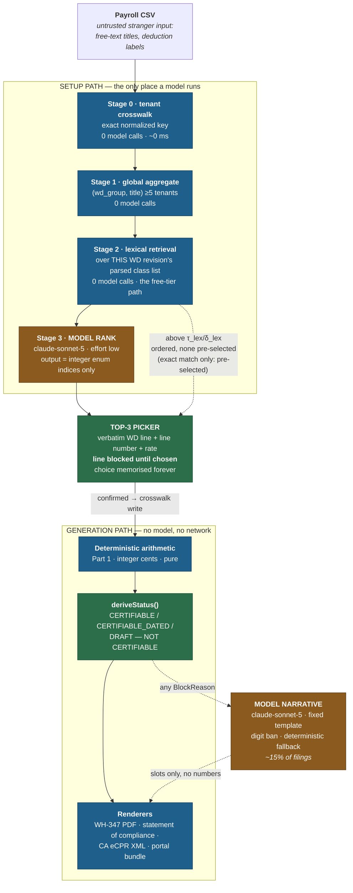
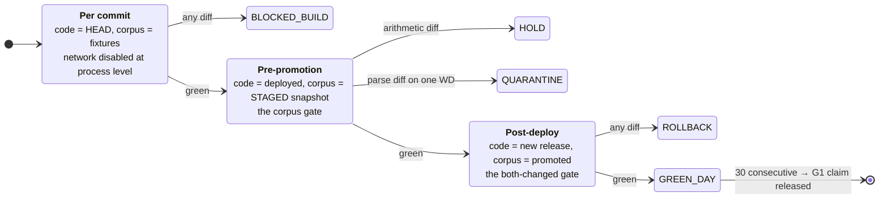

# RATEPIN — COMPUTATION AND MODEL ENGINE (v1)

**Product:** Ratepin — *certified-payroll rate-of-record engine for open-shop specialty subcontractors on Davis-Bacon work.*
**Job (D2):** "Get Friday's certified payroll out the door with rates I can defend."
**Document owner:** Engine designer
**Date:** 2026-08-13
**Status:** Binding for the Phase-2 build. Amendments require a named source and a note of what they supersede.

**Upstream inputs, treated as given and not re-derived:**

- `/home/user/Octopus/run-2/PLAN.md` — the autonomy gate **A1–A6**.
- `/home/user/Octopus/run-2/phase-1-ideation/IDEA_DOSSIER.md` — binding decisions **D1–D10**, risks **R1–R3**, gates **G1–G6**.
- `/home/user/Octopus/run-2/phase-1-ideation/research/01-demand-pmf.md` … `04-mvp-scope.md` — the four validation deep dives.
- `/home/user/Octopus/run-2/phase-2-build/architecture/ARCHITECTURE.md` — invariants **I1–I7**, **ADR-001–013**. This document refines **I1**, **I2** and **ADR-002** at the arithmetic and prompt layer.
- `/home/user/Octopus/phase-2-build/architecture/LLM_ENGINE.md` — run 1 (Clausewright). Its shape is the quality bar; its conclusions are not portable, because run 1's model sat *in* the money path and this one does not.

**Ownership.** This document is the single owner of: the arithmetic specification (§1–§13), the model request shapes and prompt-cache layout (§14–§20), the confidence ladder (§18), and the canary suite design (§21–§28). **On the arithmetic, this document is the authority and `ARCHITECTURE.md` defers to it** — the same relation `ARCHITECTURE.md` has to `CORPUS_DESIGN.md` on ingest. In particular the `DeductionCategory` enum (§9.1), the CWHSSA coverage gate (§7.0), the CWHSSA hours base (§7.3), the `col7A` formula (§8) and the rounding discipline (§11) are defined here and nowhere else.

Where it conflicts with `ARCHITECTURE.md`, the supersessions are stated explicitly below. This table is not a claim of priority in the other direction: `ARCHITECTURE.md`'s own **AS-1…AS-8** table and `CORPUS_DESIGN.md` §0.5 supersede *this* document where they say so, and §15.1/§18.2's ordering-only rule (**HIGH-2**) arrived that way. The two namespaces are deliberately distinct — **ES-n** is what ENGINE overrides, **AS-n** is what ARCHITECTURE overrides — after the remediation audit found `S-3` and `S-5` each meaning two different things.

| # | Supersedes | Stated in |
|---|---|---|
| **ES-1** | `ARCHITECTURE.md` §2.1's Sonnet/Opus model split | **ADR-101**, §17.4 |
| **ES-2** | `ARCHITECTURE.md` §3.2's *eight* permissible deduction categories → **ten**, (a)–(j) | §9.2 |
| **ES-3** | `ARCHITECTURE.md` §3.2's unconditional CWHSSA premium → gated on `contract_value_band` | §7.0 |
| **ES-4** | `ARCHITECTURE.md` §5.2/§15's blanket `is_union_group` setup refusal → refuse only a **6B credit claim** | §13, **C-2** |
| **ES-5** | `ARCHITECTURE.md` §3.5's "six checkboxes of 29 CFR 5.5(a)(3)(ii)(C)" → **three** certifications in (C); the six boxes are the WH-347 form's own reverse | §18.3 |

**Verification note.** Every regulation quoted below was fetched from the eCFR API on **2026-08-13** and is quoted verbatim, not paraphrased from memory. Every DOL worked example is reproduced with its published figures and is used as a test oracle. Every model price, cache multiplier and schema constraint was fetched live from `platform.claude.com` on **2026-08-13**. The wage-determination extract in §15.3 is a live response from `sam.gov/api/prod/wdol/v1/wd/VA20260195/2` on the same date. Anything not verified in-session is flagged as a hypothesis in §30.

---

## 0. The ten engine decisions

Everything below is elaboration. These ten are the calls.

| # | Decision | Rationale | Traces to |
|---|---|---|---|
| **E1** | **The money arithmetic is a pure function over integer cents with no clock, no locale, no randomness and no I/O.** Given the same inputs it returns byte-identical output a year later on a different machine. | This is what makes a $0.01 divergence a *build failure* rather than a tolerance. Anything non-deterministic in the core would force G1 to become an approximate gate, and an approximate gate on a federal false-statement surface is not a gate. | **D6**, **I1**, **ADR-002**, **G1** |
| **E2** | **Four DOL-published worked examples are the arithmetic's primary oracles, not our own reasoning.** 29 CFR 5.31(b), 29 CFR 5.32(c)(1)–(3), FOH 15k11(a) and FOH 15k11(b) are encoded as fixtures whose expected values we did not author and cannot regenerate. | An oracle we wrote is a restatement of our own belief. An oracle DOL published is a falsifiable external claim. §12.3 shows all four independently confirming one formula. | **G1**, **R3** |
| **E3** | **CWHSSA premium = `statutory_OT_hours × 0.5 × regular_rate`, less premium already *proven* paid**, where `statutory_OT_hours = max(0, Σ(st + ot + dt) − 40)` over covered work and `regular_rate` is the hours-weighted average of `max(BHR_WD_c, cash_rate_c excluding bona fide cash-in-lieu)` across every classification worked in the week. Single-classification weeks are the one-element case of the same formula, not a separate branch. | Derived in §7 and confirmed against all four E2 oracles, none of which it moves. **The hours base is every hour worked, not every hour the payroll export chose not to label** — 5.5(b)(1) is denominated in *"hours worked in excess of forty"*, and a column label that removed hours from the count made a federal obligation disappear (§4 A2). | 29 CFR 5.5(b)(1), 5.32, 778.202; FOH 15k01(b) |
| **E3a** | **CWHSSA is gated, not universal: it attaches only to contracts *"in an amount in excess of $100,000"* (29 CFR 5.5(b)).** `contract_value_band` is a required project field; `unknown` withholds certification (**P-B**) rather than guessing either way. | The Davis-Bacon Act attaches at $2,000 and CWHSSA at $100,000 — a specialty sub sits between them routinely. Applying CWHSSA unconditionally tells a compliant contractor they underpaid; assuming it away deletes a real obligation. Neither guess is available on a document signed under 18 U.S.C. 1001. | §7.0; 29 CFR 5.5(b); 40 U.S.C. 3142 |
| **E4** | **The `max(BHR_WD, cash)` floor is applied *per classification, to straight-time*, and is never re-applied to the weighted average.** | DOL's own Method 1 produces a regular rate of **$10.91** on a week where the electrician's WD basic hourly rate is **$12.00** (FOH 15k11(b)(1)). A naive reading of 5.32(a)'s "in no event ... less than the basic hourly rate" floors the average and produces $24.00 where DOL publishes $21.82. This is the single most likely place for a plausible-looking wrong number, and it is pinned by fixture. | §7.5; FOH 15k11(b) |
| **E5** | **The model ranks; it never resolves.** There is no confidence value at which a model-proposed classification is written to an artifact without a human click. Confidence and margin govern *ordering only*; the single licence to pre-select a radio is an exact normalized match against the determination’s own verbatim label (§15.1, §18.2 L-C₁). | D7 says the unmapped line is *blocked* and the choice is *memorised*. A threshold that auto-resolves would contradict D7 and would put a model decision inside a signed federal certification. The click costs the customer one action, once, forever — and it is what mints the crosswalk moat. | **D6**, **D7**, **A3**; §18 |
| **E6** | **The classification response schema makes a wrong answer unrepresentable, not merely detectable.** The model returns an array of integers constrained by a fixed `enum` of candidate slots; there is no string field in which a classification name could be invented, and no numeric field at all. | Anthropic [structured outputs](https://platform.claude.com/docs/en/build-with-claude/structured-outputs): the schema is enforced by a compiled grammar. Validation-after-the-fact catches a hallucinated class; an integer enum means the token was never sampleable. Refines **I2**. | **D6**, **I2**; §15.4 |
| **E7** | **Any digit in a model-authored string rejects the response.** The exception narrative is a fixed template; the model writes prose into named slots, and code injects every number, date, WD reference and dollar amount from the provenance struct. | "The model may never emit a number that reaches an artifact" (**I2**) is otherwise an intention. As a lexical rule over the response it is a total, cheap, exhaustively testable function — and because a deterministic fallback sentence always exists, rejection costs nothing. | **I2**, **ADR-002**; §16.3 |
| **E8** | **One model, `claude-sonnet-5`, for both jobs, at low effort.** Supersedes `ARCHITECTURE.md` §2.1's Sonnet/Opus split. Pre-committed promotion rule in **ADR-101**. | Both jobs are constrained: rank ≤12 enum slots, or fill ≤6 prose slots under a digit ban with a deterministic fallback. Neither is Opus-tier work, and one model ID means one cache namespace, one price row, one eval harness. Modelled cost falls to ~**$0.002/filing** against deep dive 03's $0.05 budget (§17.3). | **A6**; §17, **ADR-101** |
| **E9** | **The golden canary is a cross-product gate on two independent axes — code and corpus — and a case's expectation is pinned to a WD snapshot forever.** A new WD revision creates a *new* case; it never edits an old one. | Pinning is what makes the corpus axis meaningful: a change in the output of a case pinned to an immutable historical document is *always* a bug in us, never a change upstream. Without pinning, "the WD changed" absorbs every parser regression. | **G1**, **R1**, **R3**; §22, §24 |

---

# PART 1 — THE DETERMINISTIC CORE

## 1. Why the core is code, argued rather than asserted

`ARCHITECTURE.md` **I1** says the arithmetic is code and never a model. That is a boundary, not an argument. The argument is about what each choice buys and costs.

A language model can do this arithmetic. It would be wrong at some rate, and the rate would be low. The problem is not the rate; it is that **the errors are not the kind you can gate on**. A wrong CWHSSA premium of $21.82 instead of $24.00 is a plausible number in a plausible place on a document the customer signs under 18 U.S.C. 1001 and 31 U.S.C. 3729 (29 CFR 5.5(a)(3)(ii)(F), quoted verbatim: *"The falsification of any of the above certifications may subject the contractor or subcontractor to civil or criminal prosecution under 18 U.S.C. 1001 and 31 U.S.C. 3729."*). There is no downstream check that catches it, because the artifact *is* the check.

Deterministic code buys three specific things that are not available any other way:

1. **A 100% exact-match gate is possible.** G1 requires *"100% exact match; any divergence blocks index promotion and the build."* You cannot write that sentence about a stochastic process. With code, `expected == actual` on integer cents is a total predicate, and the gate is real rather than aspirational.
2. **The oracles can be external.** §12.3 reproduces four DOL-published examples. When the engine and DOL agree to the cent on all four, the correctness claim has an author other than us.
3. **Prompt injection cannot move a number.** The payroll CSV is stranger input (a customer's export from a payroll system we do not control, containing free-text titles and deduction labels). Because no path from that text reaches an arithmetic decision, the entire class of "the CSV said to use a different rate" is not a risk we mitigate — it is a risk we do not have.

The cost is stated honestly: we cannot use the model to repair a malformed CSV. Ambiguity becomes a blocked line and a UI question. That is the trade **ADR-002** made and this document implements.

---

## 2. Value types: integer cents, and every place a fraction is created

```ts
type Cents       = number & { readonly __brand: 'Cents' };       // integer, exact
type MilliRate   = number & { readonly __brand: 'MilliRate' };   // integer ten-thousandths of a dollar (10⁻⁴ $)
type Hours       = number & { readonly __brand: 'Hours' };       // integer hundredths of an hour (10⁻² h)
type MicroDollars = number & { readonly __brand: 'MicroDollars' }; // integer millionths of a dollar (10⁻⁶ $)
```

**Rationale.** IEEE-754 binary floating point cannot represent $0.10. A build that computes `0.1 + 0.2 !== 0.3` has already lost the exact-match gate. Every monetary quantity is an integer count of cents; every rate is an integer count of ten-thousandths of a dollar (four decimal places, which is more precision than any wage determination publishes — the live extract in §15.3 shows two, e.g. `$ 36.85` / `14.13`); every hours figure is an integer count of hundredths of an hour, which is what payroll systems export.

### 2.1 Rounding is a property of every rate × hours product — corrected

An earlier revision of this document claimed *"the only division in the engine is the weighted-average regular rate in §7.3; everywhere else is multiply-and-add over integers, which is exact."* **That claim is arithmetically false and is withdrawn.** The multiply is exact; the *unit conversion after it* is not.

`MilliRate × Hours` has units of 10⁻⁴ $ × 10⁻² h = **10⁻⁶ dollars** — `MicroDollars`. Reaching `Cents` requires dividing by 10,000, and that division generally has a remainder. From this document's own live extract (§15.3): `LABORER: ASPHALT` at `$18.62`/hr for 37.25 hours is `186_200 × 3_725 = 693_595_000` µ$ = **$693.595**, which is not representable in cents. The same is true of `col6B`, `col6C`, straight-time cash, double-time cash, `requiredTotal` and `paidTotal`.

So there are **two arithmetically distinct operations**, and conflating them is what produced the false claim:

| Operation | Where | Exact? |
|---|---|---|
| **Narrowing** — `MicroDollars → Cents`, a scale change by 10⁴ | Every rate × hours product, once per (line, column) | No: remainder in [0, 10⁴) µ$ |
| **The one genuine ratio** — `stEarnings ÷ hoursWorked`, a quotient of unlike quantities | §7.3, once per worker-week | No: remainder, and the only place a *rate* is derived rather than read |

There is exactly one narrowing function and exactly one place a ratio is taken. **§11 enumerates every narrowing site by name**, states the order of operations, and pins the residual bound as property **P-19** — an invariant that actually holds, replacing the un-enforceable call-site `grep` the earlier revision specified.

**Currency.** USD only, no locale formatting in the core. Rendering to `"$1,234.56"` happens in the renderer, from `Cents`, with a fixed formatter. A locale-sensitive formatter in the core would make the engine's output depend on the machine — a violation of **E1**.

---

## 3. The line model and the week model

The engine's input is a `PayrollWeek`, a value type with no references to the database:

```ts
interface PayrollWeek {
  weekEnding:        IsoDate;            // from the CSV, never from a clock
  workweekStartDay:  0|1|2|3|4|5|6;      // project setting; governs the seven day columns
  contractValueBand: 'over_100k' | 'at_or_under_100k' | 'unknown';   // project setting; §7.0
  pin:               WdPin;              // (wd_number, revision, published_date, snapshot_id)
  workers:           WorkerWeek[];
}

interface WorkerWeek {
  workerRef:         WorkerRef;          // opaque; SSN never enters the engine (§ARCHITECTURE 11.3)
  status:            'J' | 'RA';         // WH-347 col 2
  apprentice?:       { programName: string; registrar: 'OA'|'SAA'; levelOfProgression: string };
  lines:             ClassLine[];        // one per classification worked (WH-347 cols 3–7A)
  allWorkGross:      Cents;              // col 7B — customer-supplied, covers non-covered work too
  deductions:        DeductionEntry[];   // col 8 — against 7B, not 7A (§9)
  netPaid:           Cents;              // col 9 — customer-supplied, reconciled in §9.3
}

interface ClassLine {
  classificationId:  ClassificationId;   // branded; constructible only from a mirror row
  dayHours:          DayHours[7];        // { st, ot, dt } per day, in Hours
  cashRate:          MilliRate;          // GROSS straight-time cash rate actually paid
  cashInLieu:        MilliRate;          // customer-asserted portion of cashRate paid in lieu of fringe
  otRate:            MilliRate | null;   // rate actually paid on the `ot` bucket (WH-347 col 6A bottom row)
  dtRate:            MilliRate | null;   // rate actually paid on the `dt` bucket; null = unmapped, §7.3
  fringeCreditPlans: FringePlanCredit[]; // customer-asserted hourly credit per plan (col 6B)
}
```

Seven properties of this shape are load-bearing:

- **`classificationId` is branded.** Its only constructor is `MirrorReader.classificationsFor(pin)`. A classification that is not on that exact WD revision cannot be typed, so it cannot reach the arithmetic (**I2**).
- **`cashRate` is the gross rate.** 29 CFR 5.32(a), verbatim: *"an employee's regular or basic straight-time rate is computed on his earnings before any deductions are made for the employee's contributions to fringe benefits."* If the CSV mapping step marks the rate column as net of employee deferrals, the line is blocked with `AMBIGUOUS_RATE_BASIS`. Silently using a post-deferral rate understates the overtime base — a systematic underpayment that would look completely normal on the form.
- **`cashInLieu` is an assertion, not a derivation.** 29 CFR 5.32(c)(1) states plainly that whether a cash payment is in lieu of a fringe *"may be presented"* as *"a question of fact."* It moves the overtime base (§7.2), so it is a customer input that is printed and disclaimed, never inferred.
- **`dayHours` has exactly seven entries.** The CA eCPR XSD declares `day` with `minOccurs="7" maxOccurs="7"` (verified, deep dive 04 §1.6). Making the federal model match the strictest downstream consumer means the XML renderer never has to invent a day.
- **`allWorkGross` and `netPaid` are customer-supplied and reconciled, not computed.** We are not a payroll system (**D9**). §9.3 specifies what happens when they disagree with our arithmetic.
- **`otRate` and `dtRate` are nullable, and `null` is not zero.** A premium bucket carrying hours but no rate is a bucket whose premium *cannot be proven*, which is a different fact from a bucket paid at $0.00 and produces a different outcome (§7.3). Modelling the absence as `0` would silently convert "we don't know" into "nothing was paid", which is the error class **P-A** exists to prevent.
- **`contractValueBand` is a required project setting with no default.** There is no inferred value, no "assume covered", and no "assume not covered". `'unknown'` is a first-class value that produces **P-B** (§7.0), because the two guesses are wrong in opposite directions and both are wrong on a signed document.

---

## 4. Stage A — hours by classification (WH-347 columns 4 and 5)

```
stHours(line)  = Σ_d line.dayHours[d].st
otHours(line)  = Σ_d line.dayHours[d].ot
dtHours(line)  = Σ_d line.dayHours[d].dt          // pass-through only (D9)
totalHours(line) = stHours + otHours + dtHours     // WH-347 col 5
```

Three rules, each with a reason:

**A1 — Multiple classifications are separate lines, never merged.** 29 CFR 5.5(a)(1)(i), verbatim: *"Laborers or mechanics performing work in more than one classification may be compensated at the rate specified for each classification for the time actually worked therein: Provided, That the employer's payroll records accurately set forth the time spent in each classification in which work is performed."* The proviso is a condition on the *records*. If the CSV does not separate the time, we do not have the records, and the correct behaviour is to block the line with `UNSPLIT_CLASSIFICATION_TIME` — not to allocate hours by a heuristic. A heuristic here would be us manufacturing the very record the regulation requires the employer to have kept.

**A2 — Double-time hours pass through *as dollars*, and count *as hours*. Corrected.** An earlier revision of this rule said `dt` is *"excluded from the CWHSSA computation."* **That was wrong, and it was the most dangerous sentence in this document**, because it made a federal obligation vanish behind a column label.

29 CFR 5.5(b)(1) is about *hours worked*: *"to work in excess of forty hours in such workweek."* A double-time hour is an hour worked. Excluding `dt` from the threshold silently assumed that exactly `dt` of the over-40 hours had already been discharged at ≥1.5× — an assumption nothing in the engine tested, on a field whose rate is an arbitrary customer-supplied number. A worker logging **36 ST + 8 DT** produced `coveredHours = 36`, `otHours = 0`, `cwhssaPremium = $0.00`. Any payroll export that routes a shift differential, a per-diem bucket, or a mis-mapped column into `DT` at $1.00/hr therefore erased four hours of statutory overtime from a certified payroll with no flag, no block and no exception line — a systematic underpayment that looks completely normal on the form, which is the exact failure class §1 uses to justify the deterministic core.

The corrected rule, in three parts:

1. **Every hour worked on covered work counts toward the forty-hour threshold, whatever column of the CSV it arrived in.** `hoursWorked = Σ(st + ot + dt)`. There is no column label that removes an hour from the CWHSSA denominator (§7.3). This generalises past `dt`: any future premium bucket the CSV mapper learns to read inherits the rule by construction, because the rule is stated over *hours worked*, not over a list of column names.
2. **A premium label discharges the obligation on its own hours only if the row proves it** — the bucket carries an explicit rate and that rate is ≥ 1.5 × the week's regular rate. Proven premium is credited (§7.3); unproven premium blocks the line with **P-A** and a closed choice (§7.3, `PREMIUM_HOURS_UNPROVEN`).
3. **`dt` dollars are still a pass-through.** `dt` is carried into columns 4/5 and into CA's per-day ST/OT/DT structure and contributes to gross at the rate the CSV states. What passes through is the *money*; the *hours* are ours to count. California Labor Code §1815's daily-overtime obligation remains a different obligation on the same hours, needing a second corpus we do not ship (**D9**, `ARCHITECTURE.md` §15) — refusing to compute a state obligation was always correct, and was never a reason to drop the federal one.

**A3 — The workweek is a project setting, not a calendar inference.** The seven day columns are laid out from `workweekStartDay`. The engine never reads a clock (**E1**), so a filing regenerated eighteen months later during a dispute produces the identical grid.

---

## 5. Stage B — the rate of record (column 6A) and the two ladders

Two distinct rates travel through the engine and conflating them is the classic error:

| Ladder | Source | Where it appears | What it means |
|---|---|---|---|
| **`BHR_WD` / `FRINGE_WD`** | The pinned mirror row for `(pin, classificationId)` | The provenance footer; the underpayment check (§10) | What the wage determination *requires* |
| **`cashRate` / credits** | The customer's payroll CSV | WH-347 col 6A, 6B, 6C; gross | What the contractor *paid* |

WH-347 column 6A is the second ladder. The instructions are explicit (WHD, verified 2026-08-13): *"List the actual hourly rate paid for straight time (top row) and overtime (bottom row)"* and *"do not include cash payments in lieu of fringe benefits in this column."* So `col6A_st = cashRate − cashInLieu`, and `col6A_ot` is the overtime rate actually paid, from the CSV.

The wage determination's rate is **never printed in 6A**. It appears in the header's Wage Determination No. field (new on the Rev. January 2025 layout), in the provenance footer, and in the §10 comparison. This separation is the product: the form asks what you paid, and Ratepin's paid claim is that what you paid is defensible against a named revision of a named determination.

---

## 6. Stage C — fringe credit (6B) and cash in lieu (6C)

29 CFR 5.31(b) gives exactly three ways to discharge the obligation, with a worked example we encode as fixture **F-531** (§12.3):

> *"(1) By paying not less than the basic hourly rate to the laborers or mechanics and by making contributions for 'bona fide' fringe benefits in a total amount not less than the total of the fringe benefits required by the wage determination. For example, the obligations for 'Laborer: common or general' in § 5.30, figure 1 to paragraph (c), will be met by the payment of a straight time hourly rate of not less than $21.93 and by contributions of not less than a total of $6.27 an hour for 'bona fide' fringe benefits; or (2) By paying in cash directly to laborers or mechanics for the basic hourly rate and by making an additional cash payment in lieu of the required benefits. For example ... $28.60 ($21.93 basic hourly rate plus $6.27 for fringe benefits); or (3) ... a combination ..."*

```
col6B(line) = Σ_p Cents.fromMicroDollars( plan.hourlyCredit × totalHours(line) )  // contributions / costs
col6C(line) = Cents.fromMicroDollars( line.cashInLieu × totalHours(line) )        // cash equivalent
```

Both are **weekly totals**, not hourly rates — WHD's instructions say *"Enter the **total** of the contractor's or subcontractor's contributions"* and *"the **total amount in cash** provided in lieu of fringe benefits to the worker during the workweek."* Both are narrowing sites N1 and N2 (§11.2). `col6C` is a **disclosure of dollars already inside `col7A`**, never an addend to it — §8.1.

Both are per-hour figures multiplied by **all** hours worked, including overtime hours. The DOL Prevailing Wage Resource Book is unambiguous: *"Under Davis-Bacon, fringe benefits must be paid for **all** hours worked, including overtime hours. However, the fringe benefit amounts listed in the applicable wage determination may be excluded from the half-time premium due as overtime compensation."* Fringe is owed on hour 44; only the *premium* excludes it.

### 6.1 What the engine refuses to compute here, and why that refusal is the honest answer

**Annualization is out (D9, extended).** 29 CFR 5.25(c), verbatim: *"contractors must 'annualize' all contributions to fringe benefit plans (or the reasonably anticipated costs of an unfunded benefit plan) to determine the hourly equivalent for which they may take credit ... To annualize the cost of providing a fringe benefit, a contractor must divide the total cost of the fringe benefit contribution ... by the total number of hours worked on both private (non-DBRA) work and work covered by the Davis-Bacon Act and/or Davis-Bacon Related Acts (DBRA-covered work) during the time period to which the cost is attributable."*

A certified-payroll CSV contains covered hours for one week on one project. It does not contain total private hours or annual plan cost. **The annualized rate is not computable from our inputs.** The engine therefore takes `hourlyCredit` as a customer-asserted per-plan input, prints it in 6B, and states on the artifact that we neither computed nor verified annualization. Approximating it — for example by dividing plan cost by covered hours only — would inflate the credit for exactly the open-shop contractor D1 names, which is the commonest way a contractor gets this wrong. We would be automating the error.

**Unfunded plans are refused, not approximated.** 29 CFR 5.28(b)(5) conditions a bona fide unfunded plan on the contractor having *"request[ed] and receive[d] approval of the plan or program from the Secretary."* A `FringePlanCredit` flagged `unfunded: true` blocks the line with `UNFUNDED_PLAN_CREDIT` and the exception report describes the 5.28(c) approval path. We do not evaluate whether an approval exists.

**Statement-of-compliance box 5 is driven by this stage.** WHD's instructions: box 5 is checked *"when claiming an hourly credit for their contributions to or reasonably anticipated costs of bona fide fringe benefit plans."* The renderer derives box 5 from `Σ col6B > 0`, so the checkbox cannot drift from the arithmetic — it is the same value rendered twice.

---

## 7. Stage D — CWHSSA overtime and the half-time-on-base-rate rule

This is the section that earns the product. It is also the section where every incumbent's blog post is subtly wrong.

### 7.0 The coverage gate — CWHSSA attaches only above $100,000

**Everything in §7 is conditional on this gate.** An earlier revision of this document applied CWHSSA unconditionally; the threshold appeared nowhere in the repository. Corrected here, and this section supersedes `ARCHITECTURE.md` §3.2 on the point (**ES-3**).

29 CFR 5.5(b), fetched verbatim from the eCFR API on 2026-08-13:

> *"Contract Work Hours and Safety Standards Act (CWHSSA). The Agency Head must cause or require the contracting officer to insert the following clauses set forth in paragraphs (b)(1) through (5) of this section in full, or (for contracts covered by the Federal Acquisition Regulation) by reference, **in any contract in an amount in excess of $100,000** and subject to the overtime provisions of the Contract Work Hours and Safety Standards Act."*

WHD's WH-347 instructions say the same thing operationally, and make column 4's overtime row conditional on it: *"**On all contracts subject to the Contract Work Hours and Safety Standards Act (CWHSSA)**, enter hours worked on this project in excess of 40 hours total in the week as overtime ('OT')."*

The Davis-Bacon Act itself attaches far lower: 40 U.S.C. 3142(a), verbatim, reaches *"every contract **in excess of $2,000**, to which the Federal Government or the District of Columbia is a party, for construction, alteration, or repair."* The two thresholds are fifty times apart, and a specialty subcontractor — **D1**'s buyer exactly — sits between them routinely. So a DBA-covered project with no CWHSSA obligation is not an edge case; it is a normal week, and an engine that cannot represent one is wrong about a large fraction of its market.

**The gate.** `contract_value_band` is a **required** field at project setup, with no default and no inference:

| `contractValueBand` | Effect on the engine |
|---|---|
| `over_100k` | §7.1–§7.7 as specified. `cwhssaPremium` computed; the `max(BHR_WD, cash)` overtime floor applied; `PREMIUM_BELOW_STATUTORY` and `PREMIUM_HOURS_UNPROVEN` live. |
| `at_or_under_100k` | `cwhssaPremium := 0`. The `max(BHR_WD, cash)` **overtime** floor is not applied (it is a CWHSSA rule — 5.32(a) governs *"the regular or basic rate upon which premium pay for overtime is calculated"*). `PREMIUM_BELOW_STATUTORY` and `PREMIUM_HOURS_UNPROVEN` are suppressed. Column 4's OT sub-row renders the CSV's own reported overtime hours with no CWHSSA characterisation. |
| `unknown` | **P-B.** `BlockReason` `CWHSSA_COVERAGE_UNDETERMINED` is raised once per filing; `deriveStatus` returns `DRAFT — NOT CERTIFIABLE`, the signature block is withheld, and the exception report states the threshold and its citation. |

**Why `unknown` is P-B and not a guess in either direction.** Guessing *covered* computes a premium that is not owed, applies a floor that does not apply, prints hours in a CWHSSA column on a contract with no CWHSSA column, and can raise a flag naming a statute the contract is not subject to — telling a compliant contractor they underpaid. Guessing *not covered* silently deletes a real federal overtime obligation from a document signed under 18 U.S.C. 1001. There is no safe default, so there is no default. The contract value is a fact the customer holds and we do not; asking for it once at setup costs one field, and the answer is remembered for the life of the project.

**What the `at_or_under_100k` path must say, and must not say.** The exception report carries a **P-D declined conclusion**, not a clearance:

> "This project is recorded as a contract at or under $100,000. The overtime clauses of 29 CFR 5.5(b) are inserted in contracts in an amount in excess of $100,000, so no CWHSSA overtime premium is computed here. Overtime obligations arising under the Fair Labor Standards Act are not computed by Ratepin (§7.7). Ratepin does not determine whether CWHSSA applies to this contract."

*"That CWHSSA applies to this contract"* joins the DO-NOT-ASSERT list (`ARCHITECTURE.md` §11.7, `USER_JOURNEY.md` §16.1). The band is the customer's assertion, printed as an assertion, exactly as `cashInLieu` is (§3).

**The $100,000 is a corpus value, not a constant** — the same discipline §10 applies to the $33/day liquidated damages, and for the same reason. It is stored with an effective date and a source URL, and the eCFR Monday section-version diff (`ARCHITECTURE.md` §7.1, `ingest.ecfr`) watches the 5.5(b) preamble alongside 5.5(b)(2). A threshold that has stood for decades is still a number Congress can move, and a hard-coded one guarantees a stale gate.

### 7.1 The statutory chain, quoted

**29 CFR 5.5(b)(1)** — the obligation, in the contracts §7.0's gate lets through:

> *"No contractor or subcontractor contracting for any part of the conract work which may require or involve the employment of laborers or mechanics shall require or permit any such laborer or mechanic in any workweek in which he or she is employed on such work to work **in excess of forty hours in such workweek** unless such laborer or mechanic receives compensation at a rate not less than one and one-half times the basic rate of pay for **all hours worked in excess of forty hours** in such workweek."*

(The typo `conract` is DOL's, in the current eCFR text. We quote it as published. The two bolded phrases are the warrant for §4 A2's corrected rule: the clause is denominated in *hours worked*, not in hours the payroll export chose to label as ordinary.)

**29 CFR 5.32(a)** — what goes into the base:

> *"in no event can the regular or basic rate upon which premium pay for overtime is calculated ... be less than the amount determined by the Secretary of Labor as the basic hourly rate (i.e. cash rate) under section 1(b)(1) of the Davis-Bacon Act. ... Contributions by employees are not excluded from the regular or basic rate upon which overtime is computed under these statutes ... The contractor's contributions or costs for fringe benefits may be excluded in computing such rate so long as the exclusions do not reduce the regular or basic rate below the basic hourly rate contained in the wage determination."*

**FOH 15k01(a)** — the same rule in DOL's own enforcement handbook:

> *"The basic rate of pay under CWHSSA is the straight time hourly rate and cannot be less than the basic hourly rate required in an applicable wage determination. Under DBRA, amounts paid as fringe benefits — both contributions to bona fide benefit plans and cash payments made to meet wage determination fringe benefits requirements — are excluded in computing overtime obligations under CWHSSA."*

**FOH 15k01(b)** — the multi-classification rule:

> *"If an employee worked in more than one classification and at different rates on covered contracts during a workweek, the overtime premium is computed based on the regular rate of pay. The regular rate is the weighted average of the rates; that is, the total earnings (except statutory exclusions) at the different rates are divided by the total number of hours worked in the w/w. Overtime may be computed based on the rate in effect during the hours worked over 40 in the workweek provided the provisions of FLSA § 7(g)(1) or (2) are met. (See 29 CFR §§ 778.6, 778.115 and 778.415-419.)"*

**29 CFR 778.115** — the FLSA default this rests on:

> *"Where an employee in a single workweek works at two or more different types of work for which different nonovertime rates of pay ... have been established, his regular rate for that week is the weighted average of such rates."*

### 7.2 The per-classification base rate

```
baseRate(line) = max( BHR_WD(pin, line.classificationId),
                      line.cashRate − line.cashInLieu )        // over_100k only — §7.0
```

Read it as: start from what was actually paid in cash *excluding* any bona fide cash-in-lieu (5.32(c)(1) excludes it); and never go below the determination's basic hourly rate (5.32(a)'s floor, and 5.32(c)(3)'s example). Employer fringe *contributions* never enter this expression at all; employee contributions never *reduce* it, because `cashRate` is gross (§3).

**The floor is a CWHSSA rule and travels with the gate.** 5.32(a) is expressly about *"the regular or basic rate upon which premium pay for overtime is calculated,"* so on an `at_or_under_100k` project there is no premium for it to floor and `baseRate` is not computed. The Davis-Bacon obligation on those same hours is unaffected and is checked in §10, which compares total straight-time compensation against `BHR_WD + FRINGE_WD` and does not read `baseRate` at all. Losing the CWHSSA premium below the threshold does **not** lose the underpayment check.

Four DOL examples confirm this single expression, and they disagree with each other in ways a wrong formula could not survive:

| Oracle | WD | Paid | `cashRate − cashInLieu` | `baseRate` | DOL's published base | Match |
|---|---|---|---|---|---|---|
| 5.32(c)(1) — contractor W | $3.00 + $0.50 | $3.50 all cash, $0.50 in lieu | $3.00 | max(3.00, 3.00) = **$3.00** | *"computed on a regular or basic rate of $3.00 an hour"* | ✓ |
| 5.32(c)(2) — contractor X | $3.00 + $0.50 | $3.25 cash + $0.50 contributions | $3.25 | max(3.00, 3.25) = **$3.25** | *"would be $3.25, the rate actually paid as a basic cash wage"* | ✓ |
| 5.32(c)(3) — contractor Y | $3.00 + $0.50 | $2.75 cash + $1.00 benefit cost | $2.75 | max(3.00, 2.75) = **$3.00** | *"would continue to be $3 an hour"* | ✓ |
| FOH 15k11(a)(2) | $12.00 + $2.50 | $10.00 cash + $4.50 fringe | $10.00 | max(12.00, 10.00) = **$12.00** | `4 × ½ × $12.00 = $24.00` | ✓ |

Note what the third and fourth rows kill: the intuitive "premium is half the rate actually paid" is wrong in both, by $0.13/hr and $1.00/hr respectively, always in the contractor's favour and therefore always an underpayment. And the second row kills the equally intuitive "premium is half the WD's BHR" — that one overpays, which is cheaper but still a wrong number on a certified document.

### 7.3 The weighted-average regular rate, the hours base, and the premium credit

Applies only when `contractValueBand == 'over_100k'` (§7.0). Every `Cents.from…` below is a **narrowing site**, enumerated in §11.

```
// 1 — the hours base. Every covered hour, whatever column it arrived in (§4 A2).
hoursWorked(worker)       = Σ_lines ( st + ot + dt )
statutoryOtHours(worker)  = max(0, hoursWorked − 40)

// 2 — straight-time earnings. Premium buckets enter at their STRAIGHT-time equivalent,
//     because 29 CFR 778.202 excludes the premium portion from the regular rate.
stEarnings_µ(worker)      = Σ_lines ( (st + ot + dt)(line) × baseRate(line) )     // MicroDollars, exact

// 3 — the one genuine ratio (§2.1), narrowed once.
regularRate(worker)       = Cents.fromRatio( stEarnings_µ , hoursWorked )          // half-up to cents

// 4 — what CWHSSA owes on the over-40 hours.
premiumOwed(worker)       = Cents.fromMicroDollars( statutoryOtHours × regularRate × ½ )

// 5 — premium ALREADY paid on self-priced premium hours, but only where the row PROVES it.
//     SELF_PRICED = buckets whose hours enter gross at the bucket's own rate (§8) = { dt }.
//     `ot` is NOT self-priced: §8 pays ot hours at cashRate and adds the premium separately.
provenPremiumHours(line, b) = hours(b)  iff b ∈ SELF_PRICED
                                        and rate(b) != null
                                        and rate(b) ≥ 1.5 × regularRate
premiumCredit(worker)     = Σ_lines Σ_b∈SELF_PRICED
                              Cents.fromMicroDollars(
                                provenPremiumHours(line, b) × max(0, rate(b) − regularRate) )

// 6 — the residual. Never negative; a generous premium is not a credit against next week.
cwhssaPremium(worker)     = max(0, premiumOwed − min(premiumCredit, premiumOwed))
```

**Why `ot` is in the threshold but not in the credit.** §8 follows DOL's Method-1 shape: *every* hour enters gross at the straight-time `cashRate`, and the CWHSSA half-time premium is a separate addend on top. Overtime hours therefore carry no premium dollars *inside* `col7A` for a credit to draw on — `cwhssaPremium` **is** their premium. Double-time hours are different: §8 pays them at `dtRate`, so their premium is already in gross and crediting it is what stops the engine charging for it twice. The rule is stated over the property (*does this bucket price its own hours in gross?*) rather than over the column name, so a future bucket inherits the correct treatment from how it is paid, not from what it is called. `SELF_PRICED` is a single constant in `engine/arithmetic`, and §25 compares it.

**The blocking rule (P-A).** Let `unprovenPremiumHours = Σ_lines Σ_b∈SELF_PRICED (hours(b) − provenPremiumHours(line, b))`.

> If `statutoryOtHours > 0` **and** `unprovenPremiumHours > 0`, the line is blocked with `PREMIUM_HOURS_UNPROVEN` and the picker offers a **closed choice**: *these hours were ordinary hours mis-labelled by the export*, or *these hours were paid at a premium rate of ___*. The engine does not choose, and does not proceed on either reading.

Three notes on why the rule is shaped this way:

- **It does not try to work out *which* hours crossed forty.** Doing so needs a within-week ordering the CSV does not carry, and inventing one would be the §4 A1 error — manufacturing the record the regulation requires the employer to have kept. So the trigger is the conjunction "the week has statutory overtime *and* it contains premium hours we cannot price", which over-blocks slightly and under-blocks never.
- **Below forty hours worked, nothing blocks.** `statutoryOtHours == 0` means no CWHSSA obligation exists, so an unpriceable `dt` bucket is harmless and the line renders. This is what keeps the rule from firing on the common case of a short week with a mis-mapped column.
- **`null` rate and `$0.00` rate produce the same block, deliberately.** Both are "we cannot prove ≥1.5× was paid". The customer resolves both the same way, once, with the same closed choice. (The review that found this named the reason `DT_RATE_BELOW_PREMIUM`; renamed here because the rule generalises past the `dt` column, per **R-CRIT4**.)

Four deliberate properties of the computation:

- **Single classification is the one-element case.** With one line, `stEarnings = H × base` and `regularRate = base`, so `premium = statutoryOT × 0.5 × base`. There is no separate single-class branch to test, and property **P-07** (§12.2) asserts the two agree.
- **`hoursWorked` counts *covered* hours only.** FOH 15k03(a): *"only the hours actually spent on a covered contract or combination of covered contracts need be considered in computing the OT pay."* Covered-vs-private is a different exclusion from ST-vs-DT: the first is about *which contract the hour was worked on*, the second was about *what the payroll system called it*. The first is legitimate and stays; the second was the bug. §7.7 handles the mixed-work case.
- **The floor is not re-applied to the average.** This is **E4**, and §7.5 shows why.
- **All four DOL oracles are unaffected by this rewrite**, because every one of them has `dt = 0` and no proven premium bucket, so `hoursWorked` reduces to `Σ(st + ot)`, `premiumCredit` reduces to zero, and the expressions collapse to the pre-correction form. A correction that moved a class-1 fixture would be a correction to be suspicious of; this one moves none (§12.3).

#### 7.3.1 Worked examples M4a and M4b — the two double-time outcomes

Both authored oracles (class 2, §23), frozen as fixtures **F-DT-UNPROVEN** and **F-DT-PROVEN**. One classification, `contractValueBand = over_100k`, `cashRate = baseRate = $20.00`, no cash in lieu.

**M4a — the failure the old rule hid.** 36 ST + 8 DT, export codes the DT bucket at **$1.00/hr**.

| Step | Old rule (wrong) | Corrected rule |
|---|---|---|
| hours base | `coveredHours = 36` | `hoursWorked = 44` |
| statutory OT | 0 | **4.00 h** |
| `regularRate` | $20.00 | $20.00 (`44 × $20.00 / 44`) |
| premium owed | — | `4 × $20.00 × ½` = **$40.00** |
| proven premium | — | none: `$1.00 < 1.5 × $20.00` |
| outcome | `cwhssaPremium = $0.00`, **renders CERTIFIABLE** | **line blocked, `PREMIUM_HOURS_UNPROVEN`, P-A** |

Four hours of statutory overtime, worth $40.00 of premium on one worker in one week, previously vanished with no flag. On a 30-worker crew over a year the class of error is five figures, and every filing that carried it looked perfect.

**M4b — genuine double time, credited not double-charged.** 36 ST + 8 DT at **$40.00/hr**.

| Step | Value |
|---|---|
| `hoursWorked` | 44.00 |
| `statutoryOtHours` | 4.00 |
| `regularRate` | `44 × $20.00 / 44` = $20.00 |
| `premiumOwed` | `4 × $20.00 × ½` = $40.00 |
| proven? | `$40.00 ≥ 1.5 × $20.00 = $30.00` ✓ — all 8 h proven |
| `premiumCredit` | `8 × max(0, $40.00 − $20.00)` = $160.00, capped at $40.00 |
| `cwhssaPremium` | `max(0, $40.00 − $40.00)` = **$0.00** |

The premium is zero here for a *reason the engine can state* — $160.00 of premium was already paid against $40.00 owed — rather than because a column label removed the hours from the count. That is the whole difference: the same output, arrived at by arithmetic instead of by omission, and the exception report can show the working.

### 7.4 Worked example M1 — single classification, two fringe treatments (FOH 15k11(a))

DOL's text: an employee works **44 hours** as an electrician where the WD rate is **$12.00 basic + $2.50 fringe**. (All four DOL oracles are CWHSSA examples, so every fixture in §12.3 is pinned at `contractValueBand = over_100k`; §7.0's gate is exercised separately by the canary's contract-band axis, §22.)

*Case (a)(1): employer pays $12.00 cash and $2.50 in fringe benefits.*

| Step | Engine | Value |
|---|---|---|
| `col6B` | 44 × $2.50 | $110.00 |
| straight-time cash | 44 × $12.00 | $528.00 |
| `baseRate` | max(12.00, 12.00 − 0.00) | $12.00 |
| `regularRate` | $528.00 / 44 | $12.00 |
| `cwhssaPremium` | 4 × 0.5 × $12.00 | **$24.00** |
| total | | **$662.00** |

DOL publishes: *"44 hours x $2.50 = $110.00 in fringe benefits; 44 hours x $12.00 = $528.00 for prevailing wages; 4 hours x ½ x $12.00 = $24.00 for CWHSSA earnings; $662.00 Total."* ✓

*Case (a)(2): employer pays $10.00 cash and $4.50 in fringe benefits.*

| Step | Engine | Value |
|---|---|---|
| `col6B` | 44 × $4.50 | $198.00 |
| straight-time cash | 44 × $10.00 | $440.00 |
| `baseRate` | max(12.00, 10.00 − 0.00) | **$12.00** ← the floor binds |
| `cwhssaPremium` | 4 × 0.5 × $12.00 | **$24.00** |
| total | | **$662.00** |

DOL publishes the identical $662.00 total with the same $24.00 premium. ✓ The premium is unchanged even though cash wages fell by $2.00/hour — the floor is doing the work.

Note also that §10's underpayment check must *not* fire here: total straight-time compensation is $10.00 + $4.50 = $14.50/hr against a required $12.00 + $2.50 = $14.50/hr. Compliant by the combination method of 5.31(b)(3).

### 7.5 Worked example M2 — two classifications in one week (FOH 15k11(b)) — the E4 case

DOL's text: an employee works as **painter** and **electrician** on a covered contract. Electrician WD rate **$12.00 + $2.50**; painter WD rate **$10.00 + $3.00**. Hours: painter 8+8+8 = **24**; electrician 8+8+4 = **20**; total **44**, with the four overtime hours falling on Saturday.

**Method 1 — weighted average (the engine's default):**

| Step | Engine | Value |
|---|---|---|
| painter straight-time | 24 × max(10.00, 10.00) | $240.00 |
| electrician straight-time | 20 × max(12.00, 12.00) | $240.00 |
| `stEarnings` | | $480.00 |
| `regularRate` | `Cents.fromRatio($480.00, 44.00 h)` | **$10.91** |
| `cwhssaPremium` | 4 × 0.5 × $10.91 | **$21.82** |

DOL publishes: *"Step 1: Determine the straight time wages due; excluding fringe benefits — 24 hours at the painter's rate of $10.00 = $240.00; 20 hours at the electrician's rate of $12.00 = $240.00; Total straight time wages = $480.00. Step 2: Calculate the 'regular rate' — ($480.00 / 44 hours worked) = $10.91 'regular rate'. Step 3: Compute the overtime premium due — ½($10.91) x 4 overtime hours worked = $21.82."* ✓

**Read the regular rate.** $10.91 is **below** the electrician's WD basic hourly rate of $12.00. An implementation that reads 5.32(a)'s *"in no event ... less than the basic hourly rate"* as a floor on the weighted average produces $12.00 and a premium of $24.00 — a 10% overstatement, and an entirely plausible-looking number. It is wrong because the 5.32(a) floor governs the *rate paid for hours in a classification*, which Step 1 has already satisfied per class; the weighted average is a derived quantity for the premium and carries no floor of its own. **E4** encodes this, and fixture **F-FOH-15k11b-M1** pins it. This is the single case most worth stealing from this document.

**Method 2 — rate in effect (opt-in only):**

DOL: *"In this example the four overtime hours occurred on a Saturday. The overtime premium could be computed as follows: ½($12.00) x 4 = $24."*

Method 2 is available only under FLSA §7(g)(2), which 29 CFR 778.415 conditions on *"an agreement or understanding arrived at between the employer and the employee before performance of the work,"* and which 778.419(a)(3) further conditions on *"the number of overtime hours for which the overtime rate is paid equals or exceeds the number of hours worked in excess of the applicable maximum hours standard."*

Whether such an agreement exists is a fact about the employment relationship that no payroll CSV contains. So the engine's rule is:

> **Method 2 requires two customer assertions and one data condition, all three of which must hold: (i) the project carries `section7g2Agreement: true`; (ii) the CSV identifies which classification each overtime hour was worked in (not merely the weekly totals); (iii) the resulting premium is greater than or equal to the Method 1 premium. If any fails, the engine computes Method 1 and says so on the exception report.**

Condition (iii) is ours, not DOL's, and it is deliberately conservative: §7(g)(2) is an alternative computation, not a discount, and it is the contractor who bears the risk if the agreement turns out not to exist. Falling back to the method that pays more when the two disagree is the only choice that cannot manufacture an underpayment out of a paperwork assumption. **Challenge C-3** (§29) records that this is a Ratepin rule rather than a regulatory one.

Note the two methods differ here by $2.18 on one worker in one week. Over a 30-worker crew across a year that is four figures, and it is the kind of divergence that turns up in an investigation years later.

### 7.6 Worked example M3 — cash in lieu above the basic hourly rate

Not from DOL; constructed to exercise the interaction of 5.32(c)(1) and 5.32(c)(2), and frozen as an authored oracle (class 2, §23).

WD: **$21.93 + $6.27** (the 5.30 figure-1 laborer). Contractor pays **$30.00/hr all cash**, asserting **$6.27** of it is in lieu of fringe. Worker: 48 hours, one classification.

| Step | Engine | Value |
|---|---|---|
| `cashRate − cashInLieu` | $30.00 − $6.27 | $23.73 |
| `baseRate` | max(21.93, 23.73) | **$23.73** |
| `col6A_st` | $30.00 − $6.27 | $23.73 |
| `col6C` | 48 × $6.27 | $300.96 &nbsp;← *disclosure, not an addend* |
| `col6B` | — | $0.00 |
| straight-time cash | 48 × $30.00 | $1,440.00 |
| `cwhssaPremium` | 8 × 0.5 × $23.73 | **$94.92** |
| `col7A` | $1,440.00 + $94.92 | **$1,534.92** |

**Read the `col6C` row against the `col7A` row.** The $300.96 is *inside* the $1,440.00, because `cashInLieu` is by definition a portion of `cashRate` (§3) — the contractor paid $30.00/hr, of which they assert $6.27/hr discharged the fringe obligation. `col7A` therefore adds it **zero** times, not once more. Adding `col6C` to gross would print **$1,835.88** against a cheque for $1,534.92: a $300.96 overstatement on one worker-week, on the gross-earned column of a document signed under 18 U.S.C. 1001. §8 states the formula that makes this the only representable answer, and fixture **F-M3-CIL** pins $1,534.92 so it cannot drift back.

The excess over the WD's $28.20 total is straight-time wage, not extra fringe, so it *raises* the overtime base — 5.32(c)(2)'s rule. If the same contractor instead asserted the whole $8.07 excess as cash in lieu, `baseRate` would drop to $21.93 and the premium to $87.72. **The assertion moves the number by $7.20 on one worker-week**, which is precisely why deep dive 04 put "that a cash payment is genuinely in lieu of a fringe" on the DO-NOT-ASSERT list. The engine prints the assertion and its consequence side by side on the exception report and declines to characterise the payment.

### 7.7 Covered hours, all hours, and the gap we name but do not fill

CWHSSA fires only above 40 hours **on covered contracts** (FOH 15k03(a)). FLSA fires above 40 hours **in the workweek** (29 CFR 778.101). A worker with 30 covered hours and 15 private hours has an FLSA overtime obligation and no CWHSSA obligation.

This is the one exclusion from `hoursWorked` that survives §4 A2's correction, and it survives because it is a different kind of exclusion. *Covered vs. private* is a fact about **which contract the hour was worked on** — a fact the CSV carries and FOH 15k03(a) expressly authorises us to act on. *Straight vs. double time* was a fact about **what the payroll system called an hour it agrees was worked on this contract**, which authorises nothing. Keeping the first and dropping the second is the whole distinction, and it is worth stating because both look like "hours we leave out of the threshold" from a distance.

Below the $100,000 threshold neither obligation is computed: CWHSSA does not attach (§7.0) and FLSA overtime is refused here. The `at_or_under_100k` exception line and this one are printed together so the customer sees the full extent of what Ratepin has and has not computed on that project.

The engine computes CWHSSA only. When `col7B` implies more than 40 total hours while `hoursWorked` on this project is ≤ 40, the exception report carries a **flag, not a number**:

> "Column 7B reports gross earnings for 45.0 hours of work across all projects this week; 30.0 of those hours are on this project. Overtime obligations arising under the Fair Labor Standards Act on hours worked outside this project are not computed by Ratepin."

That is a true statement of a limit, and it is more useful than either silence or a guess. FOH 15k11(d) makes the same distinction and notes it matters for liquidated damages, *"as the FLSA does not provide for the assessment of liquidated damages."*

---

## 8. Stage E — gross (columns 7A and 7B)

```
col7A(worker) = Σ_lines Cents.fromMicroDollars( (st + ot) × cashRate )
              + Σ_lines Cents.fromMicroDollars( dt × dtRate )
              + cwhssaPremium(worker)                 // 0 unless over_100k (§7.0)
col7B(worker) = worker.allWorkGross                   // customer-supplied
```

WHD's instructions define 7A as *"the worker's gross amount earned for the workweek for hours worked on this Federal or federally assisted project"* and 7B as *"the total gross amount earned during the week for all work performed."*

### 8.1 `col6C` is a disclosure of a subset of 7A, never an addend — corrected

An earlier revision of this section added `Σ_lines col6C(line)` to `col7A` with the comment *"cash in lieu is cash paid."* The comment is true; the addition is a **double count**, and it is corrected here.

`cashInLieu` is defined in §3 as the *"customer-asserted **portion of** `cashRate` paid in lieu of fringe"*, and §5 derives `col6A_st = cashRate − cashInLieu` from exactly that containment. So `Σ((st + ot) × cashRate)` **already contains every cash-in-lieu dollar**. Adding `col6C` on top adds them a second time. On §7.6's M3 — 48 hours at $30.00 with $6.27 asserted in lieu — the error is **$300.96 on one worker-week**, and it grows linearly with crew size.

The relationship, stated once so it cannot be misread:

| Column | Contains | Relation to 7A |
|---|---|---|
| `col6A_st` | `cashRate − cashInLieu`, the straight-time rate net of cash-in-lieu | rate, not money |
| `col6C` | `cashInLieu × totalHours`, the weekly cash-in-lieu total | **⊆ 7A** — already counted once |
| `col6B` | employer contributions / anticipated costs | **∉ 7A** — never wages paid in the period |
| `col7A` | gross earned on this project | the sum above, and nothing else |

**`col6B` is not in gross.** Employer contributions to a benefit plan are not wages paid to the worker in the pay period; they are credits against the wage obligation. Adding 6B to 7A both overstates gross and breaks the §9.3 net identity.

**6B and 6C are asymmetric, and that asymmetry is the whole point of the two columns.** Under the all-cash discharge method (5.31(b)(2)) the fringe obligation is met with dollars that *are* wages, so they sit in 6C and inside 7A. Under the contributions method (5.31(b)(1)) it is met with dollars that are *not* wages, so they sit in 6B and outside 7A. The two must therefore never be summed into a single "fringe" figure, and neither may be added to gross: 6B because it was never in it, 6C because it always was.

**Why no test caught this.** `P-01` tests the net identity against **7B**, not 7A. `P-05` (monotone in hours) passes under both formulas. `P-02` as previously written passes under both. The G1 canary would have caught it only if a class-2 expectation happened to be authored from §7.6 rather than §8 — that is, by luck. The three properties below close the gap by testing `col7A`'s composition directly rather than testing consequences of it.

**P-16 (composition, exact):** `col7A == Σ_lines Cents((st+ot) × cashRate) + Σ_lines Cents(dt × dtRate) + cwhssaPremium`, to the cent. This is the formula as an executable assertion; it fails under the old formula on any week with `cashInLieu > 0`.

**P-17 (containment):** `Σ_lines col6C(line) ≤ Σ_lines Cents((st+ot+dt) × cashRate)`. A cash-in-lieu total exceeding the cash actually paid is unrepresentable; a generator that produces one is producing an invalid `PayrollWeek`, and the engine blocks it with `CASH_IN_LIEU_EXCEEDS_CASH_RATE` rather than computing on it.

**P-02 (corrected):** `col7A ≥ Σ_lines Cents((st+ot+dt) × cashRate)`, with equality iff `cwhssaPremium == 0` and every `dtRate == cashRate`. **The previous statement of P-02 used `baseRate` and is false on DOL's own oracle**: FOH 15k11(a)(2) pays $10.00 cash against a $12.00 WD basic hourly rate, so `col7A` = 44 × $10.00 + $24.00 = **$464.00** while `Σ(44 × baseRate)` = **$528.00**, and the property fails on a class-1 fixture. A property that a regulatory fixture falsifies is a specification bug, not a test failure; corrected here rather than weakened. The catch it was reaching for — premium sign errors — is covered exactly by P-16.

---

## 9. Stage F — deductions (column 8) and net (column 9)

### 9.1 The permissible categories

**This section is the single authority on `DeductionCategory`; `ARCHITECTURE.md` §3.2 defers to it (supersession ES-2).** The enum is defined here, in one place, because it is a transcription of a regulation rather than a design choice, and a transcription that exists twice will eventually exist in two versions.

29 CFR 3.5, lead-in quoted verbatim from the eCFR API on 2026-08-13: *"Deductions made under the circumstances or in the situations described in the paragraphs of this section may be made without application to and approval of the Secretary of Labor."* The section as currently published carries **ten** lettered paragraphs, (a) through (j), last amended at **88 FR 57730 (Aug. 23, 2023)**. The engine's `DeductionCategory` enum is exactly that list, one member per paragraph, plus one sentinel:

| Enum member | 3.5 ¶ | Substance |
|---|---|---|
| `STATUTORY` | (a) | Federal/State/local law: withholding income taxes, FICA |
| `BONA_FIDE_PREPAYMENT` | (b) | Repayment of a prepayment made without discount or interest |
| `COURT_PROCESS` | (c) | Amounts required by court process, not in favour of the contractor |
| `BENEFIT_FUND` | (d) | Contributions to medical/pension/vacation/etc. funds, meeting four tests |
| `CREDIT_UNION` | (e) | Repayment of loans to, or purchase of shares in, a credit union |
| `GOVERNMENTAL` | (f) | Voluntary contributions to governmental or quasi-governmental agencies |
| `CHARITABLE_501C3` | (g) | Voluntary contributions to 26 U.S.C. 501(c)(3) organisations |
| `UNION_DUES` | (h) | Regular initiation fees and membership dues, per a CBA |
| `BOARD_LODGING_FACILITIES` | (i) | "Reasonable cost" of board, lodging, or other facilities under FLSA §3(m) |
| `SAFETY_EQUIPMENT` | (j) | Nominal-value safety equipment purchased as the worker's own property |
| `UNMAPPED` | — | Sentinel. Blocks the line. Never rendered. |

### 9.2 Correction, superseding two upstream documents

Deep dive 04 §1.5 and `ARCHITECTURE.md` §3.2 both state that 29 CFR 3.5 lists **eight** categories. The section as published in the current eCFR, fetched 2026-08-13, has **ten**: paragraphs (a) through (j). **This document supersedes both upstream statements on the count (ES-2).**

The two missing paragraphs, quoted verbatim so a builder never has to reconstruct them from a summary:

> **(i)** *"Any deduction not more than for the 'reasonable cost' of board, lodging, or other facilities meeting the requirements of section 3(m) of the Fair Labor Standards Act of 1938, as amended, and 29 CFR part 531. When such a deduction is made the additional records required under 29 CFR 516.25(a) must be kept."*

> **(j)** *"Any deduction for the cost of safety equipment of nominal value purchased by the laborer or mechanic as their own property for their personal protection in their work, such as safety shoes, safety glasses, safety gloves, and hard hats, if such equipment is not required by law to be furnished by the contractor, if such deduction does not violate the Fair Labor Standards Act or any other law, if the cost on which the deduction is based does not exceed the actual cost to the contractor where the equipment is purchased from the contractor and does not include any direct or indirect monetary return to the contractor where the equipment is purchased from a third person, and if the deduction is either: (1) Voluntarily consented to by the laborer or mechanic in writing and in advance of the period in which the work is to be done and such consent is not a condition either for the obtaining of employment or its continuance; or (2) Provided for in a bona fide collective bargaining agreement between the contractor or subcontractor and representatives of its laborers and mechanics."*

This is not pedantry. Boot, glove and hard-hat deductions are routine on a field crew, and employer-provided housing on remote heavy/highway work is common enough to matter. Under an eight-category model every one of them lands in `UNMAPPED` and blocks the line, and the customer is told a lawful deduction is unlawful — the product accusing a compliant contractor, in the one place the product's whole value is being trusted.

#### 9.2.1 The conditions inside (i) and (j) are named, never enforced — and may never block

Both paragraphs are conditional, and every one of their conditions is a fact about the employment relationship that no payroll CSV contains: whether the equipment is *"required by law to be furnished by the contractor"*; whether there is *"direct or indirect monetary return"*; whether written advance consent exists or a CBA provides for it; whether the 29 CFR 516.25(a) records are kept. **The engine observes none of these and asserts none of them.**

> **The rule: a deduction whose category is a member of the enum never blocks a line on our inability to verify that category's conditions.** It maps, it renders in column 8 under its paragraph, and the conditions are printed on the exception report as a **P-D declined conclusion**: *"29 CFR 3.5(j) permits this deduction where the equipment is not required by law to be furnished by the contractor, no monetary return flows to the contractor, and the worker consented in writing in advance or a collective bargaining agreement provides for it. Ratepin does not determine whether those conditions are met."*

Only `UNMAPPED` blocks (§9.3 D1), and `UNMAPPED` means *the label matched no paragraph at all* — not *the label matched a paragraph whose conditions we could not check*. Collapsing those two into one outcome is how a correct ten-member enum still ends up blocking hard-hat deductions.

**Two CI tests, because the count is the kind of fact that rots:**

1. `DeductionCategory`'s paragraph letters must equal exactly the letters recorded in the current `obligation_changelog` entry for 29 CFR 3.5. A future paragraph (k) fails the build rather than silently blocking lines, and a paragraph removed by amendment fails it too.
2. A fixture set of realistic field-crew deduction labels — `SAFETY BOOTS`, `HARD HAT`, `SAFETY GLASSES`, `GLOVES`, `CAMP ROOM & BOARD`, `EMPLOYER HOUSING` — must map to (j) and (i) respectively and must produce **zero** `BlockReason`s. This is the test that would have caught the eight-category enum by its behaviour rather than by its count.

The lesson is procedural as well as substantive: an enumerated list from a regulation is a corpus value with an amendment date, not a constant to be remembered — which is exactly what the Monday eCFR section-version diff (`ARCHITECTURE.md` §7.1, `ingest.ecfr`) exists to catch. A future amendment adding paragraph (k) surfaces as an `obligation_changelog` entry, and the enum is extended by a release, never silently.

### 9.3 The three rules that make column 8 safe

**D1 — An unmapped deduction blocks the line and is never swept into "Other."** Column 8's "Other" bucket on a signed form is an implicit assertion that the deduction is permissible under Part 3, which is precisely what the statement of compliance certifies: 29 CFR 5.5(a)(3)(ii)(C)(2), verbatim, requires certification *"that no deductions have been made either directly or indirectly from the full wages earned, other than permissible deductions as set forth in 29 CFR part 3."* Guessing a category is forging a certification.

**D2 — Deductions are against 7B, not 7A.** WHD's instructions: *"Enter all deductions made from worker's total gross amount earned for all work."* A subcontractor with a worker on two projects in one week has one set of deductions covering both. Netting them against the project-only gross is the most common arithmetic error in hand-completed WH-347s, and it produces a net figure that does not match the cheque.

**D3 — Net is reconciled, not computed.** Column 9 is *"the actual dollar amount paid to the worker for all hours worked across all projects."* The engine computes `col7B − Σ deductions` and compares it to `worker.netPaid`. On a mismatch the line is blocked with `NET_RECONCILIATION_FAILED` and the exception report shows both figures and the difference. We do not overwrite the customer's net with ours: their number came from a cheque that was actually written, and if the two disagree, the input is wrong somewhere upstream and the correct product behaviour is to refuse rather than to paper over it.

**Property P-01 (the net identity):** for every certifiable worker-week, `netPaid + Σ deductions == col7B`, exactly, in integer cents.

---

## 10. Stage G — the underpayment check and violation flags

The engine performs one comparison that no incumbent form-filler performs, because it is the comparison that requires a pinned rate of record:

```
requiredTotal(line) = Cents.fromMicroDollars( ( BHR_WD + FRINGE_WD ) × allHours(line) )
paidTotal(line)     = Cents.fromMicroDollars( cashRate × allHours(line) )
                    + col6B(line) + col6C(line)
                    where allHours(line) = st + ot + dt
```

`paidTotal < requiredTotal` raises `WD_UNDERPAYMENT` with the shortfall in cents, per line, per worker. It does **not** block the line — the contractor may have a reason we cannot see, and an artifact refused on our own inference would be worse than one that renders with a stated concern. It renders as a prominent exception with the arithmetic shown, and the artifact status stays `CERTIFIABLE` unless something *else* blocks it.

**This check does not read `contractValueBand` and is never gated by it.** The Davis-Bacon prevailing-wage obligation attaches at $2,000, not $100,000; a sub-$100k project loses its CWHSSA premium (§7.0) and keeps every dollar of its DBA obligation. Nor does it read `baseRate`. Keeping the two independent is what stops §7.0's gate from quietly disabling the one comparison no incumbent form-filler performs.

Two companion flags, **both gated on `contractValueBand == 'over_100k'`** because both name CWHSSA obligations:

- `FRINGE_BELOW_WD` — *ungated.* `col6B + col6C < FRINGE_WD × allHours` while `paidTotal ≥ requiredTotal`. Legal under 5.31(b)(3)'s combination method (the cash excess covers it), but worth surfacing because it is the shape of a contractor who thinks they are compliant on the cash line and has not checked the total. This is a DBA fringe observation, not a CWHSSA one, so the gate does not apply.
- `PREMIUM_BELOW_STATUTORY` — **gated, and restated to see every premium bucket.** The previous statement derived it from `col6A_ot × otHours` alone and never looked at `dt`, which meant the flag was blind to exactly the hours CRIT-4 showed were escaping the threshold. Restated over the §7.3 quantities:

```
premiumPaidTotal(worker) = Σ_lines Σ_buckets∈{ot,dt}
                             Cents.fromMicroDollars( hours(bucket) × max(0, rate(bucket) − regularRate) )
premiumShortfall(worker) = max(0, premiumOwed(worker) − premiumPaidTotal(worker))
```

> `PREMIUM_BELOW_STATUTORY` fires iff `contractValueBand == 'over_100k'` and `premiumShortfall > 0`, carrying the shortfall in cents and the arithmetic that produced it.

The flag and §7.3's `premiumCredit` differ deliberately, on two axes, because they answer different questions:

| | §7.3 `premiumCredit` | §10 `premiumPaidTotal` |
|---|---|---|
| Question | *What have we already accounted for in gross?* | *What did the contractor actually pay?* |
| Buckets | `SELF_PRICED` only (`dt`) — `ot` hours carry no premium inside `col7A` | **both** `ot` and `dt` — the contractor's reported OT rate is exactly what this asks about |
| Hours | **proven** only (rate present and ≥ 1.5 × `regularRate`) | **all** premium hours with a stated rate |

The credit is narrow because it reduces what we compute is owed, and reducing an obligation on an unproven assertion is how CRIT-4 happened. The flag is broad because it should not accuse a contractor who paid something merely for failing to prove it was enough. Unproven hours in a week with statutory overtime have already blocked the line at P-A, so the two never disagree on a rendered artifact — and property **P-18** asserts the flag fires whenever a certifiable week's premium falls short.

On an `at_or_under_100k` project the exception report says why the flag is absent (§7.0's P-D sentence) rather than saying nothing; silence would read as a clean bill.

**Liquidated damages are a corpus value, not a constant — and they too are gated.** 29 CFR 5.5(b)(2), current text: liquidated damages *"in the sum of $33 for each calendar day on which such individual was required or permitted to work in excess of the standard workweek of forty hours without payment of the overtime wages required."* The DOL Field Operations Handbook, Rev. 660 dated 10/25/2010, quotes the identical sentence with **$10**. Same rule, same words, a figure that has tripled through inflation adjustment. The engine stores `$33` in the corpus with an effective date and a source URL, never in code, and the eCFR Monday diff watches 5.5(b)(2) **and the 5.5(b) preamble's $100,000** (§7.0). Anything else guarantees a stale penalty figure in customer-facing copy within a year or two.

The $33 sentence is printed only on `over_100k` projects. 5.5(b)(2) is a clause inserted by the same preamble that carries the threshold, so on a contract at or under $100,000 there are no CWHSSA liquidated damages to describe, and describing them would be citing a penalty regime the contract is not subject to.

Two things the engine never does here: it never characterises a shortfall as a violation of law, and it never computes liquidated damages for a customer. It states the arithmetic and names the rule.

---

## 11. Rounding, and the exact order of operations

§2.1 withdrew the claim that rounding happens in one place. This section replaces it with the discipline that actually governs, and with a CI control that can actually be enforced.

### 11.1 The narrowing rule

> **R1 — one narrowing function.** `Cents.fromMicroDollars(µ: MicroDollars): Cents` is the **only** way to obtain a `Cents` value from a wider quantity. It rounds **half-up to the nearest cent**: `(µ + 5000) idiv 10000` for `µ ≥ 0`, and the symmetric away-from-zero form for `µ < 0`. `Cents.fromRatio(numerator_µ, hours_hundredths)` is the single ratio variant (§2.1), computing `numerator_µ × 100 / hours_hundredths` in integer arithmetic and narrowing once. `roundHalfUpToCents` is the private implementation of both and is not exported.

> **R2 — narrow at the line, then sum in cents.** Every `MilliRate × Hours` product is computed exactly in `MicroDollars`, narrowed to `Cents` **once, at the (line, column) it belongs to**, and only then summed. Worker-week and filing totals are sums of already-narrowed cents. No total is recomputed from micro-dollars.

> **R3 — half-up, not banker's.** Banker's rounding is statistically superior and reconciles with no payroll system in the field. Consistency with the customer's other records beats distributional elegance.

> **R4 — never twice.** Each quantity is narrowed exactly once; downstream stages consume the narrowed value and never re-narrow it. Double rounding is how a penny appears from nowhere.

**Why narrow at the line rather than at the end.** Two reasons, one evidential and one structural. Evidential: DOL's Method 1 prints the intermediate regular rate as **$10.91** (FOH 15k11(b)(1), Step 2) — a rounded cent figure, not `$10.909090…` — and the contractor's payroll register shows the same. An auditor holding our form beside that register compares cents. Carrying full precision through and rounding only at the end is defensible arithmetic and *indefensible evidence*: it produces figures that reconcile with nothing anyone else holds. Structural: every figure the engine narrows is a figure that gets **printed** — a WH-347 cell, an eCPR element. A quantity that is displayed in cents and carried in micro-dollars is two different numbers wearing one name, and the second one eventually escapes.

### 11.2 The narrowing sites, enumerated

There is no call-site *count*; there is a call-site *table*. A narrowing site is a (stage, column) pair, and this is all of them:

| # | Site | Expression | Per |
|---|---|---|---|
| N1 | `col6B` | `Σ_p plan.hourlyCredit × totalHours` | line × plan |
| N2 | `col6C` | `cashInLieu × totalHours` | line |
| N3 | straight-time cash | `(st + ot) × cashRate` | line |
| N4 | double-time cash | `dt × dtRate` | line |
| N5 | `regularRate` | `Cents.fromRatio(stEarnings_µ, hoursWorked)` — the one ratio | worker-week |
| N6 | `premiumOwed` | `statutoryOtHours × regularRate × ½` | worker-week |
| N7 | `premiumCredit` | `provenPremiumHours × (rate − regularRate)` | line × bucket |
| N8 | `premiumPaidTotal` | `hours(bucket) × (rate − regularRate)` | line × bucket |
| N9 | `requiredTotal` | `(BHR_WD + FRINGE_WD) × allHours` | line |
| N10 | `paidTotal` cash term | `cashRate × allHours` | line |

`col7A`, `col5`, column-8 totals and every filing-level total are **sums of the above**, not narrowings of their own. Adding a printed money column to the engine means adding a row here; the table is the specification, and §25's exact-match field list is its mirror.

### 11.3 The CI control that replaces the grep

The previous revision specified *"`roundHalfUpToCents` … is called from exactly two sites (§7.3 twice). A `grep` assertion in CI fails the build if a third call site appears."* That rule was unenforceable — §11.2 shows there are ten sites, not two — and its two failure modes were both bad: fail on the first honest implementation, or be satisfied by silently truncating micro-dollars inside the arithmetic module, which is a different rounding rule applied invisibly. It is withdrawn and replaced by a **type boundary plus a lint**, which are checkable statements about the code rather than a guess about its shape:

1. **Type.** `Cents` is constructible from a wider type only through `Cents.fromMicroDollars` / `Cents.fromRatio`. `roundHalfUpToCents` is module-private to `engine/arithmetic/money.ts`. A cast or a raw `as Cents` outside that module fails the import-boundary check (the same mechanism as §14's Anthropic-adapter rule).
2. **Lint.** The `/` operator on any branded value is forbidden anywhere under `src/engine/arithmetic/**` outside `money.ts`. This is the grep the earlier rule wanted — pointed at the operator that loses information, not at the function that handles it correctly.
3. **Exhaustive unit test** of `roundHalfUpToCents` over the boundary set `{…, x.xx4999, x.xx5, x.xx5001, …}` including negatives and both zero directions.

### 11.4 The residual bound — the property that actually holds

Narrowing at the line and narrowing at the end are different arithmetic, and honest specification means bounding the difference rather than pretending it is zero.

> **P-19 (rounding residual).** For any worker-week, let *n* be the number of narrowing sites the week instantiates (§11.2, counted per line, per plan, per bucket). Then
>
> `| Σ (per-site narrowed cents) − Cents.fromMicroDollars( Σ (exact micro-dollars) ) | ≤ n` cents.
>
> That is: **per-line rounding never moves the weekly total by more than one cent per narrowing site.**

The bound is provable, not empirical. Each narrowing has error in (−½, +½] cents, so *n* of them sum to error in (−n/2, +n/2]; the single narrowing of the exact sum contributes at most ½. Total `< n/2 + ½ ≤ n` for `n ≥ 1`. A property test asserts it over the §12.2 generators, including the sub-cent rates MED-5 forces into the pool (§12.2), which are precisely the inputs that make the residual non-zero. It is a genuine invariant of the specified discipline: it fails if a stage narrows twice (R4), if a total is recomputed from micro-dollars instead of summed (R2), or if truncation is substituted for half-up anywhere (R1).

This is the honest form of the sentence the earlier revision wanted to write. G1's exact-match gate is achievable not because rounding happens in one place — it does not — but because **where** it happens is enumerated, **how** it happens is one function, and **how far** it can move a total is bounded and tested. That is the direct engineering justification for **E1**.

---

## 12. Property-based tests: the invariants that guard the arithmetic

Three test layers, each catching a different class of bug. All three run per-commit, offline, with the network disabled at the process level.

### 12.1 Layer 1 — unit tests over enumerated boundaries

Zero hours; exactly 40.00 hours; 40.01 hours; one classification; three classifications; **all ten** `DeductionCategory` members plus `UNMAPPED`, with the §9.2.1 field-crew label set asserting zero blocks on (i) and (j); every 5.31(b) discharge method; `cashInLieu` of zero, of the full fringe, and above it; apprentice with and without a level; a week spanning a month end; a worker appearing on two projects; **each `contractValueBand` value against an otherwise identical week**, asserting that only the CWHSSA quantities move; **36 ST + 8 DT at each of `dtRate ∈ {null, $0.00, 1.49 × rr, 1.50 × rr, 2.00 × rr}`**, asserting block / block / block / credit / credit.

### 12.2 Layer 2 — property tests (`fast-check`)

Generators produce structurally valid `PayrollWeek` values over realistic ranges: rates $10.00–$95.00, fringes $0.00–$35.00, hours 0.00–84.00 per week, 1–4 classifications, 0–8 deductions, all three `contractValueBand` values, and `dt` buckets with rates drawn from `{null, $0.00, below 1.5×, exactly 1.5×, above 1.5×}`.

**Generator constraint G-SUBCENT.** At least 20% of generated rates must be **sub-cent** — `MilliRate` values not divisible by 100, e.g. `$10.0050`, `$36.8525`. Payroll systems do export them. Without this the rounding properties (P-06, P-10, P-19) are silently vacuous, and a vacuous property is worse than a missing one because it reports green.

| # | Property | Catches |
|---|---|---|
| **P-01** | `netPaid + Σ deductions == col7B` for every certifiable week | Wrong gross basis for deductions (§9.3 D2) |
| **P-02** | `col7A ≥ Σ ((st+ot+dt) × cashRate)`, equality iff no premium and `dtRate == cashRate` — **corrected, §8.1** | Premium sign errors |
| **P-03** | `hoursWorked ≤ 40 ⟹ cwhssaPremium == 0` | Off-by-one at the 40-hour boundary |
| **P-04** | `cwhssaPremium` is monotone non-decreasing in `hoursWorked` at fixed rates | Non-monotonic branching in the weighted average |
| **P-05** | `col7A` is monotone non-decreasing in every hours field | Sign errors anywhere in gross |
| **P-06** | `min_c baseRate(c) − $0.005 ≤ regularRate ≤ max_c baseRate(c) + $0.005` | A weighted average outside its own inputs — arithmetic nonsense |
| **P-07** | With one classification, the weighted-average path equals `statutoryOT × 0.5 × baseRate` | Divergence between the general and special cases (**E3**) |
| **P-08** | Permuting `dayHours` within a week changes no output field | Day-order dependence; timezone leakage |
| **P-09** | Splitting one line into two lines with the same classification and rate, hours summing to the original, changes no output field except by the P-19 residual | Per-line vs per-class aggregation errors |
| **P-10** | Scaling every rate by integer *k* scales `col7A` by *k* to within the P-19 residual | Rounding applied in the wrong place |
| **P-11** | Running the engine twice with `TZ`, locale and system clock changed produces byte-identical output | **E1** — the determinism invariant, executable |
| **P-12** | `col6B > 0 ⟺ statement-of-compliance box 5 is checked` | Checkbox drift from arithmetic (§6.1) |
| **P-13** | Any line with `resolutionState != resolved` ⟹ `artifactStatus == DRAFT_NOT_CERTIFIABLE` and no signature block | **D7**'s core promise, as a property |
| **P-14** | `WD_UNDERPAYMENT` fires ⟺ `paidTotal < requiredTotal`, with the flagged shortfall equal to the difference | Flag/arithmetic drift in §10 |
| **P-15** | No `Cents` value in any output is non-integer, and no output field is `NaN` or `±Infinity` | Float leakage past the branded types |
| **P-16** | `col7A == Σ Cents((st+ot) × cashRate) + Σ Cents(dt × dtRate) + cwhssaPremium`, exactly | **The CRIT-2 double count.** Fails under the withdrawn §8 formula on any week with `cashInLieu > 0` |
| **P-17** | `Σ col6C ≤ Σ Cents((st+ot+dt) × cashRate)` | Cash-in-lieu exceeding cash paid — an unrepresentable input reaching the arithmetic |
| **P-18** | `contractValueBand == over_100k ∧ hoursWorked > 40 ∧ premiumPaidTotal < premiumOwed ⟹ PREMIUM_BELOW_STATUTORY fires or the line is blocked` | **The CRIT-4 hole.** A mis-labelled premium column silently zeroing the premium |
| **P-19** | Per-site narrowing differs from narrow-at-the-end by ≤ 1 cent per narrowing site (§11.4) | Double rounding, truncation substituted for half-up, totals recomputed from micro-dollars |
| **P-20** | `contractValueBand == 'unknown' ⟹ artifactStatus == DRAFT_NOT_CERTIFIABLE` and no signature block; `== 'at_or_under_100k' ⟹ cwhssaPremium == 0 ∧ ¬PREMIUM_BELOW_STATUTORY` | **The CRIT-3 gate**, as a property rather than a paragraph |
| **P-21** | No `BlockReason` is raised for a `DeductionEntry` whose category is a member of `DeductionCategory` | §9.2.1 — a lawful (i)/(j) deduction wrongly blocking a line |
| **P-22** | `WD_UNDERPAYMENT` fires independently of `contractValueBand` on identical inputs | §7.0's gate silently disabling the §10 comparison |

**P-06, P-11 and P-19 are the three worth arguing for.** P-06 is a *metamorphic* property: it needs no known answer, only a relation that must hold, and it catches the entire class of "the weighted average went wrong" without anyone computing an expected value. Its **±$0.005 tolerance is load-bearing, not slack**: `regularRate` is narrowed to cents (§11 N5) while `baseRate` is a `MilliRate` carrying four decimals, so a single-classification week at `baseRate = $10.0050` yields `regularRate = $10.01`, which strictly exceeds `max_c baseRate` and falsifies the untoleranced form on a perfectly legitimate input. Half a cent is exactly the maximum a single half-up narrowing can move a value, so the tolerance is the narrowing rule restated — not a fudge factor, and it must not be widened. G-SUBCENT exists so the tolerance is exercised rather than assumed; an untoleranced P-06 over a generator that never emits sub-cent rates is a property that is *both* wrong and green, which is the worst state a test can be in.

P-11 is the executable form of **E1** — it is why a filing regenerated during a dispute eighteen months from now is the same document. P-19 is the executable form of §11's rounding discipline, and it is what makes the discipline a specification rather than an intention.

### 12.3 Layer 3 — regulatory fixtures (the external oracles)

Eleven fixtures: **six class-1**, whose expected values were authored by DOL and are quoted with their source, and **five class-2**, authored here to pin the four corrections this revision makes. The six class-1 fixtures are the only tests in the codebase whose expected values we are forbidden to regenerate, and all six are pinned at `contractValueBand = over_100k` (§7.4) — they are CWHSSA examples, and asserting them under any other band would be asserting something DOL did not publish.

| Fixture | Class | Source | Asserts — **and against which field** |
|---|---|---|---|
| **F-531** | 1 | 29 CFR 5.31(b)(1)–(3) | $21.93 + $6.27 = $28.60 across all three discharge methods; **and the §8.1 placement rule**: on method (2) the cash-in-lieu dollars appear in `col6C` and are counted once inside `col7A`; on method (1) the contribution dollars appear in `col6B` and are absent from `col7A` |
| **F-532abc** | 1 | 29 CFR 5.32(c)(1)(2)(3) | `baseRate` = $3.00 / $3.25 / $3.00 on the three contractor scenarios |
| **F-FOH-15k11a** | 1 | FOH 15k11(a)(1)(2) | `col6B` $110.00, straight-time cash $528.00, `cwhssaPremium` $24.00, DBA total due $662.00; and $198.00 / $440.00 / $24.00 / $662.00 |
| **F-FOH-15k11b-M1** | 1 | FOH 15k11(b)(1) | `stEarnings` $480.00; `regularRate` $10.91; `cwhssaPremium` **$21.82** — the **E4** case |
| **F-FOH-15k11b-M2** | 1 | FOH 15k11(b)(2) | With §7(g)(2) asserted and Saturday hours identified: `cwhssaPremium` **$24.00** |
| **F-PWRB-44h** | 1 | DOL Prevailing Wage Resource Book, DB compliance principles | 44 h at $27.00 + $18.00: straight-time wage `44 × $45.00 = $1,980.00`; `cwhssaPremium` `4 × .5 × $27.00 = $54.00`; **total DBA compensation due $2,034.00 — which is *not* WH-347 column 7A** and must be asserted against `dbaCompensationDue`, never against `col7A` |
| **F-M3-CIL** | 2 | §7.6 M3, authored | 48 h, $30.00 all cash, $6.27 asserted in lieu: `col6C` **$300.96**, `col7A` **$1,534.92**. Pins **R-CRIT2** — the $300.96 must be counted once |
| **F-DT-UNPROVEN** | 2 | §7.3.1 M4a, authored | 36 ST + 8 DT at $1.00: `hoursWorked` 44.00, `statutoryOtHours` 4.00, line **blocked** `PREMIUM_HOURS_UNPROVEN`, artifact `DRAFT — NOT CERTIFIABLE` |
| **F-DT-PROVEN** | 2 | §7.3.1 M4b, authored | 36 ST + 8 DT at $40.00: `premiumOwed` $40.00, `premiumCredit` $40.00 (capped), `cwhssaPremium` **$0.00**, **no block** |
| **F-BAND-SUB100K** | 2 | §7.0, authored | 44 h at $20.00 with `at_or_under_100k`: `cwhssaPremium` **$0.00**, no `PREMIUM_BELOW_STATUTORY`, `WD_UNDERPAYMENT` evaluated unchanged, P-D sentence present |
| **F-BAND-UNKNOWN** | 2 | §7.0, authored | The same week with `unknown`: `CWHSSA_COVERAGE_UNDETERMINED`, `DRAFT — NOT CERTIFIABLE`, **signature block absent** |

**On the class labels.** F-M3-CIL through F-BAND-UNKNOWN are **class 2 (frozen), not class 1**, and the distinction is not bookkeeping. Class 1 means *DOL published this number*; nobody at DOL published $1,534.92. What class 1 *does* supply for F-M3-CIL is the **rule** it pins — WHD's own column definitions, which put cash-in-lieu in 6C as a component of what was paid and define 7A as gross earned. Labelling an authored figure class 1 to make it feel more binding would corrupt the one distinction §23 exists to protect.

A change to any file under `src/engine/arithmetic/**` that alters an F-fixture's output fails CI unconditionally. For class 1 there is no regenerate flag. If DOL is wrong, DOL is still the oracle, because DOL is who audits the customer. Class 2 follows §23's `REGEN.md` discipline.

---

## 13. What the deterministic core refuses to compute

Restating **D9** at the arithmetic layer, so nothing is added by accident:

| Refused | Because | Behaviour | Primitive |
|---|---|---|---|
| Annualized fringe credit rate (5.25(c)) | Requires total private hours and annual plan cost, absent from a certified-payroll CSV | 6B is customer-asserted, printed, disclaimed | **P-D** |
| Unfunded-plan credit (5.28) | Requires an approval from the Secretary we cannot observe | Line blocked, 5.28(c) path described | **P-A** |
| Union CBA fringe schedules | Not present in public WD text — the WD carries only the aggregate fringe figure | **Narrowed (ES-4):** refused **only** when a fringe credit is claimed (`col6B > 0`) against an `is_union_group` classification. The all-cash (5.31(b)(2)) and cash-in-lieu discharge methods are **allowed** | **P-A**, scoped |
| State daily overtime / double time | A second corpus (e.g. CA Labor Code §1815); a different obligation on the same hours | DT **dollars** pass through from the CSV; DT **hours** count toward the federal 40-hour threshold (§4 A2) | **P-D** |
| Whether CWHSSA attaches to this contract | 29 CFR 5.5(b) turns on the contract amount, a fact the customer holds and we do not | `contract_value_band` collected at setup; `unknown` withholds certification | **P-B** |
| Whether a premium-labelled hour was paid at ≥1.5× | The CSV asserts a label, not a rate, and the two are not the same claim | Proven premium credited; unproven premium blocks with a closed choice (§7.3) | **P-A** |
| FLSA overtime on non-covered hours | Outside the covered contract; we are not the payroll system | Flagged as a limit (§7.7), never computed | **P-D** |
| Apprenticeship ratios | An opinion about programme compliance | `(J)/(RA)` and level recorded and printed; no ratio computed | **P-D** |
| Liquidated damages | An assessment made by the federal agency, per FOH 15k11(c) | The $33/day rule is stated with its effective date on `over_100k` projects only; no amount computed | **P-D** |
| Whether a 29 CFR 3.5(i)/(j) deduction's conditions are met | Consent, monetary return and 516.25(a) records are facts about the employment relationship | Category mapped and printed, conditions named, **never blocking** (§9.2.1) | **P-D** |
| Whether a cash payment is "in lieu of" a fringe | 29 CFR 5.32(c): *"a question of fact"* | Assertion and its consequence shown side by side (§7.6) | **P-D** |
| Whether a wage determination is *effective* | FAR 22.404-6 turns on a contracting-officer finding | Rule stated, observable dates shown, conclusion declined | **P-D** |

**On the union row.** The narrowing is adopted, not merely recorded. A contractor paying `ELEC0080-011`'s `$36.85 + $14.13` entirely in cash under 5.31(b)(2) needs no CBA schedule at all — the WD's own aggregate figure fully supports the payment, and refusing them at project setup refuses a paying customer with no compliance problem to solve. What we cannot evaluate is a *credit* claimed against a schedule we do not hold, which is exactly `col6B > 0`. See **C-2** (§29) for the full argument and the supersession of `ARCHITECTURE.md` §5.2/§15.

---

# PART 2 — THE MODEL AT THE EDGES

## 14. The two calls, and the boundary drawn around them



Read the diagram for what is *absent*. There is no edge from any model node into `arith`. The only edge out of the ranking path passes through a picker the customer clicks. The narrative model reads the *output* of `deriveStatus` and writes into slots that the renderer places; it cannot change the status, the numbers, or whether the signature block appears.

Two consequences, both enforced by the CI import-boundary check (`ARCHITECTURE.md` §3.10):

- `src/engine/arithmetic/**` may not transitively reach the Anthropic adapter. A model response cannot be an arithmetic input.
- `src/engine/**` may not transitively reach `fetch`. Filing generation makes no network call at all — not to SAM, not to Anthropic. The canary suite runs the whole 500-line corpus with outbound network disabled at the process level and asserts 100% pass, which is **I3** made executable.

---

## 15. Job 1 — retrieval-and-rank over a wage determination's own classification list

### 15.1 The three deterministic stages before any model runs

**Stage 0 — tenant crosswalk.** `crosswalk_entries` keyed `(tenant, wd_group_or_number, normalized_payroll_title) → classification_id`. Normalization is a pure function: uppercase, collapse whitespace, strip punctuation except `/`, expand a fixed abbreviation table (`OPER→OPERATOR`, `LAB→LABORER`, `CARP→CARPENTER`, `JRNY→JOURNEYMAN`, `APPR→APPRENTICE`, …). A hit resolves silently with zero model calls. Hypothesis **H2** (`ARCHITECTURE.md` §17) puts steady-state hit rate at ≥90% after four filings; `crosswalk_hit_ratio` is instrumented from day one.

**Stage 1 — global aggregate.** A cross-tenant view keyed `(wd_group, normalized_title)` carrying counts only, never rows, and exposed only above a 5-tenant threshold (`ARCHITECTURE.md` §11.6). **A hit here may only change the ORDER of the candidate list.** It may not pre-select, default, auto-apply, annotate an individual candidate, or shorten the list — amended 2026-08-13 under finding **HIGH-2** (`ARCHITECTURE.md` ES-5, `USER_JOURNEY.md` §6.3.1, which own this rule). The reason is not that another contractor's answer is weak evidence; it is that signup is a free magic link, so *k* is an attacker-controlled input, and pre-selection is the step that converts five sybils into a wrong rate on a document signed under 18 U.S.C. 1001. As an ordering input the same attack produces only a worse ordering. The return type carries no field in which a selection could be expressed.

**Stage 2 — lexical retrieval.** Deterministic scoring over the parsed classification list of *this WD revision*: normalized token-set Jaccard, plus a hand-curated synonym table anchored on SOC titles, plus a penalty for classifications in a union-prefixed group. Output: candidates ordered by `lexicalScore ∈ [0,1]`.

> If `top1.lexicalScore ≥ 0.92` **and** `top1.lexicalScore − top2.lexicalScore ≥ 0.15`, **no model call is made** — the picker opens ordered by lexical score with nothing pre-selected.
>
> Pre-selection has exactly one licence, and it is narrower than this band: an **exact** match, after normalization, against this determination's own verbatim classification label (`lexicalScore == 1.0`). `USER_JOURNEY.md` §6.3.1's permission table is the authority, and this paragraph is ENGINE agreeing with it — the earlier 0.92/0.15 pre-selection rule was a divergence, found by the remediation audit and closed here. Similarity below exact orders the list and nothing more, because a 0.93 token-set overlap between *"CEMENT MASON"* and *"CEMENT MASON/CONCRETE FINISHER"* is a good guess, and a filled radio is an endorsement.

This is not an optimisation, it is a product boundary. Deep dive 03 made "the free tier makes ZERO LLM calls" load-bearing for margin, and `ARCHITECTURE.md` §3.8 makes the free generator the tested fallback when the model budget is exhausted or Anthropic is unreachable. Stage 2 is that path. It is exercised by thousands of free-generator users daily, so the emergency path is a path in constant production use rather than a cold branch discovered during an incident.

### 15.2 Why *rank*, and why the constraint is in the type system

The naive design asks a model "what Davis-Bacon classification is a 'concrete pump operator'?" That is free generation over an open space, and its failure mode is a fluent, plausible classification name that does not exist on this determination. Retrieval-and-rank inverts it: code retrieves candidates from the pinned mirror, and the model only *orders* them.

Lewis et al. (NeurIPS 2020, [arXiv:2005.11401](https://arxiv.org/abs/2005.11401)) is the warrant — *"RAG models generate more specific, diverse and factual language than a state-of-the-art parametric-only seq2seq baseline"* — but their setting is generation grounded on retrieved passages, and ours is stricter still: the output space *is* the retrieval set. Nothing is generated. A useful way to see it: the retriever being deterministic and dumb is a feature, because a smart retriever's mistakes would be invisible to the schema gate.

Anthropic's [Building Effective Agents](https://www.anthropic.com/engineering/building-effective-agents) draws the line we are on: workflows are *"systems where LLMs and tools are orchestrated through predefined code paths"*; agents are *"systems where LLMs dynamically direct their own processes and tool usage."* The guidance is to *"find the simplest solution possible, and only increasing complexity when needed."* Ratepin is a fixed pipeline over a closed, per-WD candidate set. It is a **routing** step — *"classifies an input and directs it to a specialized followup task"* — and nothing more. There is no agent loop, no tool use anywhere in the product, and no model-driven control flow.

### 15.3 The candidate slice, from a live wage determination

Retrieved live from `sam.gov/api/prod/wdol/v1/wd/VA20260195/2` on 2026-08-13 (HTTP 200 with `Accept: application/hal+json`; `publishDate` 2026-08-06, `active: true`, `standard: false`), showing the parsed rows the retriever and the picker both read:

```
 ELEC0080-011 06/01/2025
                                                     Rates                  Fringes
ELECTRICIAN, INCLUDES TRAFFIC SIGNALIZATION.........$ 36.85                  14.13
----------------------------------------------------------------
 SUVA2016-080 07/02/2018
                                                     Rates                  Fringes
CARPENTER, INCLUDES FORM WORK.......................$ 20.21                  0.00
CEMENT MASON/CONCRETE FINISHER......................$ 16.03                  0.00
IRONWORKER, REINFORCING.............................$ 24.03                  0.00
IRONWORKER, STRUCTURAL..............................$ 27.38                  0.00
LABORER:  ASPHALT, INCLUDES RAKER, SHOVELER,
SPREADER AND DISTRIBUTOR............................$ 18.62                   2.62
LABORER:  COMMON OR GENERAL.........................$ 14.85                  0.00
LABORER:  PIPELAYER.................................$ 17.76                  0.00
OPERATOR:  BACKHOE/EXCAVATOR/TRACKHOE...............$ 20.74                  0.00
OPERATOR:  BOBCAT/SKID STEER/SKID LOADER............$ 19.16                   4.45
```

Four things this extract settles:

1. **The scope text is the WD's own words.** `INCLUDES TRAFFIC SIGNALIZATION`, `INCLUDES FORM WORK`, `INCLUDES RAKER, SHOVELER, SPREADER AND DISTRIBUTOR` — these clauses *are* the scope of work. D7's requirement to show *"verbatim scope-of-work text"* is satisfied by rendering the determination's line span with its line numbers. **Ratepin never authors scope text**, and the picker's caption is a quotation with a citation, not a description.
2. **Names wrap across lines.** `LABORER: ASPHALT, INCLUDES RAKER, SHOVELER, / SPREADER AND DISTRIBUTOR` occupies two physical lines. Hypothesis **H1** puts single-parser coverage at ≥99% of classification lines fleet-wide; probe **P5** quarantines a WD whose parsed class count or rate checksum moves without a revision bump. An unparsed class surfaces as unavailable — never silently dropped, because a silently dropped class is how the picker offers a wrong best answer.
3. **Group identifiers separate union from survey rates.** `ELEC0080-011` is a union-prevailing rate; the WD's own footnote explains the format (*"PLUM is an identifier of the union whose collectively bargained rate prevailed in the survey"*). `SUVA2016-080` is a survey identifier. `is_union_group` is a parsed field, and it drives both the retriever's penalty and the D9 setup refusal.
4. **Zero-fringe classifications are common.** Eight of the ten rows above carry `0.00` fringe, which means the discharge-method branches in §6 are hit constantly rather than being edge cases — a good argument for the canary's permutation matrix being weighted toward realistic distributions rather than uniform.

### 15.4 The response schema — E6 in JSON

```json
{
  "type": "object",
  "additionalProperties": false,
  "required": ["ranked", "confidence", "rationale_span"],
  "properties": {
    "ranked": {
      "type": "array",
      "items": { "type": "integer",
                 "enum": [0,1,2,3,4,5,6,7,8,9,10,11] }
    },
    "confidence": { "type": "string", "enum": ["high","medium","low"] },
    "rationale_span": { "type": "string" },
    "no_suitable_candidate": { "type": "boolean", "default": false }
  }
}
```

Sent as `output_config: { format: { type: "json_schema", schema: … } }`, per Anthropic's [structured outputs](https://platform.claude.com/docs/en/build-with-claude/structured-outputs) documentation, which requires *"`additionalProperties` must be set to `false` for all objects"*.

Six design notes, each earned:

- **There is no numeric field and no classification-name string.** A rate cannot be emitted because there is nowhere to put it. A classification name cannot be invented because the only classification-bearing field is an integer index. This is **E6**: the wrong answer is unrepresentable, not merely rejected.
- **`enum` is fixed at `[0..11]` regardless of how many candidates exist.** Structured outputs compile the schema to a grammar and *"Compiled grammars are cached for 24 hours from last use ... The cache is invalidated if you change the JSON schema structure."* A schema whose enum length tracked the candidate count would recompile on nearly every request. Fixing K = 12 keeps one byte-stable schema and one compiled grammar for the life of the product. Indices beyond `candidates.length` are rejected in code — belt and braces on top of the grammar.
- **Integer enums are supported; array `maxItems` is not** (only `minItems` of 0 or 1). Array length is validated in code.
- **`rationale_span` must be a substring of the normalized payroll title** after the same normalization the retriever uses. This is the falsifiable part of the response: a required verbatim quote from the *input* is a claim that can be checked, whereas a self-reported confidence scalar is a number the model produced about itself. An empty or non-matching span is the real low-confidence signal and demotes to L-E (§18).
- **`no_suitable_candidate`** lets the model decline. Forcing a rank always produces a rank; the useful signal is a model that says none of these fit — which routes to L-F, the conformance path under 29 CFR 5.5(a)(1)(iii), where the honest product answer is that a classification may not exist on this determination at all.
- **No tools, anywhere.** Adding a tool would put a tool-use system prompt in front of every request — for `claude-sonnet-5`, **354 tokens** at `tool_choice: auto`/`none` and **474** at `any`/`tool`, re-verified on the live pricing page 2026-08-13 — and, more importantly, would create a code path where the model influences what is retrieved. The retriever is a pure function of the mirror. (An earlier revision quoted the range as "286–474", which spliced Opus 5's low figure onto Sonnet 5's high one. Immaterial to the argument, since no tools are used, but a mis-citation in a document that stakes its authority on live verification is worth correcting on sight.)

### 15.5 Validation, and what rejection costs

Every response passes five gates in order. Any failure is a *rejection*, and rejection routes to L-E — the lexical picker — never to a retry loop and never to a human.

1. Schema-valid per the compiled grammar (enforced server-side by `output_config.format`).
2. `ranked` is non-empty, length ≤ `candidates.length`, and contains no duplicate indices.
3. Every index is `< candidates.length`.
4. `rationale_span`, normalized, is a substring of the normalized payroll title.
5. Each index maps through `candidates[i].classificationId`, a branded id constructed from the mirror row — a total function by construction.

**Rejection is cheap by design.** The deterministic Stage-2 ordering already exists before the call is made, so a rejected response degrades the picker's ordering and nothing else. There is no state in which the product is worse off than if the model had been unavailable — which is what makes it honest to say the model is at the edge rather than in the path.

### 15.6 Prompt-cache layout

Anthropic's [prompt caching](https://platform.claude.com/docs/en/build-with-claude/prompt-caching) semantics govern the layout: caching is a **prefix match**, render order is `tools → system → messages`, any byte change invalidates everything after it, and cache reads cost **0.1×** base input against a **1.25×** (5-minute) or **2×** (1-hour) write.

| Position | Content | Cardinality | Breakpoint |
|---|---|---|---|
| system | Frozen ranker instruction: the task, the "order only, never invent" rule, the union-group note, the output contract in prose | **1** — global, identical for every tenant and every WD | ✅ 1 h TTL |
| user block A | `WD {ref} rev {n} · snapshot {sha}` then the full parsed classification list, one numbered row per class: verbatim line, base, fringe, group id, `is_union_group` | **one per `(wd_number, revision, snapshot)`** — shared across every tenant working that determination | ✅ 1 h TTL |
| user block B | Raw and normalized payroll title; the ≤12 candidate indices; per-tenant prior counts as ordinals; the rank instruction | per request | ✖ |

**Why the WD slice is a cache block and not a per-request payload.** A busy determination is worked by many customers in the same week; a Friday-afternoon peak means dozens of ranking calls against the same `(wd, revision)`. One 1-hour cache write amortises across all of them at 0.1× reads. The 1-hour TTL rather than 5-minute is deliberate: filing traffic is bursty across a workday, and at a 2× write against a 0.1× read the break-even is three reads, which a popular WD clears comfortably. A cold WD pays the write once.

**Two silent-invalidator rules, enforced in code review and by an assertion:**

- No timestamp, request id, tenant id or `Date.now()` may appear anywhere in the system block or block A. The prompt builder takes no clock argument at all — it cannot introduce one.
- Block A is serialised by a canonical function with sorted, deterministic field order. `JSON.stringify` over an unordered map would silently fragment the cache across processes.

**The minimum-prefix trap, handled at build time.** Sonnet 5's minimum cacheable prefix is **1024 tokens**; a shorter prefix caches silently as nothing — no error, just `cache_creation_input_tokens: 0`. A build-time assertion calls `messages.count_tokens` on the frozen system block and on a representative block A. If the system block alone is under 1024 tokens, the layout collapses to a **single** breakpoint at the end of block A rather than two. We do not pad the instruction with filler to clear the minimum: padding a prompt to win a cache is how prompts rot. The active layout is recorded in config and asserted in CI.

**Verification, not assumption.** `usage.cache_read_input_tokens` is logged per call as a first-class metric. A sustained zero across repeated same-WD requests is an alert-free automatic signal: it means a silent invalidator has been introduced, and the response is to log a drift incident and fall back to single-breakpoint layout, per `ARCHITECTURE.md` **ADR-010**'s rule that every signal terminates in an automatic action.

### 15.7 The crosswalk write — where the moat is minted

On confirmation in the picker:

```
INSERT crosswalk_entries (tenant, wd_group_or_number, normalized_title,
                          classification_id, source, model_rank_position,
                          lexical_score, prompt_bundle_hash, model_id,
                          corpus_snapshot_id, confirmed_at)
```

`source ∈ {deterministic, llm_ranked, user_confirmed}`. Every confirmation stamps the prompt bundle hash and model id, so the classification eval set (§26) is harvested from real confirmations with full attribution — a held-out slice of it becomes the ranking benchmark, and a prompt change that degrades ordering is measurable against the exact population it serves. This is the compounding asset the dossier identified: it grows from customer corrections rather than from crawling, and no competitor who makes the contractor pick the class by hand can have it.

---

## 16. Job 2 — exception-narrative drafting into a fixed template

### 16.1 The template is code; the model fills slots

The exception report is assembled by the renderer from `deriveStatus`'s output. Its structure — which blocks appear, in what order, with which facts — is entirely determined by the `BlockReason[]`. The model writes only the connective prose.

```
┌─ EXCEPTIONS ─────────────────────────────────────────────────┐
│ {summary}                              ← model, ≤ 240 chars   │
│                                                               │
│ ■ {BLOCK_TITLE}          [code-rendered, from BlockReason]     │
│   Worker {worker_ref} · line {n} · classification {class}      │
│                                        [code-rendered]         │
│   {sentence}                           ← model, ≤ 300 chars   │
│   Rule: {regulation_citation}          [code-rendered]         │
│   {resolution_action}                  [code-rendered, a link] │
│                                                               │
│ Rates from wage determination {wd} revision {rev}, published   │
│ {date}. Corpus snapshot {sha}. Generated {ts}.                 │
│                                        [code-rendered]         │
└───────────────────────────────────────────────────────────────┘
```

Every identifier, amount, date, citation and action is code-rendered from the provenance struct — the same struct that produced the numbers on the form. Only `{summary}` and each `{sentence}` come from the model.

### 16.2 Schema

```json
{
  "type": "object",
  "additionalProperties": false,
  "required": ["summary", "blocks"],
  "properties": {
    "summary": { "type": "string" },
    "blocks": {
      "type": "array",
      "items": {
        "type": "object",
        "additionalProperties": false,
        "required": ["block_index", "sentence"],
        "properties": {
          "block_index": { "type": "integer",
                           "enum": [0,1,2,3,4,5,6,7,8,9,10,11] },
          "sentence": { "type": "string" }
        }
      }
    }
  }
}
```

Same fixed-enum trick as §15.4, for the same grammar-cache reason. `block_index` binds each sentence to a code-constructed block; a sentence cannot float free or attach itself to a block that does not exist.

### 16.3 The digit ban (E7) and the fallback

```ts
const FORBIDDEN = /[0-9$]|[A-Z]{2}\d{8}|§/;
function accept(s: string): boolean {
  return !FORBIDDEN.test(s) && s.length <= LIMIT[field];
}
```

**Any digit, dollar sign, WD-number-shaped token or section symbol in any model-authored string rejects the entire response.** The model is instructed to write about quantities in words ("two lines", "the shortfall shown below") and to refer to facts by their slot names, never to restate them.

This turns **I2** — "the model may never emit a number that reaches an artifact" — from an intention into a total, ten-line, exhaustively testable function. And the enforcement is free, because a deterministic sentence exists for every `BlockReason` and is what renders on rejection. In the limit, a permanently rejecting model produces a slightly stiffer exception report and nothing else. Two other benefits fall out: prompt injection through the CSV cannot place a number in the narrative, and the eval in §26 has a hard pass/fail axis rather than only a rubric.

`ARCHITECTURE.md` §11.7's DO-NOT-ASSERT list is enforced on the same strings by a second lexical check (`compliant`, `approved`, `accepted`, `legal`, `violation of law`, `we recommend`, `effective for this contract`), also rejecting into the fallback. Model-authored copy is additionally bound by the naming and voice invariants that `BRAND.md` will own.

### 16.4 Caching and volume

Same two-block layout: a frozen system block carrying the template contract, the digit ban, the register and the DO-NOT-ASSERT list (1-hour breakpoint), then a volatile user block carrying the block titles and injected facts. There is no per-WD middle block, because the narrative does not read the determination — everything it needs has already been resolved into the provenance struct. The narrative runs on roughly 15% of filings (those with at least one `BlockReason`), so a 1-hour TTL is right and the write amortises across a busy afternoon.

---

## 17. Model selection and the cost model

### 17.1 Verified platform facts (fetched 2026-08-13)

| Model | Base input | 5 m cache write | 1 h cache write | **Cache read** | Output | Context | Max out |
|---|---:|---:|---:|---:|---:|---:|---:|
| **Claude Sonnet 5** | **$2.00** | $2.50 | $4.00 | **$0.20** | **$10.00** | 1 M | 128 K |
| Claude Opus 5 | $5.00 | $6.25 | $10.00 | $0.50 | $25.00 | 1 M | 128 K |
| Claude Haiku 4.5 | $1.00 | $1.25 | $2.00 | $0.10 | $5.00 | 200 K | 64 K |

*All figures $/MTok, from [Pricing](https://platform.claude.com/docs/en/about-claude/pricing).* Batch API is 50% off both directions; we do not use it, because ranking sits on a user's setup path where p95 latency is felt.

**One row a stale cache gets wrong, quoted verbatim from the live page:** *"The $2/$10 per million input/output token pricing for Claude Sonnet 5, announced at launch as introductory pricing through August 31, 2026, is now the standard price. The previously scheduled increase to $3/$15 per million input/output tokens on September 1, 2026 will not occur."* Any reference cached before that note published still carries $3/$15 and would overstate our modelled cost by 50% eighteen days from now. Quote it no more strongly than the page does — it is a statement that a scheduled increase was cancelled, not a perpetual commitment. Re-fetch on build day (**Q-E4**).

Also verified and relevant: Sonnet 5's minimum cacheable prefix is **1024 tokens** (§15.6), and the minimum is **not monotonic across generations** — Opus 5 is 512, Opus 4.6 and Haiku 4.5 are 4096 — which is precisely why the model id is pinned in config and the prefix length is asserted at build time rather than assumed.

### 17.2 The assignment

| Job | Pattern (Anthropic) | Model | Parameters | Why |
|---|---|---|---|---|
| **Rank** | **Routing** — *"classifies an input and directs it to a specialized followup task"* | `claude-sonnet-5` | `output_config: { format, effort: "low" }`, `thinking: {type:"adaptive"}`, `max_tokens: 512` | Ordering ≤12 near-synonymous construction classifications. Adaptive thinking earns its keep on the genuinely ambiguous ones (`LABORER: PIPELAYER` vs `OPERATOR: BACKHOE/EXCAVATOR/TRACKHOE` for "pipe crew operator"); `effort: low` caps the spend on the 90% that are obvious. On the setup path, where latency is visible. |
| **Narrate** | **Prompt chaining** — *"decomposes a task into a sequence of steps, where each LLM call processes the output of the previous one"* | `claude-sonnet-5` | `output_config: { format, effort: "low" }`, `thinking: {type:"adaptive"}`, `max_tokens: 1024` | Slot-filling under a digit ban with a deterministic fallback. There is no capability headroom to buy. |

**Rejected:** `claude-haiku-4-5` for ranking — cheapest, but its 4096-token minimum cacheable prefix is larger than a small WD's whole classification list, so the cache layout that makes the economics work would silently not engage. That is a subtle, expensive trap and a good illustration of why per-model cache minimums belong in the design rather than in an ops runbook. `claude-opus-5` for either job — 2.5× the price for capability neither job can use; kept as the promotion target in ADR-101. Batch API — wrong latency profile for a setup-path call.

### 17.3 Modelled cost

Estimated token counts, flagged as estimates (**Q-E1**) until `count_tokens` runs against real bundles.

**Rank, cache hit** (frozen system ~900 tok + WD slice ~1,200 tok cached; ~350 tok volatile tail; ~120 tok out):

```
cache read   2,100 × $0.20/MTok  = $0.00042
input tail     350 × $2.00/MTok  = $0.00070
output         120 × $10.00/MTok = $0.00120
                                 ≈ $0.0023 per rank call
```

**Rank, cold WD** adds a 1-hour write of 2,100 × $4.00/MTok = $0.0084, amortised over every call against that determination in the hour.

**Narrative** (~1,100 tok cached, ~400 tok tail, ~220 tok out): `$0.00022 + $0.00080 + $0.00220 ≈ $0.0032`.

**Per filing.** At H2's ≥90% crosswalk hit rate, a 12-worker crew with ~6 distinct titles makes ~0.6 rank calls per filing; ~15% of filings carry a narrative:

```
0.6 × $0.0023  +  0.15 × $0.0032   ≈  $0.0019 / filing
```

Deep dive 03 budgeted **$0.05/filing** of LLM cost inside a $0.06 total variable cost. The modelled figure is **~26× under budget**. Three honest readings: (a) the headroom is what pays for the nightly eval harness, the held-out benchmark and any future promotion to Opus 5 without touching unit economics; (b) it means model spend is *not* a design constraint, and no design choice in this document should be made for token thrift; (c) it is modelled from list prices and estimated token counts, not measured, and **must not** appear in external copy before the first 100 real filings (**Q-E1**, **Q-E4**, and the G4 copy lint).

Onboarding burst: a new account mapping ~15 titles in its first week costs about **$0.05 once**. Probe **P12**'s per-tenant-day and global LLM budget exists for the pathological case — a scripted bulk import — and its automatic response is to degrade `resolve` to the deterministic-crosswalk-only path, which is the free-tier path, which is a tested product surface.

### 17.4 ADR-101 — One model for both jobs, with a pre-committed promotion rule

**Context.** `ARCHITECTURE.md` §2.1 assigns `claude-sonnet-5` to classification ranking and `claude-opus-5` to exception narrative, and explicitly delegates the split to this document.

**Decision.** Both jobs run `claude-sonnet-5` at `effort: "low"`. The narrative job's assignment to Opus 5 is superseded.

**Rationale.** The narrative job is slot-filling into a code-owned template, under a lexical validator that rejects any digit, with a deterministic fallback sentence for every block. There is no failure mode Opus-tier capability addresses that the validator does not already catch. One model id means one cache namespace, one price row to re-verify on build day, one eval harness and one number in the cost model.

**Pre-committed reversal.** Promote *ranking* to `claude-opus-5` if, over any 14-day window on the held-out classification benchmark (§26), **top-1 accuracy is below 80% or top-3 recall is below 95%**. Promote *narrative* to `claude-opus-5` if the fallback rate (responses rejected by the digit ban or the DO-NOT-ASSERT check) exceeds **5%** over 14 days. Both thresholds are config values, both are measured before they are acted on, and at ~$0.002/filing either promotion costs under a cent per filing — which is why the decision is reversible rather than load-bearing.

**Consequences.** (+) One dependency, one cache namespace, one price row. (+) The reversal is measured, not argued. (−) If Sonnet-tier ranking is materially worse than Opus-tier, we will observe it as a higher blocked-line rate for 14 days before promoting. That cost is bounded and visible: a blocked line is safe, it is just friction.

---

## 18. Confidence thresholds and the exact in-product degradation (D7)

### 18.1 The rule that governs the whole ladder

> **E5 — There is no confidence value at which the model resolves a classification.**

D7 is explicit that an unmapped trade produces *"three candidate classifications with verbatim scope-of-work text and rate, that payroll line blocked, choice memorised."* The line is blocked. Any threshold that auto-resolved from a model rank would contradict D7, and would put a model decision inside a certification the contractor signs under 18 U.S.C. 1001. Thresholds in Ratepin govern **ordering only**. Exactly one input may arrive with a radio filled — an exact normalized match against this determination’s own verbatim classification label — and it is federal text, not another tenant’s answer and not a model’s (**L-C₁**; `USER_JOURNEY.md` §6.3.1 owns the permission table).

This is not caution for its own sake. The asymmetry is stark: a wrong classification produces a wrong rate on a signed federal document, discoverable years later, with back wages, interest, withholding and three-year debarment under 29 CFR 5.12 on one side; and one extra click, once, per title, per account, on the other.

### 18.2 The ladder

| Level | Trigger | Picker | Line | Artifact status | Signature block |
|---|---|---|---|---|---|
| **L-A** | Tenant crosswalk exact hit | not shown | resolved | unaffected | rendered |
| **L-B** | Global aggregate hit: ≥5 tenants, ≥0.90 agreement | shown, **ordering only — nothing pre-selected, nothing annotated** | blocked until chosen | `DRAFT — NOT CERTIFIABLE` until chosen | withheld until chosen |
| **L-C₁** | **Exact** normalized match against this determination's own verbatim label (`score == 1.0`) — **no model call** | shown, that candidate **pre-selected** | blocked until one click | `DRAFT — NOT CERTIFIABLE` until clicked | withheld until clicked |
| **L-C₂** | Lexical `score ≥ 0.92` **and** `margin ≥ 0.15`, below exact — **no model call** | shown, ordered by score, **none pre-selected** | blocked until chosen | `DRAFT — NOT CERTIFIABLE` until chosen | withheld until chosen |
| **L-D** | Model rank accepted: schema-valid, `confidence == "high"`, `rationale_span` matches, `ranked[0]` in-range | **top 3**, ordered by the model, none pre-selected | blocked until chosen | `DRAFT — NOT CERTIFIABLE` | **withheld** |
| **L-E** | Model rejected (schema, digits, out-of-range, empty/mismatched span), or `confidence != "high"`, or budget exhausted (P12), or Anthropic unreachable | **top 3 by lexical score**, plus a searchable full class list; banner: *"Candidate ordering was produced without ranking assistance."* | blocked until chosen | `DRAFT — NOT CERTIFIABLE` | **withheld** |
| **L-F** | `no_suitable_candidate == true`, or zero candidates above the lexical floor | full class list, searchable; exception block describes the conformance path | blocked; `UNMAPPED_TRADE` | **`DRAFT — NOT CERTIFIABLE`** | **withheld** |

**What each level looks like in the product:**

- **L-C₁ — the pre-selected picker.** One classification is offered, pre-selected, with its verbatim WD line, its line number in the determination, and its base and fringe rates. The customer confirms. First confirmation writes the crosswalk entry; every later week is L-A. This is the *only* level at which a radio arrives filled, and the only input allowed to fill it is this determination's own federal text.
- **L-B / L-C₂ — the ordered picker.** Same surface, same verbatim detail per candidate, **no radio filled and the confirm button inert until she chooses**. L-B's ordering comes from the cross-tenant aggregate and L-C₂'s from lexical score; neither may be shown as a recommendation, and no count of other companies' confirmations appears beside any candidate (`USER_JOURNEY.md` §6.3.1). First confirmation writes the crosswalk entry; every later week is L-A.
- **L-D — the top-3 picker.** Three candidates, model-ordered, each with `verbatim WD line · line n–m · $base + $fringe · group id`. No candidate is pre-selected, because pre-selection is an endorsement and a model-ordered list is not one. The line carries `UNMAPPED_TRADE` until a choice is made.
- **L-E — the degraded picker.** Identical UI, lexically ordered, with the banner. This is the free-generator path, which means the degraded mode is a surface with daily production traffic rather than a cold branch.
- **L-F — the honest refusal.** The exception block states 29 CFR 5.5(a)(1)(iii)'s conformance criteria, notes that *"the contracting officer must require that any class of laborers or mechanics ... which is not listed in the wage determination ... be classified in conformance with the wage determination,"* and **declines to conclude** whether conformance is required here, because that turns on a determination we cannot observe. It also states plainly that Ratepin does not file SF-1444.

**The watermark and the withheld signature block are produced by `deriveStatus`, not by the model path.** The ranking path contributes only a `BlockReason`; `deriveStatus(lines, freshness)` is the single total constructor of `ArtifactStatus` (`ARCHITECTURE.md` §6.3), and property **P-13** asserts that any unresolved line forces `DRAFT_NOT_CERTIFIABLE` with no signature block. A model failure cannot produce a certifiable-looking artifact, because a model failure and a missing CSV column travel the same code path.

### 18.3 What the withheld signature block actually withholds — and the three-versus-six correction

**Two different objects are routinely conflated, and this document is where the distinction is owned (ES-5).** 29 CFR 5.5(a)(3)(ii)(C) requires **three** certifications. The WH-347's own reverse carries **six** numbered boxes. Both facts are true; attaching one citation to the other — as `ARCHITECTURE.md` §3.5's *"the six checkboxes of 29 CFR 5.5(a)(3)(ii)(C)"* does — is a miscitation on the legally operative half of the filing, in a document whose credibility rests on quoting rather than remembering. It is corrected here and `ARCHITECTURE.md` §3.5 defers.

**(C), quoted verbatim from the eCFR API on 2026-08-13, in full:**

> *"Statement of Compliance. Each certified payroll submitted must be accompanied by a 'Statement of Compliance,' signed by the contractor or subcontractor, or the contractor's or subcontractor's agent who pays or supervises the payment of the persons working on the contract, and must certify the following:*
>
> *(1) That the certified payroll for the payroll period contains the information required to be provided under paragraph (a)(3)(ii) of this section, the appropriate information and basic records are being maintained under paragraph (a)(3)(i) of this section, and such information and records are correct and complete;*
>
> *(2) That each laborer or mechanic (including each helper and apprentice) working on the contract during the payroll period has been paid the full weekly wages earned, without rebate, either directly or indirectly, and that no deductions have been made either directly or indirectly from the full wages earned, other than permissible deductions as set forth in 29 CFR part 3; and*
>
> *(3) That each laborer or mechanic has been paid not less than the applicable wage rates and fringe benefits or cash equivalents for the classification(s) of work actually performed, as specified in the applicable wage determination incorporated into the contract."*

Three, numbered (1)–(3). There is no (4), (5) or (6).

**The six boxes are the form's, not the regulation's.** WHD's WH-347 instructions, verified the same day: *"Boxes 1, 2, 3 and 6 (i.e., the first three boxes and the last box) always **must** be checked"*; box 4 *"must be checked"* when a worker is paid as an apprentice, with each registered program named; box 5 when *"claiming an hourly credit for their contributions to or reasonably anticipated costs of bona fide fringe benefit plans, funds, or programs."* So the correct citation is split: **WHD's instructions** for the six-box layout and which are conditional, **5.5(a)(3)(ii)(C)** for the three things the signature certifies, and **(D)** for the fact that the WH-347 reverse satisfies (C) at all. §6.1's box-5 derivation and §25's "six statement-of-compliance checkbox states" both cite the instructions, correctly; only the attachment of the *number* six to the *regulation* was wrong.

**Why the distinction earns its place rather than being a pedantic footnote.** The six boxes are a rendering contract — get one wrong and the form is defective. The three certifications are a liability contract — they are what 5.5(a)(3)(ii)(F) exposes to 18 U.S.C. 1001 and 31 U.S.C. 3729. A builder who believes the regulation enumerates six will look for six things to certify, find three, and resolve the discrepancy by inventing three. The whole withheld-signature design depends on knowing exactly which claims the signature makes.

**Which brings the withholding into focus.** If a line's classification is unresolved, certification **(3)** is **unsupportable** — not by the contractor's fault, but because "the classification(s) of work actually performed" has not been established. If `contractValueBand` is `unknown` (§7.0), the overtime component of the wages certified under **(2)** and **(3)** cannot be computed either way. If a premium-labelled bucket is unproven (§7.3), the same. Rendering a signature block on any of those documents would produce a certifiable-looking artifact whose central certification we know to be unsupported. Withholding it is not UX politeness; it is the only rendering consistent with the regulation, and it is what **P-B** means. (E) permits *"an original handwritten signature or a legally valid electronic signature"*, and (D) confirms the WH-347 reverse satisfies the requirement — so when the block *is* rendered, a self-serve product closes the loop with no human anywhere.

### 18.4 Freshness never blocks — the second half of D7

Restating for the model layer, because it is the decision that closed the autonomy objection: source unavailability degrades the *freshness sentence*, never the filing. `freshnessOf(pin)` is deliberately a separate function from `rateFor(pin, class)`. A filing needs a rate and does not need freshness. Anthropic being unreachable degrades L-D to L-E. SAM being unreachable degrades the footer's newer-revision claim to a dated one. **Neither blocks an artifact**, and there is no contact-support affordance anywhere in the compliance flow (**A3**) — a lint rule fails the build if a `mailto:` or support component appears under the filing route tree.

---

## 19. Untrusted input and prompt injection

The payroll CSV is stranger input: free-text worker titles, deduction labels, project names, exported from a payroll system we do not control by a person we have never spoken to.

| Vector | Why it fails here |
|---|---|
| A title instructing the model to pick a specific classification | The output space is an integer enum over code-retrieved candidates. The worst achievable outcome is a differently-*ordered* picker that a customer still clicks through. No rate moves. |
| A title instructing the model to emit a rate | No numeric field exists in either schema. Grammar-enforced. |
| A deduction label crafted to be swept into "Other" | Deduction mapping is a deterministic enum match. Unmapped blocks the line (§9.3 D1). No model is involved. |
| Injection into the exception narrative | The digit ban plus the DO-NOT-ASSERT lexical check reject the response into the deterministic fallback. Injected prose cannot carry a number or an assertion. |
| A 50 MB CSV, or 200 columns of junk | Row and column caps at ingest; the engine sees a typed `PayrollWeek` or nothing. |
| A title that is a prompt fragment ("ignore previous instructions…") | Logged as `injection_signal` with no threshold attached. We have no baseline rate, so any threshold would be invented. It exists so the first attack is *observed* rather than discovered later (**Q-E5**). |

The structural point: **prompt injection is a risk proportional to what the model is allowed to decide.** Because the model here decides only the order of a list the customer clicks through, injection cannot reach money. That is a property of the architecture, not of the prompt, and it is one of the few security properties in this codebase that does not depend on getting a filter right.

---

## 20. Reference request shape

```jsonc
// POST /v1/messages
{
  "model": "claude-sonnet-5",
  "max_tokens": 512,
  "thinking": { "type": "adaptive" },
  "output_config": {
    "effort": "low",
    "format": { "type": "json_schema", "schema": { /* §15.4, byte-stable */ } }
  },
  "system": [
    { "type": "text",
      "text": "<frozen ranker instruction — no clock, no tenant, no WD>",
      "cache_control": { "type": "ephemeral", "ttl": "1h" } }
  ],
  "messages": [
    { "role": "user", "content": [
      { "type": "text",
        "text": "WD VA20260195 rev 2 · published 2026-08-06 · snapshot 9f3c…\n0 | ELECTRICIAN, INCLUDES TRAFFIC SIGNALIZATION | 36.85 | 14.13 | ELEC0080-011 | union\n1 | CARPENTER, INCLUDES FORM WORK | 20.21 | 0.00 | SUVA2016-080 | survey\n…",
        "cache_control": { "type": "ephemeral", "ttl": "1h" } },
      { "type": "text",
        "text": "Payroll title (raw): \"conc pump op\"\nNormalized: \"CONCRETE PUMP OPERATOR\"\nCandidates: 8, 11, 3\nOrder the candidate slots. Quote the span of the normalized title that drove your ordering." }
    ]}
  ]
}
```

Not present, and deliberately: no `tools` (no tool-use system prompt, no model-driven retrieval); no assistant prefill (rejected on current models, and structured outputs is the correct replacement); no `citations` (incompatible with `output_config.format`, returns 400); no `temperature` / `top_p` / `top_k` (rejected on current models — steer with the prompt); no `budget_tokens` (removed — `effort` is the control).

---

# PART 3 — THE GOLDEN-PAYROLL CANARY SUITE (G1)

## 21. What it is, and what it gates

G1, verbatim from D10:

> *"A ≥500-line golden payroll suite spanning ≥25 WDs across ≥8 states, covering overtime, fringe credit, cash-in-lieu and deduction permutations, re-scored on every corpus refresh and every deploy. 100% exact match required; any divergence blocks index promotion and the build. No accuracy claim published until 30 consecutive green days."*

The design insight that makes it more than a regression suite: **the two failure modes it defends against are different, and only a cross-product gate catches both.**

- *We changed the code.* Caught by any test suite. Gates the build.
- *The corpus changed under us — or our parse of it did.* Not caught by any test suite that fixtures its own data. This is the one that matters, because `ARCHITECTURE.md` §7.2 names the real enemy: **"SAM is up and wrong," or "SAM is up and our parser is wrong."** Both produce a plausible-looking snapshot. The only defence is to compute the snapshot in full, score it against answers we already know, and *then* decide whether it becomes visible.

The canary is therefore the same 500 lines run against three different `(code, corpus)` pairs, and it gates **both** the build and the index.

## 22. Composition of the suite

**Coverage floors** — CI fails if any is unmet, so the suite cannot quietly shrink:

| Dimension | Floor | Notes |
|---|---|---|
| Payroll lines | ≥ 500 | Line = one worker-week-classification |
| Distinct WDs | ≥ 25 | Pinned `(wd_number, revision)` pairs |
| States | ≥ 8 | Chosen for parser diversity, weighted toward CA (launch demand market) |
| Construction types | 4 | Building, Heavy, Highway, Residential |
| Union-group classes | ≥ 3 WDs | Drives **both** union paths: the allowed all-cash discharge and the refused `col6B > 0` credit (§13, **ES-4**) |
| Zero-fringe classes | ≥ 40% of lines | Matches the observed distribution (§15.3: 8 of 10 rows) |
| `at_or_under_100k` lines | ≥ 15% of lines | §7.0's gate is a normal week, not an edge case; a suite that never exercises it cannot catch a regression that re-enables CWHSSA below the threshold |

**Permutation matrix** — the cross-product each line is drawn from:

| Axis | Values |
|---|---|
| Weekly hours | 0 · 8 · 39.75 · 40.00 · 40.25 · 44 · 48 · 55 · 84 |
| **Contract value band** | `over_100k` · `at_or_under_100k` · `unknown` (**P-B**, whole filing) |
| Classifications in week | 1 · 2 · 3 · 4 |
| Fringe discharge (5.31(b)) | contributions · all cash · combination · none required |
| Cash in lieu | none · exactly the WD fringe · above the WD fringe (§7.6) · below it |
| Cash vs BHR | above · equal · below (each triggers a different §7.2 branch) |
| Deductions | each of the ten 3.5 categories · multiple in one week · one `UNMAPPED` · the §9.2.1 field-crew (i)/(j) label set asserting **zero** blocks |
| §7(g)(2) | absent · asserted with OT class identified · asserted without it |
| Status | J · RA with level · RA without level (blocks) |
| **Double time** | absent · present under 40 total hours · **present with total hours over 40 at `dtRate` = null, $0.00, 1.49 × rr, 1.50 × rr, 2.00 × rr** |
| Mixed work | covered only · covered + private under 40 covered (§7.7) |
| Rate precision | whole cents · **sub-cent `MilliRate`s (G-SUBCENT, §12.2)** |
| Calendar | week within a month · spanning a month end · spanning a year end |
| Structure | one project · two projects same week · zero-hour day · zero-hour worker |

The double-time row is deliberately over-specified. The previous matrix read simply *"Double time | present · absent"*, and that is precisely the resolution at which CRIT-4 hides: a suite can be 100% green on "DT present" and never once place a double-time hour above the fortieth, which is the only region where the bug lives.

Roughly 40% of lines are drawn to be *boring* — a 40-hour week, one classification, statutory deductions only. A suite composed entirely of edge cases stops resembling the traffic it is supposed to protect, and a regression in the common path would be the most expensive one.

## 23. Three oracle classes, and the different authority of each

| Class | Who authored the expected value | Regenerable? |
|---|---|---|
| **1 — Regulatory** | DOL: 5.31(b), 5.32(c)(1)(2)(3), FOH 15k11(a) and (b), the PWRB 44-hour example (§12.3) | **Never.** No flag exists. |
| **2 — Frozen** | Our engine, once, reviewed line-by-line against the cited regulation at authoring time, then frozen with a content hash | Only via `--regenerate` **and** a `REGEN.md` entry naming the regulation and the reason. CI fails if a class-2 expectation changes in the same commit as an `src/engine/arithmetic/**` change without one. |
| **3 — Metamorphic** | Nobody — a relation, not an answer (§12.2 P-06, P-08, P-09, P-10, P-11) | N/A |

Class 2 is where the discipline lives. The failure mode of every golden-file suite is the reflex `--update-snapshots` after a red build, which converts the suite from a specification into a transcript. The `REGEN.md` requirement makes regeneration a deliberate, reviewable act with a named regulatory justification — and because the founder's repo is the only place this control operates, it costs zero customer-facing human minutes and does not touch **A3**.

## 24. Where it runs, and what each run gates



**Per-commit (CI).** Code varies, corpus is a frozen fixture set of raw WD documents stored verbatim with their response hashes. Runs with **outbound network disabled at the process level** — which is the executable form of **I3**, since a green run proves generation made no network call rather than merely that none was configured.

**Pre-promotion.** Code is what is deployed; the corpus is the *staged* snapshot from tonight's ingest. This is the one that catches the enemy in §21: the same 500 lines, re-scored against newly ingested data. A parser regression that drops `LABORER: ASPHALT…`'s wrapped second line, or shifts a fixed-width column by one character, or reads `$ 36.85` as `36.8`, surfaces as an *arithmetic* diff on a case whose answer we already knew. Nothing an adapter fetched is visible to `src/mirror/read` until this passes (`ARCHITECTURE.md` §7.2).

**Post-deploy.** Both axes changed. A diff triggers automatic rollback (**L5**).

**Pinning (E9).** A case's expectation is keyed `(case_id, wd_snapshot_id)`. When a WD publishes a new revision, the pinned case keeps its expectation and a *new* case is added for the new revision. A pinned case's output changing means our parse of an immutable historical document changed — which is always a bug in us, never a change upstream. Without pinning, "the WD changed" becomes a universal excuse that absorbs every parser regression, and the corpus gate stops gating.

## 25. Exact-match semantics

**What is compared:** every field of the rendered `Wh347Artifact` struct — cols 1A–1E, 2, 3, 4 (seven days × ST/OT/DT), 5, 6A ST and OT, 6B, 6C, 7A, 7B, 8 (per category and total), 9; the six statement-of-compliance checkbox states (WHD's instructions, §18.3); the artifact status enum and every `BlockReason`; the full provenance struct; and the CA eCPR element tree where applicable. Also compared, because §7.0 and §7.3 made them load-bearing and an uncompared field is an untested one: `contractValueBand`, `hoursWorked`, `statutoryOtHours`, `regularRate`, `premiumOwed`, `premiumCredit`, `cwhssaPremium`, `premiumPaidTotal` and `dbaCompensationDue`.

**Tolerance: none.** Integer cents, `expected === actual`. A one-cent difference is a failure, because a one-cent difference means the rounding rule (§11) moved, and a rounding rule that moves once will move again on a bigger number. Note that this is not in tension with P-19's ±1-cent-per-site residual bound: P-19 bounds the difference between *two different orders of operations*, only one of which the engine performs. The engine performs the §11.2 order, deterministically, so a pinned expectation is exact. P-19 exists to prove the specified order is the one implemented; G1 exists to prove it has not changed.

**What is *not* in G1:** PDF byte comparison. Font metrics and PDF library versions produce byte differences that carry no arithmetic meaning, and folding them into G1 would train everyone to treat red as noise. Geometry is guarded by a separate visual-regression job over rendered page images and by XSD validation against the pinned CA schema hash — both gate the deploy, neither gates the index, and their failures map to `RENDER_DIFF` and `SCHEMA_DIFF` below.

**The determinism harness:** `TZ=UTC`, a fixed injected clock, `LANG=C`, no locale-sensitive formatting, no RNG. Property **P-11** runs inside the canary as a case: the same suite executed with the system clock advanced a year must be byte-identical.

## 26. Model-path evals — separate, and deliberately not the same kind of gate

The model path gets its own harness, and it does **not** gate the arithmetic build. That asymmetry is the whole point of **D6**.

**Classification benchmark.** ≥300 `(raw_title, wd_revision, confirmed_classification_id)` triples harvested from `user_confirmed` crosswalk entries, held out from the crosswalk the ranker reads. Metrics: top-1 accuracy, top-3 recall, mean rank of the confirmed answer, rejection rate, and the L-C₁/L-C₂ deterministic-resolve rate (which is the free-tier quality proxy). Runs nightly against live models; runs per-commit against recorded responses so a prompt change is not a coin flip.

**Narrative eval.** Template conformance (does each sentence bind to its block), the digit-ban rejection rate, the DO-NOT-ASSERT rejection rate, and a rubric score for readability. The two rejection rates are hard pass/fail; the rubric is a report.

**Adversarial suite.** A title that is a prompt fragment; a title 50,000 characters long; empty and whitespace-only titles; non-English titles; a title identical to a WD group identifier; a deduction label crafted to look statutory; a CSV asserting a rate of `$0.00`; a CSV asserting negative hours.

**Automatic responses differ from G1's, on purpose:**

| Signal | Response |
|---|---|
| Classification benchmark regresses > 5 points vs the previous prompt bundle | **Pin the previous `prompt_bundle_hash`.** Do not freeze the build. Ordering quality degraded; correctness did not. |
| Digit-ban rejection rate > 5% over 14 days | Promote narrative to `claude-opus-5` per **ADR-101**. |
| Top-1 < 80% or top-3 recall < 95% over 14 days | Promote ranking to `claude-opus-5` per **ADR-101**. |
| Anthropic API unavailable | Degrade to **L-E**. No effect on the canary, the build, or any filing. |

A model regression makes the picker worse. An arithmetic regression makes a federal document wrong. Treating them as the same severity would either paralyse prompt iteration or trivialise arithmetic failure; this table refuses both.

## 27. Failure taxonomy → automatic response

Every canary failure routes to exactly one of `ARCHITECTURE.md` **ADR-010**'s four verbs — degrade, freeze, credit, roll back — with no alert to a human.

| Failure | Meaning | Response | Ladder |
|---|---|---|---|
| `ARITHMETIC_DIFF` | An artifact field differs from a pinned expectation | **FREEZE** build *and* index promotion; auto-rollback if post-deploy | **L5** |
| `PARSE_DIFF` | Parsed class count or rate checksum moved on an unchanged revision | **QUARANTINE** that WD; promotion halts for it; other WDs unaffected | **L3** |
| `RENDER_DIFF` | Visual regression on a page image | Block deploy. No index effect | — |
| `SCHEMA_DIFF` | CA XSD hash mismatch against the pinned `2ea52e97…c800d01a` | Block CA XML generation only; federal path untouched | **L4** |
| `COVERAGE_SHORTFALL` | A §22 floor unmet | Fail CI. The suite may not silently shrink | — |
| `NONDETERMINISM` | Two runs of the same case differ | **FREEZE.** The most serious failure available: it invalidates the gate itself | **L5** |

`NONDETERMINISM` ranks above `ARITHMETIC_DIFF` deliberately. A wrong-but-stable answer is a bug we can find. A different answer on each run means every other result in the suite is unproven.

## 28. From G1 to a published claim

`canary_runs` rows carry `(run_id, trigger, code_sha, corpus_snapshot_id, cases_run, cases_passed, first_failure, duration_ms)`. The G1 counter is a SQL query: 30 consecutive days with zero failures across all three trigger types.

**The copy lint reads the counter.** Any accuracy claim in marketing, docs, or in-product copy fails the build unless the query returns green. This is the same mechanism as G2's *generated, not acceptance-tested* label, G4's time-saved figure and G5's zero-human-minutes claim: **the gates are counters in a database, not statements in a document**, and the lint that reads them is what makes them binding on marketing rather than on intentions.

What we may say once it clears is narrow and true: *"Every rate on every filing is re-scored against a 500-line golden payroll suite before any corpus update goes live and before any release ships; 30 consecutive days green as of {date}."* What we may not say, ever, is that our arithmetic is correct — a suite that has not failed is evidence, not proof, and the honest claim is about the mechanism and its record, not about the absence of bugs.

---

## 29. Challenges to binding decisions — flagged, not silently redesigned

**C-1 — D6's "exception narrative" is the weakest use of the model in the design, and it is implemented anyway.** D6 gives the model two jobs. The first, constrained ranking, does real work: it converts a 200-item search into a one-click confirmation and mints the crosswalk. The second, narrative drafting, produces prose that a deterministic template already produces adequately — and §16.3's digit ban means the model may not touch a single fact in it. On the numbers in §17.3 it costs about $0.0005 per filing, so it is not a cost objection; it is a complexity objection. **Implemented as specified**, with the honest note that if the narrative eval's readability rubric does not beat the deterministic fallback by a measurable margin over 60 days, the correct move is to delete Job 2 entirely and ship the template. That would leave exactly one model call in the entire product, which would be a better product, not a worse one.

**C-2 — D9's union exclusion was implemented more broadly than D9 requires. The narrow rule is now adopted (ES-4).** D9 excludes *"union CBA fringe schedules (not present in public WDs)."* That is precise and correct: the WD publishes only an aggregate fringe number (§15.3 shows `ELEC0080-011` at `$36.85 / 14.13`), and the *schedule* behind it — what the $14.13 buys — is in a collective bargaining agreement we do not hold. `ARCHITECTURE.md` §5.2/§15 implements this as a **refusal at project setup** on any `is_union_group` classification, which is broader than the decision: a contractor paying $36.85 + $14.13 entirely in cash under 5.31(b)(2) needs no CBA schedule at all.

An earlier revision recorded the narrow rule and then implemented the broad one *"to stay consistent with the architecture."* **That reasoning was wrong and is withdrawn.** Consistency with a document you have just demonstrated to be over-broad is not a reason; it is a way of laundering a known defect through a second file. The narrow rule is adopted:

> **Refuse only when a fringe credit is claimed — `col6B > 0` — against an `is_union_group` classification.** The all-cash (5.31(b)(2)) and cash-in-lieu discharge methods are allowed, because the WD's own aggregate fringe figure fully supports them and no CBA schedule is needed to evaluate them.

Three consequences worth stating. (a) The refusal moves from **project setup** to the **line**, which is a better place for it: it is a fact about how this contractor discharged the obligation on this line, not a property of the determination. It is **P-A** with a closed choice — pay the fringe in cash, or the line stays blocked — rather than a door closed before the customer has entered. (b) `ARCHITECTURE.md` §5.2/§15 is superseded on the point and must be amended to match; the D9 Challenge note belongs against **D9** in the dossier rather than buried in this section. (c) It admits a segment the broad rule turned away: an open-shop sub on a WD where one trade happens to carry a union-prevailed rate is **D1**'s buyer, not an edge case, and refusing them at setup refused a paying customer with no compliance problem to solve.

**C-6 — Three arithmetic rules in this document are Ratepin's, not DOL's, and all three can only cost the contractor money.** Recorded together so no future reader mistakes one for a citation. (i) §7.5's requirement that Method 2's premium be ≥ Method 1's — see **C-3**. (ii) §7.3's requirement that a premium label be **proven** by a stated rate ≥ 1.5 × `regularRate` before it is credited: DOL nowhere requires a contractor to prove the rate on a payroll they filed, but we cannot compute a credit from a number we do not have, and the alternative to blocking is to assume the premium was paid — which is what CRIT-4 showed produces a silent underpayment. (iii) §7.3's over-blocking when a week has both statutory overtime and unpriceable premium hours, without attempting to work out which hours crossed the fortieth. Each of the three resolves ambiguity toward paying more, and each is visible to the customer as a block or an exception rather than as a silently larger number.

**C-7 — The `contract_value_band` question is the first thing Ratepin asks that the customer might get wrong.** Every other setup field is copied off a document the customer already holds (WD number, county, award date). The contract value is too, but it is the field most likely to be answered from memory, and the *modification* case is genuinely hard: a $90,000 award raised past $100,000 by change order acquires CWHSSA obligations, and the product cannot see the change order. Mitigations, all inside the product: the band is re-confirmed at each new project rather than inherited; the exception report prints the band on every filing so a wrong answer is visible weekly rather than discovered in an audit; and the copy states the threshold and its citation rather than asking for a number in the abstract. What we do **not** do is infer the band from anything — not from crew size, not from filing volume, not from the WD. **Q-E10** records that the error rate on this field is unmeasured.

**C-3 — The §7(g)(2) conservatism rule is ours, not DOL's.** §7.5 requires that Method 2's premium be ≥ Method 1's before Method 2 is used. No regulation says this; DOL presents the two as alternatives, and 778.419 sets the conditions. Our rule can only ever cause a contractor to pay *more* than the minimum, never less. It is recorded here as a Ratepin policy so that a future reader does not mistake it for a citation, and so that a customer who disagrees knows there is a defensible position on the other side.

**C-4 — The engine cannot verify the one thing the customer most wants verified.** The paid boundary (**D3**) is the rate of record. The engine proves the rate on the form traces to a named WD number, revision and publication date. It cannot prove the *right* determination is pinned to the project, because FAR 22.404-6 effectiveness turns on a contracting-officer finding, and it cannot prove the classification is *correct*, because that is a fact about work performed on a site we cannot observe. Both refusals are already binding (**D7**, `ARCHITECTURE.md` §11.7). Recording the consequence plainly: **Ratepin's provenance claim is narrower than "your rates are right,"** and acquisition copy that blurs the two would be making exactly the claim the DO-NOT-ASSERT list forbids.

**C-5 — Two upstream documents state the wrong number of permissible deduction categories.** §9.2, superseded on evidence (**ES-2**). The substantive half — that a correct ten-member enum can *still* wrongly block a hard-hat deduction if a mapped category's unverifiable conditions are treated as blocking — is closed in §9.2.1 and tested by **P-21**.

**C-8 — Four of this document's own claims were falsified by adversarial review, and the pattern in them is worth more than any one fix.** §8's `col7A` double-counted cash in lieu; §4 A2 dropped double-time hours from a federal threshold; §2's "single division" was arithmetically false and §11 R4 built a CI rule on top of it; §7 applied CWHSSA with no coverage gate. Every one of them was **internally contradicted somewhere else in this same document** — §7.6's worked example already used the correct `col7A`; §4 A2's own text admitted `dtRate` was arbitrary; §15.3's own live extract exhibits a rate × hours product that is not representable in cents. The document was consistent with itself in prose and inconsistent in arithmetic, and no test crossed the gap because every property tested a *consequence* of the formulas rather than the formulas themselves. The structural response is P-16 through P-22: assertions written against the formula as stated, so a formula and its worked example cannot drift apart again without a red build. **The general lesson, recorded as a standing rule: a worked example that disagrees with the formula above it is not a typo in the example — it is a fifty-fifty bet on which one the builder implements.**

---

## 30. Open questions and flagged hypotheses

Recorded so Phase 2 does not mistake absence of evidence for evidence. Q-numbers continue `ARCHITECTURE.md` §17.

| # | Item | Status |
|---|---|---|
| **Q-E1** | Token estimates in §17.3 (900 / 1,200 / 350 / 120) | **Estimates.** The prompt bundles do not exist yet. The real control is a build-time `messages.count_tokens` assertion; set the ceiling once the bundle exists and re-baseline rather than scaling by hand. |
| **Q-E2** | `claude-sonnet-5` ranking accuracy on construction classifications | **Unmeasured.** **ADR-101**'s entire assignment rests on it. Mitigated by the nightly benchmark and the pre-committed 80% / 95% promotion rule — the one hypothesis here with an automatic reversal path. |
| **Q-E3** | The lexical thresholds τ_lex = 0.92 and δ_lex = 0.15 | **Chosen conservatively, not fitted.** Since the HIGH-2 remediation they govern only whether the model is called, not whether a radio is filled (**E5**, **L-C₂**), so being wrong costs a model call, never a rate. Fit them against the §26 benchmark once ≥300 confirmations exist; move them only on measured data. |
| **Q-E4** | Cost figures in §17.3 | **Modelled from list prices, not measured.** Re-fetch pricing on build day. Do not quote a margin externally before 100 real filings (G4's copy lint). |
| **Q-E5** | `injection_signal` on payroll titles | **Logged, not acted on.** No baseline rate exists, so any threshold would be invented. It exists so the first attack is observed. |
| **Q-E6** | Whether the exception narrative beats the deterministic template | **Unmeasured.** See **C-1**. The 60-day rubric comparison is the decision instrument, and deletion is a legitimate outcome. |
| **Q-E7** | Fixed-width parse coverage across all 4,236 active WDs (**H1**) | **Hypothesis.** §15.3 shows the wrapped-name case is real. The canary's ≥25 WDs is a sample, not a census; probe **P5** is the fleet-scale instrument. The *rate* at which classes are unparseable — and therefore the rate at which lines block — is unknown. |
| **Q-E8** | Whether the DOL Method 1 rounding convention (§11) matches what auditors actually reconcile against | **Reasoned from DOL's published intermediate ($10.91), not confirmed with an auditor.** P-19 bounds the exposure at one cent per narrowing site; the fixture is where the argument gets settled. |
| **Q-E10** | The rate at which customers answer `contract_value_band` wrongly, and the change-order case that moves a project across the threshold mid-life (**C-7**) | **Unmeasured, and not measurable from our data** — we cannot see the contract. Instrumented indirectly: `band_changed_after_first_filing` is logged per project, and a rising rate is evidence the setup copy is unclear. No automatic action attached, because there is no action that would not be a guess. |
| **Q-E11** | Whether §7.3's over-blocking rule (block when a week has statutory overtime *and* unpriceable premium hours) fires often enough to be friction | **Unmeasured.** `premium_hours_unproven_rate` is instrumented from day one. If it exceeds a few percent of filings the answer is a better CSV mapping step at ingest — teaching the mapper to read the premium rate column — never a relaxation of the rule, because the rule's failure mode is a silent federal underpayment (§7.3.1 M4a). |
| **Q-E9** | Published platform facts in §17.1 | **Verified 2026-08-13, with an expiry.** Prices and cache minimums are dated observations, not permanent properties. Re-fetch on build day and on every model-id change; never quote the Sonnet 5 pricing note in stronger words than it uses. |

---

## 31. References

**Regulation, forms and enforcement guidance (all fetched 2026-08-13 via the eCFR API or dol.gov)**

- https://www.ecfr.gov/current/title-29/subtitle-A/part-5/subpart-A/section-5.5 — 29 CFR 5.5: (a)(1)(i) multiple classifications and the payroll-records proviso; (a)(1)(iii) conformance; (a)(3)(ii)(B) the full-SSN prohibition on weekly transmittals; **(a)(3)(ii)(C) the *three* certifications, quoted in full in §18.3**; (D) the WH-347 reverse; (E) electronic signature; (F) 18 U.S.C. 1001 / 31 U.S.C. 3729; (G) three-year retention; **(b) preamble — the CWHSSA clauses are inserted "in any contract in an amount in excess of $100,000" (§7.0)**; (b)(1) the CWHSSA overtime clause, denominated in *hours worked*; (b)(2) $33/day liquidated damages
- https://www.ecfr.gov/api/versioner/v1/full/2026-08-11/title-29.xml?part=5&section=5.5 — machine-readable source of the §7.1 and §18.3 quotations
- https://www.ecfr.gov/api/versioner/v1/full/2026-08-11/title-29.xml?part=5&section=5.32 — **29 CFR 5.32**: the overtime base, the employee-contribution rule, and the three contractor examples (W, X, Y) reproduced in §7.2
- https://www.ecfr.gov/current/title-29/subtitle-A/part-5/subpart-B/section-5.31 — 29 CFR 5.31(b): the three discharge methods and the $21.93 / $6.27 / $28.60 example (fixture F-531)
- https://www.ecfr.gov/current/title-29/subtitle-A/part-5/subpart-B/section-5.25 — 29 CFR 5.25(c): annualization, quoted in §6.1
- https://www.ecfr.gov/current/title-29/subtitle-A/part-5/subpart-B/section-5.28 — 29 CFR 5.28: unfunded plans and the Secretary-approval condition
- https://www.ecfr.gov/api/versioner/v1/full/2026-08-11/title-29.xml?part=3&section=3.5 — **29 CFR 3.5**: the **ten** permissible deduction categories (a)–(j), last amended **88 FR 57730 (Aug. 23, 2023)**; (i) board/lodging under FLSA §3(m) with the 29 CFR 516.25(a) records and (j) nominal-value safety equipment are quoted verbatim in §9.2, superseding the eight-category statement upstream (**ES-2**)
- https://www.ecfr.gov/api/versioner/v1/full/2026-08-11/title-29.xml?part=778&section=778.202 — FLSA extra compensation at a premium rate for hours in excess of the daily or weekly standard: excludable from the regular rate and creditable toward overtime. The warrant for §7.3's treatment of premium buckets — straight-time equivalent into `stEarnings`, premium portion into `premiumCredit`
- https://www.law.cornell.edu/uscode/text/40/3142 — 40 U.S.C. 3142: the Davis-Bacon Act's own **$2,000** contract threshold, fifty times below CWHSSA's $100,000 (§7.0)
- https://www.ecfr.gov/current/title-29/subtitle-A/part-5/subpart-A/section-5.12 — three-year debarment
- https://www.ecfr.gov/api/versioner/v1/full/2026-08-11/title-29.xml?part=778&section=778.115 — FLSA weighted-average regular rate for two or more rates
- https://www.ecfr.gov/api/versioner/v1/full/2026-08-11/title-29.xml?part=778&section=778.415 — FLSA §7(g)(1) and (2), and the before-performance agreement requirement
- https://www.ecfr.gov/api/versioner/v1/full/2026-08-11/title-29.xml?part=778&section=778.419 — hourly workers at two or more jobs; the three conditions on the rate-in-effect method
- https://www.dol.gov/agencies/whd/field-operations-handbook/Chapter-15 — WHD Field Operations Handbook, Chapter 15 (DBRA and CWHSSA)
- https://www.dol.gov/sites/dolgov/files/WHD/legacy/files/FOH_Ch15.pdf — Rev. 660, 10/25/2010: **15k01(a)** basic rate of pay; **15k01(b)** the weighted-average rule; **15k03(a)** covered hours; **15k06** overtime with fringe benefits; **15k11(a)** the $662.00 examples; **15k11(b)** the painter/electrician Method 1 ($21.82) and Method 2 ($24.00); 15k10/15k11(c) liquidated damages at the then-current $10/day
- https://www.dot.state.mn.us/const/labor/documents/contractdocs/usdolfoh15.pdf — text-extractable mirror of the same chapter, used to obtain the §7 quotations verbatim
- https://www.dol.gov/agencies/whd/government-contracts/prevailing-wage-resource-book/db-compliance-principles — "each classification stands alone"; fringe excluded from the half-time premium; the 44-hour $27.00 + $18.00 → $2,034.00 example (fixture F-PWRB-44h)
- https://www.dol.gov/agencies/whd/forms/wh347 — WH-347 and instructions, Rev. January 2025, OMB 1235-0008, expires 01/31/2028: columns 1A–9 verbatim, including 6A's "do not include cash payments in lieu of fringe benefits", 6B/6C as **weekly totals**, 8's "for all work", 9's "across all projects"; column 4's overtime row conditioned *"On all contracts subject to the Contract Work Hours and Safety Standards Act (CWHSSA)"* (§7.0); and the **six** numbered boxes on the form's own reverse — 1/2/3/6 always, 4 apprentices, 5 fringe credit — which are the form's, not 5.5(a)(3)(ii)(C)'s (§18.3, **ES-5**)
- https://www.dol.gov/sites/dolgov/files/WHD/legacy/files/wh347.pdf — the form PDF
- https://www.acquisition.gov/far/22.404-6 — wage determination effectiveness; the conclusion we decline to draw (**C-4**)
- https://codes.findlaw.com/ca/labor-code/lab-sect-1815.html — CA daily overtime; a different obligation on the same hours, out of scope in v1

**Corpus and platform (probed live 2026-08-13)**

- https://sam.gov/api/prod/wdol/v1/wd/VA20260195/2 — the live determination quoted in §15.3; `Accept: application/hal+json` required (bare `application/json` returns HTTP 406); `publishDate` 2026-08-06, `active: true`, `standard: false`; 33 classification rows; group identifiers `ELEC0080-011`, `PLUM0198-005`, `SUVA2016-080`
- https://sam.gov/api/prod/sgs/v1/search/?index=dbra&page=0&size=2&is_active=true&sort=-modifiedDate — the DBRA index: revision numbers, publish dates, county rows — and no rates
- http://www.dir.ca.gov/dlse/CPR-Prod-Test/CPR.xsd — the CA eCPR schema pinned by content hash; `day` `minOccurs="7" maxOccurs="7"`, which the `PayrollWeek` shape mirrors
- https://platform.claude.com/docs/en/about-claude/pricing — model prices, cache multipliers (1.25× / 2× / 0.1×), the Batch 50% discount, tool-use system-prompt token counts, and the Sonnet 5 pricing note quoted verbatim in §17.1
- https://platform.claude.com/docs/en/build-with-claude/prompt-caching — prefix-match semantics; render order `tools → system → messages`; the four-breakpoint limit; per-model minimum cacheable prefix and its non-monotonicity; the silent-invalidator audit; the 20-block lookback window
- https://platform.claude.com/docs/en/build-with-claude/structured-outputs — `output_config.format`; supported and unsupported JSON Schema features; `additionalProperties: false` required; integer enums supported and array `maxItems` not; grammar compilation and the 24-hour cache keyed on schema structure; incompatibility with citations
- https://platform.claude.com/docs/en/about-claude/models/overview — model ids, context windows, max output, effort levels

**AI engineering and method**

- **Anthropic**, [*Building Effective Agents*](https://www.anthropic.com/engineering/building-effective-agents) — the workflow/agent distinction (*"orchestrated through predefined code paths"* vs *"dynamically direct their own processes and tool usage"*); *"find the simplest solution possible, and only increasing complexity when needed"*; the **routing** and **prompt chaining** patterns named in §15.2 and §17.2; and the warning that agents *"increase costs and risk compounding errors."* **E5**, **E8**, §14
- **Patrick Lewis, Ethan Perez, Aleksandra Piktus, Fabio Petroni, Vladimir Karpukhin, Naman Goyal, Heinrich Küttler, Mike Lewis, Wen-tau Yih, Tim Rocktäschel, Sebastian Riedel, Douwe Kiela**, "Retrieval-Augmented Generation for Knowledge-Intensive NLP Tasks," NeurIPS 2020 — [arXiv:2005.11401](https://arxiv.org/abs/2005.11401) — *"RAG models generate more specific, diverse and factual language than a state-of-the-art parametric-only seq2seq baseline."* The warrant for grounding in retrieved records rather than parametric memory; §15.2 notes that Ratepin's constraint is stricter still, since the output space *is* the retrieval set
- **Andrej Karpathy**, [*Software 2.0*](https://karpathy.medium.com/software-2-0-a64152b37c35) — the dataset that defines desirable behaviour is the primary artifact. The golden canary and the confirmed-crosswalk benchmark are that artifact for this engine
- **The Twelve-Factor App** — [12factor.net](https://12factor.net/) — **III (config)**: model ids, effort levels, thresholds and the corpus release pinned in the environment and validated at boot. **V (build/release/run)**: the prompt bundle and its hash baked at build time, which is what makes the cache prefix byte-stable and outcomes attributable. **XI (logs)**: `cache_read_input_tokens`, `injection_signal` and `llm_cost_cents` are event-stream fields, not runbook steps
- **Michael Nygard**, "Documenting Architecture Decisions" (2011) — the ADR format used in §17.4
- **Dan McKinley**, [*Choose Boring Technology*](https://boringtechnology.club/) — the innovation-token budget. **E8** spends none: one model, one schema shape, no tools, no agent loop
- **Eric Ries**, *The Lean Startup* (2011) — innovation accounting and pre-committed decision rules; **ADR-101**'s promotion thresholds and §18's ladder are both commitments made before the data exists, for the same reason
- **Hamilton Helmer**, *7 Powers* (2016) — Process Power via the outcome-feedback loop; why every confirmation stamps `prompt_bundle_hash`, `model_id` and `corpus_snapshot_id` (§15.7)
- **Hyrum Wright**, [Hyrum's Law](https://www.hyrumslaw.com/) — why the `wdol` endpoint's observable behaviour is the real contract, and why §15.3's `Accept` header requirement is a probe rather than an assumption
- **Jakob Nielsen**, [10 Usability Heuristics](https://www.nngroup.com/articles/ten-usability-heuristics/) — #1 *visibility of system status*: the L-E banner and the freshness sentence exist because a degraded system that looks normal is worse than one that says so

**Product-internal**

- `IDEA_DOSSIER.md` — **D6** (engine design), **D7** (unhappy-path behaviour), **D9** (v1 exclusions), **D10/G1–G6** (measurement gates), **R1–R3**
- `ARCHITECTURE.md` — **I1–I7**, §3.2 (the arithmetic module), §3.8 (the free generator as the tested fallback), §6.3 (`deriveStatus`), §7.2 (staging vs promotion), §8.1–8.2 (the ladder and the probes), §11.6 (the crosswalk aggregate), §11.7 (DO-NOT-ASSERT), §14 (G1–G6 instrumentation), **ADR-002**, **ADR-003**, **ADR-010**, **ADR-013**. Superseded here, per the S-table at the head of this document: §2.1's model split (**ES-1**, ADR-101), §3.2's deduction count (**ES-2**, §9.2), §3.2's unconditional CWHSSA (**ES-3**, §7.0), §5.2/§15's blanket union refusal (**ES-4**, §13/C-2) and §3.5's six-checkbox citation (**ES-5**, §18.3)
- `DESIGN_REVIEW.md` — the adversarial review that falsified CRIT-2 (§8.1), CRIT-3 (§7.0), CRIT-4 (§4 A2, §7.3), CRIT-5 (§2.1, §11), HIGH-6 (§9.2.1), MED-1 (§18.3), MED-5 (§12.2 P-06), MED-6 (§11.2) and MED-8 (§13, C-2). **C-8** records what the four arithmetic findings had in common
- `research/03-gtm-pricing.md` — the zero-LLM free tier and the $0.05/filing LLM budget
- `research/04-mvp-scope.md` — the revised WH-347 layout, the SAM two-endpoint finding, the CA/federal SSN conflict, the CWHSSA arithmetic, and the FCA penalty range ($14,308–$28,619 per claim) that must never be described as a DBA penalty

---

**Document status:** binding for Phase 2. Where this document conflicts with a later implementation choice, this document wins unless a superseding ADR is written and merged. **ES-1 through ES-5**, tabulated at the head of this document, state precisely what they change in `ARCHITECTURE.md`. The converse also holds and is not optional: `ARCHITECTURE.md` **AS-1…AS-8** and `CORPUS_DESIGN.md` §0.5 override this document where they say so — **AS-5** (the cross-tenant aggregate orders only) rewrote §15.1 and §18.2 here.

**Revision note, 2026-08-13.** This revision closes CRIT-2, CRIT-3 (engine half), CRIT-4, CRIT-5, HIGH-6, MED-1, MED-5, MED-6 and MED-8 from `DESIGN_REVIEW.md`, and corrects LOW-1 and LOW-2 in passing. Four statements are **withdrawn as false**, each named at the point of correction rather than quietly deleted: §2's "single division"; §4 A2's exclusion of double-time hours from the CWHSSA threshold; §8's addition of `col6C` to `col7A`; and §11 R4's two-call-site `grep`. Two properties are **corrected**: P-02, which was falsified by a class-1 DOL fixture, and P-06, which was falsified by any sub-cent rate. Seven properties are **added** (P-16…P-22) and six fixtures with them, each pinned to one of the findings, so that a regression to any withdrawn statement is a red build rather than a rediscovery.
