# RATEPIN — USER JOURNEYS (v1)

**Product:** Ratepin — the certified-payroll **rate-of-record** engine for open-shop specialty subcontractors on Davis-Bacon work.
**Document owner:** UX researcher (Phase 2, run 2)
**Date:** 2026-08-13
**Status:** Binding for the Phase-2 build. Amendments require a named source and a note of what they supersede.

**Upstream sources — treated as inputs, not re-derived:**

- `/home/user/Octopus/run-2/PLAN.md` — the autonomy gate A1–A6. **A3 is the constraint that writes this document.**
- `/home/user/Octopus/run-2/phase-1-ideation/IDEA_DOSSIER.md` — binding decisions **D1–D10**, measurement gates **G1–G6**, risks R1–R3.
- `/home/user/Octopus/run-2/phase-2-build/architecture/ARCHITECTURE.md` — routes (§3.1), the filing engine's five stages (§3.2), the mirror read model (§3.3), artifact statuses (§6.3), the freshness algebra (§6.4), the degradation ladder (§8.1), the money state machine (§9), the DO-NOT-ASSERT list (§11.7).
- `/home/user/Octopus/run-2/phase-2-build/architecture/CORPUS_DESIGN.md` — the crosswalk (§7), the k=5 privacy boundary (§7.4), snapshot provenance (§8), the staleness credit mechanics (§11).
- Deep dives `01-demand-pmf.md`, `02-competition-positioning.md`, `03-gtm-pricing.md`, `04-mvp-scope.md`.

**A note on naming.** Brand, voice and the final on-screen lexicon are Phase 2b's deliverable (`identity/NAMING.md`, `identity/BRAND.md`), which does not exist yet. Every label in this document is **functional and provisional**, except where it quotes a legal artifact (the WH-347's own column headings, the statement of compliance, 29 CFR text) — those are fixed by law and Phase 2b may not restyle them.

---

## 0. How to read this document

### 0.1 The governing job

> **"Get Friday's certified payroll out the door with rates I can defend."** (D2)

Christensen's framing matters here in a specific, non-decorative way: the buyer is not shopping for payroll software, and the circumstance is not "I want a better tool" ([Christensen et al., *Know Your Customers' "Jobs to Be Done"*, HBR 2016](https://hbr.org/2016/09/know-your-customers-jobs-to-be-done)). The circumstance is that a weekly certified payroll is legally compelled on federally funded construction contracts **in excess of $2,000** ([DOL WHD, Government Contracts — Construction](https://www.dol.gov/agencies/whd/government-contracts/construction), verified 2026-08-13), that the general contractor's payment release is gated on it, and that the person filing it **personally signs a certification** whose form is set by 29 CFR 5.5(a)(3)(ii)(C) and whose falsity is a federal offence.

Two design consequences follow, and they run through every screen below.

1. **The user is not panicking; the user is bored and behind.** This is the opposite of run 1's Clausewright buyer. Dee has done this 180 times. She is doing it at 3:40pm on a Friday between two other things, on a fifteen-inch laptop in a job trailer or a strip-mall office. The enemy is not confusion — it is *re-entry cost*: re-deciding things she already decided, re-typing things she already typed. So the dominant heuristic is not #5 error prevention (as it was in run 1) but **#6, recognition rather than recall** ([NN/g](https://www.nngroup.com/articles/recognition-and-recall/)), closely followed by **#7, flexibility and efficiency of use**. The classification memory (D6) is the product's single largest heuristic-#6 investment and it is treated as such in J6.
2. **The worst failure mode is a confident wrong rate on a signed document.** R3 states it: our arithmetic is inside a certification the customer signs. So heuristic **#5, error prevention**, is applied at one very specific place — the **status gate** — and it is applied by *withholding the signature block* rather than by warning. A warning is advice; a withheld signature block is a design that cannot be ignored.

### 0.2 The constraint that writes every unhappy path: there is nobody to ask

A3 forbids an escalation path to a human anywhere in the compliance flow. In most products, the unhappy path is a funnel into a support channel; here the support channel does not exist, so **every unhappy path must terminate inside the interface**. That is not a limitation to work around — it is a specification. It means every failure has to be one of exactly four shapes, and if a proposed failure is not one of these four, the feature is wrong.

### 0.3 The four refusal primitives

These are the entire vocabulary. Every journey below reuses them; none invents a fifth.

| # | Primitive | What it looks like | When it fires | Where it is defined |
|---|---|---|---|---|
| **P-A** | **Blocked line, with a choice** | The offending payroll row is marked, the rest of the filing continues, and the user is handed a small, closed set of real options with the source text beside each | Unmapped payroll title; unmapped deduction; classification the parser could not read | ARCHITECTURE §4.3 (first `alt`), §6.3 block reasons |
| **P-B** | **DRAFT — NOT CERTIFIABLE** | The artifact renders in full, watermarked, **with the signature block withheld** and an exception report attached | Any line unresolved at generation time; the project's **contract-value band is `unknown`** (§4.4); the artifact carries **no revision-of-record** — which is every free-tier artifact, always (§1.5) | ARCHITECTURE §6.3 |
| **P-C** | **Narrowed claim** | The artifact and the rate are unchanged; the *sentence about currency* narrows and a dated banner appears. A Stripe credit accrues **only when the narrowing is our failure** | Freshness ladder L1/L2; quarantine L3 on the user's own WD (credit accrues). A **superseded pin**, §8.4.3 (no credit — nothing of ours failed) | ARCHITECTURE §6.4, §8.1, §9.4 |
| **P-D** | **Declined conclusion** | We state the rule, show the observable dates, and refuse to draw the conclusion | FAR 22.404-6 effectiveness; whether a fringe credit is annualized or bona fide; whether a deduction is permissible; whether a classification is *correct*; SF-1444 conformance | ARCHITECTURE §11.7 |

**The test for a new screen:** if a proposed error state is not P-A, P-B, P-C or P-D, it is either (a) a bug we should fix rather than surface, or (b) a request for a human, which is out of bounds. There is no third option. This is the single rule that made this document writable.

### 0.4 The three people

Drawn from D1 (open-shop specialty subs, 5–75 field employees, the person who personally signs the WH-347). Deep dive 01 warns that the exact D1 slice is uncounted in any public dataset, so these are **design personas, not evidenced segments**, and they are labelled as such.

| | **Dee Alvarado** | **Marcus Bell** | **Priya Nandakumar** |
|---|---|---|---|
| Role | Office manager and part-owner | Owner-operator | Controller |
| Company | Rio Vista Concrete — flatwork and site concrete, 26 field employees | Bell Striping — pavement marking, 6 employees | Coastline Insulation — mechanical insulation, 68 employees |
| Geography | Fresno, Madera and Kings counties, CA | one federal-aid highway job, Ohio | 9 active DBA projects across CA, NV, AZ |
| Payroll system | QuickBooks Desktop, exports CSV | a spreadsheet | ADP, exports CSV |
| Tier | Crew ($249) | Free → $49 rate card → Solo ($99) | Multi ($599) |
| Journeys | J4–J10 | J1, J2, J3 | J9, J11, J12 |
| What she/he actually fears | Signing something wrong | Bidding a job at the wrong rate and eating it | Nine filings, one of them quietly wrong |

### 0.5 Journey index

| # | Journey | Persona | Account? | Money? | Refusal primitives exercised |
|---|---|---|---|---|---|
| **J1** | Anonymous free WH-347 generator | Marcus | no | no | P-A, **P-B always** |
| **J2** | County × craft rate lookup | Marcus | no | no | P-C, P-D |
| **J3** | $49 bid rate card, purchased pre-account | Marcus | **no** | $49 | P-C (blocks the *sale*), P-D |
| **J4** | Signup and six-field project setup, incl. find-my-WD | Dee | yes | subscription | P-B (band `unknown`), P-C, P-D |
| **J5** | Payroll CSV upload and column mapping | Dee | yes | — | P-A |
| **J6** | The unmapped-classification picker, and the memory that kills it | Dee | yes | — | **P-A**, P-B, P-D |
| **J7** | Generate, preview, download, provenance footer | Dee | yes | meter | P-B, P-C |
| **J8** | WD-change alert, contract-lock, one-click regenerate | Dee | yes | — | **P-D**, P-A, P-C |
| **J9** | The Friday multi-project run | Priya | yes | overage | P-A, P-C |
| **J10** | California eCPR export | Dee | yes | — | P-B (per-artifact), P-C |
| **J11** | Billing: upgrade, downgrade, dunning, refund, staleness credit | Priya | yes | all of it | P-C |
| **J12** | Data export and account deletion | Priya | yes | proration | P-D |

### 0.6 Screen inventory

Every surface below already exists in `ARCHITECTURE.md §3.1`. This document sequences them; it does not invent routes.

| ID | Route | Auth | Journeys |
|---|---|---|---|
| S00 | `/` | none | entry |
| S01 | `/wh347` — free generator, input | none | J1 |
| S02 | `/wh347/map` — column mapping (component **M**, shared with S14) | none | J1, J5 |
| S03 | `/wh347/p/[token]` — free preview + download, 24 h TTL | token | J1 |
| S04 | `/rates/[state]/[county]/[craft]` — programmatic page | none | J2 |
| S05 | `/rates/watch` — free WD-change alert subscribe | none | J2, J8 |
| S06 | `/rate-card` — bid rate card configurator | none | J3 |
| S07 | Stripe hosted Checkout | none | J3, J4, J11 |
| S08 | `/rate-card/r/[token]` — delivery page, 12-month TTL | token | J3 |
| S09 | `/signin` — magic link request | none | J4 |
| S10 | `/app/projects/new` — the six required fields (contract-value band added, §4.4) | yes | J4 |
| S11 | `/app/projects/new/wd` — find-my-WD candidates | yes | J4 |
| S12 | `/app/projects/[id]` — project home | yes | J4–J10 |
| S13 | `/app/projects/[id]/imports/new` — CSV upload | yes | J5 |
| S14 | `/app/imports/[id]/map` — column mapping (component **M**) | yes | J5 |
| S15 | `/app/imports/[id]/resolve` — classification and deduction pickers | yes | J6 |
| S16 | `/app/filings/[id]` — review, preview, status chips | yes | J7, J10 |
| S17 | `/api/artifacts/[id]` — signed, short-lived R2 redirect | yes | J7, J10 |
| S18 | `/app/week` — the Friday board | yes | J9 |
| S19 | `/app/projects/[id]/wd-change` — per-classification diff and re-pin | yes | J8 |
| S20 | `/app/settings/memory` — classification memory editor | yes | J6 |
| S21 | `/app/settings/billing` — plan, allowance, credits, refund, re-check | yes | J11 |
| S22 | Stripe Customer Portal (hosted) | yes | J11 |
| S23 | `/app/settings/data` — export and delete | yes | J12 |
| S24 | `/status` — public rendering of `/api/status`, **including the published G5 autonomy counters** (§11.7, §20 Challenge E) | none | all |

### 0.7 Which journey carries which heuristic

Nielsen's ten ([NN/g, 10 Usability Heuristics for User Interface Design](https://www.nngroup.com/articles/ten-usability-heuristics/)). This table is the map; §15 is the audit.

| Heuristic | Load-bearing in | The specific mechanism |
|---|---|---|
| 1 Visibility of system status | J7, J8, J9, J11 | The provenance footer, the ladder banner, the per-project status chip, the pre-run cost disclosure |
| 2 Match between system and the real world | J5, J6, J7 | The preview *is* the WH-347, column-for-column; classification candidates carry the determination's own verbatim text |
| 3 User control and freedom | J6, J8, J11, J12 | Memory is editable; re-pin is never automatic and never pre-weighted by us; **no picker candidate is ever pre-selected from another tenant's data**; downgrade is symmetric with upgrade; deletion has a 7-day undo |
| 4 Consistency and standards | J1↔J5, J7 | The free generator and the paid product share component **M**; the artifact is the same renderer at every tier; the same freshness algebra prints on the free footer and the paid one |
| 5 Error prevention | **J4**, J5, J6, J7 | The status gate withholds the signature block on all three of its conditions; the contract-value band is asked rather than assumed; unmapped deductions block rather than fall into "Other" |
| 6 Recognition rather than recall | **J6**, J5, J9 | Classification memory; remembered column maps; the Friday board shows what is missing rather than asking |
| 7 Flexibility and efficiency of use | J9, J5 | Batch upload, one decision fixing N projects, remembered mappings applied silently |
| 8 Aesthetic and minimalist design | J1, J4 | Free generator is one screen; project setup is six fields with progressive disclosure |
| 9 Recognize, diagnose, recover from errors | J5, J10, J11 | Every error names the row, the column and the fix; the DIR rejection capture; "re-check my payment status" |
| 10 Help and documentation | J2, J8 | Help is *inline provenance*, not a help centre — and WCAG 2.2 SC 3.2.6 does not require us to have one (§18) |

---

## 1. J1 — The anonymous free WH-347 generator

**Entry:** a Google search for "wh-347 form fillable" or "certified payroll form excel", or a link from an S04 rate page. No account. No email. No card. (D3, D8 channel 1.)

### 1.1 Narrative

Marcus Bell has one federal-aid striping job and six people. He has been filling in the WH-347 in a spreadsheet he inherited from the previous owner, and last week the GC's compliance clerk bounced it because column 7 didn't foot. He lands on `/wh347`.

There is no signup wall, no "start free trial", no email capture before the value. Per **heuristic #8** the screen carries exactly two affordances: *type in a crew* or *drop a payroll CSV*. Both lead to the same place. Marcus types, because six people is faster to type than to export.

The screen asks for a wage determination — and this is the first honest moment in the product. It offers three ways to supply one: paste a WD number from the contract, look it up by state + county + construction type, or **skip it and type the rates yourself**. The third option is not a trap; free users often have the rates on a sheet from the GC and just want the arithmetic and the geometry. Skipping produces a working form with a footer that says so.

He enters six people, their classifications, their daily hours, their rates, and the deductions — and **one radio button**, because the 40-hour overtime rule is not universal. The free generator asks the same contract-value question the paid product asks (§4.4), for the same reason: the clauses at 29 CFR 5.5(b) go into contracts *"in an amount in excess of $100,000"* (verified verbatim from the eCFR API, 2026-08-13), so computing a Contract Work Hours and Safety Standards Act premium on a $60,000 striping subcontract invents an obligation, and skipping it on a $2m one hides one. Above the line the engine computes the premium on hours over forty — `0.5 × max(BHR_WD, cash rate excluding fringe)`, per 5.5(b)(1)'s requirement of *"compensation at a rate not less than one and one-half times the basic rate of pay for all hours worked in excess of forty hours in such workweek"*. At or below it, no premium, no wage-determination floor on the overtime basis, and a printed line saying so. On *I don't know*, neither — and the exception report explains the gap. Then gross, deductions, net. The preview is **the rendered PDF**, not an HTML mock-up: heuristic #2 and #4 together, because what he is about to sign has to be what he is looking at.

Then he sees the footer, and the watermark. It names the wage determination number, its revision, its publication date, the freshness sentence in the same three-state algebra the paid artifact uses, the corpus snapshot hash and the generation timestamp — and it says plainly that **no revision-of-record was pinned**, which is why **the signature block is not there**. Free artifacts are **always DRAFT — NOT CERTIFIABLE**; see §1.5. That footer is D8's channel and D3's paid boundary in the same four lines, and it is the only marketing on the page.

**Zero LLM calls happen anywhere in this journey.** Deep dive 03 makes that non-negotiable for margin, and ARCHITECTURE §3.8 makes it non-negotiable for a second reason: this exact code path is what the paid product degrades *to* when the model budget trips P12 or Anthropic is unreachable. Our emergency path is the path thousands of anonymous users exercise every day.

### 1.2 Flow

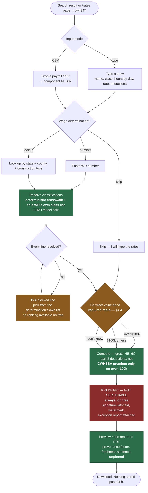

**There is no status gate on this diagram, and that is the change.** Free has exactly one terminal status. A gate is a decision; free has nothing to decide, because an artifact with no pin behind it can never satisfy the CERTIFIABLE condition. See §1.5.

### 1.3 Screens

| # | Screen | Emotional job | Heuristics | Note |
|---|---|---|---|---|
| S01 | Free generator input | *"This is a form, not a funnel."* | #8, #2 | Two affordances plus one required radio (the contract-value band, §4.4). The word "trial" does not appear. |
| S02 | Column mapping (**M**) | *"It already guessed most of it."* | #6, #9 | Identical component to S14. A free user who later pays meets no new UI. |
| S03 | Preview + download | *"That's the actual form — and it tells me what it isn't."* | #2, #4, #1 | Rendered PDF, **DRAFT watermark and withheld signature block, always**, provenance footer with the freshness sentence, 24-hour expiry stated with the exact expiry timestamp. |

### 1.4 Unhappy paths

| Trigger | What Marcus sees | How it resolves, in-product | Primitive |
|---|---|---|---|
| A payroll title matches no classification and no crosswalk entry | The row is marked; below it, the determination's own classification list, filtered by deterministic string similarity, each row showing group id, verbatim label, base and fringe | He picks one. Copy: *"Free lookup doesn't rank candidates for you. These are the classifications this determination actually lists. Pick the one whose scope matches the work."* No model call, no ticket. | P-A |
| He picks nothing and generates anyway | The PDF renders with a one-page exception report listing the row, the title as entered, and the dollars affected. The watermark and the withheld signature block were already there | He can still hand it to his GC as a draft, which is exactly what a draft is for. The blocked row adds a *reason*, not a *status* — the status was fixed the moment he chose the free path. | P-A → P-B |
| He answers **"I don't know"** to the contract-value question | The form generates. No CWHSSA premium is computed, and the exception report carries the §4.4 sentence naming the $100,000 clause threshold and the two places the answer is written down | Free never guesses either way, exactly as paid never does. The difference is only in the consequence: on free the artifact was already a draft, so the unknown band costs him an exception line rather than a status. | P-B |
| He selects a **union CBA group** (e.g. a group id prefixed `ELEC`) | Immediate refusal at selection, before any arithmetic | *"This group's rates come from a collective bargaining agreement. The agreement's fringe schedule is not published in the wage determination, so Ratepin will not compute it — we would be guessing. Survey groups (SU) and averages (UAVG) on this determination are available."* (D9, `is_union_group`) | P-D |
| Deduction column he can't classify | The row blocks with the **ten** categories of 29 CFR 3.5 — paragraphs (a) through (j), verified from the eCFR API 2026-08-13 — offered as a closed list | *"'Other' on a signed form is an assertion that the deduction is permissible. That's a legal question about your specific deduction, and we don't answer it. Pick the category it actually falls under, or leave the row blocked."* | P-A + P-D |
| Hours >24 in a day, 8 days in a week, negative hours, OT with no ST | Inline, at the cell, before generation | Error text names the cell, the value and the constraint, per [NN/g error-message guidelines](https://www.nngroup.com/articles/error-message-guidelines/): specific, human-readable, constructive, and the entered data is preserved. | prevention |
| He closes the tab, comes back tomorrow | `/wh347/p/[token]` says: *"This preview expired at 14:02 PT on 14 Aug 2026. Free previews are kept 24 hours and then deleted. Nothing was billed and nothing was kept."* | Re-entry is 90 seconds of typing, or a CSV. We do not offer to email it to him — that would be an email capture dressed as help. | honest expiry |
| Burst traffic / scripted abuse | A Cloudflare Turnstile challenge on burst, never a hard block | D3 promises *unlimited* free generation and we keep it; the throttle self-heals and shows the exact time it clears. There is no "contact us to raise your limit" — that is a human path. ([Cloudflare Turnstile](https://developers.cloudflare.com/turnstile/)) | self-healing |
| Corpus at L1/L2 | The footer runs the **same three-state freshness algebra as the paid artifact** (§7.3) — at L2 it additionally prints *"Our newer-revision check for {WD} last completed {ts} and has not re-run since."* on the artifact itself, not only on screen | MED-10: an anonymous visitor never sees an in-product banner, because there is no in-product. The honesty therefore has to be **on the paper**, or the free artifact is the least honest document the company produces — on the exact channel D8 uses to reach every GC in the county. Free users get no credit, because they paid nothing. | P-C |
| Corpus at L3 for the determination he named | The form still generates, from the last agreed snapshot, with the quarantine date printed in the footer | Never a blank page, never a silent stale page — the J2 rule, applied to the artifact. | P-C |

### 1.5 The one thing free deliberately does not do — and the status that follows from it

It never asserts a **revision-of-record**. It will look a determination up, print its number, revision and publication date as read at generation time, and stamp the corpus snapshot hash — but it does not create a `wd_pins` row, does not compute a diff since award, does not remember a classification past 24 hours, and does not keep the artifact. Deep dive 03's Challenge 4 puts the paid boundary exactly there, and D3 agrees: *"the paid line begins the moment a rate becomes an assertion."*

**Therefore every free artifact is DRAFT — NOT CERTIFIABLE, unconditionally, forever.** This is the MED-10 resolution and it is a tightening, not a clarification: the earlier design let a clean free run render a signature block. One rule now generates it, and it is the same rule §4.5's unpinned-project path already stated:

> **No pin, no signature block.** The CERTIFIABLE statuses assert a revision-of-record. The free path creates no pin by construction, so it can never satisfy the condition, so the gate is not consulted — the artifact is a draft before the first number is typed.

Three things follow, and they are the whole argument for doing it this way.

1. **It closes the honesty hole directly.** The old free footer named a WD number and revision read from a mirror that may be seventy-two hours unverified, to a visitor with no account, no banner and no credit — a rate assertion with less provenance than the one L2 blocks a paying customer from making (ARCHITECTURE §8.1). A withheld signature block is not a warning about that; it is the assertion never being made.
2. **It costs the free user nothing they came for.** Marcus wanted the arithmetic and the geometry. He gets both, complete, on the real form, with his own numbers. What he does not get is our countersignature on a revision we did not pin — and *he was always going to sign it himself anyway*. The certification on the reverse is his under 29 CFR 5.5(a)(3)(ii)(C); ours was never on the document.
3. **It makes the upgrade legible without a nag.** The free artifact now names its own gap, once, in the place a reader is already looking.

The upsell is therefore still not a nag. It is one line under the footer, and it is now *true about the document above it*:

> *This is a draft. Ratepin kept nothing from this session and pinned no revision, so the signature block is withheld. Pin this determination to a project and the same form comes back certifiable — with the revision kept, a notice when a newer one publishes, and every classification you just picked remembered.*

**The risk we are taking, named.** H-J7 (§21) already doubts whether a withheld signature block reads as integrity or as failure. Applying it to 100% of free artifacts moves that hypothesis onto the acquisition channel, where a bad reading costs conversion rather than trust. The instrument is the free→signup rate against the pre-change baseline, and D8 channel 1 is where it will show up first. Recorded as **H-J1b**.

---

## 2. J2 — County × craft rate lookup

**Entry:** organic search for "[county] [craft] prevailing wage rate 2026" (D8 channel 2). Statically generated from the mirror at build time, revalidated nightly after snapshot promotion (ARCHITECTURE §3.1).

### 2.1 Narrative

Marcus searches "fresno county pavement marking prevailing wage". He lands on `/rates/ca/fresno/pavement-striper`. The page is not a rate; it is a **rate with a citation**, which is the whole positioning (deep dive 02: the market frame is *wage-determination system of record*, not "certified payroll software" — a category we lose on price).

Above the fold: the classification exactly as the determination writes it, the base hourly rate, the fringe rate, the group identifier, the **wage determination number, revision and publication date**, the construction type, and the sentence *"read from the determination text at lines 412–414."* Below it, the thing nobody else publishes: **what changed at the last revision** — old base, new base, old fringe, new fringe, and the date it moved.

Two calls to action, both honest, neither an email wall: *generate a WH-347 with this rate* (→ J1) and *email me when this determination changes* (→ S05, D8 channel 3 — the list is built on exactly the anxiety we monetise).

### 2.2 Flow

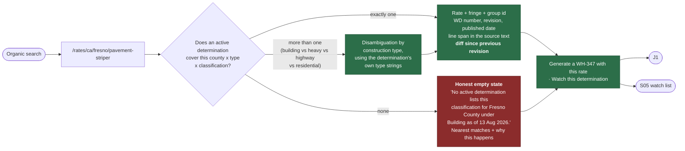

### 2.3 Unhappy paths

| Trigger | What the visitor sees | Resolution | Primitive |
|---|---|---|---|
| No active determination covers the county × type × craft | A named empty state, dated, with the three real causes listed: the county may be covered under a different construction type; the contract may carry a **project wage determination** issued to the contracting agency and never published; the work may not be DBA-covered at all | Links to the county's other construction types, and to J1 with "type the rates yourself". **We never interpolate a rate from a neighbouring county.** ([NN/g on empty states](https://www.nngroup.com/articles/empty-state-interface-design/)) | P-D |
| The visitor is in a state with its own prevailing-wage law | A standing note under the rate | *"This is the federal Davis-Bacon rate for this determination. {State} has its own prevailing-wage law that may set a different rate for the same work. Ratepin does not track state determinations outside California."* (D9) | P-D |
| Corpus at L1 or L2 | The page's "as of" line narrows | *"Rates from {WD} revision {N}, published {date}. Our newer-revision check last completed {ts} and has not re-run since."* Same sentence the artifact footer uses (ARCHITECTURE §6.4) — one source, three surfaces. | P-C |
| A quarantined WD (L3) | The page renders from the **last agreed snapshot** and says so, with the date | Never a blank page, never a silent stale page. | P-C |
| The classification is a union CBA group | The rate is shown (it is in the public determination) with the fringe treatment flagged | *"The fringe figure for this group is set by a collective bargaining agreement that is not published here. Ratepin will not compute a fringe credit against it."* | P-D |
| Someone subscribes to alerts with a typo'd email | Double opt-in; nothing is sent until the confirmation is clicked; every alert carries one-click unsubscribe | Standard CAN-SPAM hygiene ([FTC compliance guide](https://www.ftc.gov/business-guidance/resources/can-spam-act-compliance-guide-business)), and it means an abandoned typo costs nobody anything. | — |

### 2.4 Why the diff is above the fold

Deep dive 02's hardest finding: **the WD archive is not a cornered resource.** Re-verified from this machine today: `GET sam.gov/api/prod/wdol/v1/wd/WA20200002/0/download` returns **HTTP 303 See Other** to `iae-wdol-sam-gov.s3.amazonaws.com/WDOL_FILES_PROD/DBA/ARCHIVE/FY2020/wa2.r0.txt` — a presigned object in a deterministically named archive path, reproducing a six-year-old revision as plain text. `govconapi.com` resells 90,033 determinations with `date_from`/`date_to` at $19/month. So the page cannot win on *having* the data, and **the sentence "you cannot reconstruct a superseded revision" is measured false and is banned from every surface, marketing included** (HIGH-7; §16.3). It wins on **assembly**: the per-classification diff, computed and displayed, is work nobody has done for this county × craft, and it is what a searcher who is worried about a rate change actually wants. The moat is stated the same way everywhere it appears — **assembly, latency and crosswalk memory** — and §21 records that all three are unmeasured.

---

## 3. J3 — The $49 bid rate card, purchased before an account exists

**Entry:** S04 → S06, or direct. This is **A1's sharpest test**: money changes hands with no account, no call, no quote (D4).

### 3.1 Narrative

Marcus is bidding a second job — a county airport apron, federal-aid, bid opening in eleven days. He needs a defensible rate sheet for the six classifications he will use, and he needs to know whether the determination moved since the solicitation went out, because if it did and he bid the old rate he eats the difference on every hour.

`/rate-card` asks for: the wage determination (number, or county + construction type), the classifications he cares about (multi-select from that determination's own list), and two optional dates — solicitation date and expected award date. He sees a live preview of the first classification, watermarked, so he knows exactly what he is buying before he pays. **Hormozi's perceived-likelihood lever is the artifact itself**, and it must be visible pre-payment or the offer is a promise rather than a proof ([Hormozi, *$100M Offers*](https://www.acquisition.com/)).

Price: $49, one-time. Stripe hosted Checkout in `payment` mode. He types his email into Checkout; that is the only identity we get and the only one we need.

The rate card he receives contains six things:

1. Every selected classification: group id, verbatim label, base rate, fringe rate, and the line span in the determination text.
2. The **wage determination number, revision number and publication date**, stamped on every page.
3. The **per-classification diff** against every earlier revision inside a window he chooses — the actual product.
4. A **modification timeline** for the determination: each revision, its publication date, and which of his classifications moved at each.
5. The **FAR 22.404-6 panel**, which is a P-D by construction — see below.
6. The corpus snapshot hash and generation timestamp, so the document is reproducible eighteen months later from stored data (ARCHITECTURE §5.3).

### 3.2 The FAR panel is the most important thing on the document, and it concludes nothing

```
EFFECTIVENESS — WHAT WE CAN SHOW, AND WHAT WE WILL NOT SAY

  Revision 4 of CA20260012 was published 2026-07-31.
  You gave a solicitation date of 2026-07-14 and an expected
  award date of 2026-09-02.
  Revision 4 published 18 days after solicitation and (on your
  stated dates) 33 days before award.

  FAR 22.404-6 governs which revision applies to a contract, and
  the answer can turn on a finding by the contracting officer —
  a finding Ratepin cannot observe.

  RATEPIN DOES NOT CONCLUDE WHICH REVISION IS EFFECTIVE FOR
  YOUR CONTRACT. The dates above are what we can see. The
  determination incorporated into your solicitation, and any
  amendment your contracting officer issues, govern.
```

This paragraph is the product's character in one box. It is enforced by the DO-NOT-ASSERT lint (ARCHITECTURE §11.7), which fails the build if any copy under this template asserts effectiveness. Reference: [FAR 22.404-6](https://www.acquisition.gov/far/22.404-6).

### 3.3 Sequence

```mermaid
sequenceDiagram
    autonumber
    actor M as Marcus — no account
    participant W as web S06
    participant MR as mirror read model
    participant S as Stripe Checkout
    participant H as webhook handler
    participant R as R2
    participant E as email

    M->>W: WD number or county + construction type
    W->>MR: candidate determinations, last promoted snapshot
    MR-->>W: WD number, revision, published date, classification list
    W-->>M: pick classifications; watermarked preview of one

    Note over W: LADDER CHECK BEFORE ANY CHARGE
    W->>MR: freshnessOf(candidate WD)
    alt ladder at L2 STALE or WD quarantined at L3
        W-->>M: <b>we refuse the sale</b> — see 3.5
    else L0 or L1
        W->>S: create Checkout Session (payment mode, $49)<br/>success_url carries {CHECKOUT_SESSION_ID}
        M->>S: card + email
        S-->>M: redirect to success page
        S->>H: checkout.session.completed
        Note right of H: Fulfilment is driven by the webhook,<br/>never by the landing page — Stripe's own<br/>guidance, because the customer may never<br/>load the success page
        H->>MR: read pinned-at-purchase revision + diffs
        H->>R: PUT rate-card.pdf (content-addressed)
        H->>E: magic link to /rate-card/r/[token], 12-month TTL
        E-->>M: "Your rate card for CA20260012 rev 4"
        M->>W: open link, download
    end
```

Stripe's guidance is quoted rather than paraphrased because it is the reason the fulfilment path looks the way it does: *"You can't rely on triggering fulfillment only from your checkout landing page, because your customers aren't guaranteed to visit that page… Set up a webhook event handler so Stripe can send payment events directly to your server, bypassing the client entirely."* ([Stripe, Customize redirect behavior](https://docs.stripe.com/payments/checkout/custom-success-page); [Fulfilment](https://docs.stripe.com/checkout/fulfillment).)

### 3.4 No account is created

The email from the Checkout Session becomes the delivery address. A `tenants` row is **not** written. The artifact lives at a token URL for twelve months. If Marcus later signs up with the same email, the rate card attaches to the new tenant automatically — recognition, not re-purchase (heuristic #6). This is the literal reading of D4's *"purchasable pre-account"*, and it means the $49 is a genuine risk-reversal instrument (deep dive 03, reversal (b)) rather than a disguised signup.

### 3.5 Unhappy paths

| Trigger | What Marcus sees | Resolution | Primitive |
|---|---|---|---|
| **Corpus at L2 STALE, or his WD quarantined at L3, at the moment of purchase** | The Buy button is replaced, before Checkout opens, by: *"We're not selling a rate card for CA20260012 right now. Our newer-revision check for this determination last completed 2026-08-10 06:12 ET, and a rate card is a claim about what's current. The free generator still works, and we'll email you the moment this clears — no card needed."* | **We refuse the money.** D7 blocks new *rate assertions* at L2 and a bid rate card is the purest rate assertion in the product; ARCHITECTURE §8.1 blocks new pins for the same reason. A one-field email capture fires the sale later, automatically. See Challenge D (§20). | P-C |
| Card declined | Stripe's own error inside Checkout; on return, S06 is exactly as he left it, every selection preserved | Preserving input on error is [NN/g's efficiency guideline](https://www.nngroup.com/articles/error-message-guidelines/) and it is the difference between a retry and an abandon. | — |
| He pays, then closes the tab before the success page loads | Nothing is lost. The webhook fulfils; the email arrives | The documented reason webhooks are mandatory. | — |
| Webhook delayed; he lands on the success page first | *"Payment received. Your rate card is being generated — this page refreshes itself, and the link is in your inbox either way."* | Never a spinner with no ending; the success page polls the session and states the fallback. | #1 |
| He bought the wrong county or the wrong construction type | On S08, a control: **"Wrong determination? Rebuild this rate card for a different one — free, within 14 days."** | Cheaper for both sides than a refund and it fixes the actual problem. Unlimited rebuilds inside the window; after that, the refund button. | #3, #9 |
| He wants his money back | An in-app button on S08, no email address, no reason field: **full refund within 14 days, no questions** (ARCHITECTURE §9.3) | `stripe.refunds.create` with an idempotency key ([Stripe idempotency](https://docs.stripe.com/api/idempotent_requests)). The confirmation states the amount and the arrival window. The artifact link keeps working — clawing back a document he already read would be theatre. | — |
| He names a WD number that does not exist, or is inactive | Resolved on S06, **before** Checkout | *"CA20260012 revision 9 isn't in the published record. Active revisions we hold: 0, 1, 2, 3, 4."* We never take money for an input we cannot resolve. | prevention |
| The determination's classification list contains only union CBA groups | Refusal before purchase | *"Every classification on this determination comes from a collective bargaining agreement. Ratepin doesn't compute CBA fringe schedules, so a rate card here would be half a document. We're not selling you one."* | P-D |

---

## 4. J4 — Signup and the six-field project setup, including find-my-WD and the contract-value band

### 4.1 Narrative

Dee has three active federally funded jobs and has been doing WH-347s by hand for four years. She lands from an S04 page for "Madera County cement mason prevailing wage", runs a free WH-347 (J1), sees that the arithmetic matches what she computed by hand, and decides to set up a real project.

**Signup is an email address.** Magic link, single-use, short-expiry, hashed at rest; no password, therefore no password reset flow, therefore one fewer support surface that does not exist (ARCHITECTURE §11.5). She is signed in in under a minute, most of which is her mail client.

Then the fields. D4 called this a "five-field project setup"; CRIT-3 made it six, and the sixth is not a nicety — see §4.4 and Challenge B (§20):

| # | Field | Why it is required | Default / help |
|---|---|---|---|
| 1 | **Project name** | Hers, not ours. It appears on the WH-347 header and on the Friday board | free text |
| 2 | **State and county** | Determines which determinations cover the site | typeahead over the mirror's county coverage |
| 3 | **Construction type** | Building / Heavy / Highway / Residential — the axis on which determinations split | radio, with the determination's **own type strings** shown |
| 4 | **Funding source** | DBA direct vs. a Related Act vs. state-only. Changes what we will and will not say | radio; picking "state-funded only, no federal money" **ends the flow honestly** (§4.5) |
| 5 | **Wage determination** | Number from the contract, or **find it for me** | → S11 |
| 6 | **Contract-value band** | Decides whether the 40-hour CWHSSA premium is computed at all. There is no safe default in either direction | radio, **no option pre-selected**, three values including *I don't know* → **§4.4** |

Three refinements sit behind progressive disclosure ([NN/g](https://www.nngroup.com/articles/progressive-disclosure/)) — *"Disclose these secondary features only if a user asks for them"*:

- **Award or bid date** — needed for "diff since award" (D3); defaults to today, editable.
- **Contract number** — printed on the form when supplied.
- **"My contract incorporates this revision at award"** — the contract-lock assertion (MED-9). Offered here for the user who already knows, and offered again at the moment it actually matters, on S19 the first time a newer revision publishes (§8.4). Default **unset**, which is neither yes nor no.

All three are optional. See Challenge B (§20): the field count is six required plus three refinements, and the diff-since-award feature is weaker without the date.

### 4.2 Find-my-WD

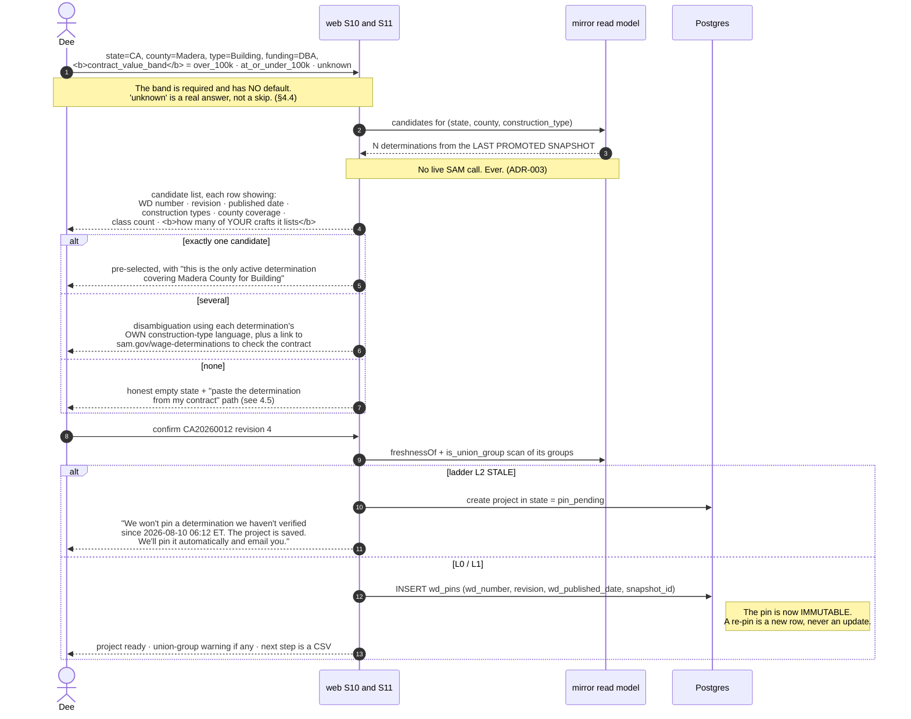

### 4.3 The union-group warning, at setup rather than at generation

D9 refuses union CBA fringe schedules and says the refusal happens *at signup, not by approximation*. Concretely, `wd_classifications.is_union_group` is scanned at pin time and, if any of the determination's groups are CBA-derived, Dee sees this before she uploads anything:

> **4 of this determination's 31 classification groups come from collective bargaining agreements** (ELEC0100-004, PLUM0246-009, IRON0155-011, OPEN0003-021). Their fringe schedules are not published in the determination, so Ratepin will not compute a fringe credit against them. If your crew works under any of those classifications, those payroll lines will block and the filing will render as **DRAFT — NOT CERTIFIABLE**.
>
> The other 27 groups — survey rates (SU) and averages (UAVG) — are fully supported.

Telling her at minute 3 rather than at minute 40 on a Friday is the whole point. It is heuristic #5 applied at the level of *product fit* rather than of field validation, and it is the honest version of Moore's beachhead discipline: we would rather lose a union shop at setup than half-serve one at deadline ([Moore, *Crossing the Chasm*](https://openlibrary.org/works/OL2734570W/Crossing_the_chasm)).

### 4.4 The contract-value band, and the "I don't know" path

CRIT-3 in one sentence: **the product computed a Contract Work Hours and Safety Standards Act premium on every project, and CWHSSA does not attach to every project.** Verified verbatim from the eCFR API today — 29 CFR 5.5(b), preamble:

> *"The Agency Head must cause or require the contracting officer to insert the following clauses set forth in paragraphs (b)(1) through (5) of this section in full … in any contract **in an amount in excess of $100,000** and subject to the overtime provisions of the Contract Work Hours and Safety Standards Act."*

Davis-Bacon itself attaches to contracts **in excess of $2,000**. The gap between the two thresholds is not an edge case for D1's buyer — it is where a six-person striping sub on a county job actually lives. WHD's own WH-347 instruction ties the form's overtime row to the same condition, verbatim from the form's page (2026-08-13): *"On all contracts subject to the Contract Work Hours and Safety Standards Act (CWHSSA), enter hours worked on this project in excess of 40 hours total in the week as overtime ("OT")."*

So the product needs one fact it cannot observe, and it has to ask for it without pretending to know what the answer means for her.

#### 4.4.1 The question, exactly as it is asked

Field 6 on S10. No option pre-selected; the primary button is inert until one is chosen.

> ### Contract value
>
> **Is the prime contract on this job over $100,000?**
>
> - ◯ &nbsp;Over $100,000
> - ◯ &nbsp;$100,000 or less
> - ◯ &nbsp;I don't know
>
> **Why we ask.** The 40-hour overtime rule this form has a column for — Contract Work Hours and Safety Standards Act overtime — is written into contracts *"in an amount in excess of $100,000"* (29 CFR 5.5(b)). Davis-Bacon starts at $2,000, so a job can be a Davis-Bacon job and not a CWHSSA job at the same time. Over the line, we compute a premium on hours over forty in the week. At or under it, we don't — and we print that we didn't.
>
> **Where to read the answer.** It is the **prime contract** amount, not your piece of it: a $40,000 subcontract under a $3m prime is over the line. If you can't see the prime's value, read your own contract's clause list instead — **FAR 52.222-4, "Contract Work Hours and Safety Standards Act — Overtime Compensation"**, is the clause that carries this rule, and it flows down. If that clause is in your contract, answer **over $100,000**. **If the clause and the dollar figure seem to disagree, go with the clause** — the contract governs, not the arithmetic.
>
> **What we don't do.** Ratepin doesn't read your contract and doesn't decide whether that clause is in it. We compute from what you tell us, and every artifact prints what you told us and when.

That last paragraph is the whole reason this is not legal advice. We cite the rule, name the two places the answer is written down, and then decline: the sentence on the artifact is always *"you told us"*, never *"CWHSSA applies to you."* **"That CWHSSA applies to this contract" is added to the DO-NOT-ASSERT list** (§16.1).

#### 4.4.2 The three answers, and what each one does to the artifact

| She picks | `contract_value_band` | What the engine does | What the artifact says | Status |
|---|---|---|---|---|
| **Over $100,000** | `over_100k` | The CWHSSA path as specified: premium on hours over forty, the `max(BHR_WD, cash excluding fringe)` floor on the overtime basis, `PREMIUM_BELOW_STATUTORY` live | Provenance block: *"Overtime computed under the Contract Work Hours and Safety Standards Act. You recorded on 2026-08-13 that this contract is over $100,000."* | unaffected |
| **$100,000 or less** | `at_or_under_100k` | No premium. No wage-determination floor on the overtime basis. `PREMIUM_BELOW_STATUTORY` **suppressed**, because it names a violation of a statute this contract may not be under | Exception-report line on **every** filing: *"You recorded on 2026-08-13 that this contract is $100,000 or less. The 40-hour overtime clause at 29 CFR 5.5(b) goes into contracts in excess of $100,000, so Ratepin has computed no Contract Work Hours and Safety Standards Act premium on this payroll. Ratepin does not compute Fair Labor Standards Act overtime — that is a separate rule on a different basis, and we don't do it. Column 4's overtime row carries the hours your payroll reported, unchanged."* | unaffected |
| **I don't know** | `unknown` | Nothing. It neither computes a premium nor omits one | The P-B block below | **DRAFT — NOT CERTIFIABLE** |

#### 4.4.3 What the artifact says on `unknown` — the exact copy

Rendered on S16 above the preview, and on page 1 of the exception report:

> **DRAFT — NOT CERTIFIABLE · the 40-hour overtime rule is unresolved**
>
> We don't know whether the Contract Work Hours and Safety Standards Act clause is in this contract, so we haven't guessed. The clause at 29 CFR 5.5(b) goes into contracts *"in an amount in excess of $100,000"*, and it changes both what goes in column 4's overtime row and whether a premium is owed on hours over forty.
>
> Guessing yes would print an overtime premium you may not owe. Guessing no would drop one you may. Both land on a document you sign.
>
> The signature block is withheld until this is answered. **It is one question, it takes one click, and it is remembered for this project.**
>
> [Answer the contract-value question]

No other route out. There is no "generate anyway" on this block, because the two failure modes are symmetric and neither is safe — which is precisely why `unknown` is a first-class value rather than a null. **This is the one place in the product where the block exists to stop *us* from asserting, not to stop her from filing:** she can still download the draft, hand it to her GC, and answer the question on Monday.

#### 4.4.4 Two thresholds, one contract — and why the contract wins

Recorded because the number is not as clean as a single citation makes it look. 29 CFR 5.5(b) directs insertion above **$100,000**. FAR 22.305, which governs direct federal procurement, tells contracting officers *not* to insert 52.222-4 in contracts *"Valued at or below $200,000"* (verified on acquisition.gov, 2026-08-13). Both are live; they implement the same statute at different levels of generosity, and a federally *assisted* Related-Act contract is not procured under the FAR at all.

We do not resolve that. We take the lower of the two as the band boundary — so the question is asked of everyone the CFR reaches — and then we hand the tiebreak to the only authority that actually binds her: **the clause list in her own contract**, which is why §4.4.1's copy says to go with the clause when the two seem to disagree. The band is her recorded assertion; the contract is the fact; we are neither.

#### 4.4.5 Changing the answer later

The band is per-project and editable on S12. Changing it behaves exactly like changing classification memory (§6.4): **it does not alter filings already generated**, because artifacts are immutable, and the editor offers *"Generate amendments for the N affected filings"* — new filings with `amends_filing_id` set. A band moving from `unknown` to a real value is the common case and usually has no prior filings to amend, because `unknown` never produced a certifiable one.

### 4.5 Unhappy paths

| Trigger | What Dee sees | Resolution | Primitive |
|---|---|---|---|
| **Contract-value band left at `unknown` at generation time** | The §4.4.3 block. Full preview, full arithmetic apart from the premium, signature block withheld, one button that goes to the one question | The block is project-scoped, not line-scoped, so it is **P-B** rather than P-A: no individual row is wrong, the whole document's overtime basis is unestablished. | P-B |
| **Funding source = "state or local money only"** | The flow stops, politely and immediately | *"Then this isn't a Davis-Bacon project and Ratepin isn't the right tool. If it's California public works, you still owe DIR a certified payroll — but under state law, and we only cover the federal determination plus the DIR XML format. We'd rather say so now than take your money."* Refusing an unqualified buyer at setup is A6 in practice: an unqualified customer is a support load we cannot serve. | P-D |
| Zero candidate determinations for county × type | Named empty state with the three real causes (as J2) plus a fourth path: **"paste the determination number from my contract"** | If the pasted number is in the mirror, we pin it even if our county index did not predict it — the contract governs, not our index. If it is **not** in the mirror (e.g. a project wage determination issued directly to the agency and never published), the project is created **unpinned**, and every filing on it can only ever be **DRAFT — NOT CERTIFIABLE**, stated in that sentence at creation time. | P-B stated in advance |
| Several determinations, and she is not sure which construction type | Each candidate shows the determination's own construction-type string plus the classifications it lists; a "what if I pick wrong?" disclosure says: *"Nothing is destroyed. Change the type and the candidates change. A pin can be replaced; the old one is kept."* | Reversibility is heuristic #3, and stating it up front is what stops a wrong-but-committed choice. | — |
| Ladder at **L2 STALE** at pin time | Project saves in `pin_pending`; banner names the exact last-successful-check timestamp; the staleness credit is already accruing on her account | She is not blocked from *using the product* — the free generator path still produces a document. She is blocked from us **asserting a revision-of-record we have not verified**. Fail closed on the claim, not the artifact (ADR-006). | P-C |
| Magic link expires before she clicks it | *"That sign-in link expired at 15:41. Here's a new one."* One button, same screen, no error page | The most common auth failure gets the least ceremony. | #9 |
| She creates a second project on the same determination | Detected and offered: *"CA20260012 rev 4 is already pinned on 'Madera Airport Apron'. Pin the same revision here, or pin the current revision 5?"* | Two projects may legitimately sit on different revisions, so we ask rather than assume. Her classification memory is shared across both automatically, because it is keyed on the **WD group**, not the project. | #6 |
| She is on **Solo** and this is her second project | Nothing blocks. There are **no project caps at any tier** (deep dive 03's Challenge 2 to D4). The plan meters filings, not projects | The old D4 wall would have made her second project a churn event. See §20 Challenge A. | — |

---

## 5. J5 — Payroll CSV upload and column mapping

### 5.1 Narrative

Friday, 3:40pm. Dee runs payroll in QuickBooks Desktop, exports a CSV, and drops it on S13. She does this every week for the rest of the project's life, so this screen's job is to **disappear after the first use**.

First upload: we sniff the encoding (and hard-reject on ambiguity rather than guessing — ARCHITECTURE §11.4), the delimiter and the header row, then propose a mapping. Component **M** shows two panes: her columns on the left, our fields on the right, with the proposal already applied and a confidence marker on each. Below, a live preview of **the first five rows rendered as WH-347 cells** — column 1B last name, 1C first name, 1E identifying number, 2 journeyworker or apprentice, 3 classification, 4 hours by day, 5 total hours, 6A rate, 6B fringe credit, 6C cash in lieu, 7A gross this project, 7B gross all work, 8 deductions, 9 net. Those are the form's actual column headings, verified on the DOL form page (2026-08-13).

She fixes two columns. She confirms. The map is written to `payroll_imports.column_map`.

**Second upload, and every upload after: the mapping is applied silently.** No confirmation step, no modal, no "does this look right?" — just the preview, with a quiet line above it: *"Mapping remembered from your upload of 8 Aug. Change it."* Heuristic #6 and #7 together; WCAG 2.2's Redundant Entry criterion (SC 3.3.7) says the same thing in accessibility terms — do not make a user re-enter information they already gave you ([W3C, Understanding Redundant Entry](https://www.w3.org/WAI/WCAG22/Understanding/redundant-entry.html)).

### 5.2 The SSN moment

Her export has full Social Security numbers. This is the highest-trust moment in the entire product and it costs one sentence:

> Column `SSN` is encrypted on receipt. **The WH-347 will print only the last four digits**, because 29 CFR 5.5(a)(3)(ii)(B) requires it: *"full Social Security numbers and last known addresses, telephone numbers, and email addresses must not be included on weekly transmittals."* California's eCPR schema requires all nine, so if you export DIR XML we decrypt for that file only, and that file is handled and stored separately.

Both halves of that are verified verbatim from the eCFR API and the DIR XSD respectively. Architecturally, the WH-347 renderer **cannot** read anything but `ssn_last4`; it has no access to the decrypt function and the import-boundary check enforces it (ARCHITECTURE §11.3). The UI is telling the truth about a code-level guarantee, which is the only kind of trust copy worth writing.

### 5.3 Flow

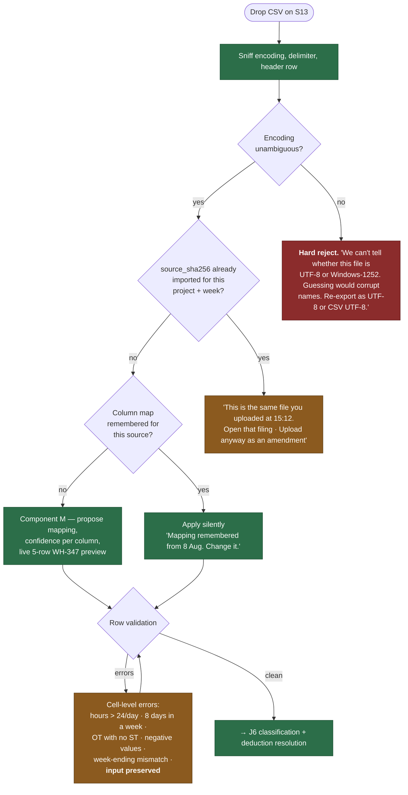

### 5.4 Unhappy paths

| Trigger | What Dee sees | Resolution | Primitive |
|---|---|---|---|
| Ambiguous encoding | Hard reject with the two candidate encodings named and the exact re-export instruction for her payroll system | Guessing corrupts names (`Núñez` → `Nuñez`) on a signed federal document. A wrong name is a defect on the certification. | prevention |
| Same file, same week, uploaded twice | *"This is the same file you uploaded at 15:12 today."* Two buttons: open that filing, or upload as an **amendment** | Idempotent on `source_sha256`. An amendment is a **new filing** with `amends_filing_id` set (ARCHITECTURE §5.3) — an amended certified payroll is a distinct legal document, not an edit to a signed one. | #5 |
| Hours land outside the declared week-ending | The offending rows listed with their dates, and the two possible fixes: change the week-ending, or exclude those rows | For California this is not cosmetic: the eCPR XSD declares `day` with `minOccurs="7" maxOccurs="7"`, so a week that is not seven days cannot produce valid XML. Stated at upload rather than discovered at export. | #9 |
| A column labelled as a premium — `DT`, `2X`, `SHIFT`, `PREM` — whose rate does not prove a premium was paid | **That row blocks**, with the arithmetic shown: the hours, the rate the CSV states, and `1.5 × regular rate` beside it. A closed choice: *"these are premium hours paid at or above time-and-a-half"* or *"these are ordinary hours under another label"* | Per R-CRIT4: hours in any premium-labelled column **count toward the forty-hour threshold** unless the row proves a ≥1.5× rate was actually paid. A mislabelled column at $1.00/hr would otherwise erase statutory overtime from a signed payroll and look completely normal doing it. The engine does not decide which reading is true; the row asserts it, in a closed choice, before anything computes. Fires only when the band is `over_100k` — below the threshold there is no CWHSSA denominator to protect. | P-A |
| A deduction column that maps to no 29 CFR 3.5 category | **Those rows block.** A closed picker of the **ten** categories permissible without WHD approval — (a) through (j), including **(i)** board and lodging at reasonable cost and **(j)** minimal-value safety equipment the worker bought, which is how boots and glasses come off a field crew's cheque — memorised per tenant once chosen | *"'Other' on a signed form asserts the deduction is permissible. Whether yours is permissible under 29 CFR part 3 is a legal question about your specific deduction, and we don't answer it."* ([29 CFR 3.5](https://www.ecfr.gov/current/title-29/subtitle-A/part-3/section-3.5)) | P-A + P-D |
| Column 6B (fringe credit) present | Accepted, printed, and **disclaimed on the artifact** | *"6B is what you tell us you credit. We print it. We do not verify that the plan is bona fide, that contributions are annualized under 29 CFR 5.25(c), or that an unfunded plan qualifies — those are findings about your plan, not arithmetic."* (D9 + deep dive 04; §20 Challenge in ARCHITECTURE §16.5) | P-D |
| More than 500 workers in one week on one project | Warning at upload, not at export: *"California's eCPR schema caps a submission at 500 employees (`employee maxOccurs="500"`). This week has 512. The WH-347 PDF is unaffected."* | The constraint is quoted from the pinned XSD, not paraphrased. | P-B, per artifact |
| Upload interrupted (job-trailer wifi) | The import row exists with `row_count` null; on return: *"An upload from 15:31 didn't finish. Resume · Discard."* | No orphan state, no "please try again". | #9 |
| File over the row/size cap | The exact cap, her file's actual size, and a suggested split by project | Numbers, not "too large". | #9 |
| Formula-injection prefixes in cells (`=`, `+`, `-`, `@`) | Nothing visible; neutralised on anything we ever write back out in the portal-export bundle | A defence the user should never have to think about. | — |

### 5.5 Why component M is shared with the free generator

Heuristic #4, consistency, has a business consequence here. A free user who maps a CSV on `/wh347` and later becomes a customer meets **the same component, the same labels, the same preview** on `/app`. The upgrade is not a re-learning event. It also means the mapping component is exercised by anonymous traffic every day, which is the cheapest possible test suite for the paid path.

---

## 6. J6 — The unmapped-classification picker, and the memory that removes it permanently

This is the journey the entire autonomy argument rests on. A3 names one human-shaped question in this product — *"which classification is this guy?"* — and this is where it is answered without a human, once, forever.

### 6.1 Narrative

Dee's CSV has a row whose job title reads `CEM MASON - FINISH`. Her crosswalk has no entry for it on this determination's group. The engine does **not** guess and does **not** proceed.

The row appears on S15 in a blocked state, showing the title exactly as her payroll system wrote it, the worker's initials, the hours, and the dollars affected. Beneath it: **three candidates, none of them selected**, ordered by the model, and constrained by construction to classifications that actually exist in **this determination revision's parsed rows** (ARCHITECTURE §4.3, §11.4). Each candidate shows:

- the group identifier (`SUCA2020-005`), because that is what the determination calls it;
- the **verbatim classification label** from the determination text;
- the **verbatim scope text** where the determination provides one;
- base rate and fringe rate;
- the **line span** in the source document, with a link that opens the determination text scrolled to those lines.

Below the three: *"None of these"* → the full searchable list of that revision's classifications. Below that: nothing. No chat bubble. No "ask an expert". No mailto. A lint rule fails the build if a `mailto:` or a contact-support component appears anywhere under the filing route tree (ARCHITECTURE §13, A3 row).

And nothing above them, either — which is the HIGH-2 resolution, stated here because this screen is where it is either kept or broken:

> **The picker never arrives pre-selected from another tenant's data.** No radio is filled, no candidate is highlighted as recommended, no count of other companies' confirmations appears beside any candidate, and the confirm button is inert until she chooses. What the cross-tenant aggregate may do is **order the list**. That is the entire permission. It may not select, default, pre-fill, auto-apply, or annotate an individual candidate. (§6.3, mechanism 3.)

She reads the second candidate's scope text, recognises the work, clicks it. Then the sentence that is the actual product:

> **Remembered.** Ratepin will use **Cement Mason (SUCA2020-005)** for `CEM MASON - FINISH` on every determination in this group, on every project, from now on. Change it in Settings → Classification memory.

### 6.2 Sequence

```mermaid
sequenceDiagram
    autonumber
    actor D as Dee
    participant E as filing engine
    participant X as crosswalk
    participant MR as mirror read model
    participant A as Anthropic
    participant W as web S15

    E->>X: lookup(tenant, wd_group, normalize("CEM MASON - FINISH"))
    X-->>E: MISS

    E->>MR: classificationsFor(pin)
    MR-->>E: 31 parsed rows of exactly this revision

    alt model available and inside P12 budget
        E->>A: rank candidates — response schema is a<br/>CLOSED ENUM of those 31 ids, no numeric field
        A-->>E: ordered ids, JSON-schema validated
        Note right of A: An id outside the enum fails validation.<br/>The model cannot emit a rate. (I2 / ADR-002)
    else model down, or P12 budget tripped
        E->>E: deterministic similarity over the same 31 rows<br/>— the free generator's exact code path
        Note right of E: UI says "ranking is in reduced mode;<br/>this is the determination's own list, unranked"
    end

    E-->>W: top 3 + verbatim label + verbatim scope +<br/>base + fringe + line span; <b>row blocked</b>
    W-->>D: picker — <b>nothing pre-selected, confirm inert</b>
    D->>W: choose SUCA2020-005
    W->>X: INSERT (tenant, wd_group, normalized_title)<br/>→ classification_id, source = user_confirmed
    W-->>D: "Remembered. Never asked again for this account."
    Note over X: HER OWN confirmed entry AUTO-APPLIES from now on —<br/>no picker, no prompt. That is the product.<br/>The k>=5 cross-tenant aggregate may only ORDER a<br/>candidate list. It never selects, defaults or auto-applies<br/>for anyone else. (HIGH-2; CORPUS_DESIGN 7.4)
```

### 6.3 How the memory removes the question permanently

Three mechanisms, in increasing order of power.

1. **Per-tenant memory, keyed on the WD group — not the project, not the WD number.** `crosswalk_entries(tenant_id, wd_group, normalized_title) → classification_id`. Because it is keyed on the group, one answer covers every project on every determination that carries that group, and it **survives a re-pin to a new revision** (J8). This is the difference between "remembers within a project" (worthless) and "remembers the trade" (the moat).
2. **Normalization before lookup.** `CEM MASON - FINISH`, `Cement Mason – Finisher`, `CEMENT MASON/FINISH` collapse to one key. Digits, personal-name-shaped tokens and punctuation are stripped (CORPUS_DESIGN §7.4), which is also what makes the aggregate safe to share.
3. **The cross-tenant aggregate, at k ≥ 5 — which may only change the ORDER of a list.** A `(wd_group, normalized_title)` pair confirmed by **five or more distinct tenants** seeds candidate *ordering* for a brand-new account — as a count, never as a row, never with a tenant identity, and never attached to an individual candidate on screen. A payroll title can occasionally identify a person ("Foreman - J. Alvarez Crew"); a title confirmed by five independent contractors is a fact about a trade. This is Helmer's process power expressed as a data structure: it compounds from customer corrections rather than from crawling, and no incumbent has it because incumbents make the contractor pick the class by hand ([Helmer, *7 Powers*](https://7powers.com/)).

#### 6.3.1 The auto-apply boundary — HIGH-2, stated as a permission table

This is the rule the build must not soften. Read the columns as strictly increasing power, left to right:

| Where a suggestion comes from | May **auto-apply** silently, no picker | May **pre-select** a radio in the picker | May only **order** the list |
|---|---|---|---|
| This account's own `user_confirmed` entry for this `(wd_group, normalized_title)` | **yes — this is the product** | — | — |
| This account's own project-scoped override (§6.4) | yes, on that project only | — | — |
| This account's own remembered column map (J5) | yes | — | — |
| An **exact** match, after normalization, against this determination's **own verbatim classification label** | no | **yes** | — |
| Deterministic string *similarity* below exact | no | no | yes |
| The model's ranking over the closed enum of this revision's rows | no | no | yes |
| **The cross-tenant k ≥ 5 aggregate** | **no** | **no** | **yes, and nothing else** |

Two of those rows are the finding. **Her own confirmed choices may auto-apply**, because she made them, they are hers, and re-asking her is the exact cost the product exists to remove. **Nobody else's may**, in any form — not as a default, not as a highlighted "most common" chip, not as a pre-filled radio she has to notice in order to override.

**Why: the count is an attacker-controlled input, and pre-selection is what converts that into a signature.** Signup is a magic link at a self-serve address; accounts are free to create and the free tier needs none at all. So "five distinct accounts" is not five independent contractors unless something makes it so — five sybils are a Tuesday afternoon. That is survivable as an *ordering* input and not survivable as a *default*, and the difference is exactly what the user has to do to be harmed:

- **Ordering only.** The worst case is that three real classifications from this determination's own parsed rows appear in a bad order. Each still carries its verbatim label, its verbatim scope text, its base and fringe rates and a link to the source lines. She still has to read one and click it. The blast radius of a poisoned cell is *a worse first guess*.
- **Pre-selection.** The worst case is a wrong classification, hence a wrong rate, arriving already chosen, on a document signed under 18 U.S.C. 1001, for every tenant on that WD group — accepted by anyone who does not read. And **H-J6b (§21) says out loud that we do not know whether anyone reads.** A design cannot rest a federal certification on an unmeasured assumption about attention. The standing rule from R-CRIT1 applies by analogy: no signal gets promoted to authority until its error rate has been measured against the live corpus.

Two supports, neither of which is the primary defence:

- **Weight, don't just count.** A supporting account contributes to the aggregate only if it has actually done work — a minimum number of released filings across a minimum number of distinct projects. This raises the price of a sybil from free to *doing the job*, which is the only cost function that scales in our favour.
- **Freeze, don't alert.** A prior cell whose supporting accounts were created inside a short window, or share a signup IP or ASN, is frozen automatically — the cell simply stops contributing to ordering. Nobody is paged, no queue is opened, no email is sent: A3 forbids the escalation and the freeze does not need one, because freezing costs a slightly worse ordering and nothing else.

The residual risk is recorded rather than claimed away: **an attacker who controls five qualifying accounts can still degrade the ordering of a candidate list.** We do not defend against that, we bound it, and the bound is the permission table above. See also HIGH-3's correction in `CORPUS_DESIGN.md` §7.4 on what the k boundary does and does not conceal.

**What we tell the user about all this.** Once, in the picker's footnote, and again in Settings → Memory — never as a number beside a candidate:

> *Candidates are ordered by how well their scope text matches your title and, where enough unrelated companies have independently mapped the same title, by that. **Ordering only — nothing here is chosen for you, and no other company's answer is ever applied to your filing.** Your own answers are different: once you confirm a title, we apply it silently from then on and stop asking.*

The measurable version — **H2** in ARCHITECTURE §17 — is the hypothesis that after four filings ≥90% of payroll titles resolve from memory with no model call. It is instrumented as `crosswalk_hit_ratio` from day one, and it is the number the $0.06-per-filing economics depend on. **It is a hypothesis and the UI never states it as a fact.** What the UI *does* state is her own number, which is not a claim about anyone else:

> *12 of 12 titles resolved from memory this week. No classification decisions needed.*

That line, appearing on the fourth Friday, is the peak-end moment of the entire subscription ([Fredrickson & Kahneman, "Duration neglect in retrospective evaluations of affective episodes," *J Pers Soc Psychol* 65(1):45–55, 1993](https://pubmed.ncbi.nlm.nih.gov/8355141/)). It is also the honest report of a per-tenant counter, so it never trips G4 or G5's copy lint.

### 6.4 Unhappy paths

| Trigger | What Dee sees | Resolution | Primitive |
|---|---|---|---|
| **None of the three fit, and neither does anything in the full list** | The row stays blocked. The filing renders **DRAFT — NOT CERTIFIABLE**, signature block withheld, exception report attached, naming the title and the dollars | And then the honest end: *"If the work your crew performs isn't listed on this determination, the route is a conformance request under 29 CFR 5.5(a)(1)(ii) — Standard Form 1444, submitted by the contracting officer. **Ratepin does not prepare or file SF-1444s and will not do it for you.** Here is what the process is, and here is your draft with this row flagged."* (D7, D9) | P-B + P-D |
| Anthropic unreachable, or P12 budget tripped | Identical layout, one changed sentence: *"Candidate ranking is in reduced mode right now. Below is this determination's own classification list, matched on text, not ranked."* | The degraded path **is** the free generator's path — the most-exercised code in the product (ARCHITECTURE §10.4). Nothing is blocked, nothing is queued, nobody is paged. | P-C |
| **The cross-tenant aggregate has been poisoned for her title** | The candidate she wants is second or third instead of first. Nothing is pre-selected, nothing is applied, and every candidate still carries its verbatim label, scope text and rates | This is the designed blast radius of HIGH-2, not a failure to handle it: an ordering input that goes wrong produces a worse ordering. She reads the scope text and clicks the right one, and **her** confirmation is what her account uses from then on. The poisoned cell never touches her filing unless she chooses it. | ordering only |
| A prior cell is frozen by the sybil detector mid-week | Nothing visible. The list orders on the deterministic signal alone | A freeze is a demotion of a ranking hint, not an outage. There is nobody to notify and nothing to notify them about. | — |
| Model returns an id outside the closed enum | Nothing. Schema rejection, one retry, then reduced mode | `schema_reject_total` is a counter, not a customer-facing event. A silent regression with no functional symptom is exactly what a counter is for. | — |
| Injected instructions inside a payroll title | Nothing. The model's response schema has **no numeric field** and the candidate set is a closed enum of parsed rows; only a ≤128-char character-class-filtered title ever reaches it | Worst case is a wrong *suggestion*, shown beside verbatim scope text and a rate, which Dee then rejects. The blast radius is a bad ordering of three real options. | — |
| She realises three weeks later that she picked wrong | S20 memory editor: search, see every remembered mapping with its source (`deterministic` / `llm_ranked` / `user_confirmed`), change or delete any of them | And the critical honesty: **changing memory does not alter filings already generated.** Artifacts are immutable. The editor offers *"Generate amendments for the 3 affected filings"*, which creates new filings with `amends_filing_id` set. | #3, #9 |
| The same title needs different classifications on two determinations | Memory is per `wd_group`, so this resolves naturally with no conflict | If two *projects* share a group but genuinely need different answers, S20 supports a project-scoped override, flagged in the editor as an exception to the rule. | #7 |
| A brand-new account with no memory and 14 distinct titles | 14 pickers, once, at roughly 20 seconds each | This is the honest cost of the first filing and it appears in the §13 timeline as a named line item rather than being hidden. It is also the only place in the product where first-run is materially slower than steady-state. | — |

---

## 7. J7 — Generation, preview, download, and the provenance footer

### 7.1 Narrative

Every line is resolved. Dee clicks **Generate**. The engine computes — gross by classification with ST and OT separated, the 6B credit as asserted, 6C cash in lieu, the CWHSSA premium on hours over forty, the part-3 deduction buckets, net — reads `freshnessOf(pin)`, and runs the status gate.

The review screen (S16) shows, in this order:

1. **The status chip.** One of three, and it is the first thing on the page.
2. **The rendered PDF**, full size, scrollable — the actual artifact bytes, not a representation of them.
3. **The provenance panel**, which is the footer's content shown large.
4. **Download**: WH-347 PDF · exception report (if any) · CA eCPR XML (if applicable, J10) · portal export bundle (Crew and above).
5. **The boundary statement**, permanent, every filing, never dismissible.

### 7.2 The three statuses, and the one rule that separates them

From ARCHITECTURE §6.3. `deriveStatus(lines, freshness)` is the only function that constructs the type, it is total, and it is exhaustively tested.

`deriveStatus` takes three inputs, not two: the lines, the freshness, and **the project's contract-value band** (§4.4).

| Chip | Condition | Signature block | Billed? |
|---|---|---|---|
| **CERTIFIABLE** | every line resolved, band ≠ `unknown`, project pinned, freshness FRESH | rendered | yes |
| **CERTIFIABLE (dated)** | every line resolved, band ≠ `unknown`, project pinned, freshness DATED or STALE | rendered | yes |
| **DRAFT — NOT CERTIFIABLE** | **any** line unresolved · **or** band = `unknown` · **or** the project carries no pin — which includes every free-tier artifact (§1.5) and every unpinned project (§4.5) | **withheld**, page watermarked | **never** |

> **Freshness never produces DRAFT — NOT CERTIFIABLE.** That single line is D7. An unresolved line moves the *status*; a stale freshness check moves a *sentence*. SAM being unreachable moves neither, because there is no code path from the filing engine to SAM.

> **The three DRAFT conditions are the three things we refuse to assert:** that we know what a payroll line is (a resolved line), that we know which overtime rule the contract carries (a band), and that we know which revision is of record (a pin). Miss any one and the signature block does not render — not as a punishment, but because the document would otherwise say something we do not know.

And the billing consequence, which is the clearest statement of the product's ethics: **we do not charge for the artifact we told you not to sign.** `DRAFT — NOT CERTIFIABLE` never posts a meter event (ARCHITECTURE §9.5).

### 7.3 The provenance footer

Printed on every artifact at every tier, including free. This is simultaneously the evidence for a dispute eighteen months later (ARCHITECTURE §5.3), the freshness claim (§6.4), and D8's distribution channel — every WH-347 Dee files travels to a GC and often two to five other parties carrying it.

```
Rates from wage determination CA20260012 revision 4, published 2026-07-31.
No newer revision existed as of 2026-08-13 02:41 ET.
Overtime computed under the Contract Work Hours and Safety Standards Act.
  You recorded on 2026-08-13 that this contract is over $100,000.
Corpus snapshot 9f2c…a17e · engine 1.4.2 · generated 2026-08-14 15:52 PT
Ratepin computed and formatted this document. The contractor certifies it.
ratepin.com/v/8c1f-22a9
```

Two footer lines are **assertions the customer made, printed back**, never conclusions we drew: the contract-value line above (§4.4) and, when it is set, the contract-lock line (§8.4) — *"You recorded on 2026-08-02 that your contract incorporates revision 4 at award."* Both are dated, both name her as the source, and both are reproducible eighteen months later from the same stored row. This is the grammatical difference the whole document turns on: *you recorded* is evidence; *this applies* is a legal conclusion, and §16.1 forbids it.

The three freshness sentences (ARCHITECTURE §6.4):

| Ladder | Footer sentence |
|---|---|
| **FRESH** (≤24 h) | *"No newer revision existed as of {check_ts}."* |
| **DATED** (24–72 h) | *"Newer-revision check last completed {check_ts}; not re-checked since."* |
| **STALE** (>72 h) | same as DATED, plus an in-product banner and an accruing credit. **The rate claim is unchanged, because the rate has not changed** — only our knowledge of successors has aged. |

### 7.4 The boundary statement

Never dismissible, never in a modal, never smaller than body text:

> Ratepin computes and formats. **You certify.** We do not file, we do not submit, we do not e-sign, and we do not hold your portal credentials. This is not legal advice. We do not conclude that a filing is accepted, compliant or approved; that a wage determination is effective for your contract; that a fringe credit is bona fide or annualized; that a deduction is permissible; or that a classification is correct.

That paragraph is the DO-NOT-ASSERT list (ARCHITECTURE §11.7) rendered as copy, and the same list is enforced by a lint over the copy bundle and the artifact templates.

### 7.5 Flow

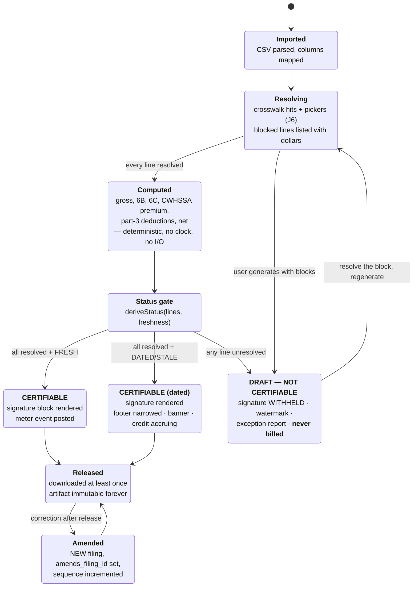

### 7.6 Unhappy paths

| Trigger | What Dee sees | Resolution | Primitive |
|---|---|---|---|
| Ladder at L1/L2 | Banner: *"Newer-revision checks haven't completed since 2026-08-11 04:12 ET. **Rates on your filings are unchanged.** A credit of $24.90 has been applied to your next invoice."* Footer narrows to the dated sentence | Says so, shows the source, narrows the claim, refunds — A3 in one box, with no person offered. The credit is gated by G6 and is not advertised anywhere until the chaos test passes. | P-C |
| Her WD quarantined at L3 | That project narrows to the **last agreed snapshot**, with the date; other projects are untouched | Per-WD blast radius, not fleet-wide. | P-C |
| R2 unavailable at write time | The filing stays in `generated`; the download button reads *"Rebuilding this file — it's a pure function of your inputs, so nothing is lost."* Retries automatically | Artifact generation is deterministic; the object store is a cache of a pure function. Losing it is an availability problem, never a correctness one. | #1 |
| Postgres unavailable | 503 with `Retry-After`, and **never a partial artifact** | The upload is idempotent on `source_sha256`, so retry costs nothing. | fail closed |
| She wants to change a number | She edits the **input** — mapping, or the line — and regenerates. If the filing was never released, the new one replaces it in the UI; if it was released, she gets an **amendment** with a warning that an amended certified payroll is a distinct document | Artifacts are immutable (ADR-013). This is the one place we deliberately make a user slower, and we explain why. | #5 |
| She wants the legacy WH-347 layout because her GC's clerk rejects the new one | A per-project layout flag: `rev-2025-01` (default) or `legacy` | The widely repeated 1 Oct 2026 mandatory-cutover date is **vendor-asserted with no DOL source** (deep dive 04), so we ship both layouts and let the receiving party decide (ADR-012). | #7 |
| She asks how long this took her | Her own median, from her own filings, labelled as hers | The public claim is gated by **G4** — *"median N minutes over N filings"* from `csv_to_artifact_seconds`, never a DOL-derived extrapolation. The copy lint bans any time-saved figure not sourced from that histogram. | G4 |

---

## 8. J8 — WD-change alert, the contract lock, and one-click regenerate

### 8.1 Narrative

Tuesday 02:14 ET. The nightly ingest finds that `CA20260012` now has a revision 5, published 2026-08-11. Dee's project is pinned to revision 4.

**We do not move her pin.** Silently re-pinning would change the rate on a document she already reviewed, and would also assert an effectiveness conclusion we have explicitly refused to draw. Instead: a persistent in-product notice on S12 and S19, plus an email.

S19 shows the thing that makes this journey worth building — the diff, **scoped to her crew**:

```
CA20260012 · pinned revision 4 (published 2026-07-31)
Revision 5 published 2026-08-11 — 11 days after your award date.

  3 of the 31 classifications on this determination changed.
  2 of them are classifications YOUR WORKERS ARE ON:

  Cement Mason  SUCA2020-005   base 38.11 → 39.02   fringe 21.44 → 22.10
      6 of your workers · 214 hours last week
  Laborer Gr.1  SUCA2019-002   base 29.60 → 30.15   fringe 18.02 → 18.02
      4 of your workers · 148 hours last week

  1 changed classification you do not use: Ironworker (CBA group).

EFFECTIVENESS
  Revision 5 published 2026-08-11. Your award date is 2026-07-31.
  FAR 22.404-6 governs which revision applies, and that can turn on a
  finding by the contracting officer, which Ratepin cannot observe.
  WE DO NOT CONCLUDE WHICH REVISION APPLIES TO YOUR CONTRACT.
```

Then three actions, presented with **equal visual weight** — because a pre-selected "update now" would be us making the effectiveness call by UI affordance, which is precisely the conclusion we just declined to draw:

- **Keep revision 4.** (Nothing happens. The notice stays, unnagging.)
- **Pin revision 5 going forward.** (New `wd_pins` row; the old pin is retained forever.)
- **Pin revision 5 and regenerate my unfiled weeks.** (One click; only weeks not yet released.)

Equal weight means equal in every dimension that carries meaning: same button style, same size, same order every time, no colour that reads as recommended, no "most contractors do this", and the keyboard focus lands on none of them. A default here would be a legal conclusion rendered in CSS.

Filed weeks are handled separately, behind an explicit second step, because regenerating a released filing produces an **amendment**, and an amendment is a legal act, not a refresh.

And beneath the three, a fourth thing that is not an action but an **assertion she can record** — MED-9's resolution, and the case this screen previously had no room for: *my contract incorporates revision 4 at award.* See §8.4.

### 8.2 Sequence

```mermaid
sequenceDiagram
    autonumber
    participant J as nightly ingest 02:00 ET
    participant PR as promotion
    participant DB as Postgres
    participant N as notices
    participant E as email
    actor D as Dee
    participant W as web S19

    J->>PR: index + document paths agree, probes green
    PR->>DB: promote snapshot; CA20260012 rev 5 now in mirror
    PR->>DB: stamp freshness_checked_at on every verified pin
    Note right of DB: Verification, not change, is the event.

    PR->>DB: compute per-classification diff rev 4 → rev 5
    DB->>N: WD-change notice for every pin on CA20260012
    N->>E: email (best effort)
    N-->>W: persistent in-product notice (normative)

    D->>W: open S19
    W->>DB: diff, JOINed to HER payroll lines
    W-->>D: which classifications moved, which of HER workers are on them,<br/>hours affected, and the FAR panel that concludes nothing

    alt Keep revision 4
        D->>W: keep
        W-->>D: notice persists; project page shows "pinned rev 4; rev 5 published 2026-08-11"
    else Keep revision 4 AND record the contract lock (§8.4)
        D->>W: keep + "my contract incorporates rev 4 at award"
        W->>DB: SET wd_revision_locked_at_award = true, with actor + timestamp
        W-->>D: notice becomes INFORMATIONAL for every future revision;<br/>footer narrows to the recorded-assertion sentence (<b>P-C</b>)
        Note right of DB: HER assertion, stored and dated.<br/>We still conclude nothing. (<b>P-D</b>)
    else Pin revision 5
        D->>W: re-pin
        W->>DB: INSERT wd_pins (rev 5) — <b>new row, old pin retained</b>
        W->>DB: re-resolve memory on wd_group (survives the revision change)
    else Pin and regenerate unfiled weeks
        D->>W: re-pin + regenerate
        W->>DB: new pin, then regenerate every UNRELEASED filing
        W-->>D: results table; released weeks offered separately as AMENDMENTS
    end
```

### 8.3 Unhappy paths

| Trigger | What Dee sees | Resolution | Primitive |
|---|---|---|---|
| A classification she uses **no longer exists** in revision 5 | The picker (J6) reopens for exactly those titles, on the re-pin screen, before anything regenerates | Memory keyed on `wd_group` means most titles survive the revision bump untouched; only genuinely removed classifications ask. | P-A |
| She ignores the notice for six weeks | It persists. Not a toast, not a badge that clears on view. The project header carries a permanent line: *"pinned revision 4 · revision 5 published 2026-08-11 · 2 of your classifications changed"* | Persistent, factual, and it never nags, never escalates in tone, never emails twice. | #1 |
| The email bounces or lands in spam | Nothing breaks | The **in-product notice is normative**; email is a convenience, and the UI says so: *"We also emailed this. If email is unreliable for you, this page is the record."* See Challenge F (§20). | — |
| She re-pins and the new rates are **lower** | Shown plainly, both directions, no editorial | We show old → new. We do not tell her what to pay. What she owes turns on which revision is incorporated into her contract, which is the conclusion we decline. | P-D |
| She wants amendments for four already-filed weeks | A second, explicit screen listing each week, the dollar delta per week, and the sentence *"Each of these creates a new certified payroll that amends the one you already submitted. That is a document you sign again."* Then one click generates all four | Amendments are `amends_filing_id` filings with incremented `sequence` — our record, not DIR's, because DIR auto-increments `payrollNum`/`amendmentNum` and the XSD declares both `fixed=""`. | #5 |
| Anonymous alert subscriber (no account, D8 channel 3) | The same diff, in the email, for any WD number they asked to watch — with a link to J1 and J3, not to a paywall | The list is built on the exact anxiety we monetise, and the free alert is genuinely complete. | — |
| Ingest is stuck at L1/L2 so no diff is available | No alert is sent, and the banner explains the silence: *"We haven't completed a newer-revision check since {ts}, so no change alerts are being generated. Your rates are unchanged."* | **Silence must be explained**, or a working alert system and a broken one look identical. | P-C |
| **Her contract locked the revision at award and always will** | She records it once (§8.4). Every later revision arrives as an informational line rather than as a decision | MED-9: the modelled case was "a newer revision published, what do you want to do?" The *common* case is "my contract froze revision 2 in March and nothing about that has changed." Without a place to say so, the product asks her the same question every quarter and the answer is always the same. | P-C + P-D |
| She records the lock and later discovers the contracting officer **did** modify the contract | One control on S19, always present, never buried: **"My contract was modified — show me revisions again."** Clears the flag, restores the three equal-weight actions, and the cleared flag is dated in the audit trail like the setting of it | Reversible in one click, because the assertion was hers to make and hers to withdraw. No filing already generated changes; amendments are offered (§4.4.5). | #3 |

### 8.4 The contract-locked project — MED-9

**The case the design was missing.** J8 as originally written models one situation: a newer revision published, and the customer has a live decision to make. That situation is real but it is not the common one. The common one is that the contract incorporated a specific revision at award, the contracting officer has not modified it, and the newer revision has nothing to do with this job for the rest of its life. In that world every WD-change notice, every diff and every one-click re-pin is a quarterly invitation to put the wrong rate on a certified payroll — and all three of them point the same direction.

**What we may not do about it.** We may not detect it, infer it, or conclude it. FAR 22.404-6 governs which revision applies, and the answer can turn on a contracting-officer finding we cannot observe — that is P-D and it does not move. (The regulation is genuinely intricate: modifications published ten or more calendar days before bid opening are effective; there is a 90-day rule when award is delayed; post-award incorporation can be retroactive to the date of award. Verified on acquisition.gov, 2026-08-13. We cite it, we show her the dates, and we stop.)

**What we may do.** Record what *she* asserts, date it, print it, and let it govern our own UI. One boolean, `wd_revision_locked_at_award`, default unset — which is neither yes nor no.

#### 8.4.1 Where it is asked, and the copy

Offered in two places and nowhere else: behind progressive disclosure at project setup (§4.1), for the customer who already knows; and on S19 **the first time a newer revision publishes**, which is the moment the question is finally concrete. Recognition rather than recall, at the point of decision.

> **Does your contract lock this revision?**
>
> ☐ &nbsp;My contract incorporates **CA20260012 revision 4** at award, and my contracting officer hasn't modified it.
>
> Tick this and we'll stop asking. Newer revisions still get published here — you'll see that revision 5 exists and what changed in it — but the re-pin actions move out of your way and your filings keep saying revision 4.
>
> **This is your statement, not ours.** We record it, date it, and print it on the artifact: *"You recorded on 2026-08-02 that your contract incorporates revision 4 at award."* We don't check it, and **we still don't conclude which revision applies to your contract** — FAR 22.404-6 governs that, and it can turn on a finding by your contracting officer that we can't see. If the contract gets modified, untick it in one click.

#### 8.4.2 What changes when it is set, and what does not

| | Lock **unset** (default) | Lock **set** |
|---|---|---|
| WD-change notice | Persistent, factual, unnagging | **Informational.** Same diff, same numbers, same FAR panel — presented as a fact about the determination rather than as a question about her project |
| The three actions | **Equal visual weight**, no default, focus on none | Ordered behind **"Keep revision 4"** — because that is the instruction *she* recorded, not a conclusion *we* drew. The other two remain present, one click away, and are never hidden |
| Footer sentence | *"No newer revision existed as of {ts}."* | **Narrows** — see §8.4.3 |
| Email alerts for this project | Sent | Not sent. The in-product notice remains, because it is the normative surface (§20 Challenge F) |
| The FAR panel | Unchanged | **Unchanged.** It concludes nothing either way, and setting the lock does not make it conclude anything |
| Rates on filings | Revision 4 | Revision 4 |

The middle row is the one that could go wrong, so it is worth being exact about why it is not a contradiction of §8.1's equal-weight rule. **Equal weight is what we owe her when we have no instruction from her.** It is the default precisely because a default would otherwise be us answering a legal question with a button style. Once she has recorded an instruction, following it is not us deciding — it is the same permission boundary that governs classification memory in §6.3.1: **her own confirmed choices may auto-apply; nobody else's may, and neither may ours.**

#### 8.4.3 The narrowed claim — P-C on a superseded pin

The moment revision 5 publishes, the standard FRESH sentence *"No newer revision existed as of {ts}"* becomes **false on this artifact**, and a false freshness sentence is worse than a stale one. So the claim narrows, in both lock states:

| Situation | Footer sentence |
|---|---|
| Pin current, FRESH | *"Rates from CA20260012 revision 4, published 2026-07-31. No newer revision existed as of 2026-08-13 02:41 ET."* |
| **Pin superseded, lock unset** | *"Rates from CA20260012 revision 4, published 2026-07-31. Revision 5 published 2026-08-11 and is not used on this payroll; you have kept revision 4 pinned to this project."* |
| **Pin superseded, lock set** | *"Rates from CA20260012 revision 4, published 2026-07-31. Revision 5 published 2026-08-11 and is not used on this payroll. You recorded on 2026-08-02 that your contract incorporates revision 4 at award."* |

This is P-C in its exact definition: **the artifact and the rate are unchanged; the sentence narrows; the banner is dated.** The rate did not become less correct — our sentence about it became less broad, and we say the narrower true thing instead of the wider false one.

**One deliberate difference from every other P-C in this document: no credit accrues.** The staleness credit exists because L1/L2 narrowing is *our* failure — our ingest did not run. A superseded pin is not a failure of ours at all; it is a fact about her contract that we are reporting accurately. Auto-crediting for it would be paying customers for the product working. The two cases share a primitive and not a remedy, and §11.6's credit arithmetic reads `freshness_state`, never `pin_superseded`.

#### 8.4.4 What this costs, and the honest downside

One boolean, one checkbox, one sentence on the artifact, one reversal control. Against that: it removes the product's single largest opportunity to nudge a customer onto a rate her contract does not carry — a nudge delivered, before this change, by three UI affordances all pointing the same way, on the one screen where the stakes are a rate on a signed federal document.

The downside is real and is recorded as **H-J8b** (§21): a customer who ticks the box wrongly — because she assumed a lock her contract does not have — has now silenced the alerts that would have shown her the change. The mitigations are that the diff is still displayed on every visit, the re-pin actions are one click away and never hidden, and the artifact prints her assertion where she and her GC both read it. We do not mitigate it by declining to offer the box, because the alternative is nudging *everyone* in the other direction.

---

## 9. J9 — The Friday multi-project run

**Persona:** Priya, 9 active projects across three states, 68 employees, Multi at $599.

### 9.1 Narrative

Priya opens `/app/week` at 2pm Friday. One screen answers the only question she has: *what still needs doing?*

```
WEEK ENDING 2026-08-14                                    9 projects

  READY TO GENERATE (4)
    Fresno Courthouse        CA20260012 r4   14 workers   payroll uploaded 13:02
    Reno Federal Annex       NV20260008 r1    9 workers   payroll uploaded 13:02
    Tucson VA Clinic         AZ20260031 r2    7 workers   payroll uploaded 13:04
    Madera Airport Apron     CA20260012 r4    6 workers   payroll uploaded 13:04

  NEEDS A DECISION (2)
    Bakersfield Pump Sta.    1 unmapped title — "INSUL HELPER NIGHT"
    Sparks Warehouse         1 unmapped deduction — "GARN-2"

  WAITING ON YOU (2)
    Chandler Data Center     no payroll uploaded for this week
    Modesto Levee            no payroll uploaded for this week

  NARROWED (1)
    Yuma Border Station      AZ20260044 quarantined since 2026-08-12 06:03
                             filings render from the last agreed snapshot

  THIS RUN WILL USE 7 FILINGS.
  You have unlimited filings on Multi. Nothing extra will be billed.
```

She clears the two decisions — and here is the compounding effect: `INSUL HELPER NIGHT` appears on **three** of her projects, all sharing the same `wd_group`, so one pick resolves all three. Then **Run the week**. Seven filings generate as seven independent jobs with idempotency keys. A results table lists each project's outcome. She downloads a single ZIP.

### 9.2 The pre-run cost disclosure

For Priya on Multi the line is trivial. For a Crew customer it is the most important sentence on the page, and it appears **before** the button, never after the charge:

> This run will use **14 filings**. You have **6 included** left this period. The other 8 bill at $2.50 each = **$20.00**. Your overage is capped at $350 — the price of the next plan — and if you hit the cap we upgrade you to Multi automatically and stop charging overage.

No wall, no surprise bill, no salesperson — D4's stated intent, delivered by deep dive 03's included-allowance mechanism rather than by a hard cap (§20 Challenge A). Ramanujam's rule is that the value metric should be single and legible; here it is **the certified filing**, which is also the market's own meter at $1–$12 across incumbents ([Ramanujam & Tacke, *Monetizing Innovation*](https://www.simon-kucher.com/en/insights/monetizing-innovation)).

### 9.3 Flow

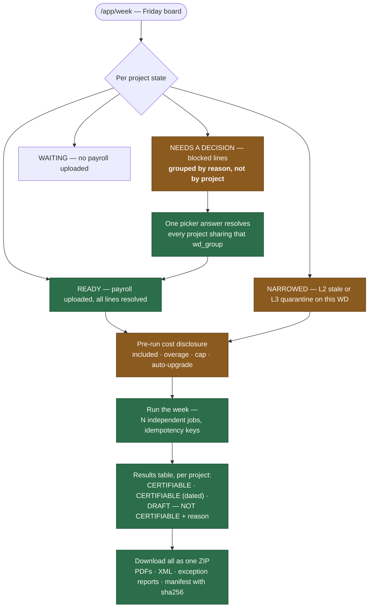

### 9.4 Unhappy paths

| Trigger | What Priya sees | Resolution | Primitive |
|---|---|---|---|
| One project's WD is quarantined (L3) | That row moves to **NARROWED** with the quarantine timestamp; its filings render from the last agreed snapshot with the dated footer. The other eight are untouched | Per-WD blast radius. A fleet-wide banner for a single-WD problem would be a lie in the pessimistic direction. | P-C |
| A job fails mid-batch (transient) | Its row shows `retrying`, then the outcome. The other rows are unaffected | Independent jobs, leases, idempotency keys: a worker crash re-claims without double-billing or double-generating. | #1 |
| Two projects share a determination but need different classifications for the same title | The picker resolves them together by default and offers *"apply to this project only"* | Memory is per group with a project-scoped override, flagged as an exception in S20. | #7 |
| She crosses her allowance mid-run | Nothing interrupts the run. The overage is disclosed before the button and confirmed after: *"7 filings billed at $2.50 = $17.50 added to your 14 Sept invoice."* | Metering is post-commit and keyed on `filing_id`, so a retry cannot double-bill. | #1 |
| She hits the overage cap | Automatic upgrade, **announced at 80% and again at the moment it fires**, with a one-click *"put me back on Crew"* | Auto-upgrade without warning is a dark pattern; auto-upgrade with a pre-warning and a symmetric undo is a service. See J11. | #3 |
| She uploads one CSV containing all nine projects | Component **M** maps a project column; the import fans out into nine per-project imports | The alternative — nine uploads — is the single biggest time cost in her week, and it is the one heuristic-#7 investment that matters most at Multi. | #7 |
| One project's contract-value band is still `unknown` | That row sits under **NEEDS A DECISION** with the one question inline, resolvable without leaving the board. It still runs — it produces a draft — and the results table names it as **DRAFT — NOT CERTIFIABLE · contract-value band** | Project-scoped, so unlike a classification block it cannot be resolved for nine projects at once: nine projects can be nine contracts. The board groups blocks by reason, and this reason simply has a group size of one. It is also **never billed**, like every draft. | P-B |
| Three projects have no payroll because those crews didn't work | She marks them **"no work performed this week"** | This is a real certified-payroll concept and it produces a proper no-work filing rather than a gap in the sequence. Absence of a filing and a filing of absence are different things to an auditor. | #2 |

---

## 10. J10 — California eCPR export

### 10.1 What we cannot do for her, said at setup

Challenge 4 in ARCHITECTURE §16, first flagged in deep dive 04: **California revenue arrives a gate later than the pitch implies.** eCPR submission requires two identifiers Ratepin cannot obtain on her behalf — her own **PWCR** (Public Works Contractor Registration) number, and a **DIR Project ID**, which exists only after the *awarding body* files a PWC-100 ([DIR eCPR user guide](https://www.dir.ca.gov/public-works/ecpruserguide.pdf); [DIR Public Works](https://www.dir.ca.gov/Public-Works/PublicWorks.html)).

So both are collected at project setup as optional fields, with the reason stated:

> **California DIR XML (optional).** To upload an eCPR, DIR needs your contractor registration number and the DIR Project ID that the awarding body created when it filed the PWC-100. We can't get either for you — the first is yours, the second is theirs. Add them and we'll emit the XML. Leave them blank and you still get the WH-347.

### 10.2 One filing, two artifacts, two independent statuses

The most interesting UI problem in the product. A single week's filing produces a WH-347 PDF and a CA eCPR XML, and **federal law and California's schema disagree about the same field**:

- Federal: *"full Social Security numbers and last known addresses, telephone numbers, and email addresses must not be included on weekly transmittals. Instead, the certified payrolls need only include an individually identifying number for each worker (e.g., the last four digits…)"* — 29 CFR 5.5(a)(3)(ii)(B), verified verbatim.
- California: the eCPR XSD declares `ssn` as `[0-9]{9}`, required.

Therefore the same filing can be **CERTIFIABLE as a PDF and BLOCKED as XML**, and S16 shows **two chips**, not one:

```
  WH-347 PDF        CERTIFIABLE            download
  CA eCPR XML       BLOCKED — 2 workers    why?
                    have no SSN on file
```

The XML blocks; the PDF does not. A single blended status would have to lie about one of them.

### 10.3 Sequence

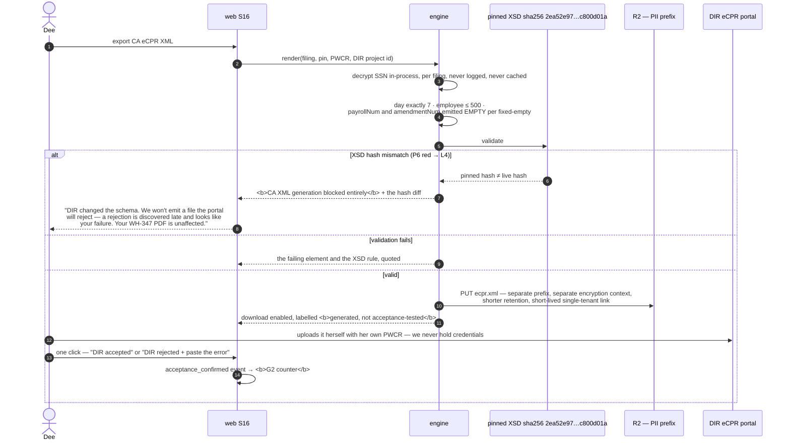

### 10.4 The label that removes itself

Until **G2** clears — ≥50 WH-347s and ≥25 CA eCPR XMLs confirmed accepted, with the XSD hash probe green across the whole window — every XML carries *generated, not acceptance-tested*. The label is **rendered from the counter**, not from a decision (ARCHITECTURE §14), so removing it requires the data. No one can ship a marketing decision past it.

### 10.5 Unhappy paths

| Trigger | What Dee sees | Resolution | Primitive |
|---|---|---|---|
| Missing PWCR or DIR Project ID | The XML button is inert with the reason attached, not hidden | Hidden features generate the exact question we have no channel to answer. | #1 |
| Workers with no SSN on file | XML blocked for those workers only; the two names listed; the PDF unaffected | Add the SSNs (encrypted on receipt) or exclude those workers from the XML with an explicit acknowledgement. | P-B, per artifact |
| More than 500 employees | Blocked with the constraint quoted from the pinned XSD | We do not invent a splitting scheme DIR has not documented. | P-D |
| **L4 — XSD hash mismatch** | XML blocked entirely, the byte-level diff shown, the PDF path untouched, and the DIR cycle explained (checked weekly, daily within ±14 days of 22 Feb and 22 Aug) | The one place we block output. *"Emitting a file the portal will reject is worse than emitting nothing, because rejection is discovered late and looks like our customer's failure."* | P-B |
| **DIR rejects a file that passed our validation** | One click captures it: paste DIR's error. We show the XSD rule if we can map it, and if we cannot we say so exactly: *"Your file validated against schema {sha256}. We can't map DIR's message to a rule in that schema. Here is your XML and the exact schema we validated against."* | An incident row opens automatically (a machine record, not a queue), the case enters the golden canary suite, and it counts **against** G2. No ticket, no reply, no promise of a callback. | P-D |
| She asks us to submit it for her | Refused in copy, permanently | *"We don't file, submit or e-sign, and we don't store portal credentials."* (D9). A whole risk class removed by not having a table. | P-D |

---

## 11. J11 — Billing: upgrade, downgrade, dunning, refund, staleness credit

**Persona:** Priya. The premise (ARCHITECTURE §9): **Stripe webhooks are the only input that moves entitlement state.** Our database records; it never decides.

### 11.1 The plan surface, and why it is ours and not Stripe's

Verified in Stripe's own documentation today: *"If a subscription uses any of the following, the customer can cancel it in the portal, but can't update it: … Usage-based billing."* ([Stripe, Customer portal](https://docs.stripe.com/customer-management)). Our subscriptions carry a metered price for filing overage. So the split is forced, and it is a better split than the one we would have chosen:

| Action | Where | Why |
|---|---|---|
| Cancel · update payment method · view and download invoices | **Stripe Customer Portal** (S22) | Hosted, no PCI surface, no code |
| Upgrade · downgrade · auto-upgrade at the overage cap · self-serve refund · staleness credits · re-check payment status | **Our screen** (S21) | The portal cannot update a usage-based subscription, and these need our entitlement logic anyway |

Portal sessions expire after 5 minutes of inactivity (documented), so S21 always deep-links freshly rather than caching a URL.

### 11.2 The money state machine

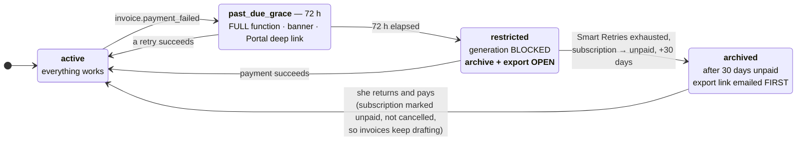

> **Non-payment never destroys data and never closes the archive.** R2's churn analysis names the GC-mandated portal as the top churn vector; a product that holds a contractor's certified-payroll archive hostage during a card failure earns a chargeback and a bad story in a small, connected population. Export-on-cancel is a **capability of the restricted state**, not a favour.

### 11.3 Dunning, without a person

Stripe Smart Retries at the documented recommended default of **8 tries within 2 weeks**, with the post-recovery-failure setting **"Mark the subscription as unpaid"** — chosen over "cancel" so invoices keep drafting and she can return without re-subscribing ([Stripe Smart Retries](https://docs.stripe.com/billing/revenue-recovery/smart-retries)). Three emails: failure, grace ending, restricted. And one branch that matters: **hard declines are not retryable**, so on `lost_card` / `stolen_card` the copy switches from *"we'll try again"* to *"we need a new card"* — the only honest thing to say, and it costs zero human minutes.

### 11.4 Upgrade and downgrade are symmetric

Anti-dark-pattern discipline, stated as a rule the build must not break:

- **Upgrade** — immediate, prorated, one click.
- **Downgrade** — one click, same screen, same visual weight, effective at period end, with an explicit list of what changes (eCPR export, portal bundles, archive depth) and what does not (**the archive itself, and export, never**).
- **Auto-upgrade at the overage cap** — pre-announced at 80% of the cap, announced again when it fires, with a one-click revert.
- **Cancellation** — one click into the Portal. Stripe offers a **cancellation-deflection coupon** and we deliberately **do not enable it**. Peak-end says the exit is disproportionately what gets remembered and repeated ([Fredrickson & Kahneman, 1993](https://pubmed.ncbi.nlm.nih.gov/8355141/)), and D8's entire channel is a small connected population talking to each other.

### 11.5 The self-serve refund, with the policy shown before the click

There is no email address here. There is a button, and above it the encoded policy, so there is nothing to negotiate:

| Situation | Rule |
|---|---|
| $49 bid rate card | Full refund within 14 days, no reason required |
| Subscription, ≤2 certifiable filings this period | Full refund of the current period |
| Subscription, >2 filings this period | Prorated refund of the unused days |
| Any period in which an L2-or-worse incident was open | The credit already accrued; the refund is **additive, not offset** |

Executed by `stripe.refunds.create` with an idempotency key. Deep dive 03 reserves **4% of MRR** for this leak, taking contribution margin from ~95% to ~91%. That is the price of A3, and it is cheaper than a support inbox.

### 11.6 The staleness credit, which she did not ask for

When an L2-or-worse incident is open and attributable to her pinned determinations, `credit_cents = ceil(price × open_days_in_period / days_in_period)`, posted as a **Stripe customer balance credit** — no card round-trip, not disputable as a chargeback, applied automatically to the next invoice ([Stripe customer balance](https://docs.stripe.com/billing/customer/balance)). S21 shows the incident, the days, and the arithmetic. Two safety valves, because an automatic credit is an automatic liability: a per-tenant cap of 100% of the period price, and a **global daily ceiling** that freezes the credit machinery and opens an incident if a probe bug tries to refund the company (ARCHITECTURE §9.4 — fail-closed applied to our own money).

**Per G6 none of this is advertised anywhere** until it has fired correctly in a chaos test with the upstream source killed in staging.

### 11.7 Unhappy paths

| Trigger | What Priya sees | Resolution | Primitive |
|---|---|---|---|
| **She paid, Stripe says active, we still show `restricted`** | A button on S21: **"Re-check my payment status"** | Synchronously pulls the subscription from Stripe and applies it. This is the single worst billing failure mode in a product with no support channel — a stuck restricted state on a Friday — and it is closed by a button, not a ticket. Backed by the daily `/v1/events` replay ([Stripe webhooks](https://docs.stripe.com/webhooks)). | #9 |
| Webhook missed entirely | Converges within a day via replay, idempotent on event id | And the button above makes it instant if she notices first. | — |
| Hard decline | Copy switches to *"we need a new card"* with a Portal deep link | Never *"we'll keep trying"* when Stripe will not. | #9, honesty |
| 3-D Secure challenge | *"Your bank wants to confirm this payment — check your banking app."* | Naming the mechanism prevents the "it's broken" reading of a bank-side prompt. | #2 |
| Chargeback filed | Subscription cancelled, **archive export link emailed immediately**, dunning stops | We do not dun a customer who is disputing. | #3 |
| Overage cap hit, auto-upgrade fires | Email + in-product: *"You passed 140 filings, so we moved you to Multi at $599 and stopped charging overage. You'd have paid $612 on Crew. One click puts you back."* | The upgrade must be defensible as *cheaper for her*, or it is a trap. | #3 |
| She wants a plan we do not sell | *"We sell four prices and they're all on this page. There's no quote, no call and no custom tier — including for us."* | D4: no seats, no setup fee, no quote, no call, ever, at any tier. | P-D |
| A genuine payment dispute needing a person | **One** contact address, on the billing page, **outside the compliance flow** — because a customer who cannot pay cannot use the in-app refund button, and card networks expect it | Every message it receives increments the counter — **every** message, with no triage and no judgement by us. See §11.8. **G5** therefore measures the real thing rather than a claim, and no "zero human minutes" copy ships until 90 days below 2 min/customer/month at ≥50 paying accounts. | measured |

### 11.8 The G5 counter, redefined so that it can fail — MED-2

**The finding.** G5 was written as *"any inbound message **requiring** a human answer increments the counter."* Every other gate in this run is mechanically falsifiable — G1 is an exact match against frozen expectations, G3 is a count delta, G6 is a chaos test that either fires or does not. G5 alone contained a word — *requiring* — that only a person can evaluate, and the person evaluating it is the same person the "zero human minutes" claim flatters. A gate whose input is a judgement call by the claimant is not an instrument; it is a preference with a number next to it.

**The redefinition.** Three properties, and the third is the one that makes the first two true.

**1 — Count everything, decide nothing.**

> `inbound_messages_total` increments on **every inbound message of any kind, delivered to any address the product publishes.** No exclusions, no triage, no category called "didn't need an answer."

The published-address set is a config list, and CI asserts that it is *exactly* the set of addresses appearing anywhere the company can be written to: the copy bundle, the artifact templates, the landing page and its source, the DNS zone's MX-bearing records, the registrar and RDAP records, the Stripe receipt and statement descriptors, and the app-store and directory listings. **An address that can receive mail and is not declared fails the build.** That closes the obvious evasion — moving the load to an address the counter does not watch — because the counter's scope is derived from what we publish, not from what we choose to watch.

Spam, vendor mail, autoresponders, bounces and delivery receipts all land in that raw total. Mechanical filters may derive a smaller number *alongside* it, never instead of it, and each filter must be (a) a named machine-checkable rule — SPF/DKIM failure, a `List-Unsubscribe` header, a known bulk sender — (b) published with its own count, and (c) unable to consume a message that fails no rule. **Anything not machine-classifiable counts as human.** Nobody at Ratepin ever decides whether a message counted.

**2 — Minutes with a floor, so that silence cannot lower the number.**

> `human_minutes += max(1, wall-clock minutes from delivery to first outbound reply from that address)`

The floor exists because "we never replied" must not read as "it cost us nothing" — reading a message and deciding not to answer is the cheapest possible human minute, and it is still a human minute. Never replying to anything is the one strategy that could otherwise drive the gate to zero, and the floor makes it the *worst* strategy rather than the best. Reply time is taken from mail-transport timestamps, not from anyone's recollection.

**3 — Published, so that someone other than us can check it.**

`/status` (S24) carries, monthly and without a login. **The figures below are a layout specimen, not a measurement — nothing has been counted yet, because nothing has shipped:**

```
AUTONOMY — the G5 instrument, published raw          [SPECIMEN LAYOUT]

  Inbound messages, all published addresses     37
  of which machine-classified bulk              31   (SPF/DKIM fail: 22 · List-Unsubscribe: 9)
  Counted as human                               6
  Human minutes, floor-adjusted                 14
  Paying accounts, period average                58
  Minutes per customer per month              0.24
  Consecutive days under 2.00                     67   → G5 clears in 23 days
```

Anyone can divide the last two numbers themselves. **The "zero human minutes"-class claim is rendered from the counter, not from a decision** — the same mechanism §10.4 uses for the *generated, not acceptance-tested* label, so removing the label requires the data rather than an opinion about the data. If the numbers are small this costs nothing to publish. **If they are not, G5 is the gate that was built to say so, and a gate that cannot embarrass its owner was never a gate.**

---

## 12. J12 — Data export and account deletion

### 12.1 Export, available at any tier, at any time, including while restricted

One button, one ZIP, no request form, no waiting period:

```
ratepin-export-coastline-2026-08-13.zip
├── manifest.json                     every file, its sha256, its filing id
├── filings/
│   └── 2026-08-14-fresno-courthouse/
│       ├── wh347.pdf
│       ├── ecpr.xml
│       ├── exceptions.pdf
│       └── provenance.json           wd_number, revision, wd_published_date,
│                                     corpus_snapshot_id + sha, xsd_sha256,
│                                     engine_version, build_sha, generated_at,
│                                     freshness_checked_at, freshness_state
├── payroll_lines.csv                 every line we computed from
├── projects.csv                      + every pin, with revision and published date
├── classification_memory.csv         normalized title → classification, per group
└── README.txt                        what each file is, and what we no longer hold
```

`provenance.json` is byte-identical to the JSON rendered into the artifact itself, so the export is self-verifying: the PDF and the metadata cannot disagree.

### 12.2 Deletion, with the consequence as the headline

Deletion is genuinely self-serve — CCPA's **right to delete** implemented as a button rather than a request form, alongside the **right to know** implemented as the export above ([California AG, CCPA](https://oag.ca.gov/privacy/ccpa)). But it is the one destructive action in the product, so it gets the full treatment: export first, consequence in the headline, typed confirmation, and an undo window.

> ## Deleting Coastline Insulation
>
> **You are required to keep these records for three years.** 29 CFR 5.5(a)(3)(i)(A) requires that payroll records *"be maintained by the contractor and any subcontractor during the course of the work and preserved… for a period of at least 3 years after all the work on the prime contract is completed."* Deleting your Ratepin account does not delete that obligation — it only deletes our copy. **We cannot recover it later.**
>
> **Download your archive first.** [Download 148 filings (312 MB)] — done automatically before deletion unless you turn it off.
>
> **What is deleted:** every project, pin, payroll line, filing and artifact; every worker record including encrypted Social Security numbers; your classification memory; your column mappings.
> **What is not:** anonymous aggregate counts of which payroll titles map to which classifications, which are kept only where **five or more unrelated companies** made the same mapping, which contain no company or worker identity, and which are only ever used to **order** a list of candidates for someone else — never to choose one for them; the public wage-determination mirror, which is public data and was never yours or ours; and billing records, which Stripe retains for tax and card-network purposes.
> **Your subscription** is cancelled immediately and the unused days are refunded automatically.
>
> Type **Coastline Insulation** to confirm.
>
> Deletion is **reversible for 7 days** — the confirmation email has a one-click undo. On **2026-08-20** it becomes permanent.

### 12.3 Flow

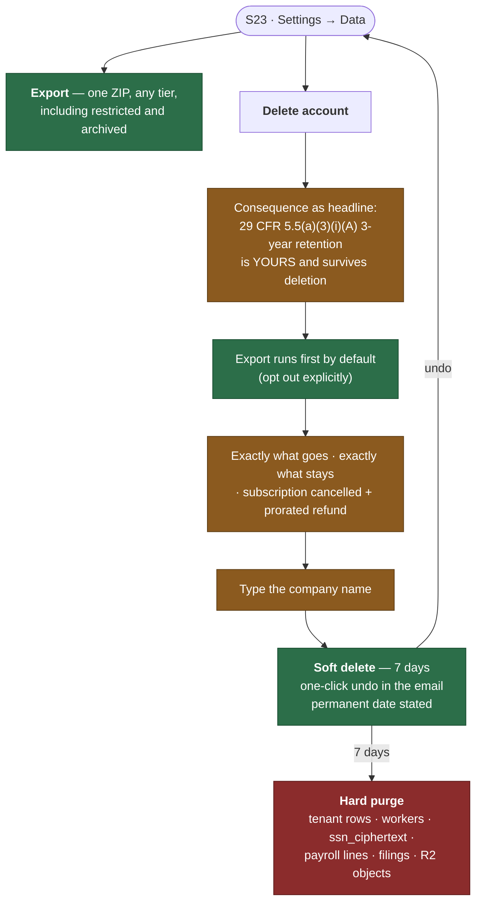

### 12.4 Unhappy paths

| Trigger | What Priya sees | Resolution | Primitive |
|---|---|---|---|
| She deletes, then needs a filing for a DOL investigation 8 months later | Nothing. It is gone | Which is why the retention obligation is the **headline** and the export is **on by default**. Making this fine print would be the single most damaging design decision available to us. | P-D |
| Active subscription at deletion | Cancelled immediately, unused days refunded automatically, stated on the confirm screen | She should not have to cancel first and then delete. Two-step destruction is two chances to leave a subscription running. | #3 |
| She undoes on day 6 | Everything returns, including artifacts; the subscription does **not** auto-resume — she re-subscribes deliberately | Restoring data is a favour; restoring a charge is a liability. | #3 |
| Her mail is down and she never gets the undo link | The undo link is also on S23 for the whole 7 days, visible when signed in | Email is never the sole channel for a reversible destructive action. | #9 |
| She wants only *some* projects deleted | Per-project delete with the same export-first pattern | Account deletion should not be the only exit. | #7 |
| She asks whether her data trained a model | Answered in copy, not by a support reply | *"Your payroll data is never sent to a model. The only thing that ever reaches one is a normalized job title of 128 characters or fewer, and only when a classification is unmapped. The model's response schema has no numeric field, so it cannot emit a rate."* | P-D |

---

## 13. First run to first artifact — the timeline

**This is a design budget, not a measurement.** G4 forbids publishing a time-saved or turnaround figure that is not a measured in-product median across ≥100 real filings, and the copy lint enforces it. Nothing in this section may appear in marketing. It exists so the build knows what it is aiming at and knows when it has missed.

### 13.1 The two first runs

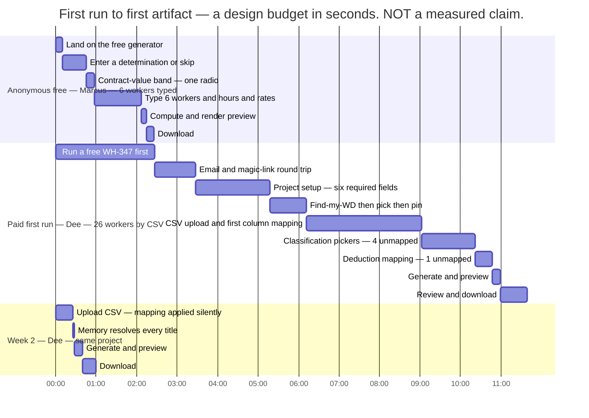

### 13.2 The budget, step by step

| Step | Journey | p50 target | p95 target | What blows the budget |
|---|---|---|---|---|
| Anonymous free artifact, 6 typed workers | J1 | **2:27** | 4:15 | typing, not the system |
| Magic-link round trip | J4 | 1:00 | 3:00 | her mail client, not us |
| Project setup, six required fields | J4 | 1:50 | 3:20 | not knowing the construction type; **not knowing the contract value** (§4.4, H-J4b) |
| Find-my-WD → pin | J4 | 0:55 | 2:00 | several candidate determinations |
| CSV upload + first-time column mapping | J5 | 2:50 | 6:00 | an unusual payroll export |
| Classification pickers, first project (≈4 titles) | J6 | 1:20 | 4:00 | reading scope text carefully, which is the point |
| Deduction mapping, first project | J5/J6 | 0:25 | 1:30 | garnishments and union-style dues codes |
| Generate + render | J7 | **0:12** | 0:30 | engine work, entirely ours |
| Review + download | J7 | 0:40 | 2:00 | reading the artifact, which is the point |
| **First-run total, paid, clean CSV** | | **≈11 min** | ≈26 min | |
| **Second week, same project** | J5–J7 | **≈1:00** | 3:00 | |
| **Friday run, 9 projects, steady state** | J9 | **≈4:00** | 12:00 | one new title on one project |

The shape that matters is not the eleven minutes. It is the **11 → 1** collapse between week 1 and week 2, and it is produced almost entirely by two memories: the column map and the classification crosswalk. If those two do not hold, the product is a form-filler competing on price against CertiWage at $29 and CertifiedPayrollPro at $49, which deep dive 02 says we lose. The memories are the product.

### 13.3 Latency budget inside a step

Nielsen's three limits, unchanged for five decades ([NN/g, Response Times](https://www.nngroup.com/articles/response-times-3-important-limits/)), plus the Doherty threshold's 400 ms ([Laws of UX](https://lawsofux.com/doherty-threshold/)):

| Interaction | Budget | Treatment |
|---|---|---|
| Typeahead (county, classification search) | **< 100 ms** | no feedback needed; it should feel like direct manipulation |
| Column-map proposal, picker candidate list | **< 400 ms** | no spinner; a spinner under 400 ms adds perceived latency |
| Filing generation, single | **< 1 s** p50, < 3 s p95 | inline progress, no modal |
| Friday run, 9 projects | 4–20 s | **per-project rows resolving one by one** — not a percent bar, because a per-item result is more informative than a fraction |
| CSV upload, large file | variable | byte progress, cancellable |

Above 10 seconds Nielsen requires a percent-done indicator and a way to interrupt. The Friday run is the only surface that can exceed it, and it satisfies the requirement with something better: nine independent rows that each reach their own terminal state.

---

## 14. The complete filing state machine

Every screen in §§1–12 renders exactly one of these states. This is the canonical reference; it extends `filings.status` from ARCHITECTURE §5.1.

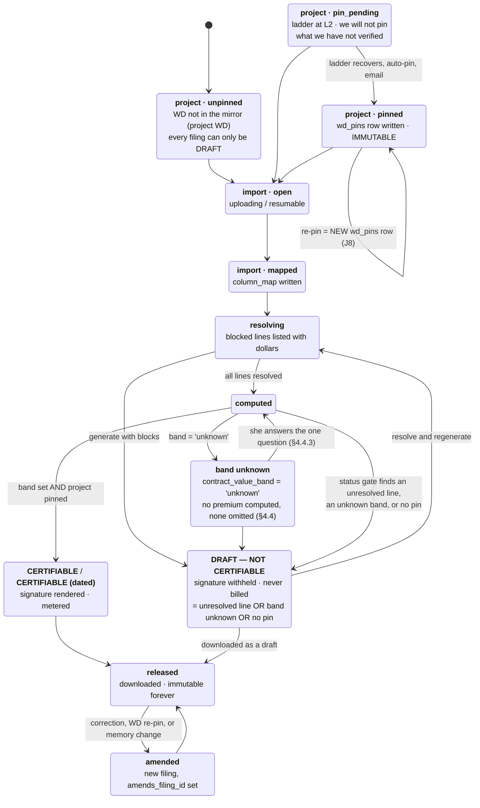

**The free path is not on this diagram, and should not be.** J1 writes no `projects` row, no `wd_pins` row and no `filings` row; nothing survives 24 hours. Its artifact has exactly one status — **DRAFT — NOT CERTIFIABLE** (§1.5) — reached without a gate, because the CERTIFIABLE condition requires a pin the path never creates. A state machine with one state is a constant, and drawing it as a machine would suggest a decision exists.

---

## 15. Nielsen heuristic audit, all ten

| # | Heuristic | Where Ratepin carries it | The specific failure it prevents |
|---|---|---|---|
| **1** | Visibility of system status | The provenance footer's freshness sentences, including the two superseded-pin narrowings (§8.4.3); the ladder banner naming an exact timestamp; per-project chips on the Friday board; the pre-run cost disclosure; *"we also emailed this — this page is the record"*; and `/status` publishing **our own** autonomy numbers raw (§11.8) | A user cannot tell a working system from a silently broken one. **Silence is always explained**: when no WD-change alerts are being generated, we say why. The same rule applied to ourselves is why G5's counter is published rather than reported. |
| **2** | Match between system and the real world | The preview *is* the WH-347, column 1A to column 9, in the form's own headings; classification candidates carry the determination's **verbatim** label and scope text and a link to the source lines; "no work performed this week" is a real certified-payroll concept, not a UI convenience | Renaming the form's own vocabulary would force the user to translate twice — once into our words and once back into the auditor's. |
| **3** | User control and freedom | Re-pin is **never** automatic and the three actions carry equal weight until *she* records an instruction (§8.4); **no candidate is ever pre-selected from another tenant's data** (§6.3.1); upgrade and downgrade are visually symmetric; cancellation-deflection coupons are deliberately disabled; classification memory is editable; deletion has a 7-day undo; auto-upgrade has a one-click revert | A product that decides for you which wage-determination revision applies has made the exact legal conclusion it promised to decline — and a picker that arrives pre-answered from five strangers' accounts has done the same thing to a classification. |
| **4** | Consistency and standards | Component **M** is shared by the free generator and the paid app; one renderer produces the artifact at every tier; `/api/status`, the banner and the footer render from a single source | Free and paid diverging would make the upgrade a re-learning event and would let the free path rot as an untested fallback. |
| **5** | Error prevention | The **status gate withholds the signature block** rather than warning, on all three of its conditions — unresolved line, unknown contract-value band, no pin; unmapped deductions block rather than falling into "Other"; an unprovable premium label blocks rather than silently erasing statutory overtime (§5.4); the union-group refusal fires at project setup, not at generation; duplicate uploads are detected by hash; ambiguous encodings are rejected rather than guessed | A wrong rate on a signed certification is a federal false-statement exposure (R3). A warning can be clicked past; a missing signature block cannot. The contract-value band is the case where the *absence* of a question was the error. |
| **6** | Recognition rather than recall | **Classification memory** keyed on WD group; remembered column maps applied silently; the Friday board shows what is missing instead of asking; the $49 rate card auto-attaches if she later signs up with the same email | Asking a weekly user the same question every week is the single largest avoidable cost in a weekly product. |
| **7** | Flexibility and efficiency of use | One CSV fanning out to nine projects; one picker answer resolving every project on that group; both WH-347 layouts behind a per-project flag; per-project delete as well as account delete | The Multi customer's Friday is nine of everything; without batching, the tier is unsellable. |
| **8** | Aesthetic and minimalist design | `/wh347` is one screen with two affordances and one radio; project setup is six required fields with three refinements behind progressive disclosure; the FAR panel is dense because the density *is* the content | Every field between a searcher and a working WH-347 is a conversion tax on D8's channel — which is exactly why the sixth field had to earn its place, and Challenge B records the argument rather than assuming it. |
| **9** | Help users recognize, diagnose and recover from errors | Every error names the row, the column, the value and the constraint; input is always preserved; *"re-check my payment status"*; the DIR rejection capture; resumable uploads | With no support channel, an unrecoverable error is a lost customer with no intermediate step. |
| **10** | Help and documentation | There is **no help centre and no support widget in the compliance flow** — by design. Help is inline provenance: verbatim scope text next to each candidate, the source line span, the FAR panel, the boundary statement | WCAG 2.2 SC 3.2.6 (Consistent Help) explicitly *"does not require authors to provide help"* — only that help mechanisms which exist be consistently placed. We satisfy it by having none in the flow, and by placing the single billing-dispute address consistently on the billing page. See §18. |

---

## 16. Copy rules that bind every screen

These are lint rules over the copy bundle and the artifact templates (ARCHITECTURE §11.7), not style preferences.

### 16.1 Never assert

Accepted, compliant or approved · that a wage determination is *effective* for a contract · **that a revision is or is not incorporated into a contract** · **that the Contract Work Hours and Safety Standards Act applies to this contract** · that EO 13658's floor applies · that a fringe credit is annualized, bona fide or WHD-approved · that a deduction is permissible under 29 CFR part 3 · that a classification is *correct* · **that another company's classification choice is right for this one** · that a cash payment is genuinely in lieu of a fringe rather than straight-time wage · that an apprenticeship ratio is met · any measured-performance number before its gate clears.

Three of those are new and each has a grammatical tell the lint can catch. Where the product holds a customer assertion — the contract-value band (§4.4), the contract lock (§8.4) — the only permitted sentence form is **"you recorded on {date} that …"**. The forms *"CWHSSA applies"*, *"this contract is covered"*, *"revision 4 governs"* and *"revision 5 does not apply"* are failures, in copy, in artifact templates and in exception-report strings alike.

### 16.2 Two numbers banned by name

| Banned | Why | Say instead |
|---|---|---|
| *"over an hour per employee"* / *"15+ hours a week"* / *"$19,500/yr"* | The DOL burden is **55 minutes per response**, per the form's own page (OMB 1235-0008). Deep dive 01 computed the real figure: 122,936 respondents, 11,310,112 annual responses, 10,556,105 burden hours — **85.9 hours per filer per year**. The shortlist's framing is a misread in the flattering direction | Nothing, until **G4** produces a measured median from `csv_to_artifact_seconds` |
| *"$28,619 civil penalty"* | That is the **False Claims Act per-claim maximum**, not a DBA penalty. DBRA's own remedies are back wages with interest, withholding, and three-year debarment under [29 CFR 5.12](https://www.ecfr.gov/current/title-29/subtitle-A/part-5/subpart-A/section-5.12); CWHSSA liquidated damages are **$33 per worker per calendar day**, itself an inflation-adjusted corpus value with an effective date, never a constant in code | Name the actual remedy, with its citation and its effective date |

### 16.3 Sentence pairs the lint enforces

| ✗ Never | ✓ Always |
|---|---|
| "Your filing is compliant." | "Every line resolved. You certify this; we computed and formatted it." |
| "Revision 5 now applies to your project." | "Revision 5 published 2026-08-11. FAR 22.404-6 governs which revision applies and can turn on a contracting-officer finding we can't observe." |
| "Rates verified." | "Rates from CA20260012 revision 4, published 2026-07-31. No newer revision existed as of 2026-08-13 02:41 ET." |
| "Something went wrong. Contact support." | "This determination's schema hash changed on 2026-08-12. We won't emit XML DIR will reject. Your WH-347 PDF is unaffected." |
| "Saves you 15 hours a week." | (nothing, until G4) |
| "Trusted by hundreds of contractors." | (nothing, until it is true and countable) |
| "CWHSSA overtime applies to this contract." | "You recorded on 2026-08-13 that this contract is over $100,000. The 40-hour overtime clause at 29 CFR 5.5(b) goes into contracts in excess of $100,000." |
| "We couldn't determine CWHSSA coverage, so we skipped the premium." | "We don't know whether the 40-hour rule is in this contract, so we haven't guessed — in either direction. The signature block is withheld until you answer." |
| "Most contractors map this title to Cement Mason." | (nothing beside a candidate. The aggregate orders the list and says so once, in a footnote — §6.3.1) |
| "Recommended" / a pre-filled radio in the classification picker | (no candidate is pre-selected; the confirm button is inert until she chooses) |
| "Revision 5 doesn't apply to your contract." | "You recorded on 2026-08-02 that your contract incorporates revision 4 at award. Revision 5 published 2026-08-11 and is not used on this payroll." |
| "Zero human minutes." | (nothing, until §11.8's published counter has been under 2.00 for 90 consecutive days at ≥50 paying accounts — and then the number, not the adjective) |
| "You can't reconstruct a superseded revision." / "Once SAM overwrites it, it's gone." | (nothing — the sentence is **false**, measured: `wdol/v1/wd/{ref}/{rev}/download` returns a 303 to an S3 archive object and `govconapi.com` resells the series at $19/month. The moat is **assembly, latency and crosswalk memory**, and that is what the copy says — §2.4.) |

### 16.4 Voice

Short sentences. The user's nouns, not ours: *determination*, *revision*, *classification*, *fringe*, *straight time*, *the GC*, *the week ending*. Never *"we're sorry"* for a system state we designed — explain instead ([NN/g error-message guidelines](https://www.nngroup.com/articles/error-message-guidelines/) — avoid blame, avoid "invalid", give constructive advice). Never exclamation marks on a document with a federal certification on the back. Copy is scanned, not read ([NN/g, How Users Read on the Web](https://www.nngroup.com/articles/how-users-read-on-the-web/)), so every block leads with its conclusion.

---

## 17. Empty states, loading states, and first-run

| State | Design | Why |
|---|---|---|
| **No projects yet** | A single primary action and one sentence naming what a project is: *"A project is one federally funded job with one wage determination pinned to it."* | Empty states are the highest-attention screen a new user sees and the cheapest place to teach the product's one central noun ([NN/g](https://www.nngroup.com/articles/empty-state-interface-design/)). |
| **Project with no payroll yet** | The expected CSV shape, with a downloadable 3-row template and the QuickBooks / ADP / Paychex / Gusto export paths named | The most common first-run failure is not knowing what file to produce. |
| **No filings yet** | The Friday board shows the project under **WAITING ON YOU**, not an empty page | An empty page makes the user diagnose; a named state tells them. |
| **Contract-value band unanswered** | Not an empty state — a **blocked artifact** with one question and one button (§4.4.3). Everything else on the filing renders in full | An unanswered question that changes the arithmetic is not "incomplete data", it is an assertion we would otherwise have to invent. |
| **Corpus never yet promoted** (cold start) | `/status` says so, and pinning is blocked with the reason | We fail closed on the claim before we have ever made one. |
| **Generating** | Inline progress under 1 s; the Friday run resolves per-project rows one at a time | Per-item resolution beats a percent bar when items are independent. |
| **Expired free preview** | The exact expiry timestamp and what was deleted | Honest expiry beats a 404, and it is a second chance to explain the paid boundary. |

---

## 18. Accessibility, and the actual machine this runs on

Target: **WCAG 2.2 level AA** ([W3C](https://www.w3.org/TR/WCAG22/)). Three criteria matter disproportionately here.

- **SC 2.5.8 Target Size (Minimum)** — 24×24 CSS px. The classification picker and the Friday board are dense tables of tappable rows, and this is the criterion they will fail first if nobody watches ([Understanding SC 2.5.8](https://www.w3.org/WAI/WCAG22/Understanding/target-size-minimum.html)).
- **SC 3.3.7 Redundant Entry** — do not ask for information the user already supplied. This is the accessibility statement of the same principle the classification memory and the remembered column map implement for business reasons ([Understanding SC 3.3.7](https://www.w3.org/WAI/WCAG22/Understanding/redundant-entry.html)).
- **SC 3.2.6 Consistent Help** — worth stating precisely because our product is unusual: the criterion *"does not require authors to provide help"*; it requires that help mechanisms which **do** exist appear consistently. We have none in the compliance flow (A3), and exactly one billing-dispute address, always in the same place on the billing page. We comply by being consistent, not by adding a channel.

Beyond the standard, the field reality: **status is never conveyed by colour alone** — CERTIFIABLE / DRAFT is a word and an icon before it is green or red, because these documents get printed on monochrome laser printers and faxed. There is a **print stylesheet** for every review screen. The app is keyboard-complete, because a payroll administrator entering 26 workers uses the keyboard and resents the mouse. And nothing depends on hover, because a meaningful share of this work happens on a tablet in a job trailer.

---

## 19. What we deliberately did not design

| Not designed | Why |
|---|---|
| Any support widget, chat bubble, "contact us" or `mailto:` in the compliance flow | **A3.** A lint rule fails the build if one appears under the filing route tree (ARCHITECTURE §13). |
| A help centre or knowledge base | Help that lives away from the decision is help that arrives too late. Every explanation is inline, next to the thing it explains. |
| A product tour, coach marks, or a checklist onboarding | The first run *is* the tour: six fields, one upload, one artifact. A tour would be an admission that the flow needs narrating. |
| An NPS or satisfaction interstitial | The only feedback we collect is the **G2 acceptance confirmation** — a fact about an artifact, not an opinion. Fitzpatrick's rule: ask about what happened, never about whether they like it ([*The Mom Test*](https://www.momtestbook.com/)). |
| Cancellation-deflection coupons | Stripe offers them; we leave them off (§11.4). |
| A "request a demo" or "talk to sales" affordance | D4: no seats, no setup fee, no quote, no call, ever, at any tier. |
| A human review queue at any tier | There is no review table, no reviewer role and no queue. It is not disabled; **it does not exist** (ARCHITECTURE §15). |
| Portal credential storage / auto-submission | D9. A whole risk class removed by not having a table. |
| Any UI that concludes which WD revision is effective | D7 / P-D. The three re-pin actions carry equal visual weight for exactly this reason, and they yield ordering only to an instruction **she** recorded (§8.4). |
| A classification pre-selected, defaulted or annotated from other tenants' data | HIGH-2. The cross-tenant aggregate may **order** a candidate list and may do nothing else. Her own confirmed answers auto-apply; nobody else's do (§6.3.1). |
| A default on the contract-value band | §4.4. Both wrong answers put a number on a signed federal document, so there is no safe side to fall to. `unknown` is a real answer that withholds the signature block, not a null that gets guessed. |
| A signature block on a free artifact | §1.5. No pin, no signature block — and free creates no pin by construction. |
| A triage step in front of the G5 counter | §11.8. Deciding which inbound messages "really needed" a person is the judgement call that made the old gate unfalsifiable. Everything counts; nothing is assessed. |

---

## 20. Challenges to binding decisions — flagged, not silently redesigned

**Challenge A — D4's caps are implemented as ARCHITECTURE's resolution, and the journeys show it.** D4 says *"$99/mo Solo (1 project, ≤15 workers); $249/mo Crew (5 projects, ≤75 workers)."* Deep dive 03 showed every capped tier is dominated on price-per-project by CertifiedPayrollPro ($49 buys 5 projects; $99 buys 25) and that a cap is a churn event rather than an expansion event. ARCHITECTURE §16 Challenge 1 keeps D4's price points and D4's metering of projects and workers, and changes only the pricing *function* to included-filing allowances plus a $2.50 capped overage with auto-upgrade. **J4 and J9 are written against that resolution** — no project cap appears anywhere in this document. Reverting to literal D4 is a `plans` row change with no code change, and would require rewriting J4's "she creates a second project" row and J9's pre-run disclosure.

**Challenge B — "five-field project setup" is now *six* required fields plus three optional refinements.** D4 names four (county, construction type, WD number or find-it-for-me, funding source). It became five with a project name, which the WH-347 header requires anyway. **CRIT-3 makes it six**: `contract_value_band` is required at setup because the alternative — the shipped design — computed a Contract Work Hours and Safety Standards Act premium on contracts the Act's own $100,000 clause threshold does not reach, and told sub-$100k contractors they had underpaid a statute their contract may not carry (§4.4). The refinements behind progressive disclosure are **award/bid date**, **contract number** and the **contract-lock assertion** (MED-9, §8.4).

Two costs, recorded rather than hidden. The award date is not cosmetic: D3's *"per-classification diff since award"* cannot be computed without it, and it cannot be derived from anything we hold; defaulting it to today makes the first diff trivially empty until she corrects it. And the sixth field is a conversion tax on the highest-intent screen in the funnel, paid by every customer to fix an error that afflicts some of them — which is the trade §4.4 argues is worth it, and **H-J4b** (§21) is the instrument that will say whether it was.

**Challenge C — D3's "unlimited" free generator needs abuse protection, and the protection must not be a human.** Implemented as a self-healing throttle plus a Cloudflare Turnstile challenge on burst, with the exact clear-time shown. There is deliberately **no** "contact us to raise your limit" path, because that is a human escalation wearing a growth hat. The word "unlimited" survives in copy only because the throttle self-clears and no request is ever permanently refused.

**Challenge D — L2 STALE should block the $49 sale, not merely block new pins.** D7 says staleness beyond the SLA suppresses **new rate assertions**; ARCHITECTURE §8.1 implements that as "new pins blocked." A bid rate card creates no pin, so a literal reading would let us sell the purest rate assertion in the product while refusing to record one. J3 blocks the sale. This is a tightening in the direction D7 points, it costs revenue rather than earning it, and it is flagged rather than assumed.

**Challenge E — the one contact address is outside the compliance flow, and it is counted without our opinion.** D7 says there is no support contact *anywhere in the compliance flow*. ARCHITECTURE §10.5 adds exactly one address on the billing page, because a customer whose card has failed cannot reach the in-app refund button and card networks expect a contact. This document keeps it there and keeps it out of every filing surface. **MED-2 then changed what "counted" means.** G5 as written incremented on any message *"requiring a human answer"* — a word only a person can evaluate, evaluated by the person the claim flatters, in a run where every other gate is mechanical. §11.8 replaces it: **every** inbound message to **every** address the product publishes, with the published-address set asserted by CI against our own copy bundle, DNS, registrar and receipts; a one-minute floor per message so never replying cannot score zero; and the raw counts published monthly on `/status` so the ratio can be recomputed by anyone. **G5 publishes nothing until 90 days below 2 minutes per customer per month at ≥50 paying accounts** — and now that sentence is checkable from outside the company.

**Challenge F — the WD-change alert email is a channel we do not control.** D5 and D8 both lean on email (change alerts, the free watch list, dunning, the deletion undo). Deliverability is not ours. Every one of those flows therefore has an in-product surface that is **normative**, with email explicitly demoted to best-effort in the copy. The deletion undo link is the sharpest case and it is duplicated on S23 for the full 7 days. Flagged as a hypothesis: nobody has measured our deliverability, because we have sent nothing.

**Challenge G — the free generator now always emits a draft, which is stricter than D3 asked for.** D3 puts the paid line at *"the moment a rate becomes an assertion"* and promises unlimited free generation; it does not say the free artifact must be unsignable. MED-10 showed the gap: the free path printed a WD number and revision from a mirror that may be seventy-two hours unverified, to a visitor with no account and therefore no banner and no credit — a rate assertion with *less* provenance than the one L2 forbids a paying customer from making. Challenge D closed the identical hole for the $49 rate card by refusing the sale. Here there is no sale to refuse, so the artifact refuses instead: **no pin, no signature block** (§1.5). This costs conversion rather than earning it, it is a tightening in the direction D3 points, and the unlimited free generation D3 promised is untouched — every free user still gets the complete form, the complete arithmetic and the complete provenance footer. What they no longer get is our silence about what the document is.

**Challenge H — the contract-lock ordering is the one place a re-pin screen is not perfectly symmetric, and it is her asymmetry, not ours.** §8.1's equal-weight rule exists because a default on that screen would be a FAR 22.404-6 conclusion rendered in CSS. §8.4 lets a customer record that her contract incorporates a revision at award, after which "Keep revision N" is ordered first. The distinction the build must hold: **equal weight is what we owe her in the absence of an instruction from her.** The moment she gives one, following it is obedience, not inference — the same boundary §6.3.1 draws around classification memory, where her own confirmed answers auto-apply and nobody else's ever do. If that distinction is ever softened into "we noticed most customers keep the old revision, so we default to keeping it," the product has drawn the conclusion by aggregate that it refused to draw by button, and MED-9 will have been closed into a worse hole than it opened.

**Challenge I — HIGH-2 costs the crosswalk aggregate its strongest form, and the moat argument has to absorb that.** D6 and the Helmer framing in §6.3 treat the cross-tenant crosswalk as compounding process power. HIGH-2 showed the mechanism was reachable: signup is a free magic link, so "five distinct accounts" is an attacker-controlled input, and the aggregate's most valuable expression — pre-selecting the top candidate — would have turned five sybils into a wrong rate on other people's signed filings. The aggregate is therefore demoted to **ordering only**, permanently and by rule (§6.3.1). This is a real reduction in the asset's power, arriving in the same phase as HIGH-7's finding that the archive moat was measured false. **What survives is: assembly, latency, and the per-account memory — which was always the part that actually removes work from Dee's Friday, and is the part no sybil can touch, because it is hers.** Recorded here rather than absorbed silently, because Phase 3 must inherit the reduced claim.

---

## 21. Open questions and flagged hypotheses

Marked as hypotheses because they are not evidenced, per the run's literature-grounding rule.

1. **H-J1 — Column-map auto-detection hit rate.** *Hypothesis:* a header-name heuristic plus a per-tenant memory maps ≥80% of columns correctly on first upload across QuickBooks Desktop, QuickBooks Online, ADP, Paychex and Gusto exports. Untested; we have not seen a real export from any of them. If it lands materially lower, J5's 2:50 budget is wrong and the first-run total moves.
2. **H-J6 — Picker frequency.** ARCHITECTURE estimates the picker fires ~12× per project-year. Unmeasured. If a project's crew genuinely churns through titles, the "asked once, never again" promise weakens into "asked occasionally," which is a different product.
3. **H-J6b — Does anyone read scope text?** The picker's whole error-prevention value assumes the user reads the verbatim scope paragraph before choosing. If they click the first candidate every time, the model's ranking becomes load-bearing in a way D6 does not intend, and `llm_ranked` entries would need a different treatment from `user_confirmed` ones in the k≥5 aggregate.
4. **H-J7 — Does the DRAFT watermark build trust or destroy it?** The design bet is that a withheld signature block reads as integrity. The opposite reading — "this product couldn't finish the job" — is equally available, and `filings_total{status}` (the DRAFT-to-CERTIFIABLE ratio) is the leading churn indicator precisely because we do not know which reading wins.
5. **H-J8 — Does anyone act on a WD-change alert?** The alert is D8 channel 3 and J8's justification. If the modal response is "keep revision 4" forever, the diff is a comfort feature, not a decision feature, and its position above the fold on S04 is wrong.
6. **H-J3 — Does the $49 rate card sell at all?** Deep dive 01 is blunt: nobody has been asked to pay for Ratepin, and no primary contractor voice was obtained. The rate card is designed as an acquisition instrument at ~$47 contribution with instantaneous payback; that arithmetic holds only if the conversion exists.
7. **Q1 — Does "pinned revision" survive contact with a user who has never thought about revisions?** The entire paid boundary rests on a concept the buyer may not have a word for. The mitigation in this document is to always show the consequence (*"we'll tell you when a newer one publishes"*) rather than the mechanism. Unvalidated.
8. **Q2 — Is the free generator a funnel or a leak?** Deep dive 02 notes PrevailComply already ships a free WH-347 generator, so this is table stakes rather than a wedge. Whether free users convert is H5 in ARCHITECTURE §17 and is Phase 3's problem; the only instrument is the attribution parameter in the provenance footer's URL.
9. **H-J1b — Does an always-DRAFT free artifact convert better or worse?** §1.5 puts H-J7's unresolved question (does a withheld signature block read as integrity or as failure?) onto 100% of the acquisition channel. The design bet is that a document naming its own limits is the most credible thing on a page selling correctness. The opposite reading — *"the free one is crippled"* — is equally available and would show up as a drop in free→signup against the pre-change baseline. Instrumented, not assumed.
10. **H-J4b — Do contractors know their prime contract value?** §4.4's whole design rests on the band being answerable. If a large share of D1 buyers pick *I don't know* and stay there, the required field becomes a wall in front of the first artifact rather than a question, and the fix is not a default — there isn't a safe one — but better recognition support at the clause-list route. The instrument is the distribution of `contract_value_band` at project creation and the share still `unknown` at first generation attempt. **Unmeasured, and it is the largest single risk this change introduces.**
11. **H-J8b — Does the contract-lock box get ticked correctly?** §8.4 hands the customer an assertion that silences her own change alerts. A customer who assumes a lock her contract does not have has quieted the one signal that would have shown her a rate change. Mitigated by keeping the diff visible, the re-pin actions one click away and the assertion printed on the artifact — not by withholding the box, because the alternative nudges everyone the other way. The instrument is the rate at which locks are later cleared via *"my contract was modified"*, which is a proxy and we should say so.
12. **H-J6c — Is the aggregate worth anything once it may only order?** §6.3.1 demotes the cross-tenant prior to ordering-only, and Challenge I concedes that this removes its strongest expression. Whether ordering alone measurably reduces picker time — as against the deterministic signal on its own — has never been measured, and the honest position is that the compounding asset is now the **per-account** memory. Instrument: time-to-choice on the picker, split by whether an aggregate-informed ordering was available.

---

## 22. References

**Usability and interaction literature (all fetched 2026-08-13)**

- https://www.nngroup.com/articles/ten-usability-heuristics/ — Nielsen's ten heuristics; the audit in §15 and the per-journey mapping in §0.7
- https://www.nngroup.com/articles/recognition-and-recall/ — recognition over recall; the basis for the classification memory and remembered column maps
- https://www.nngroup.com/articles/error-message-guidelines/ — *"the very worst error messages are those that don't exist"*; explicit, human-readable, constructive, non-blaming, input-preserving; §16.4 and every unhappy-path table
- https://www.nngroup.com/articles/response-times-3-important-limits/ — the 0.1 s / 1 s / 10 s limits and the percent-done requirement above 10 s; §13.3
- https://www.nngroup.com/articles/progressive-disclosure/ — *"Disclose these secondary features only if a user asks for them"*; J4's two optional refinements
- https://www.nngroup.com/articles/empty-state-interface-design/ — empty states; §17
- https://www.nngroup.com/articles/errors-forms-design-guidelines/ — form error design; J5
- https://www.nngroup.com/articles/how-users-read-on-the-web/ — scanning behaviour; §16.4
- https://www.nngroup.com/articles/wizards/ — multi-step flow design; J4
- https://www.nngroup.com/articles/slips/ — slips vs. mistakes; why the status gate withholds rather than warns
- https://lawsofux.com/doherty-threshold/ — the 400 ms threshold; §13.3
- https://jnd.org/the-design-of-everyday-things-revised-and-expanded-edition/ — Norman, gulfs of execution and evaluation; the provenance panel closes the gulf of evaluation
- https://pubmed.ncbi.nlm.nih.gov/8355141/ — Fredrickson BL, Kahneman D, "Duration neglect in retrospective evaluations of affective episodes," *J Pers Soc Psychol* 65(1):45–55, 1993 — the peak-end rule behind §6.3, §11.4 and J12's exit design
- https://www.w3.org/TR/WCAG22/ — WCAG 2.2
- https://www.w3.org/WAI/WCAG22/Understanding/target-size-minimum.html — SC 2.5.8, 24×24 CSS px
- https://www.w3.org/WAI/WCAG22/Understanding/redundant-entry.html — SC 3.3.7
- https://www.w3.org/WAI/WCAG22/Understanding/consistent-help.html — SC 3.2.6; *"It is not the intent of this success criterion to require authors to provide help"*

**Business literature (per the run's grounding rule)**

- https://hbr.org/2016/09/know-your-customers-jobs-to-be-done — Christensen et al., JTBD; §0.1
- https://www.momtestbook.com/ — Fitzpatrick, *The Mom Test*; §19's rejection of satisfaction surveys in favour of the G2 acceptance fact
- https://www.acquisition.com/ — Hormozi, *$100M Offers*; the pre-payment artifact preview in J3 and the four zero-human risk reversals
- https://www.simon-kucher.com/en/insights/monetizing-innovation — Ramanujam & Tacke; the single-variable value metric in §9.2
- https://www.aprildunford.com/obviously-awesome — Dunford, positioning; the *wage-determination system of record* frame
- https://openlibrary.org/works/OL2734570W/Crossing_the_chasm — Moore, beachhead discipline; §4.3's refusal of union shops at setup
- https://7powers.com/ — Helmer, process power; §6.3's crosswalk aggregate
- https://theleanstartup.com/ — Ries, innovation accounting; why G1–G6 are counters rather than statements
- https://12factor.net/ — config, disposability, logs; the operational assumptions behind §11's state machine

**Regulation, forms and the artifacts themselves (all verified 2026-08-13)**

- https://www.dol.gov/agencies/whd/forms/wh347 — WH-347; OMB 1235-0008, expires 01/31/2028, **55 minutes per response**; columns 1A, 1B, 1C, 1D, 1E, 2, 3, 4, 5, 6A, 6B, 6C, 7A, 7B, 8, 9. Source of the column-4 CWHSSA condition quoted in §4.4: *"On all contracts subject to the Contract Work Hours and Safety Standards Act (CWHSSA), enter hours worked on this project in excess of 40 hours total in the week as overtime ("OT")"* — and of the column 6B/6C **weekly total** instruction (*"Enter the total of the contractor's or subcontractor's contributions…"*, *"Enter the total amount in cash provided in lieu of fringe benefits to the worker during the workweek"*)
- https://www.reginfo.gov/public/do/PRAOMBHistory?ombControlNumber=1235-0008 — ICR history; the revision approved 01/06/2025
- https://www.ecfr.gov/current/title-29/subtitle-A/part-5/subpart-A/section-5.5 — 29 CFR 5.5. Quoted verbatim in this document via the eCFR API: (a)(3)(i)(A) *"preserved… for a period of at least 3 years after all the work on the prime contract is completed"*; (a)(3)(ii)(B) *"full Social Security numbers and last known addresses, telephone numbers, and email addresses must not be included on weekly transmittals… need only include an individually identifying number… (e.g., the last four digits…)"*; (a)(3)(ii)(C) the three certifications of the Statement of Compliance; (a)(3)(ii)(D) that a properly executed WH-347 reverse satisfies (C); (b)(1) *"compensation at a rate not less than one and one-half times the basic rate of pay for all hours worked in excess of forty hours in such workweek"*
- https://www.ecfr.gov/api/versioner/v1/full/2026-08-11/title-29.xml?part=5&section=5.5 — the machine-readable source of those quotations, and of §4.4's **$100,000 CWHSSA threshold**: paragraph (b)'s preamble, verbatim, *"…must cause or require the contracting officer to insert the following clauses set forth in paragraphs (b)(1) through (5) of this section in full … in any contract **in an amount in excess of $100,000** and subject to the overtime provisions of the Contract Work Hours and Safety Standards Act"*, together with (b)(2)'s **$33 per worker per calendar day** liquidated damages
- https://www.ecfr.gov/api/versioner/v1/full/2026-08-11/title-29.xml?part=3&section=3.5 — 29 CFR 3.5, *"Payroll deductions permissible without application to or approval of the Secretary of Labor."* Verified 2026-08-13: **ten** paragraphs, (a) through (j) — not eight. (i) is board, lodging and facilities at reasonable cost; (j) is minimal-value safety equipment the worker bought, which is how boots and safety glasses come off a field crew's cheque. J1 §1.4 and J5 §5.4 corrected to ten
- https://sam.gov/api/prod/wdol/v1/wd/WA20200002/0/download — verified 2026-08-13: **HTTP 303 See Other** → `iae-wdol-sam-gov.s3.amazonaws.com/WDOL_FILES_PROD/DBA/ARCHIVE/FY2020/wa2.r0.txt`. The evidence that a superseded revision *is* reconstructable, and therefore that the sentence banned in §16.3 is false rather than merely unproven (HIGH-7)
- https://www.ecfr.gov/current/title-29/subtitle-A/part-5/subpart-A/section-5.12 — three-year debarment; §16.2
- https://www.ecfr.gov/current/title-29/subtitle-A/part-5/subpart-B/section-5.32 — the overtime base and the fringe-exclusion rule behind the CWHSSA premium
- https://www.dol.gov/agencies/whd/government-contracts/construction — *"contracts in excess of $2,000"*; the coverage sentence in §0.1
- https://www.acquisition.gov/far/22.404-6 — wage-determination effectiveness; the conclusion J3 and J8 decline to draw. Verified 2026-08-13: a modification is effective in sealed bidding when *"received by the contracting agency, or is published on the Wage Determinations at SAM.gov, 10 or more calendar days before the date of bid opening"*; a 90-day rule applies where award is delayed; post-award incorporation can be retroactive to the date of award with an equitable price adjustment. Cited in §8.4 as the reason the contract-lock is **her** assertion and never our finding
- https://www.acquisition.gov/far/52.222-4 — FAR clause 52.222-4, *"Contract Work Hours and Safety Standards Act — Overtime Compensation"*; the clause §4.4.1 names as the recognition route to the contract-value answer, because it flows down into subcontracts and is readable in a clause list
- https://www.acquisition.gov/far/part-22 — FAR 22.305, the prescription for 52.222-4. Verified 2026-08-13: the clause is **not** inserted in contracts *"Valued at or below $200,000"*, a threshold higher than 29 CFR 5.5(b)'s $100,000. The divergence is recorded in §4.4.4 and resolved by deferring to the contract's own clause list rather than by us picking a number
- https://www.dir.ca.gov/Public-Works/Certified-Payroll-Reporting.html — California eCPR requirement
- https://www.dir.ca.gov/Public-Works/PublicWorks.html — contractor registration and awarding-body project registration; J10's prerequisites
- https://www.dir.ca.gov/public-works/ecpruserguide.pdf — the eCPR user guide: PWCR registration, DIR Project ID, XML upload path
- http://www.dir.ca.gov/dlse/CPR-Prod-Test/CPR.xsd — the pinned eCPR schema; `day` 7/7, `employee maxOccurs="500"`, `ssn [0-9]{9}`, `payrollNum`/`amendmentNum` `fixed=""`
- https://www.dir.ca.gov/Public-Works/CPR/CPRSample.xml — sample eCPR instance
- https://sam.gov/wage-determinations — the human-facing source of record, linked from J4's disambiguation
- https://sam.gov/api/prod/sgs/v1/search/?index=dbra&page=0&size=2&is_active=true&sort=-modifiedDate — the DBRA index; revision numbers, publication and modified dates, county rows, construction types — and no rates
- https://sam.gov/api/prod/wdol/v1/wd/VA20260195/2 — the per-WD document endpoint, where the rates and the group identifiers live

**Platform behaviour that shapes these flows (all verified 2026-08-13)**

- https://docs.stripe.com/payments/checkout/custom-success-page — *"You can't rely on triggering fulfillment only from your checkout landing page… Set up a webhook event handler"*; J3's pre-account purchase
- https://docs.stripe.com/checkout/fulfillment — the fulfilment handler
- https://docs.stripe.com/api/checkout/sessions/create — `success_url` and the `{CHECKOUT_SESSION_ID}` template variable
- https://docs.stripe.com/customer-management — Customer Portal capabilities; the verbatim limitation *"If a subscription uses any of the following, the customer can cancel it in the portal, but can't update it: … Usage-based billing"*; cancellation-deflection coupons (deliberately disabled); 5-minute portal-session expiry
- https://docs.stripe.com/billing/revenue-recovery/smart-retries — Smart Retries; 8 tries within 2 weeks; hard-decline codes; the cancel / unpaid / past-due outcomes
- https://docs.stripe.com/billing/customer/balance — customer balance credits; the staleness auto-credit
- https://docs.stripe.com/refunds — the self-serve refund path
- https://docs.stripe.com/api/idempotent_requests — idempotency keys on every money mutation
- https://docs.stripe.com/webhooks — webhooks as the source of truth, and automatic retries
- https://developers.cloudflare.com/turnstile/ — the free generator's self-healing burst protection
- https://oag.ca.gov/privacy/ccpa — the CCPA right to delete and right to know, implemented in J12 as buttons rather than a request form
- https://www.ftc.gov/business-guidance/resources/can-spam-act-compliance-guide-business — double opt-in and one-click unsubscribe on the free WD-change alert list

**Competitive facts that constrain these journeys (verified in the deep dives, 2026-08-13)**

- https://www.certifiedpayrollpro.com/pricing — $49 / $99 / $249 with 5 / 25 / unlimited projects and $5 / $3 / $1 per report, $0 setup; why no project cap appears in J4 or J9
- https://davisbaconrates.com/certified-payroll-software — the incumbent landscape behind D3's repositioning
